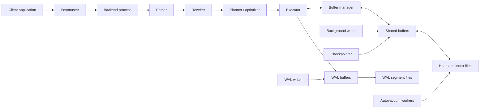
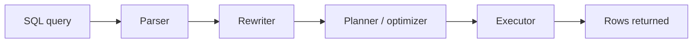
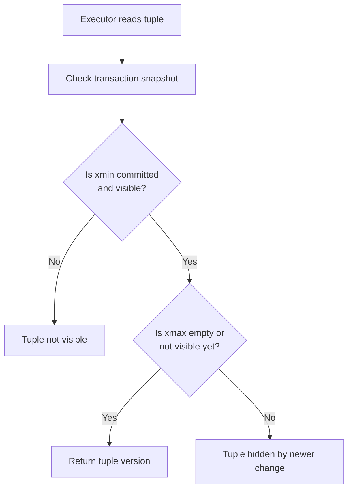
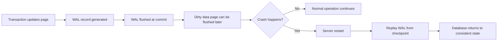

# PostgreSQL Internals

**Name:** Lekhana Dinesh  
**Roll Number:** 24BCS10108

Here I focus on PostgreSQL internals from a system design perspective. I wanted to understand how PostgreSQL actually executes queries, stores rows, manages concurrent transactions, and recovers from crashes. PostgreSQL is often described as feature-rich, but that description becomes much clearer when we look at the actual architecture: postmaster and backend processes, shared memory, heap storage, indexes, MVCC tuple visibility, VACUUM, WAL, checkpoints, and the planner.

## Problem Background

PostgreSQL exists as a general-purpose open source relational database for systems that need correctness, concurrency, extensibility, and serious query processing. It is not just a file format or a small embedded engine. It is a full database server meant to be shared by many sessions and many applications.

Because PostgreSQL targets multi-user workloads, its design must solve several problems at once:

- many clients may read and write at the same time
- failures must not corrupt committed data
- the planner must choose good access paths for different queries
- storage must support both flexibility and reliable recovery
- old row versions must be managed without breaking snapshot isolation

This is why PostgreSQL internals matter. When a query becomes slow, when tables bloat, when autovacuum falls behind, or when an index is ignored, the explanation usually lives inside these internal design choices.

## Architecture Overview

At a high level, PostgreSQL is a client-server system. A client connects to the postmaster, which creates a backend process. That backend parses, rewrites, plans, and executes the query while using shared memory, storage files, and WAL.



This diagram shows two important design ideas. First, PostgreSQL is process-oriented, not library-oriented. Second, query execution and storage are not separate worlds. The executor, buffer manager, shared buffers, heap files, and WAL are all part of one data path.

## Internal Design

### 1. Process architecture: postmaster and backend processes

PostgreSQL implements a process-per-user client/server model. The postmaster listens for incoming connections and spawns a backend process for each new client session. That backend is responsible for parsing queries, creating plans, executing them, and sending results back.

This design is simple to reason about because each session has a dedicated backend process. But it also means process creation, memory management, and inter-process coordination matter to overall performance.

PostgreSQL also relies on several supporting processes:

- **background writer** to help flush dirty buffers gradually
- **checkpointer** to create checkpoints and push dirty pages to disk
- **WAL writer** to flush WAL data efficiently
- **autovacuum launcher and workers** to clean dead tuples and refresh statistics

These background processes are one reason PostgreSQL feels like infrastructure. It is not just waiting for client queries; it is actively maintaining its own internal health.

### 2. Shared memory, shared buffers, and the buffer manager

PostgreSQL uses shared memory so backend processes can coordinate on cached pages, locks, transaction state, and other shared metadata. One of the most important shared-memory regions is `shared_buffers`.

`shared_buffers` is PostgreSQL's buffer cache. When a backend needs a table or index page, it first checks whether that page is already cached there. If it is, the backend can work with the cached page directly. If not, the page is read from disk and placed into shared buffers.

The buffer manager is the layer that tracks these cached pages. It decides how pages are looked up, pinned, marked dirty, and eventually written back.

An important point is that PostgreSQL also relies on the operating system page cache. So `shared_buffers` is not the only cache in the system. This is a design trade-off: PostgreSQL keeps its own database-aware cache, but it still lives on top of the OS and benefits from the OS cache too.

### 3. Heap storage

PostgreSQL stores table rows in heap files. A heap is not a heap in the priority-queue sense. It simply means that rows are stored in table pages without being physically ordered by an index key.

This is different from engines that cluster table data around the primary key. In PostgreSQL, a table row lives in the heap, and indexes are separate access structures that point to tuple locations.

This gives PostgreSQL flexibility. A table can have many indexes without forcing the table itself to be physically organized around any one of them. But it also means an index lookup may still need a heap fetch to get the full row.

### 4. Page layout conceptually

PostgreSQL stores both tables and indexes as fixed-size pages, usually 8 KB. Each page contains a page header, item identifiers, free space, the items themselves, and in the case of index pages, access-method-specific special space.

Conceptually, a heap page works like this:

- the page header tracks metadata and free-space boundaries
- item identifiers point to tuple locations inside the page
- row versions live in the item area
- tuples can move within the page while their item identifier stays stable

This is why PostgreSQL tuple references use a page number plus slot index. It also explains why heap storage and index storage can stay loosely coupled but still address rows efficiently.

The page layout also carries MVCC-relevant metadata. Each tuple header includes fields such as `xmin` and `xmax`, which record the creating and deleting transaction IDs.

### 5. B-tree indexes

PostgreSQL supports several index types, but B-tree is the default and most common one. B-tree indexes are used for equality lookups, range predicates, `IN`, `BETWEEN`, many `ORDER BY` cases, and some pattern-matching situations.

A PostgreSQL B-tree index stores keys plus tuple references into the heap. That means the index narrows down candidate rows, but the heap remains the source of row storage.

This design has three important consequences:

1. Index scans are often fast and selective.
2. Index lookups may still need to touch heap pages.
3. Table bloat and visibility state can affect the real cost of a plan even when an index exists.

### 6. Parser, rewriter, planner, and executor

PostgreSQL query execution is a pipeline, not one giant black box.



The parser checks syntax and produces a query tree. The rewriter can transform the query, especially in cases involving views and rules. The planner then generates possible paths, estimates costs, and chooses a plan. Finally, the executor walks the plan tree and produces the result rows.

The planner is one of PostgreSQL's most important components because it converts declarative SQL into a physical strategy. It chooses between sequential scan, index scan, bitmap scan, nested loop, hash join, merge join, sorting strategies, and more.

### 7. Query execution path in practice

In a normal selective lookup, the execution path is often:

1. client sends SQL to backend
2. parser and planner produce a plan
3. executor follows that plan
4. buffer manager finds or loads needed pages
5. heap and/or index pages are read
6. visible tuples are returned to the client

In a larger join, the executor may combine many nodes: scans, sorts, hashes, aggregates, and joins. But the same storage path remains underneath.

### 8. MVCC using `xmin` and `xmax`

PostgreSQL uses MVCC by storing multiple row versions in the heap over time. Each tuple header includes:

- `xmin`: the transaction that created this tuple version
- `xmax`: the transaction that deleted or superseded this tuple version, if any

When a row is updated, PostgreSQL usually creates a new tuple version instead of overwriting the old one in place. This is the key to PostgreSQL concurrency behavior.

Readers use snapshots to decide which tuple versions are visible. A query does not simply read "the latest bytes on disk." It reads the tuple version that is valid for its snapshot.

### 9. Tuple visibility and snapshots

The following diagram shows the idea in a simplified way:



This is a simplified view, but it captures the important point: visibility is decided by transaction metadata and the reader's snapshot, not only by lock state.

This is why PostgreSQL can allow strong concurrency with less read/write blocking. A reader often walks past row versions that are not visible to its snapshot instead of blocking on them.

### 10. VACUUM and autovacuum

Because PostgreSQL creates new row versions during updates, old tuple versions do not disappear automatically. They become dead tuples that must be cleaned later.

`VACUUM` exists for several reasons:

- reclaim or reuse space from updated and deleted rows
- update visibility information that helps some scans
- refresh statistics when combined with `ANALYZE`
- protect against transaction ID wraparound

Autovacuum is the background system that performs this work automatically for most installations. Without vacuuming, PostgreSQL tables would accumulate dead tuples, planner statistics would become stale, and long-term correctness risks would appear.

This is one of the most important operational lessons in PostgreSQL: MVCC gives good concurrency, but someone still has to clean up the old versions. That "someone" is VACUUM.

### 11. WAL

PostgreSQL uses write-ahead logging for durability. Before changes to data files are trusted, WAL records describing those changes must be flushed to stable storage.

This gives PostgreSQL two major benefits:

1. it does not need to flush every changed data page at commit time
2. it can recover after a crash by replaying WAL records

Because WAL is append-oriented, it is much cheaper to force WAL than to force many scattered data pages on every commit. This is one of the central performance ideas behind PostgreSQL durability.

### 12. Checkpointing

Checkpoints limit how much WAL must be replayed after a crash. A checkpoint means that dirty pages up to a certain point have been flushed enough that recovery can begin from that WAL boundary instead of from much older history.

Checkpoints reduce recovery work, but they also generate write pressure. If checkpoints happen too aggressively, they can cause bursts of I/O. If they are too far apart, recovery after a crash can take longer.

This is why checkpoint tuning matters in busy systems.

### 13. Crash recovery

The crash recovery flow can be understood like this:



The important point is that WAL is the durable truth during the vulnerable window before dirty pages reach their final place on disk.

### 14. Query planner statistics and `pg_statistic`

The planner needs row-count and distribution estimates to choose good plans. PostgreSQL stores planning information in system catalogs and exposes useful views such as `pg_stats`.

Statistics help the planner answer questions like:

- how many rows might match a filter?
- how selective is this column?
- should a sequential scan be cheaper than an index scan?
- which join order is likely to be best?

If statistics are stale, estimates become less reliable. That can lead to poor plans even when indexes exist. This is why `ANALYZE` matters and why autovacuum's statistics work is just as important as its cleanup work.

### 15. `EXPLAIN ANALYZE`

`EXPLAIN` shows the chosen execution plan. `EXPLAIN ANALYZE` actually runs the query and reports what really happened, including actual row counts and timing.

This makes it one of PostgreSQL's most useful learning tools. It lets us compare:

- estimated rows vs actual rows
- planned access path vs real behavior
- where time is spent in the plan tree

If the estimate and actual values are far apart, the planner may be missing good statistics or may be working with a difficult data distribution.

## Design Trade-Offs

PostgreSQL's internal design is powerful because each component solves a real problem. But each one also adds cost.

| Design choice | Benefit | Cost / Limitation | Practical impact |
| --- | --- | --- | --- |
| Process-per-user model | Strong session isolation and simpler per-backend reasoning | More process overhead than a threaded embedded engine | Good for shared server workloads, but not lightweight |
| Shared buffers | Database-aware page caching | Must be tuned alongside OS cache behavior | Cache sizing affects performance and checkpoint pressure |
| Heap table plus separate indexes | Flexible storage and many indexing options | Index access may still need heap fetches | Index existence does not remove all I/O |
| MVCC with tuple versions | Readers and writers coexist well | Dead tuples accumulate until vacuumed | Great concurrency, but ongoing cleanup is necessary |
| Tuple visibility via `xmin`/`xmax` | Correct snapshot behavior | Visibility checks add complexity | Explains many real execution costs |
| WAL | Strong durability and crash recovery | Extra logging and checkpoint management | Essential for safe commits |
| Checkpointing | Limits recovery work after crashes | Can create bursty I/O if poorly tuned | Important for sustained write performance |
| Autovacuum | Automatic cleanup and stats maintenance | Can fall behind under bad settings or heavy churn | Operational tuning still matters |
| Planner statistics | Better plan choices | Can become stale or insufficient for skewed data | `ANALYZE` quality directly affects plans |
| `EXPLAIN ANALYZE` visibility | Helps diagnose real behavior | Adds overhead because it runs the query | Best tool for understanding plans, not just guessing |

The overall pattern is similar to many mature DBMS designs: PostgreSQL trades simplicity for correctness, observability, and multi-user capability.

## Experiments / Observations

These experiments are written so they can be run on a local PostgreSQL instance. I have marked this output as sample/expected because I did not run this experiment locally.

### Experiment 1: Indexed lookup with `EXPLAIN ANALYZE`

**Purpose.**  
To observe a selective lookup using a B-tree index and to compare estimated rows with actual rows.

**SQL.**

```sql
CREATE TABLE enrollments (
    enrollment_id INT PRIMARY KEY,
    student_id INT NOT NULL,
    course_code TEXT NOT NULL,
    semester TEXT NOT NULL,
    grade TEXT
);

CREATE INDEX idx_enrollments_student_id
    ON enrollments (student_id);

INSERT INTO enrollments VALUES
    (1, 101, 'DBMS301', 'S5', 'A'),
    (2, 102, 'OS302',   'S5', 'B'),
    (3, 103, 'DBMS301', 'S5', 'A'),
    (4, 104, 'CN303',   'S5', 'B'),
    (5, 105, 'DBMS301', 'S5', 'A');

ANALYZE enrollments;

EXPLAIN ANALYZE
SELECT *
FROM enrollments
WHERE student_id = 103;
```

**Sample output.**

```text
Index Scan using idx_enrollments_student_id on enrollments
  (cost=0.13..8.15 rows=1 width=72)
  (actual time=0.020..0.021 rows=1 loops=1)
  Index Cond: (student_id = 103)
Planning Time: 0.110 ms
Execution Time: 0.040 ms
```

**Observation.**  
The expected result is an index scan because `student_id = 103` is highly selective and the index directly supports it. The estimate `rows=1` and the actual result `rows=1` are close, which usually means the statistics are doing their job well.

**What it proves.**  
This shows the planner using both index metadata and statistics to decide on an access path.

### Experiment 2: Estimated rows vs actual rows after statistics drift

**Purpose.**  
To understand why stale statistics can lead to less accurate plans.

**SQL.**

```sql
CREATE TABLE requests_lab (
    request_id INT PRIMARY KEY,
    status TEXT NOT NULL
);

INSERT INTO requests_lab
SELECT g, CASE WHEN g <= 950 THEN 'DONE' ELSE 'FAILED' END
FROM generate_series(1, 1000) AS g;

CREATE INDEX idx_requests_lab_status
    ON requests_lab (status);

ANALYZE requests_lab;

EXPLAIN ANALYZE
SELECT *
FROM requests_lab
WHERE status = 'FAILED';
```

Then imagine many new `FAILED` rows are inserted, but `ANALYZE` is not run yet:

```sql
INSERT INTO requests_lab
SELECT g, 'FAILED'
FROM generate_series(1001, 2000) AS g;

EXPLAIN ANALYZE
SELECT *
FROM requests_lab
WHERE status = 'FAILED';

ANALYZE requests_lab;

EXPLAIN ANALYZE
SELECT *
FROM requests_lab
WHERE status = 'FAILED';
```

**Observation.**  
Before the second `ANALYZE`, the planner may still estimate based on the older distribution where `FAILED` was rare. After `ANALYZE`, the row estimate should become closer to reality and the plan may change if the selectivity changed enough.

**What it proves.**  
It proves that query planning is not only about indexes. It also depends on the freshness of statistics.

### Experiment 3: Multi-table join with `EXPLAIN ANALYZE`

**Purpose.**  
To observe how PostgreSQL plans and executes a join when one table can be filtered first and the other can be reached through an index.

**SQL.**

```sql
CREATE TABLE students_pg (
    student_id INT PRIMARY KEY,
    student_name TEXT NOT NULL,
    dept TEXT NOT NULL
);

CREATE TABLE enrollments_pg (
    enrollment_id INT PRIMARY KEY,
    student_id INT NOT NULL,
    course_code TEXT NOT NULL,
    semester TEXT NOT NULL,
    grade TEXT,
    FOREIGN KEY (student_id) REFERENCES students_pg(student_id)
);

CREATE INDEX idx_enrollments_pg_student_id
    ON enrollments_pg (student_id);

INSERT INTO students_pg VALUES
    (101, 'Aarav', 'CSE'),
    (102, 'Diya', 'ECE'),
    (103, 'Meera', 'CSE'),
    (104, 'Rohit', 'ME'),
    (105, 'Anika', 'CSE');

INSERT INTO enrollments_pg VALUES
    (1, 101, 'DBMS301', 'S5', 'A'),
    (2, 101, 'OS302',   'S5', 'A'),
    (3, 103, 'DBMS301', 'S5', 'A'),
    (4, 103, 'CN303',   'S5', 'B'),
    (5, 105, 'DBMS301', 'S5', 'A');

ANALYZE students_pg;
ANALYZE enrollments_pg;

EXPLAIN ANALYZE
SELECT s.student_name, e.course_code, e.grade
FROM students_pg AS s
JOIN enrollments_pg AS e
    ON s.student_id = e.student_id
WHERE s.dept = 'CSE';
```

**Sample output.**

```text
Nested Loop
  (cost=0.15..16.75 rows=4 width=96)
  (actual time=0.030..0.050 rows=5 loops=1)
  -> Seq Scan on students_pg s
       (cost=0.00..1.06 rows=3 width=36)
       (actual time=0.010..0.013 rows=3 loops=1)
       Filter: (dept = 'CSE'::text)
       Rows Removed by Filter: 2
  -> Index Scan using idx_enrollments_pg_student_id on enrollments_pg e
       (cost=0.15..5.20 rows=1 width=64)
       (actual time=0.008..0.010 rows=2 loops=3)
       Index Cond: (student_id = s.student_id)
Planning Time: 0.220 ms
Execution Time: 0.085 ms
```

**Observation.**  
This sample plan shows a nested loop join. PostgreSQL first scans `students_pg` and keeps only the rows where `dept = 'CSE'`. Since the table is very small, a sequential scan is reasonable here. For each matching student, PostgreSQL then uses `idx_enrollments_pg_student_id` to find related rows in `enrollments_pg`.

The estimated rows and actual rows are close enough to show a sensible plan choice. The outer scan estimates `rows=3` and actually returns `3`. The inner index scan estimates about one matching enrollment per student, while the actual result is a little higher in this sample because some students have multiple enrollments. The `actual time`, `loops`, and final `Execution Time` lines are useful because they show what the plan really did, not only what the planner guessed.

Planner statistics matter directly here. PostgreSQL uses column statistics, exposed through system catalogs and views such as `pg_statistic` and `pg_stats`, to estimate how many rows match `dept = 'CSE'` and how many join matches are likely for each `student_id`. If those statistics are stale, the estimated row counts can drift away from reality, and PostgreSQL may choose a less suitable join strategy.

**What it proves.**  
This experiment shows that multi-table join planning depends on both indexes and statistics. PostgreSQL is not only choosing a join algorithm; it is also estimating how large each step will be before execution starts.

### Experiment 4: VACUUM and autovacuum conceptually

**Purpose.**  
To connect MVCC updates with dead tuples and cleanup.

**SQL.**

```sql
UPDATE enrollments
SET grade = 'A+'
WHERE course_code = 'DBMS301';

DELETE FROM enrollments
WHERE enrollment_id = 4;

VACUUM (VERBOSE, ANALYZE) enrollments;
```

**Expected observation.**  
The update creates newer tuple versions and the delete leaves dead space behind. `VACUUM` should clean reusable space and `ANALYZE` should refresh planner statistics.

**What it proves.**  
It shows that PostgreSQL concurrency and storage cleanliness are connected. MVCC is powerful, but cleanup is part of the design, not an optional extra.

## Key Learnings

Studying PostgreSQL internals made the behavior of the system much easier to understand.

- PostgreSQL is a full server architecture, not just a query engine.
- Heap storage and separate indexes explain why index scans can still involve table access.
- MVCC using tuple versions gives strong concurrency, but it naturally creates cleanup work.
- `VACUUM` and autovacuum are not side features; they are part of normal correctness and performance.
- WAL is the reason PostgreSQL can combine durability with reasonable commit cost.
- Planner statistics are essential because the planner can only choose well if its estimates are reasonable.
- `EXPLAIN ANALYZE` is one of the best ways to connect theory with actual execution.

What stands out most to me is that PostgreSQL works well because its pieces cooperate: process model, buffer cache, heap storage, MVCC, WAL, checkpoints, and the planner all support one another.

## References

1. [PostgreSQL: About](https://www.postgresql.org/about/)
2. [PostgreSQL Documentation - The Path of a Query](https://www.postgresql.org/docs/current/query-path.html)
3. [PostgreSQL Documentation - How Connections Are Established](https://www.postgresql.org/docs/current/connect-estab.html)
4. [PostgreSQL Documentation - Introduction to MVCC](https://www.postgresql.org/docs/current/mvcc-intro.html)
5. [PostgreSQL Documentation - Write-Ahead Logging (WAL)](https://www.postgresql.org/docs/current/wal-intro.html)
6. [PostgreSQL Documentation - Routine Vacuuming](https://www.postgresql.org/docs/current/routine-vacuuming.html)
7. [PostgreSQL Documentation - Using EXPLAIN](https://www.postgresql.org/docs/current/using-explain.html)
8. [PostgreSQL Documentation - Index Types](https://www.postgresql.org/docs/current/indexes-types.html)
9. [PostgreSQL Documentation - Statistics Used by the Planner](https://www.postgresql.org/docs/current/planner-stats.html)
10. [PostgreSQL Documentation - Database Page Layout](https://www.postgresql.org/docs/current/storage-page-layout.html)
11. [PostgreSQL Documentation - Resource Consumption](https://www.postgresql.org/docs/current/runtime-config-resource.html)
