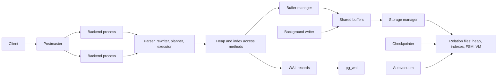
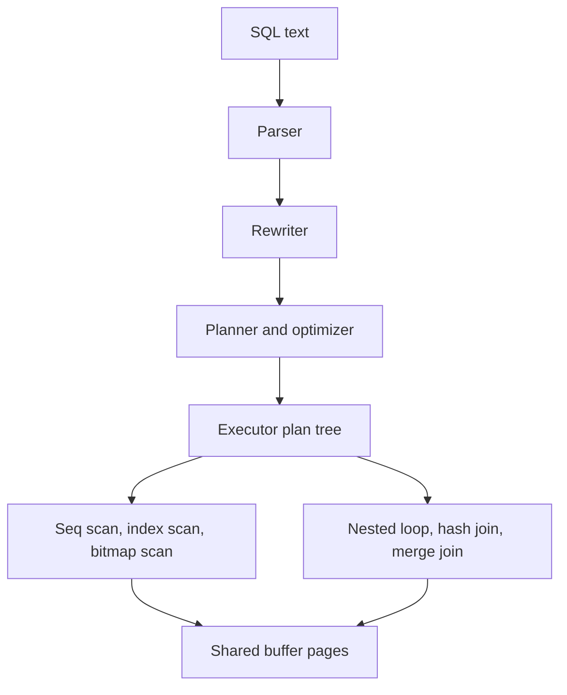
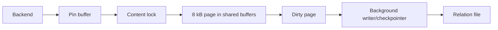
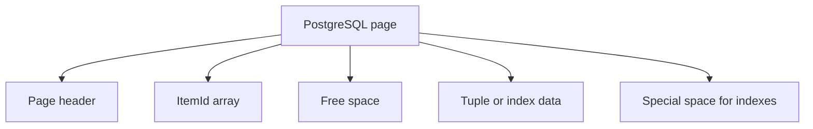
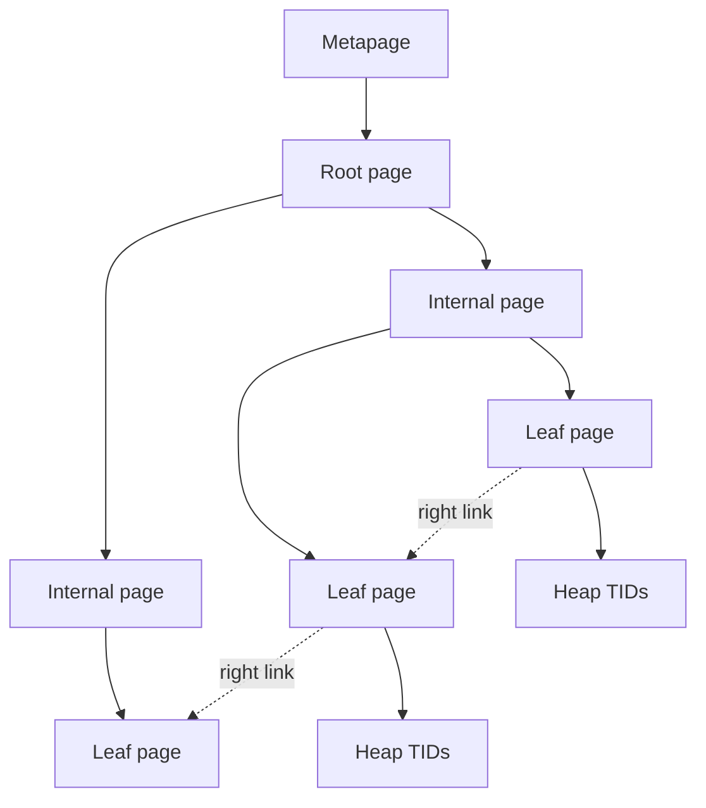
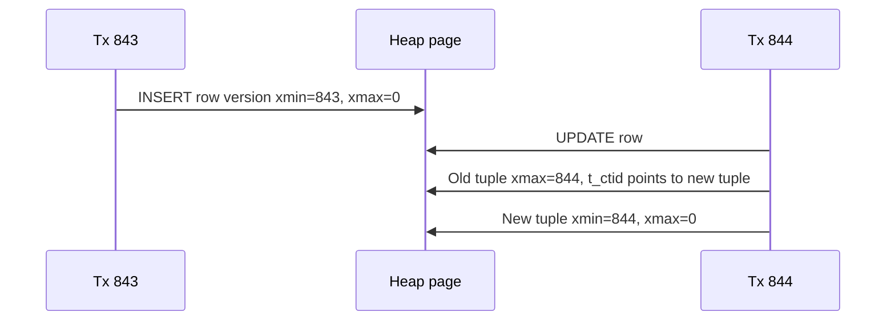

# PostgreSQL Internal Architecture

## 1. Problem Background

PostgreSQL is a client-server relational database system. The system is not only a SQL parser over files; it is a long-running database server that coordinates client backend processes, shared memory, table and index pages, MVCC snapshots, write-ahead logging, checkpoints, vacuuming, and crash recovery.

The internal design problem is: how can many concurrent clients read and write relational data while preserving transactional correctness and durability?

PostgreSQL answers that by separating responsibilities. Backend processes execute SQL, access methods understand heap and index structures, the buffer manager controls page residency and locking in shared buffers, MVCC decides tuple visibility, and WAL records changes before dirty pages must reach data files.

## 2. Architecture Overview



The query path is layered. A backend parses SQL, rewrites it, asks the planner to choose an execution plan, and then the executor pulls rows through plan nodes such as scans, joins, aggregates, and sorts. The executor does not read disk pages directly; it asks access methods and the buffer manager for pages.



## 3. Internal Design

### Buffer Manager

The buffer manager is the shared page cache inside PostgreSQL. A backend pins a buffer while using it so the page cannot disappear, and it takes content locks when it must inspect or modify page contents. The PostgreSQL source buffer README describes buffer pins, shared/exclusive content locks, and rules around changing tuple visibility fields such as `xmin` and `xmax`.

PostgreSQL also uses replacement policy and buffer-access strategy choices to avoid letting large scans destroy useful cache state. The important design point is that the server owns the cache for many clients, unlike an embedded engine where the cache belongs to one process.



### Page Layout

PostgreSQL stores heap and index relations as fixed-size pages, usually 8 kB. A page has a header, item identifiers, free space, tuple or index data, and optional special space. Heap tuples include header fields that support MVCC, including inserting and deleting transaction IDs.



### B-Tree Implementation

PostgreSQL's B-tree access method, `nbtree`, is a multi-level balanced tree. Root and internal pages route searches toward leaf pages. Leaf entries point to heap tuple identifiers. PostgreSQL's B-tree implementation also handles concurrent page splits using right links and high keys, so a search can move right if a page split happened while it was descending the tree.



The trade-off is maintenance work. B-trees make point and range lookups efficient, but updates create index churn. PostgreSQL has B-tree cleanup features such as bottom-up deletion and deduplication to control that churn.

### MVCC, `xmin`, `xmax`, and Visibility

PostgreSQL updates do not overwrite a row in place. An update creates a new tuple version and marks the old version with a deleting transaction ID. A snapshot decides which tuple versions are visible to a transaction.



This design lets readers observe a stable view while writers create newer versions. The cost is cleanup. Dead tuple versions and old transaction IDs require VACUUM and freezing, so maintenance is part of correctness and performance, not optional housekeeping.

### WAL, Checkpoints, and Recovery

PostgreSQL uses write-ahead logging. WAL records are flushed before corresponding data-page changes need to be written to table or index files. After a crash, PostgreSQL starts from a checkpoint and replays WAL records to restore a consistent database state. WAL also supports point-in-time recovery when combined with base backups and archiving.

The trade-off is extra write volume. PostgreSQL writes log records and later writes dirty data pages, but it gains a clear recovery path and can decouple transaction commit from immediate data-file flushing.

## 4. Design Trade-Offs

| Design choice | Benefit | Cost |
| --- | --- | --- |
| Server process model | Centralized memory, WAL, locks, and background work | More operational complexity than an embedded library |
| Shared buffers | Many clients reuse cached pages | Needs contention control and tuning |
| MVCC tuple versioning | Readers and writers can usually proceed concurrently | Dead tuples require VACUUM |
| B-tree indexes | Fast equality, range, and ordered access | Index maintenance and page splits |
| WAL before data pages | Crash recovery and PITR | Extra writes and checkpoint tuning |
| Planner statistics | Better plan choices | Estimates can be wrong when stats are stale or data is correlated |

## 5. Experiments / Observations

I ran these observations locally in Docker using `postgres:18-alpine`, PostgreSQL 18.4, and fake data: 5,000 customers and 100,000 orders. I used them to inspect PostgreSQL mechanisms directly, not to make production benchmark claims.

### Query Plan and Planner Statistics

Filtered join:

```sql
SELECT c.country, COUNT(*), ROUND(SUM(o.total), 2)
FROM orders o
JOIN customers c ON c.id = o.customer_id
WHERE c.country = 'US'
  AND o.status = 'paid'
  AND o.created_at = DATE '2026-06-05'
GROUP BY c.country;
```

Before adding composite indexes, `EXPLAIN (ANALYZE, BUFFERS)` used sequential scans. The important fields are the planner estimate (`rows=691` for the filtered `orders` scan), actual rows (`rows=714`), loops (`loops=1`), and buffer hits (`shared hit=720`):

```text
GroupAggregate  (cost=103.00..2325.52 rows=1 width=43)
  (actual time=19.993..19.995 rows=1.00 loops=1)
  Buffers: shared hit=748
  ->  Hash Join  (cost=103.00..2324.81 rows=138 width=8)
        (actual time=0.799..19.657 rows=714.00 loops=1)
        Hash Cond: (o.customer_id = c.id)
        ->  Seq Scan on orders o  (cost=0.00..2220.00 rows=691 width=9)
              (actual time=0.029..18.486 rows=714.00 loops=1)
              Filter: status='paid' AND created_at='2026-06-05'
              Rows Removed by Filter: 99286
              Buffers: shared hit=720
        ->  Hash  (cost=90.50..90.50 rows=1000 width=7)
              (actual time=0.685..0.685 rows=1000.00 loops=1)
              ->  Seq Scan on customers c  (cost=0.00..90.50 rows=1000 width=7)
                    (actual time=0.092..0.477 rows=1000.00 loops=1)
                    Filter: country='US'
                    Rows Removed by Filter: 4000
Planning Time: 5.155 ms
Execution Time: 20.388 ms
```

After:

```sql
CREATE INDEX idx_orders_status_date_customer
  ON orders(status, created_at, customer_id);
CREATE INDEX idx_customers_country ON customers(country);
ANALYZE;
```

The plan used bitmap index scans:

```text
GroupAggregate  (cost=84.45..835.73 rows=1 width=43)
  (actual time=1.846..1.848 rows=1.00 loops=1)
  Buffers: shared hit=742 read=8
  ->  Hash Join  (cost=84.45..835.03 rows=137 width=8)
        (actual time=0.870..1.736 rows=714.00 loops=1)
        Hash Cond: (o.customer_id = c.id)
        ->  Bitmap Heap Scan on orders o  (cost=15.42..764.20 rows=683 width=9)
              (actual time=0.424..1.128 rows=714.00 loops=1)
              Recheck Cond: status='paid' AND created_at='2026-06-05'
              Heap Blocks: exact=714
              Buffers: shared hit=714 read=5
              ->  Bitmap Index Scan on idx_orders_status_date_customer
                    (cost=0.00..15.25 rows=683 width=0)
                    (actual time=0.333..0.334 rows=714.00 loops=1)
        ->  Hash  (cost=56.53..56.53 rows=1000 width=7)
              (actual time=0.414..0.414 rows=1000.00 loops=1)
              Buffers: shared hit=28 read=3
              ->  Bitmap Heap Scan on customers c  (cost=16.03..56.53 rows=1000 width=7)
                    (actual time=0.168..0.270 rows=1000.00 loops=1)
                    Recheck Cond: country='US'
                    Heap Blocks: exact=28
                    Buffers: shared hit=28 read=3
                    ->  Bitmap Index Scan on idx_customers_country
                          (cost=0.00..15.78 rows=1000 width=0)
                          (actual time=0.152..0.152 rows=1000.00 loops=1)
                          Index Cond: country='US'
                          Buffers: shared read=3
Planning Time: 2.121 ms
Execution Time: 2.221 ms
```

Exact statistics query:

```sql
SELECT attname, n_distinct, most_common_vals,
       most_common_freqs, histogram_bounds, correlation
FROM pg_stats
WHERE tablename = 'orders'
  AND attname IN ('status','created_at')
ORDER BY attname;
```

`pg_stats` showed the planner's sampled facts for the `orders` table:

```text
attname    | n_distinct | most_common_vals                    | most_common_freqs
-----------+------------+-------------------------------------+------------------
created_at | 28         | {2026-06-19,...,2026-06-02}          | {0.03816667,...,0.034}
status     | 2          | {pending,paid}                      | {0.80076665,0.19923334}

correlation:
  created_at = 0.039515126
  status     = 0.68356144

histogram_bounds:
  null for both columns because all values were captured in most_common_vals.
```

`pg_stats` is the readable public view over the underlying `pg_statistic` catalog. `ANALYZE` creates approximate catalog entries that the planner uses for selectivity estimates. In this dataset, `status='paid'` has sampled frequency about `0.199`, and each `created_at` value is around `0.034` to `0.038`. I found it useful that the indexed plan estimated `683` matching `orders` rows and observed `714`, which is close enough for the planner to choose the composite bitmap index path. In this run, PostgreSQL changed access paths after indexes and fresh statistics. That does not prove a general speedup, but it shows how tightly PostgreSQL connects indexes, statistics, and execution plans.

### Page, B-Tree, and MVCC Inspection

Using `pageinspect`:

```sql
SELECT lower, upper, special, pagesize
FROM page_header(get_raw_page('orders', 0));
```

Observed:

```text
lower=580, upper=624, special=8192, pagesize=8192
```

For the composite B-tree index:

```sql
SELECT magic, version, root, level, fastroot, fastlevel
FROM bt_metap('idx_orders_status_date_customer');
```

Observed root page `209` and level `2`, meaning this small index already had multiple B-tree levels.

For MVCC:

```text
after insert visible tuple: xmin=843, xmax=0, ctid=(0,1), val=10
after update visible tuple: xmin=844, xmax=0, ctid=(0,2), val=11
heap_page_items:
  old tuple t_xmin=843, t_xmax=844, t_ctid=(0,2)
  new tuple t_xmin=844, t_xmax=0,   t_ctid=(0,2)
```

This page-level view made MVCC feel less abstract. I could see the update producing a new tuple version and marking the old tuple with the updating transaction ID. That physical detail is what later drives VACUUM work.

### Limitations

My setup was small: generated data, warm local caches, one Docker container, and one query shape. I would use it to understand mechanisms, not to rank production performance.

## 6. Key Learnings

1. I learned to think of PostgreSQL as a layered system: SQL processing, planning, execution, access methods, buffers, storage, WAL, and recovery all meet at query execution time.
2. It was interesting to see MVCC physically in heap pages as tuple versions with transaction IDs. Before this, I understood MVCC conceptually, but `pageinspect` made the storage cost visible.
3. I was mildly surprised by how practical the B-tree implementation is. It is not just a textbook tree; right links and high keys help with concurrent page splits, while cleanup and deduplication reduce index maintenance pressure.
4. The `EXPLAIN ANALYZE` output reminded me not to judge a plan before checking statistics. `ANALYZE` directly affects whether estimates are close enough for useful planner choices.
5. WAL made durability feel very concrete: PostgreSQL logs changes first, writes data pages later, and depends on replay for recovery.

## References

Accessed on 2026-06-23.

- PostgreSQL Documentation: [Architectural Fundamentals](https://www.postgresql.org/docs/current/tutorial-arch.html)
- PostgreSQL Documentation: [Query Path](https://www.postgresql.org/docs/current/query-path.html)
- PostgreSQL Documentation: [Planner/Optimizer](https://www.postgresql.org/docs/current/planner-optimizer.html)
- PostgreSQL Documentation: [Executor](https://www.postgresql.org/docs/current/executor.html)
- PostgreSQL Documentation: [Database Page Layout](https://www.postgresql.org/docs/current/storage-page-layout.html)
- PostgreSQL Documentation: [System Columns](https://www.postgresql.org/docs/current/ddl-system-columns.html)
- PostgreSQL Documentation: [MVCC Introduction](https://www.postgresql.org/docs/current/mvcc-intro.html)
- PostgreSQL Documentation: [Routine Vacuuming](https://www.postgresql.org/docs/current/routine-vacuuming.html)
- PostgreSQL Documentation: [Write-Ahead Logging](https://www.postgresql.org/docs/current/wal-intro.html)
- PostgreSQL Documentation: [WAL Configuration](https://www.postgresql.org/docs/current/wal-configuration.html)
- PostgreSQL Documentation: [B-Tree Indexes](https://www.postgresql.org/docs/current/btree.html)
- PostgreSQL Documentation: [Using EXPLAIN](https://www.postgresql.org/docs/current/using-explain.html)
- PostgreSQL Documentation: [Planner Statistics](https://www.postgresql.org/docs/current/planner-stats.html)
- PostgreSQL Documentation: [`pg_stats`](https://www.postgresql.org/docs/current/view-pg-stats.html)
- PostgreSQL Documentation: [`pg_statistic`](https://www.postgresql.org/docs/current/catalog-pg-statistic.html)
- PostgreSQL Source: [Buffer Manager README](https://github.com/postgres/postgres/blob/master/src/backend/storage/buffer/README)
- PostgreSQL Source: [`nbtree` README](https://github.com/postgres/postgres/blob/master/src/backend/access/nbtree/README)

Footnote: Mermaid diagrams drafted with Claude assistance.
