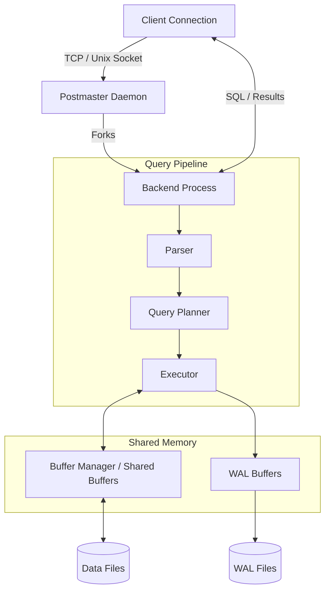

# PostgreSQL Internal Architecture

An in-depth academic exploration of the internal subsystems of PostgreSQL, focusing on how its storage engine, buffer manager, indexing, and concurrency models work together to deliver robust performance and strict durability.

## Table of Contents

1. [Problem Background](#1-problem-background)
2. [Architecture Overview](#2-architecture-overview)
3. [Internal Design](#3-internal-design)
    - [Buffer Manager](#buffer-manager)
    - [B-Tree Internals](#b-tree-internals)
    - [MVCC](#mvcc)
    - [WAL](#wal)
    - [Query Planner & Statistics](#query-planner--statistics)
4. [Design Trade-Offs](#4-design-trade-offs)
5. [Experiments / Observations](#5-experiments--observations)
6. [Key Learnings](#6-key-learnings)
7. [References](#references)

---

## 1. Problem Background

### What PostgreSQL Is
PostgreSQL is a highly extensible, open-source object-relational database management system (ORDBMS). It is designed to handle a broad range of workloads, from single machines to massive data warehouses and web-scale concurrent transactional systems, strictly adhering to ACID properties.

### History and Goals
Originating in 1986 at the University of California, Berkeley as the **POSTGRES** project (led by Michael Stonebraker), its primary goal was to address the limitations of existing relational systems by adding support for complex data types and rules. After transitioning to SQL in 1995 (Postgres95), it was renamed PostgreSQL. Its ongoing engineering goals prioritize **data reliability, strict correctness, massive concurrency, and extensibility** over raw, single-threaded read speed.

### Importance of Studying Database Internals
Operating a database as a "black box" leads to catastrophic performance issues under load. Understanding PostgreSQL internals—how it manages memory, physically stores data, resolves concurrent write conflicts, and plans execution paths—enables engineers to tune configurations accurately, write optimal queries, and predict system behavior during scale-up events.

### Why PostgreSQL is Widely Used for Large-Scale Systems
PostgreSQL scales exceptionally well due to its mature process-per-connection architecture, advanced cost-based query optimizer, and non-blocking Multi-Version Concurrency Control (MVCC). It can gracefully manage hundreds of gigabytes of shared memory caching and efficiently distribute read/write workloads across modern multi-core servers.

---

## 2. Architecture Overview

### Client-Server Architecture
PostgreSQL employs a robust client-server, process-per-connection model.
*   **Postmaster Process:** The main daemon process that listens on a network port. When a client requests a connection, the Postmaster forks a new, isolated backend process.
*   **Backend Processes:** Each client connection is handled by its own dedicated backend process. This isolation ensures that a fatal error in one query crashes only that specific process, leaving the rest of the database and other clients completely unaffected.
*   **Shared Memory:** Because processes do not share memory space by default, PostgreSQL allocates a massive System V / POSIX shared memory segment. This segment houses the Buffer Pool (Shared Buffers), WAL Buffers, and Lock Management structures, allowing all backend processes to communicate and share cached data.

### Query Processing Flow
When a query arrives, it traverses several internal stages:
1.  **Parser:** Validates syntax and generates a parse tree.
2.  **Analyzer/Rewriter:** Applies semantic rules and expands views.
3.  **Planner/Optimizer:** Generates multiple execution paths and selects the lowest-cost physical execution plan based on statistics.
4.  **Executor:** Runs the plan, fetching physical data pages via the Buffer Manager.

---

## 3. Internal Design

### Buffer Manager
*Relevant Source Directory: `src/backend/storage/buffer/`*

The Buffer Manager is the abstraction layer between the database execution engine and the physical OS disks.
*   **Shared Buffers:** A large array of 8KB memory blocks residing in shared memory. It caches table and index pages.
*   **Page Lifecycle:** When the Executor needs a tuple, it asks the Buffer Manager for the specific page.
    *   **Cache Hit:** The page is already in Shared Buffers. A "pin" is placed on it to prevent eviction, and the data is read directly from memory.
    *   **Cache Miss:** The Buffer Manager makes an OS read call to fetch the 8KB page from disk, places it in a free buffer slot, and returns it.
*   **Dirty Page Handling:** When a backend `UPDATE`s or `INSERT`s data, it modifies the page in memory and flags the buffer descriptor as **Dirty**. It does *not* immediately write this page to disk.
*   **Checkpoint Interaction:** The Background Writer and Checkpointer daemons periodically scan the Shared Buffers and asynchronously flush these Dirty pages to the physical disk files, clearing the dirty flag and making the buffers available for reuse.

### B-Tree Internals
*Relevant Source Directory: `src/backend/access/nbtree/`*

PostgreSQL uses the Lehman and Yao High-Concurrency B-Tree variant as its default index structure.
*   **Structure:**
    *   **Root Page:** Top-level node.
    *   **Internal Pages:** Contain index keys and block pointers to child pages.
    *   **Leaf Pages:** Contain index keys and Heap Tuple Identifiers (TIDs), which point to the physical block and offset of the row in the main table heap file.
*   **Search Path:** Begins at the root, performing binary searches within each page to find the correct child pointer, continuing down to the leaf page in `O(log n)` time.
*   **Insert Operations:** The tree is traversed to the correct leaf page. If free space exists, the new key and TID are inserted, preserving order.
*   **Page Split Process:** If the leaf page is completely full, a **Page Split** occurs. A new sibling page is allocated, half the tuples are moved to the new page, and a "pivot" key is pushed up to the parent internal page. This mechanism ensures the B-Tree remains perfectly balanced at all times.

### MVCC (Multi-Version Concurrency Control)
PostgreSQL handles concurrent access by maintaining multiple physical versions of a single logical row, rather than using read/write locks.
*   **Tuple Versioning:** When an `UPDATE` occurs, PostgreSQL does not modify the data in place. Instead, it inserts a completely new physical tuple onto the page.
*   **xmin and xmax:** Every tuple header contains an `xmin` (Transaction ID that created it) and `xmax` (Transaction ID that deleted/updated it).
*   **Snapshot Visibility:** When a transaction starts, it takes a Snapshot. It scans tuples and uses visibility rules: A tuple is visible only if its `xmin` committed *before* the snapshot, and its `xmax` is either 0 or committed *after* the snapshot. Thus, readers see a consistent state of the database without blocking writers.
*   **Dead Tuples:** Old tuple versions where the `xmax` transaction has committed are no longer visible to *any* active transaction. These are "dead tuples."
*   **VACUUM and Autovacuum:** Because PostgreSQL updates are append-only, dead tuples cause severe table bloat. The `VACUUM` daemon scans pages, removes dead tuples, and records the reclaimed space in the Free Space Map (FSM) so future inserts can use it. It also freezes old transaction IDs to prevent wraparound.

### WAL (Write Ahead Logging)
*Relevant Source Directory: `src/backend/access/transam/` (and related WAL dirs)*

The Write-Ahead Log is the mechanism that provides strict ACID Durability while maintaining high write throughput.
*   **WAL Records:** Before a backend modifies a page in Shared Buffers, it constructs a binary record of the change and appends it to the **WAL Buffers**.
*   **Checkpoints:** Transactions only wait for the sequential WAL Buffer to be flushed (`fsync`) to the physical `pg_wal` disk files before acknowledging a `COMMIT`. The heavy, random I/O of flushing the actual dirty data pages happens asynchronously during Checkpoints.
*   **Crash Recovery Process:** If the server crashes, memory is lost. Upon restart, PostgreSQL reads the last valid Checkpoint, and sequentially replays the WAL records (REDO operations) against the data pages on disk, bringing them back to the exact state they were in right before the crash.

### Query Planner & Statistics
*Relevant Source Directories: `src/backend/optimizer/`, `src/backend/commands/analyze.c`*

The planner converts the abstract Query Tree into an actionable physical execution plan.
*   **Planner Workflow:** It evaluates multiple access methods (Seq Scan vs Index Scan) and join algorithms (Nested Loop, Hash Join, Merge Join).
*   **Cost Estimation:** It assigns a mathematical cost to each path based on variables like `random_page_cost` and CPU overhead.
*   **pg_statistic and ANALYZE:** To calculate costs, the planner must estimate **Cardinality** (how many rows a step will return). It relies entirely on the `pg_statistic` catalog. The `ANALYZE` command samples table data and populates this catalog with:
    *   **Histograms:** For range query selectivity.
    *   **Most Common Values (MCV):** For highly skewed data distributions.
    *   **Correlation Coefficients:** To estimate the cost of fetching heap tuples from an index.

---

## 4. Design Trade-Offs

### Architectural Trade-Off Tables

| Subsystem | Advantages | Limitations |
| :--- | :--- | :--- |
| **Buffer Manager** | Fast Clock-Sweep page eviction; leverages OS caching. | "Double buffering" wastes memory; requires complex `shared_buffers` sizing. |
| **MVCC** | Readers do not block writers; consistent snapshot isolation without massive lock tables. | Causes table bloat; places heavy reliance on the background `VACUUM` process. |
| **WAL** | Extremely fast sequential writes guarantee durability without blocking transaction commits. | Write Amplification (data written to WAL, then to heap); heavy checkpoints cause I/O spikes. |
| **Query Planner** | Cost-based routing adapts perfectly to varying data distributions. | Catastrophic misestimations (e.g., choosing Nested Loops for millions of rows) if `ANALYZE` stats are stale. |

---

## 5. Experiments / Observations

### Experiment 1: EXPLAIN ANALYZE on a Multi-Table Join
*   **Objective:** Observe the planner's node selection and statistical accuracy.
*   **Setup:** Join two tables: `orders` (1M rows) and `customers` (10K rows) using `EXPLAIN ANALYZE`.
*   **Observation:** The planner chooses a `Hash Join`. The output shows `(cost=... rows=EST_ROWS)` alongside `(actual time=... rows=ACTUAL_ROWS)`.
*   **Analysis:** The `Hash Join` is chosen because estimating 1M lookups via a Nested Loop is too costly. The closeness of `EST_ROWS` to `ACTUAL_ROWS` proves the accuracy of the underlying `pg_statistic` data.

### Experiment 2: Sequential Scan vs Index Scan
*   **Objective:** Understand how the planner weighs random vs sequential I/O.
*   **Setup:** Query `SELECT * FROM users WHERE created_at > '2020-01-01'` (returns 90% of table) versus `> '2024-01-01'` (returns 1% of table).
*   **Observation:** The 90% query forces a `Seq Scan`. The 1% query uses an `Index Scan`.
*   **Analysis:** The planner knows that bouncing between an index leaf page and random heap pages (`random_page_cost`) for 90% of the table is vastly slower than simply reading the heap file sequentially (`seq_page_cost`), even if an index exists.

### Experiment 3: MVCC Demonstration
*   **Objective:** Physically observe non-blocking reads.
*   **Setup:** Session A starts a transaction and updates a row. Session B queries the exact same row before Session A commits.
*   **Observation:** Session B successfully returns the *old* value of the row instantly, without hanging.
*   **Analysis:** Session A created a new tuple version with its `xmin`. Session B's snapshot dictates that Session A's `xmin` is not yet visible, so it reads the old tuple version, completely bypassing write locks.

### Experiment 4: VACUUM Analysis
*   **Objective:** Observe dead tuple bloat.
*   **Setup:** Rapidly `UPDATE` a single row 50,000 times. Check table size using `pg_relation_size()`. Run `VACUUM VERBOSE`.
*   **Observation:** The table size grows to several megabytes, even though only 1 logical row exists. `VACUUM VERBOSE` output shows thousands of dead tuples removed.
*   **Analysis:** Every update was an insert. `VACUUM` is strictly required to scan the pages, mark the `xmax` tuples as dead, and update the Free Space Map.

### Experiment 5: WAL Activity Observation
*   **Objective:** Confirm WAL is written before data files.
*   **Setup:** Monitor `pg_ls_waldir()` size. Run a massive bulk `INSERT`.
*   **Observation:** The WAL directory size spikes instantly. The actual `PGDATA` heap files grow later (or during the next checkpoint).
*   **Analysis:** The transaction was committed by flushing to the WAL. The dirty pages remained in Shared Buffers until the Checkpointer asynchronously synced them to the heap files.

---

## 6. Key Learnings

### Subsystem Summaries
*   **Buffer Manager Flow:** Pages are read from Disk → placed in Shared Buffers → modified (marked Dirty) → asynchronously flushed to Disk during Checkpoints via the Clock-Sweep algorithm.
*   **B-Tree Operations:** B-Trees provide `O(log n)` access to heap TIDs. They dynamically stay balanced by performing page splits and pushing pivot keys upward when leaf pages fill.
*   **MVCC Concurrency:** By stamping tuple headers with `xmin` and `xmax` transaction IDs, PostgreSQL allows infinite concurrent readers to view consistent past snapshots of the data while writers append new versions simultaneously.
*   **VACUUM Necessity:** Because MVCC never updates data in place, obsolete tuple versions accumulate. `VACUUM` is mandatory to reclaim this disk space and prevent Transaction ID wraparound failure.
*   **WAL Durability:** Writing 8KB data pages to disk randomly is too slow for commits. PostgreSQL guarantees durability by appending a fast, sequential binary log of the changes to the WAL.
*   **Planner Statistics:** The execution plan is entirely dependent on `ANALYZE` sampling data. Without histograms and MCV lists, the database cannot perform efficient joins.

### Core Architectural Answers
*   **Why PostgreSQL scales well for multi-user workloads:** Its process isolation prevents cascading crashes, while its massive shared memory cache and MVCC implementation allow thousands of cores to read and write without locking each other out.
*   **Why MVCC is preferred over heavy locking:** In lock-based systems (like SQLite), a writer blocks all other writers and sometimes readers. MVCC trades disk space (storing multiple versions) for extreme concurrency, which is paramount in web-scale environments.
*   **Why statistics are critical for query optimization:** SQL is declarative; it tells the engine *what* to get, not *how*. Without accurate statistics, the engine will inevitably choose an exponentially slower $O(N^2)$ Nested Loop join over an $O(N)$ Hash join.

### Final Conclusions
PostgreSQL's internal architecture is a masterclass in distributed systems design. It achieves extreme reliability and concurrency not through magic, but through rigorous engineering trade-offs: utilizing WAL for fast durability, MVCC for lock-free concurrency, and heavy background daemons (Autovacuum, Checkpointer) to clean up the resulting mess. Understanding these internals is the difference between operating a database blindly and engineering a scalable data tier.

---
## References
*   [PostgreSQL Official Documentation](https://www.postgresql.org/docs/)
*   [The Internals of PostgreSQL (Hironobu Suzuki)](https://www.interdb.jp/pg/)
*   PostgreSQL Source Code: `src/backend/storage/buffer/`
*   PostgreSQL Source Code: `src/backend/access/nbtree/`
*   PostgreSQL Source Code: `src/backend/access/transam/` (WAL)
*   PostgreSQL Source Code: `src/backend/optimizer/` (Planner)
