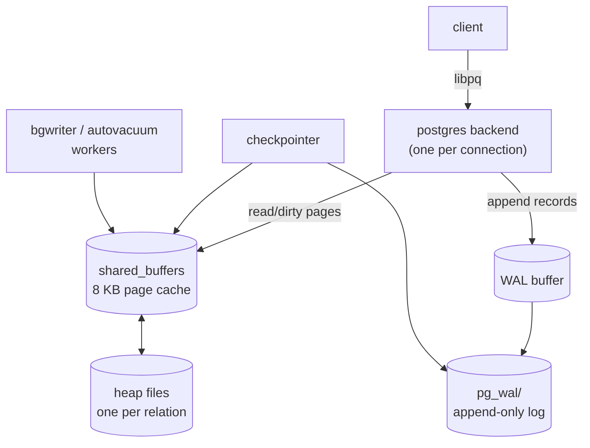

# PostgreSQL Internals

> What's actually inside a heap page, how MVCC writes show up as live and dead row versions, what VACUUM is for, and where the WAL is when the lights go out. Everything below is observable from a running Postgres — `pageinspect`, `pgstattuple`, and `EXPLAIN (ANALYZE, BUFFERS)` are doing the heavy lifting.

## 1. Problem background

Postgres has to honour two things at once that pull in opposite directions:

- **High concurrency.** Many sessions reading and writing simultaneously,
  none of them blocking each other for reads, and consistent answers
  inside each transaction's snapshot.
- **Crash safety.** If the kernel panics or the machine loses power,
  nothing committed is lost and nothing uncommitted survives.

The mechanisms that make those happen are not separate features but the
same machinery: **MVCC + heap pages + WAL**. The point of this section
is to actually see them on a running server, not just describe them.

## 2. Architecture overview



- **Backends** are the per-connection processes. They read pages through
  `shared_buffers` and append WAL records on every write.
- **`shared_buffers`** is the page cache. Every read goes through it.
  Default 128 MB.
- **WAL** is the durability log — every change is described as a record
  before the corresponding heap page is allowed to be flushed.
- **Checkpointer** periodically forces dirty pages to disk and writes a
  WAL checkpoint record so recovery can start there.
- **Autovacuum / bgwriter** are background workers that keep dead
  tuples from piling up and dirty pages from saturating the buffer
  pool.

## 3. Internal design

### 3.1 The buffer manager

```
shared_buffers (128 MB on this machine)
  ↳ 16,384 × 8 KB buffer slots, each with a hash-table entry to a (relfile, blkno) tuple
  ↳ usage counter per buffer (clocksweep eviction)
```

A backend asking for a page first checks `shared_buffers`. Hit → 0
I/O. Miss → `pread()` from disk into a free buffer, evicting via a
clock-sweep on the usage counter. `EXPLAIN (ANALYZE, BUFFERS)` reports
`shared hit=N read=M`, which is exactly this counter.

### 3.2 Heap pages

Every row in a Postgres table lives on an **8 KB heap page**. The page
is a header + a line-pointer (`lp`) array growing *down* from the top,
plus tuple bytes growing *up* from the bottom. Postgres reserves room
between the two so the page can absorb more rows without immediately
splitting.

```
 page (8 KB)
+---------------------------+
| PageHeader (24 B)         |
+---------------------------+
| lp[1], lp[2], …           |  ← line pointers grow down
|                           |
|         free              |
|         space             |
|                           |  ← tuples grow up
| tuple_n_data, tuple_n_hdr |
| ...                       |
| tuple_2_data, tuple_2_hdr |
| tuple_1_data, tuple_1_hdr |
+---------------------------+
```

From `pageinspect` on `orders` block 0 of our setup:

```
 lsn        | checksum | flags | lower | upper | special | pagesize
 0/A11B628  |        0 |     0 |   652 |   704 |    8192  |    8192
```

- `lower = 652`  → end of the line-pointer array
- `upper = 704`  → start of tuple data
- `pagesize = 8192` → standard 8 KB

So there are `(652 - 24) / 4 ≈ 157` line pointers and `8192 - 704 = 7488`
bytes of tuples on this block. The very first tuple in the page:

```
 lp | lp_off | lp_len | t_xmin | t_xmax | t_ctid
  2 |   8144 |     44 |    875 |      0 | (0,2)
```

`t_xmin = 875` means transaction 875 inserted it. `t_xmax = 0` means
nothing has marked it deleted. The 44-byte tuple sits at offset 8144
(towards the bottom of the page).

### 3.3 MVCC — `xmin`, `xmax`, and the version chain

Postgres does not update in place. An `UPDATE` is implemented as
"insert a new row version, then mark the old one as superseded". You
can watch the row physically move across the heap:

```
-- before update
 ctid  | xmin | xmax | id | qty
 (0,1) |  875 |    0 |  1 |   3

UPDATE orders SET qty = qty + 100 WHERE id = 1;

-- after commit
    ctid    | xmin | xmax | id | qty
 (1273,140) |  883 |    0 |  1 | 103
```

The old `(0,1)` tuple gets its `t_xmax = 883` set (not shown in the
visible row because the txn's snapshot follows the chain to the new
version). The new tuple is at block 1273, slot 140 — the end of the
heap — with a fresh `xmin = 883`. **Same logical row, different
physical row.**

Visibility decision per backend:

```
is this version visible to my snapshot?
   xmin is committed && xmin < snapshot.xmin  → yes (provided…)
   xmax == 0                                  → still live
   xmax is committed && xmax <= snapshot.xmax → superseded; check next version
```

That's how readers can run concurrently with the `UPDATE` and never see
a half-written row.

### 3.4 B-tree index internals

`bt_metap('idx_orders_user')`:

```
 magic  | version | root | level | fastroot | fastlevel
 340322 |       4 |    3 |     1 |        3 |         1
```

The whole index is a tree of height 2 (level 1 means one level
internal nodes above the leaves; the root is page 3). For a 200k-row
table that's about right — fanout is high enough that 2 levels covers
millions of entries.

### 3.5 VACUUM

Update enough rows and the heap fills with dead tuples — old versions
nobody can see anymore. They still occupy space, and the index entries
that pointed at the old `ctid` are also dead.

After `UPDATE orders SET qty = qty WHERE id BETWEEN 1 AND 20000;`,
`pgstattuple` reports:

```
 tuple_count | dead_tuple_count | dead_tuple_percent
      200000 |            20000 |               7.66
```

7.66% of the heap is now wasted. `VACUUM` walks the heap, frees the
line pointers, and updates the indexes:

```
VACUUM (VERBOSE, ANALYZE) orders;
INFO: removed 20000 dead row versions in 128 pages
INFO: scanned 1402 of 1402 pages (100.00%)
INFO: index "orders_pkey" pages: 606 total
INFO: index "idx_orders_user" pages: 232 total
INFO: WAL usage: 2001 records, 1 full page image, 416148 bytes
```

After: `n_dead_tup = 0`. The space is now reusable by future inserts;
VACUUM doesn't return it to the OS unless you `VACUUM FULL` (which
rewrites the heap).

### 3.6 WAL & durability

Every modification produces a WAL record before the modified page can
be evicted. Current state of our cluster:

```
 current_lsn | current_walfile
 0/A737F20   | 00000001000000000000000A

 name                | setting
 wal_level           | replica
 fsync               | on
 synchronous_commit  | on
 wal_compression     | off
 checkpoint_timeout  | 300 (seconds)
```

- `fsync = on` + `synchronous_commit = on` → a `COMMIT` doesn't return
  until the WAL record is on disk. This is the durable mode.
- The LSN is a byte offset into the WAL stream; `pg_walfile_name()`
  resolves it to a 16-MB segment file.
- Crash recovery starts at the *last checkpoint* and replays forward;
  the checkpointer writes a `CHECKPOINT` record every 5 minutes (or
  every 1 GB of WAL, whichever first).

## 4. Trade-offs

| Choice | Cost | Benefit |
|---|---|---|
| MVCC (write new version, don't update in place) | Need VACUUM to reclaim; index entries point at stale `ctid` until cleaned | Readers never block writers; consistent snapshots; cheap rollback |
| WAL + checkpoints | Every write is logged twice (WAL + heap); WAL is on the hot path | Crash safety; PITR; streaming replication for free |
| 8 KB pages | A 100-byte row wastes some page tail | Fewer pages for the same data; fits SSD I/O patterns |
| Per-relation files | Inode pressure; `ls pgdata` is noisy | Independent per-table I/O patterns; `pg_relation_size()` is trivial |

## 5. Experiments / observations

All numbers from a clean `dbms_demo` DB with the schema in
[`setup.sql`](./setup.sql); full captured output in
[`results.txt`](./results.txt).

### Q1 — Parallel hash join

```
 Sort  (cost=4309.48..4309.49 rows=5)  Execution Time: 19.8 ms
   -> Finalize GroupAggregate
        -> Gather Merge  (Workers Planned: 1, Workers Launched: 1)
             -> Sort  (per-worker)
                  -> Partial HashAggregate
                       -> Hash Join (Inner Unique)
                            -> Parallel Hash Join (orders × users[IN])
                            -> Hash on products
```

20,000 IN-users joined to their orders, joined to all 500 products,
aggregated per category. Postgres chose **parallel hash join with 1
extra worker**, total 19.8 ms.

### Q2a vs Q2b — when does the planner use an index?

| Query | Predicate selectivity | Plan picked | Execution time | Buffers |
|---|---|---|---|---|
| `WHERE user_id = 12345` | 10 / 200,000 (0.005%) | Bitmap Index Scan → Bitmap Heap Scan | **0.057 ms** | 11 (1 idx + 10 heap) |
| `WHERE qty = 3`         | ~85,714 / 200,000 (~43%) | Parallel Seq Scan + Finalize Aggregate | **7.4 ms** | 1,274 (whole table) |

The planner uses `ANALYZE` statistics (`n_distinct`, MCVs, histograms)
to estimate row counts, then assigns I/O + CPU costs to each plan
option. For the second query, an index would *cost more* than a scan
because it would still have to fetch ~85K heap tuples in random order.

### MVCC observability

Before/during/after an `UPDATE`, the `ctid` of a logical row jumps
across the heap; the `xmin` you read changes from the txn that wrote it
to the txn that updated it; the old slot remains until `VACUUM`.

### VACUUM in motion

20,000 dead tuples (7.66% of heap) reclaimed in one scan:
- 1,402 heap pages scanned, **0 pages removed** (space stays in-file,
  reusable)
- 19,999 dead item identifiers removed from `idx_orders_user`
- 2,001 WAL records, 416,148 bytes of WAL written by VACUUM itself
- `n_dead_tup` 20,000 → 0

## 6. Key learnings

- **Postgres never updates in place.** Every `UPDATE` is an `INSERT`
  + tombstone, including for unchanged columns. This is the price of
  MVCC and the reason VACUUM exists.
- **Page internals aren't a black box.** `pageinspect` lets you see
  `xmin`, `xmax`, `ctid`, line pointers, free space — exactly the
  fields a textbook waves at you. Looking at them on real data was
  worth more than reading three more textbook chapters.
- **Plan choice is a function of selectivity.** A predicate matching
  0.005% gets an index; one matching 43% gets a seq scan with parallel
  workers. The line is set by `ANALYZE` statistics — letting them go
  stale is how you tank a production query.
- **WAL is not optional.** Every observable bit of crash-safety,
  replication, and PITR is a property of the WAL design. `fsync=off`
  is a footgun and Postgres warns you so.
