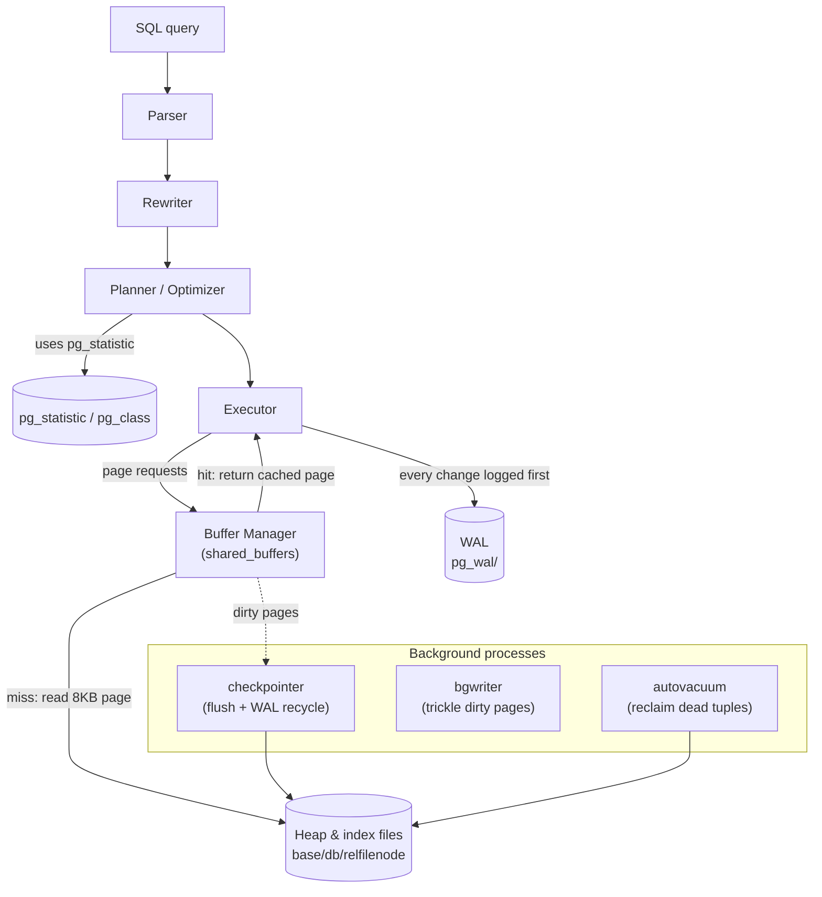
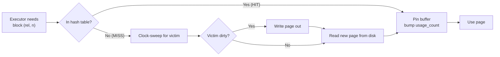

# PostgreSQL Internal Architecture

> A guided tour of how PostgreSQL actually stores, finds, versions, and protects data —
> the **buffer manager**, the **nbtree** B-tree, **MVCC**, **WAL**, and the
> **statistics-driven planner**. Every claim below is backed by output pulled from a live
> **PostgreSQL 16.14** instance, using the `pageinspect`, `pg_buffercache`, `pgstattuple`,
> and `pg_visibility` extensions to look directly at on-disk pages and tuple headers.

---

## Table of Contents

1. [Problem Background](#1-problem-background)
2. [Architecture Overview](#2-architecture-overview)
3. [Internal Design](#3-internal-design)
   - [3.1 Buffer Manager](#31-buffer-manager)
   - [3.2 B-Tree (nbtree)](#32-b-tree-nbtree)
   - [3.3 Heap & Page Layout](#33-heap--page-layout)
   - [3.4 MVCC](#34-mvcc-multi-version-concurrency-control)
   - [3.5 WAL](#35-wal-write-ahead-logging)
   - [3.6 VACUUM & the Visibility Map](#36-vacuum--the-visibility-map)
   - [3.7 The Planner & Statistics](#37-the-planner--statistics)
4. [Design Trade-Offs](#4-design-trade-offs)
5. [Experiments / Observations](#5-experiments--observations)
6. [Key Learnings](#6-key-learnings)
7. [References](#references)

---

## 1. Problem Background

PostgreSQL is a multi-user, crash-safe RDBMS. Three hard requirements shape its entire
internal design:

1. **Many transactions must run concurrently** without corrupting each other or blocking
   unnecessarily → solved by **MVCC** (snapshots + per-tuple versions).
2. **Committed data must survive crashes** even though writing data pages randomly to disk is
   slow and non-atomic → solved by **WAL** (sequential write-ahead log + checkpoints).
3. **Queries must be fast over large data** → solved by a **shared buffer cache**, **B-tree
   indexes**, and a **cost-based planner** that uses collected **statistics** to choose plans.

MVCC is the keystone decision: keeping old row versions alive so readers never block writers
is what makes Postgres pleasant under concurrency — but it forces two follow-on mechanisms
that this document keeps returning to: the per-tuple `xmin`/`xmax` bookkeeping, and **VACUUM**
to reclaim the dead versions MVCC leaves behind.

---

## 2. Architecture Overview



The executor never touches disk directly. It asks the **buffer manager** for 8 KB pages; the
buffer manager serves a cached copy (a *hit*) or reads it from a relation file (a *miss*).
Every modification is recorded in the **WAL** before the corresponding data page is allowed to
reach disk. Background processes (**checkpointer**, **bgwriter**, **autovacuum**) do the
deferred, asynchronous housekeeping so foreground transactions stay fast.

---

## 3. Internal Design

### 3.1 Buffer Manager

**Location:** `src/backend/storage/buffer/` (`bufmgr.c`, `freelist.c`).

PostgreSQL caches 8 KB pages in a process-shared region called **`shared_buffers`** (default
**128 MB**, confirmed live). Each buffer has a header with a pin count and a usage count.
Pages are found via a shared hash table keyed by *buffer tag* `(relation, fork, block#)`.
When a page must be evicted, PostgreSQL uses a **clock-sweep** algorithm: it sweeps the buffer
array decrementing usage counts, evicting the first buffer that reaches zero and is unpinned.
If the victim is dirty, it is written out (to the OS, which later `fsync`s) before reuse.



The crucial observable: a cold first scan shows `Buffers: shared read=N`; the identical scan
seconds later shows `Buffers: shared hit=N` — the pages are now resident. **Experiment A**
demonstrates exactly this `read → hit` transition, and `pg_buffercache` shows precisely which
relations occupy the cache.

### 3.2 B-Tree (nbtree)

**Location:** `src/backend/access/nbtree/`.

PostgreSQL's default index is a **Lehman–Yao high-concurrency B⁺-tree**. Properties:

- **All values live in the leaf level**; internal pages hold only separator keys + child
  pointers (high fan-out → shallow tree).
- Every page has a **high key** and a **right-link** to its right sibling. This is the
  Lehman–Yao trick that lets a searcher descend without locking the whole root-to-leaf path:
  if a concurrent split moved entries right, the searcher follows the right-link instead of
  blocking.
- Leaf entries store the indexed key + a **`ctid`** (the heap tuple's physical address).

**Experiment B** dissects a real index (`idx_orders_customer` over 50,000 distinct values):

```
 level | pages | live_tuples
-------+-------+------------
     2 |     1 |          2     <- root: 2 separators
     1 |     2 |        301     <- internal
     0 |   300 |      50299     <- leaves
```

A **3-level tree** indexing 50k keys: any lookup is **root → internal → leaf = 3 page
accesses**. A point lookup (Experiment C) touched just `hit=4 read=3` buffers to return its
rows. **Page splits** happen when a leaf is full: roughly half its entries move to a new right
sibling, the parent gains a separator, and if the root splits the tree grows one level taller.

### 3.3 Heap & Page Layout

A table is a **heap** — an unordered collection of 8 KB pages. Each page (Experiment D) is:

```
[ PageHeader (24B) ][ ItemId line-pointer array -> ][ free space ][ <- tuples ][ special ]
```

`heap_page_items` shows line pointers, their byte offsets, and per-tuple `xmin`/`xmax`. The
**line-pointer indirection** is what lets a tuple be relocated within its page (during HOT
pruning) without rewriting the index `ctid`s that point at the slot.

### 3.4 MVCC (Multi-Version Concurrency Control)

Every heap tuple carries hidden system columns:

| Field | Meaning |
|---|---|
| `xmin` | Transaction id that **created** this version |
| `xmax` | Transaction id that **deleted or locked** this version (0 if live & unlocked) |
| `t_ctid` | Pointer to the **next/newer version** of this row (self-pointer if latest) |

**An `UPDATE` never overwrites** — it writes a new tuple and sets the old tuple's `xmax`,
linking old→new via `t_ctid`. A transaction's **snapshot** (the set of xids in flight when it
started/took the snapshot) decides visibility:

> A tuple version is visible iff its `xmin` is committed-and-before-my-snapshot **and** its
> `xmax` is not (i.e. not yet deleted as far as my snapshot is concerned).

This is why **readers never block writers and writers never block readers** — they read
*different versions*. **Experiment E** shows the version chain forming on a single page after
two UPDATEs: `xmin` advancing `800 → 801 → 802` with `t_ctid` chaining the versions
(a **HOT** — Heap-Only Tuple — update, possible because no indexed column changed, so no new
index entry is needed).

> **Surprising detail:** `xmax ≠ 0` does **not** always mean "deleted." A `SELECT FOR
> KEY SHARE` lock (e.g. the foreign-key check from a child insert) records the locking xid in
> `xmax` while the row stays perfectly live. `xmax` encodes *deletion or locking*.

### 3.5 WAL (Write-Ahead Logging)

**The rule:** a change's **WAL record reaches stable storage before** the modified data page
is allowed to. WAL is an append-only, sequential stream in `pg_wal/`, addressed by a
monotonically increasing **LSN** (Log Sequence Number).

- **Durability:** at `COMMIT` (with `synchronous_commit=on`) the WAL up to the commit record
  is `fsync`-ed. Sequential WAL writes are far cheaper than scattering random data-page writes
  to disk synchronously.
- **Crash recovery:** on restart, PostgreSQL **replays WAL forward from the last checkpoint**
  (REDO), reconstructing any data-page changes that hadn't been flushed.
- **Torn-page protection:** `full_page_writes=on` logs a full image of a page the first time
  it is dirtied after a checkpoint, so a partially-written 8 KB page can be fully restored.
- **Checkpointing:** the `checkpointer` periodically flushes all dirty buffers and records a
  checkpoint, which bounds how much WAL must be replayed and lets old WAL be recycled.

**Experiment F** measures it directly: 5,000 INSERTs advanced the LSN by **644 kB** of WAL.

### 3.6 VACUUM & the Visibility Map

MVCC's price is **dead tuples** (old versions whose `xmax` is committed and invisible to all
snapshots). **VACUUM** reclaims their space for reuse and updates two per-table sidecar forks:

- **Free Space Map (`_fsm`)** — where free space exists, for future inserts.
- **Visibility Map (`_vm`)** — one bit per page meaning "every tuple here is visible to all
  transactions." This bit powers **index-only scans**: if the page is all-visible, the
  executor can trust the index entry and **skip the heap fetch entirely**.

**Experiment G**: after `VACUUM`, all 1,575 pages of `orders` were marked all-visible, and the
same query then ran as an **Index Only Scan** with **`Heap Fetches: 0`** — measurably less I/O.
This is *why* VACUUM is necessary: not just space reclamation, but enabling the planner's
cheapest access paths and preventing transaction-id wraparound.

### 3.7 The Planner & Statistics

PostgreSQL's optimizer is **cost-based**: it enumerates plans (scan methods, join orders, join
algorithms) and picks the lowest estimated cost. Those estimates come from statistics gathered
by `ANALYZE` / autovacuum into the system catalog **`pg_statistic`** (readable via the
`pg_stats` view) plus `reltuples`/`relpages` in `pg_class`.

Key stats: `n_distinct`, `null_frac`, `most_common_vals`/`most_common_freqs`, and histogram
bounds. The selectivity of an equality predicate on a column with `N` distinct, roughly-uniform
values is `≈ 1/N`. **Experiment H** shows this exactly: `orders.status` has `n_distinct = 4`
over 200,000 rows → estimate **50,000 rows** per value, and the actual `status='paid'` count
was 50,000. Accurate stats → correct estimate → the planner confidently chose a **parallel
hash join**. Stale stats are the #1 cause of bad plans.

---

## 4. Design Trade-Offs

| Decision | Win | Cost |
|---|---|---|
| **MVCC via in-table row versions** | Readers never block writers; simple, fast commits | Bloat; needs VACUUM; updates write whole new tuples |
| **Heap (unordered) + separate PK index** | Cheap appends; all indexes are symmetric | Even PK lookups need index→heap indirection (no clustering) |
| **WAL** | Durable + fast (sequential) commits; basis for replication & PITR | Write amplification (data written to WAL *and* heap); checkpoints cause I/O spikes |
| **shared_buffers + OS cache (double caching)** | Robust, portable, simple recovery | Some memory used twice; tuning `shared_buffers` is workload-dependent |
| **Cost-based planner** | Adapts plan to data shape & size | Only as good as its statistics; needs `ANALYZE` |
| **Process-per-connection** | Strong isolation, crash containment | Expensive at high connection counts → needs pooling |

**The defining trade-off** is MVCC-via-versioning. Compared with engines that update in place
and keep old versions in a separate **undo log** (Oracle, MySQL/InnoDB), PostgreSQL's approach
makes rollback trivial (just ignore the new version) and keeps reads lock-free, but it pushes
cleanup work into VACUUM and makes heavy-update tables prone to bloat. It is a deliberate
"pay later, asynchronously" design.

---

## 5. Experiments / Observations

> **Setup.** PostgreSQL **16.14** (Docker `postgres:16`) with extensions `pageinspect`,
> `pg_buffercache`, `pgstattuple`, `pg_visibility`. Dataset: `customers` (50,000),
> `orders` (200,000), `order_items` (600,000); B-tree indexes on the FKs. All output is from
> real runs.

### Experiment A — Buffer manager: `read → hit` (cold vs warm)

After restarting the server (cold `shared_buffers`), the **same** scan was run twice:

```
-- 1st scan (COLD): pages read from disk into shared_buffers
   Parallel Seq Scan on orders   Buffers: shared read=1575
-- 2nd scan (WARM): identical query, pages now resident
   Parallel Seq Scan on orders   Buffers: shared hit=1575
```

And `pg_buffercache` shows *what* is cached:

```
       relname       | buffers | cached
---------------------+---------+--------
 order_items         |    4417 | 35 MB
 orders              |    1579 | 12 MB
 customers           |     371 | 2968 kB
 idx_orders_customer |       1 | 8192 bytes
```

**Observation.** `read` (disk) became `hit` (cache) with no plan change — the buffer manager
is doing exactly its job, and `pg_buffercache` lets us see the cache contents directly.

### Experiment B — B-tree shape (nbtree via pageinspect)

```
bt_metap: magic=340322 version=4 root=290 level=2     <- 3-level tree

 level | pages | live_tuples
-------+-------+------------
     2 |     1 |          2    (root)
     1 |     2 |        301    (internal)
     0 |   300 |      50299    (leaves)
```

**Observation.** 50,000 distinct keys fit in a **3-level** B-tree with fan-out in the hundreds
— so any key lookup is **3 page accesses**. The single root page routes via 2 separators to 2
internal pages, which route to 300 leaves. This is why B-tree lookups are O(log) with a tiny
constant.

### Experiment C — Index search path (point lookup)

```
 Index Scan using idx_orders_customer on orders (actual rows=4 loops=1)
   Index Cond: (customer_id = 12345)
   Buffers: shared hit=4 read=3
```

**Observation.** Finding 4 matching rows touched ~7 buffers total: descend the 3-level index +
fetch the heap pages the `ctid`s point at. The index gives the locations; the heap holds the
rows (the indirection described in §3.2).

### Experiment D — Heap page layout & tuple headers

```
 line_ptr | offset | ctid  | xmin | xmax
----------+--------+-------+------+------
        1 |   8144 | (0,1) |  739 |  740
        2 |   8096 | (0,2) |  739 |  740
        3 |   8048 | (0,3) |  739 |  740
```

**Observation.** `heap_page_items` exposes the line-pointer array and the per-tuple MVCC
header. (Here `xmax=740` is the FK `KEY SHARE` lock from child inserts, not a deletion — see
§3.4.)

### Experiment E — MVCC version chain via HOT update

```
INSERT id=1:                 lp=1  t_ctid=(0,1)  xmin=800  xmax=0
after UPDATE, UPDATE:
 lp | t_ctid | xmin | xmax
----+--------+------+------
  1 | (0,2)  | 800  | 801    <- original, superseded (points to v2)
  2 | (0,3)  | 801  | 802    <- v2, superseded (points to v3)
  3 | (0,3)  | 802  |   0    <- v3, current/live
```

**Observation.** Two UPDATEs produced **three tuple versions chained by `t_ctid`** on the same
page, with `xmin` advancing `800→801→802`. The row was never overwritten — MVCC in action.
Because no indexed column changed, these are **HOT** updates (no new index entries needed).

### Experiment F — WAL volume

```
5,000 INSERTs  ->  WAL generated (LSN diff): 644 kB
```

**Observation.** Writes produce a measurable, sequential WAL stream; the LSN advances. This is
the durable, replay-able record that survives a crash — and the feed for replication/PITR.

### Experiment G — VACUUM enables Index-Only Scan

```
After VACUUM:  orders all_visible_pages = 1575 of 1575

 Index Only Scan using idx_orders_customer on orders
   Index Cond: (customer_id BETWEEN 100 AND 200)
   Heap Fetches: 0
   Buffers: shared hit=5
```

**Observation.** Once VACUUM marked every page all-visible in the **visibility map**, the query
answered entirely from the index — **`Heap Fetches: 0`**, just 5 buffers. VACUUM isn't only
garbage collection; it unlocks the planner's cheapest access path.

### Experiment H — Planner estimate from pg_statistic

```
 attname | n_distinct | total_rows | est_rows_per_value
---------+------------+------------+--------------------
 status  |          4 |     200000 |              50000

pg_statistic raw: stadistinct = 4   (pg_stats is the human-readable view over it)

Plan: Parallel Seq Scan on orders (Filter: status='paid')
      estimated 29341/worker  ->  actual 25000/worker  (=50000 total)  ✔ matches estimate
```

**Observation.** The planner derived `1/4 × 200000 = 50000` rows for `status='paid'` straight
from `pg_statistic.stadistinct`, and that estimate matched reality — which is precisely why it
trusted a hash join. Statistics → estimates → plan choice.

---

## 6. Key Learnings

1. **MVCC is the organizing principle.** `xmin`/`xmax`/`t_ctid` on every tuple explain
   updates-as-new-versions, lock-free reads, *and* why VACUUM must exist. Seeing the version
   chain (Experiment E) made the abstraction concrete.

2. **You can literally read the internals.** `pageinspect`/`pg_buffercache`/`pg_visibility`
   turn "the B-tree has 3 levels" and "the buffer is warm now" into printed facts — a powerful
   debugging and learning lens.

3. **VACUUM is a feature, not just cleanup.** The all-visible bit flipping a query into an
   Index-Only Scan with `Heap Fetches: 0` (Experiment G) shows VACUUM directly buying
   performance, on top of preventing bloat and xid wraparound.

4. **`xmax ≠ 0` can mean "locked," not "deleted."** The FK `KEY SHARE` lock in the tuple
   header was a genuinely surprising detail and a reminder that MVCC metadata is multi-purpose.

5. **The planner is arithmetic over statistics.** `1/n_distinct` selectivity producing a
   spot-on 50,000-row estimate (Experiment H) demystifies "the optimizer" — and explains why
   stale stats wreck performance.

6. **WAL is the cheap path to durability.** Turning expensive random data-page writes into one
   sequential, replayable log (644 kB for 5k inserts, Experiment F) is the trick that makes
   commits both fast *and* crash-safe.

---

## References

- PostgreSQL 16 docs — *Internals*: Database Physical Storage, WAL, MVCC, Routine Vacuuming,
  Statistics Used by the Planner, Index Access Methods:
  https://www.postgresql.org/docs/16/internals.html
- Source: `src/backend/storage/buffer/` (buffer manager), `src/backend/access/nbtree/` (B-tree)
  — https://github.com/postgres/postgres
- *The Internals of PostgreSQL*, Hironobu Suzuki: https://www.interdb.jp/pg/
- Lehman & Yao, *Efficient Locking for Concurrent Operations on B-Trees* (1981) — the
  high-concurrency B-tree design nbtree implements.
- Extension docs: `pageinspect`, `pg_buffercache`, `pg_visibility`, `pgstattuple`.

> *All Section 5 output was produced on PostgreSQL 16.14 (Docker). Absolute figures vary by
> hardware and configuration; the structural facts and relative behaviours are the point.*
