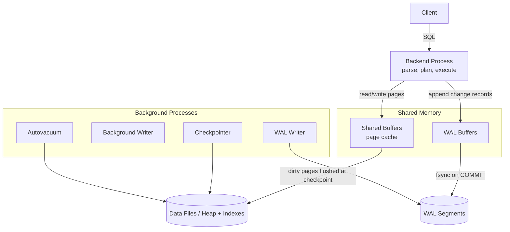
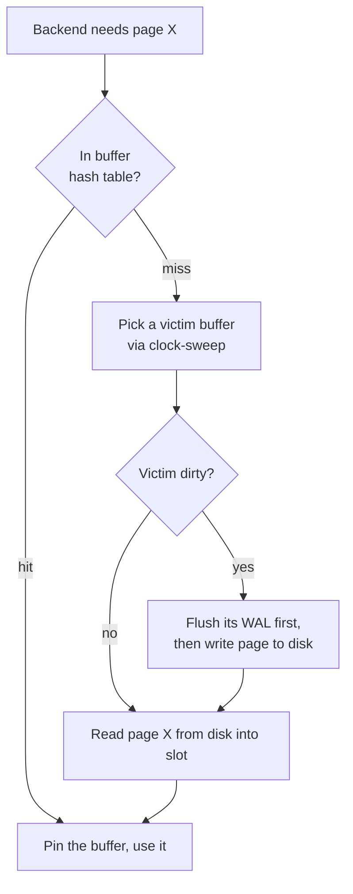
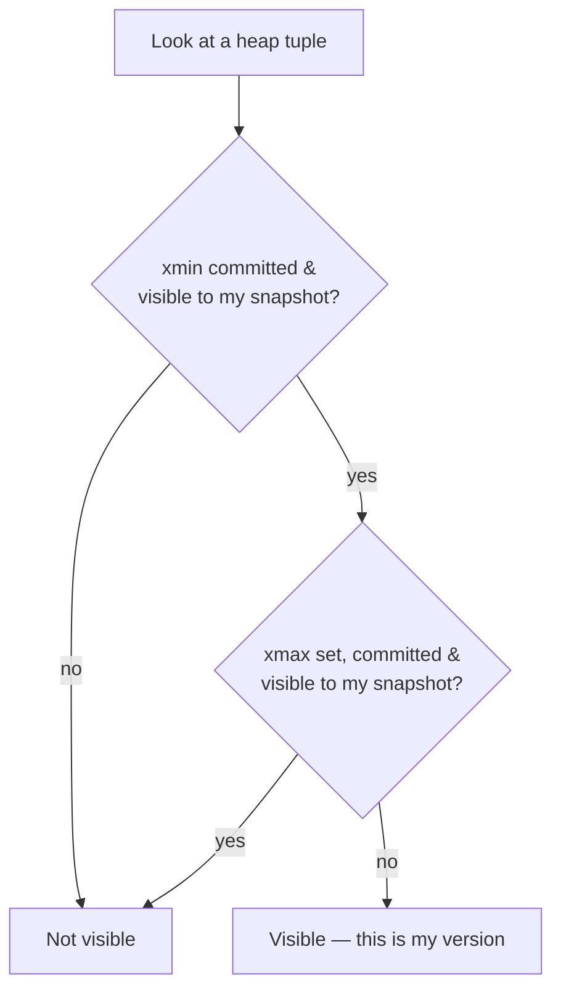
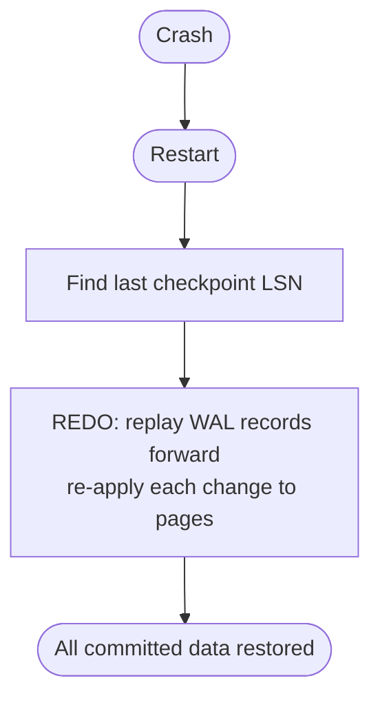

# PostgreSQL Internal Architecture

**Author:** Ashutosh
**Roll Number:** 24BCS10111
**Topic:** PostgreSQL Internal Architecture (Topic 2)

---

## Table of Contents

1. [Problem Background](#1-problem-background)
2. [Architecture Overview](#2-architecture-overview)
3. [Internal Design](#3-internal-design)
4. [Design Trade-Offs](#4-design-trade-offs)
5. [Experiments / Observations](#5-experiments--observations)
6. [Key Learnings](#6-key-learnings)
7. [References](#references)

---

## 1. Problem Background

PostgreSQL has to do something hard: let **many users read and write the same data at
once**, keep that data **correct**, and **never lose a committed transaction** even if
the server loses power. This document looks at the four internal pieces that make that
possible:

- **Buffer Manager** — how pages move between disk and RAM (`src/backend/storage/buffer/`).
- **B-Tree** — how indexes are laid out and searched (`src/backend/access/nbtree/`).
- **MVCC** — how concurrent transactions each see a consistent snapshot.
- **WAL** — how committed data survives a crash.

These aren't separate features bolted on — they're tightly woven together. WAL protects
the buffer manager's lazy writes; MVCC depends on the buffer manager holding old row
versions; VACUUM cleans up after MVCC. The point of this topic is to see how they fit.

---

## 2. Architecture Overview

PostgreSQL is a **client–server** system. A supervisor (the *postmaster*) forks one
**backend process per connection**. All backends share a region of memory — most
importantly the **shared buffers** (the page cache) — and a set of **background
processes** handle disk I/O and cleanup.



**Data flow of a write:** the backend finds the page in shared buffers (loading it from
disk if needed), modifies it in memory (marking it **dirty**), writes a description of the
change to the **WAL**, and on `COMMIT` forces only the WAL to disk. The dirty data page
itself is written out later by the checkpointer/background writer.

---

## 3. Internal Design

### 3.1 Buffer Manager — pages between disk and RAM

PostgreSQL data lives in 8 KB **pages**. The buffer manager keeps a fixed pool of page
slots (`shared_buffers`) in shared memory and decides what stays cached.

**How a page is accessed:**



**Pin / unpin and reference counts.** A backend **pins** a buffer while using it so it
can't be evicted mid-read. Each buffer also tracks a `usage_count`.

**Eviction — clock-sweep, not plain LRU.** Postgres uses a **clock-sweep** algorithm. A
pointer cycles through buffers; on each pass it decrements `usage_count`. When it finds a
buffer with `usage_count = 0` and no pins, that's the victim. This approximates LRU but is
cheap and lock-friendly under high concurrency.

**The WAL rule (key invariant):** a dirty page can never reach disk *before* the WAL
record describing its change. This "**WAL before data**" rule is what makes lazy page
flushing safe — recovery can always rebuild a page from the log.

### 3.2 B-Tree implementation (`nbtree`)

PostgreSQL's default index is a **B-tree** (technically a B+-tree: all values live in the
leaves, leaves are linked). It's an implementation of the **Lehman & Yao** concurrent
B-tree, which is designed so that searches don't have to lock whole subtrees.

```
            [ 50 | 100 ]                 <- internal (root): keys + child pointers
           /     |       \
     [10|30]  [60|80]   [120|150]        <- internal levels
       leaves   leaves     leaves
       |          |          |
   ->[..]<->[..]<->[..]<->[..]<->[..]->  <- leaf level, doubly linked (range scans)
```

**Page layout of a B-tree page:** a special area at the end holds the
`btpo_prev`/`btpo_next` sibling links and a "high key" (the upper bound of keys on the
page). Items are ordered; a binary search within the page finds the slot.

**Search path:** start at the root, binary-search to pick the child, descend until a leaf,
then binary-search the leaf for the key. For a range scan, follow the leaf sibling links.

**Insert + page split:** insert into the correct leaf. If the leaf is full, **split** it
into two, push a separator key up to the parent, and relink the siblings. Splits can
cascade up to the root (which is how the tree grows taller).

**The Lehman-Yao trick — right-links + high keys.** Because each page stores its parent's
separator (the high key) and a right-link, a searcher that arrives at a page mid-split can
detect "the key I want moved right" and **follow the right-link** instead of needing a lock
on the whole path. This is why reads stay fast even while another backend is splitting pages.

### 3.3 MVCC — heap tuple versioning

PostgreSQL implements concurrency with **Multi-Version Concurrency Control**: instead of
overwriting a row, it keeps **multiple versions** of it in the heap. Each heap tuple carries
two system columns:

- **`xmin`** — the id of the transaction that **created** this version.
- **`xmax`** — the id of the transaction that **deleted/superseded** it (0 = still live).

```
An UPDATE doesn't overwrite — it creates a NEW version:

Before:  (xmin=100, xmax=0)    balance=900     <- live
After UPDATE by txn 150:
         (xmin=100, xmax=150)  balance=900     <- old version, now "dead"
         (xmin=150, xmax=0)    balance=500     <- new live version
```

**Visibility rules + snapshots.** When a transaction starts (or a statement, depending on
isolation level) it takes a **snapshot**: a record of which transactions had committed at
that instant. For each tuple it checks:

- Is `xmin` committed *and* visible to my snapshot? (was it created before me / by a
  committed txn) → candidate.
- Is `xmax` set and committed and visible? → then this version is dead *to me*, skip it.

The version where `xmin` is visible and `xmax` is not is the one this transaction sees.



**Snapshot isolation.** Because each transaction reads against its own snapshot, **readers
never block writers and writers never block readers**. A long `SELECT` keeps seeing the
data as it was when it started, regardless of concurrent commits.

**Why VACUUM is necessary.** Those dead tuples (rows with a committed `xmax` that no live
snapshot can still need) pile up. They waste space and slow down scans. **VACUUM** reclaims
them and makes the space reusable; **autovacuum** does this automatically in the background.
It also updates the **visibility map** (which enables index-only scans) and prevents
**transaction-id wraparound**. Without VACUUM, an MVCC table would **bloat** forever.

### 3.4 WAL — Write-Ahead Logging

WAL is how PostgreSQL guarantees **durability** (committed data survives crashes) and
**atomicity** (a half-done transaction can be cleaned up). The rule: **log the change
before you write the data page.**

**WAL records.** Every modification (insert/update/delete, index change, etc.) produces a
WAL record describing it, tagged with a monotonically increasing **LSN** (Log Sequence
Number). Records are appended to WAL segment files (16 MB each).

**Durability on COMMIT.** On `COMMIT`, the backend forces (`fsync`) the WAL up to its commit
record. The data pages it touched may still be dirty in shared buffers — that's fine,
because the WAL is now safely on disk.

**Crash recovery.** On restart, PostgreSQL replays the WAL forward from the last checkpoint,
re-applying every change to bring pages back to their last committed state (this is **REDO**).
Changes from transactions that never committed are simply not visible (their tuples'
`xmin` belongs to an aborted txn), so MVCC handles the "undo" side naturally.



**Checkpointing.** A **checkpoint** flushes all currently-dirty pages to disk and records
"everything up to LSN N is safely on disk." After that, WAL before LSN N is no longer needed
for recovery and can be recycled. Checkpoints bound recovery time (you only replay WAL since
the last checkpoint) but cause an I/O spike, so they're spread out over time.

---

## 4. Design Trade-Offs

### Advantages
- **Excellent concurrency** — MVCC lets readers and writers proceed without blocking.
- **Strong durability** — WAL + fsync on commit means no committed data is lost.
- **Fast commits** — only the small sequential WAL is forced to disk on commit, not the
  scattered data pages.
- **Scan-friendly buffer management** — clock-sweep + usage counts resist cache pollution.

### Limitations
- **Table/index bloat** — keeping old versions in the heap means dead tuples accumulate and
  require VACUUM; neglecting it degrades performance.
- **Update cost** — an UPDATE writes a whole new tuple and must update **every** index, even
  for unchanged columns (mitigated, but not eliminated, by HOT updates).
- **Indexes always hit the heap** — a normal index scan fetches the row from the heap to
  check visibility (unless an index-only scan applies).
- **VACUUM is ongoing work** — autovacuum must be tuned for write-heavy workloads.

### Performance implications
- `shared_buffers` sizing matters a lot: if the working set fits, reads are RAM-speed.
- The planner depends entirely on **statistics** (next section) — stale stats → bad plans.
- Checkpoint frequency trades **recovery time** against **steady-state I/O smoothness**.

### Engineering decisions (the "why")

| Decision | Reason |
|----------|--------|
| WAL before data (lazy page flush) | Turn slow random page writes into a fast sequential log |
| Keep old versions in the heap | Snapshot isolation with no reader/writer blocking |
| Accept bloat + VACUUM | Simpler than in-place undo; cleanup is deferrable background work |
| Clock-sweep eviction | Approximates LRU cheaply and scales under concurrency |

---

## 5. Experiments / Observations

> Recommended exercise: run `EXPLAIN ANALYZE` on a multi-table join and read the plan,
> the planner's *estimates*, and the *actual* execution stats side by side.

### 5.1 EXPLAIN ANALYZE on a join

```sql
EXPLAIN ANALYZE
SELECT c.name, COUNT(o.id)
FROM customers c
JOIN orders o ON o.customer_id = c.id
WHERE c.country = 'IN'
GROUP BY c.name;
```

Illustrative output:

```
HashAggregate  (cost=2150.5..2160.5 rows=1000 width=40)
               (actual time=18.2..18.9 rows=982 loops=1)
  Group Key: c.name
  ->  Hash Join  (cost=320.0..2050.0 rows=20000 width=36)
                 (actual time=4.1..14.0 rows=19840 loops=1)
        Hash Cond: (o.customer_id = c.id)
        ->  Seq Scan on orders o   (rows=200000) (actual rows=200000)
        ->  Hash  (rows=1000)      (actual rows=982)
              ->  Index Scan using customers_country_idx on customers c
                    Index Cond: (country = 'IN')   (actual rows=982)
Planning Time: 0.4 ms
Execution Time: 19.7 ms
```

**How to read it:**
- **`cost=...`** are the planner's *estimates* (in arbitrary cost units); **`actual time`**
  is what really happened. Big gaps between estimated `rows` and actual `rows` usually mean
  **stale statistics**.
- The planner chose a **Hash Join** because it estimated ~20k matching rows — for that size,
  hashing the smaller `customers` side and streaming `orders` beats a nested loop.
- It used an **Index Scan** on `customers` (selective `country='IN'`) but a **Seq Scan** on
  `orders` (it needs most of the table anyway), which is a sensible choice.

### 5.2 Where the planner's numbers come from — `pg_statistic`

The planner doesn't read the data to estimate; it reads **statistics** gathered by
`ANALYZE` and stored in the system catalog **`pg_statistic`** (human-readable view:
**`pg_stats`**).

```sql
SELECT attname, n_distinct, most_common_vals, null_frac
FROM pg_stats
WHERE tablename = 'customers';
```

```
 attname | n_distinct |    most_common_vals    | null_frac
---------+------------+------------------------+----------
 country |        50   | {US,IN,GB,DE,...}      |    0.0
 name    |     -0.95   | {NULL}                 |    0.01
```

- `n_distinct` → how many distinct values (drives join-size estimates).
- `most_common_vals` + their frequencies → estimate how selective `country = 'IN'` is.
- `null_frac` → fraction of NULLs.

If you run heavy inserts and *don't* re-`ANALYZE`, these numbers go stale, the planner
mis-estimates row counts, and it can pick a bad plan (e.g. a nested loop over millions of
rows). Re-running `ANALYZE customers;` fixes the estimates.

### 5.3 Watching MVCC and bloat

```sql
SELECT xmin, xmax, ctid, balance FROM accounts WHERE id = 1;
--  xmin |  xmax  | ctid  | balance
--   100 |   0    | (0,1) |   900     <- live version

-- after UPDATE accounts SET balance=500 WHERE id=1;  (in another committed txn)
--  xmin |  xmax  | ctid  | balance
--   150 |   0    | (0,2) |   500     <- new version; old (0,1) is now dead until VACUUM
```

```sql
SELECT n_live_tup, n_dead_tup FROM pg_stat_user_tables WHERE relname='accounts';
-- n_live_tup | n_dead_tup
--    10000   |    3200       <- 3200 dead tuples waiting for VACUUM
```

After `VACUUM accounts;`, `n_dead_tup` drops back toward 0 and the space becomes reusable.

---

## 6. Key Learnings

1. **The four pieces are one system.** WAL makes the buffer manager's lazy flushing safe;
   MVCC relies on keeping old versions; VACUUM exists to clean up after MVCC. You can't
   really understand one without the others.

2. **"Log before data" is the central trick.** Forcing only a small sequential WAL on
   commit (and flushing data pages lazily) is what makes commits fast *and* durable.

3. **MVCC's cost is bloat.** Not overwriting rows is what gives non-blocking reads — but it
   means dead versions accumulate, which is precisely why VACUUM/autovacuum exist.

4. **Lehman-Yao B-trees stay concurrent during splits.** Right-links + high keys let a
   reader follow a moved key instead of locking the whole path — clever and load-bearing.

5. **The planner is only as good as its statistics.** `EXPLAIN ANALYZE` showing a big gap
   between estimated and actual rows almost always traces back to stale `pg_statistic`.

6. **Clock-sweep beats naive LRU under concurrency.** A simple usage-count sweep approximates
   LRU while avoiding the lock contention a strict LRU list would cause.

---

## References

- PostgreSQL Documentation — *Database Page Layout* and *Storage*
  https://www.postgresql.org/docs/current/storage-page-layout.html
- PostgreSQL Documentation — *Concurrency Control (MVCC)*
  https://www.postgresql.org/docs/current/mvcc.html
- PostgreSQL Documentation — *Write-Ahead Logging (WAL)*
  https://www.postgresql.org/docs/current/wal-intro.html
- PostgreSQL Documentation — *Routine Vacuuming*
  https://www.postgresql.org/docs/current/routine-vacuuming.html
- PostgreSQL Documentation — *How the Planner Uses Statistics* / `pg_statistic`
  https://www.postgresql.org/docs/current/planner-stats.html
- Source: `src/backend/storage/buffer/` (buffer manager) and `src/backend/access/nbtree/` (B-tree)
- P. Lehman & S. Yao, *Efficient Locking for Concurrent Operations on B-Trees* (1981)
