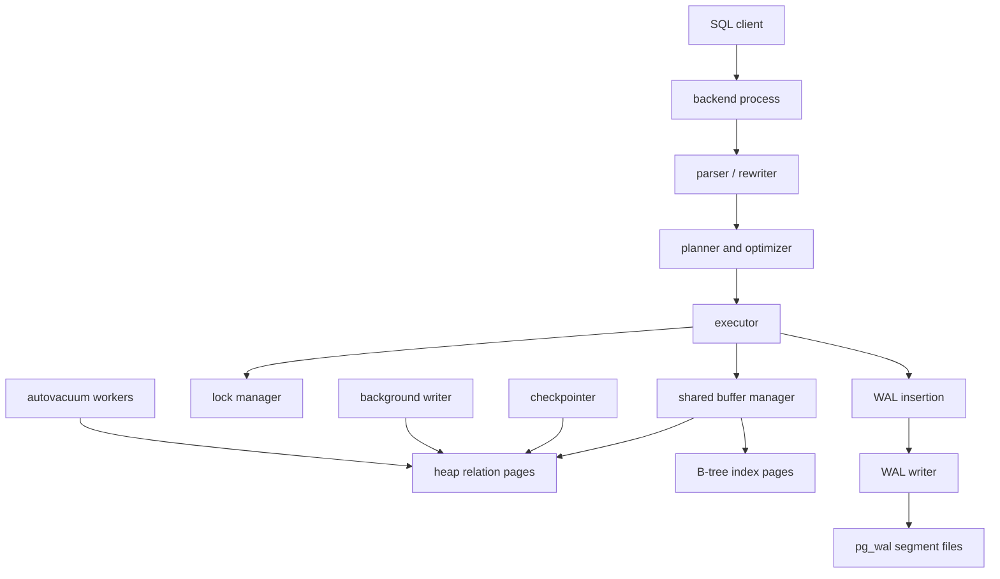

# PostgreSQL Internal Architecture

## 1. Problem Background

PostgreSQL is designed as a general-purpose relational database server for multi-user, durable, transactional workloads. Its internal architecture has to solve several hard problems at the same time: many concurrent sessions, crash safety, query optimization, index maintenance, and cleanup of old row versions.

The important design theme is separation of responsibilities. Backend processes execute client queries, shared memory coordinates access to cached pages and locks, write-ahead logging makes changes recoverable, and background workers perform maintenance such as checkpoints, buffer writes, and autovacuum. This makes PostgreSQL heavier than embedded databases, but it gives it strong behavior under concurrent OLTP workloads.

## 2. Architecture Overview



Main source-code areas:

| Component | Source location | Responsibility |
| --- | --- | --- |
| Buffer manager | `src/backend/storage/buffer/` | Shared page cache, buffer lookup, dirty page handling |
| Heap storage | `src/backend/access/heap/` | Table row storage and tuple visibility |
| B-tree access method | `src/backend/access/nbtree/` | B-tree search, insert, split, scan |
| WAL | `src/backend/access/transam/` | Transaction log, commit records, recovery |
| Vacuum | `src/backend/access/heap/vacuumlazy.c` | Dead tuple cleanup and visibility map maintenance |
| Planner statistics | `src/backend/statistics/`, `pg_statistic` | Selectivity estimates for plan choices |

## 3. Internal Design

### Buffer Manager

PostgreSQL does not normally read table and index pages directly into executor-local memory. It uses shared buffers, a database-owned cache shared by backend processes. When an executor needs a page, it asks the buffer manager. If the page is already cached, the backend pins it and reads it. If not, PostgreSQL chooses a victim buffer, reads the page from disk, and tracks whether the page later becomes dirty.

The buffer manager sits between SQL execution and storage files. This gives PostgreSQL control over page replacement, dirty-page writeback, and WAL ordering. The operating system still has its own page cache, but shared buffers let PostgreSQL coordinate database-specific page state.

### Page Layout

PostgreSQL stores tables and indexes as arrays of fixed-size pages, usually 8 KB. A page has a header, line pointer array, free space, item data, and optional access-method-specific special space. Heap tuples are referenced by `ctid`, which is a block number plus line pointer offset.

This slotted-page design is important because tuple data can move inside a page while the line pointer remains stable. Index entries can therefore point to a logical item slot instead of a byte offset.

### B-Tree Implementation

PostgreSQL B-trees are separate index relations. Leaf entries contain key values and tuple identifiers pointing to heap rows. Search walks from the root down internal pages to a leaf page. Inserts may split pages when there is no room. B-tree pages use the same general page layout as heap pages, but the special area stores index-specific metadata such as sibling links.

The local experiment used `pageinspect` on `idx_ledger_account_created` and observed a B-tree with `root = 3`, `level = 1`, and `fastlevel = 1`. For this data size, the index needed a root and leaf layer, but not a deep tree.

### MVCC

PostgreSQL implements MVCC by storing row versions in the heap. Tuple headers contain transaction metadata such as `xmin`, `xmax`, and `ctid`. An update creates a new tuple version and marks the old version as superseded. Readers decide which version is visible based on their snapshot.

This is why reads and writes usually do not block each other. The cost is that old versions remain physically present until they are no longer visible to any transaction and VACUUM can reclaim them.

In the local observation, updating one row in `mvcc_demo` produced two physical tuple slots:

```text
old tuple: xmin=789, xmax=790, ctid=(0,2)
new tuple: xmin=790, xmax=0,   ctid=(0,2)
```

The old tuple points to the new tuple version. The new tuple is visible to later snapshots.

### WAL and Recovery

PostgreSQL uses write-ahead logging. Before dirty data pages are allowed to become the only durable copy of a change, WAL records describing the change must reach durable storage. After a crash, PostgreSQL replays WAL from the last checkpoint to reconstruct changes that were committed but not yet reflected in data files.

The local experiment updated 101 account rows and observed `33808` WAL bytes generated. That number is workload-specific, but the lesson is stable: logical SQL updates become physical redo records that allow page-level recovery.

### Query Planning and Statistics

PostgreSQL's planner relies on catalog statistics collected by `ANALYZE`. The experiment showed `pg_stats` entries for `accounts.region`, `accounts.status`, and `ledger_entries.created_at`. Those statistics helped the planner estimate row counts close to reality:

```text
estimated join rows: 6538
actual join rows:    6495
```

Good statistics made it reasonable for PostgreSQL to choose bitmap scans and a hash join.

## 4. Design Trade-Offs

| Design Decision | Benefit | Cost |
| --- | --- | --- |
| Shared buffer cache | Coordinated page reuse and dirty-page control | Requires memory tuning and buffer manager overhead |
| MVCC heap tuple versions | Readers do not block writers in common cases | Dead tuples require VACUUM and can cause bloat |
| Separate heap and indexes | Flexible index access methods and HOT updates | Secondary index lookups may need heap fetches |
| WAL before data pages | Crash recovery without flushing every data page at commit | WAL volume and checkpoint tuning matter |
| Cost-based optimizer | Strong plans for joins and mixed workloads | Bad or stale statistics can produce bad plans |

VACUUM is not an optional cleanup tool in PostgreSQL. It is part of the architecture. Because updates create new row versions, old versions must eventually be removed and transaction ID wraparound must be prevented.

## 5. Experiments / Observations

Run from the repository root:

```bash
./System_Design_Docs/PostgreSQL_Internals/experiments/run_experiments.sh
```

The script starts a temporary PostgreSQL cluster under `.local/postgresql-internals`, creates tables and indexes, runs `EXPLAIN (ANALYZE, BUFFERS)`, inspects B-tree and heap pages with `pageinspect`, measures WAL movement, writes [EXPERIMENT_RESULTS.md](./EXPERIMENT_RESULTS.md), and stops PostgreSQL.

Key observations:

- Server settings included `shared_buffers = 128MB`, `wal_level = replica`, and `default_statistics_target = 100`.
- The join query used bitmap index scans on both sides, then a hash join and group aggregate.
- The plan touched `652` shared-hit buffers and read `31` buffers.
- The B-tree index metadata showed a shallow tree with `level = 1`.
- MVCC inspection showed both the old and new tuple versions after an update.
- Updating 101 rows generated `33808` bytes of WAL in this run.

## 6. Key Learnings

1. PostgreSQL's performance comes from coordination among several subsystems, not one magic storage structure.
2. The buffer manager turns disk pages into shared database state, which is why `BUFFERS` output is useful when reading plans.
3. MVCC improves concurrency by preserving old versions, but it creates cleanup work.
4. WAL is the durability backbone: data pages can be written later because redo records exist first.
5. Query planning depends heavily on collected statistics; `ANALYZE` directly affects system behavior.

## References

- PostgreSQL documentation: [Database Page Layout](https://www.postgresql.org/docs/current/storage-page-layout.html), [MVCC Introduction](https://www.postgresql.org/docs/current/mvcc-intro.html), [Write-Ahead Logging](https://www.postgresql.org/docs/current/wal-intro.html), [Using EXPLAIN](https://www.postgresql.org/docs/current/using-explain.html), [Routine Vacuuming](https://www.postgresql.org/docs/current/routine-vacuuming.html)
- PostgreSQL source tree areas: `src/backend/storage/buffer/`, `src/backend/access/nbtree/`, `src/backend/access/heap/`, `src/backend/access/transam/`
