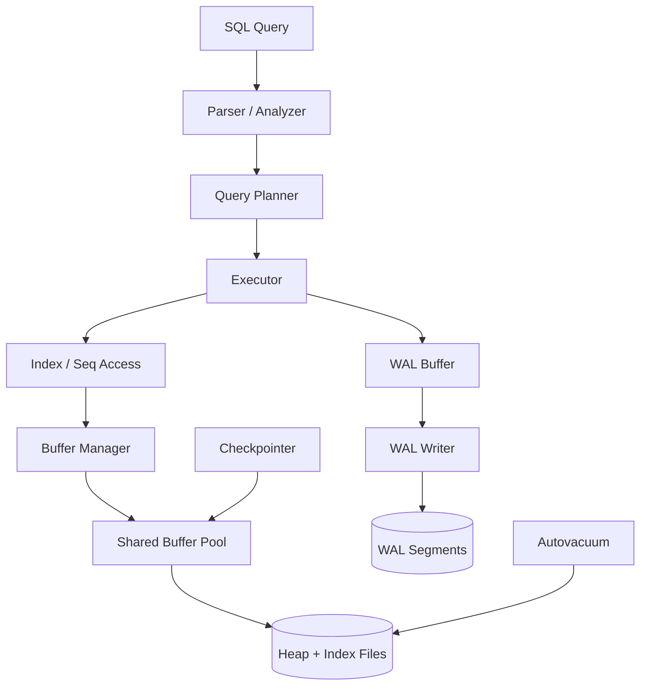
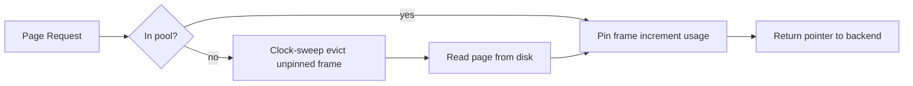
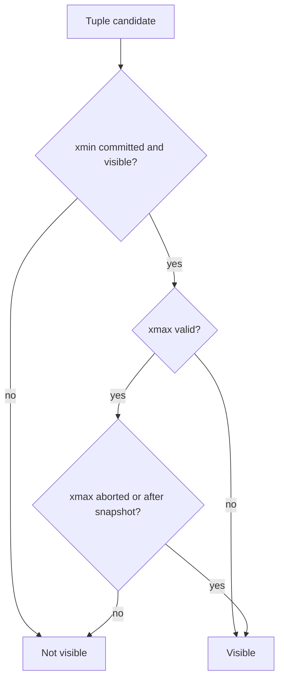

# PostgreSQL Internal Architecture

**Author:** SCALER_23bcs10014  
**Course:** Advanced DBMS — System Design Discussion

---

## 1. Problem Background

PostgreSQL evolved from the POSTGRES research system (1986–1994), which pioneered extensible types, rules, and object-relational features. The production PostgreSQL project (since 1996) targets a general-purpose OLTP/OLAP server that must:

- Serve many concurrent transactions with **ACID** guarantees
- Recover automatically after crashes
- Allow readers and writers to proceed without coarse global locking

These goals shaped every internal subsystem: a shared buffer pool for I/O amortization, heap-based **MVCC** for concurrency, B-tree indexes for access paths, and **WAL** for durability. Understanding how these pieces interact explains observable behavior—why `VACUUM` exists, why the planner needs statistics, and why buffer cache hit ratio matters.

---

## 2. Architecture Overview



### Main Components

| Component | Role |
|-----------|------|
| **postmaster** | Supervises backends and background workers |
| **backend** | Per-connection process: parse, plan, execute |
| **shared buffers** | Global page cache in shared memory |
| **buffer manager** | Pin/unpin pages, clock-sweep eviction, dirty tracking |
| **WAL** | Append-only log of physical/logical changes |
| **checkpointer** | Writes dirty pages, advances redo horizon |
| **autovacuum** | Reclaims dead tuples, updates visibility maps |

### Data Flow for a Simple `SELECT`

1. Planner chooses index or sequential scan based on `pg_statistic`.
2. Executor requests pages through the buffer manager.
3. On cache miss, buffer manager reads 8 KB page from disk into a shared frame.
4. Visibility routine checks tuple `xmin`/`xmax` against the transaction snapshot.
5. Matching tuples are projected to the client.

---

## 3. Internal Design

### 3.1 Buffer Manager (`src/backend/storage/buffer/`)

The buffer manager is the gatekeeper between executors and disk.

**Key concepts:**

- **Shared buffers:** Fixed-size array of 8 KB frames in shared memory (`shared_buffers` GUC, default 128 MB).
- **Pin count:** While a backend pins a page, it cannot be evicted. Unpin when done.
- **Dirty flag:** Modified pages are marked dirty; checkpointer or bgwriter flushes them.
- **Clock-sweep replacement:** A hand sweeps frames; unpinned pages with usage count zero are evicted. Recently used pages get a "second chance" (similar in spirit to the Clock policy used in educational engines).



**Why it matters:** Most OLTP workloads are cache-bound. A buffer hit avoids ~0.1 ms disk latency; misses dominate tail latency.

*Personal anchor:* While studying `src/backend/storage/buffer/`, I compared it to a Clock buffer pool I had seen in a small educational engine (single process, 4 KB pages, pin before mutate). PostgreSQL adds the hard parts: **shared** memory across processes, correct eviction while another backend still pins a page, and WAL-driven recovery if a dirty page is written early. Same idea—cache limited pages—but production concurrency changes every invariant.

### 3.2 B-Tree Implementation (`nbtree`)

PostgreSQL's default index access method is **nbtree** (Lehman–Yao B-link tree variant).

**Index page layout (simplified):**

- **Meta page** (block 0): root pointer, version, cleanup stats
- **Internal pages:** high keys + child block pointers
- **Leaf pages:** index tuples → heap TID `(block, offset)`

**Search path:** root → internal levels → leaf, following key ordering.

**Insert & page splits:**

1. Find leaf page for key.
2. If space exists, insert tuple.
3. If full, **split** leaf: half tuples move to new right sibling; parent may split recursively.
4. B-link pointer allows concurrent readers to follow right sibling during splits.

**Why splits matter:** Split frequency affects write amplification and index bloat. Heavy random inserts on monotonic keys behave differently than UUID keys.

### 3.3 MVCC (Multi-Version Concurrency Control)

PostgreSQL stores multiple **versions** of a row on the heap rather than overwriting in place.

**Heap tuple header fields (conceptual):**

| Field | Meaning |
|-------|---------|
| `xmin` | Transaction ID that inserted this version |
| `xmax` | Transaction ID that deleted/updated it (0 if live) |
| `ctid` | Physical location; updates may point to new version |

**Visibility rules (simplified):**

A tuple is visible to snapshot `S` if:

1. `xmin` is committed before `S` and not in `S`'s `xip` (in-progress list)
2. `xmax` is invalid, or `xmax` is after `S`, or `xmax` aborted



**Snapshot isolation:** Each transaction sees a consistent snapshot of committed data as of statement or transaction start.

**Why VACUUM is necessary:**

- `UPDATE`/`DELETE` leave **dead tuples** and dead index entries.
- Without cleanup, tables **bloat**; scans touch more pages.
- `VACUUM` marks space reusable and advances **freeze** horizons to prevent transaction ID wraparound.
- **Autovacuum** automates this based on delete/update thresholds.

### 3.4 WAL (Write-Ahead Logging)

WAL is the durability backbone.

**Principles:**

1. **Log before data:** WAL records reach disk before corresponding dirty data pages (except for `UNLOGGED` tables).
2. **Force log at commit:** Commit record flushed → transaction durable.
3. **Steal / no-force:** Dirty pages may reach disk before commit; committed changes may still be only in WAL at commit time.

**Crash recovery:**

1. **Redo:** Replay WAL from last checkpoint for committed transactions.
2. **Undo:** Not needed for committed work on heap—MVCC uses tuple visibility; incomplete transactions are ignored via `xmin`/`xmax`.

**Checkpointing:** Periodically writes dirty buffers and records a checkpoint WAL position, bounding recovery time.

### 3.5 Query Planning & Statistics

The planner estimates costs using:

- Table row counts from `pg_class.reltuples`
- Column histograms and distinct counts in **`pg_statistic`** (populated by `ANALYZE`)
- Selectivity functions for operators

Bad statistics → wrong join order → orders-of-magnitude slowdown.

---

## 4. Design Trade-Offs

| Decision | Benefit | Cost |
|----------|---------|------|
| Heap MVCC | Readers don't block writers | Table bloat; VACUUM overhead |
| Append-only updates | Simple rollback (mark xmax) | More disk writes per update |
| Shared buffer pool | High cache hit rate across sessions | Complex eviction; large RAM footprint |
| WAL durability | Fast commit (log append) vs random data page writes | Extra disk I/O; WAL disk sizing |
| B-tree default index | Excellent range & equality | Random insert hotspots on sequential keys |

**Alternatives considered in industry:**

- **In-place updates + undo** (InnoDB): less bloat, more undo management
- **LSM-trees** (RocksDB): write-optimized, compaction cost

PostgreSQL chose heap MVCC for flexibility (no clustered PK requirement) and mature snapshot isolation semantics.

---

## 5. Experiments / Observations

### 5.1 Schema

Three related tables loaded in PostgreSQL 16 (Docker):

- `customers` — 5,000 rows
- `orders` — 20,000 rows  
- `order_items` — 80,000 rows

Indexes on `customers(city)`, `orders(customer_id)`, `order_items(order_id)`.

### 5.2 EXPLAIN ANALYZE — Multi-Table Join

```sql
SELECT c.name, c.city, o.id, o.order_date, oi.product, oi.quantity, oi.unit_price
FROM customers c
JOIN orders o ON o.customer_id = c.id
JOIN order_items oi ON oi.order_id = o.id
WHERE c.city = 'Bangalore'
  AND o.status = 'delivered'
  AND oi.quantity >= 3
ORDER BY o.order_date DESC
LIMIT 100;
```

**Plan summary (actual run):**

| Node | Actual rows | Time | Buffers |
|------|-------------|------|---------|
| Limit | 100 | 9.38 ms total | shared hit=10176 |
| Sort (top-N heapsort) | 100 | 9.30 ms | — |
| Nested Loop | 4,000 | 8.42 ms | shared hit=10173 |
| Hash Join (customers ⋈ orders) | 1,667 | 3.00 ms | shared hit=171 |
| Bitmap Index Scan on `idx_customers_city` | 1,250 | 0.27 ms | shared hit=43 |
| Seq Scan on orders (`status='delivered'`) | 6,667 | 1.71 ms | shared hit=128 |
| Index Scan on `idx_order_items_order` | ~2/loop | 0.003 ms/loop | shared hit=10002 |

**What the plan taught me (not just what it chose):**

I ran the query twice. The first run showed buffer **reads**; the second showed **only hits** (10,176 shared hits, 0 reads). That made the buffer manager concrete for me: the join did not get faster because PostgreSQL "understood" the query better on repeat—it simply stopped going to disk.

| Plan node | Planner estimate | Actual rows | My reading |
|-----------|------------------|-------------|------------|
| Hash Join (customers ⋈ orders) | ~1,667 | 1,667 | `ANALYZE` on `city` (n_distinct=4) gave the planner an accurate filter fraction |
| Seq Scan on `orders` | ~6,667 | 6,667 | Only 3 statuses → ~33% of rows; seq scan beats index when half the table matches |
| Nested Loop → `order_items` | 2 rows/loop | ~2 rows/loop | Index on `order_id` turned the final join into cheap probes |

**Surprise:** I expected a merge join on `order_date` because of `ORDER BY`. Instead the planner used **top-N heapsort** after building 4,000 joined rows, then applied `LIMIT 100`. Sorting 4K rows in memory (48 KB) was cheaper than an ordered index walk across three tables—an example of how cost model picks "good enough" over "theoretically elegant."

### 5.3 pg_statistic Snapshot

| Table | Column | n_distinct | Notes |
|-------|--------|------------|-------|
| customers | city | 4 | Low cardinality → bitmap index scan |
| orders | status | 3 | Seq scan chosen |
| order_items | quantity | 5 | Filter applied at index scan |

---

## 6. Key Learnings

1. **Pages are the unit of I/O.** The buffer manager, WAL, and executor all reason in 8 KB pages—tuning `shared_buffers` and avoiding bloat directly affects latency.
2. **MVCC trades space for concurrency.** Dead tuples are the price of non-blocking reads; autovacuum is not optional housekeeping—it is core architecture.
3. **WAL makes commit fast.** Appending sequential log records beats random data page flushes for durability.
4. **The planner is only as good as statistics.** Accurate `pg_statistic` data transformed a potentially nested-loop disaster into an efficient hash join + index nested loop.
5. **Index choice is workload-dependent.** Low-cardinality filters may use bitmap scans; high-cardinality point lookups use straight index scans.

---

## References

- PostgreSQL Source — `src/backend/storage/buffer/`, `src/backend/access/nbtree/`
- [PostgreSQL MVCC](https://www.postgresql.org/docs/current/mvcc.html)
- [EXPLAIN Documentation](https://www.postgresql.org/docs/current/sql-explain.html)
- Ramakrishnan & Gehrke — *Database Management Systems*, 3rd ed.
