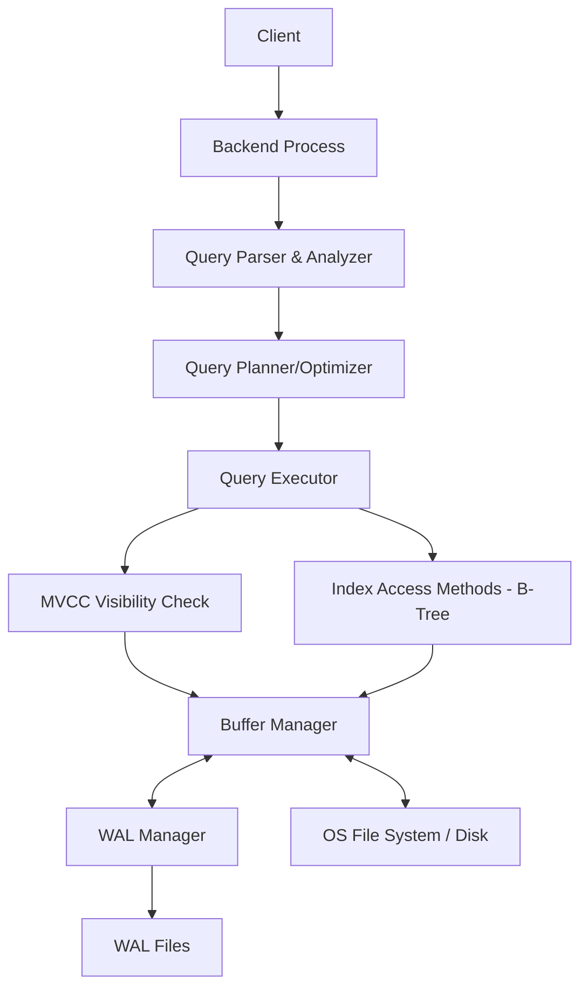

# PostgreSQL Internal Architecture

## 1. Problem Background

PostgreSQL is designed to handle highly concurrent, data-intensive workloads while strictly adhering to ACID properties. The internal architecture of PostgreSQL evolved to solve several key database engineering challenges:
- **Concurrent Access without Locking**: How to allow multiple users to read and write to the same table simultaneously without blocking each other.
- **Data Durability and Crash Recovery**: How to ensure that committed data is never lost, even in the event of a sudden power failure or OS crash.
- **Efficient Memory Utilization**: How to cache data in memory to minimize slow disk I/O while safely evicting old data.
- **Fast Data Retrieval**: How to structure indexes so that data lookups remain fast even as tables grow to billions of rows.

## 2. Architecture Overview

### High-level architecture diagram



### Main system components
- **Buffer Manager**: Manages the shared memory buffer pool. It caches disk pages in memory to reduce disk I/O.
- **B-Tree Index Engine**: Handles the creation, traversal, and maintenance of B-tree indexes for fast data lookup.
- **MVCC Engine**: Manages tuple versions (xmin, xmax) to provide snapshot isolation without explicit read locks.
- **WAL (Write-Ahead Logging)**: Ensures that all changes are logged to disk before the actual data pages are modified, guaranteeing durability.

### Data flow
1. A query requests data. The Executor requests a page via the Buffer Manager.
2. If the page is not in the Shared Buffer Pool, the Buffer Manager reads it from disk.
3. The Executor checks the tuple's `xmin` and `xmax` using MVCC rules to determine if the tuple is visible to the current transaction.
4. If a write occurs, the change is recorded in WAL first, then the page in the Buffer Manager is marked as "dirty".
5. Background processes (like the Checkpointer) later flush dirty pages to disk.

## 3. Internal Design

### Buffer Manager
- **Shared Buffers**: A contiguous block of shared memory divided into 8KB pages. It caches data pages and index pages.
- **Buffer Replacement**: Uses a clock-sweep algorithm. Pages are given a usage count. When space is needed, the clock hand sweeps through buffers; if a buffer's usage count is 0, it is evicted. If >0, the count is decremented.
- **Page Caching and I/O**: PostgreSQL relies on a dual-caching strategy, using both its own shared buffers and the OS page cache.

### B-Tree Implementation (`nbtree`)
- **Index Structure**: A balanced tree where leaf nodes contain pointers to heap tuples (TIDs).
- **Index Page Layout**: Consists of a page header, an array of item pointers (line pointers), and the actual index tuples. High key mechanisms are used to manage splits.
- **Search Path**: Traversal starts at the root, comparing keys to route down to the exact leaf page.
- **Page Splits & Inserts**: When a leaf page fills up, a page split occurs. Half the data is moved to a new page, and a new link is inserted in the parent node.

### MVCC (Multi-Version Concurrency Control)
- **Heap Tuple Versioning**: Updates do not overwrite rows. Instead, an `UPDATE` is treated as a `DELETE` of the old version and an `INSERT` of a new version.
- **xmin / xmax**: Every tuple has an `xmin` (Transaction ID that created it) and `xmax` (Transaction ID that deleted/updated it).
- **Visibility Rules**: A tuple is visible to a transaction if its `xmin` is in the past (and committed) and its `xmax` is either blank or in the future/uncommitted.
- **Snapshot Isolation**: Each transaction operates on a "snapshot" of the database at the time the transaction started, ensuring consistent reads.

### WAL (Write-Ahead Logging)
- **WAL Records**: Binary logs of changes made to data pages. 
- **Durability Guarantees**: Changes are flushed to the WAL file on disk at COMMIT before the actual data pages are updated.
- **Crash Recovery**: If the system crashes, PostgreSQL replays the WAL from the last checkpoint to restore the database to a consistent state.
- **Checkpointing**: Periodically flushes all dirty data pages from the buffer pool to disk. This reduces the time required for crash recovery by creating a known good starting point in the WAL.

## 4. Design Trade-Offs

### Advantages
- MVCC ensures that read queries never block write queries, providing massive read concurrency.
- WAL ensures strict durability without forcing every transaction to write 8KB data pages to disk immediately.
- B-trees provide predictable O(log N) search times for equality and range queries.

### Limitations
- **Tuple Bloat**: MVCC leaves dead tuples behind. These consume space and slow down sequential scans until `VACUUM` reclaims them.
- **Write Amplification**: Updating a single indexed column requires writing the new heap tuple, updating the index, and writing to the WAL.
- **Dual Caching**: Managing memory between shared buffers and the OS cache can sometimes lead to redundant memory usage.

### Engineering decisions
- PostgreSQL chose append-only MVCC for heap tuples (unlike InnoDB's undo logs). This makes rollback trivial (just abort the transaction and let VACUUM clean up) but makes updates more expensive.

## 5. Experiments / Observations

**Observation on EXPLAIN ANALYZE**:
Running an `EXPLAIN ANALYZE` on a multi-table join query reveals how the query planner leverages collected statistics (`pg_statistic`).

```sql
EXPLAIN ANALYZE 
SELECT c.name, o.order_date, o.total 
FROM customers c 
JOIN orders o ON c.id = o.customer_id 
WHERE o.order_date > '2023-01-01';
```

- **Chosen Execution Plan**: The planner might choose a Hash Join or a Nested Loop depending on the estimated rows. If `orders` is large and indexed on `customer_id`, a Nested Loop with an Index Scan is common.
- **Planner Estimates vs Actuals**: `EXPLAIN ANALYZE` shows `cost=... rows=... width=... (actual time=... rows=... loops=...)`. If estimates (from `pg_statistic`) deviate heavily from actuals, the planner might choose suboptimal joins.
- **Buffer Usage**: Adding `BUFFERS` to the command shows how many blocks were hit in shared buffers versus read from disk, demonstrating the buffer manager in action.

## 6. Key Learnings

- **Important insights**: PostgreSQL's architecture heavily decouples the logical visibility of data (MVCC) from the physical storage (Heap + Buffer Manager).
- **Architectural lessons**: The reliance on `VACUUM` is a direct architectural consequence of the MVCC append-only tuple versioning design. It is not an afterthought, but a necessary background process.
- **Practical takeaways**: Proper tuning of `shared_buffers` and autovacuum settings are critical to maintaining performance in production. Monitoring `pg_stat_user_tables` for dead tuples can prevent table bloat.
