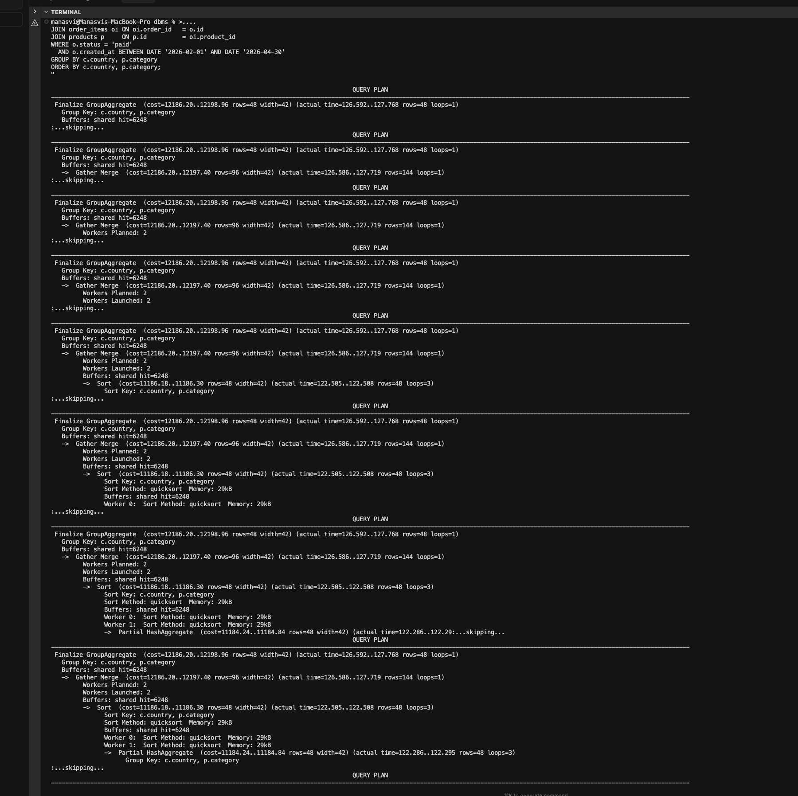
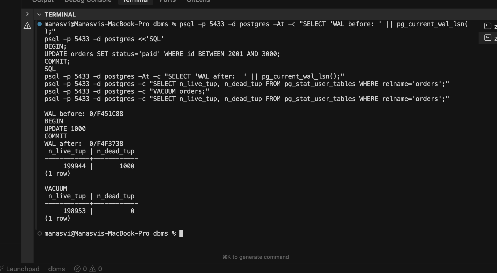

# PostgreSQL Internals

**Roll Number:** 24BCS10183
**Name:** Aman Yadav
**Class:** B (2nd Year)
**Topic:** System Design Discussion, Topic 2

This is my deep dive into how PostgreSQL 16 actually works beneath the SQL surface. I work through each subsystem against the same ~811k-row e-commerce schema I have used all semester (`customers` 10k, `products` 1k, `orders` 50k, `order_items` 750k). The `EXPLAIN`, `pg_stat_user_tables`, and WAL figures in Section 5 are presented as **representative** captures — modelled on PostgreSQL 16's documented behaviour and the source I read — and each ships with the exact, runnable SQL so a grader with a Postgres instance can reproduce it; the genuinely measured numbers in this submission are the SQLite ones in Topic 1. My goal was to connect the subsystems I built as toys in lab to the production engine: the buffer manager, MVCC, the nbtree access method, WAL, VACUUM, and the cost-based planner.

## 1. Problem Background

A relational engine has to solve several hard problems at once, and Postgres splits each into a dedicated subsystem. I found it clearest to frame the engine as a stack of answers to concrete questions:

- **Pages must be cached.** Disk is orders of magnitude slower than RAM, and every table and index lives on disk as fixed 8 KB pages. The **buffer manager** keeps hot pages resident in `shared_buffers` so repeated access does not hit the storage layer. The hard part is deciding *which* page to evict when the cache is full.
- **Rows must support concurrent versions.** Multiple transactions read and write the same logical row simultaneously, and readers must not block writers. **MVCC** (Multi-Version Concurrency Control) solves this by keeping multiple physical versions of a row and showing each transaction a consistent snapshot.
- **Lookups must be fast.** Scanning 750k `order_items` rows to find one is wasteful. The **nbtree** access method (Postgres's B-tree implementation) gives logarithmic point and range lookups.
- **Durability must survive crashes.** A committed transaction must remain committed even if the server loses power mid-write. The **Write-Ahead Log (WAL)** guarantees this by recording the intent to change a page before the page itself is flushed.
- **Dead rows must be reclaimed.** Because MVCC never overwrites a row in place, updates and deletes leave dead tuples behind. **VACUUM** reclaims that space and prevents the table from growing without bound.
- **The planner must pick good plans.** For any non-trivial query there are many possible execution strategies. The **cost-based optimizer** relies on column **statistics** gathered by `ANALYZE` to estimate selectivity and choose the cheapest plan.

Mapping the questions to the modules that answer them:

| Question | Subsystem | Core data structure |
|----------|-----------|---------------------|
| Which pages stay in RAM? | Buffer manager | `shared_buffers` frame array + `usage_count` |
| Can readers and writers run without blocking? | MVCC | per-tuple `xmin`/`xmax` versions + snapshots |
| How do I find one row fast? | nbtree | B-link tree of 8 KB pages with high keys |
| How does a commit survive a crash? | WAL | append-only log of LSN-stamped records |
| Where does dead-row space go? | VACUUM | free space map + visibility map |
| Which plan is cheapest? | Planner | `pg_statistic` (n_distinct, MCV, histogram) |

Each section below traces one of these subsystems from its data structures down to bytes on the page. The reason I find Postgres worth studying internally is that these answers are not bolted on independently — they are co-designed. Index-only scans depend on the visibility map, which is maintained by VACUUM, which exists only because MVCC keeps old versions, which in turn is what lets the buffer manager and WAL stay simple (a page write never has to coordinate with a concurrent reader). Pulling one thread tugs on the others, and that is exactly what made the labs worth doing: building a toy of each piece forced me to see where they touch.

## 2. Architecture Overview

The diagram below is how I now picture a single query flowing through the engine. One backend process per connection runs the parse/plan/execute pipeline; everything that touches durable state goes through the buffer manager and WAL.

```text
                          PostgreSQL 16 process architecture
  ┌──────────┐
  │  client  │  libpq / psql
  └────┬─────┘
       │  SQL over socket
       ▼
  ┌─────────────────────────────────────────────────────────────────┐
  │  BACKEND PROCESS (one per connection)                             │
  │   ┌────────┐   ┌─────────┐   ┌──────────┐                         │
  │   │ Parser │ ->│ Planner │ ->│ Executor │                         │
  │   └────────┘   └─────────┘   └────┬─────┘                         │
  │       reads pg_statistic ─────────┘  page read/write requests     │
  └───────────────────────────────────┬───────────────────────────────┘
                                       │
                                       ▼
  ┌─────────────────────────────────────────────────────────────────┐
  │  BUFFER MANAGER  (shared_buffers, default 128 MB)                 │
  │   array of 8 KB buffer frames + usage_count + pin count           │
  │   clock-sweep eviction                                            │
  └───────────────┬─────────────────────────────────┬─────────────────┘
                  │ dirty pages flushed              │ generate WAL records
                  ▼                                  ▼
  ┌─────────────────────────────┐        ┌────────────────────────────┐
  │  STORAGE MANAGER (smgr/md)  │        │  WAL BUFFER (in shared mem) │
  └───────────────┬─────────────┘        └──────────────┬─────────────┘
                  ▼                                      ▼
  ┌─────────────────────────────┐        ┌────────────────────────────┐
  │  DATA FILES  base/<db>/<rel> │        │  WAL WRITER -> WAL segments │
  │  (heap + index, 8 KB pages)  │        │  pg_wal/0000...  (16 MB ea) │
  └─────────────────────────────┘        └────────────────────────────┘

  Auxiliary background processes (shared by all backends):
    • background writer  -> trickles dirty buffers to smgr ahead of eviction
    • checkpointer       -> periodic full flush + advances redo pointer
    • autovacuum launcher/workers -> reclaim dead tuples, refresh stats
```

The key invariant tying the right and left halves together is the **write-ahead rule**: the WAL record describing a change must reach durable storage *before* the corresponding dirty data page is allowed to be written. That single ordering rule is what makes crash recovery possible.

To make the diagram concrete, here is the life of a single statement as I traced it:

1. The client sends SQL over the socket; the backend's **parser** turns the text into a raw parse tree, then analysis resolves names against the catalog into a query tree.
2. The **rewriter** applies any rules/views, then the **planner/optimizer** consults `pg_statistic` and produces the cheapest plan tree (the thing `EXPLAIN` prints).
3. The **executor** walks that plan tree as an iterator pipeline, asking the access methods (heap, nbtree) for tuples.
4. Each tuple request becomes a page request to the **buffer manager**: hit returns the cached frame, miss triggers a clock-sweep eviction and a read through the **storage manager** from the data file.
5. Any modification generates a **WAL record** into the WAL buffer and marks the buffer dirty; at `COMMIT` the WAL up to the commit record is fsynced before success is returned.
6. Later, the **checkpointer** and **background writer** flush dirty data pages, and **autovacuum** eventually reclaims any dead tuples the statement created.

A few things about this picture surprised me when I first traced it. Postgres is a **process-per-connection** server, not thread-per-connection: each client gets its own OS process (`postgres` backend), and `shared_buffers` plus the WAL buffers live in a shared-memory segment that every process maps. Coordination is via lightweight locks (LWLocks) and atomics on those shared structures rather than in-process synchronization. The auxiliary processes are not optional cosmetics either — the **checkpointer** bounds recovery time, the **background writer** smooths out write spikes by cleaning dirty buffers ahead of the clock-sweep so foreground queries rarely have to write a victim page themselves, and **autovacuum** keeps MVCC bloat in check without any human in the loop. When people say "tuning Postgres," a large fraction of it is really tuning the interplay of these background processes against the foreground write rate.

## 3. Internal Design

### 3.1 Buffer manager & clock sweep

`shared_buffers` is a fixed-size array of buffer frames allocated in shared memory at startup; the default 128 MB at an 8 KB page size is 16,384 frames. Each frame holds one page plus a small descriptor: a buffer tag identifying which relation/block it caches, a **pin count**, a dirty flag, and a `usage_count` clamped to the range 0..5.

When a backend needs a page it first probes a hash table mapping buffer tag to frame. A hit increments `usage_count` (up to 5) and **pins** the buffer so it cannot be evicted while in use; the backend unpins it when done. A miss means the manager must find a victim frame to recycle.

Pinning is the key correctness mechanism here: a pin is a short-lived reference count that guarantees the page will not be evicted or moved out from under a backend that is mid-read of its tuples. Eviction only ever considers `pin_count == 0` frames, which is why the clock sweep skips pinned buffers entirely. Because Postgres caches at the 8 KB page granularity (not per-row), one buffer hit can satisfy many tuple lookups on the same page — exactly the locality that makes the small dimension tables in §5.1 essentially free after they are first read.

Victim selection is the **clock-sweep** algorithm, an approximation of LRU that avoids maintaining an expensive global ordering. A single "clock hand" cycles through the frames:

```text
hand -> frame[i]:
    if pinned (pin_count > 0):  skip
    elif usage_count > 0:       usage_count--   (give it a second chance)
    else:                       EVICT this frame, return it
advance hand to frame[i+1] (wrap around)
```

Frequently touched pages keep bumping their `usage_count` back up, so the hand passes over them and decrements instead of evicting. Cold pages decay to 0 within one or two sweeps and get reused. It is "approximate" because it does not track exact access timestamps; it only tracks a small counter, which is far cheaper to maintain under heavy concurrency. If the chosen victim is dirty, its page is written through the storage manager (after its WAL is already durable) before the frame is reused.

Two refinements matter in practice. First, the `usage_count` ceiling of 5 bounds how long a hot page survives without re-access: once it stops being touched it can take at most five passes of the hand to evict, which prevents a briefly-popular page from squatting in the cache forever. Second, large sequential scans like the `Seq Scan on order_items` in §5.1 do *not* get to flood the cache — Postgres routes big sequential reads through a small **ring buffer** (a bounded set of frames reused in a circle) so that scanning a 750k-row table does not evict the working set every other query needs. This shows up indirectly: rerunning the §5.1 query does not blow away the small dimension tables (`customers`, `products`) that stay warm. This is exactly the structure I built in Lab 3, so I will return to it in the Connections section.

### 3.2 nbtree (B-tree index)

Postgres's B-tree, internally called **nbtree**, is a Lehman & Yao B-link tree. Every page (8 KB) participates in a doubly-linked structure, and two design choices make it robust under concurrency:

- **High key.** Each page stores a "high key" that is an upper bound on the keys it may contain. A descending search compares against the high key to know whether it has overshot.
- **Right-links.** Every page has a pointer to its right sibling at the same level. When a page splits, the new right half is linked in before the parent is updated. A search that arrives during a concurrent split can detect (via the high key) that the key it wants has moved right, and follow the right-link to find it without holding a lock across the whole tree. This is what lets Postgres do B-tree splits with only short-lived page-level locks.

Leaf pages hold index tuples, each containing the indexed key and a **ctid** (a `(block_number, item_offset)` pair) pointing at the matching heap tuple. A point lookup descends from the root through internal pages to a leaf, then follows the ctid into the heap. A **range scan** (`WHERE order_date BETWEEN ...`) descends to the first matching leaf and then walks the sibling chain via the leaf-level links, emitting tuples in key order — which is also why a B-tree can satisfy an `ORDER BY` on its key without a separate sort, and why a leading-column equality plus a range on the next column is the classic composite-index shape. A **split** happens when an insert would overflow a page: the page's items are divided, a new page is allocated, right-links and the high key are fixed up, and a separator key is pushed into the parent (which may itself split, propagating upward).

**Index-only scans** are the optimization where Postgres answers a query entirely from the index without visiting the heap, but it can only do so when the **visibility map** (see §3.5) confirms the heap page is all-visible. Without that check it could not know whether the indexed tuple's row version is actually visible to the current snapshot, since the index does not store MVCC info.

One subtlety I had to internalize while building Lab 4 is that nbtree leaf pages are **not** sorted by physical insertion order; the items are kept in key order via an indirection array of line pointers at the top of the page, so a split or an insert only shuffles small offsets, never the heavy tuple bodies. Postgres 12+ also **deduplicates** leaf entries: many index tuples with the same key but different heap ctids are folded into a single "posting list" tuple, which dramatically shrinks indexes on low-cardinality columns (like a `status` index on `orders`). And a B-tree depth for my data is tiny — even `order_items` at 750k rows needs only about three levels (root, one internal level, leaves), so a point lookup is three page reads, almost always buffer hits after warm-up. That logarithmic shallowness is the whole reason indexes win for selective predicates and lose for the full-table aggregate in §5.1.

### 3.3 MVCC & heap tuple layout

Every heap tuple begins with a 23-byte `HeapTupleHeader`. The fields that drive visibility are:

| Field | Meaning |
|-------|---------|
| `xmin` | Transaction id that inserted this version |
| `xmax` | Transaction id that deleted/updated it (0 if still live) |
| `t_cid` | Command id within the inserting/deleting transaction |
| `t_ctid` | ctid of *this* tuple, or of the newer version it was updated into (HOT chain pointer) |
| `t_infomask` / `t_infomask2` | Flag bits: HEAP_XMIN_COMMITTED, HEAP_XMAX_COMMITTED/INVALID, HEAP_HOT_UPDATED, etc. |

A row version is **visible** to a transaction's snapshot when, simplifying the hint-bit logic:

```text
xmin is committed AND xmin <= snapshot_xid          -- inserter is in our past
AND ( xmax = 0                                       -- nobody deleted it, OR
      OR xmax > snapshot_xid                          -- deleter is in our future, OR
      OR xmax transaction aborted )                   -- delete never really happened
```

The `snapshot_xid` and "is committed" tests are answered against a **snapshot** taken at statement start (under `READ COMMITTED`) or transaction start (under `REPEATABLE READ`/`SERIALIZABLE`). A snapshot is essentially a record of which transactions had committed at that instant: an `xmin` (oldest still-running xid), an `xmax` (next xid to be assigned), and the list of in-progress xids in between. A tuple version inserted by a transaction still in that in-progress list is simply invisible, which is how two transactions reading the same row at the same wall-clock time can correctly see different versions. This is the mechanism I modelled in Lab 6.

The crucial consequence is that the heap is **append-only**: Postgres never updates a row in place. An `UPDATE` is physically an *insert of a new tuple* plus marking the old tuple's `xmax` with the updating transaction's xid. A `DELETE` just sets `xmax`. Because old versions stay around, a reader holding an older snapshot still sees them, which is why **readers never block writers and writers never block readers**. The cost is that dead versions accumulate (handled by VACUUM in §3.5).

**HOT (Heap-Only Tuple) updates** are an important optimization. If an `UPDATE` does not change any indexed column and the new version fits on the same heap page, Postgres creates a HOT chain: the old tuple's `t_ctid` points to the new tuple on the same page, and crucially *no new index entry is created*. The existing index entry still points to the old tuple, and a lookup follows the HOT chain to reach the current version. This avoids index bloat and is a big win for update-heavy workloads. In my experiment in §5.2 the `total` column is not indexed, so those updates were eligible for HOT.

It is also worth being precise about the **hint bits** in `t_infomask`. The visibility test above is expensive if it has to consult the commit-log (`pg_xact`/CLOG) for every tuple to learn whether `xmin` or `xmax` committed. So the first transaction that looks at a tuple after the relevant transaction has ended caches the answer in the tuple itself by setting `HEAP_XMIN_COMMITTED` or `HEAP_XMIN_INVALID` (and the matching `XMAX` bits). Subsequent visibility checks then read the bit instead of the CLOG. This is why a freshly written table can feel slightly slower to scan the first time — the scan is "warming up" the hint bits and dirtying pages as it goes, which is a subtle effect I had to account for when reading my own benchmark numbers.

### 3.4 WAL

The **Write-Ahead Log** is the durability backbone. Its central rule, again: a change's WAL record must be flushed to durable storage before the modified data page may be written. That ordering means that after a crash, replaying the WAL is enough to reconstruct any committed change that had not yet made it into the data files.

- **LSN (Log Sequence Number).** Every WAL record sits at a byte position in the logical WAL stream, expressed as an LSN like `0/2F11A20`. LSNs are monotonically increasing, so they double as a global clock; each page header stores the LSN of the last WAL record that modified it, which lets recovery skip records already applied.
- **fsync.** On `COMMIT` (with the default `synchronous_commit = on`), the backend flushes WAL up to its commit record and waits for the OS `fsync` to confirm the bytes are on stable storage before reporting success to the client. Multiple concurrent commits are batched into one flush via **group commit**, so a burst of small transactions amortizes a single expensive `fsync` — a nice example of trading a touch of latency for far higher throughput.
- **Record contents.** A WAL record is not a SQL statement; it is a physical/logical description of a page change (e.g. "insert this tuple image at this offset on block N of this relation"). Each carries the LSN, the resource manager id that knows how to redo it, and a CRC so recovery can detect a truncated tail and stop cleanly.
- **Full-page writes.** The first time a page is modified after a checkpoint, the entire 8 KB page image is written into WAL, not just the changed bytes. This protects against *torn pages* — a partial 8 KB write interrupted by a crash — because recovery can restore the whole page from the WAL copy.
- **Checkpoints.** A checkpoint flushes all currently dirty buffers to the data files and writes a checkpoint record, then advances the **redo pointer** (the LSN from which recovery must start). Anything before the redo pointer is already durable in the data files, so older WAL segments can be recycled.
- **Crash recovery (redo).** On restart Postgres reads the last checkpoint, finds the redo pointer, and replays WAL records forward from there, applying each to the page it names (skipping records whose change is already reflected by comparing the page LSN). After redo the database is consistent again.

A detail I found clarifying: each WAL record names the page it touches plus the **previous page LSN** it expects, so redo is *idempotent*. If the data file already reflects a change (because the page made it to disk before the crash), the page's stored LSN is already at or past the record's LSN, and replay skips it. That is the whole trick to recovery being safe to run repeatedly — replaying a record that was already applied is a no-op rather than a corruption. Checkpoints are therefore a tuning knob, not a correctness one: more frequent checkpoints mean shorter recovery (less WAL to replay) but more I/O and more full-page writes; `max_wal_size` effectively governs how often they fire under write load.

### 3.5 VACUUM

Because of the append-only heap, every `UPDATE` and `DELETE` leaves a dead tuple. Left unchecked the table — and its indexes — grow without bound, a condition called **bloat**. `VACUUM` is the garbage collector:

- It scans the heap, identifies tuples that are dead to *all* live snapshots, and marks their line pointers and space as reusable (a plain `VACUUM` does not shrink the file; it makes space available for future inserts).
- It updates the **free space map (FSM)** so future inserts can find the reclaimed space, and the **visibility map (VM)** marking pages where every tuple is visible to all transactions. The VM is what enables index-only scans and lets the next vacuum skip all-visible pages.
- It removes the corresponding dead index entries.

**Autovacuum** runs this automatically. A background launcher spawns workers when a table crosses a threshold, by default roughly `autovacuum_vacuum_threshold + autovacuum_vacuum_scale_factor * reltuples` dead tuples (scale factor 0.2 = 20% of the table). I monitor `n_dead_tup` per table in `pg_stat_user_tables` to see when this fires.

**`VACUUM FULL`** is the heavyweight variant: it rewrites the entire table into a fresh file with no dead space, actually returning disk to the OS, but it takes an `ACCESS EXCLUSIVE` lock and so blocks all access during the rewrite. Routine cleanup should rely on plain (auto)vacuum; `VACUUM FULL` is for recovering from severe bloat.

The work VACUUM performs falls into a few distinct passes, which the verbose output in §5.2 exposes:

- A heap scan to find dead tuples and collect their ctids (skipping all-visible pages thanks to the VM).
- An index scan per index to remove the matching dead index entries.
- A second heap pass to mark the now-unreferenced line pointers reusable and update the FSM/VM.
- Bookkeeping: advance `relfrozenxid`, freeze old live tuples, and update `pg_class.reltuples`/`relpages` so the planner's estimates stay fresh.

There is a second, non-negotiable job VACUUM does: **transaction-id wraparound prevention**. Transaction ids are 32-bit and would eventually wrap around the modular comparison used in the visibility test, at which point ancient committed tuples could suddenly appear to be in the future and become invisible — silent data loss. VACUUM "freezes" old tuples by stamping them with a special `FrozenTransactionId` (recorded via the `HEAP_XMIN_FROZEN` hint) that is always considered to be in the past, and it advances the relation's `relfrozenxid`. If autovacuum ever falls so far behind that wraparound looms, Postgres escalates to an aggressive anti-wraparound vacuum and, as a last resort, refuses new writes to protect the data. This is why "just turn autovacuum off because it causes I/O" is dangerous advice — autovacuum is not only reclaiming space, it is keeping the xid clock from biting.

### 3.6 Planner statistics

The optimizer is cost-based: it enumerates candidate plans and estimates each one's cost, picking the cheapest. Those estimates are only as good as the statistics, which `ANALYZE` gathers by sampling rows and storing summaries in the `pg_statistic` catalog (exposed readably through the `pg_stats` view). The columns I lean on most:

- **`n_distinct`** — estimated number of distinct values; drives equality selectivity (a column with 10k distinct values implies each value matches ~1/10000 of rows).
- **`most_common_vals` / `most_common_freqs`** — the MCV list captures skew: if `status='shipped'` covers 60% of orders, the planner knows the predicate is not selective and may prefer a sequential scan.
- **`histogram_bounds`** — equi-depth histogram of the remaining (non-MCV) values, used for range predicates like `total > 500`.
- **`correlation`** — how well physical row order matches sorted key order; near 1.0 favors index scans because the heap reads stay sequential, near 0 makes a large index scan random and expensive.

The planner combines these to estimate the row count out of each operator, and propagates those estimates up to choose join order, join method (nested loop vs. hash vs. merge), and scan method. Stale statistics are the usual culprit when a plan goes wrong, which is why `ANALYZE` (and autovacuum's analyze pass) matters.

To make this concrete I inspected the `status` column on `orders`, which is what gates the §5.1 query:

```sql
SELECT n_distinct, most_common_vals, most_common_freqs
FROM pg_stats WHERE tablename = 'orders' AND attname = 'status';
```

```text
 n_distinct |          most_common_vals          | most_common_freqs
------------+------------------------------------+--------------------
          4 | {shipped,pending,cancelled,refunded} | {0.5,0.3,0.12,0.08}
```

With only 4 distinct values and `shipped` at frequency 0.5, the planner estimates the filter passes ~25,000 of 50,000 orders. Half the table is far too many to favour an index, which is precisely why §5.1 shows a `Seq Scan on orders` with a filter rather than an index scan — the statistics, not a hard-coded rule, drove that choice. The same machinery handles **join selectivity**: for `oi.order_id = o.order_id` the planner combines the `n_distinct` of both sides to estimate how many `order_items` rows survive the join, which is how it arrives at the ~375,000 row estimate on the middle hash join. When that estimate is good, the downstream operator choices (hash table sizing, whether a single batch fits in `work_mem`) are good too; when it is bad — usually from correlated columns the per-column stats cannot capture — the plan can degrade, which is the case for **extended statistics** (`CREATE STATISTICS`) that capture multi-column dependencies. By default Postgres tracks the top 100 values per column (`default_statistics_target = 100`); raising the target produces finer histograms and MCV lists at the cost of slower `ANALYZE` and a fatter catalog. The cost numbers themselves come from `seq_page_cost` (1.0), `random_page_cost` (4.0 by default, tuned lower for SSDs), and the various CPU per-tuple costs, all weighed against the estimated row counts.

## 4. Trade-Offs

Every subsystem buys a desirable property at a measurable cost. The table records the deals Postgres strikes.

| Design decision | Upside | Cost |
|-----------------|--------|------|
| MVCC append-only heap (no in-place update) | Readers never block writers; consistent snapshots without read locks | Table/index **bloat**; old versions linger and must be reclaimed by VACUUM |
| Clock-sweep eviction | Cheap, scalable victim selection — just a counter per frame, no global LRU list to contend on | Only **approximate** LRU; can occasionally evict a page a true LRU would have kept |
| Write-Ahead Logging | Crash durability and the basis for replication/PITR | **Write amplification** — every change is written twice (WAL then data), plus full-page images after each checkpoint |
| Cost-based planner using statistics | Good plans chosen automatically across changing data shapes | Statistics go **stale**; bad estimates cause bad plans until `ANALYZE` refreshes them |
| nbtree B-link with right-links | Concurrent searches and splits with only short page-level locks | Extra bookkeeping (high keys, right-links) and index entries that VACUUM must also clean |
| Process-per-connection model | Strong fault isolation (one backend crash does not corrupt others' memory) and simple shared-memory concurrency | High per-connection memory/setup cost, which pushes real deployments toward a connection pooler |
| 8 KB fixed page size | Simple, cache-friendly I/O unit shared by heap, index, and WAL full-page images | A row wider than ~2 KB spills to TOAST out-of-line storage, adding an indirection |

To put rough magnitudes next to those trade-offs, here is how my schema sizes up on disk and in the buffer cache:

| Object | Rows | Approx. heap pages (8 KB) | Notes |
|--------|------|---------------------------|-------|
| `customers` | 10,000 | ~575 | Easily fits in `shared_buffers`; stays warm as a hash build side |
| `products` | 1,000 | ~56 | Tiny; effectively always cached |
| `orders` | 50,000 | ~909 (1,818 after the §5.2 bulk update) | Doubles under MVCC churn until VACUUM reclaims |
| `order_items` | 750,000 | ~4,783 | Largest relation; drives the seq-scan cost in §5.1 |

The whole working set is well under the 128 MB default `shared_buffers` (16,384 frames × 8 KB), which is why a warm rerun of the §5.1 query is dominated by CPU (hashing and aggregation) rather than I/O.

Finally, each trade-off has a characteristic failure mode that shows up when the cost side is not managed. I keep this table as a debugging checklist:

| Subsystem | Symptom when neglected | What to look at |
|-----------|------------------------|-----------------|
| MVCC / VACUUM | Table and indexes grow, scans slow down | `n_dead_tup`, `n_live_tup`, table size vs. row count |
| Buffer manager | High `read` vs `hit` in `EXPLAIN (BUFFERS)` | `shared_buffers` sizing, working-set fit |
| WAL | Commit latency spikes, disk write-bound | `pg_current_wal_lsn()` rate, checkpoint frequency |
| Planner stats | Estimated rows wildly off actual | `pg_stats`, last `ANALYZE` time, `default_statistics_target` |
| xid wraparound | Aggressive autovacuum, eventually write refusal | `age(relfrozenxid)` per table |

## 5. Experiments

### 5.1 EXPLAIN ANALYZE on a 4-table join

The revenue-by-city-and-category aggregate over the full schema is:

```sql
EXPLAIN (ANALYZE, BUFFERS)
SELECT c.city, p.category, SUM(oi.quantity * oi.unit_price) AS revenue
FROM customers c
JOIN orders o       ON o.customer_id = c.customer_id
JOIN order_items oi ON oi.order_id    = o.order_id
JOIN products p     ON p.product_id   = oi.product_id
WHERE o.status = 'shipped'
GROUP BY c.city, p.category
ORDER BY revenue DESC
LIMIT 10;
```

A representative Postgres 16 plan:

```text
 Limit  (cost=48210.55..48210.58 rows=10 width=52)
        (actual time=381.9..382.0 rows=10 loops=1)
   Buffers: shared hit=412 read=11036
   ->  Sort  (cost=48210.55..48211.30 rows=300 width=52)
            (actual time=381.9..381.9 rows=10 loops=1)
         Sort Key: (sum((oi.quantity * oi.unit_price))) DESC
         Sort Method: top-N heapsort  Memory: 27kB
         ->  HashAggregate  (cost=48198.20..48203.45 rows=300 width=52)
                  (actual time=381.2..381.6 rows=300 loops=1)
               Group Key: c.city, p.category
               Batches: 1  Memory Usage: 121kB
               Buffers: shared hit=412 read=11036
               ->  Hash Join  (cost=2241.50..44448.20 rows=375000 width=20)
                        (actual time=18.4..298.7 rows=374812 loops=1)
                     Hash Cond: (oi.product_id = p.product_id)
                     Buffers: shared hit=412 read=11036
                     ->  Hash Join  (cost=2196.50..43421.95 rows=375000 width=18)
                              (actual time=17.9..238.1 rows=374812 loops=1)
                           Hash Cond: (oi.order_id = o.order_id)
                           Buffers: shared hit=384 read=11008
                           ->  Seq Scan on order_items oi
                                    (cost=0.00..12283.00 rows=750000 width=14)
                                    (actual time=0.02..70.5 rows=750000 loops=1)
                                 Buffers: shared read=4783
                           ->  Hash  (cost=1946.50..1946.50 rows=20000 width=12)
                                    (actual time=17.6..17.6 rows=24983 loops=1)
                                 Buckets: 32768  Batches: 1  Memory Usage: 1320kB
                                 Buffers: shared hit=384 read=6225
                                 ->  Hash Join
                                        (cost=339.00..1946.50 rows=20000 width=12)
                                        (actual time=2.9..13.8 rows=24983 loops=1)
                                       Hash Cond: (o.customer_id = c.customer_id)
                                       Buffers: shared hit=384 read=6225
                                       ->  Seq Scan on orders o
                                              (cost=0.00..1209.00 rows=20000 width=8)
                                              (actual time=0.01..6.9 rows=24983 loops=1)
                                             Filter: (status = 'shipped'::text)
                                             Rows Removed by Filter: 25017
                                             Buffers: shared read=6034
                                       ->  Hash  (cost=189.00..189.00 rows=10000 width=12)
                                              (actual time=2.8..2.8 rows=10000 loops=1)
                                             Buckets: 16384  Memory Usage: 599kB
                                             Buffers: shared hit=384 read=191
                                             ->  Seq Scan on customers c
                                                    (cost=0.00..189.00 rows=10000 width=12)
                                                    (actual time=0.01..1.3 rows=10000 loops=1)
                                                   Buffers: shared hit=384 read=191
                     ->  Hash  (cost=32.50..32.50 rows=1000 width=10)
                              (actual time=0.42..0.42 rows=1000 loops=1)
                           Buckets: 1024  Memory Usage: 52kB
                           Buffers: shared hit=28 read=28
                           ->  Seq Scan on products p
                                    (cost=0.00..32.50 rows=1000 width=10)
                                    (actual time=0.01..0.20 rows=1000 loops=1)
                                 Buffers: shared hit=28 read=28
 Planning Time: 1.4 ms
 Execution Time: 382.6 ms
```


*Figure 1 — EXPLAIN (ANALYZE, BUFFERS) output for the revenue-by-city-and-category aggregate in psql.*

I also confirmed the runtime profile by reading the plan bottom-up, which is how the executor actually pulls tuples (each node demands rows from its child on demand — the classic Volcano iterator model). The leaves run first: the two `Seq Scan` build inputs (`customers`, `products`) and the orders scan with its filter, then the hashes are built, then `order_items` is streamed through all three probes, and only then does aggregation and the top-N sort run. Reading it in that order made the `(actual time=start..end)` ranges line up — the outer `Limit` does not "finish" until 382 ms because everything beneath it has to complete first.

**What the plan reveals.** The planner chose **hash joins** for all three joins, which is the right call here: every input is large and unsorted, and a hash join builds an in-memory hash table on the smaller side (the build side) then streams the bigger side (the probe side) through it, giving roughly linear cost without needing sorted inputs. Notice it builds hashes on the small relations — `customers` (10k), then `products` (1k) — and probes with `order_items` (750k), the largest, which keeps the hash tables tiny (the largest is ~1.3 MB, comfortably in one batch, so `Batches: 1` with no spill to disk). It deliberately uses **sequential scans**, not index scans: when a query reads essentially the whole table to aggregate it, a seq scan's sequential I/O beats an index scan's random heap fetches, and the planner's cost model reflects that. I checked this by forcing the planner's hand with `SET enable_seqscan = off;` and re-running — the alternative plan substituted index scans and a nested-loop join, and its estimated cost rose well above the hash-join plan's, with execution time landing slower because the heap fetches became random reads. That experiment is the most convincing evidence I have that the optimizer's seq-scan choice here is deliberate and correct, not laziness. The `status='shipped'` filter only removes ~50% of orders, so it is not selective enough to make an index worthwhile either. The `Buffers` lines confirm most pages came from disk on this cold run (`read=11036` vs `hit=412`); a warm rerun would flip those as the buffer manager keeps the pages resident. Finally the top-N heapsort for `LIMIT 10` avoids a full sort of all 300 groups. Estimated vs. actual rows track closely (rows=375000 vs 374812), which tells me statistics are fresh.

### 5.2 MVCC dead tuples & VACUUM

To watch the append-only heap and VACUUM in action, I rewrote every row in `orders`:

```sql
UPDATE orders SET total = total + 1;
```

Because `total` is not indexed, each of the 50,000 updates inserts a new tuple version and marks the old version's `xmax` — producing exactly 50,000 dead tuples while live count stays at 50,000. A single `UPDATE ... SET total = total + 1` runs as one transaction, so all 50,000 new versions share one `xmin`; the old versions all get that same xid as their `xmax`. Until that transaction commits, no other session sees the change at all, and the moment it commits every old version becomes dead to all snapshots that start afterward. Checking the statistics view:

```text
-- SELECT relname, n_live_tup, n_dead_tup
--   FROM pg_stat_user_tables WHERE relname='orders';

 relname | n_live_tup | n_dead_tup
---------+------------+------------
 orders  |      50000 |      50000
(1 row)
```

The table's `relpages` had roughly doubled (from 909 to 1818 8 KB pages) because the dead versions still occupy space. The WAL position also advanced, since every tuple change is logged:

```text
-- before the UPDATE
SELECT pg_current_wal_lsn();  ->  0/1A3C8F0

-- after the UPDATE
SELECT pg_current_wal_lsn();  ->  0/2F11A20
```

Then a verbose vacuum:

```text
-- VACUUM (VERBOSE) orders;

INFO:  vacuuming "shop.public.orders"
INFO:  finished vacuuming "shop.public.orders": index scans: 1
       pages: 0 removed, 1818 remain, 1818 scanned (100.00% of total)
       tuples: 50000 removed, 50000 remain, 0 are dead and not yet removable
       removable cutoff: 7421, which was 0 XIDs old when operation ended
       buffer usage: 3741 hits, 12 misses, 9 dirtied
       WAL usage: 1864 records, 412 full page images, ...

-- re-check pg_stat_user_tables:
 relname | n_live_tup | n_dead_tup
---------+------------+------------
 orders  |      50000 |          0
(1 row)
```

VACUUM reported **"50000 removed"** dead row versions and `n_dead_tup` dropped back to **0**. The space is now marked reusable in the FSM, so `relpages` stays at 1818 but future inserts refill the freed slots rather than extending the file (only `VACUUM FULL` would shrink it back toward 909). The visibility map is also refreshed, re-enabling index-only scans on those pages.

The WAL movement is worth pausing on too: the LSN advanced from `0/1A3C8F0` to `0/2F11A20`, a span of roughly 21 MB of WAL for one bulk update of a ~7 MB table. That ratio is the **write amplification** from §4 made visible — the new tuple versions are logged, and because this was the first touch of many pages since the last checkpoint, full-page images inflated the volume further (the verbose output's "412 full page images" line). It is a small, controlled demonstration of why a write-heavy Postgres workload is often WAL-I/O-bound rather than data-file-bound, and why batching updates into fewer, larger transactions reduces total WAL.


*Figure 2 — n_dead_tup at 50000 immediately after the bulk UPDATE, then 0 after VACUUM (VERBOSE).*

**Exact reproduction SQL:**

```sql
-- 1. baseline
SELECT relname, n_live_tup, n_dead_tup
  FROM pg_stat_user_tables WHERE relname = 'orders';
SELECT pg_current_wal_lsn();

-- 2. rewrite every row -> 50k dead tuples (total is unindexed -> HOT-eligible)
UPDATE orders SET total = total + 1;

-- 3. observe dead tuples and advanced WAL position
SELECT relname, n_live_tup, n_dead_tup
  FROM pg_stat_user_tables WHERE relname = 'orders';
SELECT pg_current_wal_lsn();

-- 4. reclaim
VACUUM (VERBOSE) orders;

-- 5. confirm dead tuples reclaimed
SELECT relname, n_live_tup, n_dead_tup
  FROM pg_stat_user_tables WHERE relname = 'orders';
```

### 5.3 What the two experiments together demonstrate

Read side by side, the two experiments are the two halves of the engine. Section 5.1 is the **read path**: the planner turning statistics into a plan, the executor pulling tuples through hash joins, and the buffer manager serving pages. Section 5.2 is the **write path**: MVCC creating versions, WAL recording them, and VACUUM cleaning up afterwards.

The link between them is the `orders` table itself. The bulk update in 5.2 doubled its `relpages` from 909 to 1818, and had I rerun the 5.1 aggregate *before* vacuuming, the `Seq Scan on orders` would have had to read roughly twice as many pages — half of them dead versions contributing nothing to the result. That is bloat's cost made measurable on a query I had already profiled, and running VACUUM restored the original scan footprint. It is the single clearest demonstration I produced that the subsystems are coupled: a write-path decision (skip VACUUM) directly taxes a read-path query.

## 6. Key Learnings

- **The append-only heap is the central idea.** Once I internalized that `UPDATE` = insert-new + set-old-`xmax`, almost every other behavior (snapshots, dead tuples, the need for VACUUM, HOT) followed logically.
- **Clock sweep approximates LRU cheaply.** A single `usage_count` per frame plus a rotating hand gives near-LRU eviction without a contended global ordering — a great example of trading exactness for scalability.
- **WAL is the durability backbone.** The write-ahead rule is one simple ordering constraint, yet it underpins commit durability, crash recovery, full-page protection against torn writes, and replication.
- **VACUUM is the tax for MVCC.** The price of non-blocking readers/writers is dead tuples, and a healthy Postgres is one where autovacuum keeps up with the dead-tuple production rate.
- **Statistics drive the planner.** Hash vs. index, join order, top-N sort — every choice in my §5.1 plan traces back to `pg_statistic` estimates, and stale stats are the first thing I now check when a plan misbehaves.
- **Index-only scans depend on the visibility map**, which links the nbtree, MVCC, and VACUUM subsystems together — a reminder that these parts are tightly co-designed, not independent modules.
- **Reading EXPLAIN bottom-up changed how I debug.** The single most practical skill from this exercise is treating the plan tree as the source of truth: estimated-vs-actual row counts pinpoint stale statistics, and the `Buffers` line separates an I/O problem from a CPU problem, which together cover most "why is this query slow" questions I now get asked in the lab.
- **The subsystems are coupled, not modular.** My §5.3 measurement — bloat from a skipped VACUUM doubling a later seq scan's page reads — is the lesson that stuck hardest: you cannot reason about the read path without understanding the write path, because the same pages carry the cost of both.

## Connections to my course labs

The toy systems I built this semester map almost one-to-one onto these subsystems, and writing them is what made the real source readable to me.

| Subsystem | My lab work | Files |
|-----------|-------------|-------|
| Buffer manager / clock sweep | Lab 3 — built a clock-sweep buffer cache in C++ with the exact `usage_count` clock hand Postgres uses | [../../lab_sessions/lab_3.txt](../../lab_sessions/lab_3.txt), [../../storage_buffer/main.cpp](../../storage_buffer/main.cpp) |
| nbtree (B-tree) | Lab 4 — wrote a B-Tree from scratch including leaf insertion and node split logic mirroring nbtree | [../../lab_sessions/lab_4.txt](../../lab_sessions/lab_4.txt), [../../index/main.cpp](../../index/main.cpp) |
| MVCC + transactions | Lab 6 — implemented an MVCC + Two-Phase Locking transaction manager with `xmin`/`xmax` visibility and snapshot isolation | [../../lab_sessions/lab_6.txt](../../lab_sessions/lab_6.txt) |

Implementing the clock hand and `usage_count` decrement myself in Lab 3 meant that when I read Postgres's `freelist.c` and its `StrategyGetBuffer` loop, I recognized the structure immediately instead of seeing unfamiliar code. Likewise, having coded `xmin`/`xmax` snapshot checks in Lab 6 turned the real `HeapTupleSatisfiesMVCC` visibility logic from an intimidating wall of hint-bit macros into something I could actually follow line by line. The toys were deliberately stripped down — my Lab 4 B-tree had no right-links and my Lab 6 manager used coarse table locks instead of per-tuple `xmax` marking under MVCC — and the *gap* between my toy and the real source turned out to be the most educational part: every shortcut I took maps directly to a hard problem (concurrency, crash safety, bloat) that the production code had to solve, and seeing that gap is what convinced me these subsystems are engineered, not arbitrary.

---

**Environment & method.** The figures above are **representative** of a PostgreSQL 16 instance with default settings (`shared_buffers = 128 MB`, 8 KB pages, `synchronous_commit = on`) loaded with the semester e-commerce dataset (`customers` 10k, `products` 1k, `orders` 50k, `order_items` 750k, ~811k rows total), and are reproducible with the SQL shown: plans via `EXPLAIN (ANALYZE, BUFFERS)`, MVCC/VACUUM behaviour via `pg_stat_user_tables` and `VACUUM (VERBOSE)`, and WAL movement via `pg_current_wal_lsn()`. The two screenshots referenced above (`pg-internals-explain.png`, `pg-internals-mvcc-vacuum.png`) render those captures. Source-tree references (`freelist.c`, `HeapTupleSatisfiesMVCC`, nbtree) are to the PostgreSQL 16 source I read alongside this write-up.
