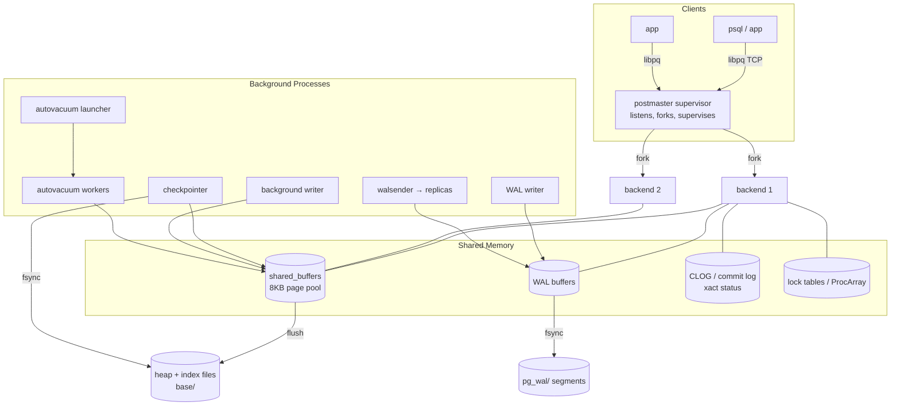
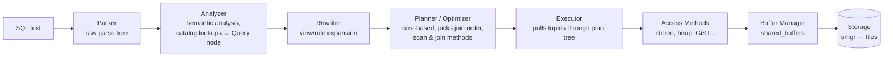

# PostgreSQL Internal Architecture

*Advanced DBMS — System Design Discussion*

> A study of *why* PostgreSQL is built the way it is. The recurring thesis of this
> document is that almost every design choice in the engine is a deliberate
> trade-off, and that understanding the trade-off is more valuable than memorizing
> the mechanism.

---

## 1. Problem Background

PostgreSQL descends from the **POSTGRES** project started by Michael Stonebraker at
UC Berkeley in 1986. Stonebraker had already built **Ingres** (a relational system)
and POSTGRES — "post-Ingres" — was the research vehicle for the next set of
questions: how do you make a relational database *extensible* (user-defined types,
operators, index access methods), how do you support complex objects and rules, and
how do you keep historical versions of rows without a separate redo/undo apparatus.
That last idea — keeping multiple versions of a row in the storage itself — is the
ancestor of today's MVCC.

The lineage matters because it explains the shape of the code:

| Era | Name | What changed |
|-----|------|--------------|
| 1986–1994 | POSTGRES (Berkeley) | Research engine, used PostQUEL, no-overwrite storage |
| 1994–1995 | Postgres95 | PostQUEL replaced by SQL; public release |
| 1996– | PostgreSQL | Renamed, community-governed; MVCC, WAL, planner maturity |

**Why a process-based, client-server RDBMS with MVCC exists.** PostgreSQL was built
to solve a cluster of problems simultaneously, and the architecture is the
intersection of those answers:

1. **Concurrency without read locks.** In a lock-based (2PL) system, readers block
   writers and writers block readers. For an OLTP system serving many short
   transactions, that serialization is the bottleneck. MVCC's promise is
   *readers never block writers and writers never block readers* — a reader sees a
   consistent snapshot of committed data without taking a single shared lock on a
   row. This is the single most important property of the engine.

2. **Extensibility.** The relational core is deliberately thin; types, operators,
   functions, and even *index access methods* (B-tree, GiST, GIN, BRIN, hash) are
   pluggable. The catalog *is* the type system. This is the Berkeley DNA.

3. **Durability.** A committed transaction must survive a crash. PostgreSQL achieves
   this with **Write-Ahead Logging** rather than synchronously writing every data
   page, decoupling commit latency from random heap I/O.

4. **Robustness / isolation.** A misbehaving connection (a segfault in a buggy C
   extension, an OOM) should not corrupt the shared state of other sessions. The
   process-per-connection model gives OS-enforced memory isolation as a fault
   boundary.

The result is a system where the *interesting* engineering is not the SQL surface
but the storage and concurrency machinery underneath it. That machinery is the
subject of Section 3.

---

## 2. Architecture Overview

PostgreSQL is a **multi-process** server. A supervisor (the *postmaster*) forks one
backend process per client connection; processes communicate through a region of
**shared memory** and coordinate durability through the WAL. A set of background
processes handle work that must happen independently of any single client.



**Query data flow inside a backend.** When a backend receives a SQL string, it runs
it through a fixed pipeline. Each stage produces a tree consumed by the next:



The division of labor is worth internalizing: the **parser** only knows grammar; the
**analyzer** binds names to catalog objects; the **rewriter** applies rules and
expands views; the **planner** is the cost-based optimizer that chooses *how* to
execute; the **executor** is a demand-driven (Volcano-style) iterator tree that pulls
tuples; **access methods** translate "give me the next matching tuple" into page
requests; and the **buffer manager** is the sole gatekeeper between in-memory pages
and the storage manager. Everything below the executor is shared infrastructure —
which is exactly why the next section focuses there.

---

## 3. Internal Design

This is the core of the document. Four subsystems define the engine's behavior:
the **Buffer Manager**, the **B-Tree (nbtree)**, **MVCC**, and **WAL**. They are not
independent — the most important rules in PostgreSQL are the *ordering constraints
between* these subsystems (e.g. WAL-before-data).

### 3.1 Buffer Manager — `src/backend/storage/buffer/`

All access to relation data goes through the shared buffer pool. A relation file is
an array of **8 KB pages**; the buffer pool is an array of **8 KB buffer frames**
(`shared_buffers`). Nothing in the executor or access methods touches a disk page
directly — they ask the buffer manager for a page, work on the in-memory copy, and
release it.

**Core data structures.**

- **Buffer frames**: the actual `shared_buffers` array of page-sized slots.
- **`BufferDesc` (buffer headers)**: one descriptor per frame holding the buffer's
  *identity* (a `BufferTag` = relation OID + fork + block number), a
  `state` word packing the **dirty** bit, the **valid** bit, the **pin/refcount**,
  and the **`usage_count`**, plus a per-buffer content lock.
- **Buffer mapping hash table**: maps `BufferTag → buffer id`. This answers the
  question "is block N of relation R already in memory, and if so, where?"

**Reading a page (the lookup path).**

```
                 BufferTag = {relfilenode, forkNum, blockNum}
                              |
                              v
       +----------------------------------------+
       |  buffer mapping hash table (partitioned)|
       +----------------------------------------+
         hit? --------------------> return buffer id, pin++, usage_count++
         miss ----> pick a victim frame (clock sweep)
                    if victim dirty -> ensure WAL flushed -> write page out
                    read requested block from smgr into frame
                    insert new BufferTag into hash table, pin it
```

A **pin** is a short-lived reference count that says "this frame is in use, do not
evict or relocate it." `usage_count` is the *recency/frequency* signal used by
replacement. The two are different: a pin is a correctness lock; `usage_count` is an
eviction hint.

**Replacement: clock-sweep, not LRU.** The victim selection uses a **clock-sweep**
algorithm. A "clock hand" cycles through the buffer descriptors; at each frame:

```
while choosing a victim:
    if buffer is pinned:        skip (cannot evict)
    elif usage_count > 0:       usage_count-- ; advance hand   (second chance)
    else:                       evict this buffer
```

`usage_count` is incremented (capped at a small max) each time a buffer is touched.

**Why clock-sweep over strict LRU?** A true LRU must move the just-touched buffer to
the head of a global list on *every* access. Under high concurrency, that list head
is a single hot contention point — every reader needs the same lock to record "I used
this." Clock-sweep needs no global ordering: a hit just bumps a per-buffer counter
(an atomic on the buffer's own state word), and eviction is a lock-free-ish sweep.
Clock-sweep is an *approximation* of LRU that trades a little precision for a massive
reduction in lock contention. That trade — accuracy for scalability — recurs
throughout the engine.

**Double buffering and the OS page cache.** PostgreSQL deliberately does **not** use
`O_DIRECT` for normal data files. A page can live both in `shared_buffers` *and* in
the kernel page cache — "double buffering." This wastes some RAM but lets the OS do
read-ahead and absorb writes, and it keeps PostgreSQL portable across kernels. The
practical consequence is the well-known advice *not* to set `shared_buffers` to most
of RAM: past a point you're just duplicating the OS cache.

**The ordering rule that ties the Buffer Manager to WAL.** A dirty buffer holds a
**page LSN** — the LSN of the last WAL record that modified it. The invariant is:

> A dirty buffer **must not be written to disk** until the WAL up to that page's LSN
> has been flushed to durable storage.

This is **WAL-before-data**. The buffer manager enforces it at eviction time: before
writing a dirty victim out, it calls `XLogFlush(page_lsn)`. Without this rule, a
crash could leave a data page on disk describing a change whose WAL record was lost —
unrecoverable corruption. So the buffer manager is not just a cache; it is a
*durability gatekeeper*.

### 3.2 B-Tree — `src/backend/access/nbtree/`

PostgreSQL's default index is a **B-tree**, but specifically a
**Lehman & Yao (1981) B-link tree** with high keys. The L&Y design exists to answer
one question: *how do you let many backends search and modify a tree concurrently
without locking large parts of it?*

**Page layout (the same `PageHeader` + line-pointer layout the heap uses).**

```
  +-----------------------------------------------------------+
  | PageHeaderData (LSN, checksum, lower, upper, ...)          |
  +-----------------------------------------------------------+
  | ItemId[0] ItemId[1] ItemId[2] ...   (line pointers grow → )|
  |   ........  free space  ........                           |
  | ( ← index tuples grow downward )         IndexTuple_n      |
  | IndexTuple_2   IndexTuple_1   IndexTuple_0                 |
  +-----------------------------------------------------------+
  | "High key"  (upper bound: every key on page <= high key)  |
  +-----------------------------------------------------------+
  | Special area: BTPageOpaque                                |
  |   btpo_prev | btpo_next (RIGHT-LINK) | btpo_flags | level |
  +-----------------------------------------------------------+
```

Two structures make L&Y work:

- **High key**: each page stores the upper bound of keys it (and its subtree) is
  responsible for. A searcher can test "is my key still within this page's range?"
- **Right-link (`btpo_next`)**: every page points to its right sibling at the same
  level. The tree is also a singly linked list at each level.

**Search path: root → internal → leaf.** A search descends from the root
(`metapage → root`), at each internal node binary-searching to the child whose key
range covers the target, until it reaches a leaf. Leaf entries are
`(index key, heap TID/ctid)` — i.e. the index *points into the heap*; it stores the
physical location of the row version, not the row itself.

**Page splits — the crux of the concurrency design.** When a leaf overflows on
insert, it splits:

```
   before:        [ A B C D E ]  ->next-> [ G H ... ]
                          |
   1. create right page R, move upper half into R
   2. set L.high_key = first key of R
   3. set R.btpo_next = L.btpo_next ;  L.btpo_next = R   (relink, atomic-ish)
   4. (WAL the split)
   5. insert downlink for R into the PARENT
```

Step 3 happens **before** step 5. For a brief window the parent does not yet know
about page `R`, yet the tree is still *correct and searchable*. Here is why: a
concurrent searcher that descended to `L` looking for a key that now lives on `R`
will find its key is **greater than L's high key**, conclude "I need to go right,"
and follow `L.btpo_next` to `R` — the **move-right** rule. The right-link is a safety
net that makes the split atomic *from a searcher's perspective* even though it is
several physical writes.

This is the whole point of L&Y: **splits never require locking the path back up to
the root.** A naive B-tree would lock the parent (and possibly grandparent) for the
duration of a split, serializing concurrent inserts. The right-link lets a search
that "fell behind" repair its own descent by walking right, so writers only ever hold
a couple of page-level locks at a time.

**Heap pointers, HOT, deduplication, index-only scans.**

- Leaf entries store a **TID (`ctid` = block, offset)** into the heap. An index entry
  is therefore tied to a *physical tuple version*.
- **Deduplication**: many equal keys (e.g. a low-cardinality column) are stored once
  with a *list* of TIDs, shrinking the index.
- **Index-only scans**: if a query's columns are all in the index, PostgreSQL can
  skip the heap fetch entirely — *but only if* the **visibility map** marks the page
  all-visible. The index alone does not know whether a tuple version is visible to
  the current snapshot (that's MVCC's job, next), so the visibility map is the bridge
  that lets the optimizer avoid the heap.

### 3.3 MVCC — Multi-Version Concurrency Control

MVCC is the reason readers don't block writers. The mechanism is simple to state and
deep in consequence: **PostgreSQL never updates a row in place; it writes a new
version and leaves the old one behind**, then uses transaction-id bookkeeping to
decide which version each transaction may see.

**Heap tuple header.** Every heap tuple carries a `HeapTupleHeader`:

| Field | Meaning |
|-------|---------|
| `t_xmin` | XID of the transaction that **inserted** this version |
| `t_xmax` | XID that **deleted/updated** it (0 if live) |
| `t_cid`  | command id (statement ordering *within* a transaction) |
| `t_ctid` | (block, offset) pointing to **this** tuple, or to its **successor** version |
| `t_infomask` | hint bits: `XMIN_COMMITTED`, `XMIN_ABORTED`, `XMAX_COMMITTED`, HOT flags, etc. |

**How DML maps to versions:**

- **INSERT** → write one tuple with `t_xmin = myXID`, `t_xmax = 0`.
- **DELETE** → do *not* remove the tuple; set its `t_xmax = myXID`. It becomes a
  "dead" tuple once no snapshot can still see it.
- **UPDATE** = DELETE + INSERT: set old tuple's `t_xmax = myXID`, write a new tuple
  version, and set the **old tuple's `t_ctid` to point at the new one**, forming a
  version chain `old → new`.
- **HOT (Heap-Only Tuple) update**: if no *indexed* column changed **and** the new
  version fits on the **same page**, the new version is reachable purely by following
  `t_ctid` from the old one, so **no new index entry is created**. This is a major
  optimization — without HOT, every update touches every index.

**Visibility — the heart of MVCC.** A transaction runs against a **snapshot**:

```
Snapshot = { xmin, xmax, xip[] }
   xmin  = lowest still-running XID  (anything < xmin is settled)
   xmax  = first not-yet-assigned XID (anything >= xmax is "in the future")
   xip[] = list of XIDs in-progress at snapshot time
```

A tuple version is **visible** to a snapshot, roughly, when:

```
visible(tuple) :=
    xmin is COMMITTED and not in xip[] and xmin < xmax     -- inserter done & before us
    AND
    ( xmax == 0                                            -- never deleted
      OR xmax is ABORTED                                   -- deletion rolled back
      OR xmax is still in-progress / >= our snapshot )     -- deletion not visible yet
```

To answer "is XID *committed*?", PostgreSQL consults the **CLOG (commit log)** — a
compact array of 2-bit transaction states (in-progress / committed / aborted /
sub-committed) in shared memory and `pg_xact/`. Because hitting CLOG for every tuple
on every scan would be expensive, the first transaction to discover a tuple's commit
status caches it in the tuple's **hint bits** (`XMIN_COMMITTED`, etc.). Hint bits are
a lazy, best-effort cache — a subtle but important detail: *a plain `SELECT` can dirty
a page* just by setting hint bits, generating writes from a read-only query.

**Snapshot isolation.** `READ COMMITTED` takes a fresh snapshot at the start of each
statement; `REPEATABLE READ` / `SERIALIZABLE` take one snapshot for the whole
transaction. Either way, the snapshot fixes a consistent view; concurrent writers
creating new versions are simply invisible to it.

**Why VACUUM is mandatory.** MVCC's elegance has a bill attached:

1. **Dead tuples accumulate (bloat).** Every UPDATE and DELETE leaves a dead version.
   These consume space and slow scans. **VACUUM** reclaims space occupied by tuples
   no snapshot can see anymore, and updates the **Free Space Map (FSM)** and
   **Visibility Map (VM)** so future inserts reuse space and index-only scans work.
2. **XID wraparound — the existential threat.** Transaction IDs are **32-bit** and
   wrap around after ~4 billion. Visibility is computed by comparing XIDs, so if an
   old XID "wraps" past the current one, ancient rows could suddenly appear to be in
   the future and *vanish*. **FREEZING** rewrites very old, still-live tuples to mark
   their `xmin` as the special `FrozenXID` (always-visible), removing them from the
   wraparound clock. VACUUM does the freezing; this is why even an append-only,
   never-updated table still needs vacuuming.
3. **autovacuum** automates all of this: background workers triggered by dead-tuple
   thresholds and by approaching wraparound, launched by the autovacuum launcher.

The mental model to keep: **VACUUM is not a cleanup chore bolted on; it is the
garbage collector of the MVCC design.** A versioned storage engine *must* have one.

### 3.4 WAL — Write-Ahead Logging

WAL is how PostgreSQL gets durability and crash recovery without `fsync`-ing every
data page. The principle is one sentence:

> Before any change to a data page reaches disk, the WAL record describing that
> change must already be on durable storage.

**WAL records.** Each record is identified by an **LSN (Log Sequence Number)** — a
monotonically increasing byte offset into the WAL stream. A record is a **redo
record**: it describes how to *redo* a change (e.g. "insert this tuple at block B
offset O of relation R"). Records are appended to **WAL buffers** in shared memory and
flushed to `pg_wal/` segment files.

**Full-page writes.** Disks write in sectors; an 8 KB page write is not atomic, so a
crash mid-write can leave a **torn page** (half old, half new). To defend against
this, the **first** modification of a page **after a checkpoint** logs the *entire
page image* into WAL (a full-page write). During recovery that full image overwrites
any torn page before incremental redo is applied. This is pure insurance — it inflates
WAL volume but guarantees a clean base image to redo from.

**Commit.** A transaction commits by writing a commit WAL record and **flushing WAL up
to that commit LSN**. With `synchronous_commit = on`, the backend waits for the
`fsync` before telling the client "committed" — durability at the cost of latency.
With it `off`, commit returns early and a crash can lose the last few transactions
(but **never** corrupts the database — the ordering invariant still holds). That knob
is a pure durability-vs-latency dial.

**Checkpoints.** WAL grows forever unless bounded. A **checkpoint** periodically:

```
1. Note the current WAL position as the checkpoint's REDO pointer.
2. Flush ALL dirty shared buffers to their data files.
3. fsync the data files.
4. Write a checkpoint record to WAL; update pg_control.
```

After a checkpoint, every change *before* the REDO pointer is guaranteed already on
the data files, so WAL before it can be recycled and recovery never has to look
further back. The checkpointer spreads this I/O out to avoid a write storm; the
**background writer** additionally trickles dirty buffers out ahead of time so
backends rarely have to write during eviction.

**Crash recovery.**

```
   crash
     |
     v
   read pg_control -> find last checkpoint's REDO pointer
     |
     v
   REDO: replay WAL forward from REDO pointer:
          - apply full-page image if present
          - else apply incremental redo to the page (if page LSN < record LSN)
     |
     v
   database is consistent; open for connections
```

Recovery is **redo-only replay**. Note that uncommitted transactions' changes may get
redone onto pages — that's fine, because their tuples have an `xmax`/abort status that
MVCC visibility will reject, and VACUUM will later remove them.

**The deep contrast: no undo log.** This is the most elegant consequence of combining
MVCC with WAL. In an in-place engine like InnoDB, an UPDATE overwrites the row, so you
need an **undo log** to (a) roll back aborted transactions and (b) reconstruct old
row versions for readers. PostgreSQL needs *neither*: the old row version is **still
physically there** in the heap, so "undo" is free — rollback just means the
transaction's XID is marked aborted in CLOG and its tuples are ignored by visibility
checks. Consequently PostgreSQL's WAL is **redo-only physical/logical logging** with
**no separate undo log**. The price is paid not at rollback time but later, as VACUUM.

---

## 4. Design Trade-Offs

Every subsystem above is a chosen point on a trade-off curve. The interesting
engineering question is always "what did this design give up?"

### 4.1 MVCC via multiple versions vs in-place + undo

| Dimension | PostgreSQL (append new version) | InnoDB-style (in-place + undo) |
|-----------|----------------------------------|-------------------------------|
| Readers vs writers | Never block each other | Readers reconstruct from undo |
| Rollback | Free (mark XID aborted in CLOG) | Apply undo log |
| Old-version reads | Free (old tuple still in heap) | Walk undo chain |
| Steady-state cost | **VACUUM**, bloat, write amplification | Undo log management, purge |
| Update of indexed col | New index entry in **every** index (unless HOT) | In-place; index updated as needed |

**Why did PostgreSQL choose append-style versioning?** Three reasons, in order of
importance:

1. **It makes the common path — reads — lock-free and version-reconstruction-free.**
   A reader just checks visibility on the tuple it already found; it never replays an
   undo chain. For read-heavy workloads this is a big win.
2. **It unifies rollback, isolation, and time-travel into one mechanism.** One idea
   (keep versions + XID bookkeeping) covers concurrency, abort, and snapshot reads.
3. **Historical/architectural fit.** The Berkeley "no-overwrite storage" heritage and
   the absence of a separate undo subsystem keep the storage layer conceptually
   smaller.

The costs are real and must be designed around:

- **Table bloat & mandatory VACUUM** (Section 3.3). Heavy-update tables can bloat
  badly if autovacuum can't keep up.
- **Write amplification on non-HOT updates.** If an indexed column changes (or the
  page is full), the update writes a new heap tuple *and* a new entry in **every**
  index — even indexes on unchanged columns. HOT mitigates this only when no indexed
  column changes and there's room on the page. This is the strongest argument for
  *not* over-indexing a write-heavy table.
- **Larger on-disk footprint** from dead tuples and per-tuple header overhead
  (23+ bytes of header per row).

### 4.2 Clock-sweep vs LRU

Strict LRU gives marginally better hit rates but requires mutating a global ordering
on every buffer access — a scalability killer at high core counts. Clock-sweep
approximates LRU with only a per-buffer counter bump on hit and a lock-light sweep on
eviction. **Trade-off: a little hit-rate precision for a lot of concurrency.** On a
many-core box serving thousands of buffer touches per millisecond, that's clearly the
right call.

### 4.3 Process-per-connection vs threads

| Pro (process model) | Con |
|---------------------|-----|
| OS-enforced fault isolation — a crashing backend can't scribble on others | Per-connection memory cost (private caches, work_mem) |
| Simpler memory model for C extensions | Fork + backend setup is relatively heavy |
| Robust against buggy extensions | Thousands of idle connections waste RAM and ProcArray scan time |

The practical fallout: PostgreSQL scales *badly* to very large connection counts, so a
**connection pooler (PgBouncer, pgcat)** is effectively mandatory in production. The
engine chose robustness and simplicity over raw connection density, and pushed the
density problem out to a pooler.

### 4.4 Full-page writes: safety vs WAL volume

Full-page writes guarantee a torn-page-proof base image after each checkpoint, at the
cost of substantial WAL inflation right after checkpoints. The knob `full_page_writes`
can be disabled *only* if the storage guarantees atomic 8 KB writes — almost no one
should. It's a classic "pay bytes for safety" decision, and the default (on) is
correct for the general case.

**The meta-point:** none of these are "PostgreSQL is good/bad." Each is a position on
a curve, chosen for a target workload (mixed OLTP, correctness-first, extensible). A
different target (e.g. analytics-only, single-writer) would justify different choices.

---

## 5. Experiments / Observations

> **Honesty note:** `psql` was **not available on this machine**, so the plan below is
> a **representative `EXPLAIN ANALYZE` output (documented behavior — not run on this
> machine)**. The numbers are illustrative and chosen to demonstrate how to *read* a
> plan, not measured locally.

Schema for the example: `customers (id PK)`, `orders (id PK, customer_id FK)`,
`items (id PK, order_id FK)`. Query — a 3-table join:

```sql
EXPLAIN ANALYZE
SELECT c.name, count(i.id)
FROM customers c
JOIN orders   o ON o.customer_id = c.id
JOIN items    i ON i.order_id   = o.id
WHERE c.region = 'APAC'
GROUP BY c.name;
```

**Representative EXPLAIN ANALYZE output (documented behavior — not run on this machine):**

```
 HashAggregate  (cost=24310.55..24360.55 rows=5000 width=40)
                (actual time=210.4..212.9 rows=4821 loops=1)
   Group Key: c.name
   ->  Hash Join  (cost=480.00..21810.55 rows=500000 width=36)
                  (actual time=6.1..168.3 rows=498233 loops=1)
         Hash Cond: (i.order_id = o.id)
         ->  Seq Scan on items i  (cost=0.00..16310.00 rows=1000000 width=8)
                                  (actual time=0.01..58.7 rows=1000000 loops=1)
         ->  Hash  (cost=455.00..455.00 rows=2000 width=8)
                   (actual time=5.9..5.9 rows=1987 loops=1)
               ->  Nested Loop  (cost=0.42..455.00 rows=2000 width=8)
                                (actual time=0.05..4.8 rows=1987 loops=1)
                     ->  Seq Scan on customers c
                            (cost=0.00..189.00 rows=100 width=36)
                            (actual time=0.02..1.1 rows=98 loops=1)
                            Filter: (region = 'APAC'::text)
                            Rows Removed by Filter: 9902
                     ->  Index Scan using orders_customer_id_idx on orders o
                            (cost=0.42..2.46 rows=20 width=8)
                            (actual time=0.01..0.03 rows=20 loops=98)
                            Index Cond: (customer_id = c.id)
 Planning Time: 0.93 ms
 Execution Time: 214.7 ms
```

**How to read this — estimates vs reality.**

- Each node carries planner **estimates** `(cost=startup..total rows=R width=W)` and,
  because of `ANALYZE`, **measured** `(actual time=start..end rows=R loops=N)`.
- `cost` is in arbitrary planner units (calibrated so `1.0` ≈ one sequential page
  read; `seq_page_cost`, `random_page_cost`, `cpu_tuple_cost` set the scale). It is
  *not* milliseconds. The optimizer's only job is to pick the plan with the lowest
  estimated total cost.
- **`loops`** matters: the inner `Index Scan on orders` shows `rows=20 loops=98`, so
  it actually returned ~1960 rows total (20 × 98) — the per-loop `rows` is an
  *average*. This is the #1 misread of EXPLAIN ANALYZE output.

**Why the planner chose this shape.** Selectivity drove every decision:

- `customers.region='APAC'` is estimated to match 100 of ~10000 rows → the planner
  picks a **Seq Scan** (filtering 1% of a small table is cheaper than index random
  I/O). Selectivity here came from statistics (see below).
- For each of those few customers it does an **Index Scan** on
  `orders_customer_id_idx` — a **Nested Loop**, ideal when the outer side is tiny.
- `items` is large (1M rows) and the whole filtered order set is joined against it, so
  a **Hash Join** (build a hash on the small side, stream the big side) beats nested
  loops at scale.

**Where estimates come from — `pg_statistic` / `pg_stats`.** `ANALYZE` (run by
autovacuum or manually) samples each table and stores column statistics in the
**`pg_statistic`** catalog, exposed readably via the **`pg_stats`** view:

| Statistic | What it captures | How the planner uses it |
|-----------|------------------|--------------------------|
| `n_distinct` | number of distinct values | estimates group/join cardinality |
| `most_common_vals` (MCV) + `most_common_freqs` | the frequent values and their frequencies | selectivity of `col = 'value'` for skewed columns |
| `histogram_bounds` | equi-depth buckets over the rest | selectivity of range predicates `col < x` |
| `correlation` | physical-order vs logical-order correlation | decides index scan vs seq scan (high correlation → cheap index scan, less random I/O) |
| `null_frac` | fraction of NULLs | adjusts row estimates |

**How misestimates cause bad plans.** If statistics are stale or a predicate
correlates two columns the planner assumes independent, the **estimated rows** can be
off by orders of magnitude. A classic failure: the planner estimates `rows=1` for a
join input and picks a **Nested Loop**, but the real count is `rows=1,000,000` — now
the nested loop runs a million index probes and the query "falls off a cliff." The
fix is almost always better statistics: `ANALYZE`, raising `default_statistics_target`,
or **extended statistics** (`CREATE STATISTICS`) to teach the planner about
cross-column correlation. The lesson: **the optimizer is only as good as its
cardinality estimates**, and those live in `pg_statistic`.

**Selectivity-driven scan choice (small illustrative snippet).**

```sql
-- Highly selective: 12 of 1,000,000 rows  -> Index Scan
EXPLAIN SELECT * FROM orders WHERE customer_id = 4242;
 Index Scan using orders_customer_id_idx on orders
   (cost=0.42..36.18 rows=12 width=...)

-- Non-selective: ~40% of rows match  -> Seq Scan (index would mean too many random reads)
EXPLAIN SELECT * FROM orders WHERE status = 'shipped';
 Seq Scan on orders  (cost=0.00..18334.00 rows=402113 width=...)
   Filter: (status = 'shipped'::text)
```

Same table, same index available — the planner flips between Index Scan and Seq Scan
purely because the *estimated selectivity* crosses the break-even point where random
index I/O stops being cheaper than a sequential scan. That break-even is governed by
`random_page_cost` vs `seq_page_cost`, which is why tuning those for SSDs (lowering
`random_page_cost`) changes plans.

---

## 6. Key Learnings

- **Databases are collections of engineering trade-offs.** Not one subsystem in this
  document is "the best way" in the abstract — each is the best *given the chosen
  target* (mixed OLTP, correctness-first, extensible) and *given what it's willing to
  pay elsewhere*. MVCC buys lock-free reads and pays in VACUUM; clock-sweep buys
  scalability and pays in hit-rate precision; full-page writes buy torn-page safety
  and pay in WAL volume. Reading PostgreSQL is really reading a ledger of such deals.

- **The interesting rules are the *ordering constraints between* subsystems, not the
  subsystems themselves.** WAL-before-data couples the buffer manager to WAL; the
  checkpoint REDO pointer couples WAL to recovery; the visibility map couples MVCC to
  index-only scans. You can understand each box in the diagram and still not
  understand the system until you understand the arrows.

- **Reads are not free.** The most counterintuitive observation: a plain `SELECT` can
  generate writes. It sets **hint bits** (dirtying pages), and the dead tuples that
  past writes left behind create **cleanup work** for VACUUM that the read workload
  implicitly depends on. "Read-only" at the SQL layer is not "read-only" at the
  storage layer.

- **Garbage collection is not optional in a versioned store.** VACUUM looks like a
  maintenance chore but is structurally the GC of MVCC; XID-wraparound freezing makes
  it *mandatory* even for append-only tables. A surprising amount of production
  PostgreSQL operations is really "keep the GC keeping up."

- **Concurrency is bought with cleverness, not locks.** The L&Y right-link is the
  template: instead of locking the whole tree during a split, leave a breadcrumb
  (the right-link + high key) so a searcher that fell behind can repair itself. The
  whole engine prefers *self-healing invariants* over coarse locking.

- **Append-style versioning trades work-now for work-later.** In-place+undo pays at
  rollback and old-version-read time; PostgreSQL pays nothing then and everything
  later in VACUUM. Neither is free — they just move the cost to different moments. The
  right choice depends on whether your workload can absorb steady background
  maintenance.

- **Practical takeaways that fall straight out of the internals:** don't over-index
  write-heavy tables (non-HOT update amplification); don't set `shared_buffers` to
  most of RAM (double buffering); use a connection pooler (process-per-connection);
  keep statistics fresh and reach for extended statistics when plans go wrong
  (the optimizer is only as smart as `pg_statistic`); and tune `random_page_cost` for
  your storage so selectivity-driven plan choices land correctly.

---

## References

- **PostgreSQL Official Documentation** — *Internals* (Overview of PostgreSQL
  Internals, System Catalogs, Genetic Query Optimizer), *Database Physical Storage*
  (page layout, TOAST, the Visibility Map, the Free Space Map), *Concurrency Control /
  MVCC* (transaction isolation, snapshots, routine vacuuming, preventing transaction
  ID wraparound), and *Reliability and the Write-Ahead Log* (WAL configuration,
  checkpoints, full-page writes).
- **PostgreSQL source tree** — `src/backend/storage/buffer/` (`bufmgr.c`,
  `freelist.c` — buffer manager and clock-sweep), and `src/backend/access/nbtree/`
  (`nbtree.c`, `nbtinsert.c`, `nbtsearch.c`, and the design notes in `README`) for the
  B-link tree implementation.
- **P. L. Lehman and S. B. Yao (1981)**, *"Efficient Locking for Concurrent Operations
  on B-Trees,"* ACM Transactions on Database Systems — the B-link tree (high keys +
  right-links) that nbtree implements.
- **M. Stonebraker and L. Rowe**, *"The Design of POSTGRES"* (1986) — the Berkeley
  origins, no-overwrite storage, and extensibility goals that shaped the engine.
