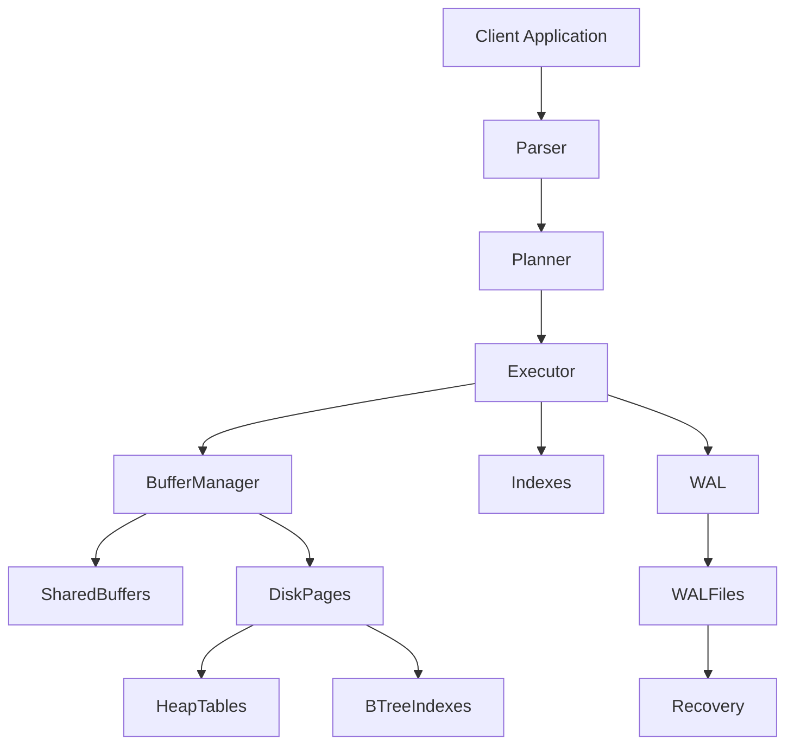
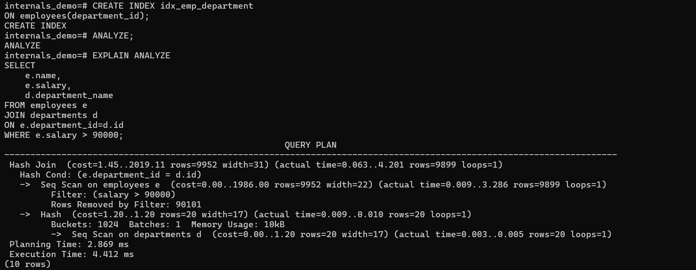
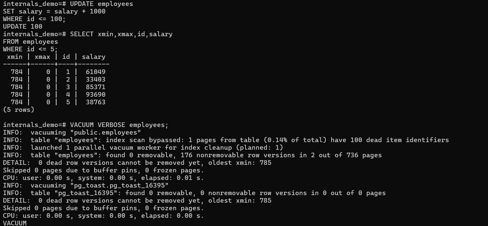

# PostgreSQL Internal Architecture

## 1. Problem Background

PostgreSQL is a general-purpose relational database designed for reliability, correctness, and concurrent access. Unlike embedded databases such as SQLite, PostgreSQL follows a client-server architecture and is intended to support multiple users accessing the database simultaneously.

The system has evolved over several decades and includes features such as Multi-Version Concurrency Control (MVCC), Write Ahead Logging (WAL), advanced query optimization, and multiple index types.

The goal of this study was to understand how PostgreSQL manages memory, indexes, transactions, recovery, and query execution internally, and how these architectural decisions affect performance and scalability.

---

# 2. Architecture Overview

## High-Level Architecture



### Major Components

| Component      | Responsibility                            |
| -------------- | ----------------------------------------- |
| Parser         | Converts SQL into internal representation |
| Planner        | Generates execution plan                  |
| Executor       | Executes chosen plan                      |
| Buffer Manager | Manages page caching                      |
| Shared Buffers | In-memory page cache                      |
| Heap Storage   | Stores table data                         |
| B-Tree Indexes | Supports fast lookups                     |
| WAL            | Ensures durability and crash recovery     |

---

# 3. Internal Design

## 3.1 Buffer Manager

PostgreSQL stores table and index data in fixed-size pages. Reading directly from disk for every query would be expensive, so PostgreSQL uses a shared memory region called Shared Buffers.

### Observation

```sql
SHOW shared_buffers;
```

Output:

```text
128MB
```

This means PostgreSQL can cache up to 128 MB of pages in memory before needing to fetch pages from disk again.

### How Data Flows

1. Query requests a page.
2. Buffer Manager checks Shared Buffers.
3. If page exists → buffer hit.
4. Otherwise → page loaded from disk.
5. Modified pages are marked dirty.
6. Dirty pages are eventually flushed to disk.

### Why This Design?

Caching frequently accessed pages significantly reduces disk I/O and improves performance.

---

## 3.2 B-Tree Index Implementation

PostgreSQL's default index type is B-Tree.

I created the following index:

```sql
CREATE INDEX idx_emp_department
ON employees(department_id);
```

B-Tree indexes store keys in sorted order and allow efficient searching using logarithmic traversal.

### Internal Structure

```text
Root Page
   |
Internal Pages
   |
Leaf Pages
```

Each leaf page contains key values and references to table tuples.

### Why B-Trees?

Advantages:

* Fast point lookups
* Efficient range scans
* Balanced structure
* Predictable performance

Trade-off:

* Inserts may require page splits
* Extra storage overhead

---

## 3.3 MVCC (Multi-Version Concurrency Control)

PostgreSQL implements MVCC by creating new tuple versions during updates instead of modifying rows in place.

### Initial Observation

```sql
SELECT xmin,xmax,* FROM employees LIMIT 5;
```

Output:

```text
xmin = 737
xmax = 0
```

The xmin value represents the transaction that created the tuple.

The xmax value represents the transaction that deleted or replaced the tuple. Since xmax is 0, the rows are currently visible.

---

### Update Experiment

```sql
UPDATE employees
SET salary = salary + 1000
WHERE id <= 100;
```

After the update:

```sql
SELECT xmin,xmax,id,salary
FROM employees
WHERE id <= 5;
```

Output:

```text
xmin = 784
xmax = 0
```

The xmin value changed from 737 to 784.

This shows that PostgreSQL created a new tuple version rather than updating the existing row in-place.

### Why MVCC?

Benefits:

* Readers do not block writers.
* Writers do not block readers.
* Supports snapshot isolation.

Trade-off:

* Old row versions remain in storage.
* Cleanup becomes necessary.

---

## 3.4 VACUUM

Because MVCC leaves behind obsolete tuple versions, PostgreSQL requires VACUUM.

### Observation

After updating 100 rows:

```sql
VACUUM VERBOSE employees;
```

Output contained:

```text
100 dead item identifiers
```

This indicates that old row versions still existed after the update.

VACUUM is responsible for reclaiming storage occupied by these obsolete tuples.

### Why VACUUM Is Necessary

Without VACUUM:

* Tables grow unnecessarily.
* Indexes become bloated.
* Query performance degrades.

Trade-off:

* Additional maintenance overhead.

---

## 3.5 Write Ahead Logging (WAL)

PostgreSQL guarantees durability using Write Ahead Logging.

The core principle is:

> Changes are written to WAL before they are written to actual table files.

### Observations

```sql
SHOW wal_level;
```

Output:

```text
replica
```

```sql
SHOW max_wal_size;
```

Output:

```text
1GB
```

```sql
SHOW checkpoint_timeout;
```

Output:

```text
5min
```

### Recovery Process

```text
Transaction
     |
     V
 WAL Record
     |
     V
 WAL File
     |
 Crash
     |
 Recovery
     |
 Replay WAL
```

### Why WAL?

Advantages:

* Durability guarantees
* Crash recovery
* Replication support

Trade-off:

* Additional write overhead

---

# 4. Query Planning and Statistics

One of PostgreSQL's strongest features is its cost-based query planner.

Before running experiments:

```sql
ANALYZE;
```

was executed to collect statistics.

---

## Statistics Collected

```sql
SELECT attname,n_distinct
FROM pg_stats
WHERE tablename='employees';
```

Output:

```text
id            -1
department_id 20
name          -1
salary        -0.53829
```

### Observation

PostgreSQL correctly learned:

* department_id has 20 distinct values.
* salary has many distinct values.

These statistics help the planner estimate result sizes and choose execution strategies.

---

## EXPLAIN ANALYZE Experiment

Query:

```sql
SELECT
    e.name,
    e.salary,
    d.department_name
FROM employees e
JOIN departments d
ON e.department_id=d.id
WHERE e.salary > 90000;
```

Execution Plan:

```text
Hash Join
 -> Seq Scan employees
 -> Hash
      -> Seq Scan departments
```

Planner estimate:

```text
9952 rows
```

Actual rows:

```text
9899 rows
```

Execution time:

```text
4.412 ms
```

### Analysis

The estimate was extremely close to reality.

This indicates that PostgreSQL statistics were accurate.

### Why Hash Join?

The departments table contained only 20 rows.

Instead of repeatedly searching the smaller table, PostgreSQL built a hash table and performed a Hash Join.

This is more efficient than a Nested Loop Join for this workload.

### Why Was the Index Not Used?

Even though an index existed on:

```sql
department_id
```

the query filtered on:

```sql
salary > 90000
```

Since the filter condition was unrelated to the indexed column, PostgreSQL correctly chose a sequential scan.

This demonstrates that simply creating an index does not guarantee its usage.

---

# 5. Design Trade-Offs

## MVCC

Advantages:

* High concurrency
* Non-blocking reads

Disadvantages:

* Dead tuples accumulate
* VACUUM required

---

## WAL

Advantages:

* Strong durability
* Reliable crash recovery

Disadvantages:

* Extra write operations

---

## Shared Buffers

Advantages:

* Reduced disk I/O
* Better query performance

Disadvantages:

* Memory consumption

---

## Cost-Based Planning

Advantages:

* Efficient execution plans
* Adaptive to data distribution

Disadvantages:

* Dependent on accurate statistics
* ANALYZE must be maintained

---

# 6. Key Learnings

1. PostgreSQL relies heavily on page-based storage and caching through the Buffer Manager.

2. B-Tree indexes provide efficient lookup performance but are only useful when the query predicates align with indexed columns.

3. PostgreSQL implements MVCC using tuple versioning rather than in-place updates.

4. MVCC improves concurrency but creates dead tuples, making VACUUM an important maintenance operation.

5. WAL guarantees durability by recording changes before writing them to table files.

6. Query planning depends heavily on collected statistics. In the experiment, PostgreSQL estimated 9952 rows while the actual result contained 9899 rows, showing that the planner was highly accurate.

7. PostgreSQL's architecture prioritizes correctness, durability, and concurrency, even when that introduces additional maintenance overhead.

---

# References

1. PostgreSQL Official Documentation - Storage and File Layout

2. PostgreSQL Official Documentation - MVCC

3. PostgreSQL Official Documentation - WAL Internals

4. PostgreSQL Official Documentation - Query Planning

5. PostgreSQL Source Code

   * src/backend/storage/buffer/
   * src/backend/access/nbtree/

# Screenshots


