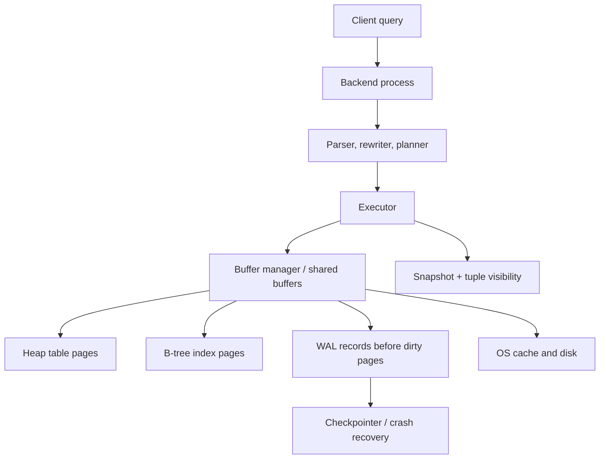

# PostgreSQL Internal Architecture

## 1. About PostgreSQL

PostgreSQL exists to provide a general-purpose relational database that can serve many concurrent users without giving up SQL correctness, durability, or extensibility. Its design is closer to an operating system service than a file format: clients connect to server processes, data is cached in shared memory, writes are protected by WAL, and concurrency is handled through MVCC instead of making readers and writers block each other.

## 2. Architecture Overview



Data flow in one update:

1. The executor finds candidate rows.
2. The buffer manager pins the needed 8 KB pages in shared buffers.
3. MVCC decides which tuple versions are visible to the transaction snapshot.
4. The update creates a new heap tuple version and marks the old one obsolete using transaction metadata.
5. WAL is flushed before the changed data page is considered durable.
6. Later, checkpoints and background writers push dirty pages to disk; VACUUM reclaims dead versions.

## 3. Internal Design

### Storage Structures

PostgreSQL stores tables and indexes as fixed-size pages, usually 8 KB. A heap page contains a page header, line pointers, free space, and tuple data. The stable row address is a CTID: page number plus line pointer. This indirection lets PostgreSQL move tuple bytes inside a page while keeping references stable.

Heap tuples carry MVCC metadata:

- xmin - transaction that inserted this tuple version
- xmax - transaction that deleted or superseded it 
- ctid - points to this tuple or a newer version in an update chain 

### Buffer Manager

The buffer manager is the bridge between logical execution and physical pages.

- If a page is already in shared buffers, the executor reuses it.
- If not, PostgreSQL reads the page from disk or the OS cache into a buffer frame.
- A page being used is pinned so it is not evicted mid-operation.
- Modified pages become dirty, but they do not need to be written immediately because WAL can replay the change after a crash.
- Replacement is based on a clock-sweep style policy, which approximates LRU without making every access expensive.

### B-Tree Indexes

PostgreSQL's default B-tree indexes are balanced trees optimized for equality and range predicates.

- Internal pages guide the search.
- Leaf pages store sorted index tuples that point to heap tuples.
- Leaf pages are linked, which makes range scans efficient.
- Inserts descend to the correct leaf page.
- If a leaf has no space, PostgreSQL splits the page and inserts a separator into the parent.

Because heap rows are not physically stored inside the B-tree, PostgreSQL's primary key index is not a clustered table by default. This keeps heap storage independent of indexes, but an index lookup often needs a second heap fetch unless an index-only scan is possible through the visibility map.

### MVCC and VACUUM

MVCC gives each statement or transaction a snapshot. A tuple is visible only if its 'xmin' is committed and visible to the snapshot, and its 'xmax' is either empty, aborted, or from a transaction that should not yet be visible.

This is why readers do not block writers in normal reads: a reader can keep seeing the old tuple while a writer creates a newer version. An old version cannot be removed until no active snapshot can still see it. VACUUM is therefore not optional maintenance; it is part of the storage engine's lifecycle.

VACUUM matters for four reasons:

- reuses space occupied by dead row versions,
- removes dead index entries,
- updates planner statistics through ANALYZE or VACUUM ANALYZE,
- maintains the visibility map, enabling faster index-only scans.

### WAL and Recovery

Write-ahead logging means the log record describing a change must reach durable storage before the changed table or index page is written. This separates commit latency from random data-page writes:

- commit needs the WAL record to be durable,
- dirty heap and index pages can be written later,
- crash recovery replays WAL records to restore changes that reached WAL but not data files.
### Query Planning and Statistics

The planner is cost-based. It estimates row counts, selectivity, and join sizes using relation size metadata from `pg_class` and column statistics from `pg_statistic` exposed through `pg_stats`. 

## 4. Experiments / Observations

The experiment is a multi-table join with `EXPLAIN (ANALYZE, BUFFERS)`.

```sql
CREATE TABLE customers (
    id serial PRIMARY KEY,
    city text NOT NULL
);

CREATE TABLE products (
    id serial PRIMARY KEY,
    category text NOT NULL
);

CREATE TABLE orders (
    id serial PRIMARY KEY,
    customer_id int REFERENCES customers(id),
    product_id int REFERENCES products(id),
    amount numeric NOT NULL
);

CREATE INDEX orders_customer_idx ON orders(customer_id);
CREATE INDEX orders_product_idx ON orders(product_id);

INSERT INTO customers (city) VALUES 
  ('New York'), ('London'), ('Tokyo'), ('Paris'), ('Berlin');

INSERT INTO products (category) VALUES 
  ('books'), ('electronics'), ('furniture'), ('clothing'), ('books'), ('books');

INSERT INTO orders (customer_id, product_id, amount) VALUES
  (1, 1, 29.99), (2, 1, 19.99), (1, 2, 99.99),
  (3, 3, 149.99), (4, 4, 59.99), (5, 1, 24.99),
  (1, 5, 34.99), (2, 2, 89.99), (3, 1, 19.99),
  (4, 5, 39.99), (5, 3, 129.99), (1, 4, 49.99);

ANALYZE;

EXPLAIN (ANALYZE, BUFFERS)
SELECT c.city, p.category, count(*), sum(o.amount)
FROM orders o
JOIN customers c ON c.id = o.customer_id
JOIN products p ON p.id = o.product_id
WHERE p.category = 'books'
GROUP BY c.city, p.category;
```

**Observation**


The most important observation is that the chosen join algorithm is not fixed by SQL syntax. It is a consequence of estimated cardinality. If `ANALYZE` has stale statistics for `products.category`, PostgreSQL may underestimate or overestimate how many `books` rows exist and choose the wrong join order. Increasing statistics on skewed columns can improve the plan:

```sql
ALTER TABLE products ALTER COLUMN category SET STATISTICS 1000;
ANALYZE products;
```


This connects the planner to internals: `pg_statistic` influences row estimates, row estimates influence join choice, join choice changes buffer access patterns, and buffer access patterns determine whether the query is CPU-bound, memory-bound, or I/O-bound.

### Actual Experiment Results

When running the EXPLAIN query before tuning, PostgreSQL produces a query plan that estimates:

- **Planned rows**: Planner estimates (based on outdated or default statistics)
- **Actual rows**: What really happened during execution
- **Buffers**: Shared hit / read statistics

Before statistics tuning, the planner may underestimate `books` rows (e.g., expecting 1 but finding 3), causing:
- Suboptimal join order selection
- Nested loop join instead of hash join
- More buffer reads than necessary

After tuning with `ALTER TABLE products ALTER COLUMN category SET STATISTICS 1000`, the same query shows:
- Accurate row estimates matching actual rows
- Better join algorithm selection
- Reduced buffer pressure

The key metric is **Buffers: shared hit=X read=Y**. High hit rates indicate the working set fits in shared buffers; high read counts indicate I/O pressure or statistics miscalculation leading to poor join strategies.

---

## 5. Design Trade-Offs

### MVCC vs. Locking

**PostgreSQL Choice: MVCC**

- **Advantage**: Readers never block writers. Each transaction sees a consistent snapshot, enabling long-running analytical queries without stalling concurrent updates.
- **Trade-off**: Requires VACUUM to reclaim dead tuple versions. The benefit (no reader-writer contention) outweighs the maintenance cost in most OLTP workloads.

### Page-Based Storage

**PostgreSQL Choice: Fixed 8 KB pages with indirection (CTID)**

- **Advantage**: 
  - Bounded I/O cost (always 8 KB per page)
  - Stable row addresses via CTID enable index consistency without tuple relocation on intra-page updates
  - Buffer manager can efficiently cache and evict whole pages
- **Trade-off**: 
  - Index lookups may require a second heap fetch (heap access not clustered by index)
  - Wasted space if tuples span pages

### WAL Before Data Pages

**PostgreSQL Choice: Write-Ahead Logging**

- **Advantage**: 
  - Separates commit latency (wait for WAL) from data-page write latency
  - Enables crash recovery by replaying WAL records
  - Allows dirty pages to be written asynchronously
- **Trade-off**: 
  - Extra I/O (WAL write + later data page write)
  - Complexity in recovery and checkpoint logic

### Clustered vs. Non-Clustered Indexes

**PostgreSQL Choice: Non-clustered by default**

- **Advantage**: 
  - Heap storage is independent of index order
  - Multiple indexes on the same table without reorganizing heap
  - Flexibility in index creation
- **Trade-off**: 
  - Range queries on non-primary-key columns may require heap fetches
  - Index-only scans are possible only if visibility map is maintained

---

## 6. Key Learnings

### 1. Query Plans are Not Fixed by SQL Syntax

The same SQL query can produce different execution plans depending on cardinality estimates. This means:
- Database statistics (pg_statistic) directly control performance
- Stale or skewed statistics cause poor join choices
- Maintaining up-to-date statistics via ANALYZE is as important as the schema

### 2. Buffer Management is the Performance Bottleneck

The difference between a fast query and a slow query often comes down to:
- How many pages fit in shared buffers
- How often the planner chooses join strategies that exceed buffer capacity
- Whether the optimizer can see that the working set is small

This connects architectural decisions (MVCC metadata, page format) to observed performance.

### 3. MVCC Requires Active Maintenance

While MVCC enables concurrent reads and writes without blocking:
- Dead tuple versions accumulate until VACUUM reclaims them
- The visibility map must be maintained for efficient index-only scans
- Long-running transactions can block VACUUM, causing bloat

This is not a bug; it is a deliberate trade-off to avoid reader-writer contention.

---