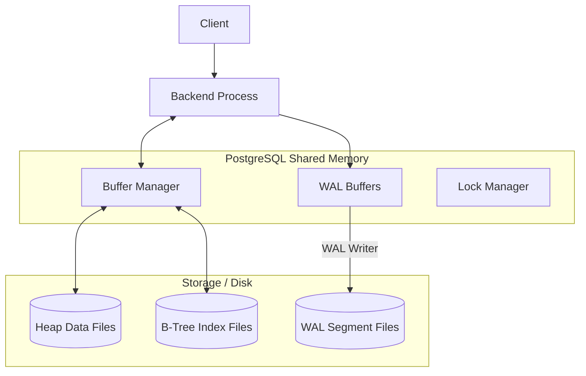

# PostgreSQL Internal Architecture

## 1. Problem Background

PostgreSQL is designed to handle extremely high concurrent workloads while guaranteeing strict ACID (Atomicity, Consistency, Isolation, Durability) compliance. The core problem it solves is managing shared data across thousands of simultaneous connections without corrupting data or completely stalling readers and writers. To achieve this, it relies on a sophisticated Buffer Manager, Multi-Version Concurrency Control (MVCC), and a robust Write-Ahead Log (WAL).

## 2. Architecture Overview

At the heart of PostgreSQL is a multi-process architecture where a central memory area called **Shared Buffers** is accessed by all backend processes. 



## 3. Internal Design

### 1. Buffer Manager (`src/backend/storage/buffer/`)
The Buffer Manager acts as a middleman between the backend processes and the OS filesystem. PostgreSQL stores data in 8KB pages. 
*   **Page Caching:** When a process needs to read a row, it requests the 8KB page from the Buffer Manager. If the page is in Shared Buffers, it is returned immediately (cache hit).
*   **Page Reads/Writes:** If it's a cache miss, the Buffer Manager reads the page from disk into a free slot in Shared Buffers. When a page is modified, it is marked as **"dirty"**. A background process (`bgwriter`) is responsible for flushing dirty pages back to disk.
*   **Buffer Replacement Algorithm:** PostgreSQL uses a **Clock Sweep** algorithm to decide which pages to evict when Shared Buffers are full. Each buffer has a usage count. The clock hand sweeps through buffers; if a buffer has a usage count of 0, it is evicted. Otherwise, its count is decremented.

### 2. B-Tree Implementation (`nbtree`)
PostgreSQL uses the Lehman-Yao B-Tree algorithm which optimizes concurrent index traversal.
*   **Index Page Layout:** Leaf nodes contain the index key and a `TID` (Tuple Identifier) pointing to the physical row in the heap.
*   **Search Path:** Traversal starts at the root, following right-links if necessary (to handle concurrent page splits), down to the leaf node.
*   **Page Splits:** When a leaf node is full, it splits into two. Lehman-Yao B-Trees maintain a "right link" pointing to the newly created sibling, ensuring that a concurrent reader scanning the original page won't miss the moved data before the parent node is updated.

### 3. Multi-Version Concurrency Control (MVCC)
PostgreSQL handles concurrency using MVCC, avoiding row-level read locks.
*   **Heap Tuple Versioning:** When a row is updated, PostgreSQL does *not* overwrite it. It inserts a completely new version of the row (a new tuple) into the heap.
*   **xmin / xmax:** Every tuple has hidden system columns: `xmin` (the Transaction ID that created it) and `xmax` (the Transaction ID that deleted/updated it). 
*   **Visibility Rules (Snapshot Isolation):** A query is assigned a "Snapshot" of currently active transactions. It uses `xmin` and `xmax` to determine if a tuple should be visible. If `xmin` is from an older, committed transaction, and `xmax` is empty or belongs to a future/uncommitted transaction, the tuple is visible.
*   **VACUUM:** Because old tuples remain on disk, they cause "bloat". The `VACUUM` daemon continuously sweeps tables to reclaim space from dead tuples (where `xmax` belongs to a committed transaction older than all active snapshots).

### 4. Write-Ahead Logging (WAL)
WAL guarantees **Durability**. 
*   **WAL Records:** Before any dirty page is written to the actual heap file, a WAL record describing the change is flushed to disk sequentially.
*   **Crash Recovery:** If the server crashes, dirty pages in memory are lost. Upon restart, PostgreSQL reads the WAL and "replays" the changes to bring the database back to a consistent state.
*   **Checkpointing:** To prevent the WAL from growing infinitely, a `checkpointer` process periodically flushes all dirty buffers to disk and writes a "checkpoint" record. Crash recovery only needs to replay WAL from the last checkpoint.

## 4. Design Trade-Offs

*   **MVCC Trade-off:** 
    *   *Advantage:* High concurrency (Readers don't block Writers). Fast rollbacks (just mark the transaction aborted, no undo required).
    *   *Limitation:* Table Bloat. The necessity of `VACUUM`. If Vacuum cannot keep up with heavy updates, performance degrades due to massive I/O required to scan dead tuples.
*   **Append-Only Heap:** PostgreSQL indexes do not store data directly (unlike MySQL's clustered indexes). They point to the Heap.
    *   *Advantage:* Updating non-indexed columns is cheap (HOT updates). 
    *   *Limitation:* Index lookups require reading both the index page and the heap page (unless it's an Index-Only Scan).

## 5. Experiments / Observations

**Exercise: EXPLAIN ANALYZE on a Join**
Running `EXPLAIN ANALYZE` provides deep insights into the planner.

```sql
EXPLAIN ANALYZE SELECT * FROM users u JOIN orders o ON u.id = o.user_id WHERE u.status = 'active';
```

**Observations:**
1.  **Planner Estimates:** The output shows `cost=... rows=...`. The planner uses statistics from `pg_statistic` (collected by `ANALYZE`) to estimate how many users are 'active'.
2.  **Execution Plan:** Depending on the statistics, it might choose a `Nested Loop` (if 'active' users are few) or a `Hash Join` (if many rows match).
3.  **Actual Statistics:** `EXPLAIN ANALYZE` runs the query and shows actual execution times. A massive discrepancy between estimated `rows` and actual `rows` indicates stale statistics, leading to suboptimal query plans (e.g., choosing a Nested Loop when a Hash Join was appropriate).

## 6. Key Learnings

1.  **Vacuum is Not Just a Cleaner:** Understanding MVCC means understanding that PostgreSQL relies on `VACUUM` fundamentally for its architecture to work. 
2.  **Sequential vs Random I/O:** WAL exists strictly because sequential writes (logging) are orders of magnitude faster than random writes (updating heap pages directly). 
3.  **Statistics Drive the Planner:** A database engine is only as smart as the statistics it holds. Regular `ANALYZE` operations are as critical as indexing for query performance.
