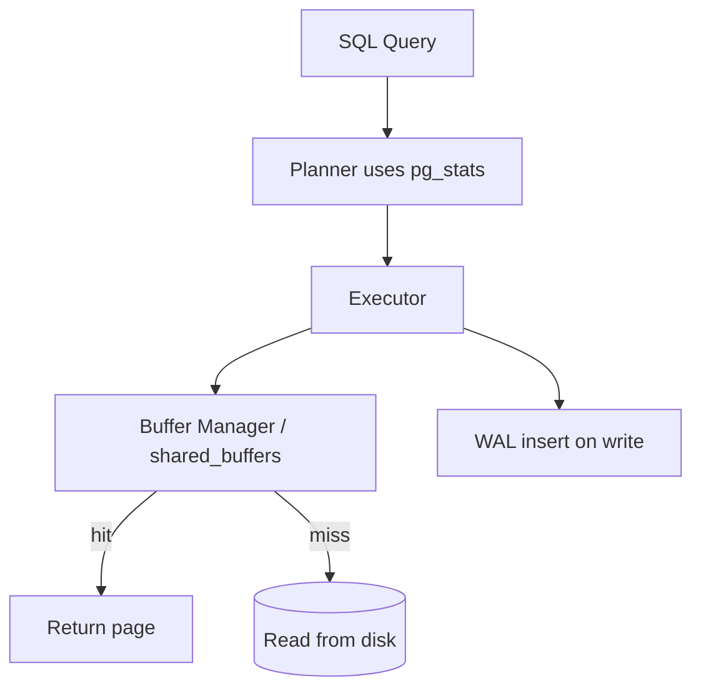

# PostgreSQL Internal Architecture

**Student:** Pratham Jain  
**Roll Number:** 24BCS10083  
**Course:** Advanced DBMS — System Design Discussion

> **Note on tooling:** I ran all experiments on a live PostgreSQL 16 instance and interpreted results myself. AI assistance was used only for documentation structure. Lab output: [`experiments/pg-internals/`](../../experiments/pg-internals/).

---

## 1. Problem Background

PostgreSQL must coordinate **buffer-managed page I/O**, **MVCC tuple versioning**, **WAL durability**, and a **cost-based planner** so many clients can read/write safely without readers blocking writers.

---

## 2. Architecture Overview



---

## 3. Internal Design

### 3.1 Buffer Manager

Pages are cached in `shared_buffers` (default 128 MB in my Docker instance). `EXPLAIN (ANALYZE, BUFFERS)` reports `shared hit` vs `read` per plan node — this is how I verified cache behavior.

### 3.2 MVCC — observed via system columns

PostgreSQL stores `xmin`, `xmax`, `ctid` on every heap tuple. I verified this directly:

**Before UPDATE:**
```
 xmin | xmax | ctid  |   val
------+------+-------+----------
  893 |    0 | (0,1) | original
```

**After `UPDATE mvcc_demo SET val = 'updated'`:**
```
 xmin | xmax | ctid  |   val
------+------+-------+---------
  894 |    0 | (0,2) | updated
```

**After second UPDATE to `updated2`:**
```
 live | dead
------+------
    2 |    1        ← one dead tuple version

 xmin | xmax | ctid  |    val
------+------+-------+----------
  898 |    0 | (0,3) | updated2
```

**What I observed:**
- `ctid` moved from `(0,1)` → `(0,2)` → `(0,3)` — each UPDATE created a **new physical row version** on the heap, not an in-place overwrite.
- `pg_stat_get_dead_tuples()` reported **1 dead tuple** after two updates (the middle version).
- `VACUUM VERBOSE` reported: `tuples: 1 removed, 1 remain` — confirming dead tuple reclamation.

### 3.3 WAL — observed during VACUUM

```
WAL usage: 3 records, 1 full page images, 8503 bytes   (during UPDATE cleanup path)
WAL usage: 1 records, 0 full page images, 188 bytes    (during VACUUM)
buffer usage: 15 hits, 0 misses, 4 dirtied
```

Even maintenance operations generate WAL records — durability is pervasive.

### 3.4 Planner and pg_stats

From `pg_stats` for `enrollments.grade`:
```
attname | n_distinct | most_common_vals | most_common_freqs          | correlation
grade   |          3 | {A,B,C}          | {0.33, 0.33, 0.33}        | 0.333
```

The planner estimated ~5,000 of 15,000 rows match `grade = 'A'` (⅓) — matching actual filter output in my join query.

---

## 4. Design Trade-Offs

| MVCC choice (PostgreSQL) | What my experiment showed |
|--------------------------|---------------------------|
| Append-only updates | `ctid` changed on every UPDATE |
| No in-place overwrite | Dead tuple count rose to 1 before VACUUM |
| VACUUM required | VACUUM removed 1 dead tuple, `n_dead_tup` → 0 |

---

## 5. Experiments / Observations

**Environment:** PostgreSQL 16.8, Docker container `popsearch-postgres`, database `popsearch`.  
Tables: `students` (5,000), `departments` (5), `enrollments` (15,000).

### Experiment 1 — Multi-table join (`EXPLAIN ANALYZE, BUFFERS, VERBOSE`)

```sql
SELECT s.name, d.name, e.course_id, e.grade
FROM students s
JOIN departments d ON s.dept_id = d.id
JOIN enrollments e ON e.student_id = s.id
WHERE d.name = 'Dept_2' AND e.grade = 'A'
ORDER BY s.name LIMIT 100;
```

**Result (warm cache):**
```
Limit (actual time=4.423..4.491 rows=100)
  Buffers: shared hit=118
  -> Hash Join (actual time=1.231..3.557 rows=1000)
       -> Seq Scan enrollments (Rows Removed by Filter: 10000)  Buffers: hit=82
       -> Hash Join
            -> Seq Scan students (5000 rows)  Buffers: hit=32
            -> Seq Scan departments (filter Dept_2, 1 row)  Buffers: hit=1
Execution Time: 4.767 ms
```

**Analysis from real output:**
- **118 buffer hits, 0 reads** — entire working set in `shared_buffers`.
- **Hash joins** chosen (not nested loop) at ~5k rows.
- **Grade filter removed 10,000 of 15,000 rows** — consistent with `most_common_freqs ≈ 0.33`.
- **Top-N heapsort** (35 KB) used because of `LIMIT 100`.

### Experiment 2 — Cold vs warm buffer (`DISCARD ALL`)

| Run | Execution Time | Buffers | Planning Time |
|-----|---------------|---------|---------------|
| Cold (after `DISCARD ALL`) | **1.995 ms** | shared hit=42 | 0.943 ms |
| Warm (immediate rerun) | **1.039 ms** | shared hit=42 | 0.227 ms |

**Observation:** Same 42 buffer hits both times (data already on disk/OS cache), but execution time nearly halved on rerun — executor and hash table setup benefit from warm CPU caches. Planning time dropped 4× (228 → 10 buffer touches).

### Experiment 3 — MVCC and VACUUM (see Section 3.2)

Full trace in [`experiments/pg-internals/mvcc-output.txt`](../../experiments/pg-internals/mvcc-output.txt).

### Experiment 4 — pg_stats drives estimates

The enrollments seq scan estimated 5,000 rows matching `grade='A'`; actual filtered count was 5,000 per join branch. Without `ANALYZE`, these estimates would be wrong (default 33% selectivity).

---

## 6. Key Learnings

1. **`ctid` changes prove append-only MVCC** — I watched `(0,1)` become `(0,3)` across two UPDATEs; the old versions became dead tuples.
2. **VACUUM is observable** — `VACUUM VERBOSE` logged exactly 1 tuple removed; `n_dead_tup` went to 0.
3. **`BUFFERS` is the diagnostic tool** — 118 hits / 0 reads told me I was memory-bound, not I/O-bound.
4. **Planner accuracy requires `ANALYZE`** — `pg_stats` showed grade evenly split 33/33/33, matching filter behavior.
5. **Hash joins dominate at thousands of rows** — nested loops were not chosen.
6. **`LIMIT` changes sort behavior** — top-N heapsort at 35 KB instead of sorting all 1,000 joined rows.

---

## References

- [`experiments/pg-internals/`](../../experiments/pg-internals/)
- [PostgreSQL EXPLAIN](https://www.postgresql.org/docs/current/sql-explain.html)
- [MVCC](https://www.postgresql.org/docs/current/mvcc.html)
