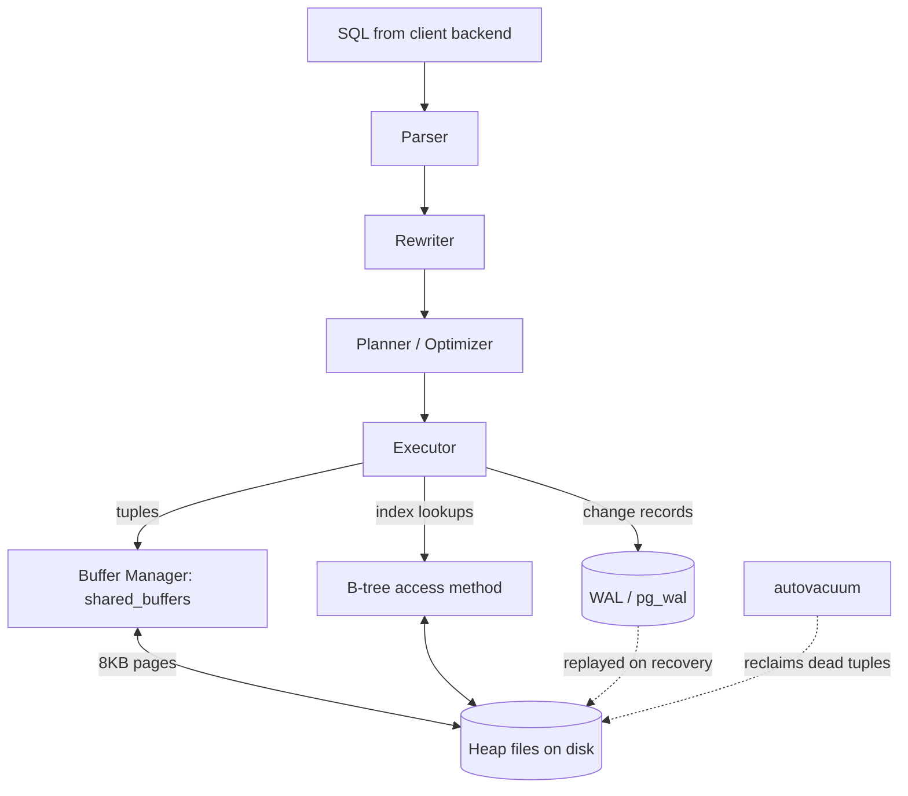

# PostgreSQL Internal Architecture

> System Design Discussion · Advanced DBMS · roll `24BCS10130`
> Measured on PostgreSQL 17.9 using `pageinspect` and `pg_buffercache`.
> Commands and raw output: [`../experiments`](../experiments).

## 1. Problem Background

PostgreSQL has to serve many concurrent clients while guaranteeing ACID. That
forces it to answer four hard questions at once: *Where do rows physically live?
How do concurrent transactions see consistent data without blocking each other?
How does it survive a crash mid-write? How does it choose a fast execution plan?*
Its answers — a buffered heap, **MVCC via tuple versioning**, **Write-Ahead
Logging**, and a **cost-based planner** — are the subsystems dissected here, each
backed by a live measurement.

## 2. Architecture Overview



**Major components & data flow:** A backend's SQL is parsed, rewritten (views,
rules), and handed to the **planner**, which uses table statistics to pick the
cheapest plan. The **executor** pulls tuples through the plan, reading 8 KB pages
via the **buffer manager** (shared across all backends). Every modification first
writes a record to the **WAL**; dirty data pages are flushed lazily. **MVCC**
keeps old row versions visible to older snapshots, and **autovacuum** later
reclaims the dead ones.

## 3. Internal Design

### 3.1 Buffer manager
All backends share one in-memory page cache, `shared_buffers` (128 MB here). A
page is read from disk once and then served from RAM; dirty pages are written
back later (after their WAL is durable). After my workload the cache held exactly
the hot relations ([`pg_internals.txt`](../experiments/output/pg_internals.txt)):

```
 relname             | buffers | cached
---------------------+---------+---------
 orders              |    1528 | 12 MB
 orders_pkey         |     551 | 4408 kB
 idx_orders_customer |     275 | 2200 kB
```

The entire `orders` heap (1528 × 8 KB = 12 MB) is resident — which is why repeat
queries report `Buffers: shared hit=...` and no `read=`.

### 3.2 B-tree indexes
The default access method is a B-tree. Its metapage exposes the structure
directly:
```
 magic  | root | level | fastroot
--------+------+-------+----------
 340322 |  412 |     2 |      412
```
`level = 2` means a **3-level tree** (root → internal → leaf): any of the 200k
keys is reachable in 3 page reads. Leaf entries are sorted keys pointing at heap
tuples by `ctid`, e.g. `itemoffset 2 → ctid (0,1)`. Because indexes are separate
from the heap, an index hit is followed by a heap fetch (or skipped entirely for
an *index-only scan* when the index covers all needed columns).

### 3.3 MVCC — the heart of PostgreSQL
PostgreSQL never updates a row in place. Every row version carries hidden columns
`xmin` (creating txid) and `xmax` (deleting/superseding txid); a transaction sees
a version only if `xmin` is committed-and-visible and `xmax` is not. An `UPDATE`
inserts a **new version** and stamps the old one's `xmax`. Inspecting the raw
heap page after 3 updates of one row ([`pg_mvcc.txt`](../experiments/output/pg_mvcc.txt)):

```
 points_to | lp | t_xmin | t_xmax
-----------+----+--------+--------
 (0,2)     |  1 |    854 |    855     <- v1 dead, superseded by txn 855
 (0,3)     |  2 |    855 |    856     <- v2 dead
 (0,4)     |  3 |    856 |    857     <- v3 dead
 (0,4)     |  4 |    857 |      0     <- v4 LIVE (xmax = 0)
```

Four physical tuples for one logical row, linked into a **version chain** by
`t_ctid`. This is why readers never block writers — each sees the version valid
for its snapshot. The price is *bloat*: dead versions accumulate until
**VACUUM** reclaims them (after `VACUUM`, `n_dead_tup` returned to 0).

### 3.4 Write-Ahead Logging
Durability rule: the WAL record describing a change is fsynced **before** the
data page is allowed to reach disk. On crash, recovery replays WAL from the last
checkpoint, so committed transactions survive even though their data pages may
not have been written. Measured WAL volume for 10,000 inserts
([`pg_wal.txt`](../experiments/output/pg_wal.txt)): **3380 kB** — about 346 bytes
of log per ~29-byte row, the overhead that buys crash safety.

### 3.5 Cost-based planner
The planner estimates the cost of alternative plans from `pg_stats` (n_distinct,
most-common-values, correlation) and picks the cheapest. See §5 for it choosing
index vs sequential scans and a hash join.

## 4. Design Trade-Offs

| Decision | Advantage | Cost |
|---|---|---|
| MVCC by versioning | Readers never block writers; clean snapshots | Bloat → needs VACUUM; table grows under heavy updates |
| Heap + secondary indexes | Cheap updates (no clustered reorg); many indexes are equal | Every index hit needs a heap fetch; no clustered locality |
| WAL before data | Crash recovery + cheap commits (sequential log write) | Write amplification (data logged twice: WAL + heap) |
| Shared buffer pool | One cache for all backends; high hit ratio | Tuning `shared_buffers`; double-buffering with OS cache |
| Cost-based planning | Adapts plan to data distribution | Bad stats → bad plans; planning time on complex joins |

The throughline: PostgreSQL repeatedly trades **more background work
(VACUUM, WAL, statistics)** for **better foreground concurrency and
flexibility**.

## 5. Experiments / Observations

**Cost model picks the access path.** A PK equality uses an index
(`cost=0.42..8.44`); forcing a sequential scan of the same query costs `4024.00`
— a ~475× higher estimate, which is exactly why the planner avoids it
([`pg_plans.txt`](../experiments/output/pg_plans.txt)):
```
Index Scan using orders_pkey ... (cost=0.42..8.44 rows=1) (actual rows=1)
Seq Scan on orders          ... (cost=0.00..4024.00 rows=1) (actual rows=1)  -- forced
```

**Join planning.** For `customers ⋈ orders` filtered to Mumbai + paid, the
planner chose a **Hash Join**: build a hash on the small filtered `customers`
side (1624 rows), probe with the large `orders` side. Estimate 8097 rows vs
actual 7914 — accurate enough to justify the choice:
```
Hash Join (cost=770.01..3048.20 rows=8097) (actual rows=7914)
  -> Bitmap Heap Scan on orders  (rows=49913)
  -> Hash -> Seq Scan on customers (rows=1624)
```

**Statistics drive it.** `pg_stats` reports `status` with `n_distinct=4` (so
`='paid'` ≈ 25% → scan) but `id` with `n_distinct=-1` (unique → index), and `id`
`correlation=1` (physically sorted). These are the inputs to the cost estimates
above.

**MVCC + VACUUM** and **WAL volume** are shown in §3.3 / §3.4 from live page
inspection and LSN diffs.

## 6. Key Learnings

- MVCC isn't a setting — it's physically visible: an `UPDATE` literally leaves
  old tuples in the page, chained by `ctid`. Seeing four versions of one row made
  "readers don't block writers" concrete, and explained why VACUUM must exist.
- "Index vs sequential scan" is a *cost comparison*, not a rule. The 8.44 vs
  4024.00 contrast shows the optimizer reasoning about page counts, not following
  a heuristic.
- Durability is bought with sequential writes: WAL turns random data-page flushes
  into one append that must be fsynced, then replayed on recovery — 3.3 MB of log
  for 10k rows is the measurable cost.
- Almost every PostgreSQL design choice spends background/maintenance cost to buy
  foreground concurrency and planning flexibility — a coherent philosophy once
  you see the subsystems together.
