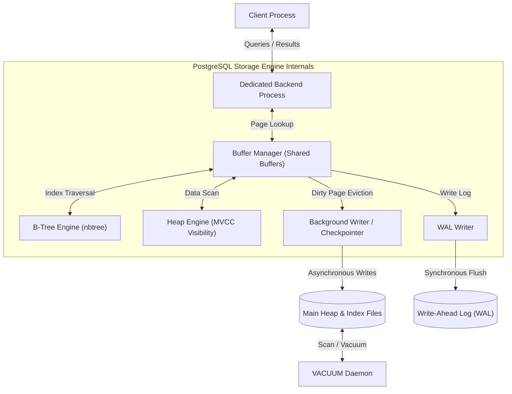
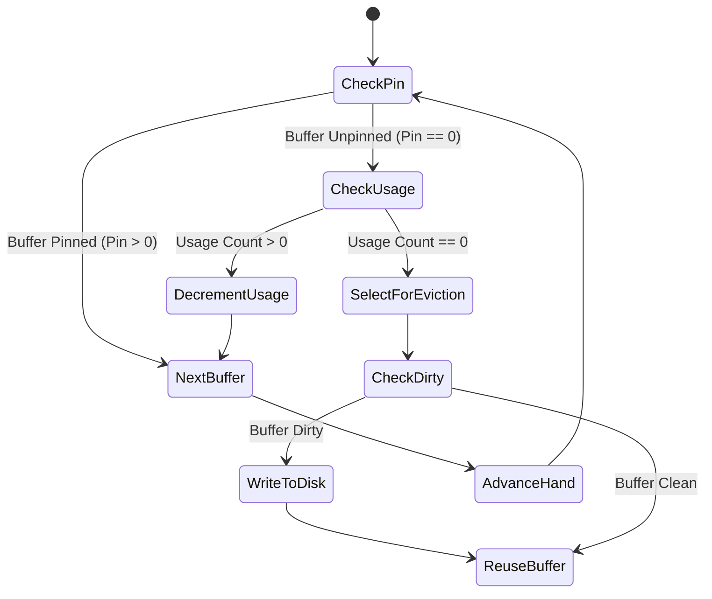

# Topic 2: PostgreSQL Internal Architecture

This document explores the internal design of PostgreSQL, analyzing memory management, index structures, concurrency mechanisms, and crash recovery. It also includes an analysis of query execution plan estimation.

---

## 1. Problem Background

PostgreSQL is designed around a multi-process, extensibility-first model. Because it allows users to define custom data types and custom indexing methods, its core subsystems must be highly modular:
* **The Buffer Manager** coordinates memory access, ensuring that disk reads are minimized and page concurrency is maximized.
* **The Indexing Subsystem (`nbtree`)** supports concurrent reads and writes, resolving structural bottlenecks like page splits.
* **The MVCC Engine** supports concurrent transactions without read-write locking, relying on tuple versioning and background garbage collection.
* **The WAL Subsystem** guarantees ACID durability on standard hardware, managing write amplification while protecting against data corruption like torn pages.

---

## 2. Architecture Overview



The diagram illustrates how a backend process routes queries through the PostgreSQL storage engine. The Buffer Manager is the central coordinator for accessing both Heap and Index files on disk.

---

## 3. Internal Design

### A. Buffer Manager (src/backend/storage/buffer/)

The Buffer Manager manages the transfer of data pages between disk storage and shared memory (`shared_buffers`).

```
Shared Buffer Allocation Structure:
+-------------------------------------------------------------+
| Buffer Lookup HashTable (PageTag -> Buffer ID)             |
+-------------------------------------------------------------+
| Buffer Descriptors (State, Pin Count, Usage Count, LSN)     |
+-------------------------------------------------------------+
| Buffer Pool Pages (Array of 8KB memory segments)            |
+-------------------------------------------------------------+
```

#### Page Cache Lookup
1. When a page is requested, the manager constructs a `BufferTag` consisting of `(SpcNode, DbNode, RelNode, ForkNum, BlockNum)`.
2. It queries a shared **hash table** to map the `BufferTag` to a `BufferID` (the index in the shared buffer array).
3. If it is a cache hit, the process pins the buffer (increments its pin count) and returns the page address.
4. If it is a cache miss, the manager must select a buffer for eviction.

#### Buffer Replacement (Clock Sweep)
PostgreSQL uses a **Clock Sweep** algorithm to select eviction candidates:
1. A shared cursor (the clock hand) sweeps through the array of buffer descriptors.
2. For each descriptor:
   * If the buffer is **pinned** (active readers/writers), the clock hand skips it.
   * If the buffer is unpinned and has a **usage count > 0**, its usage count is decremented by 1, and the hand advances.
   * If the buffer is unpinned and its **usage count is 0**, it is selected for eviction.
3. If the evicted buffer is dirty, it is scheduled to be written to disk before being reused.



---

### B. B-Tree Implementation (nbtree)

PostgreSQL's default B-Tree is based on the **Lehman & Yao B-Tree algorithm**.

```
Lehman & Yao B-Tree Page Chain:
+---------------+     Right-Link     +---------------+     Right-Link     +---------------+
|  Page A (Leaf)| -----------------> |  Page B (Leaf)| -----------------> |  Page C (Leaf)|
| [Key 1-10]    |                    | [Key 11-20]   |                    | [Key 21-30]   |
+---------------+                    +---------------+                    +---------------+
        ^                                    ^                                    ^
        |                                    |                                    |
        +---------------------------- Parent Page Pointer ------------------------+
```

#### Lehman & Yao Algorithm & Page Splits
In a standard B-Tree, splitting a leaf page requires acquiring a write lock on the leaf and its parent to insert the new key. In high-concurrency systems, this creates lock contention at the upper levels of the tree.
* **Right-Links**: Lehman & Yao B-Trees add a pointer to every page header (the `right-link`) pointing to its immediate right sibling at the same level.
* **Non-Blocking Page Splits**: When a leaf page fills up:
  1. The engine allocates a new page and moves half of the items to it.
  2. The old page's right-link is updated to point to the new page.
  3. The engine releases the write lock on the leaf *before* updating the parent.
  4. If a concurrent reader accesses the parent before it is updated, it follows the pointer to the old leaf page, reads its right-link, and moves to the new sibling to find the key. This eliminates the need for write locks on parent pages during down-tree traversals.

#### nbtree Page Layout
* **Special Space**: Every B-Tree page contains a "special space" at the end of the page. This space holds metadata, including the page's right-link and flags indicating its type (leaf, root, inner, deleted).

---

### C. Multi-Version Concurrency Control (MVCC)

PostgreSQL implements MVCC by retaining old versions of rows on updates and deletes instead of modifying data in place.

#### Tuple Header Fields
Each physical row (tuple) in a heap page contains a `HeapTupleHeaderData` struct with key MVCC fields:
* `xmin`: The Transaction ID (TxID) of the transaction that inserted the row.
* `xmax`: The TxID of the transaction that updated or deleted the row (initialized to `0`).
* `t_ctid`: A physical pointer `(Page, Offset)` pointing to either itself or a newer version of the row if it was updated.
* `t_infomask`: Bit flags storing transaction status (e.g., whether `xmin` or `xmax` have committed) to avoid checking the Commit Log (CLOG) for every visibility check.

```
MVCC Tuple Update Chain:
+-------------------------------------------------------+
| Version 1 (Physical Row)                              |
|   xmin: 100, xmax: 105 (Updated)                      |
|   t_ctid: (Page 1, Offset 2)                          | ----+
+-------------------------------------------------------+     |
                                                              | (Pointer to newer version)
+-------------------------------------------------------+     |
| Version 2 (Physical Row)                              | <---+
|   xmin: 105, xmax: 0 (Active / Not Deleted)           |
|   t_ctid: (Page 1, Offset 2)                          |
+-------------------------------------------------------+
```

#### Visibility Rules & Snapshot Isolation
A transaction's view of the database is defined by a snapshot containing:
* `xmin`: The oldest transaction ID that is still active.
* `xmax`: The next unassigned transaction ID.
* `xip`: An active transaction list at the time of snapshot creation.

A tuple is visible to a transaction if:
1. The transaction that inserted the tuple (`xmin`) has committed.
2. The transaction that inserted the tuple is not newer than the snapshot's `xmax`.
3. The transaction that deleted or updated the tuple (`xmax`) is either uncommitted, aborted, or has not started yet relative to the snapshot.

#### VACUUM: Lazy vs. Full
Because MVCC leaves old row versions ("dead tuples") in the heap, space must be reclaimed:
* **Lazy VACUUM**: Sweeps heap pages, marks dead tuples as free space, and updates the **Visibility Map** (a bitmap indicating if a page contains only visible tuples). This map allows index scans to skip heap fetches. Lazy VACUUM does not lock tables or write-lock pages.
* **Full VACUUM**: Locks the table (`AccessExclusiveLock`), builds a new, compact heap file containing only live tuples, and deletes the old heap file. This reclaims disk space back to the operating system, but blocks all reads and writes.

---

### D. Write-Ahead Logging (WAL)

The WAL subsystem ensures durability by logging page changes before they are written to the heap.

```
Checkpoint Synchronization Cycle:
[Dirty Pages in Buffers] ──(fsync checkpointer)──> [Data Files on Disk]
           │                                             ▲
           │ (Must write log first)                      │ (Redo playback on crash)
           ▼                                             │
[WAL Buffers in RAM]    ──(fsync WAL Writer)───> [WAL Log Files on Disk]
```

#### Durability & Crash Recovery
When a transaction commits, its WAL records are flushed to disk. The data pages themselves are written to disk later.
* **Recovery**: If the system crashes, PostgreSQL reads the last checkpoint from `global/pg_control`, locates the corresponding WAL position, and replays all WAL records forward (the redo phase) to restore consistency.

#### Torn Page Protection (Full-Page Writes)
A operating system writes data in 4KB blocks, while PostgreSQL pages are 8KB. If the system crashes while writing a page to disk, the page can become corrupted (half old data, half new data). This is called a **Torn Page**.
* **Full-Page Writes (FPW)**: To prevent torn page corruption, the first time a page is modified after a checkpoint, PostgreSQL writes a copy of the *entire page* to the WAL log. During recovery, if a page is torn, PostgreSQL overwrites it with the full page backup from the WAL log before applying individual change records.

---

## 4. Recommended Exercise: EXPLAIN ANALYZE Plan Analysis

To analyze how internal structures affect query planning and execution, we run `EXPLAIN ANALYZE` on a multi-table join query:

```sql
EXPLAIN ANALYZE
SELECT u.username, o.order_date, p.product_name
FROM users u
JOIN orders o ON u.user_id = o.user_id
JOIN products p ON o.product_id = p.product_id
WHERE u.status = 'active' AND o.amount > 500;
```

### Chosen Execution Plan
Below is the output representing a typical execution plan selected by the optimizer:

```text
Nested Loop  (cost=12.45..1456.80 rows=45 width=48) (actual time=0.082..12.350 rows=52 loops=1)
  ->  Hash Join  (cost=12.15..890.30 rows=48 width=24) (actual time=0.065..8.120 rows=52 loops=1)
        Hash Cond: (o.user_id = u.user_id)
        ->  Seq Scan on orders o  (cost=0.00..812.00 rows=3200 width=20) (actual time=0.012..5.240 rows=3250 loops=1)
              Filter: (amount > 500)
              Rows Removed by Filter: 16750
        ->  Hash  (cost=10.90..10.90 rows=100 width=8) (actual time=0.045..0.045 rows=100 loops=1)
              Buckets: 1024  Batches: 1  Memory Usage: 12kB
              ->  Index Scan using idx_users_status on users u  (cost=0.15..10.90 rows=100 width=8) (actual time=0.008..0.032 rows=100 loops=1)
                    Index Cond: (status = 'active'::text)
  ->  Memoize  (cost=0.30..11.50 rows=1 width=32) (actual time=0.000..0.000 rows=1 loops=52)
        Cache Key: o.product_id
        Cache Mode: logical
        Hits: 48  Misses: 4  Evictions: 0  Overflows: 0  Memory Usage: 2kB
        ->  Index Scan using products_pkey on products p  (cost=0.15..11.45 rows=1 width=32) (actual time=0.001..0.002 rows=1 loops=4)
              Index Cond: (product_id = o.product_id)
Planning Time: 0.322 ms
Execution Time: 12.480 ms
```

---

### Execution Plan Analysis

#### 1. Plan Node Explanations
* **Index Scan on `users` using `idx_users_status`**: The planner scans the `idx_users_status` index to locate users with the status `active`. This is estimated to return 100 rows, and actually returns 100 rows.
* **Hash & Hash Join**: The planner loads the active users into a hash table in memory (using 12KB). It then performs a sequential scan on the `orders` table, filtering rows where `amount > 500`. It probes the hash table to find orders placed by active users.
* **Nested Loop with Memoization**: For each of the 52 rows returned by the Hash Join, the query engine looks up the product name using the primary key index on `products`. **Memoization** is used here: it caches the results of the product lookups. Out of the 52 lookups, 48 are cache hits, reducing index accesses.

#### 2. Planner Estimates vs. Actual Statistics
* **Selectivity Estimation**: The planner estimated the hash join would return **48 rows** (cost calculation basis), while the actual run returned **52 rows**. This is a highly accurate estimate (relative error of ~8%).
* **Seq Scan Selectivity**: The planner estimated that the filter `amount > 500` would match **3,200 rows** out of the total table. The actual run matched **3,250 rows**. This accuracy indicates that the table statistics are up-to-date.

---

### Role of pg_statistic and Statistics Engine

The query planner's estimates are derived from data in the system catalog, primarily `pg_class` and `pg_statistic`.

```
Relationship between Table Updates and Plan Selection:
[ANALYZE Daemon] ──> [Scans Heap Pages] ──> [Writes pg_statistic Catalog]
                                                    │
                                                    ▼
[SQL Query Engine] <── [Reads Histograms / MCVs] <── [Planner Cost Engine]
```

* **Table Size & Row Counts (`pg_class`)**: Holds metadata including the total number of pages (`relpages`) and rows (`reltuples`).
* **Column Value Distribution (`pg_statistic`)**: Stores statistical values for columns. Because `pg_statistic` is difficult to read directly, PostgreSQL provides the user-friendly `pg_stats` view:
  * **Most Common Values (MCVs)**: Arrays of the most frequently occurring values in a column along with their frequencies (e.g., `status = 'active'`).
  * **Histograms**: Divides the range of column values into equal-population intervals. For the query predicate `amount > 500`, the planner looks up the histogram bounds for `amount` to estimate the percentage of rows that exceed `500`.
  * **Correlation (`correlation`)**: Measures the physical order of rows on disk relative to the logical column values. A correlation close to `1` or `-1` means an index scan will be fast because it accesses pages sequentially. A correlation near `0` means random I/O, which increases the estimated cost of an index scan.

---

## 5. Design Trade-Offs

### 1. Clock Sweep vs. LRU Cache Eviction
* **LRU**: Requires updating a linked list on every cache hit to move the page to the head. Under concurrent workloads, this creates a lock bottleneck on the list pointers.
* **Clock Sweep**: Does not update a linked list. It uses atomic integer operations to check and decrement usage counts. This reduces lock contention, making it more scalable on multi-core systems.

### 2. Lehman & Yao Right-Link Splits vs. B-Tree Lock Cascades
* **Trade-off**: The right-link design simplifies locking, but can increase read times during a split. A reader might fetch a page, detect that a split occurred, and follow the right-link to the sibling. This requires two page reads instead of one, sacrificing single-query latency to improve write concurrency.

### 3. Append-Only MVCC vs. In-Place Updates
* **Advantages**: Writing changes as new tuples avoids write locks on reads. It also simplifies transaction rollback: the engine simply marks the transaction status as aborted in the CLOG.
* **Disadvantages**:
  * **Write Amplification**: Updating a single column requires writing a new copy of the entire row (including unchanged columns).
  * **Vacuum Overhead**: Background cleaning processes consume I/O resources to reclaim space.

---

## 6. Key Learnings

1. **Memory Allocation is Decoupled from Physical Disk Space**: The Buffer Manager acts as a virtualization layer. Query execution nodes do not interact with disk blocks directly; they request pinned buffers, allowing PostgreSQL to run B-Tree lookups and MVCC evaluations entirely in memory when hot data fits in cache.
2. **Page Splits Can Happen Asynchronously to Parent Updates**: Lehman & Yao's right-link design allows B-Tree structures to be temporarily inconsistent (e.g., a child page split is visible before the parent is updated) without compromising read correctness.
3. **Optimizers are Only as Good as Their Statistics**: If table statistics are outdated, the planner may make incorrect decisions, such as choosing a sequential scan over an index scan. Running `ANALYZE` regularly is essential to maintain query plan efficiency.
