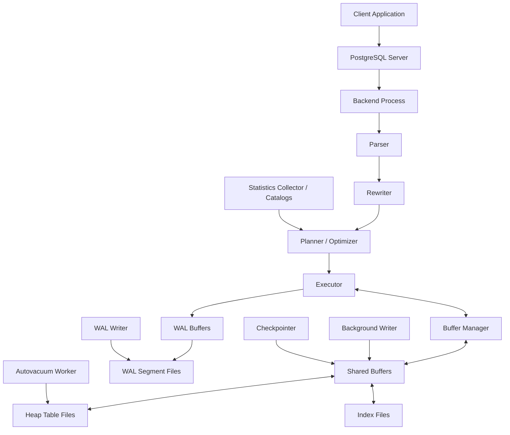
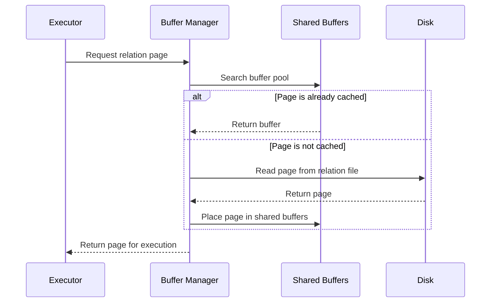
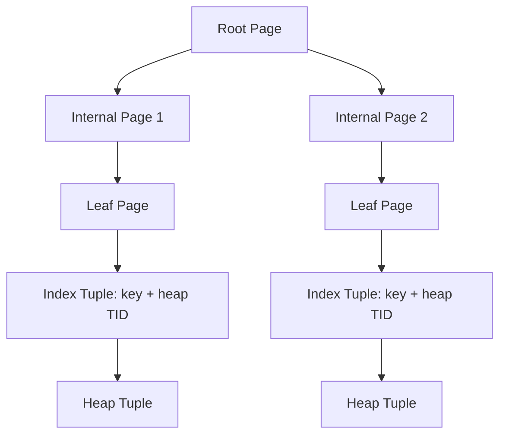
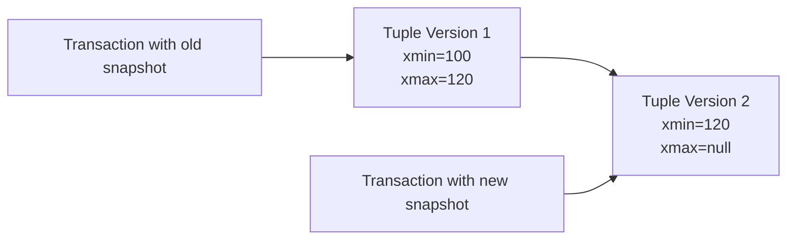
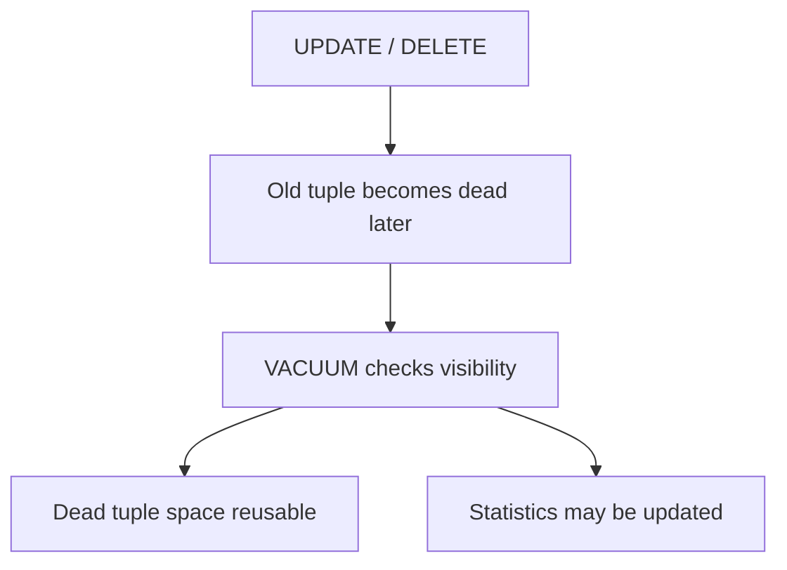
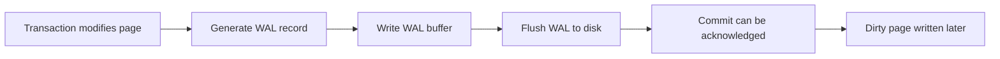
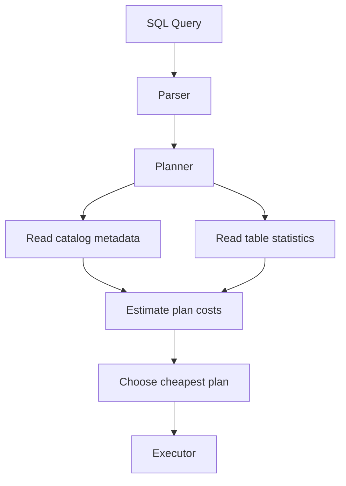

# PostgreSQL Internal Architecture

**Name:** Aparna Singha  
**Roll Number:** 24BCS10353  

---

## 1. Problem Background

PostgreSQL is a full relational database server designed for correctness, concurrency, durability, and extensibility. It supports SQL execution, transactions, indexing, crash recovery, query optimization, background maintenance, and multi-user access.

Studying PostgreSQL internals is important because database behavior is usually explained by internal components. For example:

- A query may be slow because the planner selected a sequential scan.
- A table may become large because old tuple versions were not cleaned yet.
- Updates may not block reads because MVCC allows snapshot-based visibility.
- A committed transaction can survive a crash because WAL records were flushed.
- An index may speed up lookup but add extra cost during inserts and updates.

This README focuses on PostgreSQL internals from a system design perspective, especially buffer manager, B-tree indexes, MVCC, WAL, and query planning.

---

## 2. Architecture Overview

PostgreSQL uses a process-based client-server architecture. A client connects to the server, and a backend process handles the query. Internally, the query passes through parser, rewriter, planner, and executor. During execution, PostgreSQL interacts with shared buffers, heap files, index files, WAL, and background processes.



### Main Internal Components

| Component | Responsibility |
|---|---|
| Parser | Converts SQL text into parse tree |
| Rewriter | Applies rewrite rules and view expansion |
| Planner | Chooses the cheapest execution plan |
| Executor | Runs the plan and returns rows |
| Buffer manager | Manages page movement between disk and memory |
| Shared buffers | PostgreSQL-managed memory cache |
| WAL | Provides durability and crash recovery |
| MVCC | Provides snapshot-based concurrency |
| Autovacuum | Removes dead tuples and updates statistics |
| B-tree indexes | Speed up equality and range queries |

---

## 3. Internal Design

## 3.1 Buffer Manager

**Source location:** `src/backend/storage/buffer/`

The buffer manager controls how table and index pages are cached in memory. PostgreSQL does not read individual rows directly from disk. It reads fixed-size pages into shared buffers.

When the executor needs a tuple or index entry, it requests the required page. The buffer manager checks whether the page is already in shared buffers. If yes, it returns the page from memory. If not, it reads the page from disk.



### Important Buffer Manager Concepts

| Concept | Meaning |
|---|---|
| Shared buffers | PostgreSQL's internal page cache |
| Buffer pin | Prevents a page from being evicted while in use |
| Dirty page | Page changed in memory but not yet written to disk |
| Replacement policy | Chooses which page to evict when buffer space is needed |
| Background writer | Writes dirty pages gradually |
| Checkpointer | Forces dirty pages to disk at checkpoint boundaries |

### Why Buffer Manager Matters

The buffer manager directly affects performance. If frequently used pages remain in memory, queries avoid disk I/O. However, it also adds complexity because PostgreSQL must safely handle concurrent access to pages, dirty page flushing, and crash recovery coordination with WAL.

---

## 3.2 B-Tree Index Implementation

**Source location:** `src/backend/access/nbtree/`

PostgreSQL's default index type is B-tree. B-tree indexes are used for equality queries, range queries, ordering, and many primary key/unique constraints.

A B-tree is a balanced tree. Search starts at the root page, moves through internal pages, and reaches a leaf page containing index tuples.



### B-Tree Search Path

For a query such as:

```sql
SELECT * FROM users WHERE id = 10;
```

PostgreSQL may:

1. Start from the B-tree root page.
2. Compare keys and choose the correct child page.
3. Move down to a leaf page.
4. Find the matching key.
5. Use the tuple identifier to fetch the heap tuple.

### Page Splits

When a B-tree page becomes full, PostgreSQL splits the page. Some keys remain in the old page and others move to a new page. The parent page receives a separator key pointing to the new page.

Page splits preserve B-tree balance, but they add write cost. Insert-heavy workloads can cause frequent page splits if keys are inserted randomly.

### B-Tree Trade-off

| Advantage | Cost |
|---|---|
| Fast point lookup | Extra storage for index |
| Fast range query | Insert/update overhead |
| Ordered traversal | Page split cost |
| Supports constraints | Maintenance during writes |

---

## 3.3 MVCC

PostgreSQL uses **Multi-Version Concurrency Control** to allow concurrent transactions without forcing readers and writers to block each other unnecessarily.

Instead of overwriting a row in place, PostgreSQL creates a new tuple version. Old tuple versions remain until they are no longer visible to any transaction.

Each heap tuple contains transaction metadata:

| Field | Meaning |
|---|---|
| `xmin` | Transaction ID that inserted the tuple |
| `xmax` | Transaction ID that deleted or updated the tuple |
| Snapshot | Set of transactions visible to a transaction |
| Visibility rule | Decides whether a tuple should be seen |



### Example MVCC Behavior

If transaction T1 reads a row while transaction T2 updates the same row, T1 can continue reading the older committed version. This avoids blocking reads in many cases.

### Why VACUUM is Necessary

MVCC creates old tuple versions. Once no active transaction can see them, they become dead tuples. PostgreSQL needs VACUUM to clean them.

VACUUM is required because:

- Updates and deletes leave old tuple versions.
- Dead tuples consume table space.
- Indexes may also contain references to dead tuples.
- Too many dead tuples can slow down scans.
- Transaction ID wraparound must be prevented.



### MVCC Trade-off

MVCC improves concurrency but creates storage maintenance work. PostgreSQL chooses this because high read-write concurrency is important for production database systems.

---

## 3.4 WAL - Write Ahead Logging

WAL stands for Write-Ahead Logging. It is PostgreSQL's main durability and crash recovery mechanism.

The basic rule is:

> The log describing a change must reach durable storage before the data page change is considered safe.

When a transaction modifies data, PostgreSQL generates WAL records. These records are written to WAL buffers and then flushed to WAL segment files. Dirty data pages can be written later.



### Why WAL is Useful

WAL provides:

- Atomicity support
- Durability after commit
- Crash recovery
- Sequential logging of changes
- Reduced need to immediately write dirty data pages
- Support for checkpoints and replication-related features

### Crash Recovery Idea

If PostgreSQL crashes after a transaction commits but before the changed data page reaches disk, the WAL record can be replayed during recovery. This restores the committed change.

---

## 3.5 Checkpointing

A checkpoint is a recovery boundary. During a checkpoint, PostgreSQL ensures that dirty pages up to a certain WAL position are written to disk.

This reduces crash recovery time because PostgreSQL does not need to replay WAL from the beginning.

| Checkpoint Frequency | Advantage | Disadvantage |
|---|---|---|
| More frequent | Shorter crash recovery | More write pressure |
| Less frequent | Lower normal write pressure | Longer crash recovery |

Checkpointing is a balance between runtime performance and recovery time.

---

## 3.6 Query Planning

PostgreSQL has a cost-based optimizer. The planner compares possible execution plans and chooses the plan with the lowest estimated cost.

For example, the planner may choose between:

- Sequential scan
- Index scan
- Bitmap index scan
- Nested loop join
- Hash join
- Merge join



### Role of Statistics

PostgreSQL uses table statistics to estimate:

- Number of rows
- Number of distinct values
- Most common values
- Value distribution
- Null fraction
- Correlation

These statistics are collected using `ANALYZE`.

If statistics are stale, PostgreSQL may choose a bad plan.

---

## 4. Design Trade-Offs

| Internal Area | PostgreSQL Design | Benefit | Trade-off |
|---|---|---|---|
| Process model | Backend process per connection | Isolation and session control | More process overhead |
| Buffer manager | Shared buffer pool | Reduces disk reads | Needs memory management |
| Storage | Heap + separate indexes | Flexible and MVCC-friendly | Index scans may need heap access |
| B-tree index | Balanced sorted index | Fast lookup and range scan | Extra write cost |
| MVCC | Tuple versioning | Readers and writers block less | Dead tuples require VACUUM |
| WAL | Log before data page write | Strong crash recovery | Extra write path |
| Checkpointing | Periodic dirty page flush | Limits recovery work | Can cause write spikes |
| Planner | Cost-based optimizer | Better plans for complex queries | Depends on statistics |

PostgreSQL accepts internal complexity because it is designed to support correctness and concurrency at production scale.

---

## 5. Experiments / Observations

The following commands are examples that can be used to observe PostgreSQL internals. No fake measured output is included.

### 5.1 Observe Query Execution Plan

```sql
EXPLAIN ANALYZE
SELECT *
FROM orders o
JOIN customers c ON o.customer_id = c.id
WHERE c.city = 'Bengaluru';
```

Expected observation:

PostgreSQL shows estimated cost, estimated rows, actual rows, and actual execution time. This helps compare planner estimates with real execution.

### 5.2 Observe Index Usage

```sql
CREATE INDEX idx_customers_city ON customers(city);

EXPLAIN
SELECT *
FROM customers
WHERE city = 'Bengaluru';
```

Expected observation:

If the predicate is selective, PostgreSQL may use an index scan. If many rows match, it may still choose a sequential scan.

### 5.3 Refresh Planner Statistics

```sql
ANALYZE customers;
ANALYZE orders;
```

Expected observation:

This updates table statistics so the planner has better information for cost estimation.

### 5.4 View Statistics

```sql
SELECT tablename, attname, n_distinct, most_common_vals
FROM pg_stats
WHERE tablename = 'customers';
```

Expected observation:

This shows the statistics used by the planner in a readable form.

### 5.5 Observe MVCC and VACUUM

```sql
UPDATE customers
SET city = 'Bangalore'
WHERE city = 'Bengaluru';

VACUUM customers;
```

Expected observation:

Updates create older tuple versions. VACUUM later cleans tuple versions that are no longer visible to active transactions.

### 5.6 Observe Transaction Snapshot Behavior

Session 1:

```sql
BEGIN;
SELECT * FROM customers WHERE id = 1;
```

Session 2:

```sql
UPDATE customers SET city = 'Delhi' WHERE id = 1;
COMMIT;
```

Session 1:

```sql
SELECT * FROM customers WHERE id = 1;
COMMIT;
```

Expected observation:

Depending on isolation level, Session 1 may continue to see a consistent snapshot. This demonstrates MVCC visibility behavior.

---

## 6. Key Learnings

PostgreSQL internals show that a database system is not only about storing rows. It is a combination of memory management, disk layout, transaction visibility, logging, indexing, planning, and background maintenance.

The buffer manager reduces disk I/O but requires careful page management. B-tree indexes speed up reads but add write overhead. MVCC improves concurrency but creates dead tuples. WAL protects committed data but adds logging cost. Query planning improves performance but depends on accurate statistics.

The main learning is that PostgreSQL performance and correctness come from the interaction of many components, not from one single feature.

---

## 7. References

1. PostgreSQL Documentation: https://www.postgresql.org/docs/
2. PostgreSQL Source Code: https://github.com/postgres/postgres
3. PostgreSQL Buffer Manager Source: https://github.com/postgres/postgres/tree/master/src/backend/storage/buffer
4. PostgreSQL B-Tree Source: https://github.com/postgres/postgres/tree/master/src/backend/access/nbtree
5. PostgreSQL MVCC: https://www.postgresql.org/docs/current/mvcc.html
6. PostgreSQL WAL: https://www.postgresql.org/docs/current/wal.html
7. PostgreSQL EXPLAIN: https://www.postgresql.org/docs/current/sql-explain.html
8. PostgreSQL Planner Statistics: https://www.postgresql.org/docs/current/planner-stats.html