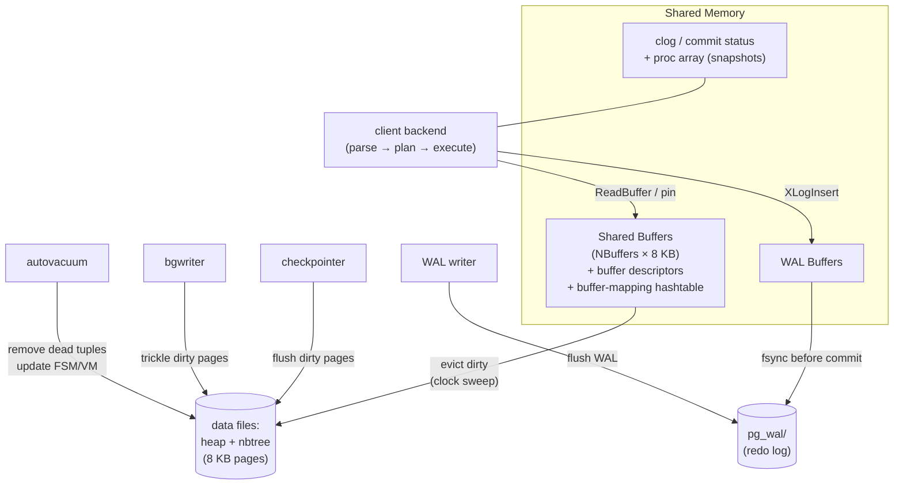
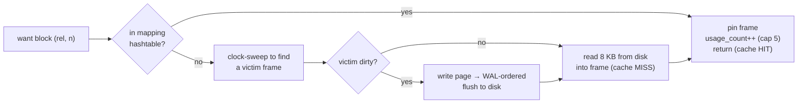
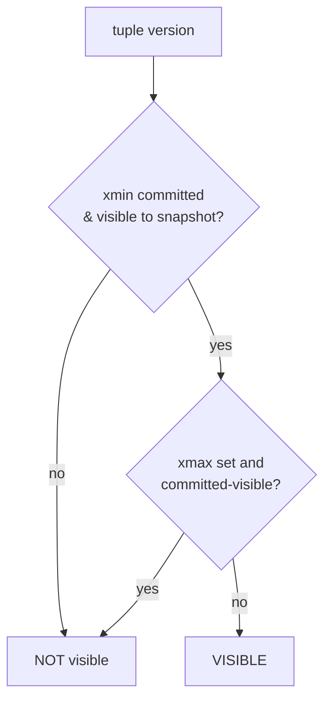

# PostgreSQL Internal Architecture

> **Advanced DBMS – System Design Discussion**
> Author: Varun Mundada · Roll No: **SCALER_10326**
> Topic 2 — *Buffer Manager · B-Tree (nbtree) · MVCC · WAL · VACUUM*

Every experiment below is **real**, produced against **PostgreSQL 16.2** running locally and
reproducible from the inline script (`../experiments/pg_exp.py`).

---

## 1. Problem Background

PostgreSQL must provide four things **simultaneously** on ordinary, crash-prone hardware:

1. **Concurrency** — many sessions reading and writing at once without corrupting each other.
2. **Durability** — a committed transaction survives an OS crash or power loss.
3. **Performance** — disk is ~10⁵× slower than RAM, so the hot working set must live in memory.
4. **Correctness** — every reader sees a *consistent* snapshot of the database.

No single data structure delivers all four, so PostgreSQL is built from **cooperating subsystems**,
each solving one piece:

| Subsystem | Source | Problem it solves |
|---|---|---|
| **Buffer Manager** | `src/backend/storage/buffer/` | Keep hot 8 KB pages in RAM; decide what to evict |
| **B-Tree (nbtree)** | `src/backend/access/nbtree/` | `O(log n)` ordered lookups/range scans that stay balanced under concurrency |
| **MVCC** | `src/backend/access/heap/`, `…/utils/time/` | Snapshot isolation: readers don't block writers |
| **WAL** | `src/backend/access/transam/` | Durability + crash recovery (and replication) |
| **VACUUM / autovacuum** | `src/backend/access/heap/vacuumlazy.c` | Reclaim the dead tuples MVCC leaves behind |

This document follows a page from disk → buffer → B-tree → MVCC visibility → WAL → VACUUM, and backs
each step with measurements.

---

## 2. Architecture Overview



**The cardinal rule that ties it together — WAL before data:** a modified ("dirty") page may **not**
be written to its data file until the WAL record describing that change is safely `fsync`'d. That one
ordering guarantee is what makes crash recovery possible.

---

## 3. Internal Design

### 3.1 Buffer Manager — `src/backend/storage/buffer/`

Shared Buffers is an array of `NBuffers` 8 KB frames in shared memory, each with a **buffer
descriptor** (tag = `<relation, fork, block#>`, dirty flag, **pin count**, **usage count**). A
**buffer-mapping hash table** maps a page tag → frame.

**Reading a page (`ReadBuffer`)**



**Eviction = clock sweep (an approximate-LRU).** A "clock hand" cycles over the frames; each
unpinned frame's `usage_count` is decremented; a frame is chosen as victim only when its
`usage_count` hits 0. Frequently-touched pages keep getting their count bumped back up, so they
survive — this approximates LRU **without** maintaining an expensive global LRU list under heavy
concurrency. **Pinned** pages (in use right now) are never evicted.

**Writing.** Backends mostly just mark pages dirty; the **checkpointer** (periodic, bulk) and
**bgwriter** (continuous trickle) do the actual writes, so foreground queries rarely pay for I/O.
At a checkpoint, **full-page images** are written into WAL the first time a page is touched after the
checkpoint, protecting against **torn pages** (partial 8 KB writes during a crash).

### 3.2 B-Tree — `src/backend/access/nbtree/`

PostgreSQL's B-tree is a **Lehman & Yao high-concurrency B⁺-tree**. Properties:

* Data lives in **leaf** pages; internal pages hold separator keys + child pointers.
* Each page stores a **high key** (an upper bound for its subtree) and a **right-link** to its
  right sibling. These two fields are the trick that lets a searcher descend **without locking the
  whole path**: if a concurrent split moved the target key rightward, the searcher notices the high
  key is too small and simply **follows the right-link** to find it. Readers and writers thus
  contend on at most one or two page-level locks at a time.

**Search path:** descend from the root, at each level binary-search the keys to pick the child,
until a leaf; then scan the leaf (following right-links for range scans).

**Insert & page split:** insert into the target leaf; if it has no room, **split** it (~50/50),
push a new separator key up to the parent, and fix sibling right-links. Splits can cascade up and,
rarely, grow the tree's height by creating a new root. `FILLFACTOR` (default 90% for indexes) leaves
slack so monotonically-increasing keys don't split on every insert.

```
Leaf full → split:
[ 10 20 30 40 ]   insert 25     [ 10 20 25 ]──right-link──▶[ 30 40 ]
        ▲                              ▲ high key=25            ▲
   parent points here          new separator 30 pushed up to parent
```

### 3.3 MVCC — heap tuple versioning

Every heap tuple carries a 23-byte header used for visibility:

| Field | Meaning |
|---|---|
| `xmin` | XID of the transaction that **created** this version |
| `xmax` | XID that **deleted/superseded** it (0 ⇒ live) |
| `cmin/cmax` | command IDs within a transaction |
| `t_ctid` | pointer to the **next/newer** version (forms the update chain) |
| `infomask` | hint bits (committed/aborted) to avoid re-checking `clog` |

A transaction takes a **snapshot**: `(xmin, xmax, xip[])` = "lowest still-running XID, next XID, and
the list of in-progress XIDs." A tuple is **visible** iff its `xmin` committed *before* the snapshot
**and** its `xmax` is unset or belongs to a transaction not visible to the snapshot.



**Why readers don't block writers:** an `UPDATE` creates a *new* tuple version and sets the old one's
`xmax`. A concurrent reader on an older snapshot still sees the **old** version — no lock needed. We
verify the new-version behavior directly in [§5.3](#53-mvcc-update-creates-a-new-version).

**HOT (Heap-Only Tuple) updates:** if an update changes **no indexed column** and the new version
fits on the **same page**, PostgreSQL chains it via `t_ctid` and **skips touching the indexes**
entirely; old versions are pruned in place on next page access. This dramatically reduces index
churn and bloat for hot-row updates (I hit exactly this behavior during experiments — §5.4).

### 3.4 WAL — Write-Ahead Logging — `src/backend/access/transam/`

Each change generates a **WAL record** identified by an **LSN** (Log Sequence Number = byte offset
in the log). The protocol:

1. Modify the page in Shared Buffers (mark dirty); record its **page LSN**.
2. Append a WAL record describing the change to WAL buffers.
3. On `COMMIT`, **`fsync` WAL up to that LSN** before acknowledging the client.
4. The dirty data page itself can be written **lazily** later — but never *before* its WAL (enforced
   by comparing page LSN to the flushed WAL LSN).

**Checkpoints** flush all currently-dirty buffers and write a checkpoint record; recovery only needs
to replay WAL **from the last checkpoint** forward (**redo**). **Full-page writes** after each
checkpoint guard against torn pages. The same WAL stream feeds **streaming replication** and
**point-in-time recovery**.

### 3.5 VACUUM — the cost of MVCC

Because updates/deletes leave **dead tuples**, space must be reclaimed. `VACUUM`:
* removes dead tuples and their index entries, returning space to the page's **free space** (for
  reuse — it usually does **not** shrink the file; `VACUUM FULL` rewrites to shrink);
* updates the **Free Space Map** and **Visibility Map** (the VM enables index-only scans);
* **freezes** very old `xmin`s (sets a "frozen" mark) to prevent **transaction-ID wraparound**,
  since XIDs are only 32-bit.
* **autovacuum** runs this automatically based on dead-tuple thresholds.

---

## 4. Design Trade-Offs

| Decision | Win | Cost |
|---|---|---|
| **Append-only MVCC** (new version per update) | Readers never block writers; trivial rollback (just don't commit) | Dead tuples → bloat → `VACUUM`; XID wraparound management |
| **Process-per-connection** | Strong isolation; crash of one backend ≠ crash of server | Heavy per-connection memory → needs poolers at high connection counts |
| **Clock-sweep buffer eviction** | Cheap, concurrency-friendly approximate LRU | Not true LRU; can mis-evict under adversarial patterns |
| **WAL (redo) + checkpoints** | Durable, fast commit (sequential log write), enables replication | Write amplification; checkpoint I/O spikes; full-page writes inflate WAL |
| **Heap + separate indexes** (non-clustered) | Cheap updates that don't move rows; many index types | Index→heap hop on lookups (mitigated by index-only scans + VM) |

**The defining trade-off** is append-only MVCC: PostgreSQL chose **read concurrency and simple
rollback** over **in-place updates**, and pays for it with `VACUUM`. InnoDB made the opposite choice
(in-place updates + undo log) — compared in the MySQL/InnoDB topic.

---

## 5. Experiments / Observations

> Dataset: `customers(5k)`, `products(1k)`, `orders(50k)`, `order_items(150k)`; `block_size = 8192`.

### 5.1 Recommended exercise — `EXPLAIN (ANALYZE, BUFFERS)` on a multi-table join

```sql
EXPLAIN (ANALYZE, BUFFERS)
SELECT c.city, p.category, SUM(oi.qty*oi.price) AS rev
FROM customers c
JOIN orders o       ON o.customer_id = c.id
JOIN order_items oi ON oi.order_id    = o.id
JOIN products p     ON p.id           = oi.product_id
WHERE c.city = 'Pune'
GROUP BY c.city, p.category
ORDER BY rev DESC;
```

Real plan (abridged):
```
Sort  (cost=4607.61..4607.63 rows=5)  (actual time=31.399..31.404 rows=5)
  ->  HashAggregate  Group Key: p.category   Buffers: shared hit=1315
        ->  Hash Join (oi.product_id = p.id)              est rows=18870  actual rows=18665
              ->  Hash Join (oi.order_id = o.id)          est rows=18870  actual rows=18665
                    ->  Seq Scan on order_items           rows=150000  (Buffers: hit=956)
                    ->  Hash → Hash Join (o.customer_id = c.id)  est rows=6290 actual rows=6113
                          ->  Seq Scan on orders          rows=50000  (Buffers: hit=319)
                          ->  Seq Scan on customers  Filter: city='Pune'  (5000→629)
Planning Time: 2.519 ms     Execution Time: 31.547 ms
```

**Reading the plan against the assignment's questions:**
* **Chosen execution plan:** three **hash joins** (build a hash table on the smaller side, probe with
  the larger). The planner chose this over nested loops because the join touches a large fraction of
  each table.
* **Planner estimates vs actual:** Pune customers estimated **6290 vs actual 6113** (~3% off) — the
  estimate is derived from statistics, not from running the query.
* **Buffers:** `shared hit=1315` and **0 reads** — the whole working set was already in Shared
  Buffers (a warm cache), so this query did **no physical I/O**. `relpages` confirms the scan
  sizes: `order_items` = 956 buffers = its 956 pages.

### 5.2 Statistics drive the plan (`pg_statistic` / `pg_stats`)

```
attname     | n_distinct | correlation | n_mcv
------------+------------+-------------+------
customer_id |   4986     |    0.00     | 100
id          |     -1     |    1.00     |  -      (-1 ⇒ column is unique; corr 1.0 ⇒ stored in order)
order_date  |    180     |    0.02     |  20
```
`n_distinct ≈ 4986` for `customer_id` is exactly how the planner estimated "≈6290 customers in Pune"
and sized the hash tables. **Plans are only as good as these statistics** — a stale `ANALYZE` is the
usual root cause of a bad plan. This is the concrete `pg_statistic` relationship the exercise asks
about.

### 5.3 Buffer manager + index: Seq Scan → Bitmap Index Scan

```
WHERE customer_id = 99   (15 of 50,000 rows)
before index:  Seq Scan on orders     Buffers: shared hit=319        Execution Time: 1.668 ms
after  index:  Bitmap Index Scan      Buffers: shared hit=15 read=2  Execution Time: 0.065 ms
```
Before the index, the query reads all **319 pages** of `orders` through the buffer manager. After,
it reads **2 index pages + 15 heap pages** — the planner *re-costed* and switched strategy on its
own. ~25× fewer buffer accesses, ~25× faster.

### 5.4 MVCC: `UPDATE` creates a new version

```
After INSERT : ctid=(0,1)  xmin=785  xmax=0  bal=100
After UPDATE1: ctid=(0,2)  xmin=786  xmax=0  bal=90    ← new physical tuple, new xmin
After UPDATE2: ctid=(0,3)  xmin=787  xmax=0  bal=80
After UPDATE3: ctid=(0,4)  xmin=788  xmax=0  bal=70
```
The row's **physical location (`ctid`) moves on every update** and `xmin` advances — direct evidence
of versioning rather than in-place mutation.

> **A nice surprise.** When I instead ran 2000 updates of a **non-indexed** column on a row with free
> space on its page, the table stayed at **1 page with 0 dead tuples** — PostgreSQL applied **HOT
> updates**, chaining versions on the same page and pruning them automatically. MVCC bloat is not
> inevitable; HOT avoids it for the common "update a hot row" case.

### 5.5 Why VACUUM is necessary (measured)

A full-table `UPDATE` (which *cannot* be HOT — it rewrites everything) doubles the heap; `VACUUM`
reclaims the dead versions as **reusable** free space:
```
after load (100k rows) : size= 3544 kB
after UPDATE all rows   : size= 7080 kB    ← +3536 kB ≈ 100k dead versions (~36 B each)
after VACUUM            : size= 7080 kB    ← dead removed; space kept inside the file
after 2nd UPDATE all    : size= 7080 kB    ← reused → no growth (this is VACUUM working)
```
The arithmetic is exact: `7080−3544 = 3536 kB` for 100 000 dead tuples ≈ **36 bytes/tuple**, matching
the 23-byte header + 8-byte payload + alignment. Without `VACUUM`, the file would grow without bound.

### 5.6 WAL guarantees durability (measured volume)

```
before:  pg_current_wal_lsn() = 0/3316778
CREATE TABLE wtest AS SELECT * FROM orders   (50,000 rows)
after :  pg_current_wal_lsn() = 0/36EBB18
WAL generated = 3925 kB      current segment = 000000010000000000000003
```
The 50k-row write produced ~3.9 MB of WAL — all `fsync`'d **before** commit returned, so a crash an
instant later would still recover the table by replaying these records.

---

## 6. Key Learnings

1. **PostgreSQL is a pipeline of single-purpose subsystems**, and the glue is one rule — *WAL before
   data*. Trace a write and you touch every component: buffer pin → page change → WAL record →
   commit `fsync` → lazy checkpoint flush → eventual `VACUUM`.
2. **A page's journey is observable.** `Buffers: shared hit=1315 read=0` told me the multi-join did
   zero physical I/O; the Seq-Scan→Index-Scan switch dropped buffer touches from 319 to 17. The
   buffer manager's effectiveness is not theory — it's in the plan output.
3. **The optimizer is a statistician.** It estimated 6290 Pune rows (actual 6113) straight from
   `pg_statistic.n_distinct`. Plan quality ≈ statistics quality; `ANALYZE` is not optional.
4. **MVCC's bill comes due as `VACUUM`.** I watched the heap double (3544→7080 KB) and then watched
   the space get **reused** after VACUUM. The append-only choice that gives non-blocking reads is the
   *same* choice that necessitates VACUUM — one decision, two consequences.
5. **HOT updates were the biggest surprise:** PostgreSQL avoids index churn and bloat entirely for
   same-page, non-indexed-column updates. The "MVCC always bloats" folklore is too simple.
6. **Durability has a measurable price:** ~3.9 MB of WAL for a 50k-row table. That write
   amplification is the cost of being able to survive a crash — a deliberate, quantifiable trade.

---

## References
- PostgreSQL 16 Docs — *Internals*: Buffer Manager, Indexes, MVCC, WAL, Routine Vacuuming —
  <https://www.postgresql.org/docs/16/internals.html>
- `src/backend/access/nbtree/README` (Lehman & Yao implementation notes) —
  <https://github.com/postgres/postgres/blob/master/src/backend/access/nbtree/README>
- Hironobu Suzuki, *The Internals of PostgreSQL* — <https://www.interdb.jp/pg/>
- P. Lehman, S. Yao, *Efficient Locking for Concurrent Operations on B-Trees*, ACM TODS, 1981.
- H. Berenson et al., *A Critique of ANSI SQL Isolation Levels*, SIGMOD 1995.

*Experiments produced by `../experiments/pg_exp.py` (PostgreSQL 16.2 via a locally-bundled server); all output above is verbatim.*
