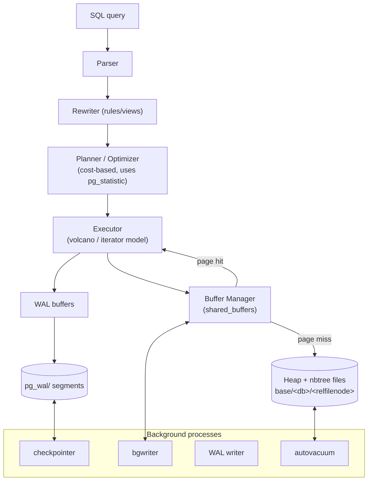
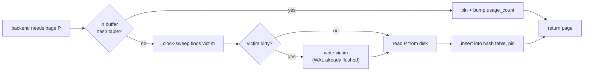
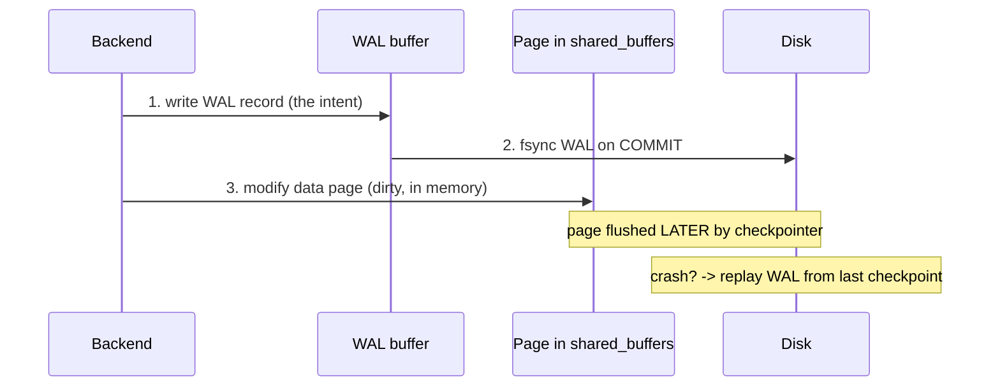

# PostgreSQL Internal Architecture

> How a SQL statement becomes disk I/O in PostgreSQL — through the **buffer manager**,
> the **nbtree** indexes, **MVCC** visibility, and the **WAL** that makes it all durable —
> and how the **cost-based planner** decides what to do in the first place.

All output below was captured on **PostgreSQL 16.13 (Homebrew)** against a 3-table schema
(`depts` = 20 rows, `students` = 100 000 rows, `enrollments` = 500 000 rows).

---

## 1. Problem Background

PostgreSQL descends from the Berkeley POSTGRES project (1986), whose thesis was that a database should be **extensible** and store **complex objects**, not just flat tuples. Two early decisions still define its internals today:

1. **MVCC by storing multiple physical row versions** (rather than overwriting rows and keeping a separate undo log, as Oracle/InnoDB do). This is the *no-overwrite storage manager* idea straight out of the original POSTGRES papers.
2. **A process-per-connection server** coordinating through shared memory.

Almost every internal subsystem — the buffer manager that caches 8 KB pages, the WAL that recovers them, the planner that estimates how many of them a query will touch — exists to serve those two choices correctly and quickly.

---

## 2. Architecture Overview



**Data flow of a read:** Executor asks the buffer manager for a page → if cached in `shared_buffers` it's a **hit**; otherwise a **miss** triggers a disk read into a buffer → tuples are checked for **visibility** (MVCC) → returned. **Writes** are logged to **WAL first** (durability), then applied to the in-memory page; the dirty page is flushed later by the bgwriter/checkpointer.

---

## 3. Internal Design

### 3.1 Buffer Manager — `src/backend/storage/buffer/`

`shared_buffers` is an array of 8 KB frames shared across all backends. Each frame has a descriptor with a pin count and a usage counter. PostgreSQL evicts using a **clock-sweep** (an approximation of LRU): the sweep hand advances around the buffer ring, decrementing usage counts, and evicts the first unpinned buffer whose count hits zero.



We can *see* the cache contents through the `pg_buffercache` extension after running the join below:

```
$ SELECT c.relname, count(*) AS buffers, pg_size_pretty(count(*)*8192) AS cached
  FROM pg_buffercache b JOIN pg_class c ON b.relfilenode = pg_relation_filenode(c.oid)
  GROUP BY c.relname ORDER BY 2 DESC LIMIT 4;

     relname      | buffers | cached
------------------+---------+---------
 enrollments      |    3189 | 25 MB     <- the 500k-row table dominates the cache
 enrollments_pkey |    1374 | 11 MB
 students         |     641 | 5128 kB
 students_pkey    |     276 | 2208 kB
```

The pages that the query touched are exactly the ones now resident — the buffer manager is demand-paging the hot working set.

### 3.2 nbtree — the B-tree index (`src/backend/access/nbtree/`)

PostgreSQL's B-tree is a **Lehman-Yao B-link tree**: each page has a high key and a right-link, which lets a search descend correctly even while a concurrent split is in progress (readers don't block on writers). Inspecting the index built on `enrollments(student_id)`:

```
$ SELECT version, root, level FROM bt_metap('idx_enr_student');
 version | root | level
---------+------+-------
       4 |  290 |     2      <- root at block 290, tree height = level 2 (a 3-level tree)

$ SELECT blkno, type, live_items, free_size, btpo_level
  FROM bt_page_stats('idx_enr_student', 290);
 blkno | type | live_items | free_size | btpo_level
-------+------+------------+-----------+------------
   290 | r    |          3 |      8096 |          2   <- 'r' = root, 3 child pointers
```

**Search path:** root (block 290) → internal page → leaf page → heap. **Insert:** find the leaf, add the entry; if the page is full, **split** it (allocate a new page, redistribute entries, push a new separator key up — possibly recursively to the root, which is how `level` grows). The high-key/right-link design means a search that races a split simply *follows the right-link* to find the moved entries.

### 3.3 MVCC — heap-tuple versioning

Every heap tuple carries hidden system columns. The two that drive visibility:

- **`xmin`** — the transaction id that *created* this version
- **`xmax`** — the transaction id that *deleted/superseded* it (0 = still live)

An `UPDATE` does **not** overwrite. It writes a **new tuple** and stamps the old one's `xmax`. Watch a single row evolve:

```
$ INSERT INTO mvcc_demo VALUES (1,'original');
$ SELECT ctid, xmin, xmax, * FROM mvcc_demo;
 ctid  | xmin | xmax | id |    v
-------+------+------+----+----------
 (0,1) |  779 |    0 |  1 | original          <- version 1 at page 0, slot 1

$ UPDATE mvcc_demo SET v='updated' WHERE id=1;
$ SELECT ctid, xmin, xmax, * FROM mvcc_demo;
 ctid  | xmin | xmax | id |    v
-------+------+------+----+---------
 (0,2) |  780 |    0 |  1 | updated           <- a NEW version at slot 2; the old one still exists on disk
```

After three more updates, the raw page shows the **entire version chain** still physically present, linked by `t_ctid` forward pointers:

```
$ SELECT lp, lp_off, lp_len, t_xmin, t_xmax, t_ctid FROM heap_page_items(get_raw_page('mvcc_demo',0));
 lp | lp_off | lp_len | t_xmin | t_xmax | t_ctid
----+--------+--------+--------+--------+--------
  1 |   8152 |     37 |    779 |    780 | (0,2)    <- xmax=780 -> superseded by, and points to, slot 2
  2 |   8112 |     36 |    780 |    781 | (0,3)    <- chain continues
  3 |   8072 |     37 |    781 |    781 | (0,4)
  4 |   8032 |     38 |    781 |      0 | (0,4)    <- xmax=0 -> the current live version
```

**Visibility rule (simplified):** a tuple is visible to my snapshot if its `xmin` committed before my snapshot and its `xmax` is 0 or belongs to a transaction not visible to me. **Snapshot isolation** is implemented by taking a snapshot (the set of in-progress xids) at statement/transaction start and applying this rule per tuple.

### 3.4 Why VACUUM is necessary

Because dead versions accumulate physically (4 tuples above for a single logical row), PostgreSQL needs a garbage collector. `VACUUM` reclaims space occupied by versions no longer visible to *any* snapshot:

```
$ SELECT n_dead_tup, n_live_tup FROM pg_stat_user_tables WHERE relname='mvcc_demo';
 n_dead_tup | n_live_tup
------------+------------
          1 |          1          <- dead version awaiting cleanup

$ VACUUM mvcc_demo;
$ SELECT n_dead_tup, n_live_tup FROM pg_stat_user_tables WHERE relname='mvcc_demo';
 n_dead_tup | n_live_tup
------------+------------
          0 |          1          <- reclaimed
```

This is the **direct cost of the no-overwrite MVCC model**: it makes readers and writers never block each other, but it requires (auto)vacuum to prevent unbounded **table bloat** and to advance the transaction-id freeze horizon (avoiding xid wraparound).

### 3.5 WAL — Write-Ahead Logging

The durability invariant: **the WAL record describing a change must hit stable storage before the data page does.** Each record has a Log Sequence Number (LSN):

```
$ SELECT pg_current_wal_lsn(), pg_walfile_name(pg_current_wal_lsn());
 pg_current_wal_lsn |     pg_walfile_name
--------------------+--------------------------
 0/7450C40          | 000000010000000000000007    <- 16 MB segment files under pg_wal/
```

**Checkpointing** periodically flushes all dirty buffers and writes a checkpoint record, so recovery only needs to replay WAL *from the last checkpoint* forward — bounding crash-recovery time. WAL is also the foundation for streaming replication and point-in-time recovery.



---

## 4. Design Trade-Offs

| Decision | Advantage | Cost / Limitation |
|---|---|---|
| **No-overwrite MVCC** (versions in the heap) | readers never block writers; instant rollback (just don't make new version visible) | table/index **bloat**; needs **VACUUM**; updates are not in-place → more I/O than InnoDB's undo model |
| **Heap + secondary indexes** (no clustered index) | all indexes are symmetric; cheap updates that don't move rows | every index lookup needs a **heap fetch** (mitigated by index-only scans + visibility map) |
| **WAL-everything** | crash recovery, replication, PITR | write amplification (data written to WAL *and* heap); full-page writes after checkpoint |
| **Process-per-connection** | strong isolation; crash of one backend doesn't corrupt others | each connection is heavyweight → needs a **pooler** at scale |
| **Cost-based planner** | adapts plan to data distribution | depends entirely on **statistics being current** (run `ANALYZE`) |

The contrast worth holding onto: **PostgreSQL pays at cleanup time (VACUUM) what InnoDB pays at read time (undo-log version reconstruction).** Two valid answers to the same MVCC problem — see Topic 3.

---

## 5. Experiments / Observations — `EXPLAIN (ANALYZE, BUFFERS)`

The recommended exercise: a multi-table join with the real plan PostgreSQL chose.

```sql
EXPLAIN (ANALYZE, BUFFERS)
SELECT d.name, count(*)
FROM students s
JOIN enrollments e ON e.student_id = s.id
JOIN depts d       ON d.id = s.dept_id
WHERE s.gpa > 3.5
GROUP BY d.name ORDER BY count(*) DESC LIMIT 5;
```

```
 Limit  (cost=9082.55..9082.56 rows=5) (actual time=34.907..36.467 rows=5 loops=1)
   Buffers: shared hit=5146
   ->  Sort  ...  Sort Method: top-N heapsort  Memory: 25kB
       ->  Finalize GroupAggregate
           ->  Gather Merge   Workers Planned: 2   Workers Launched: 2     <- PARALLEL execution
               ->  Partial HashAggregate
                   ->  Hash Join  (cost=2046.19..7945.05 rows=26290) (actual ... rows=20643 loops=3)
                         Hash Cond: (s.dept_id = d.id)
                         ->  Hash Join  (cost=2044.74..7859.97 rows=26290) (actual ... rows=20643)
                               Hash Cond: (e.student_id = s.id)
                               ->  Parallel Seq Scan on enrollments e (actual rows=166667 loops=3)
                               ->  Hash -> Seq Scan on students s
                                     Filter: (gpa > '3.5')
                                     Rows Removed by Filter: 87614
 Planning Time: 0.929 ms
 Execution Time: 36.530 ms
```

**What the plan tells us:**
- **Plan shape:** the planner chose **hash joins** (build a hash table on the smaller side, probe with the larger) over nested loops, and **parallelized** the scan of the 500k-row `enrollments` across 2 worker processes (`loops=3` = leader + 2 workers).
- **Estimate vs actual:** the inner hash join estimated `rows=26290`, actual `rows=20643` — a good estimate, derived from statistics, not a guess.
- **`BUFFERS`:** `shared hit=5146` and `read=0` in the body → the whole working set was already in `shared_buffers` (warm cache), so the 36 ms is CPU-bound, not I/O-bound.

### How the planner got those estimates — `pg_statistic` / `pg_stats`

`ANALYZE` samples each table and stores distribution stats. The human-readable view:

```
$ SELECT attname, n_distinct, null_frac, correlation FROM pg_stats WHERE tablename='students';
 attname | n_distinct | null_frac |  correlation
---------+------------+-----------+---------------
 id      |         -1 |         0 |   1.0          <- -1 means UNIQUE; correlation 1.0 = perfectly ordered
 dept_id |         20 |         0 |   0.05         <- 20 distinct values -> selectivity of "=x" ≈ 1/20
 gpa     |        401 |         0 |  -0.004
 name    |         -1 |         0 |   0.81
```

The planner uses `n_distinct` to estimate how many rows a predicate returns (e.g. `dept_id = 7` → ≈ 1/20 of rows), `correlation` to decide whether an index scan will be sequential-friendly, and `null_frac` for null handling. **Stale stats → bad estimates → bad plans** — which is exactly why `ANALYZE` (and autovacuum's analyze) matters.

### Cost-based plan selection in action

The same planner picks **opposite strategies** depending on selectivity — proof it's genuinely cost-based, not rule-based:

```
-- Highly selective (1 row): INDEX SCAN
$ EXPLAIN (ANALYZE, BUFFERS) SELECT * FROM students WHERE id = 42;
 Index Scan using students_pkey  (cost=0.29..8.31 rows=1) (actual time=0.008..0.008 rows=1)
   Buffers: shared hit=3                                          <- 3 pages: root, leaf, heap
 Execution Time: 0.035 ms

-- Non-selective (75% of rows): SEQ SCAN (an index would be slower here)
$ EXPLAIN ANALYZE SELECT count(*) FROM students WHERE gpa > 1.0;
 Seq Scan on students  (cost=0.00..1887.00 rows=75382) (actual rows=75215)
 Execution Time: 8.668 ms
```

A 3-page index scan for one row; a full sequential scan when the predicate matches most of the table. The planner correctly judged that random index I/O for 75k rows would beat sequential scan — so it chose the scan.

---

## 6. Key Learnings

1. **MVCC is "keep the garbage, clean later."** Seeing four physical versions of one logical row in `heap_page_items`, linked by `t_ctid`, makes the model concrete — and makes the *necessity* of VACUUM obvious rather than mysterious.
2. **The buffer manager is just a smart cache** with a clock-sweep eviction policy; `pg_buffercache` lets you watch the working set materialize after a query.
3. **B-trees here are concurrent by design** — the Lehman-Yao right-link is why a reader can descend safely through a page that is splitting underneath it.
4. **WAL ordering is the whole durability story** — log the intent, fsync on commit, apply the page later, bound recovery with checkpoints.
5. **Plans are derived, not declared.** The planner turned `pg_statistic` numbers into row estimates, costed hash-vs-index-vs-seq, and even chose parallelism — and flipped its choice when selectivity changed. The single most actionable lesson: **keep statistics fresh.**

---

### References
- PostgreSQL 16 source: `src/backend/storage/buffer/`, `src/backend/access/nbtree/`, `src/backend/access/transam/` (WAL)
- *The Internals of PostgreSQL*, H. Suzuki — https://www.interdb.jp/pg/
- Lehman & Yao (1981), *Efficient Locking for Concurrent Operations on B-Trees*
- PostgreSQL docs 16 — *MVCC*, *WAL*, *Routine Vacuuming*, *Using EXPLAIN*

*All `EXPLAIN`, `pg_stats`, `pageinspect`, and `pg_buffercache` output above is live capture from PostgreSQL 16.13.*
