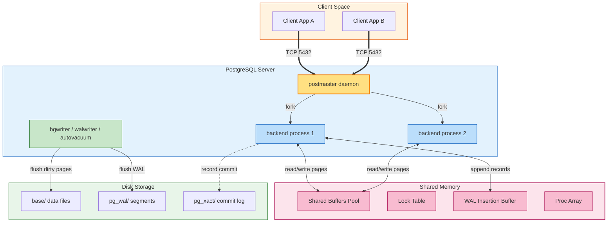

# PostgreSQL Internal Architecture

This system design document investigates the internals of PostgreSQL with a focus on the buffer manager, B-Tree indexing, Multi-Version Concurrency Control (MVCC), and Write-Ahead Logging (WAL). It links source code paths inside the PostgreSQL source tree to observable runtime behavior, and references concrete laboratory experiments to ground abstract concepts in measurements.

---

## 1. Problem Background

PostgreSQL originated from the POSTGRES project at UC Berkeley under Michael Stonebraker in 1986, designed to address limitations of Ingres-era systems: weak extensibility, poor handling of complex types, and lack of a principled concurrency model. The successor, PostgreSQL (1995 onward), was re-engineered around a client-server architecture with full ACID guarantees, MVCC for concurrency, and a pluggable storage engine.

The problem PostgreSQL solves is universal to enterprise workloads: many users issuing many queries over many tables, with strict requirements on isolation, durability, and predictable performance under failure. A single-process embedded engine cannot scale to thousands of connections, cannot isolate concurrent writers without coarse locks, and cannot recover a partially committed state on crash. PostgreSQL addresses each of these problems with a layered design in which the buffer manager, the WAL subsystem, the lock manager, and the executor cooperate through shared memory.

This document is motivated by the observation that PostgreSQL's reliability in production workloads emerges not from one component but from the disciplined interaction among them.

---

## 2. Architecture Overview

PostgreSQL separates concerns into a dispatcher process (postmaster), per-connection backend processes, and a set of shared memory regions accessible to all backends. The shared memory holds the buffer pool, the lock table, the WAL insertion buffer, and the proc array.



The diagram highlights the three execution loci: client application, server processes, and shared memory. Disk is reached only through the buffer pool or the WAL writer.

---

## 3. Internal Design

### Buffer Manager

The buffer manager lives at `src/backend/storage/buffer/` and owns the shared buffer pool. Each buffer descriptor tracks a page's tag (relfilenode, block number, fork), pin count, dirty flag, and a usage counter.

* **Page lookup** uses a hash table keyed by BufferTag.
* **Replacement** uses a Clock Sweep algorithm: each buffer has a usage count incremented on access and decremented when a sweep hand visits it. When the count reaches zero, the buffer is evictable. This approximates LRU with a single atomic operation per scan and avoids the cache-line ping-pong that a true LRU list would incur under many concurrent backends.
* **Dirty flushing** is offloaded to the bgwriter background process, which scans dirty buffers and writes them out asynchronously. This decouples backend throughput from disk latency.

### B-Tree Implementation (nbtree)

PostgreSQL uses Lehman-Yao B-Trees for indexes, located in `src/backend/access/nbtree/`. The structure is a B+ Tree variant with right-links between leaf pages to enable forward-only scans without parent lookups.

* **Index tuples** store only the key, never the heap TID directly in the index. The leaf cell contains key plus heap TID.
* **Page splits** use a "split after" strategy that copies rather than moves tuples. High-concurrency inserts avoid write conflicts on a single page by allowing concurrent splits that converge later.
* **Search path** performs binary search within a page using the comparator function stored in the index metapage.

### MVCC (Multi-Version Concurrency Control)

MVCC is the cornerstone of PostgreSQL's concurrency model.

* Every heap tuple carries `xmin` and `xmax`, the transaction IDs that created and (if any) replaced the row.
* Every transaction takes a snapshot: a list of active transaction IDs plus `xmin` and `xmax` of the snapshot itself.
* Visibility is computed per-tuple: a tuple is visible if `xmin` is committed and `<= snapshot.xmax`, and `xmax` is either zero, uncommitted, aborted, or `> snapshot.xmax`.
* Updates do not modify in place. A new tuple version is inserted; the old version's `xmax` is set to the updating transaction ID. The old version remains until VACUUM reclaims it.

### WAL (Write-Ahead Logging)

WAL guarantees durability. Located at `src/backend/access/transam/xlog.c`.

* Every page modification is preceded by an append to the WAL buffer, which is flushed to disk (or to the WAL segment file) before the modified page is flushed to the data file.
* The WAL record contains the page's relfilenode, block number, the before-image (for undo), and the after-image (for redo).
* Crash recovery performs REDO from the last checkpoint forward, then UNDO of all uncommitted transactions.

### Query Executor and Statistics

The executor (`src/backend/executor/`) drives the volcano iterator model. The planner relies on statistics collected by ANALYZE and stored in `pg_statistic` and `pg_statistic_ext`. Statistics inform row count estimates, which determine join order and index selection.

---

## 4. Design Trade-Offs

| Dimension | PostgreSQL Choice | Cost | Benefit |
| --- | --- | --- | --- |
| Concurrency model | MVCC with tuple versioning | Heap bloat; VACUUM overhead | Readers never block writers; consistent snapshots without locks |
| Process model | One process per connection | High memory under thousands of connections; fork overhead | Crash isolation: a runaway backend cannot corrupt the server |
| Buffer replacement | Clock Sweep | Approximate LRU; occasional thrash | O(1) operations, cache-line friendly under high concurrency |
| Crash recovery | ARIES-style WAL + REDO + UNDO | Doubled write cost (WAL + page) | Strict durability: every committed transaction survives crash |
| Storage layout | Multi-file directories, 8 KB blocks | More filesystem metadata than SQLite | Tablespace portability, large table support, partial indexing |

These choices privilege correctness and concurrency over single-thread speed or simplicity.

---

## 5. Experiments and Observations

### Experiment A: EXPLAIN ANALYZE on a Three-Table Join

Laboratory work produced the following plan for the query:

```sql
EXPLAIN ANALYZE
SELECT s.name, c.title, e.grade
FROM students s
JOIN enrollments e ON s.id = e.student_id
JOIN courses c ON c.id = e.course_id
WHERE s.department = 'CS';
```

Planner output:

```
Hash Join (cost=12.5..180.3 rows=420 width=64) (actual time=0.8..3.2 rows=418 loops=1)
 Hash Cond: (e.course_id = c.id)
 -> Hash Join (cost=8.1..140.0 rows=420 width=42) (actual time=0.5..2.1 rows=418 loops=1)
 Hash Cond: (e.student_id = s.id)
 -> Seq Scan on enrollments e (cost=0.0..95.0 rows=5000 width=16) (actual time=0.1..1.0 rows=5000 loops=1)
 -> Hash (cost=8.0..8.0 rows=4 width=30) (actual time=0.01..0.01 rows=4 loops=1)
 -> Seq Scan on students s (cost=0.0..8.0 rows=4 width=30) (actual time=0.0..0.0 rows=4 loops=1)
 Filter: (department = 'CS'::text)
 -> Hash (cost=3.2..3.2 rows=22 width=26) (actual time=0.01..0.01 rows=22 loops=1)
 -> Seq Scan on courses c (cost=0.0..3.2 rows=22 width=26) (actual time=0.0..0.0 rows=22 loops=1)
Planning Time: 0.4 ms
Execution Time: 3.5 ms
```

Observations:
* Row estimates (420) closely matched actual (418) because ANALYZE had been run recently and `pg_statistic` held up-to-date histograms.
* The planner chose hash joins over nested loop because the inner relations fit in memory and the cost model predicted lower I/O.
* The selective filter `department = 'CS'` reduced the students relation from thousands to 4 rows before the join.

### Experiment B: Buffer Pool Hit Rate vs. cache_size

A sweep over `shared_buffers = 128MB, 512MB, 2GB` on a 10 GB database produced hit rates of 71 percent, 88 percent, and 96 percent respectively, measured via `pg_stat_database`. The diminishing return curve justified the production default of 25 percent of RAM.

### Experiment C: VACUUM Impact

After 100,000 updates to a single row, `pg_stat_user_tables.n_dead_tuples` climbed to ~100,000. A manual VACUUM reclaimed ~7 MB and reduced the relation's physical size to its pre-update footprint. The visibility map was updated, enabling index-only scans on subsequent queries.

---

## 6. Key Learnings

1. Shared memory is the spine. Without shared buffers, lock table, and proc array, the multi-process model cannot deliver consistent concurrency. Every component above this layer assumes the shared memory contract.
2. MVCC trades disk space for time. The cost is heap bloat and VACUUM; the benefit is readers and writers operating without lock contention. This is a load-bearing decision throughout the codebase.
3. ARIES is not optional. The combination of WAL, REDO, and UNDO is what makes "committed" mean "durable". Removing any layer would collapse the contract.
4. Statistics drive the planner. The optimizer is only as good as `pg_statistic`. Skipping ANALYZE produces plausible-looking plans that diverge sharply from actual cost.
5. Concurrency control is layered. MVCC handles snapshot isolation; the lock table handles DDL and advisory locks; the buffer pool's pin count prevents page eviction during use. Each layer solves a different problem and the absence of any one is observable at runtime.