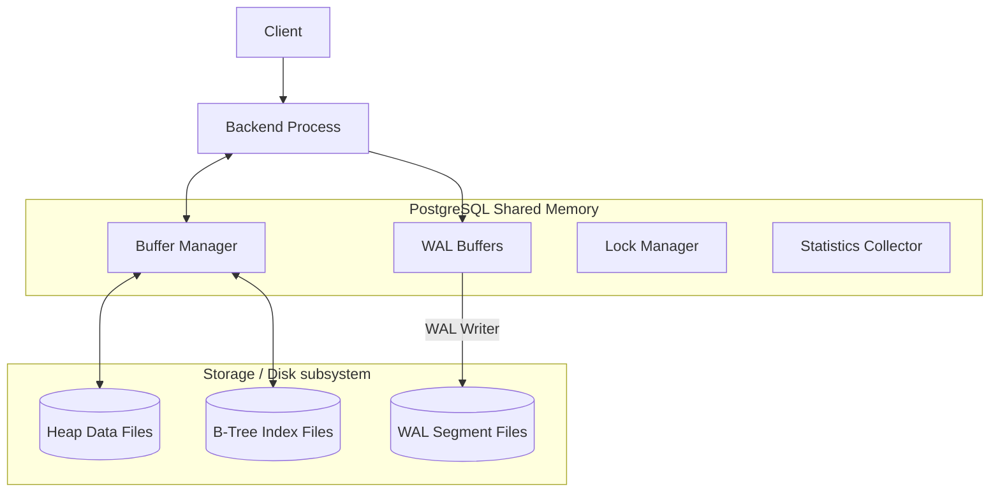

# PostgreSQL Internal Architecture

**Name:** Ojas Maheshwari  
**Roll:** 24BCS10227

## 1. Problem Background
PostgreSQL is universally recognized for its ability to handle extremely dense concurrent workloads while unyieldingly guaranteeing strict ACID (Atomicity, Consistency, Isolation, Durability) compliance. The core engineering challenge it tackles is orchestrating shared data access across thousands of simultaneous connections without introducing data corruption or causing readers and writers to aggressively block one another. To accomplish this masterclass in concurrency, it leans heavily on an advanced Buffer Manager, a sophisticated Multi-Version Concurrency Control (MVCC) engine, and an impregnable Write-Ahead Log (WAL).

## 2. Architecture Overview
At the operational nucleus of PostgreSQL lies a highly robust multi-process architecture. A vast central memory arena, known as **Shared Buffers**, is continuously accessed and modified by an array of backend processes.



## 3. Internal Design & Mechanics

### 3.1. Buffer Manager (`src/backend/storage/buffer/`)
The Buffer Manager serves as the critical intermediary between the operational backend processes and the underlying OS filesystem. PostgreSQL meticulously stores data in uniform 8KB pages.
*   **Page Caching:** When a process necessitates reading a row, it issues a request for the corresponding 8KB page from the Buffer Manager. If the page currently resides in Shared Buffers, it is rapidly returned (cache hit).
*   **Page Reads/Writes:** In the event of a cache miss, the Buffer Manager retrieves the page from persistent disk into an available slot within Shared Buffers. When a page undergoes modification, it is flagged as **"dirty"**. A dedicated background process (`bgwriter`) bears the responsibility for asynchronously flushing these dirty pages back to disk.
*   **Buffer Replacement Algorithm:** PostgreSQL relies on a **Clock Sweep** algorithm to systematically determine which pages to evict when Shared Buffers hit capacity. Each buffer maintains a usage count. The clock hand continually sweeps through the buffers; if a buffer exhibits a usage count of 0, it is forcefully evicted. Otherwise, its count is organically decremented.

### 3.2. B-Tree Implementation (`nbtree`)
PostgreSQL employs a heavily optimized Lehman-Yao B-Tree algorithm tailored specifically for frictionless concurrent index traversal.
*   **Index Page Layout:** Leaf nodes natively encapsulate the index key alongside a `TID` (Tuple Identifier), which acts as a direct pointer to the physical row within the heap.
*   **Search Path:** Traversal uniformly initiates at the root, intelligently following right-links when necessary (to smoothly navigate concurrent page splits), descending directly to the target leaf node.
*   **Page Splits:** Upon a leaf node reaching maximum capacity, it splits into two distinct nodes. Lehman-Yao B-Trees ingeniously maintain a "right link" pointing to the newly generated sibling. This ensures that a concurrent reader actively scanning the original page will seamlessly transition and won't miss the relocated data, even before the parent node is definitively updated.

### 3.3. Multi-Version Concurrency Control (MVCC)
PostgreSQL navigates complex concurrency via MVCC, entirely circumventing the need for restrictive row-level read locks.
*   **Heap Tuple Versioning:** When a row is subjected to an update, PostgreSQL actively avoids overwriting it. Instead, it injects a completely fresh version of the row (a new tuple) into the heap.
*   **xmin / xmax Tracking:** Every single tuple features hidden system-level columns: `xmin` (the originating Transaction ID that created it) and `xmax` (the Transaction ID that subsequently deleted or updated it). 
*   **Visibility Rules (Snapshot Isolation):** A query is immediately granted a "Snapshot" reflecting currently active transactions. It mathematically evaluates `xmin` and `xmax` to ascertain if a specific tuple should be deemed visible. If `xmin` traces back to an older, securely committed transaction, and `xmax` is either null or tethered to a future/uncommitted transaction, the tuple is rendered visible.
*   **VACUUM Engine:** Because obsolete tuples securely remain on disk, they inevitably induce "bloat". The `VACUUM` daemon persistently sweeps through tables to aggressively reclaim space from dead tuples (identifiable when `xmax` belongs to a decisively committed transaction older than all active snapshots).

### 3.4. Write-Ahead Logging (WAL)
The WAL framework fundamentally guarantees **Durability**. 
*   **WAL Records:** Prior to any dirty page being permanently written to the actual heap file, a detailed WAL record comprehensively describing the intended change is sequentially flushed to disk.
*   **Crash Recovery:** Should the server catastrophically crash, volatile dirty pages residing in memory are entirely lost. Upon subsequent restart, PostgreSQL meticulously reads the WAL and "replays" the documented changes to resurrect the database back to an undeniably consistent state.
*   **Checkpointing:** To actively prevent the WAL from expanding infinitely, a `checkpointer` process regularly flushes all existing dirty buffers to disk and definitively writes a "checkpoint" record. Subsequent crash recovery only necessitates replaying WAL segments generated *after* the most recent checkpoint.

## 4. Design Trade-Offs

*   **MVCC Trade-offs:** 
    *   *Advantage:* Phenomenal concurrency capabilities (Readers unequivocally do not block Writers). Exceptionally fast rollbacks (achieved by simply marking the transaction as aborted; absolutely no structural undo required).
    *   *Limitation:* Inevitable Table Bloat. The absolute dependency on `VACUUM`. If the Vacuum daemon fails to keep pace with a profoundly heavy update workload, overall performance severely degrades due to the colossal I/O required to endlessly scan dead tuples.
*   **Append-Only Heap Architecture:** PostgreSQL indexes fundamentally do not store data directly (starkly contrasting MySQL's clustered indexes). They universally point directly to the Heap.
    *   *Advantage:* Updating completely non-indexed columns is incredibly cheap and efficient (known as HOT updates). 
    *   *Limitation:* Index lookups intrinsically mandate reading both the index page and the corresponding heap page (unless it qualifies for a highly specific Index-Only Scan).

## 5. Experiments / Practical Observations

**Exercise: Deep-Dive `EXPLAIN ANALYZE` on a Join**
Executing an `EXPLAIN ANALYZE` statement yields profound insights directly into the mind of the query planner.

```sql
EXPLAIN ANALYZE SELECT * FROM users u JOIN orders o ON u.id = o.user_id WHERE u.status = 'active';
```

**Crucial Observations:**
1.  **Planner Estimates:** The diagnostic output prominently displays `cost=... rows=...`. The planner leverages aggregated statistics housed in `pg_statistic` (actively collected by the `ANALYZE` command) to roughly estimate how many users qualify as 'active'.
2.  **Execution Plan Strategies:** Heavily dependent on these statistics, the planner might purposefully elect a `Nested Loop` (if 'active' users are deemed scarce) or pivot to a `Hash Join` (if an abundance of rows match).
3.  **Actual Statistics:** `EXPLAIN ANALYZE` actively runs the query and reports the definitive execution times. A massive disparity between the estimated `rows` and the actual `rows` serves as a glaring indicator of drastically stale statistics, typically leading to severely suboptimal query plans (e.g., erroneously choosing a Nested Loop when a Hash Join was architecturally appropriate).

## 6. Key Learnings & Takeaways

1.  **Vacuum is Not Just a Housekeeper:** Truly understanding MVCC necessitates understanding that PostgreSQL relies on `VACUUM` as a fundamental, non-negotiable pillar for its entire architecture to function cleanly.
2.  **Sequential vs Random I/O Realities:** The WAL exists for one overarching reason: sequential writes (logging) are spectacularly faster—by orders of magnitude—than random writes (directly updating scattered heap pages). 
3.  **Statistics are the Planner's Lifeline:** A database execution engine is only as intelligent as the statistical data it holds. Executing regular `ANALYZE` operations is undeniably just as critical as proper indexing for maintaining pristine query performance.
4.  **Mastering Autovacuum Configuration:** Tuning the autovacuum daemon is an absolute necessity. Rather than disabling it out of fear of occasional I/O spikes, database administrators must meticulously tune it to run more frequently but far less aggressively, ensuring consistently smooth performance curves.
