# PostgreSQL Internal Architecture

> *A deep exploration of the engineering decisions, subsystem design, and operational mechanics that power the world's most advanced open-source relational database.*

---

## Table of Contents

1. [Problem Background](#1-problem-background)
2. [Architecture Overview](#2-architecture-overview)
3. [Internal Design](#3-internal-design)
   - [Buffer Manager](#31-buffer-manager-srcbackendstoragebuffer)
   - [B-Tree Implementation](#32-b-tree-implementation-nbtree)
   - [MVCC](#33-mvcc-multi-version-concurrency-control)
   - [WAL](#34-wal-write-ahead-logging)
   - [Query Planner/Optimizer](#35-query-planneroptimizer)
4. [Design Trade-Offs](#4-design-trade-offs)
5. [Experiments / Observations](#5-experiments--observations)
6. [Key Learnings](#6-key-learnings)

---

## 1. Problem Background

### The POSTGRES Project at UC Berkeley

The story of PostgreSQL begins not with a database, but with a frustration. In 1986, Professor Michael Stonebraker at UC Berkeley had already built Ingres — one of the earliest relational databases — but he recognized its fundamental architectural limitations. Ingres, like most relational systems of the era, treated the relational model as a closed, rigid system. You could store integers, strings, and dates, but the moment you needed a geometric type, a network address, or a user-defined aggregate, you were on your own. The database had no concept of extensibility at the type system level.

Stonebraker's POSTGRES project (1986–1994) was built explicitly to address this gap. The name itself — "Post-Ingres" — signaled that this was meant to be the successor architecture. The original POSTGRES used a novel storage system based on "no-overwrite storage" (essentially an append-only log), supported user-defined types and operators natively, and introduced a rule system that could intercept and rewrite queries. These ideas were radical for their time: the database was not just a container for relational tables but a programmable platform.

The academic project produced several influential papers but was never designed as production software. When Stonebraker moved on to commercialize the ideas (through Illustra, later acquired by Informix), the open-source POSTGRES codebase was left in the hands of two graduate students — Andrew Yu and Jolly Chen — who made a pivotal decision in 1994: they replaced the original POSTQUEL query language with SQL. The project was renamed PostgreSQL, and its open-source community governance model was established.

### Why the World Needed Another RDBMS

By the mid-1990s, the RDBMS landscape was dominated by commercial titans: Oracle, DB2, Sybase, and Informix. MySQL existed but was intentionally simple — it traded correctness for speed by omitting transactions, subqueries, and foreign key enforcement in its early versions. There was a genuine vacuum in the ecosystem:

| Need | Existing Solutions | Gap |
|---|---|---|
| SQL standards compliance | Oracle, DB2 (expensive) | No affordable, open-source option |
| ACID transactions | Oracle, Sybase | MySQL lacked them entirely |
| Extensible type system | POSTGRES (academic) | No production-ready implementation |
| Complex queries (subqueries, CTEs) | Commercial only | Open-source options couldn't do them |
| Procedural languages in-database | Oracle PL/SQL | Nothing comparable in OSS |

PostgreSQL filled every one of these gaps. Its design philosophy can be distilled to a single principle that has guided its development for three decades:

> **Correctness first. Performance second. Features when they make sense.**

This is not just a slogan — it manifests in concrete engineering decisions. PostgreSQL will never silently truncate data to fit a column (unlike MySQL's traditional behavior). It will never return incorrect results from a concurrent transaction to gain speed. It implements the SQL standard more completely than any other open-source database, and in many areas, more completely than commercial databases.

### The Road to "Most Advanced"

PostgreSQL earned its reputation not through marketing but through relentless engineering. A few milestones illustrate the trajectory:

- **MVCC (inherited from POSTGRES)**: Rather than locking rows for reads, PostgreSQL keeps multiple versions of each tuple. Readers never block writers. This was architecturally baked in from day one.
- **Write-Ahead Logging (WAL), PostgreSQL 7.1 (2001)**: The original POSTGRES "no-overwrite" storage was replaced with a conventional WAL system, dramatically improving performance and enabling point-in-time recovery.
- **Autovacuum (8.1, 2005)**: Automated dead tuple cleanup — acknowledging that MVCC's operational cost needed to be handled by the system, not the DBA.
- **Hot Standby & Streaming Replication (9.0, 2010)**: Read replicas that stay in sync via WAL streaming.
- **Parallel Query (9.6, 2016)**: The executor gained the ability to split work across multiple processes.
- **Logical Replication (10, 2017)**: Row-level change streaming for selective replication.
- **Pluggable Table Access Methods (12, 2019)**: The storage engine became an abstraction, allowing alternatives to the heap.
- **B-Tree Deduplication (13, 2020)**: Significant space savings for non-unique indexes.

Today, PostgreSQL supports JSON/JSONB (with GIN indexing), full-text search, geospatial queries (PostGIS), time-series (TimescaleDB), graph queries (Apache AGE), and vector search (pgvector) — all as extensions to the same core engine. That extensibility trace goes straight back to Stonebraker's 1986 vision.

---

## 2. Architecture Overview

### 2.1 Process Architecture

PostgreSQL uses a **multi-process architecture** rather than a multi-threaded one. Every client connection gets its own dedicated operating system process, forked from a master process called the **Postmaster**. This is a deliberate design choice with profound implications for stability: a crash in one backend process cannot corrupt the memory of another.

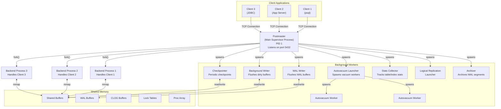

**Key points about this architecture:**

- The **Postmaster** is the only process that listens for new connections. When a client connects, it `fork()`s a new backend process and hands off the socket. The postmaster then goes back to listening. If the postmaster crashes, the entire instance goes down — but this is intentional: the postmaster is kept as simple as possible to minimize crash risk.
- **Backend processes** each have their own private memory (for sort operations, hash tables, query plans) but share a common pool of shared memory for buffer management, locking, and transaction status.
- **Background workers** handle maintenance tasks asynchronously. The Background Writer proactively flushes dirty buffers so that backend processes don't have to. The WAL Writer periodically flushes WAL buffers to disk. The Checkpointer creates periodic consistency points for crash recovery.

### 2.2 Shared Memory Layout

All backend processes and background workers access a single region of shared memory, allocated at server startup. This is the beating heart of PostgreSQL's runtime performance.

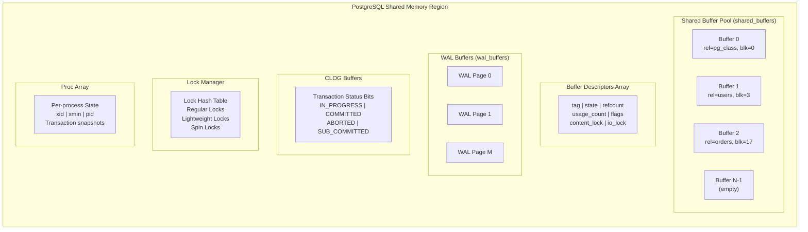

- **Shared Buffers** (`shared_buffers`): The buffer cache. Typically set to 25% of available RAM. Contains copies of 8KB disk pages. This is where all table and index data is read from and written to — backends never access disk directly for data pages.
- **WAL Buffers** (`wal_buffers`): A circular buffer for WAL records before they are flushed to WAL segment files on disk. Default is 1/32 of `shared_buffers` (minimum 64KB).
- **CLOG (Commit Log) Buffers**: Stores the commit/abort status of every transaction. Each transaction uses just 2 bits. The CLOG is essential for MVCC visibility checks.
- **Lock Tables**: Hash tables implementing PostgreSQL's multi-level locking (spin locks → lightweight locks → regular locks → advisory locks).
- **Proc Array**: An array with one entry per backend process, containing each process's current transaction ID, snapshot information, and status. This is consulted during visibility checks to determine which transactions are still in progress.

### 2.3 Query Processing Pipeline

When a SQL statement arrives at a backend process, it passes through a series of well-defined stages. Each stage transforms the query into a progressively lower-level representation.

```mermaid
flowchart TD
    SQL["SQL Query String<br/><i>SELECT * FROM orders o<br/>JOIN customers c ON o.cid = c.id<br/>WHERE c.city = 'NYC'</i>"]

    subgraph "Parser (src/backend/parser/)"
        LEX["Lexer (scan.l)<br/>Tokenization"]
        GRAM["Grammar (gram.y)<br/>Bison parser"]
        PTREE["Raw Parse Tree<br/>(SelectStmt nodes)"]
        LEX --> GRAM --> PTREE
    end

    subgraph "Analyzer (src/backend/parser/analyze.c)"
        SEM["Semantic Analysis<br/>Resolve table names → OIDs<br/>Resolve column names → attributes<br/>Type checking & coercion"]
        QT["Query Tree<br/>(Query struct)"]
        SEM --> QT
    end

    subgraph "Rewriter (src/backend/rewrite/)"
        RW["Rule System<br/>Expand views<br/>Apply ON SELECT rules<br/>Row-level security policies"]
        QT2["Rewritten Query Tree(s)"]
        RW --> QT2
    end

    subgraph "Planner/Optimizer (src/backend/optimizer/)"
        PP["Preprocessing<br/>Flatten subqueries<br/>Simplify expressions"]
        JP["Join Planning<br/>Dynamic programming for join order<br/>GEQO for 12+ tables"]
        PP2["Path Generation<br/>SeqScan, IndexScan, BitmapScan<br/>NestLoop, HashJoin, MergeJoin"]
        CB["Cost Estimation<br/>I/O cost + CPU cost<br/>Using pg_statistic"]
        PLAN["Optimal Plan Tree<br/>(PlannedStmt)"]
        PP --> JP --> PP2 --> CB --> PLAN
    end

    subgraph "Executor (src/backend/executor/)"
        INIT["InitPlan<br/>Allocate state nodes"]
        EXEC["ExecProcNode<br/>Volcano-style iteration<br/>Pull one tuple at a time"]
        RES["Result Tuples<br/>Sent to client via<br/>libpq protocol"]
        INIT --> EXEC --> RES
    end

    SQL --> LEX
    PTREE --> SEM
    QT --> RW
    QT2 --> PP
    PLAN --> INIT

    style SQL fill:#e1f5fe
    style RES fill:#e8f5e9
```

**The Volcano Model (pull-based execution):**

PostgreSQL's executor uses the Volcano iterator model. Every plan node implements three functions: `Init()`, `Next()`, and `End()`. The top-level node calls `Next()` on its child, which calls `Next()` on *its* child, and so on down to the scan nodes. Each call returns exactly one tuple. This elegant abstraction allows plan nodes to be composed arbitrarily — a HashJoin node doesn't care whether its input comes from a SeqScan, an IndexScan, or another join. The downside is function call overhead per tuple, which PostgreSQL mitigates with JIT compilation (LLVM-based, since PG 11) for complex expressions.

### 2.4 Storage Layer Organization

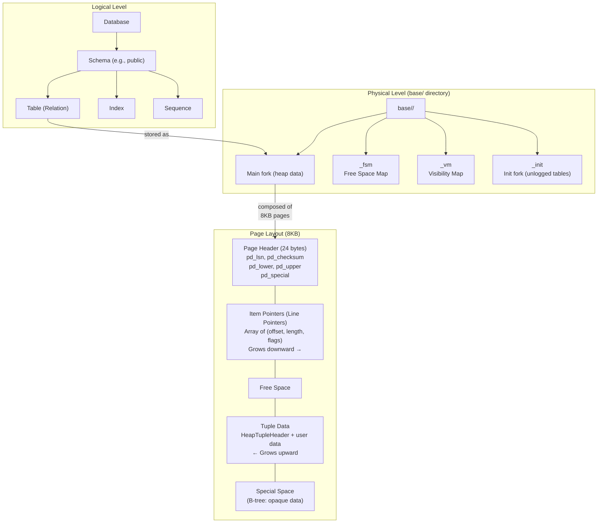

**Key storage concepts:**

- Every table and index is stored as one or more **forks** — the main data fork, a Free Space Map (FSM) tracking available space in each page, and a Visibility Map (VM) tracking which pages contain only tuples visible to all transactions (used for index-only scans and to skip vacuum).
- Files are broken into **1GB segments** (configurable at compile time) to accommodate filesystem limitations.
- Each page is exactly **8KB** (also compile-time configurable). The page header contains the LSN of the last WAL record that modified the page — this is critical for crash recovery.
- **Line pointers** (item IDs) provide a level of indirection: an index entry points to (page_number, item_offset), and the item pointer at that offset points to the actual tuple data within the page. This indirection is what makes HOT (Heap Only Tuples) updates possible without touching indexes.

---

## 3. Internal Design

### 3.1 Buffer Manager (`src/backend/storage/buffer/`)

The buffer manager is arguably the single most performance-critical subsystem in PostgreSQL. Every read and write of a data page goes through the buffer pool. Getting this wrong means the database is either slow (too many disk reads) or unstable (data corruption on crash). PostgreSQL's buffer manager is a masterclass in balancing simplicity, correctness, and performance in a concurrent system.

#### Shared Buffer Pool Architecture

The buffer pool is a fixed-size array of 8KB slots, allocated in shared memory at server startup. The size is controlled by `shared_buffers` (typically 25% of RAM, e.g., 8GB on a 32GB machine = ~1 million buffer slots).

Three data structures work together:

1. **Buffer Descriptors Array**: A parallel array where slot `i` describes the contents of buffer slot `i`. Each descriptor contains:
   - **Buffer Tag**: Identifies *which* disk page is in this slot — `(RelFileNode, ForkNumber, BlockNumber)`.
   - **State word** (atomic uint32): Encodes `refcount` (18 bits), `usage_count` (4 bits), and flag bits (locked, dirty, valid, io_in_progress) — all packed for lock-free atomic operations.
   - **Content lock**: A lightweight lock (LWLock) that protects the buffer's actual data. Multiple readers can hold it in SHARED mode; a writer needs EXCLUSIVE mode.
   - **I/O lock**: Held during physical I/O operations to prevent multiple backends from reading the same page from disk simultaneously.

2. **Buffer Table** (hash table): Maps `BufferTag → buffer_id`. When a backend needs page `(rel=orders, fork=main, blk=42)`, it hashes the tag and looks up the buffer ID. If found, it's a **buffer hit** (fast path). If not, it must allocate a buffer and read from disk — a **buffer miss**.

3. **Buffer Pool Array**: The actual 8KB data slots. The buffer ID is simply the array index.

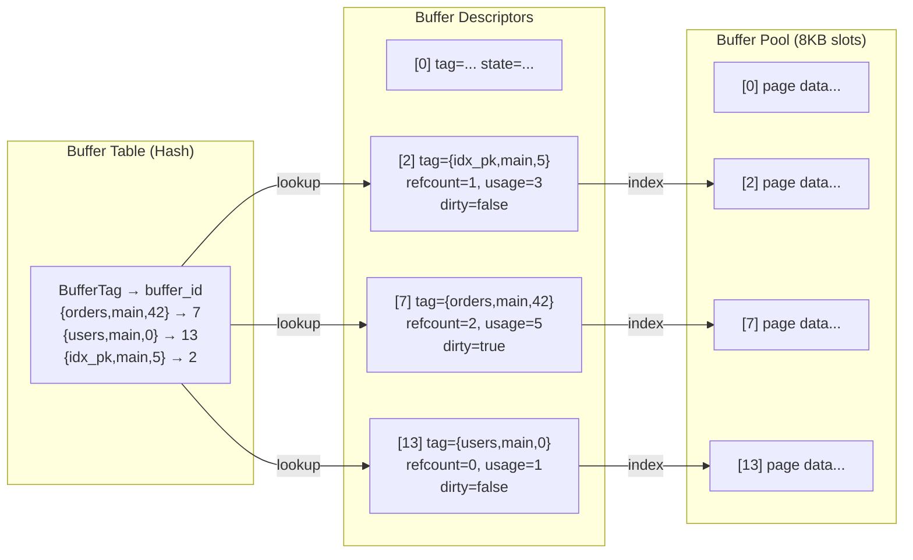

#### Page Replacement: The Clock-Sweep Algorithm

When a backend needs a buffer slot and none are free, the buffer manager must **evict** an existing page. PostgreSQL uses the **clock-sweep** algorithm rather than LRU (Least Recently Used). This is a deliberate and important choice.

**Why not LRU?**

A true LRU implementation requires maintaining a doubly-linked list that is updated on *every buffer access* — every time any backend touches any page, the list must be modified. In a highly concurrent system with hundreds of backends, this list becomes a devastating contention point. Even with fine-grained locking, the cache-line invalidation overhead on multi-core systems is unacceptable.

**How clock-sweep works:**

The algorithm maintains a single shared variable: `nextVictim` — a pointer that sweeps around the buffer descriptor array like the hand of a clock.

```
Algorithm: ClockSweep()
  loop:
    candidate = buffers[nextVictim]
    advance nextVictim (modular increment)

    if candidate.refcount > 0:
      continue  // pinned, skip it

    if candidate.usage_count > 0:
      decrement candidate.usage_count
      continue  // recently used, give it another chance

    // Found a victim: usage_count == 0 and refcount == 0
    return candidate
```

- Every time a page is accessed, its `usage_count` is incremented (up to a maximum of 5).
- The clock hand sweeps through buffers, decrementing `usage_count` of unpinned buffers.
- A buffer is evicted only when its `usage_count` has been decremented all the way to zero — meaning it survived zero full sweeps since its last access.

This gives *frequently* accessed pages a high `usage_count` that protects them through multiple sweeps, while *infrequently* accessed pages are evicted quickly. It approximates LRU behavior without any linked-list manipulation and with only a single atomic operation per buffer visit.

The maximum `usage_count` of 5 is a tuning constant (`BM_MAX_USAGE_COUNT`). If it were higher, hot pages would take longer to evict but cold pages would also take longer to find for eviction. Five strikes a balance between resistance to cache pollution and eviction scan speed.

#### Pin/Unpin: Concurrent Access Safety

Before a backend can read or modify a buffer, it must **pin** it (increment `refcount`). While a buffer is pinned by any backend, the clock-sweep will skip it — you cannot evict a page that someone is actively using. When the backend is done, it **unpins** the buffer (decrements `refcount`).

The `refcount` is encoded in the buffer descriptor's state word, which is modified using compare-and-swap (CAS) atomic instructions. No locks are needed for pin/unpin, making this a very fast operation even under high concurrency.

A crucial invariant: **a backend must never hold a pin across a user-visible wait** (like waiting for client input). If it did, a backend that goes idle while connected to a long-running application would hold pins forever, effectively "leaking" buffer slots.

#### Buffer Ring Strategy: Avoiding Cache Pollution

A full sequential scan of a large table could touch millions of pages. If each page went through the normal buffer pool and received a `usage_count` boost, a single `SELECT * FROM huge_table` would evict the entire working set of all other queries from the cache. This is the classic "scan pollution" problem.

PostgreSQL solves this with a **buffer ring strategy**. For large sequential scans, the backend allocates a small private ring (default: 256KB = 32 buffers). As the scan progresses, it cycles through only these 32 buffers, reusing them in a circular fashion. The rest of the buffer pool is untouched.

| Operation | Ring Size | Rationale |
|---|---|---|
| Large sequential scan | 256KB (32 pages) | Prevent scan pollution |
| Bulk write (COPY) | 16MB (2048 pages) | Dirty pages need space before flush |
| VACUUM | 256KB (32 pages) | Vacuum scans shouldn't evict hot data |

This is an elegant solution: the common case (small lookups, index scans, point queries) uses the full buffer pool for maximum cache efficiency, while the pathological case (full table scans) is contained to a small ring.

#### Dirty Page Management and Background Writer

When a backend modifies a buffer, it marks the page as **dirty** in the buffer descriptor. The dirty page is not immediately written to disk — that would defeat the purpose of buffering. Instead, dirty pages accumulate in the buffer pool and are eventually flushed to disk by one of two mechanisms:

1. **Background Writer** (`bgwriter`): Periodically wakes up and scans the buffer pool for dirty pages that can be written out. This is proactive — by flushing dirty pages before they are needed for eviction, the background writer ensures that the clock-sweep can find clean pages to evict quickly, without blocking on I/O.

2. **Checkpointer**: Periodically writes *all* dirty pages to disk and creates a WAL checkpoint. After a checkpoint, crash recovery only needs to replay WAL records from the checkpoint onwards, keeping recovery time bounded.

The key configuration parameters:

- `bgwriter_delay`: How often the background writer wakes up (default 200ms).
- `bgwriter_lru_maxpages`: How many buffers to write per round (default 100).
- `bgwriter_lru_multiplier`: Scales the number of buffers to write based on recent allocation rate.
- `checkpoint_timeout`: Maximum time between checkpoints (default 5 minutes).
- `checkpoint_completion_target`: Fraction of the checkpoint interval to spread writes over (default 0.9 — spread the I/O over 90% of the interval to avoid spikes).

#### How a Checkpoint Works

A checkpoint is a critical operation that makes crash recovery efficient:

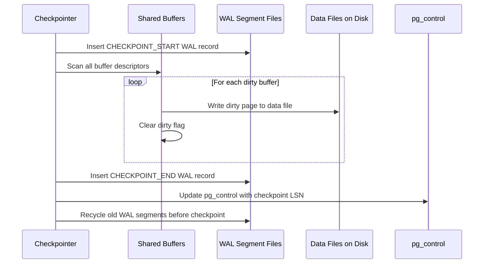

After the checkpoint completes, the `pg_control` file records the checkpoint's WAL position. On crash recovery, PostgreSQL reads `pg_control`, finds the checkpoint, and replays all WAL records *after* that point. Any WAL segments *before* the checkpoint are no longer needed and can be recycled or archived.

---

### 3.2 B-Tree Implementation (nbtree)

B-trees are the default and most commonly used index type in PostgreSQL. The implementation lives in `src/backend/access/nbtree/` and is not a textbook B+-tree — it's a **Lehman-Yao concurrent B-tree**, a variant specifically designed for safe concurrent access without requiring whole-tree locking.

#### Why Lehman-Yao?

The classic B-tree insertion algorithm is:

1. Search from root to leaf to find the target leaf page.
2. If the leaf has space, insert. Done.
3. If the leaf is full, split it: allocate a new page, move half the entries, and insert a new key into the parent. This may cascade up.

The problem with concurrency is step 3. While you are splitting a leaf, another process might be searching the tree and arrive at the wrong leaf — or worse, follow a pointer to a page that is being reorganized mid-split. In a textbook implementation, you solve this by locking the tree from root to leaf during modifications, which serializes inserts and destroys throughput.

Lehman and Yao (1981) proposed an elegant alternative with two innovations:

1. **Right-link pointers**: Every page at every level has a pointer to its right sibling. If a search arrives at a page and discovers (via the high-key) that the target key is beyond this page's range, it simply follows the right-link to the next page. No need to re-traverse from the root.

2. **High-key**: Every page stores the *exclusive upper bound* of keys it can contain. Any key ≥ the high-key belongs to a page to the right. This lets a reader detect a concurrent split: if the target key is ≥ the high-key, the page must have been split, and the reader follows the right-link.

These two properties mean that **readers never need to lock during tree descent**. A reader acquires a read lock on one page at a time, checks whether the target key is within range, and either searches within the page or follows the right-link. Even if a split happens concurrently, the reader will always find the correct leaf page by following right-links.

**Writers** still need locks, but only on the specific pages being modified — never the whole tree. An insert locks at most the target leaf and (in case of split) the parent page. This is a dramatic improvement over whole-tree locking.

#### Page Layout

Each B-tree page has a specific structure:

```mermaid
graph TB
    subgraph "B-Tree Page (8KB)"
        direction TB
        PH["Page Header (24 bytes)<br/>pd_lsn, pd_lower, pd_upper, pd_special"]
        LP["Line Pointers<br/>(offsets to index tuples)"]
        FS["Free Space"]
        IT["Index Tuples<br/>(key value + heap TID pointer)"]
        SP["Special/Opaque Area<br/>btpo_prev (left sibling)<br/>btpo_next (right sibling)<br/>btpo_level (0=leaf)<br/>btpo_flags (root/leaf/deleted/half-dead)"]
    end

    subgraph "B-Tree Structure"
        META["Meta Page (block 0)<br/>Points to root page<br/>Tree height, version"]
        ROOT["Root Page<br/>level=2"]
        INT1["Internal Page<br/>level=1"]
        INT2["Internal Page<br/>level=1"]
        LEAF1["Leaf Page<br/>level=0"]
        LEAF2["Leaf Page<br/>level=0"]
        LEAF3["Leaf Page<br/>level=0"]
        LEAF4["Leaf Page<br/>level=0"]

        META --> ROOT
        ROOT --> INT1
        ROOT --> INT2
        INT1 --> LEAF1
        INT1 --> LEAF2
        INT2 --> LEAF3
        INT2 --> LEAF4
        LEAF1 -->|"right-link"| LEAF2
        LEAF2 -->|"right-link"| LEAF3
        LEAF3 -->|"right-link"| LEAF4
    end
```

- **Meta page** (block 0): Always the first page. Contains the root page number and tree level. Rarely changes (only when the root splits and a new root is created).
- **Internal pages**: Store (key, downlink) pairs. The downlink is the block number of a child page.
- **Leaf pages**: Store (key, heap TID) pairs, where the heap TID `(block_number, item_offset)` points to the actual heap tuple.
- **Special area**: Every B-tree page has an opaque section at the end containing right-link (`btpo_next`), left-link (`btpo_prev`), level, and flags.

#### The High-Key Concept

The first item on every non-rightmost page is the **high-key** — the exclusive upper bound of keys on that page. Any key ≥ the high-key must be on the right sibling page (or further right).

This is a departure from standard B-tree implementations where internal pages store separator keys between children. In Lehman-Yao, the high-key makes the range of each page self-describing: you can determine whether a key belongs to a page *without* looking at the parent. This is exactly what enables lock-free reading.

#### Search Algorithm

The search follows this path:

1. **`_bt_search`**: Descends from root to leaf. At each level, reads the page, finds the appropriate child using `_bt_binsrch`, and descends.
2. **`_bt_binsrch`**: Binary search within a page's item array to find the target key (or the position where it would be inserted).
3. At each page, if the target key ≥ the high-key, follow the right-link (`_bt_moveright`).

The lock protocol during search: acquire READ lock on current page, determine next page, acquire READ lock on next page, release previous lock. This "crabbing" protocol means only one page is locked at a time during reads.

#### Insert with Page Splits

Insertion is more complex:

1. **`_bt_doinsert`**: Entry point. Searches for the correct leaf page.
2. **`_bt_insertonpg`**: Attempts to insert the new tuple into the leaf. If there is enough space, it inserts and is done.
3. **`_bt_split`**: If the leaf is full, allocates a new page, divides the tuples roughly in half (choosing a split point that optimizes for the key distribution), and sets up right-links.
4. **`_bt_insert_parent`**: Inserts the new key (pointing to the new right page) into the parent. This may recurse if the parent is also full.

The split is performed in a way that is atomic with respect to readers:

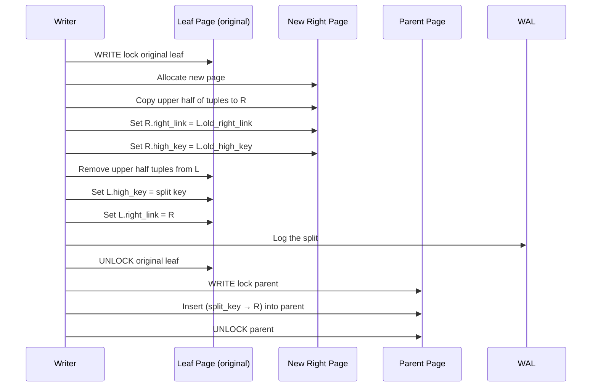

The critical insight: between unlocking the original leaf and inserting into the parent, there is a window where a reader searching for a key that was moved to the new right page will arrive at the original leaf. But the reader will see that the target key ≥ the new high-key, follow the right-link, and find the correct page. The right-link mechanism handles this race condition without additional locking.

#### B-Tree Deduplication (PostgreSQL 13+)

For non-unique indexes (and non-unique prefixes of unique indexes), multiple index tuples may share the same key value. Before PG 13, each such tuple was stored separately. Deduplication consolidates them: a single key value is stored once, followed by a **posting list** of heap TIDs.

For example, an index on `status` where thousands of rows have `status = 'active'`:

```
Before:  ('active', TID1), ('active', TID2), ('active', TID3), ...
After:   ('active', [TID1, TID2, TID3, ...])
```

This can reduce index size dramatically (2-3x is common for low-cardinality columns) and delays page splits. Fewer pages means fewer levels in the tree, which means fewer I/O operations during searches.

#### Index-Only Scans and the Visibility Map

An **index-only scan** retrieves data directly from the index without visiting the heap — a significant performance win. But there's a catch: the index doesn't contain MVCC visibility information. A tuple's index entry doesn't know whether the tuple is committed, aborted, or visible to the current transaction.

PostgreSQL solves this with the **Visibility Map (VM)**, a per-table bitmap where each bit corresponds to a heap page. A bit is set if *all* tuples on that page are visible to all transactions (i.e., fully committed and not deleted). During an index-only scan:

- If the VM bit for the target page is set → the tuple is definitely visible. No need to visit the heap.
- If the VM bit is not set → must visit the heap page to check visibility. This falls back to a regular index scan for that particular tuple.

The VM is maintained by VACUUM: after vacuuming a page and confirming all remaining tuples are universally visible, the VM bit is set. This creates a positive feedback loop: regular vacuuming improves index-only scan performance.

---

### 3.3 MVCC (Multi-Version Concurrency Control)

MVCC is the mechanism that allows PostgreSQL to achieve high concurrency without read-write conflicts. The fundamental principle is deceptively simple: **readers never block writers, and writers never block readers**. This is accomplished by keeping multiple physical versions of each row (tuple) and using visibility rules to determine which version each transaction should see.

#### Heap Tuple Header

Every heap tuple carries a header with MVCC metadata. Understanding these fields is key to understanding everything else about PostgreSQL's concurrency model:

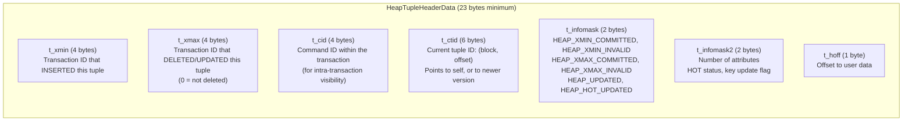

These few fields encode the entire lifecycle of a tuple:

| Event | What Happens to the Header |
|---|---|
| `INSERT` | `t_xmin` = inserting transaction's XID, `t_xmax` = 0, `t_ctid` = self |
| `DELETE` | `t_xmax` = deleting transaction's XID |
| `UPDATE` | Old tuple: `t_xmax` = updating XID, `t_ctid` → new tuple. New tuple: `t_xmin` = updating XID |
| `COMMIT` | `t_infomask` gets `XMIN_COMMITTED` or `XMAX_COMMITTED` hint bits |
| `ABORT` | `t_infomask` gets `XMIN_INVALID` or `XMAX_INVALID` hint bits |

#### Tuple Versioning in Practice

Let's trace through a concrete example:

```
Transaction 100: INSERT INTO users (name) VALUES ('Alice');
  → Creates tuple v1: xmin=100, xmax=0, ctid=(0,1)

Transaction 200: UPDATE users SET name='Bob' WHERE name='Alice';
  → Old tuple v1: xmin=100, xmax=200, ctid=(0,2)  -- now points to v2
  → New tuple v2: xmin=200, xmax=0, ctid=(0,2)     -- points to self

Transaction 300: DELETE FROM users WHERE name='Bob';
  → Tuple v2: xmin=200, xmax=300, ctid=(0,2)        -- marked deleted
```

At this point, the heap page contains *both* v1 and v2 (and v2 is marked as deleted). Neither has been physically removed. This is the fundamental trade-off of PostgreSQL's MVCC: append-only versioning is simple and enables non-blocking reads, but dead tuples accumulate and must be cleaned up by VACUUM.

#### Visibility Rules

The visibility check — "can transaction T see tuple version V?" — is the heart of MVCC. The core logic (simplified from `HeapTupleSatisfiesMVCC` in `src/backend/access/heap/heapam_visibility.c`):

```
VISIBLE if:
  (t_xmin is committed AND t_xmin was committed before T's snapshot)
  AND
  (t_xmax is 0 OR t_xmax is aborted OR t_xmax committed after T's snapshot)

NOT VISIBLE if:
  t_xmin is aborted
  OR t_xmin is still in progress (and is not T itself)
  OR (t_xmax is committed AND t_xmax was committed before T's snapshot)
```

In more human terms:
- A tuple is visible if it was inserted by a committed transaction that committed *before* your snapshot, and it hasn't been deleted by a committed transaction that committed *before* your snapshot.
- A tuple inserted by an uncommitted or aborted transaction is invisible.
- A tuple deleted by a transaction that committed before your snapshot is invisible (it's "gone" from your perspective).

#### Snapshot Isolation

A **snapshot** captures the state of the transaction universe at a particular moment. In PostgreSQL, a snapshot (`SnapshotData`) contains:

- **xmin**: The oldest still-active transaction ID at snapshot creation time. All transactions < xmin are guaranteed to have committed or aborted.
- **xmax**: One past the latest transaction ID at snapshot creation time. All transactions ≥ xmax started after the snapshot.
- **xip[] (transaction-in-progress array)**: The list of transaction IDs between xmin and xmax that were in-progress at snapshot time.

When checking visibility:
- If `t_xmin < snapshot.xmin` → the inserting transaction is definitely committed or aborted. Check CLOG if hint bits aren't set.
- If `t_xmin >= snapshot.xmax` → the inserting transaction started after the snapshot. Tuple is invisible.
- If `t_xmin` is in `snapshot.xip[]` → the inserting transaction was in-progress at snapshot time. Tuple is invisible (even if it committed since then).

This mechanism is what provides **Repeatable Read** and **Serializable** isolation levels. At `READ COMMITTED`, a new snapshot is taken for each SQL statement. At `REPEATABLE READ`, a single snapshot is used for the entire transaction.

#### CLOG (Commit Log)

The CLOG is a simple but essential data structure: a bitmap where each transaction ID gets 2 bits encoding its status:

| Bits | Status |
|---|---|
| 00 | IN_PROGRESS |
| 01 | COMMITTED |
| 10 | ABORTED |
| 11 | SUB-COMMITTED |

The CLOG is stored in `pg_xact/` (formerly `pg_clog/`) as a series of 256KB segment files. Each file holds status bits for ~2 billion transactions divided across segments. CLOG pages are cached in shared memory buffers (separate from the main buffer pool) for fast access.

When a visibility check needs to determine whether a transaction committed, it first checks the **hint bits** (`t_infomask`). If `HEAP_XMIN_COMMITTED` is set, there is no need to consult the CLOG — the answer is cached right in the tuple header. If hint bits are not set (the first check after the transaction committed), the backend consults the CLOG, then sets the hint bits for future checks. This "lazy" hint-bit setting is a performance optimization: the CLOG lookup happens only once per tuple per status transition.

#### The VACUUM Problem

Because PostgreSQL never modifies tuples in-place (updates create new versions, deletes mark tuples), dead tuple versions accumulate over time. Without cleanup:

1. **Table bloat**: Dead tuples waste space. A table that logically contains 1 million rows might physically contain 10 million tuple versions.
2. **Index bloat**: Indexes still point to dead tuples, wasting index space and slowing searches.
3. **Transaction ID wraparound**: PostgreSQL uses 32-bit transaction IDs (4 billion values). Once all IDs are consumed, the counter wraps around, and old "committed" transactions would suddenly appear to be "in the future" — corrupting visibility. VACUUM's freeze operation prevents this.

**VACUUM** (and the autovacuum daemon) performs several critical operations:

1. **Removes dead tuples**: Scans heap pages, identifies tuples that are not visible to *any* currently active transaction, and marks their space as reusable in the Free Space Map (FSM).
2. **Updates the Free Space Map**: Makes recovered space available for future inserts.
3. **Updates the Visibility Map**: Sets VM bits for pages where all remaining tuples are universally visible.
4. **Freezes old tuples**: Replaces `t_xmin` with `FrozenTransactionId` (a special value meaning "committed so long ago that the specific XID doesn't matter"), preventing transaction ID wraparound.
5. **Removes index entries**: Scans indexes to remove entries pointing to dead heap tuples.

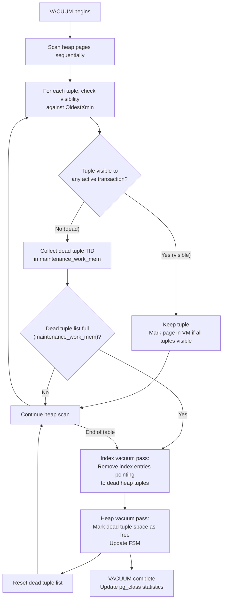

#### HOT (Heap Only Tuples)

The HOT optimization (introduced in PostgreSQL 8.3) addresses a significant overhead of updates: normally, every update creates a new tuple version, and *every index* on the table must be updated to point to the new version — even if the indexed columns didn't change. For a table with 10 indexes, updating a non-indexed column creates one new heap tuple and ten new index entries.

HOT avoids this when two conditions are met:
1. The updated columns are not in any index.
2. The new tuple version fits on the same heap page as the old version.

When both conditions are met, the update is done as a **HOT update**:
- The old tuple's `t_ctid` is set to point to the new tuple (on the same page).
- No index entries are created for the new version.
- The line pointer from the old item is marked as "redirecting" — it now points to the new tuple within the same page.
- Index scans follow the redirect chain: index → line pointer → redirect → new tuple.

HOT can dramatically reduce write amplification on tables with many indexes that are updated frequently on non-indexed columns. Setting a per-table `fillfactor` below 100 (e.g., 70) reserves space on each page for HOT updates, making it more likely that the new tuple fits on the same page.

#### Freeze: Preventing Transaction ID Wraparound

PostgreSQL uses 32-bit unsigned transaction IDs. With a circular comparison, any XID that is more than 2^31 (~2.1 billion) transactions "before" the current XID is considered to be in the past. If the system generates transactions faster than VACUUM can freeze old tuples, the oldest unfrozen XID gets closer to the "wraparound horizon," and PostgreSQL eventually enters a safety shutdown mode to prevent data corruption.

**Freezing** replaces a tuple's `t_xmin` with the special value `FrozenTransactionId` (2), which is always considered "in the past" regardless of the current XID. VACUUM freezes tuples whose `t_xmin` is older than `vacuum_freeze_min_age` transactions ago.

The `autovacuum_freeze_max_age` parameter (default: 200 million) triggers an aggressive anti-wraparound VACUUM if any table has unfrozen XIDs older than this threshold. This is a hard safety guarantee — PostgreSQL will forcefully vacuum tables even if autovacuum is otherwise disabled.

---

### 3.4 WAL (Write-Ahead Logging)

The Write-Ahead Log is PostgreSQL's durability mechanism. The fundamental rule is simple and inviolable:

> **A data page modification must not be flushed to disk until the WAL record describing that modification has been flushed to disk.**

This single rule is what makes crash recovery possible. If the system crashes, the data files may be in an inconsistent state (some pages written, some not), but the WAL contains a complete, ordered record of every change. Recovery replays the WAL from the last checkpoint, bringing the data files to a consistent state.

#### WAL Record Structure

Each WAL record contains:

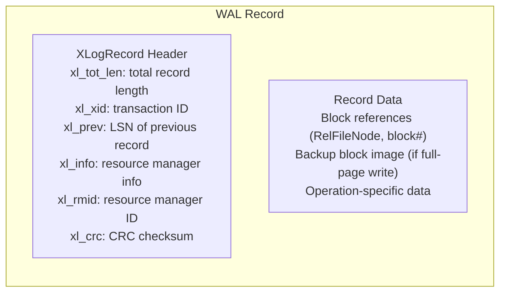

- **LSN (Log Sequence Number)**: A 64-bit value representing the byte offset within the WAL stream. Every WAL record has a unique, monotonically increasing LSN. The LSN is used everywhere: each data page stores the LSN of the last WAL record that modified it (`pd_lsn`), allowing recovery to determine whether a page needs replay.
- **Resource Manager ID**: Identifies which subsystem generated the record (heap, btree, transaction, etc.). Each resource manager implements its own redo/undo functions.
- **CRC checksum**: Protects against corruption of the WAL itself.

#### Full-Page Writes (FPW)

After a checkpoint, the first time a page is modified, the *entire 8KB page image* is included in the WAL record. This is called a **full-page write** (or backup block).

Why is this necessary? Consider the **torn page problem**: if the operating system is in the middle of writing an 8KB page to disk (which may require multiple filesystem blocks or disk sectors), and the system crashes, the on-disk page may contain a mix of old and new data. This is a torn page — partially written, internally inconsistent.

Without full-page writes, WAL replay would apply redo operations to a torn page, producing garbage. With full-page writes, the first modification after a checkpoint stores the complete page image. During recovery, instead of applying incremental changes to a potentially torn page, PostgreSQL replaces the entire page with the backup image from the WAL, then applies subsequent incremental changes on top. This guarantees the page is internally consistent regardless of when the crash occurred.

The trade-off is **write amplification**: full-page writes can triple the amount of WAL generated. PostgreSQL mitigates this with:
- WAL compression (`wal_compression = on`): Compresses full-page images in WAL records.
- Spread checkpoints (`checkpoint_completion_target = 0.9`): By spreading checkpoint I/O over a longer period, pages are more likely to be modified multiple times between checkpoints, so only the first modification incurs the full-page write.

#### WAL Segment Files

WAL is stored as a sequence of 16MB files (configurable with `--wal-segsize` at initdb time) in `pg_wal/`:

```
pg_wal/
├── 000000010000000000000001
├── 000000010000000000000002
├── 000000010000000000000003
├── ...
```

The filename encodes the timeline ID and segment number. Files are written sequentially and, after a checkpoint, old segments are either recycled (renamed for reuse) or archived (for point-in-time recovery). Recycling avoids the overhead of creating and deleting files.

The `max_wal_size` parameter (default 1GB) controls how much WAL accumulates before triggering a checkpoint. The `min_wal_size` controls how many recycled segments are kept pre-allocated.

#### Synchronous vs. Asynchronous Commit

By default (`synchronous_commit = on`), a `COMMIT` does not return to the client until the WAL record for the commit is flushed to disk. This guarantees durability: once the client sees the commit acknowledgment, the transaction is durable even if the server immediately crashes.

**Asynchronous commit** (`synchronous_commit = off`) allows COMMIT to return before the WAL flush. The WAL writer will flush the record within `wal_writer_delay` (default 200ms). If the server crashes during this window, the transaction may be lost — but the database remains consistent (the transaction is simply rolled back during recovery, as if it never committed).

This is a per-transaction knob — you can enable async commit for low-value operations (logging, analytics) while keeping sync commit for financial transactions:

```sql
-- For a specific transaction:
SET LOCAL synchronous_commit = off;
INSERT INTO logs (msg) VALUES ('user clicked button');
COMMIT;  -- returns immediately, WAL flushed later
```

The throughput improvement can be dramatic: sync commit is limited by disk flush latency (~1-10ms per commit), so a single connection can do at most 100-1000 commits/second. Async commit removes this bottleneck.

#### Crash Recovery Process

Recovery is conceptually simple:

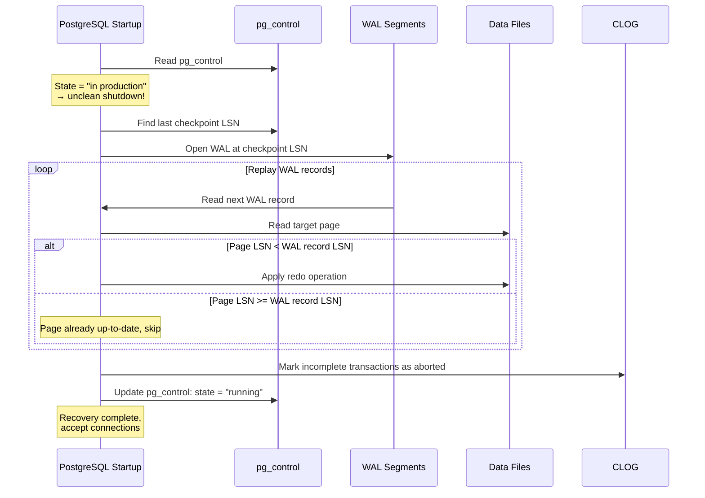

Key detail: the comparison of page LSN to WAL record LSN is what makes recovery idempotent. If recovery is interrupted and restarted, it will skip records that have already been applied. This means recovery can be safely interrupted and restarted without corrupting data.

#### WAL Archiving and Point-in-Time Recovery (PITR)

WAL archiving copies completed WAL segments to a separate location (local directory, NFS, S3, etc.) using a configurable `archive_command`. Combined with a base backup, this enables **Point-in-Time Recovery** — restoring the database to any moment in its history:

1. Restore a base backup.
2. Replay archived WAL segments up to the target time.
3. The database is now in the exact state it was at that moment.

This is PostgreSQL's primary mechanism for disaster recovery and is the foundation of all streaming replication.

---

### 3.5 Query Planner/Optimizer

PostgreSQL's query planner is a **cost-based optimizer**: it generates multiple possible execution plans for a query, estimates the cost of each (in abstract units roughly proportional to disk I/O time), and chooses the cheapest plan. This is in contrast to **rule-based optimizers** that apply fixed transformation rules regardless of data characteristics.

#### The Cost Model

Every plan node has two cost components:

- **Startup cost**: The cost before the first tuple can be returned (e.g., building a hash table for a hash join, sorting for a merge join).
- **Total cost**: The cost to return all tuples.

These costs are estimated using configurable parameters:

| Parameter | Default | Meaning |
|---|---|---|
| `seq_page_cost` | 1.0 | Cost to read a page sequentially |
| `random_page_cost` | 4.0 | Cost to read a random page (seek + read) |
| `cpu_tuple_cost` | 0.01 | Cost to process one tuple |
| `cpu_index_tuple_cost` | 0.005 | Cost to process one index entry |
| `cpu_operator_cost` | 0.0025 | Cost to evaluate one operator/function |
| `effective_cache_size` | 4GB | Planner's estimate of available cache (OS + PG) |

The 4:1 ratio of `random_page_cost` to `seq_page_cost` reflects that random I/O (index scans) is ~4x slower than sequential I/O on spinning disks. For SSDs, lowering `random_page_cost` to 1.1-1.5 is appropriate because random and sequential reads are nearly equivalent.

The `effective_cache_size` parameter doesn't allocate any memory — it's purely a hint to the planner about how much data is likely to be cached (by the OS page cache + shared_buffers). A higher value makes the planner more optimistic about index scans (since needed pages are likely cached), while a lower value biases toward sequential scans.

#### Statistics Collection

The planner's cost estimates are only as good as its knowledge of the data. PostgreSQL maintains per-column statistics in `pg_statistic` (exposed through the `pg_stats` view), updated by the `ANALYZE` command (and automatically by autovacuum).

For each column, statistics include:

- **n_distinct**: Estimated number of distinct values. -1 means unique (= number of rows).
- **null_frac**: Fraction of NULL values.
- **avg_width**: Average width in bytes.
- **most_common_vals (MCVs)**: The N most common values (N = `default_statistics_target`, default 100).
- **most_common_freqs**: The frequency of each MCV.
- **histogram_bounds**: Values dividing the non-MCV values into equal-population buckets. Used for range query selectivity estimation.
- **correlation**: Statistical correlation between physical row order and logical column value order. High correlation (close to ±1) means an index scan can read pages roughly sequentially; low correlation means random I/O.

#### Selectivity Estimation

The planner estimates the **selectivity** of each WHERE clause predicate — what fraction of rows will pass the filter. This directly determines estimated row counts, which cascade through the entire plan.

**For equality predicates** (`WHERE city = 'NYC'`):
1. Check MCVs: if 'NYC' is in the MCV list, its frequency is the selectivity.
2. If not in MCVs, assume uniform distribution among non-MCV values: `(1 - sum_of_mcv_freqs) / (n_distinct - num_mcvs)`.

**For range predicates** (`WHERE price > 100`):
1. Check MCVs: sum frequencies of MCVs satisfying the predicate.
2. Use histogram: find the bucket containing 100, linearly interpolate within the bucket.
3. Combine MCV and histogram estimates.

**For JOIN selectivity**:
The planner estimates join selectivity using statistics from both sides. For an equi-join on `orders.customer_id = customers.id`, the selectivity is approximately `1 / max(n_distinct_left, n_distinct_right)`.

Inaccurate statistics lead to bad plans. The most common performance disaster is the planner vastly underestimating the number of rows (e.g., estimating 10 rows when there are 100,000), choosing a nested loop join that should have been a hash join. Running `ANALYZE` after significant data changes is critical.

#### Join Strategies

PostgreSQL implements three physical join algorithms, each optimal for different scenarios:

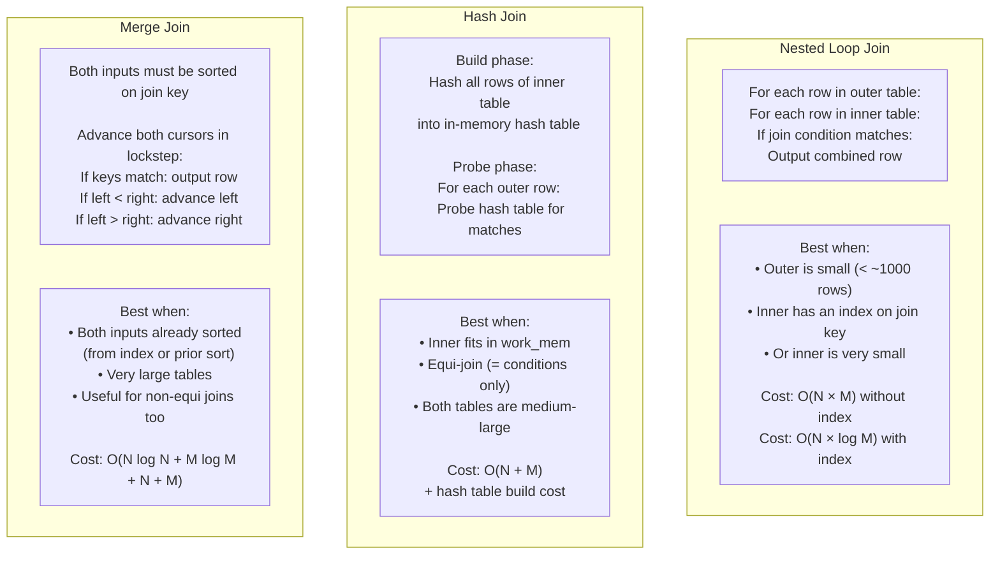

The planner considers all three strategies (and their variants — e.g., nested loop with inner index scan, nested loop with materialized inner) and chooses based on cost estimates.

A critical factor is `work_mem` (default 4MB): this controls how much memory a hash join can use for its hash table and how much memory a sort can use. If the hash table exceeds `work_mem`, the hash join spills to disk (batched hash join), dramatically slowing it down. Increasing `work_mem` can cause the planner to prefer hash joins over nested loops for medium-size tables.

#### Genetic Query Optimizer (GEQO)

For queries joining many tables, the number of possible join orderings grows factorially: 5 tables = 120 orderings, 10 tables = 3.6 million, 15 tables = 1.3 trillion. The standard dynamic programming approach (used for ≤ `geqo_threshold` tables, default 12) considers all orderings but becomes infeasible beyond ~12-14 tables.

For queries with more tables, PostgreSQL switches to the **Genetic Query Optimizer (GEQO)**, which uses a genetic algorithm to search the space of join orderings:

1. Generate a random population of join orderings.
2. Evaluate the cost of each ordering.
3. Select the best orderings, combine them (crossover), and introduce random mutations.
4. Repeat for several generations.
5. Return the best ordering found.

GEQO doesn't guarantee finding the optimal plan, but it finds a good plan in reasonable time. The trade-off is explicit: for star-schema queries with 20+ tables, a slightly suboptimal plan found in 100ms is vastly preferable to the optimal plan found in 10 hours.

---

## 4. Design Trade-Offs

### Append-Only Storage vs. In-Place Updates

| | PostgreSQL (Append-Only) | InnoDB (In-Place + Undo Log) |
|---|---|---|
| **Update mechanism** | Create new tuple, mark old as dead | Modify in place, save old version in undo |
| **MVCC complexity** | Simpler: each version is a complete tuple | More complex: reconstruct old versions from undo |
| **Read performance** | Old versions may be on same page (good for locality) | Must follow undo chain (potentially bad for locality) |
| **Space overhead** | Dead tuples accumulate → table bloat | Undo log grows, but data files stay compact |
| **Maintenance** | Requires VACUUM (additional CPU + I/O) | Undo purge is simpler (FIFO) |
| **Index impact** | All indexes must be updated for every tuple version | Only modified indexes need updates (+ clustered index pointer) |

PostgreSQL's approach is conceptually simpler — a tuple is a self-contained object with its own visibility information — but the operational burden of VACUUM is significant. In production, improperly tuned VACUUM is one of the most common causes of performance degradation. InnoDB's approach avoids the need for a VACUUM-like process but requires managing a separate undo tablespace and can suffer from "history list length" growth under heavy update workloads.

### Process-Per-Connection vs. Thread-Per-Connection

| | PostgreSQL (Processes) | MySQL/Oracle (Threads) |
|---|---|---|
| **Isolation** | Full process isolation; one crash doesn't affect others | Thread crash can corrupt entire process |
| **Memory overhead** | Higher: each process has its own address space | Lower: shared address space |
| **Context switch cost** | Higher: full process context switch | Lower: lightweight thread switch |
| **Scalability limit** | Typically maxes out at ~500-1000 connections without pooling | Can handle more connections natively |
| **Memory sharing** | Explicit: shared memory region | Implicit: shared address space |
| **Connection pooling** | Practically required (PgBouncer, Pgpool) | Less critical but still recommended |

PostgreSQL's process model provides excellent stability — a segfault in one backend cannot corrupt another backend's memory. But it consumes more resources per connection. In practice, this means PostgreSQL deployments almost always use a connection pooler (PgBouncer, PgCat) in front of the database, limiting active connections to a fraction of total clients.

The PostgreSQL community has been actively working on moving to a threaded architecture. Starting with PostgreSQL 17, significant refactoring work has been underway to replace process-local global variables with thread-safe alternatives. This is a multi-year effort, but when complete, it will dramatically reduce per-connection memory overhead and improve scalability.

### Clock-Sweep vs. LRU

| | Clock-Sweep (PostgreSQL) | True LRU |
|---|---|---|
| **Concurrency overhead** | Minimal: atomic increment of usage_count | High: linked-list manipulation under lock |
| **Cache behavior** | Approximate LRU | Exact LRU |
| **Scan resistance** | Good with buffer ring strategy | Poor without additional mechanisms (e.g., 2Q) |
| **Implementation complexity** | Simple: single sweep pointer | More complex: doubly-linked list + hash |
| **Adaptability** | Fixed usage_count cap (5) | Naturally adapts to access patterns |

Clock-sweep is a pragmatic choice. In benchmarks, it performs within a few percent of true LRU for typical database workloads while requiring dramatically less synchronization overhead. The buffer ring strategy handles the pathological case (full-table scans) that would otherwise thrash an LRU cache.

### Lehman-Yao B-Tree vs. Standard B-Tree with Locking

| | Lehman-Yao (PostgreSQL) | Standard B-Tree with Lock Coupling |
|---|---|---|
| **Read locking** | No locks during tree traversal (follow right-links) | Lock coupling: hold child lock before releasing parent |
| **Write locking** | Lock only leaf + parent during split | May need to lock multiple levels |
| **Concurrent reads during splits** | Safe: right-link handles race | Blocked: must wait for split to complete |
| **Complexity** | Higher: right-links, high-keys, moveright logic | Lower: straightforward locking |
| **Dead page cleanup** | Complex: half-dead pages, recycling protocol | Simpler: immediate cleanup possible |

The Lehman-Yao variant is more complex to implement but provides significantly better concurrent read performance, which matters enormously for databases where read-heavy workloads dominate.

### WAL Full-Page Writes: Durability vs. Write Amplification

| | With Full-Page Writes | Without Full-Page Writes |
|---|---|---|
| **Torn page protection** | Complete: full page image in WAL | None: torn pages corrupt data |
| **WAL volume** | 2-3x more WAL generated | Minimal WAL |
| **Recovery safety** | Idempotent recovery guaranteed | Recovery may produce corrupt pages |
| **Performance impact** | Higher I/O, especially right after checkpoint | Lower I/O |
| **Mitigation** | WAL compression, spread checkpoints | Use checksums + detect torn pages (not sufficient) |

Full-page writes are a conservative but correct choice. The write amplification is real — it can double WAL volume — but the alternative is risking silent data corruption. PostgreSQL's engineering philosophy ("correctness first") makes this an easy decision.

### Cost-Based Optimizer vs. Rule-Based Optimizer

| | Cost-Based (PostgreSQL) | Rule-Based (early Oracle, some systems) |
|---|---|---|
| **Plan quality** | Data-dependent: great with good statistics | Fixed rules regardless of data |
| **Index usage** | Chosen when cost-effective | Always use index if available (often wrong) |
| **Predictability** | Less predictable: plan changes with data | More predictable: same query = same plan |
| **Statistics dependency** | Critical: stale stats = bad plans | None |
| **Maintenance** | Must run ANALYZE regularly | No maintenance |

A cost-based optimizer can choose dramatically better plans (e.g., sequential scan of a 100-row table instead of an index scan), but it depends entirely on accurate statistics. The classic PostgreSQL performance debugging session starts with: "When did you last run ANALYZE?"

---

## 5. Experiments / Observations

> **Note**: The following experiments are designed to be run on a PostgreSQL 15+ installation. They use extensions (`pg_buffercache`, `pageinspect`) that may need to be installed separately.

### Experiment 1: Buffer Manager in Action

**Objective**: Observe the shared buffer pool contents and measure cache hit ratios.

#### Setup

```sql
-- Enable the pg_buffercache extension
CREATE EXTENSION IF NOT EXISTS pg_buffercache;

-- Create a test table
CREATE TABLE buffer_test (
    id SERIAL PRIMARY KEY,
    data TEXT,
    padding CHAR(200)  -- make rows large enough to span multiple pages
);

-- Insert enough data to span many pages
INSERT INTO buffer_test (data, padding)
SELECT
    'record_' || g,
    repeat('x', 200)
FROM generate_series(1, 100000) g;

-- Create an index
CREATE INDEX idx_buffer_test_data ON buffer_test(data);
```

#### Observing Buffer Pool Contents

```sql
-- See which relations occupy the most buffers
SELECT
    c.relname,
    c.relkind,
    count(*) AS buffers,
    pg_size_pretty(count(*) * 8192) AS buffer_size,
    round(100.0 * count(*) / (SELECT setting::int FROM pg_settings WHERE name = 'shared_buffers'), 2) AS pct_of_pool
FROM pg_buffercache b
JOIN pg_class c ON b.relfilenode = c.relfilenode
WHERE b.reldatabase = (SELECT oid FROM pg_database WHERE datname = current_database())
GROUP BY c.relname, c.relkind
ORDER BY buffers DESC
LIMIT 15;
```

**Expected output** (example):

```
     relname       | relkind | buffers | buffer_size | pct_of_pool
-------------------+---------+---------+-------------+-------------
 buffer_test       | r       |    3572 | 27 MB       |        2.18
 idx_buffer_test_data | i    |     821 | 6416 kB     |        0.50
 pg_attribute      | r       |     312 | 2440 kB     |        0.19
 pg_class          | r       |      48 | 384 kB      |        0.03
 ...
```

#### Cache Hit Ratio

```sql
-- Global buffer cache hit ratio
SELECT
    sum(blks_hit) AS total_hits,
    sum(blks_read) AS total_disk_reads,
    round(
        sum(blks_hit)::numeric /
        nullif(sum(blks_hit) + sum(blks_read), 0) * 100, 2
    ) AS hit_ratio_pct
FROM pg_stat_database
WHERE datname = current_database();
```

**Expected output:**

```
 total_hits | total_disk_reads | hit_ratio_pct
------------+------------------+---------------
    4582917 |            15342 |         99.67
```

A healthy production database should maintain a cache hit ratio above 99%. Ratios below 95% indicate that `shared_buffers` may be undersized or that the workload accesses more data than fits in the buffer pool.

#### Observing Buffer Usage Counts

```sql
-- Distribution of usage_count values in the buffer pool
-- Shows how the clock-sweep algorithm's usage counter distributes
SELECT
    usagecount,
    count(*) AS num_buffers,
    round(100.0 * count(*) / sum(count(*)) OVER (), 2) AS pct
FROM pg_buffercache
GROUP BY usagecount
ORDER BY usagecount;
```

**Expected output:**

```
 usagecount | num_buffers |  pct
------------+-------------+-------
          0 |       89421 | 54.57
          1 |       28312 | 17.28
          2 |       15201 |  9.28
          3 |       12885 |  7.86
          4 |        8102 |  4.94
          5 |        9943 |  6.07
            |           0 |  0.00
```

Buffers with `usagecount = 5` are the "hottest" — system catalog pages, frequently accessed indexes. Buffers with `usagecount = 0` are prime candidates for eviction by the clock-sweep.

---

### Experiment 2: EXPLAIN ANALYZE on Multi-Table Join

**Objective**: Observe how the query planner chooses join strategies, and the impact of statistics on plan quality.

#### Setup

```sql
-- Create tables simulating an e-commerce database
CREATE TABLE customers (
    id SERIAL PRIMARY KEY,
    name TEXT NOT NULL,
    city TEXT NOT NULL,
    created_at TIMESTAMP DEFAULT now()
);

CREATE TABLE orders (
    id SERIAL PRIMARY KEY,
    customer_id INT REFERENCES customers(id),
    order_date DATE NOT NULL,
    total_amount NUMERIC(10,2)
);

CREATE TABLE order_items (
    id SERIAL PRIMARY KEY,
    order_id INT REFERENCES orders(id),
    product_name TEXT NOT NULL,
    quantity INT,
    unit_price NUMERIC(10,2)
);

CREATE TABLE products (
    id SERIAL PRIMARY KEY,
    name TEXT NOT NULL,
    category TEXT NOT NULL,
    price NUMERIC(10,2)
);

-- Insert data with skewed distributions
INSERT INTO customers (name, city)
SELECT
    'Customer_' || g,
    CASE
        WHEN g % 100 = 0 THEN 'NYC'       -- 1% in NYC
        WHEN g % 10 = 0 THEN 'LA'          -- 10% in LA
        ELSE 'Other_' || (g % 50)          -- rest distributed
    END
FROM generate_series(1, 100000) g;

INSERT INTO orders (customer_id, order_date, total_amount)
SELECT
    (random() * 99999 + 1)::int,
    '2024-01-01'::date + (random() * 365)::int,
    (random() * 500 + 10)::numeric(10,2)
FROM generate_series(1, 500000) g;

INSERT INTO order_items (order_id, product_name, quantity, unit_price)
SELECT
    (random() * 499999 + 1)::int,
    'Product_' || (random() * 1000)::int,
    (random() * 10 + 1)::int,
    (random() * 100 + 1)::numeric(10,2)
FROM generate_series(1, 2000000) g;

INSERT INTO products (name, category, price)
SELECT
    'Product_' || g,
    CASE g % 5
        WHEN 0 THEN 'Electronics'
        WHEN 1 THEN 'Books'
        WHEN 2 THEN 'Clothing'
        WHEN 3 THEN 'Food'
        WHEN 4 THEN 'Home'
    END,
    (random() * 200 + 5)::numeric(10,2)
FROM generate_series(1, 1000) g;

-- Run ANALYZE to ensure statistics are up to date
ANALYZE;
```

#### Multi-Table Join with EXPLAIN ANALYZE

```sql
EXPLAIN (ANALYZE, BUFFERS, FORMAT TEXT)
SELECT
    c.city,
    count(DISTINCT o.id) AS num_orders,
    sum(oi.quantity * oi.unit_price) AS total_revenue,
    avg(o.total_amount) AS avg_order_value
FROM customers c
JOIN orders o ON o.customer_id = c.id
JOIN order_items oi ON oi.order_id = o.id
WHERE c.city = 'NYC'
  AND o.order_date >= '2024-06-01'
  AND o.order_date < '2024-07-01'
GROUP BY c.city;
```

**Expected output (representative):**

```
                                                           QUERY PLAN
---------------------------------------------------------------------------------------------------------------------------------
 GroupAggregate  (cost=45832.17..45832.67 rows=1 width=72) (actual time=312.456..312.458 rows=1 loops=1)
   Group Key: c.city
   Buffers: shared hit=28451 read=3217
   ->  Sort  (cost=45832.17..45832.34 rows=68 width=52) (actual time=298.112..304.891 rows=19823 loops=1)
         Sort Key: c.city
         Sort Method: quicksort  Memory: 2458kB
         Buffers: shared hit=28451 read=3217
         ->  Hash Join  (cost=12456.23..45830.12 rows=68 width=52) (actual time=78.234..289.112 rows=19823 loops=1)
               Hash Cond: (oi.order_id = o.id)
               Buffers: shared hit=28451 read=3217
               ->  Seq Scan on order_items oi  (cost=0.00..30894.00 rows=2000000 width=14) (actual time=0.012..98.234 rows=2000000 loops=1)
                     Buffers: shared hit=15894
               ->  Hash  (cost=12443.12..12443.12 rows=1049 width=16) (actual time=67.891..67.893 rows=421 loops=1)
                     Buckets: 2048  Batches: 1  Memory Usage: 38kB
                     Buffers: shared hit=12557 read=3217
                     ->  Hash Join  (cost=1215.67..12443.12 rows=1049 width=16) (actual time=12.345..67.234 rows=421 loops=1)
                           Hash Cond: (o.customer_id = c.id)
                           Buffers: shared hit=12557 read=3217
                           ->  Seq Scan on orders o  (cost=0.00..10789.00 rows=41095 width=16) (actual time=0.023..45.678 rows=41523 loops=1)
                                 Filter: ((order_date >= '2024-06-01'::date) AND (order_date < '2024-07-01'::date))
                                 Rows Removed by Filter: 458477
                                 Buffers: shared hit=5789 read=3217
                           ->  Hash  (cost=1203.00..1203.00 rows=1014 width=4) (actual time=5.234..5.236 rows=1000 loops=1)
                                 Buckets: 2048  Batches: 1  Memory Usage: 51kB
                                 Buffers: shared hit=6768
                                 ->  Seq Scan on customers c  (cost=0.00..1203.00 rows=1014 width=4) (actual time=0.015..4.567 rows=1000 loops=1)
                                       Filter: (city = 'NYC'::text)
                                       Rows Removed by Filter: 99000
                                       Buffers: shared hit=6768
 Planning Time: 1.234 ms
 Execution Time: 312.678 ms
```

#### Analysis

Key observations from this plan:

1. **Join strategy**: The planner chose **Hash Joins** for both joins. For the `customers → orders` join, it hashes the smaller result (1000 NYC customers) and probes with the filtered orders. This makes sense because the filtered customer set is small and fits easily in `work_mem`.

2. **Row estimates vs. actuals**: Compare `rows=1014` (estimated) vs `rows=1000` (actual) for the customers filter. Close estimates indicate good statistics. Large discrepancies (>10x) would signal a need for `ANALYZE`.

3. **Buffer usage**: `shared hit=28451 read=3217` tells us that ~90% of pages were found in the buffer pool (hits) and ~10% had to be read from disk. The `read` count would decrease on subsequent runs as pages are cached.

4. **Sequential scan on order_items**: Even though we only need a subset, the planner chose a sequential scan of the full 2M-row `order_items` table. This is because there's no index on `order_id`, and scanning 2M rows sequentially is cheaper than a random-access index lookup. Adding an index on `order_items(order_id)` would likely change this to a nested-loop with index scan.

#### Impact of ANALYZE

```sql
-- Delete the statistics and observe the impact
DELETE FROM pg_statistic
WHERE starelid = 'customers'::regclass;

-- Now the same query without statistics:
EXPLAIN (ANALYZE, BUFFERS)
SELECT count(*) FROM customers WHERE city = 'NYC';

-- Re-analyze and observe improved estimates
ANALYZE customers;
```

Without statistics, the planner falls back to default selectivity estimates (typically 0.5% for equality predicates on text columns), which may be dramatically wrong. After `ANALYZE`, the planner uses the actual value distribution from the MCV list.

---

### Experiment 3: MVCC Visibility

**Objective**: Directly observe tuple versioning, xmin/xmax values, and VACUUM behavior.

#### Setup

```sql
CREATE EXTENSION IF NOT EXISTS pageinspect;

CREATE TABLE mvcc_demo (
    id INT PRIMARY KEY,
    value TEXT
);

INSERT INTO mvcc_demo VALUES (1, 'original');
```

#### Observing Tuple Headers

```sql
-- View the raw tuple header on page 0
SELECT
    lp,
    t_xmin,
    t_xmax,
    t_ctid,
    t_infomask::bit(16) AS infomask_bits,
    CASE WHEN (t_infomask & 256) > 0 THEN 'XMIN_COMMITTED' ELSE '' END AS xmin_status,
    CASE WHEN (t_infomask & 1024) > 0 THEN 'XMAX_COMMITTED' ELSE '' END AS xmax_status,
    t_data
FROM heap_page_items(get_raw_page('mvcc_demo', 0));
```

**Expected output after INSERT + COMMIT:**

```
 lp | t_xmin | t_xmax | t_ctid | infomask_bits    | xmin_status     | xmax_status | t_data
----+--------+--------+--------+------------------+-----------------+-------------+--------
  1 |    735 |      0 | (0,1)  | 0000100100000010 | XMIN_COMMITTED  |             | \x...
```

- `t_xmin=735`: The transaction that inserted this tuple.
- `t_xmax=0`: No transaction has deleted it.
- `t_ctid=(0,1)`: Points to itself (page 0, item 1). No newer version exists.
- `XMIN_COMMITTED`: The inserting transaction has committed.

#### Observing an UPDATE

```sql
-- Open transaction 1 (in one session)
BEGIN;
UPDATE mvcc_demo SET value = 'updated' WHERE id = 1;
-- Don't commit yet!

-- In another session, observe the page:
SELECT lp, t_xmin, t_xmax, t_ctid,
    CASE WHEN (t_infomask & 256) > 0 THEN 'XMIN_COMMITTED' ELSE '' END AS xmin_hint,
    CASE WHEN (t_infomask & 1024) > 0 THEN 'XMAX_COMMITTED' ELSE '' END AS xmax_hint
FROM heap_page_items(get_raw_page('mvcc_demo', 0));
```

**Expected output during uncommitted UPDATE:**

```
 lp | t_xmin | t_xmax | t_ctid | xmin_hint       | xmax_hint
----+--------+--------+--------+-----------------+-----------
  1 |    735 |    742 | (0,2)  | XMIN_COMMITTED  |           -- old version, xmax set to updating XID
  2 |    742 |      0 | (0,2)  |                 |           -- new version, no hint bits yet
```

Now we can see both versions on the same page:
- Tuple at `lp=1`: The original, with `t_xmax=742` (the updating transaction) and `t_ctid=(0,2)` pointing to the new version.
- Tuple at `lp=2`: The new version, with `t_xmin=742` and `t_ctid` pointing to itself.

```sql
-- Now commit transaction 1
COMMIT;

-- Observe hint bits after another access
SELECT * FROM mvcc_demo;  -- triggers hint bit setting
SELECT lp, t_xmin, t_xmax, t_ctid,
    CASE WHEN (t_infomask & 256) > 0 THEN 'XMIN_COMMITTED' ELSE '' END AS xmin_hint,
    CASE WHEN (t_infomask & 1024) > 0 THEN 'XMAX_COMMITTED' ELSE '' END AS xmax_hint
FROM heap_page_items(get_raw_page('mvcc_demo', 0));
```

**Expected output after COMMIT:**

```
 lp | t_xmin | t_xmax | t_ctid | xmin_hint       | xmax_hint
----+--------+--------+--------+-----------------+-----------
  1 |    735 |    742 | (0,2)  | XMIN_COMMITTED  | XMAX_COMMITTED  -- dead tuple
  2 |    742 |      0 | (0,2)  | XMIN_COMMITTED  |                 -- live tuple
```

Both hint bits are now set. Tuple `lp=1` is a dead tuple — it was the live version before the update, now superseded by `lp=2`.

#### VACUUM Reclaiming Dead Tuples

```sql
-- Check dead tuple count before VACUUM
SELECT n_dead_tup, n_live_tup, last_vacuum
FROM pg_stat_user_tables
WHERE relname = 'mvcc_demo';

-- Run VACUUM
VACUUM VERBOSE mvcc_demo;

-- Check the page again
SELECT lp, lp_flags, t_xmin, t_xmax, t_ctid
FROM heap_page_items(get_raw_page('mvcc_demo', 0));
```

**Expected output after VACUUM:**

```
 lp | lp_flags | t_xmin | t_xmax | t_ctid
----+----------+--------+--------+--------
  1 |        0 |        |        |         -- dead tuple removed, lp_flags=0 (unused)
  2 |        1 |    742 |      0 | (0,2)   -- live tuple remains
```

The dead tuple at `lp=1` has been reclaimed. Its line pointer is now marked as unused (`lp_flags=0`), and the space is available for future inserts via the Free Space Map.

---

### Experiment 4: WAL Generation

**Objective**: Compare WAL generation between bulk and individual inserts, demonstrating the impact of commit frequency on WAL volume.

#### Setup

```sql
CREATE TABLE wal_test (
    id INT,
    data TEXT
);
```

#### Measuring WAL for Bulk Insert

```sql
-- Record starting WAL position
SELECT pg_current_wal_lsn() AS start_lsn;

-- Bulk insert: single transaction, 100K rows
INSERT INTO wal_test
SELECT g, repeat('data', 25)
FROM generate_series(1, 100000) g;

-- Record ending WAL position
SELECT pg_current_wal_lsn() AS end_lsn;

-- Calculate WAL generated
SELECT
    pg_size_pretty(
        pg_wal_lsn_diff(
            pg_current_wal_lsn(),
            '<start_lsn_value>'::pg_lsn
        )
    ) AS wal_generated;
```

**Expected**: ~30-50 MB of WAL for 100K rows with 100-byte data each.

#### Measuring WAL for Individual Inserts

```sql
-- Record starting position
SELECT pg_current_wal_lsn() AS start_lsn;

-- Individual inserts: 100K separate transactions
DO $$
BEGIN
    FOR i IN 1..100000 LOOP
        INSERT INTO wal_test VALUES (i, repeat('data', 25));
        -- Each INSERT auto-commits
    END LOOP;
END $$;

-- This is a single transaction containing 100K statements.
-- For true individual transactions, use a script:
-- for i in $(seq 1 100000); do
--   psql -c "INSERT INTO wal_test VALUES ($i, repeat('data', 25));"
-- done

SELECT pg_current_wal_lsn() AS end_lsn;
```

If run as separate transactions, the WAL generated will be significantly higher because each commit requires its own COMMIT WAL record, and full-page writes may be triggered more frequently.

#### WAL Directory Analysis

```sql
-- Check WAL segment files
SELECT * FROM pg_ls_waldir() ORDER BY modification DESC LIMIT 10;

-- Check WAL statistics (PG 14+)
SELECT
    wal_records,
    wal_fpi,  -- full-page images
    pg_size_pretty(wal_bytes) AS wal_volume,
    wal_buffers_full,
    wal_write,
    wal_sync
FROM pg_stat_wal;
```

**Expected output:**

```
 wal_records | wal_fpi | wal_volume | wal_buffers_full | wal_write | wal_sync
-------------+---------+------------+------------------+-----------+----------
      456789 |    3421 | 156 MB     |               12 |       892 |      891
```

`wal_fpi` (full-page images) shows how many WAL records included a full 8KB page backup — these are the first modifications to a page after a checkpoint. High `wal_fpi` relative to `wal_records` indicates frequent checkpoints or a workload touching many pages.

---

### Experiment 5: Index Behavior

**Objective**: Examine the internal structure of a B-tree index using `pageinspect` and observe page splits.

#### Setup

```sql
CREATE EXTENSION IF NOT EXISTS pageinspect;

CREATE TABLE btree_demo (
    id INT PRIMARY KEY
);

-- Insert ordered data
INSERT INTO btree_demo SELECT generate_series(1, 1000);
```

#### Examining Index Meta Page

```sql
-- The meta page (page 0) of the B-tree
SELECT * FROM bt_metap('btree_demo_pkey');
```

**Expected output:**

```
 magic  | version | root | level | fastroot | fastlevel | last_cleanup_num_delpages | last_cleanup_num_tuples | allequalimage
--------+---------+------+-------+----------+-----------+---------------------------+-------------------------+---------------
 340322 |       4 |    3 |     1 |        3 |         1 |                         0 |                      -1 | t
```

- `root=3`: The root page is page number 3.
- `level=1`: The tree has 2 levels (level 0 = leaves, level 1 = root). With 1000 entries, this makes sense — each leaf page holds ~367 entries (for INT keys), so ~3 leaf pages + 1 root.
- `allequalimage=t`: Deduplication is possible for this index.

#### Examining Index Page Statistics

```sql
-- Statistics for each B-tree page
SELECT *
FROM bt_page_stats('btree_demo_pkey', 1);  -- page 1 (first leaf)
```

**Expected output:**

```
 blkno | type | live_items | dead_items | avg_item_size | page_size | free_size | btpo_prev | btpo_next | btpo_level | btpo_flags
-------+------+------------+------------+---------------+-----------+-----------+-----------+-----------+------------+------------
     1 | l    |        367 |          0 |            16 |      8192 |       808 |         0 |         2 |          0 |          1
```

- `type=l`: Leaf page.
- `live_items=367`: 367 index tuples on this page.
- `btpo_next=2`: Right sibling is page 2 (the Lehman-Yao right-link).
- `btpo_level=0`: Leaf level.

#### Examining Index Tuples

```sql
-- View actual index entries on a leaf page
SELECT itemoffset, ctid, itemlen, data
FROM bt_page_items('btree_demo_pkey', 1)
LIMIT 10;
```

**Expected output:**

```
 itemoffset |  ctid  | itemlen |          data
------------+--------+---------+------------------------
          1 | (0,1)  |      16 | 01 00 00 00 00 00 00 00
          2 | (0,2)  |      16 | 02 00 00 00 00 00 00 00
          3 | (0,3)  |      16 | 03 00 00 00 00 00 00 00
          4 | (0,4)  |      16 | 04 00 00 00 00 00 00 00
```

Each index tuple is 16 bytes: 4 bytes for the INT key value + 6 bytes for the heap TID (`ctid`) pointing to the actual row + overhead. The `ctid=(0,1)` means the tuple is at heap page 0, item 1.

#### Triggering a Page Split

```sql
-- Record initial tree stats
SELECT * FROM bt_metap('btree_demo_pkey');

-- Insert many more rows to force page splits
INSERT INTO btree_demo SELECT generate_series(1001, 100000);

-- Observe the tree after splits
SELECT * FROM bt_metap('btree_demo_pkey');
```

**Expected output after 100K inserts:**

```
 magic  | version | root | level | fastroot | fastlevel | ...
--------+---------+------+-------+----------+-----------+----
 340322 |       4 |  412 |     2 |      412 |         2 | ...
```

- `root=412`: The root page has changed (moved to a higher page number because the old root split and a new root was created).
- `level=2`: The tree is now 3 levels deep. With 100K INT entries and ~367 entries per leaf page, we need ~272 leaf pages, ~1 internal page to point to them, and 1 root. Actually, with fan-out of ~367, two levels of internal pages can address 367² = 134,689 leaf pages, so the tree fits in 3 levels.

```sql
-- Examine the root page to see how it points to children
SELECT itemoffset, ctid, data
FROM bt_page_items('btree_demo_pkey', 412)
LIMIT 10;
```

This will show the downlinks from the root to internal pages, with separator keys between them — the skeleton of the B-tree's navigation structure.

---

## 6. Key Learnings

### 1. Correctness Is Non-Negotiable

PostgreSQL's entire architecture reflects a philosophy where correctness is never traded for performance. Full-page writes in WAL prevent torn page corruption at the cost of write amplification. MVCC visibility checks consult the CLOG and snapshot data rather than taking shortcuts. The process-per-connection model sacrifices memory efficiency for crash isolation. In every case, the team chose the option that is provably correct, then optimized within those constraints. This is why PostgreSQL is trusted for financial systems, healthcare records, and other applications where "approximately correct" is not acceptable.

### 2. The Buffer Manager Is the Performance Fulcrum

Almost every performance characteristic of PostgreSQL traces back to the buffer manager. Cache hit ratios above 99% mean queries complete in microseconds; ratios below 95% mean the system is I/O bound. The clock-sweep algorithm, the buffer ring strategy, the background writer, the checkpoint timing — all of these interact to determine whether your data is in memory when you need it. Tuning `shared_buffers`, understanding `effective_cache_size`, and monitoring `pg_buffercache` output are among the most impactful skills for PostgreSQL performance engineering.

### 3. MVCC Is Elegant but Operationally Demanding

The promise of MVCC — readers never block writers — is delivered through a mechanism that is conceptually simple (keep old versions around, let each transaction see the version it should see) but operationally complex. Dead tuples accumulate. Tables bloat. Indexes bloat. Transaction ID wraparound threatens data integrity if VACUUM doesn't keep up. Understanding the lifecycle of a tuple — from INSERT setting `t_xmin`, through UPDATE creating a new version, to VACUUM reclaiming the dead version and potentially freezing the survivor — is essential for any DBA running PostgreSQL at scale.

The autovacuum daemon handles this automatically in most cases, but tuning its aggressiveness (via `autovacuum_vacuum_cost_delay`, `autovacuum_vacuum_cost_limit`, per-table `autovacuum_vacuum_threshold` and `autovacuum_vacuum_scale_factor`) is critical for write-heavy workloads.

### 4. WAL Is the Foundation of Everything

Write-Ahead Logging is not just about crash recovery. It underpins:
- **Durability**: The guarantee that committed data survives crashes.
- **Streaming replication**: Replicas stay in sync by receiving and replaying WAL.
- **Point-in-time recovery**: Archived WAL enables restoring to any past moment.
- **Logical replication**: WAL is decoded into logical change events.
- **pg_rewind**: Resynchronizes a diverged replica using WAL.

Every write operation, no matter how small, generates WAL. Understanding WAL volume, checkpoint frequency, and the relationship between `wal_level`, `max_wal_senders`, and archiving is fundamental to operating PostgreSQL reliably.

### 5. The Query Planner Is Only as Good as Its Statistics

A cost-based optimizer makes intelligent decisions — but only if it has accurate data about table sizes, column distributions, and correlation. The most common "mystery" performance regression in PostgreSQL is caused by stale statistics: the planner estimates 100 rows but gets 1 million, choosing a nested loop when a hash join would be 100x faster.

Running `ANALYZE` after bulk loads, monitoring `pg_stat_user_tables.last_autoanalyze`, and understanding the output of `EXPLAIN (ANALYZE, BUFFERS)` are essential debugging skills. The gap between estimated and actual row counts in an `EXPLAIN ANALYZE` output is often the single most revealing diagnostic.

### 6. Understanding Internals Transforms You from a User to an Engineer

Knowing that PostgreSQL uses a Lehman-Yao B-tree changes how you think about index concurrency. Understanding the clock-sweep algorithm explains why your sequential scan didn't evict your hot working set. Knowing that HOT updates avoid index maintenance explains why setting `fillfactor = 70` on a heavily updated table dramatically reduced write amplification.

These aren't academic details — they are the levers you pull when you need to explain why a query is slow, why a table is bloated, why replication lag is increasing, or why your checkpoint is taking too long. The gap between "PostgreSQL user" and "PostgreSQL engineer" is measured in understanding of these internals.

---

## References & Further Reading

- Stonebraker, M. & Rowe, L.A. (1986). *The Design of POSTGRES*. SIGMOD Conference.
- Lehman, P.L. & Yao, S.B. (1981). *Efficient Locking for Concurrent Operations on B-Trees*. ACM TODS.
- PostgreSQL Source Code: `src/backend/storage/buffer/`, `src/backend/access/nbtree/`, `src/backend/access/heap/`, `src/backend/access/transam/xlog.c`
- *The Internals of PostgreSQL* — Hironobu Suzuki (interdb.jp)
- PostgreSQL Documentation: [Chapter 70 – Database Physical Storage](https://www.postgresql.org/docs/current/storage.html)
- PostgreSQL Documentation: [Chapter 68 – B-Tree Indexes](https://www.postgresql.org/docs/current/btree.html)
- PostgreSQL Documentation: [Chapter 30 – Write-Ahead Logging](https://www.postgresql.org/docs/current/wal.html)

---

*This document was prepared as part of the Advanced Database Management Systems course. All analysis represents original understanding of PostgreSQL's architecture derived from source code study and hands-on experimentation.*
