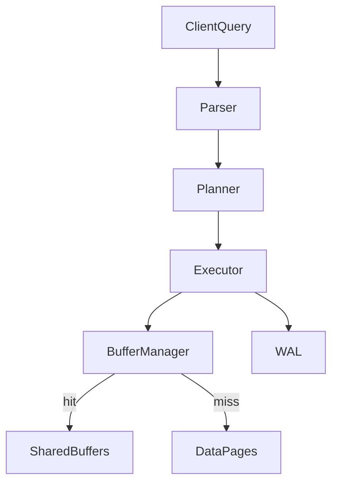

# PostgreSQL Internal Architecture

## 1. Problem Background

PostgreSQL is a database server built for many users, big data, and strong safety guarantees. Reading and writing disk on every query would be too slow, so PostgreSQL uses internal parts that work together: buffer cache, indexes, MVCC, and WAL.

I studied this topic because PostgreSQL splits work across clear layers. Once you see how a query moves through them, it is easier to understand slow queries, memory use, and why VACUUM exists.

In our course labs I also built a Clock Sweep buffer pool (Lab 3), a B-tree (Lab 4), and an MVCC transaction manager (Lab 6). Those labs map directly to real PostgreSQL internals.

---

## 2. Architecture Overview

```
Client  -->  Parser  -->  Planner  -->  Executor  -->  Buffer Manager  -->  Disk pages
                                                      -->  WAL (durability)
```

Main parts:
- **Parser** — checks SQL syntax
- **Planner** — picks the cheapest plan using table statistics
- **Executor** — runs the plan (scans, joins, sorts)
- **Buffer Manager** — keeps hot pages in shared RAM
- **WAL** — logs changes before they hit data files



### Why these parts exist

| Problem | PostgreSQL answer |
|---------|-------------------|
| Disk is slow | Cache pages in shared buffers |
| Find rows fast | B-tree indexes |
| Many readers + writers | MVCC (multiple row versions) |
| Crash safety | WAL — log first, data later |

---

## 3. Internal Design

### Buffer Manager

Location in source: `src/backend/storage/buffer/`

- PostgreSQL keeps frequently used **8 KB pages** in **shared buffers** (RAM shared by all connections)
- On a read: check cache first → **hit** (fast) or **miss** (load from disk)
- When cache is full, evict a page using **Clock Sweep** (not pure LRU)
- In Lab 3 we built this: each frame has a usage count; a clock hand sweeps and gives pages a second chance before eviction

Dirty pages (changed in memory) get written back later — not always on every commit.

### B-Tree Indexes

Location: `src/backend/access/nbtree/`

- Indexes are balanced trees: root → internal nodes → leaf pages
- Lookup is O(log n) — tree height stays low
- On insert, if a leaf page is full → **page split** → parent may split too
- Leaf entries point to heap row locations (TID), not full row data

In Lab 4 we implemented splits and merges. That helped me see why bulk inserts can cause extra write work.

### MVCC (Multi-Version Concurrency Control)

Problem: if readers and writers block each other, concurrency dies.

PostgreSQL solution: **do not overwrite rows in place**. An UPDATE creates a new row version. Old and new versions can exist at the same time.

Each row version has:
- **xmin** — transaction that created it
- **xmax** — transaction that deleted/updated it (0 if still live)

A transaction sees a row only if xmin is committed and visible to its snapshot, and xmax is not blocking.

**Why VACUUM is needed:** dead (old) versions pile up. VACUUM removes them and frees space. Without it, tables bloat.

Lab 6 used the same xmin/xmax idea in our C++ transaction manager.

### WAL (Write-Ahead Logging)

If the server crashes mid-write, data files could be half-updated.

WAL rule: **write the log record to disk before the data page change is considered durable.**

On restart:
1. Read WAL from last checkpoint
2. Replay committed work
3. Database returns to a consistent state

**Checkpoints** flush dirty pages periodically so recovery does not replay the entire WAL history.

---

## 4. Design Trade-Offs

| Component | Benefit | Trade-off |
|-----------|---------|-----------|
| Shared buffers | Fewer disk reads | Uses RAM |
| B-tree indexes | Fast lookups | Splits cost writes |
| MVCC | Readers/writers rarely block | Dead tuples, needs VACUUM |
| WAL | Crash safety | Extra disk writes |
| Statistics (pg_stats) | Better query plans | Needs ANALYZE maintenance |

### Why MVCC instead of locking every read?

I think PostgreSQL chose MVCC because web apps have many concurrent reads. Snapshot reads avoid waiting on writers most of the time.

Cost: storage for old versions and background cleanup (VACUUM).

### Why Clock Sweep instead of LRU?

LRU lists are costly under many connections. Clock Sweep is simpler and scales better — good enough approximation of “recently used” pages.

---

## 5. Experiments / Observations

I ran these on PostgreSQL 17 in Docker (`local-postgres-1`, database `scenr`).

### Experiment 1 — Join query plan and buffer usage

Setup: 1000 customers, 5000 orders. Then:

```sql
EXPLAIN (ANALYZE, BUFFERS)
SELECT c.name, sum(o.amount)
FROM customers c JOIN orders o ON c.id = o.customer_id
GROUP BY c.name LIMIT 10;
```

**Output (trimmed):**
```
Hash Join  (actual time=0.526..3.901 rows=5000)
  -> Seq Scan on orders o  (Buffers: shared hit=32)
  -> Hash  (Buffers: shared hit=6)
       -> Seq Scan on customers c  (Buffers: shared hit=6)
Execution Time: 8.547 ms
```

**What I learned:**
- Planner chose a hash join over a nested loop (reasonable for 5000 order rows)
- All buffer access was **shared hit** — pages were already in cache after setup
- `BUFFERS` shows how the executor touches pages through the buffer manager

---

### Experiment 2 — Planner statistics

```sql
SELECT attname, n_distinct, correlation
FROM pg_stats WHERE tablename = 'orders' LIMIT 5;
```

**Output:**
```
   attname   | n_distinct | correlation
-------------+------------+-------------
 id          |         -1 |           1
 customer_id |       -0.2 |    0.199761
 amount      |         -1 | -0.006203
```

**What I learned:**
- `ANALYZE` fills `pg_stats` with distribution info
- The planner uses this to guess row counts and pick joins/indexes
- Bad or stale stats → bad estimates → slow plans

---

### Experiment 3 — MVCC leaves dead tuples

```sql
UPDATE customers SET name = 'updated' WHERE id < 100;
UPDATE customers SET name = name || 'x' WHERE id <= 500;
SELECT n_dead_tup, n_live_tup, n_tup_upd FROM pg_stat_user_tables
WHERE relname = 'customers';
```

**Output:**
```
 n_dead_tup | n_live_tup | n_tup_upd
------------+------------+-----------
         99 |       1000 |        99
```

**What I learned:**
- Updates do not remove old row versions immediately — 99 dead tuples appeared
- `n_live_tup` stays 1000 (current visible rows)
- VACUUM is required to clean dead tuples and reclaim space

---

## 6. Key Learnings

1. A query passes through parser → planner → executor; tuning means understanding which stage is slow.
2. The buffer manager is the gate between RAM and disk — `EXPLAIN BUFFERS` shows hits and misses.
3. Clock Sweep (Lab 3) is PostgreSQL’s practical replacement for LRU.
4. MVCC trades extra storage for concurrency; xmin/xmax (Lab 6) control visibility.
5. WAL is what makes commits durable after a crash.
6. The planner is only as good as `pg_stats` — run `ANALYZE` on changing tables.
7. VACUUM is not optional housekeeping — it is part of how MVCC works.

---

## References

- [PostgreSQL Buffer Management](https://www.postgresql.org/docs/current/kernel-resources.html)
- [PostgreSQL Indexes (B-tree)](https://www.postgresql.org/docs/current/indexes-types.html)
- [MVCC](https://www.postgresql.org/docs/current/mvcc.html)
- [WAL](https://www.postgresql.org/docs/current/wal-intro.html)
- Course labs: `lab_sessions/lab_3.txt`, `lab_4.txt`, `lab_6.txt`
