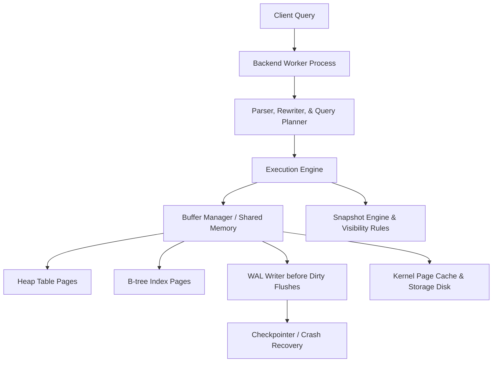
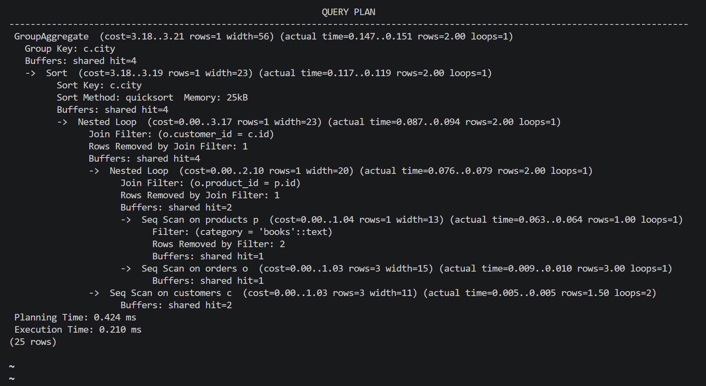
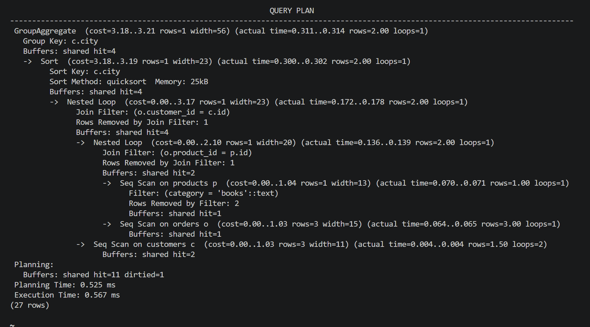

# Deep Dive: PostgreSQL Internal Architecture

## 1. PostgreSQL Overview

PostgreSQL is built to serve as a highly extensible, general-purpose relational database that handles concurrent user access while ensuring strict SQL conformance, reliability, and transactional consistency. Rather than operating like a simple file format, PostgreSQL runs as a set of active daemon processes. It manages memory using shared buffers, registers changes using a Write-Ahead Log (WAL), and manages concurrent reads and writes through Multi-Version Concurrency Control (MVCC) to avoid blocking reads.

## 2. System Architecture Model



### Steps for a Single Row Update

1. The SQL executor determines the candidate records.
2. The buffer manager reads the needed 8 KB pages into shared memory and pins them.
3. The MVCC engine verifies which tuple versions are visible to the current transaction's snapshot.
4. The write operation appends a new version of the row (tuple) to the page and marks the older version as obsolete.
5. A WAL record logging this change is flushed to disk.
6. Checkpoint processes and background writers periodically push dirty memory pages to disk storage; the VACUUM engine eventually reclaims disk space from obsolete row versions.

## 3. Storage and Engine Internals

### Physical Storage and Pages

PostgreSQL partitions data files into fixed-size pages (defaulting to 8 KB). Each table page houses a page header, an array of line pointers, free space, and the actual tuple records. A row's location is identified by its CTID, which consists of the page offset and line pointer index. This level of indirection allows PostgreSQL to compact or move data bytes within a page without updating external references.

Heap tuples store metadata tags for MVCC tracking:

- `xmin` - transaction ID that created this row version.
- `xmax` - transaction ID that updated or deleted this row version (0 if active/valid).
- `ctid` - pointer linking this tuple to a newer version in the update chain (or to itself).

### Shared Buffers and Page Management

The buffer manager coordinates data movement between logical operations and physical disk storage.

- When a requested page is cached in shared buffers, the engine accesses it directly.
- Otherwise, the buffer manager fetches the page from disk (or the OS file cache) into a free buffer slot.
- Pages in active use are "pinned" to prevent eviction during execution.
- Modified pages are flagged as dirty; because the WAL ensures durability, they do not need to be written to disk immediately.
- Page eviction uses a clock-sweep algorithm to approximate LRU behavior with minimal locking overhead.

### B-Tree Indexes

By default, PostgreSQL builds B-Tree indexes as self-balancing structures optimized for equality and range query filters.

- Internal nodes store split keys to route searches.
- Leaf nodes hold sorted index records mapping keys to heap CTIDs.
- Siblings at the leaf level are linked, which facilitates range scans.
- When an index page fills up during insertion, the engine performs a page split and moves a median key up to the parent page.

Because PostgreSQL indexes map to CTIDs rather than containing the actual row data (no clustered tables by default), index lookups require a second read to fetch the heap page, unless the planner can perform an index-only scan by checking the visibility map.

### Multi-Version Concurrency Control (MVCC) & VACUUM

MVCC uses snapshots to isolate transactions. A row version is visible if its `xmin` is committed and falls before the snapshot's creation time, and its `xmax` is either uncommitted, aborted, or occurred after the snapshot was taken.

This architecture ensures that readers do not block writers. However, older tuple versions cannot be physically deleted until no active transaction snapshot can access them. Consequently, the `VACUUM` daemon is a core architectural necessity for reclaiming space.

The `VACUUM` process serves four primary roles:

- Reclaims disk space consumed by dead row versions.
- Clean up dead pointers in index pages.
- Updates planner statistics (often run as `VACUUM ANALYZE`).
- Updates the visibility map to enable faster index-only scans.

### Write-Ahead Logging (WAL) and Recovery

The Write-Ahead Logging protocol requires that all changes be written to the WAL on disk before the modified heap or index pages are flushed. This separates transaction commit latency from random data disk I/O:

- Commits are complete once the WAL buffer is flushed sequentially to disk.
- Dirty pages are written to the database files asynchronously.
- In the event of a crash, the engine replays the WAL from the last checkpoint to restore changes that were not yet flushed to data files.

### Cost-Based Query Optimizer

The query planner evaluates execution options based on estimated costs. It calculates selectivity and join costs using table metadata (from `pg_class`) and data distribution statistics (from `pg_statistic`, visible through the `pg_stats` view).

## 4. Empirical Performance & Joins

This experiment observes how a three-table join behaves under `EXPLAIN (ANALYZE, BUFFERS)`.

```sql
CREATE TABLE customers (
    id serial PRIMARY KEY,
    city text NOT NULL
);

CREATE TABLE products (
    id serial PRIMARY KEY,
    category text NOT NULL
);

CREATE TABLE orders (
    id serial PRIMARY KEY,
    customer_id int REFERENCES customers(id),
    product_id int REFERENCES products(id),
    amount numeric NOT NULL
);

CREATE INDEX orders_customer_idx ON orders(customer_id);
CREATE INDEX orders_product_idx ON orders(product_id);

INSERT INTO customers (city) VALUES 
  ('New York'), ('London'), ('Tokyo'), ('Paris'), ('Berlin');

INSERT INTO products (category) VALUES 
  ('books'), ('electronics'), ('furniture'), ('clothing'), ('books'), ('books');

INSERT INTO orders (customer_id, product_id, amount) VALUES
  (1, 1, 29.99), (2, 1, 19.99), (1, 2, 99.99),
  (3, 3, 149.99), (4, 4, 59.99), (5, 1, 24.99),
  (1, 5, 34.99), (2, 2, 89.99), (3, 1, 19.99),
  (4, 5, 39.99), (5, 3, 129.99), (1, 4, 49.99);

ANALYZE;

EXPLAIN (ANALYZE, BUFFERS)
SELECT c.city, p.category, count(*), sum(o.amount)
FROM orders o
JOIN customers c ON c.id = o.customer_id
JOIN products p ON p.id = o.product_id
WHERE p.category = 'books'
GROUP BY c.city, p.category;
```

**Observation Details**



This demonstrates that the join strategy (hash join vs. nested loop) is determined dynamically by the optimizer's cardinality estimates rather than the query syntax. If `ANALYZE` statistics for a filtered column like `products.category` are out of date, the planner may generate an inefficient plan. Updating statistics targets resolves this issue:

```sql
ALTER TABLE products ALTER COLUMN category SET STATISTICS 1000;
ANALYZE products;
```


This links planning to execution: `pg_statistic` dictates row estimates, which determine join selections. This changes buffer hit/read ratios and impacts whether a query is limited by CPU, memory, or I/O.

### Detailed Test Results

Executing the `EXPLAIN` query before tuning returns a plan with:

- **Planned rows**: The optimizer's estimate (derived from default or outdated statistics).
- **Actual rows**: The actual count processed during execution.
- **Buffers**: Cache hit and read details.

If statistics are stale, the planner may underestimate matching rows (estimating 1 instead of 3), resulting in:
- A suboptimal join ordering.
- A nested loop join instead of a hash join.
- Higher buffer reads and disk access.

After executing `ALTER TABLE products ALTER COLUMN category SET STATISTICS 1000` and running `ANALYZE`, we observe:
- Accurate row estimations matching the actual execution count.
- An optimal join strategy.
- Reduced buffer and memory pressure.

The critical metric is **Buffers: shared hit=X read=Y**. High hit counts indicate that the active dataset is cached in memory, while high read counts point to disk I/O bottlenecks, often caused by suboptimal plans due to missing statistics.

---

## 5. Design Decisions and Trade-Offs

### MVCC vs. Table Locking

**PostgreSQL Implementation: MVCC**

- **Advantage**: Readers and writers do not block each other. Long running read-only reports can query a consistent snapshot without stalling concurrent data modifications.
- **Trade-off**: Requires periodic `VACUUM` maintenance to clean up dead row versions. For most OLTP workloads, this overhead is a reasonable trade-off for high concurrency.

### Fixed Page-Based Storage

**PostgreSQL Implementation: 8 KB Pages with CTID Indirection**

- **Advantage**: 
  - Predictable disk I/O operations (exactly 8 KB per block).
  - CTID pointers remain stable, meaning updates that fit on a page do not require updating index pointers.
  - Efficient page caching and eviction algorithms.
- **Trade-off**: 
  - Standard table pages are not clustered by index, meaning index lookups require extra heap lookups.
  - Page fragmentation and wasted space when tuples span multiple pages.

### WAL Log-First Write Path

**PostgreSQL Implementation: Write-Ahead Logging**

- **Advantage**: 
  - Commits only wait for sequential WAL writes, rather than random data page writes.
  - Enables crash recovery by replaying changes.
  - Allows the engine to flush dirty data pages asynchronously.
- **Trade-off**: 
  - Double writing overhead (writing to the WAL first, and then to the data files).
  - Adds complexity to the checkpointer and recovery engine.

### Clustered vs. Heap Layout

**PostgreSQL Implementation: Non-clustered (Heap-based) by default**

- **Advantage**: 
  - Table storage is decoupled from index sorting.
  - Adding or modifying indexes does not require restructuring table data.
  - High flexibility for write paths.
- **Trade-off**: 
  - Range queries on index keys require scanning across heap pages.
  - Index-only scans are dependent on the visibility map.

---

## 6. Critical Takeaways

### 1. Query Execution Plans Adapt to Data Statistics

The database engine dynamically adjusts its join algorithms based on estimated row counts. This means:
- Optimizer statistics (`pg_statistic`) directly impact query performance.
- Stale statistics can cause the planner to choose suboptimal join paths.
- Regular updates using `ANALYZE` are a key part of database maintenance.

### 2. Buffer Performance is Key to Throughput

Query latency is highly dependent on memory access patterns:
- Maximizing shared buffer cache hits minimizes disk I/O.
- Suboptimal plans can exhaust memory cache space.
- The planner uses table statistics to choose plans that align with cache capacity.

### 3. MVCC Concurrency Requires Maintenance

While MVCC allows concurrent reads and writes:
- Dead tuple versions accumulate and must be cleaned up via `VACUUM`.
- Visibility map accuracy is required for index-only scans.
- Long-running transactions can block space reclamation, leading to table bloat.

This overhead is a deliberate design trade-off to enable high read-write concurrency.

---