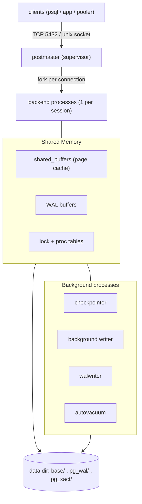
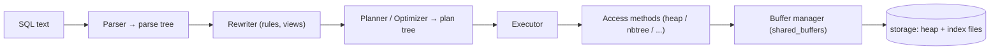

# PostgreSQL Internal Architecture

> PostgreSQL is a **process-per-connection, shared-memory, WAL-logged, MVCC** relational engine. Five subsystems do most of the work — the **buffer manager** (clock-sweep cache over 8 KB pages), the **nbtree** B-link index, **MVCC** (versioned heap tuples, never updated in place), **WAL** (durability + recovery), and **VACUUM** (the garbage collector MVCC makes necessary). Almost every design choice below is a deliberate trade of *in-place simplicity* for *non-blocking concurrency*.

**TL;DR**

| Subsystem | What it is | Core mechanism | Trade-off accepted |
|---|---|---|---|
| Process model | `postmaster` + one backend **process** per connection + background helpers | OS process isolation, coordination via shared memory | Robust isolation, but a connection ≈ an OS process → needs a pooler at scale |
| Buffer manager | Shared page cache (`shared_buffers`) | **Clock-sweep** replacement (not LRU) over pinned/usage-counted buffers | O(1) eviction, no per-access list; approximates LRU rather than being exact |
| Indexes (nbtree) | Lehman & Yao **B-link tree** | High keys + right-links → search needs **no read locks** | Reads never block on concurrent splits; extra link/high-key bookkeeping |
| MVCC | Multi-version heap tuples | `t_xmin`/`t_xmax` + snapshot visibility; UPDATE = new version | Readers never block writers; old versions become **dead tuples** (bloat) |
| WAL | Write-ahead log | **Log-before-data** rule; redo from last checkpoint | Sequential, cheap commits + crash safety; double-write of changes |
| VACUUM | Background garbage collector | Reclaims dead tuples, freezes XIDs, fills visibility map | Cleans up MVCC's mess; recurring background I/O cost |

---

## 1. Problem Background

PostgreSQL began as **POSTGRES** at UC Berkeley (1986), led by Michael Stonebraker as the successor to Ingres. The motivating problem was not "store rows" — relational systems already did that — but **extensibility and correctness under concurrency**: a database whose type system, operators, index methods, and rules could be extended by users, while still serving many concurrent clients with strong integrity guarantees. The SQL frontend arrived as **Postgres95**, and the open-source project renamed itself PostgreSQL in 1996.

The internals exist to answer one hard question: *how do hundreds of transactions read and write shared data simultaneously, durably, without corrupting each other or blocking each other unnecessarily?* The answer PostgreSQL commits to is **multi-version concurrency control over a shared buffer pool, protected by a write-ahead log** — and that single answer cascades into the buffer manager, the index design, the storage format, and the existence of VACUUM. This document walks those subsystems and, throughout, names the trade-off each one accepts. (The sibling doc *PostgreSQL vs SQLite* covers the client–server vs. embedded angle; here the focus is purely internal.)

---

## 2. Architecture Overview

### 2.1 Process and memory model

PostgreSQL is a **multi-process** server, not a multi-threaded one. A supervisor process (`postmaster`) listens on the port; for every client connection it **forks a dedicated backend process** that runs that session's queries. Backends never touch each other's memory directly — they coordinate through a **shared memory** segment (the buffer pool, WAL buffers, lock tables, the proc array of live transactions). A set of **background processes** handles work that must happen regardless of any one connection. ([architecture](https://www.postgresql.org/docs/current/tutorial-arch.html))



The background processes each own one responsibility: the **checkpointer** flushes all dirty buffers and writes a checkpoint record so recovery has a bounded starting point; the **background writer** trickles dirty pages out ahead of demand so backends rarely have to write a page themselves before evicting it; the **walwriter** flushes WAL buffers to disk; **autovacuum** launches workers to reclaim dead tuples and freeze old transaction IDs. Process isolation is the deliberate choice here — a crashing backend cannot scribble over another's memory, and the postmaster simply reaps it and re-initializes shared memory if needed.

### 2.2 The path of a query

A query is not executed where it arrives; it is transformed through a pipeline of stages, each producing a tree consumed by the next.



- **Parser** turns SQL text into a parse tree (syntax + catalog lookups for names/types).
- **Rewriter** applies rules — most importantly, it expands views into their underlying query.
- **Planner/optimizer** is **cost-based**: it enumerates equivalent plans (scan methods, join orders, join algorithms) and picks the cheapest using statistics from `pg_statistic`. This is where nested-loop vs. hash vs. merge join is decided.
- **Executor** walks the chosen plan tree, pulling tuples node-by-node (a demand-driven "Volcano" iterator model), calling **access methods** to fetch tuples.
- **Access methods** (the heap AM, the nbtree index AM, etc.) request pages from the **buffer manager**, which serves them from `shared_buffers` or reads them from disk. Writes go to WAL first, then to buffers; data files are written later by the checkpointer/bgwriter.

---

## 3. Internal Design

This is the core. Each subsection covers *what the mechanism is* and *why the trade-off was accepted*.

### 3.1 Buffer Manager — `src/backend/storage/buffer/`

PostgreSQL caches 8 KB disk pages in a fixed-size shared pool, `shared_buffers`. Every backend reads and writes through this pool, so it is the central point of contention and the central performance lever. ([buffer README](https://github.com/postgres/postgres/blob/master/src/backend/storage/buffer/README))

**Structures.** Three arrays work together:

- **Buffer pool** — the actual 8 KB page frames.
- **Buffer descriptors** — one per frame, holding the page's identity (`BufferTag` = relation + fork + block number), a **pin count** (reference count), a **usage count**, a dirty flag, and a content LWLock. A spinlock guards the descriptor's mutable header fields.
- **Buffer mapping hash table** — maps `BufferTag → buffer id`, so a backend can find whether a given page is already cached. It is partitioned under several `BufMappingLock` partitions to spread lock contention.

**Pinning and usage count.** To touch a page a backend must first **pin** it (increment the pin count); a pinned buffer cannot be evicted. Pinning also bumps the **usage count** up to a small ceiling. Pins are released when the backend is done and never survive across transaction boundaries.

**Replacement: clock-sweep, *not* LRU.** When no free frame exists, PostgreSQL must choose a victim. It deliberately does **not** maintain a true LRU list, because keeping an exact LRU order means updating a global linked list on *every* page access — a serialization bottleneck under many backends. Instead it uses a **clock-sweep** approximation:

> *"PostgreSQL uses a simple clock-sweep algorithm. Each buffer header contains a usage counter, which is incremented (up to a small limit value) whenever the buffer is pinned."* — buffer README

A shared `nextVictimBuffer` pointer sweeps circularly through the descriptors. At each buffer it skips pinned ones; for unpinned ones it **decrements** the usage count, and the **first buffer it finds at usage count 0** becomes the victim. Frequently-touched pages keep getting their counter topped up and survive several sweeps; cold pages decay to zero and get evicted. The trade-off: this is O(1) amortized and needs no per-access global list, at the cost of being an *approximation* of LRU rather than the exact thing — an excellent bargain at high concurrency.

**Reading a page in / writing a dirty page out.** A miss in the mapping table triggers: find a victim via clock-sweep, and if the victim is **dirty**, write it out first; then read the requested page from disk into the freed frame and insert the new mapping. A write only marks the buffer **dirty** in memory — it does not hit the data file. Dirty pages reach disk later, written by the checkpointer (at checkpoints), the background writer (proactively), or, as a last resort, by a backend that needs the frame.

**The WAL-before-data rule.** A dirty page may **not** be written to its data file until the WAL record describing that change is safely on disk. The buffer's descriptor carries the page's LSN; eviction must flush WAL up to that LSN first. This is the durability invariant that makes crash recovery possible (see §3.4) — without it, a data-file write could survive a crash with no log record to explain or undo it.

**Ring buffers (Buffer Access Strategy).** A naive cache would let one big sequential scan evict the entire working set. PostgreSQL avoids this by giving large sequential scans, `VACUUM`, and bulk writes (`COPY`, `CREATE TABLE AS`) a small **ring buffer** (e.g. 256 KB for seq scans) that they recycle, so a one-pass scan over a huge table pollutes only a few hundred KB of cache instead of all of it. The subtlety the README flags: if a ring buffer page is dirtied, WAL must still be flushed before that page can be reused — the ring does not bypass the log-before-data rule.

**Interaction with the OS page cache.** `shared_buffers` is a *second* cache in front of the kernel's own page cache. A page evicted from `shared_buffers` is usually still warm in the OS cache, so re-reading it is cheap. This is why the recommended `shared_buffers` is only a fraction of RAM (commonly ~25%) rather than all of it: PostgreSQL relies on the OS cache as a large second tier and avoids double-buffering everything.

### 3.2 B-Tree indexes — nbtree (`src/backend/access/nbtree/`)

PostgreSQL's default index is a **B+-tree**: keys and child pointers in internal pages route searches; the actual index entries (key + heap TID) live in the **leaf** level, and leaves are chained left↔right. What makes nbtree notable is its concurrency design. ([nbtree README](https://github.com/postgres/postgres/blob/master/src/backend/access/nbtree/README); [Lehman & Yao 1981](https://dl.acm.org/doi/10.1145/319628.319663))

**The B-link tree (Lehman & Yao).** nbtree implements *"Lehman and Yao's high-concurrency B-tree management algorithm."* Two structural additions make searches lock-free:

1. A **right-link** on every page — a pointer to its right sibling at the same level.
2. A **high key** on every page — an upper bound on the keys that page is allowed to hold.

**Search path, root → leaf.** A search descends from the root, at each level choosing the child whose key range covers the search key, until it reaches a leaf and binary-searches within it. The clever part is what happens during a **concurrent split**: if a search arrives at a page and finds the search key is **greater than that page's high key**, it knows the page was split *after* the parent pointer was read, and that the keys it wants have moved right. It simply **follows the right-link** to the new sibling — no read lock was ever taken on the tree. This is the whole point of the B-link design: searches never block, and never need to lock-couple their way down.

**Page splits and why right-links make them safe.** When a leaf overflows on insert, it splits: a new right sibling is allocated, the upper half of the entries move to it, the right-link chain is spliced to include the new page, and a downlink to the new page is inserted into the parent. A concurrent search that was already descending toward the old page sees one of two consistent states — either it finds its key still on the old page, or it finds the key now exceeds the old page's high key and walks the right-link to the new page. There is no window in which an entry is "missing." The accepted trade-off: a little extra bookkeeping (high keys, right-links, and — in PostgreSQL's variant — left-links for backward scans) buys **read concurrency with essentially no read-side locking**.

**Index page layout.** An index page reuses the generic page format — a header, an array of item pointers, the items, and a **special space** at the end (which in heap pages is empty) holding nbtree's per-page metadata: the right-link, left-link, and high key.

**Index-only scans + visibility map.** A B-tree entry stores the key plus the heap **TID**; normally the executor must still visit the heap to check tuple visibility (MVCC lives in the heap, not the index). An **index-only scan** skips that heap visit *when the visibility map* (§3.5) marks the page all-visible — i.e., every tuple on it is visible to all transactions, so no per-tuple visibility check is needed. This is the payoff for a covering index on a static, well-vacuumed table.

### 3.3 MVCC — multi-version concurrency control

MVCC is the heart of PostgreSQL's concurrency. The guarantee it buys is stated plainly in the docs:

> *"reading never blocks writing and writing never blocks reading."* — [MVCC intro](https://www.postgresql.org/docs/current/mvcc-intro.html)

It achieves this by keeping **multiple versions** of each row and letting each transaction see the version appropriate to its snapshot, instead of locking rows for reads.

**Heap tuple header.** Every heap tuple carries a `HeapTupleHeaderData` whose version-control fields are ([page layout](https://www.postgresql.org/docs/current/storage-page-layout.html)):

| Field | Meaning |
|---|---|
| `t_xmin` | XID of the transaction that **inserted** this version ("insert XID stamp") |
| `t_xmax` | XID of the transaction that **deleted/updated** it, or 0 if still live ("delete XID stamp") |
| `t_cid` | command ID — distinguishes statements *within* the same transaction |
| `t_ctid` | TID of *this* tuple, or of the *newer version* it was updated into (the version chain link) |
| `t_infomask` | hint bits: `HEAP_XMIN_COMMITTED`, `HEAP_XMAX_COMMITTED`, `HEAP_XMIN_INVALID`, ... |

**Hint bits.** Determining whether `t_xmin`/`t_xmax` committed normally requires consulting the commit-status log (`pg_xact`). To avoid doing that repeatedly, the first transaction that checks caches the result as a **hint bit** in `t_infomask` (e.g. `HEAP_XMIN_COMMITTED`). Later visibility checks read the bit instead of the commit log — a cheap memoization of "did this XID commit?".

**Visibility against a snapshot.** A **snapshot** records which transactions had committed at a point in time (plus the set still in-flight). A tuple is visible to a transaction roughly when: its `t_xmin` committed and is in the snapshot's past, **and** its `t_xmax` is either 0/aborted or belongs to a transaction *not* visible to this snapshot (so the deletion "hasn't happened yet" from this snapshot's view). This single rule, applied per tuple, is how thousands of transactions read consistent data without taking read locks.

**UPDATE = new version + dead old version.** An UPDATE does **not** overwrite in place. It stamps the old tuple's `t_xmax` with the updating XID and **inserts a brand-new tuple** for the new values; the old tuple's `t_ctid` points forward to the new one. Old snapshots keep seeing the old version; new snapshots see the new one. A DELETE just sets `t_xmax` with no successor. The consequence — superseded versions linger as **dead tuples** — is the price MVCC pays, and the reason VACUUM exists.

**HOT (Heap-Only Tuples).** Append-a-new-version is expensive because *every index* normally needs a new entry pointing at the new tuple. HOT is the escape hatch. ([HOT README](https://github.com/postgres/postgres/blob/master/src/backend/access/heap/README.HOT))

> A HOT update applies when *"a new tuple placed on the same page and with all indexed columns the same as its parent row version does not get new index entries."*

So if **no indexed column changed** *and* the new version **fits on the same heap page**, PostgreSQL chains the new version off the old one (old tuple flagged `HEAP_HOT_UPDATED`, new one flagged `HEAP_ONLY_TUPLE`) and **adds no index entries at all** — *"there is only one index entry for the entire update chain on the heap page,"* pointing at the chain's root line pointer. An index lookup lands on the root and walks the `t_ctid` chain forward to the live version. HOT also enables **single-page pruning**: dead intermediate versions can be reclaimed during ordinary page access, without waiting for a full VACUUM. HOT is therefore the main defense against MVCC's "every index updated on every UPDATE" cost.

**Isolation levels.** All three levels are built on snapshots ([transaction isolation](https://www.postgresql.org/docs/current/transaction-iso.html)):

| Level | Snapshot taken | Prevents | Notes |
|---|---|---|---|
| **Read Committed** (default) | **per statement** — a fresh snapshot at the start of each command | dirty reads | two SELECTs in one txn can see different data |
| **Repeatable Read** | **once, at transaction start** | dirty + non-repeatable + phantom reads | PostgreSQL prevents phantoms here, exceeding the SQL standard; conflicting writes error with *"could not serialize access"* |
| **Serializable** | as Repeatable Read **+ SSI** | also the **serialization anomaly** | adds *predicate (SIRead) locks* to detect dangerous read/write dependencies; these locks **never block**, they only trigger a serialization failure to retry |

Serializable's **SSI** (Serializable Snapshot Isolation) is the elegant bit: it gives true serializability *without* the read-blocking of strict two-phase locking, by tracking read/write dependency cycles and aborting one transaction in any cycle that could violate serial order.

### 3.4 WAL — Write-Ahead Logging

WAL is the durability and recovery substrate. Its rule is the foundation everything else rests on ([WAL intro](https://www.postgresql.org/docs/current/wal-intro.html)):

> *"changes to data files ... must be written only after those changes have been logged, that is, after WAL records describing the changes have been flushed to permanent storage."*

**WAL records and LSN.** Every modification (insert/update/delete, index change, page init, etc.) first produces a **WAL record** appended to the log in `pg_wal/`. Each record's position is an **LSN** (Log Sequence Number) — a monotonically increasing byte offset into the WAL stream. Every data page stores in its header the LSN of the last WAL record that modified it (`pd_lsn`), which is exactly what the buffer manager checks to enforce log-before-data: *"flush WAL up to this page's LSN before writing this page."*

**Why this is fast.** A commit only needs to `fsync` the WAL — a **sequential** append — not the scattered data pages the transaction touched. One `fsync` can durably commit many concurrent transactions (group commit). The data pages are written lazily and in bulk later. WAL trades a *double-write* of every change (once to log, once to data file) for cheap, sequential, batched commits.

**Crash recovery (REDO).** After a crash, PostgreSQL replays WAL forward from the most recent **checkpoint**:

> *"any changes that have not been applied to the data pages can be redone from the WAL records. (This is roll-forward recovery, also known as REDO.)"*

Because data pages were possibly never flushed, recovery re-applies every logged change since the checkpoint, bringing the data files back to the committed state. No undo of in-flight transactions is needed for visibility — MVCC handles that, since uncommitted versions are simply invisible to snapshots.

**Checkpoints.** A checkpoint flushes all dirty buffers and writes a checkpoint record marking a "redo point." Everything before it is guaranteed on disk, so WAL prior to the checkpoint can be recycled, and recovery never has to start earlier than the last checkpoint. Checkpoints fire on `checkpoint_timeout` (default 5 min) or when `max_wal_size` is about to be exceeded. The trade-off is classic: **frequent checkpoints → faster recovery but more I/O during normal running; infrequent → cheaper steady state but longer recovery.** ([WAL config](https://www.postgresql.org/docs/current/wal-configuration.html))

**full_page_writes (torn-page protection).** A page is 8 KB but the OS/disk may write it in smaller sectors; a crash mid-write can leave a **torn page** (half old, half new) that no incremental WAL record can repair. So *"the first modification of a data page after each checkpoint results in logging the entire page content"* — a full-page image. Recovery starts from this known-good whole page and replays subsequent deltas on top. The cost is extra WAL volume right after each checkpoint, accepted to guarantee recoverability from partial writes.

### 3.5 VACUUM — the MVCC garbage collector

MVCC's append-only updates mean *"an `UPDATE` or `DELETE` of a row does not immediately remove the old version"* — dead versions pile up. VACUUM is the background process that cleans up. ([routine vacuuming](https://www.postgresql.org/docs/current/routine-vacuuming.html))

VACUUM does four jobs:

1. **Reclaim space** from dead tuples (marking it reusable in-place; ordinary VACUUM does *not* return space to the OS — `VACUUM FULL`, which rewrites the table under an exclusive lock, does).
2. **Update planner statistics** (when run as `VACUUM ANALYZE`).
3. **Maintain the visibility map** — a bitmap with **two bits per heap page**: *all-visible* ("every tuple here is visible to everyone") and *all-frozen* ("every tuple here is already frozen"). The all-visible bit lets the next VACUUM **skip** clean pages and lets **index-only scans** avoid heap visits; the all-frozen bit lets an aggressive freeze pass skip pages that need no freezing.
4. **Freeze old XIDs** to prevent transaction-ID wraparound.

**Transaction-ID wraparound and freezing.** XIDs are 32-bit, so after ~4 billion transactions the counter wraps. The danger:

> *"the XID counter wraps around to zero, and all of a sudden transactions that were in the past appear to be in the future — which means their output becomes invisible. In short, catastrophic data loss."*

The fix is **freezing**: VACUUM marks sufficiently old, all-visible tuples as *frozen*, which means "infinitely in the past, always visible." Historically (pre-9.4) freezing overwrote `t_xmin` with the reserved `FrozenTransactionId`; modern PostgreSQL *"just set[s] a flag bit"* — the `HEAP_XMIN_FROZEN` hint — **preserving the original `xmin`** for forensics. Either way, a frozen tuple is exempt from XID comparison and immune to wraparound. **Autovacuum** triggers an *aggressive* freeze pass as a table's oldest unfrozen XID approaches `autovacuum_freeze_max_age` (default 200M), so a healthy cluster freezes continuously and never approaches the wraparound cliff.

---

## 4. Design Trade-Offs

| Decision | What you gain | What you pay | Why it's the right call for PostgreSQL |
|---|---|---|---|
| **Append-only MVCC** (no in-place update) | Non-blocking reads; cheap rollback (just don't make the new version visible); time-travel snapshots | **Dead-tuple bloat** + mandatory VACUUM; tables grow then need reclaiming | Read-heavy multi-user OLTP benefits enormously from readers never blocking |
| **Heap + separate indexes** (no clustered index) | Cheap secondary indexes; no full-table reorg when a key changes; many index types (GiST/GIN/BRIN) | No physical clustering; every index entry is an extra heap jump; non-HOT UPDATE touches **every** index | Flexibility and extensibility were the founding goals |
| **HOT** (escape hatch above) | UPDATEs that don't change indexed columns add **zero** index entries; on-the-fly pruning | Only applies when the new version fits on the same page | Makes the common "update a non-indexed column" path cheap |
| **Process-per-connection** | Strong fault isolation; a crashed backend can't corrupt others | A connection ≈ an OS process (memory + context-switch cost); thousands of idle connections are expensive | Robustness first; high counts are solved with a pooler (PgBouncer) |
| **Clock-sweep over LRU** | O(1) eviction, no global per-access list to serialize on | Approximates LRU rather than being exact | Exact LRU's bookkeeping would itself become the bottleneck at high concurrency |
| **WAL log-before-data** | Sequential, batched, cheap commits + crash recovery + replication/PITR | Every change is written twice (log + data); full-page images after checkpoints | Durability and replication are non-negotiable for a server RDBMS |

**Contrast with InnoDB (MySQL).** InnoDB also does MVCC but the *opposite* way: it keeps the **current** row in place and stores **prior versions in an undo log (rollback segment)**; a reader needing an older version **reconstructs** it by applying undo. Cleanup of obsolete undo is done by a **purge** thread, not a VACUUM-style heap sweep. The trade is symmetric: InnoDB avoids heap bloat from old versions but grows the **undo log** instead, and a single long-running transaction can pin a large undo history (PostgreSQL's analogous pain is that an old snapshot prevents VACUUM from removing dead tuples). InnoDB also clusters the table on its primary key (the table *is* a B-tree), so PK range scans have locality PostgreSQL's heap lacks — but secondary-index lookups in InnoDB must go PK→clustered-index, whereas PostgreSQL's secondary indexes point straight at heap TIDs.

---

## 5. Experiments / Observations

> These recipes are **reproducible**: each shows the exact command and the *documented/expected* behavior. All plan and table output below is **illustrative — reproduce it with the command shown above it**; no timings here were measured for this document.

### 5.1 Recommended exercise — `EXPLAIN ANALYZE` on a multi-table join

```sql
-- Build statistics first, then inspect a join plan with timing and I/O.
ANALYZE;   -- populates pg_statistic for all tables

EXPLAIN (ANALYZE, BUFFERS)
SELECT c.name, count(*)
FROM   customers c
JOIN   orders    o ON o.customer_id = c.id
WHERE  c.region = 'EU'
GROUP  BY c.name;
```

Representative output **(illustrative; reproduce with the command above)**:

```
HashAggregate  (cost=2310.50..2325.10 rows=1460 width=40)
               (actual time=18.2..19.0 rows=1502 loops=1)
  Group Key: c.name
  ->  Hash Join  (cost=120.30..2120.00 rows=38100 width=32)
                 (actual time=1.1..14.7 rows=37880 loops=1)
        Hash Cond: (o.customer_id = c.id)
        ->  Seq Scan on orders o  (cost=0.00..1680.00 rows=98000 width=8)
        ->  Hash  (cost=110.00..110.00 rows=820 width=28)
              ->  Seq Scan on customers c  (cost=0.00..110.00 rows=820 width=28)
                    Filter: (region = 'EU')
        Buffers: shared hit=512 read=1180
Planning Time: 0.40 ms
Execution Time: 19.6 ms
```

**How to read it** ([using EXPLAIN](https://www.postgresql.org/docs/current/using-explain.html)):

- `cost=startup..total` is in **arbitrary units** (conventionally relative to one sequential page fetch, `seq_page_cost = 1.0`). The startup cost is work before the first row can emit (e.g. building the hash table); the total is the whole node. **A parent node's cost includes its children's.**
- `rows=` on the bare cost is the planner's **estimate**; with `ANALYZE`, `actual ... rows=` is what really happened. The gap between **estimated and actual rows** is the single most important thing to read — that ratio is what the planner got right or wrong.
- `Buffers: shared hit=... read=...` (from the `BUFFERS` option, implied by `ANALYZE`) separates cache hits (`hit`) from disk reads (`read`), revealing whether the cost was CPU or I/O.
- The planner chose a **Hash Join** here: it hashes the smaller side (filtered `customers`) and probes it with the `orders` scan. Its alternatives were a **Nested Loop** (good only when the inner side is tiny or indexed) and a **Merge Join** (good when both inputs are already sorted on the key).

### 5.2 Where the estimates come from — `pg_stats`

```sql
-- Inspect the column statistics the planner used.
SELECT attname, null_frac, n_distinct, most_common_vals, histogram_bounds, correlation
FROM   pg_stats
WHERE  tablename = 'customers' AND attname = 'region';
```

`ANALYZE` samples the table and populates `pg_statistic` (readable via the `pg_stats` view) with ([planner stats](https://www.postgresql.org/docs/current/planner-stats.html); [pg_stats](https://www.postgresql.org/docs/current/view-pg-stats.html)):

- **`n_distinct`** — distinct-value estimate (negative form = a *ratio* of distinct-to-total, used when distinctness scales with table size; `-1` means a unique column).
- **`most_common_vals`** / `most_common_freqs` — the MCV list: the most frequent values and their frequencies, used to estimate selectivity of equality on skewed columns.
- **`histogram_bounds`** — *"values that divide the column's values into groups of approximately equal population,"* used for range selectivity on the non-MCV remainder.
- **`correlation`** — *"correlation between physical row ordering and logical ordering of the column values"* (−1..+1); near ±1 makes an index scan cheaper because heap access is more sequential.
- **`null_frac`** — fraction of NULLs.

**What a bad row estimate does.** If statistics are stale or a multi-column correlation is missed, the planner can misjudge selectivity — say, estimate 30 rows from a join when 300,000 actually flow through. It then picks the wrong **join algorithm**: a Nested Loop (great for 30 inner iterations) becomes catastrophic at 300,000, where a Hash Join would have won. This is *the* lesson of the exercise: **the plan is only as good as the row estimates**, which is why `ANALYZE`/autovacuum keeping statistics current is so important, and why `CREATE STATISTICS` exists for correlated columns single-column stats can't capture.

### 5.3 Making MVCC visible

```sql
CREATE TABLE demo(id int, v int);
INSERT INTO demo VALUES (1, 10);
SELECT xmin, xmax, ctid, * FROM demo;
UPDATE demo SET v = 20 WHERE id = 1;
SELECT xmin, xmax, ctid, * FROM demo;
```

Representative output **(illustrative; reproduce with the commands above)**:

```
 xmin | xmax | ctid  | id | v          <- after INSERT
  742 |    0 | (0,1) |  1 | 10         inserted by txn 742, live (xmax=0), page 0 / line 1

 xmin | xmax | ctid  | id | v          <- after UPDATE
  743 |    0 | (0,2) |  1 | 20         NEW version at (0,2); old (0,1) now has xmax=743 and is dead
```

The UPDATE produced a **new tuple version** rather than overwriting — the mechanism behind non-blocking reads, and the dead old version is exactly what VACUUM later reclaims.

### 5.4 Inspecting the buffer pool — `pg_buffercache`

```sql
CREATE EXTENSION IF NOT EXISTS pg_buffercache;
-- Which relations occupy the most shared buffers right now?
SELECT c.relname, count(*) AS buffers, sum(b.isdirty::int) AS dirty,
       round(avg(b.usagecount), 2) AS avg_usagecount
FROM   pg_buffercache b
JOIN   pg_class c ON b.relfilenode = pg_relation_filenode(c.oid)
GROUP  BY c.relname
ORDER  BY buffers DESC
LIMIT  10;
```

`pg_buffercache` exposes one row per buffer (`bufferid`, `relfilenode`, `isdirty`, `usagecount`, `pinning_backends`, ...) so you can *see* the clock-sweep `usagecount` and which pages are cached and dirty — the buffer manager of §3.1 made observable. ([pg_buffercache](https://www.postgresql.org/docs/current/pgbuffercache.html))

---

## 6. Key Learnings

1. **MVCC is the keystone, and VACUUM is its tax.** Versioning rows instead of locking them is what gives "readers never block writers"; the unavoidable cost is dead tuples, which is the entire reason VACUUM, autovacuum, freezing, and the visibility map exist. You cannot understand PostgreSQL's internals without seeing MVCC and VACUUM as two halves of one decision.
2. **Approximate, lock-light algorithms beat exact ones under concurrency.** Clock-sweep instead of true LRU, hint bits instead of always reading `pg_xact`, B-link right-links instead of read locks — each trades exactness for the absence of a global serialization point. At many backends, the bookkeeping of the "correct" structure *is* the bottleneck.
3. **WAL's log-before-data rule is load-bearing far beyond durability.** The same invariant that makes commits cheap (sequential fsync) also makes crash recovery a simple forward REDO and makes replication and PITR possible. One rule, many payoffs.
4. **HOT is the quiet hero of write performance.** "Every index updated on every UPDATE" would make PostgreSQL's append-only MVCC painful; HOT updates (no indexed column changed, fits on page) sidestep all index maintenance and prune dead versions in place.
5. **The heap-plus-separate-indexes choice trades locality for flexibility.** No clustered index means cheap secondary indexes and no reorg storms, at the cost of an extra heap jump per index lookup and no physical key ordering — the opposite bet from InnoDB's clustered PK.
6. **Every guarantee is paid for somewhere, and PostgreSQL is honest about where.** Non-blocking reads → VACUUM; cheap commits → double-writes and full-page images; process isolation → connection cost and the need for a pooler. Reading the internals is largely reading the bill for each guarantee.

---

## References

- PostgreSQL — *Architectural Fundamentals*: https://www.postgresql.org/docs/current/tutorial-arch.html
- PostgreSQL — *Write-Ahead Logging (WAL)*: https://www.postgresql.org/docs/current/wal-intro.html
- PostgreSQL — *WAL Configuration* (checkpoints, full_page_writes): https://www.postgresql.org/docs/current/wal-configuration.html
- PostgreSQL — *Introduction to MVCC*: https://www.postgresql.org/docs/current/mvcc-intro.html
- PostgreSQL — *Transaction Isolation*: https://www.postgresql.org/docs/current/transaction-iso.html
- PostgreSQL — *Database Page Layout* (heap tuple header): https://www.postgresql.org/docs/current/storage-page-layout.html
- PostgreSQL — *Routine Vacuuming* (freezing, XID wraparound): https://www.postgresql.org/docs/current/routine-vacuuming.html
- PostgreSQL — *Using EXPLAIN*: https://www.postgresql.org/docs/current/using-explain.html
- PostgreSQL — *How the Planner Uses Statistics*: https://www.postgresql.org/docs/current/planner-stats.html
- PostgreSQL — *pg_stats view*: https://www.postgresql.org/docs/current/view-pg-stats.html
- PostgreSQL — *pg_buffercache*: https://www.postgresql.org/docs/current/pgbuffercache.html
- PostgreSQL source — *buffer manager README* (clock-sweep): https://github.com/postgres/postgres/blob/master/src/backend/storage/buffer/README
- PostgreSQL source — *nbtree README* (Lehman & Yao, right-links): https://github.com/postgres/postgres/blob/master/src/backend/access/nbtree/README
- PostgreSQL source — *Heap-Only Tuples (HOT) README*: https://github.com/postgres/postgres/blob/master/src/backend/access/heap/README.HOT
- Philip L. Lehman & S. Bing Yao — *Efficient Locking for Concurrent Operations on B-Trees*, ACM TODS 6(4):650–670, 1981 (DOI 10.1145/319628.319663): https://dl.acm.org/doi/10.1145/319628.319663

*All prose above is original synthesis from the cited primary sources (official PostgreSQL documentation, the PostgreSQL source-tree READMEs, and the Lehman & Yao paper); directly quoted phrases are marked with quotation marks and attributed to their source.*
