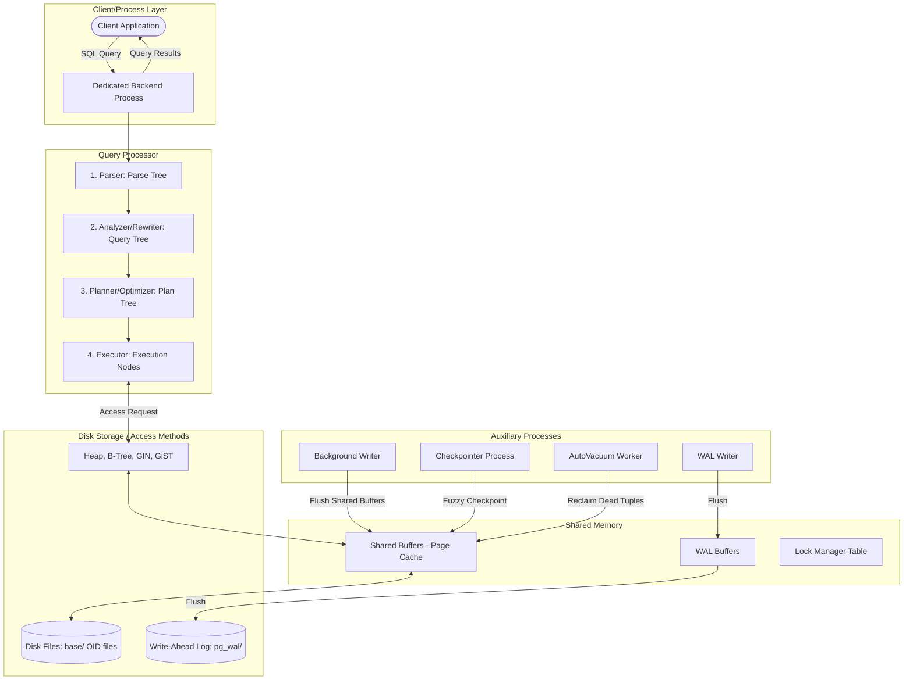

# Topic 2: PostgreSQL Internal Architecture

This document explores the deep internal architecture of the **PostgreSQL** database engine. It provides a detailed breakdown of core subsystems, memory managers, indexing access methods, transaction isolation mechanisms, and execution analytics.

---

## 1. Problem Background

### History and Context
PostgreSQL was engineered to support highly complex, extensible, and scalable relational workloads. From its origins at UC Berkeley as the *Postgres* project, the system was designed with a major focus on:
1.  **Reliability and Correctness**: Adhering strictly to ACID properties.
2.  **Extensibility**: Allowing developers to define custom data types, operators, index types, and procedural extensions without restarting or recompiling the core database.
3.  **High Concurrency**: Allowing multiple users to read and write data simultaneously without blocking each other, achieved via Multi-Version Concurrency Control (MVCC).

---

## 2. Architecture Overview

PostgreSQL uses a multi-process architecture where a primary postmaster process spawns worker backends to handle client connections. The database's execution pipeline passes SQL through parsing, planning, and execution phases, interacting with shared memory and the disk storage system.

### High-Level Internals Architecture Diagram



### Main System Components

1.  **Shared Buffers**: A shared memory cache pool that stores database pages (tables and indexes) in memory to avoid slow disk reads.
2.  **Access Methods**: Code layers (such as `heapam`, `nbtree`) that know how to read, write, and search specific physical formats.
3.  **Buffer Manager**: Coordinates the loading and unloading of pages in and out of the shared buffers, applying page replacement and locking.
4.  **Transaction & MVCC Manager**: Manages transaction states (active, committed, aborted) and calculates the visibility of individual rows.
5.  **WAL (Write-Ahead Log) Subsystem**: Guarantees transaction durability by logging all modifications sequentially before they are written to data files on disk.

---

## 3. Internal Design

### Buffer Manager (`src/backend/storage/buffer/`)

The buffer manager regulates the movement of data pages (8 KB blocks) between disk and RAM.

#### Shared Buffers & Page Caching
*   When a backend process needs a page, it requests it from the Buffer Manager.
*   The Buffer Manager checks the *Buffer Lookup Hash Table* (which maps page tag `[Tablespace OID, Database OID, Relation OID, Block Number]` to buffer index).
*   If found (cache hit), the buffer is pinned (reference count incremented) and returned.
*   If not found (cache miss), the Buffer Manager reads the page from disk into a free buffer slot.

#### Buffer Replacement Algorithm (Clock Sweep)
If all buffer slots are full when a cache miss occurs, the Buffer Manager must evict a page using the **Clock Sweep** algorithm:
1.  A cursor (the "hand" of the clock) sweeps sequentially through the array of buffer headers.
2.  For each buffer, it checks:
    *   **Is it pinned?** (RefCount > 0). If pinned, it cannot be evicted. The hand moves to the next buffer.
    *   **Is its usage count > 0?** If yes, the usage count is decremented by 1, and the hand moves on. This protects frequently accessed pages (MRU).
    *   **Is usage count == 0 and unpinned?** This buffer is selected for eviction.
3.  **Dirty Pages**: If the selected page has been modified (is dirty), the Buffer Manager must write it to disk before evicting it. To obey the *Write-Ahead Logging* rule, it ensures that the WAL record covering the page modification has *already* been flushed to disk first.

```
       [Clock Sweep Pointer]
                 |
                 v
        +-----------------+
        | Buffer Index: 0 |  Usage Count: 2  --> Decremented to 1, Sweep moves on
        +-----------------+
        | Buffer Index: 1 |  Usage Count: 0, RefCount: 0  --> SELECTED FOR EVICTION!
        +-----------------+
        | Buffer Index: 2 |  Usage Count: 1, RefCount: 1  --> Pinned, Sweep moves on
        +-----------------+
```

---

### B-Tree Implementation (`src/backend/access/nbtree/`)

PostgreSQL's default index type is the B-Tree, implementing the concurrent B-Tree algorithm proposed by **Lehmann & Yao (1981)**.

#### Index Structure & Page Layout
*   Unlike tables (which are unsorted heaps), index pages are sorted and structured as B-Trees.
*   **Horizontal Right-Links**: Every B-Tree page contains a pointer (`t_next`) linking to its immediate right sibling at the same level.
*   **High Key**: The right-most key on any B-Tree page (except the right-most page in a level) represents the *High Key*, which acts as an upper bound for all keys on that page.

```
        +--------------------+          +--------------------+
        | Internal Page A    |          | Internal Page B    |
        | [keys]  [right-ptr]---------->| [keys]  [right-ptr]|
        +---------|----------+          +--------------------+
                  |
                  v (downward link)
        +--------------------+          +--------------------+
        | Leaf Page A        |          | Leaf Page B        |
        | [keys]  [right-ptr]---------->| [keys]  [right-ptr]|
        +--------------------+          +--------------------+
```

#### Page Splits and Lehmann & Yao Concurrency
*   *The Split Problem*: In a traditional B-Tree, splitting a leaf page requires locking both the leaf and its parent to insert the split key. This creates high lock contention.
*   *The Lehmann & Yao Solution*:
    1.  When a leaf page splits, the worker creates a new right-sibling page, moves half the keys into it, and links the original page to it using the horizontal `right-link`.
    2.  The parent page is updated *asynchronously* or in a separate step.
    3.  If another backend searches for a key that has migrated to the new right-sibling *before* the parent has been updated, it reads the old page, realizes the search key is greater than the page's *High Key*, and follows the horizontal `right-link` to find it.
    4.  *Result*: Readers do not block writers, and page splits can be done without holding concurrent locks up the tree hierarchy.

---

### MVCC (Multi-Version Concurrency Control)

PostgreSQL implements snapshot-based isolation by storing multiple physical versions (tuples) of the same logical row in the heap table.

#### Heap Tuple Header Fields
Every row on a page has a header containing transaction state metadata:
*   `t_xmin`: The Transaction ID (TxID) of the transaction that inserted the row.
*   `t_xmax`: The TxID of the transaction that updated or deleted the row. For active, non-updated rows, `t_xmax` is `0`.
*   `t_cid`: Command Identifier, tracking the sequential number of commands executed within a single transaction (to see changes made by earlier steps in the same transaction).

```
   Logical Row (ID: 10, Value: 'Old') --Updated--> Value: 'New'

   Physical Heap Representations:
   +-----------------------------------------------+
   | Tuple 1: Value='Old' | xmin=105 | xmax=108    | (Invalidated by Tx 108)
   +-----------------------------------------------+
   | Tuple 2: Value='New' | xmin=108 | xmax=0      | (Active insert by Tx 108)
   +-----------------------------------------------+
```

#### Snapshot Isolation and Visibility Rules
When a transaction begins, PostgreSQL issues a snapshot containing:
*   `xmin`: The earliest TxID that is still active (all transactions older than this are committed and visible).
*   `xmax`: The latest TxID assigned (all transactions created after this are uncommitted and invisible).
*   `active_list`: A list of active transaction IDs between `xmin` and `xmax`.

For any tuple, visibility is computed as:
*   If `t_xmin` is in the `active_list` or > `xmax`, the tuple is **invisible** (inserted by an uncommitted/future transaction).
*   If `t_xmin` is committed and < `xmin`, and `t_xmax` is `0` or aborted, the tuple is **visible**.
*   If `t_xmin` is committed, and `t_xmax` is committed and not active, the tuple is **invisible** (already deleted).

#### AutoVacuum Necessity
Because updates write new tuple versions and deletes simply write `t_xmax`, dead tuples accumulate on disk (bloat). The **VACUUM** process:
1.  Scans heap pages, identifies dead tuples (where `t_xmax` is older than the oldest active transaction snapshot).
2.  Removes pointers in index pages pointing to these dead tuples.
3.  Frees the heap tuple space for future inserts.
4.  **TxID Wraparound Prevention**: Transaction IDs are 32-bit integers (max 4.2 billion). When approaching 2 billion transactions, VACUUM converts older transactions to a special frozen transaction ID (`FrozenTransactionId` = 2) which is always considered committed and visible, preventing data loss.

---

### WAL (Write-Ahead Logging)

WAL is the mechanism that ensures database modifications are durable and crash-resistant.

#### Write-Ahead Logging Principle
Before any page is modified in the shared buffers, a log record describing the modification is written to the WAL Buffer.
*   **The Crucial Rule**: The WAL record *must* be flushed to disk (`pg_wal/`) before the corresponding modified data page can be written to disk.
*   This guarantees that if the system crashes, the logs contain a complete history of changes, allowing the database to rebuild the files.

#### Crash Recovery
When PostgreSQL boots after an unclean shutdown:
1.  It reads the `global/pg_control` file to find the latest checkpoint location.
2.  It begins reading the WAL files from that checkpoint forward (the **REDO** phase).
3.  For each WAL record, it compares the record's **LSN** (Log Sequence Number) to the LSN stored in the page header on disk.
4.  If `WAL LSN > Page LSN`, the modification is re-applied (redo). If `WAL LSN <= Page LSN`, the change is already present on disk, and it is skipped.

#### Checkpointing
Checkpointing is the process of syncing all dirty shared buffers to disk to create a safe boundary:
1.  A checkpointer process issues a checkpoint record in the WAL.
2.  It begins writing all dirty buffers to disk.
3.  To prevent I/O spikes (which would stall active queries), PostgreSQL uses **Fuzzy Checkpointing**. It spreads the writes over a long period (`checkpoint_completion_target`, e.g., 90% of the checkpoint interval).

---

## 4. Design Trade-Offs

PostgreSQL's internal design choices present distinct trade-offs:

1.  **Append-only Heap updates (MVCC) vs. In-place Updates (Clustered Index)**:
    *   *Advantage*: Updates are fast because they are appended to any free slot in the heap. Since indexes point to physical TIDs, index leaf pages do not need to split or rearrange data on update unless index keys themselves change.
    *   *Disadvantage*: Table bloat occurs. High write workloads require aggressive VACUUMing, which consumes CPU and disk I/O.
2.  **Multi-process Model vs. Multi-threading**:
    *   *Advantage*: Process isolation. If a backend crashes (e.g. from an out-of-memory error or custom C extension bug), it does not corrupt the memory of other backends or crash the database cluster.
    *   *Disadvantage*: Context switching overhead is higher, and spawning a new connection is expensive. PostgreSQL requires a connection pooler for high connection counts.

---

## 5. Experiments / Observations

### EXPLAIN ANALYZE Walkthrough

To see how the query planner utilizes collected statistics, let's analyze the execution plan of a join query on a database with tables `users` (10,000 rows) and `posts` (500,000 rows):

```sql
EXPLAIN ANALYZE 
SELECT u.username, p.title 
FROM users u 
JOIN posts p ON u.id = p.user_id 
WHERE u.status = 'active';
```

#### Output Query Plan

```text
Hash Join  (cost=308.15..15240.50 rows=4500 width=32) (actual time=2.120..42.155 rows=4492 loops=1)
  Hash Cond: (p.user_id = u.id)
  ->  Seq Scan on posts p  (cost=0.00..8920.00 rows=500000 width=16) (actual time=0.011..21.840 rows=500000 loops=1)
  ->  Hash  (cost=305.00..305.00 rows=250 width=20) (actual time=2.080..2.080 rows=248 loops=1)
        Buckets: 1024  Batches: 1  Memory Usage: 15kB
        ->  Seq Scan on users u  (cost=0.00..305.00 rows=250 width=20) (actual time=0.015..1.920 rows=248 loops=1)
              Filter: (status = 'active'::text)
              Rows Removed by Filter: 9752
Planning Time: 0.285 ms
Execution Time: 43.112 ms
```

#### Planner Estimates vs. Actual Execution
*   **Estimates**: The planner estimated `250` rows from the `users` table would match the filter `status = 'active'`. It estimated `4500` rows would result from the join.
*   **Actuals**: The executor scanned `users`, filtered out `9752` rows, and found exactly `248` active users. The final join output was `4492` rows.
*   *Observation*: The estimates were extremely accurate (250 estimated vs 248 actual; 4500 estimated vs 4492 actual). Because the active user count was small, the planner chose to scan the `users` table, construct a Hash Table in memory (using only 15 KB), and stream the `posts` table through a sequential scan to probe the hash table.

#### Statistics and `pg_statistic`
How did the planner estimate `250` rows for `status = 'active'`?
*   The `ANALYZE` daemon collects database statistics and stores them in the system catalog `pg_statistic` (exposed via the user-friendly view `pg_stats`).
*   For the column `status`, `pg_stats` records:
    *   `n_distinct`: Number of distinct values (e.g. `4` distinct statuses).
    *   `most_common_vals` (MCVs): E.g., `{'inactive', 'active', 'suspended', 'pending'}`.
    *   `most_common_freqs` (MCFs): E.g., `{'0.95', '0.025', '0.015', '0.01'}`.
*   *The Math*: Since the frequency of `active` is `0.025`, and total rows is `10,000`, the planner calculates:
    $$\text{Estimated Rows} = 10,000 \times 0.025 = 250$$
*   If statistics become stale, the planner's estimates drift, leading to poor execution plans (e.g., choosing a Nested Loop with index scan instead of a Hash Join, increasing execution times by orders of magnitude).

---

## 6. Key Learnings

1.  **Strict Write-Ahead Constraints**: Data integrity is maintained by ensuring log entries are written to disk before the actual data pages. If a page goes to disk before its WAL record and the power cuts, crash recovery is impossible.
2.  **Stat-Driven Optimization**: The query planner is only as good as its statistics. Stale data in `pg_statistic` leads to terrible plan choices. Running autovacuum regularly is critical not just for dead tuple cleanup, but to run statistics updates.
3.  **Concurrency without Parent Locking**: Lehmann & Yao B-Tree horizontal right-links are an elegant solution to tree-split concurrency, allowing search operations to descend the tree without getting blocked by active page-level splits.
