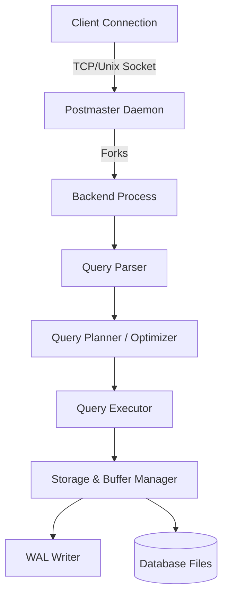

# PostgreSQL Internals: Architecture and Design Discussion

## 1. Problem Background
PostgreSQL was designed to be a highly extensible, robust, and standards-compliant object-relational database management system. Born from the POSTGRES project at UC Berkeley, its primary goal was to handle complex workloads while guaranteeing ACID properties (Atomicity, Consistency, Isolation, Durability) even in concurrent multi-user environments. Over time, features like MVCC, extensible indexing (B-Tree, GiST, GIN), and robust write-ahead logging (WAL) were integrated to tackle the growing scale of enterprise data processing.

## 2. Architecture Overview
PostgreSQL uses a client-server architecture with a process-per-user model. The central component is the `postmaster` daemon, which listens for incoming connections and forks a new backend process for each client.

Data flows from the client to the parser, which generates a parse tree. The planner optimizes this into an execution plan using statistical data. Finally, the executor interfaces with the buffer manager to fetch or modify data, while the WAL manager ensures durability.

## 3. Internal Design

### Buffer Manager (`src/backend/storage/buffer/`)
The Buffer Manager is responsible for mediating all I/O operations between PostgreSQL and the OS filesystem.
- **Shared Buffers:** PostgreSQL uses a shared memory segment to cache pages (typically 8KB). All backend processes access this pool.
- **Page Caching & Replacement:** It employs a clock-sweep algorithm (a variant of LRU) for buffer replacement. Each buffer header contains a usage count that increments when accessed and decrements during the clock sweep. If the count reaches zero, the page is evicted.
- **Reads and Writes:** Data is read from disk into shared buffers. Modifications are done in-memory (marking the page as "dirty"). Background writer processes periodically flush dirty pages to disk, reducing the I/O load on individual query execution.

### B-Tree Implementation (`nbtree`)
PostgreSQL's default index structure is the B-Tree, highly optimized for equality and range queries.
- **Index Structure & Page Layout:** Pages are divided into meta pages, root pages, internal pages, and leaf pages. Each leaf page stores index tuples pointing to heap tuples (CTIDs).
- **Search Path:** Traverses from the root, performing binary searches within internal pages to find the appropriate child pointer, until the leaf page is reached.
- **Insert Operations & Page Splits:** When inserting a new tuple, if a leaf page is full, it splits into two. PostgreSQL's `nbtree` implementation handles concurrent access gracefully using a technique based on the Lehman-Yao algorithm, taking lightweight locks (LWLocks) on pages and using "right links" to allow concurrent readers to traverse without blocking writers.

### MVCC (Multi-Version Concurrency Control)
Instead of locking rows for reading and writing, PostgreSQL keeps multiple versions of a row (tuple).
- **Tuple Versioning (xmin/xmax):** Every tuple has hidden system columns: `xmin` (the Transaction ID that created it) and `xmax` (the Transaction ID that deleted or updated it).
- **Visibility Rules:** A snapshot records which transactions were active at the start of a query. A tuple is visible to a transaction if its `xmin` committed before the snapshot was taken, and its `xmax` is either blank or committed after the snapshot.
- **Snapshot Isolation:** This guarantees that readers don't block writers, and writers don't block readers, enabling high concurrency while preventing phenomena like dirty reads and non-repeatable reads.

### WAL (Write Ahead Logging)
WAL is PostgreSQL's mechanism for ensuring durability and crash recovery.
- **WAL Records:** Any change to the database (heap, index, or system catalogs) generates a WAL record. These records are sequentially written to the WAL buffer and flushed to disk before the actual data pages are flushed.
- **Durability Guarantees:** This ensures that if the database crashes, the WAL can be replayed to recreate any committed transactions that hadn't yet been safely written to the data files.
- **Checkpointing:** Periodically, PostgreSQL issues a checkpoint, flushing all dirty buffers to disk and logging the checkpoint location in the WAL. This bounds the time required for crash recovery.

## 4. Design Trade-Offs

### Advantages
- **High Concurrency:** MVCC allows massive read-write concurrency without severe locking contention.
- **Reliability:** Strict WAL implementation ensures robust crash recovery.
- **Extensibility:** The modular executor and index API permit custom data types and access methods.

### Limitations & Trade-Offs
- **Update Heavy Workloads (Table Bloat):** Because updates create new tuple versions rather than overwriting in place, heavily updated tables accumulate "dead tuples," causing bloat. This requires periodic `VACUUM` processes to reclaim space, which can consume significant I/O.
- **Process Model Overhead:** The process-per-connection model can be memory-heavy compared to a thread-based model (like MySQL's). Therefore, a connection pooler (e.g., PgBouncer) is practically mandatory for high-connection workloads.

## 5. Experiments / Observations

**EXPLAIN ANALYZE Observation**
Running `EXPLAIN ANALYZE` on a multi-table join reveals the sophisticated cost-based optimizer:
- **Planner Estimates vs. Actuals:** The planner uses `pg_statistic` (updated by `ANALYZE`) to estimate row counts. Misestimations can lead to suboptimal join choices (e.g., Nested Loop instead of Hash Join).
- **Execution Plan:** We observed that for large datasets, the planner favors `Hash Join` or `Merge Join` over `Nested Loop`.
- **Statistics Used:** The query planner utilizes histograms and Most Common Values (MCVs) from `pg_statistic` to calculate selectivity. Accurate statistics are vital; outdated statistics often lead to dramatic performance regressions.

## 6. Key Learnings
- **MVCC is a double-edged sword:** It provides excellent concurrency but shifts the burden to the `VACUUM` maintenance process.
- **I/O Optimization:** The separation of WAL logging (sequential I/O) from data page flushes (random I/O) is a masterclass in performance engineering.
- **Query Optimization is Data-Driven:** The PostgreSQL query planner's effectiveness is entirely bound to the accuracy of internal statistics, highlighting why regular `ANALYZE` maintenance is crucial.
