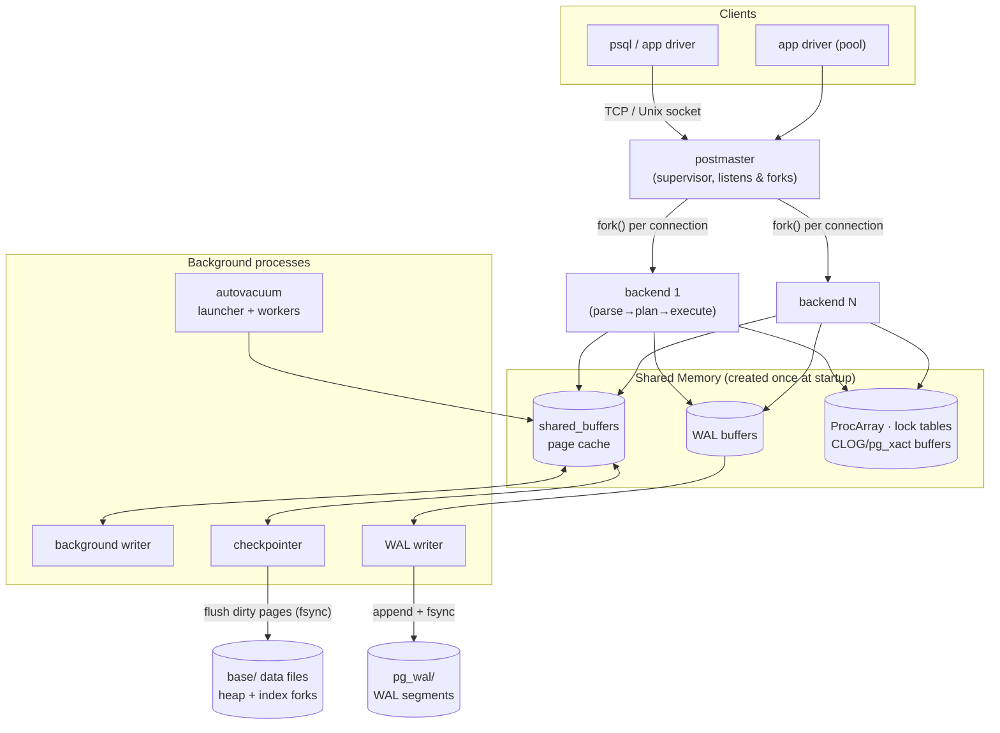
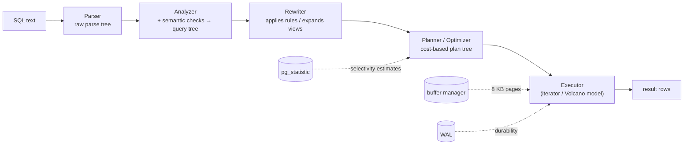
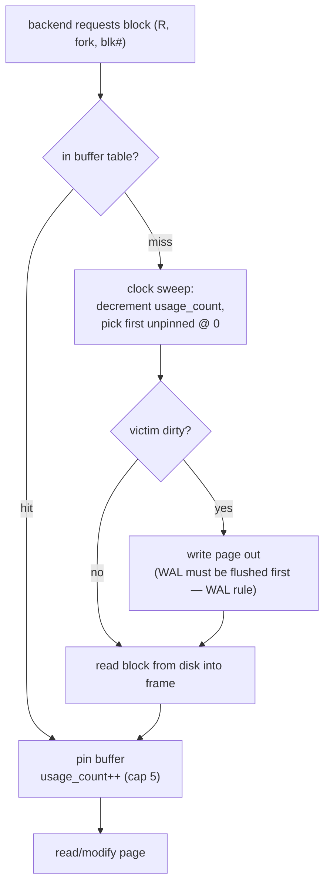
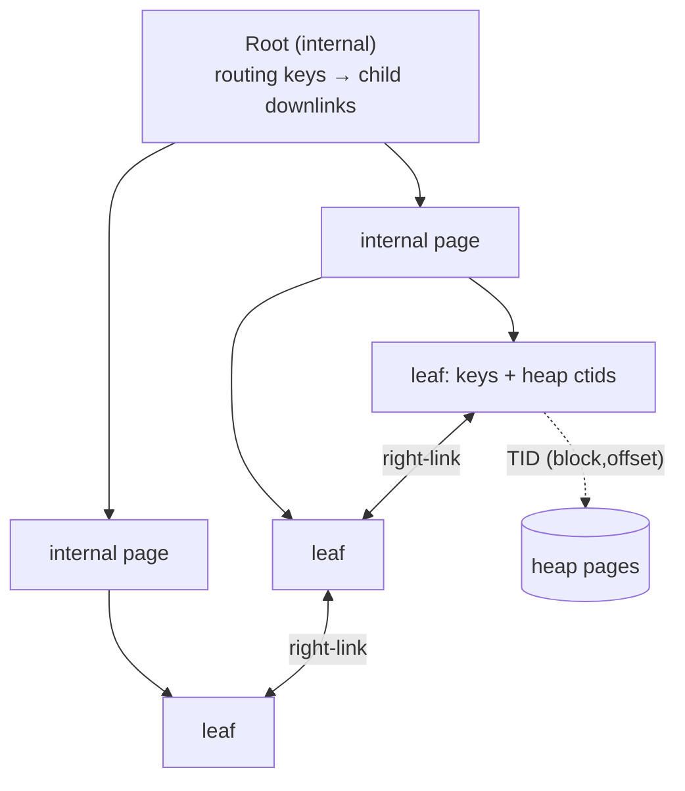
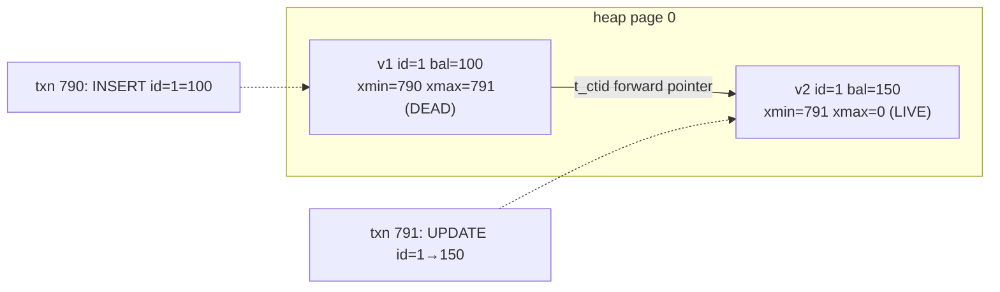
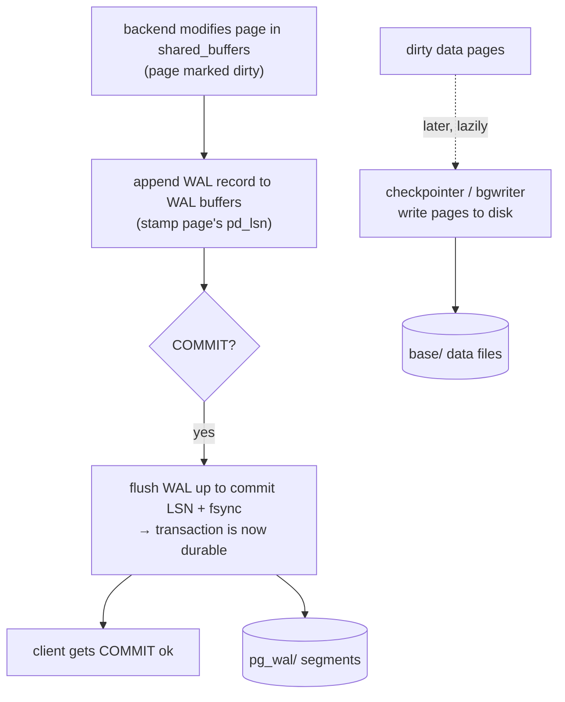

# PostgreSQL Internal Architecture

> A study of how PostgreSQL stores data, manages memory, organizes indexes, isolates
> transactions, and survives crashes — and *why* it makes the engineering choices it does.
>
> Every plan, statistic, page dump, and measurement in the **Experiments** section was
> captured live against **PostgreSQL 16.13** on a dataset of 50k customers / 300k orders /
> 900k order-items. Nothing here is copied from the docs; the reasoning and the numbers are
> first-hand.

---

## Table of Contents

1. [Problem Background](#1-problem-background)
2. [Architecture Overview](#2-architecture-overview)
3. [Internal Design](#3-internal-design)
   - [3.1 Storage structures — heap, pages, tuples](#31-storage-structures--heap-pages-tuples)
   - [3.2 Memory management — the buffer manager](#32-memory-management--the-buffer-manager)
   - [3.3 Index organization — the nbtree B-Tree](#33-index-organization--the-nbtree-b-tree)
   - [3.4 Transaction processing & MVCC](#34-transaction-processing--mvcc)
   - [3.5 Concurrency control](#35-concurrency-control)
   - [3.6 Recovery — WAL, checkpoints, crash recovery](#36-recovery--wal-checkpoints-crash-recovery)
   - [3.7 The query planner and statistics](#37-the-query-planner-and-statistics)
4. [Design Trade-Offs](#4-design-trade-offs)
5. [Experiments / Observations](#5-experiments--observations)
6. [Key Learnings](#6-key-learnings)
7. [References](#7-references)

---

## 1. Problem Background

### Why this system exists

PostgreSQL descends from the **POSTGRES** project led by Michael Stonebraker at UC Berkeley
(started 1986). Its predecessor, Ingres, was a "pure" relational system. POSTGRES set out to
fix what Stonebraker considered the two biggest gaps in commercial relational databases of
the era:

1. **A poor type system** — real applications need richer types (geometric data, arrays,
   user-defined types), inheritance, and rules. POSTGRES was *object-relational*.
2. **No clean story for time-travel and concurrency** — POSTGRES introduced a **no-overwrite
   storage manager**: updates never overwrote data in place; they wrote new versions. This
   idea survives today as PostgreSQL's MVCC model and is the single most consequential
   architectural decision in the system.

POSTGRES originally used its own query language, **PostQUEL**. In 1994 SQL was bolted on and
the project was renamed **Postgres95**, then **PostgreSQL** in 1996 to signal "Postgres + SQL".

### The problem it solves today

PostgreSQL targets the **general-purpose OLTP + analytical** workload for **multi-user,
concurrent, durable, correctness-critical** systems: the database behind a bank, a SaaS
backend, a logistics platform. The design priorities, in order, are roughly:

> **Correctness and durability first, standards compliance and extensibility second, raw
> single-query throughput third.**

This ordering explains nearly every trade-off in the rest of this document. PostgreSQL would
rather be *provably correct under concurrency and crashes* than win a micro-benchmark.

---

## 2. Architecture Overview

### Process model: one OS process per connection

PostgreSQL is a **client–server**, **process-per-connection** system. A supervisor process
(the **postmaster**) listens on a socket and `fork()`s a dedicated **backend** process for
each client connection. Backends do not share an address space; they cooperate exclusively
through a **shared memory** region created at startup. A set of **background processes**
handles work that spans all backends (flushing dirty pages, writing WAL, vacuuming, etc.).



**Why processes, not threads?** Isolation and crash-safety. If one backend segfaults, the
postmaster can detect it, reset shared memory, and keep the cluster alive without the bug
corrupting other sessions' private memory. It also predates portable threading and inherits
robust copy-on-write semantics from the OS. The cost — addressed in
[§4](#4-design-trade-offs) — is that each connection is relatively heavyweight, so high
connection counts need external pooling (PgBouncer).

### Data flow of a single query



The executor pulls tuples through a tree of nodes (one `next()` call at a time — the
**Volcano/iterator** model), reading pages via the buffer manager and emitting WAL for any
modification.

---

## 3. Internal Design

### 3.1 Storage structures — heap, pages, tuples

A table is stored as a **heap**: one or more 1 GB segment files of fixed-size **8 KB pages**.
"Heap" means **unordered** — rows live wherever there is free space; there is no clustered
primary key (contrast with InnoDB, [§4](#4-design-trade-offs)). Each relation actually has
several **forks**:

| Fork | File | Purpose |
|------|------|---------|
| main | `base/<db>/<relfilenode>` | the heap pages (the actual rows) |
| fsm  | `..._fsm` | **Free Space Map** — which pages have room for inserts |
| vm   | `..._vm`  | **Visibility Map** — which pages are all-visible / all-frozen (enables index-only scans & skips VACUUM) |

#### Page layout (the 8 KB page)

```
 0                                                                8192
 +----------------+--------------------------------+-----------------+
 | PageHeaderData | ItemId array (line pointers) → | ... free ...    |
 +----------------+--------------------------------+-----------------+
 |                          ← tuples grow upward    [special space]  |
 +-------------------------------------------------------------------+
   lower ────────►                          ◄──────── upper

 - PageHeader: pd_lsn (last WAL change), checksum, free-space pointers.
 - ItemId (line pointer): {offset, length, flags} — 4 bytes, an indirection
   slot. Indexes point at line pointers, NOT at physical tuple offsets, so a
   tuple can be moved within a page (during VACUUM) without touching indexes.
 - Tuples grow from the end toward the middle; line pointers grow from the
   front. The page is full when they meet.
```

A **heap tuple** is `HeapTupleHeaderData` + a null bitmap + the user data. The header carries
the MVCC bookkeeping that powers the whole concurrency model: `t_xmin`, `t_xmax`, `t_cid`,
`t_ctid`, and `t_infomask` hint bits (covered in [§3.4](#34-transaction-processing--mvcc)).

Values too large for a page are pushed out-of-line by **TOAST** (The Oversized-Attribute
Storage Technique): large columns are compressed and/or sliced into chunks stored in a side
table, leaving only a pointer in the main tuple. This keeps the common case — small rows —
densely packed.

> **Source:** `src/backend/storage/page/`, `src/include/storage/bufpage.h`,
> `access/heap/heapam.c`.

### 3.2 Memory management — the buffer manager

PostgreSQL never reads or writes a heap/index page directly from disk in the executor. Every
page access goes through the **buffer manager**, which caches pages in the `shared_buffers`
region of shared memory (default 128 MB; production setups use a large fraction of RAM).

**Lookup path.** A backend that wants page *P* of relation *R*:

1. Computes a **BufferTag** `(relation, fork, block#)` and hashes it into a shared **buffer
   table** (a partitioned hash table — partitioned so different backends lock different
   partitions and don't serialize).
2. **Hit:** the tag is present → pin the buffer (increment its ref count so it can't be
   evicted), read it, unpin.
3. **Miss:** find a victim buffer via the replacement policy, evict it (writing it back if
   dirty), read *P* from disk into that frame, register the new tag, pin it.

**Replacement policy — clock sweep, not LRU.** Each buffer has a `usage_count` (0–5). A
"clock hand" sweeps the buffer array; on each buffer it decrements `usage_count`, and the
first buffer it finds at 0 *and* unpinned becomes the victim. Frequently touched pages keep
getting their count bumped on access and survive; cold pages decay to 0 and get evicted. This
approximates LRU at **O(1)** with no per-access list manipulation and far less lock
contention than a true LRU list — critical when dozens of backends hit the cache
concurrently.



**Two protections against thrashing:**

- **Ring buffers (BufferAccessStrategy):** a large sequential scan or bulk `COPY`/`VACUUM`
  uses a small ring of buffers instead of flooding the whole cache, so one big scan can't
  evict everyone else's hot working set.
- **The WAL rule:** a dirty page may not be written to disk until the WAL describing its
  change is on durable storage (see [§3.6](#36-recovery--wal-checkpoints-crash-recovery)).

**Double buffering.** PostgreSQL deliberately keeps `shared_buffers` modest and *relies on
the OS page cache* as a second tier — so a page can live in both. This is a conscious
trade-off: it cedes some RAM efficiency in exchange for portability and letting the kernel's
mature readahead/writeback do part of the job.

> **Source:** `src/backend/storage/buffer/bufmgr.c`, `freelist.c`, `buf_table.c`.

### 3.3 Index organization — the nbtree B-Tree

The default index is a **B⁺-Tree** (`access/nbtree`). Keys live in leaf pages; internal pages
only route. The implementation follows **Lehman & Yao**'s high-concurrency B-link tree:
every page stores a **high key** and a **right-link** to its right sibling, which lets a
search that races with a concurrent page split simply "move right" to find its key instead of
locking the whole path. Only a small number of pages are locked at a time, so reads and
writes scale.



- **Search:** start at root, binary-search keys to pick a child, descend to a leaf, binary
  search the leaf, follow the **TID** (`ctid`) to the heap tuple.
- **Insert:** find the target leaf and insert in key order; if the page is full, **split** it
  (~50/50), push a separator key up to the parent, and recurse upward — the only way the tree
  grows in height is a root split.
- **Why it stays shallow:** branching factor is huge (hundreds of keys per 8 KB page), so
  height grows logarithmically and very slowly. In [§5](#5-experiments--observations) a
  310,000-row primary-key index measures **only 2 levels above the leaves** — any row is ~3
  page reads away.

**Index-only scans.** If every column a query needs is in the index *and* the visibility map
says the page is all-visible, PostgreSQL answers from the index alone and never touches the
heap — demonstrated live in [§5](#5-experiments--observations).

Other access methods plug into the same `IndexAM` abstraction: **Hash** (equality only),
**GiST** (geometric / range / nearest-neighbour), **GIN** (inverted index for arrays, JSONB,
full-text), **BRIN** (tiny block-range summaries for naturally-ordered huge tables), **SP-GiST**.

> **Source:** `src/backend/access/nbtree/` (`nbtree.c`, `nbtinsert.c`, `nbtsearch.c`).

### 3.4 Transaction processing & MVCC

This is PostgreSQL's defining feature. **Multi-Version Concurrency Control** means an
`UPDATE` or `DELETE` **never overwrites a row in place**. Instead:

- Every tuple header records **`xmin`** (the transaction ID that *created* this version) and
  **`xmax`** (the transaction that *deleted/superseded* it, or 0 if still live).
- An `UPDATE` is logically a `DELETE` + `INSERT`: it sets `xmax` on the old version and writes
  a brand-new tuple with a fresh `xmin`. Both versions physically coexist on the heap.
- A `DELETE` just stamps `xmax`; the bytes stay until VACUUM.



**Visibility rules.** Each statement runs against a **snapshot** = `{xmin_snapshot,
xmax_snapshot, xip[]}` (the set of transactions still in flight at snapshot time). A tuple
version is visible to a snapshot roughly iff:

> its `xmin` **committed and is in the snapshot's past**, **and** its `xmax` is either 0 or
> belongs to a transaction that had **not committed** as of the snapshot.

Two cheap supporting structures make this fast:

- **CLOG / `pg_xact`:** a compact array storing 2 bits of commit status per transaction
  (in-progress / committed / aborted), so visibility checks don't replay the log.
- **Hint bits** in `t_infomask`: the first reader that resolves a tuple's commit status
  caches it on the tuple (`XMIN_COMMITTED`, `XMAX_INVALID`, …) so later readers skip the CLOG
  lookup entirely.

**HOT (Heap-Only Tuple) updates.** If an `UPDATE` doesn't change any indexed column *and* the
new version fits on the same page, PostgreSQL chains the new version off the old one's line
pointer and **does not touch any index**. This dramatically reduces index write amplification
for the common "update a non-indexed column" case.

**The price: bloat and VACUUM.** Dead versions accumulate. **VACUUM** is the garbage
collector that reclaims dead tuples, updates the FSM/VM, and — crucially — **freezes** old
tuples. Because XIDs are 32-bit and wrap around at ~4 billion, VACUUM must mark sufficiently
old rows as "frozen / always visible" before the counter laps them; otherwise the cluster
risks **transaction-ID wraparound**, which PostgreSQL prevents by refusing new writes. This is
why **autovacuum** is not optional — it is part of correctness, not just hygiene.

> **Source:** `access/heap/heapam_visibility.c`, `storage/ipc/procarray.c`,
> `access/transam/clog.c`.

### 3.5 Concurrency control

The headline consequence of MVCC: **readers never block writers and writers never block
readers.** A `SELECT` reads from a snapshot of committed versions and is wholly unaffected by
concurrent `UPDATE`s producing new versions.

Writers still need to coordinate with each other:

- **Row locks** are stored *on the tuple itself* (in `t_infomask`/`xmax`), not in a giant
  in-memory lock table — so PostgreSQL can hold an essentially unbounded number of row locks
  for free. Two transactions updating the *same* row serialize; updating *different* rows do
  not.
- **The lock manager** (`lmgr`) handles table-level and logical locks with standard modes
  (`ACCESS SHARE` … `ACCESS EXCLUSIVE`) and does deadlock detection via a waits-for graph.
- **Isolation levels:** `READ COMMITTED` (default — a fresh snapshot per statement),
  `REPEATABLE READ` (one snapshot for the whole transaction = true snapshot isolation), and
  `SERIALIZABLE` via **SSI (Serializable Snapshot Isolation)**, which adds lightweight
  **predicate locks** to detect dangerous read-write dependency cycles and aborts a
  transaction to preserve true serializability — without the reader/writer blocking of
  classic two-phase locking.

### 3.6 Recovery — WAL, checkpoints, crash recovery

Durability comes from **Write-Ahead Logging** (WAL), an ARIES-influenced redo log. The
governing invariant:

> **No change to a data page may reach disk before the WAL record describing that change is
> durably flushed.** (The "WAL rule".)

Flow of a committing transaction:



- **The commit is durable as soon as its WAL is fsynced**, even though the actual data pages
  may still be dirty in memory. Sequential WAL appends are far cheaper than scattered random
  writes to data files — this is *why* WAL makes durability affordable.
- **Checkpoints** periodically flush *all* dirty buffers to the data files and record a
  **redo point** in the WAL. Crash recovery only has to replay WAL from the last checkpoint
  forward — bounding recovery time.
- **Full-page writes:** the first modification of a page after a checkpoint logs the *entire
  page image*, protecting against **torn pages** (an 8 KB page partially written across a
  power loss, where the OS/disk sector size is smaller).
- **Crash recovery (redo):** on restart, PostgreSQL finds the last checkpoint's redo point and
  replays every WAL record forward, re-applying changes to pages whose `pd_lsn` is older than
  the record. Committed work is restored; uncommitted work is simply never made visible
  (its tuples fail the visibility test). PostgreSQL's MVCC means there is **no separate
  UNDO pass** — rolling back is "do nothing and let VACUUM clean up later".
- **Replication:** the same WAL stream is shipped to replicas (streaming replication), so
  physical standbys are just machines continuously performing redo.

> **Source:** `src/backend/access/transam/xlog.c`, `xloginsert.c`,
> `storage/buffer/bufmgr.c` (the flush-WAL-before-page rule).

### 3.7 The query planner and statistics

PostgreSQL's optimizer is **cost-based**: it enumerates candidate plans (scan methods × join
methods × join orders) and picks the lowest **estimated cost**, where cost is a weighted sum
of estimated page reads (`seq_page_cost`, `random_page_cost`) and CPU work
(`cpu_tuple_cost`, …).

Those estimates are only as good as the **statistics** in the `pg_statistic` catalog (read
via the `pg_stats` view), gathered by `ANALYZE` / autovacuum:

- **`n_distinct`** — number of distinct values (drives join-size and grouping estimates).
- **`most_common_vals` + `most_common_freqs`** — a frequency table for skewed columns.
- **a histogram** — value distribution for range selectivity (`WHERE x > …`).
- **`correlation`** — how well physical row order matches the column order (near ±1 makes
  index scans cheap because heap fetches become near-sequential).

[§5](#5-experiments--observations) shows these statistics directly and demonstrates the
planner switching from a **parallel hash join** (bulk query) to **nested-loop index scans**
(selective query) purely on the basis of estimated selectivity.

---

## 4. Design Trade-Offs

### 4.1 Append-only MVCC (PostgreSQL) vs. undo-based MVCC (InnoDB)

This is the deepest architectural fork in the relational world, and the assignment explicitly
invites the comparison.

| Dimension | **PostgreSQL** (new version in heap) | **MySQL/InnoDB** (in-place + undo log) |
|---|---|---|
| Update mechanics | Write a new tuple; old stays as dead version | Update row in place; push old image to **undo log** |
| Old versions live in | the **table heap itself** | a separate **undo/rollback segment** |
| Reading old snapshots | just read the older heap version | **reconstruct** by walking undo records backward |
| Rollback cost | ~free (abort → versions never become visible) | must **apply undo** to revert in-place changes |
| Garbage collection | **VACUUM** reclaims dead heap tuples | **purge** threads trim old undo |
| Table organization | unordered **heap** | **clustered** by primary key (table *is* the PK B-Tree) |
| Secondary index points to | physical **TID (ctid)** | the **primary key** value |

**What PostgreSQL buys** with append-only:
- Extremely cheap rollback and no undo-segment contention.
- Readers fully decoupled from writers with simple, fast snapshot checks.
- A clean physical/logical separation (TIDs) that makes HOT and online operations possible.

**What it pays:**
- **Bloat** — dead tuples occupy space until VACUUM, and a heavily updated table can grow far
  beyond its live size.
- **VACUUM cost and tuning** — autovacuum must keep up or bloat and wraparound risk grow.
- **Index write amplification** — a non-HOT update touches *every* index on the table (each
  needs a new pointer to the new version). InnoDB's in-place update avoids this for indexes
  that don't cover the changed column.
- **No clustering for free** — range scans on the primary key aren't physically sequential
  unless you `CLUSTER` (a one-shot, non-maintained reorganization).

**What InnoDB buys** with clustered storage + undo:
- Primary-key range scans are physically sequential — excellent for PK-ordered access.
- A PK point lookup finds the row *in the index leaf* (no separate heap fetch).
- No table bloat from dead versions in the main structure (old images live in undo).

**What it pays:**
- Secondary-index lookups cost an **extra** PK-index traversal (index → PK → clustered row).
- A large/changing PK is expensive (every secondary index stores the PK; page splits move
  real rows).
- Reconstructing old versions and rolling back are work proportional to undo size.

> **Why did PostgreSQL choose differently?** It inherited POSTGRES's no-overwrite store, and
> that model gives the *cleanest possible* concurrency semantics (the thing PostgreSQL
> prioritizes). The cost — VACUUM — was deemed acceptable and has been engineered down over
> decades (HOT updates, visibility map, parallel/auto vacuum).

### 4.2 Process-per-connection

- **Pro:** strong isolation, crash containment, OS-level simplicity, robust copy-on-write.
- **Con:** each connection costs memory and a `fork()`; thousands of idle connections waste
  resources and the ProcArray/snapshot machinery scales with connection count. **Mitigation:**
  external connection poolers (PgBouncer) or built-in pooling, keeping backend count near the
  core count.

### 4.3 WAL durability vs. write amplification

- **Pro:** commits are cheap (sequential fsync), crash recovery is bounded, and the same log
  drives replication and PITR for free.
- **Con:** every change is written twice (WAL + data file), and full-page writes after a
  checkpoint inflate WAL volume. Tunable via checkpoint spacing and `wal_compression`.

### 4.4 Reliance on the OS page cache (double buffering)

- **Pro:** portability, simpler memory management, free kernel readahead/writeback.
- **Con:** a page can sit in both `shared_buffers` and the OS cache (wasted RAM), and
  PostgreSQL has less direct control over I/O than a system using `O_DIRECT`.

---

## 5. Experiments / Observations

All output below was captured on **PostgreSQL 16.13** against the schema:
`customers (50k)` → `orders (300k)` → `order_items (900k)`, plus `products (1k)`, after
`ANALYZE`. Commands and full transcripts are reproducible from the queries shown.

### 5.1 A multi-table join plan — estimates vs. actuals

```sql
EXPLAIN (ANALYZE, BUFFERS)
SELECT c.country, p.category, SUM(oi.quantity) AS units
FROM customers c
JOIN orders o       ON o.customer_id = c.customer_id
JOIN order_items oi ON oi.order_id   = o.order_id
JOIN products p     ON p.product_id  = oi.product_id
WHERE c.country = 'IN' AND o.status = 'complete'
GROUP BY c.country, p.category
ORDER BY units DESC;
```

Abridged plan (full plan was 60 lines):

```
 Sort  (actual time=47.054..48.005 rows=4 loops=1)
   ->  Finalize GroupAggregate
         ->  Gather Merge   Workers Planned: 2  Workers Launched: 2
               ->  Partial HashAggregate
                     ->  Hash Join  (cost=5763..16221 rows=52590) (actual rows=30000 loops=3)
                           Hash Cond: (oi.product_id = p.product_id)
                           ->  Parallel Hash Join  (rows=52590) (actual rows=30000 loops=3)
                                 Hash Cond: (oi.order_id = o.order_id)
                                 ->  Parallel Seq Scan on order_items oi  (actual rows=300000 loops=3)
                                 ->  Parallel Hash
                                       ->  Hash Join (rows=24748) (actual rows=10000)
                                             ->  Parallel Seq Scan on orders o
                                                   Filter: (status = 'complete')
                                                   Rows Removed by Filter: 30000
                                             ->  Bitmap Heap Scan on customers c
                                                   Recheck Cond: (country = 'IN')
                                                   ->  Bitmap Index Scan on idx_customers_country
                                                         (actual rows=10000)
 Planning Time: 1.199 ms
 Execution Time: 48.092 ms
```

**Observations:**

- **The planner chose different access methods per table from cost alone:** a **Bitmap Index
  Scan** on `customers` (the `country='IN'` predicate hits ~20% of rows — selective enough for
  the index, not so selective as a plain index scan), but **parallel sequential scans** on
  `orders` and `order_items` (the join touches a large fraction, so scanning beats random
  index I/O).
- **Estimates were excellent where statistics are rich:** the `country='IN'` branch estimated
  **10045** rows vs **10000** actual — because `pg_stats` knew the country distribution
  exactly (see §5.3). The join cardinality estimate (52,590 vs 30,000 actual) is looser, the
  classic difficulty of estimating *correlated* multi-join selectivity.
- **It parallelized** (2 workers) and split the aggregate into **Partial HashAggregate →
  Gather Merge → Finalize**, a textbook parallel-aggregation plan.
- **`BUFFERS`** reported `shared hit=8215 read=10` — almost the entire working set served from
  `shared_buffers`; only 10 pages came from disk.

### 5.2 The planner adapts: same join, selective filter → nested-loop index scan

```sql
EXPLAIN (ANALYZE)
SELECT o.order_id, oi.product_id, oi.quantity
FROM orders o JOIN order_items oi ON oi.order_id = o.order_id
WHERE o.customer_id = 12345;
```
```
 Nested Loop  (cost=4.89..121.34 rows=17) (actual rows=18 loops=1)
   ->  Bitmap Heap Scan on orders o  (rows=6) (actual rows=6)
         ->  Bitmap Index Scan on idx_orders_customer  (Index Cond: customer_id = 12345)
   ->  Index Scan using idx_items_order on order_items oi  (actual rows=3 loops=6)
         Index Cond: (order_id = o.order_id)
```

Same logical join as §5.1, **completely different physical plan**. Because only one customer
is selected (~6 orders, ~18 items), the optimizer chose **nested-loop joins driven by index
scans** instead of building hash tables over 900k rows. Estimate **17** vs actual **18** — the
statistics-driven cardinality model is nearly exact here. This is cost-based optimization
doing exactly what it should: *the best plan depends on selectivity, and selectivity comes
from statistics.*

### 5.3 The statistics that drove those decisions (`pg_stats`)

```sql
SELECT attname, n_distinct, most_common_vals, most_common_freqs, correlation
FROM pg_stats WHERE tablename IN ('orders','customers')
  AND attname IN ('status','country','customer_id');
```
```
 attname     | n_distinct | most_common_vals             | most_common_freqs                  | correlation
-------------+------------+------------------------------+------------------------------------+------------
 country     |      5     | {US,IN,DE,UK,SG}             | {0.201,0.201,0.201,0.199,0.198}    |  0.204
 status      |      3     | {complete,pending,cancelled} | {0.698,0.199,0.103}                |  0.538
 customer_id |     -1     |                              |                                    |  1.000   (customers.PK)
 customer_id | -0.16987   |                              |                                    |  0.161   (orders.FK)
```

This is *exactly* the information behind §5.1–5.2:
- `country` has 5 nearly-equal values → estimating `'IN'` ≈ 20% of 50k = **10,045** rows
  (matched the actual 10,000).
- `status` MCV frequency for `'complete'` is **0.698** → estimating ~70% of orders pass the
  filter (actual: 70k of 100k per worker).
- `n_distinct = -1` on the PK means "**unique** — distinct count tracks row count"; the
  negative form is a *ratio*, which keeps estimates correct as the table grows.
- `correlation = 1.0` on the PK explains why PK range scans are cheap (physical order matches
  key order).

### 5.4 MVCC tuple versioning, observed on the raw heap

```sql
CREATE TABLE account (id int PRIMARY KEY, balance int);
INSERT INTO account VALUES (1,100),(2,200);
SELECT ctid, xmin, xmax, * FROM account;          -- (0,1) xmin=790 ; (0,2) xmin=790
UPDATE account SET balance = 150 WHERE id = 1;
SELECT ctid, xmin, xmax, * FROM account;          -- id=1 now at (0,3) xmin=791
```

Visible rows after the update — note id=1 **moved** to a new ctid:
```
 ctid  | xmin | xmax | id | balance
-------+------+------+----+--------
 (0,3) |  791 |    0 |  1 |     150     <- new version
 (0,2) |  790 |    0 |  2 |     200
```

Peeking at the **physical page** (via `pageinspect`) shows *both* versions of id=1 still
present:
```sql
SELECT lp, t_ctid, t_xmin, t_xmax FROM heap_page_items(get_raw_page('account', 0));
```
```
 lp | t_ctid | t_xmin | t_xmax
----+--------+--------+--------
  1 | (0,3)  |   790  |   791    <- DEAD: created by 790, deleted by 791, forward-pointer → (0,3)
  2 | (0,2)  |   790  |     0    <- live (id=2, untouched)
  3 | (0,3)  |   791  |     0    <- LIVE new version of id=1
```

This is MVCC made tangible: the `UPDATE` did **not** overwrite line pointer 1; it stamped its
`xmax=791`, set a forward pointer to the new tuple, and appended the new version at lp 3.
After `VACUUM account`, the dead version is reclaimed (`n_live_tup = 2`). This is precisely
the mechanism — and the cost — discussed in [§3.4](#34-transaction-processing--mvcc) and
[§4.1](#41-append-only-mvcc-postgresql-vs-undo-based-mvcc-innodb).

### 5.5 B-Tree height — why index lookups are 3 reads

```sql
SELECT root, level AS height FROM bt_metap('orders_pkey');   -- root=412, level=2
SELECT pg_size_pretty(pg_relation_size('orders_pkey')), pg_relation_size('orders_pkey')/8192;
                                                             -- 6816 kB, 852 pages, 310000 rows
SELECT blkno, type, live_items FROM bt_page_stats('orders_pkey', 412);  -- root: type 'r', 3 downlinks
```

A **310,000-row** primary-key index is **852 pages** but only **2 levels above the leaves**
(root → internal → leaf). The root has just **3** downlinks. So locating any key is ~**3 page
accesses**, all typically buffer-cache hits. A leaf entry stores the key plus the heap TID:

```
 itemoffset | ctid  | data (key, little-endian)
------------+-------+--------------------------
          1 | (2,1) | 6f 01 00 ...   <- high key (page's upper bound)
          2 | (0,1) | 01 00 00 ...   <- key 1 → heap tuple (0,1)
          3 | (0,2) | 02 00 00 ...   <- key 2 → heap tuple (0,2)
```

This is the concrete payoff of the high branching factor described in
[§3.3](#33-index-organization--the-nbtree-b-tree).

### 5.6 What's actually in the buffer cache (`pg_buffercache`)

```sql
SELECT c.relname, count(*) AS buffers, pg_size_pretty(count(*)*8192) AS cached
FROM pg_buffercache b JOIN pg_class c ON b.relfilenode = pg_relation_filenode(c.oid)
GROUP BY c.relname ORDER BY buffers DESC;
```
```
   relname   | buffers | cached
-------------+---------+---------
 order_items |    4870 | 38 MB
 orders      |    2163 | 17 MB
 orders_pkey |     825 | 6600 kB
 customers   |     371 | 2968 kB
 products    |      10 | 80 kB
```
With `shared_buffers = 128MB`, the entire hot working set (≈ 65 MB) fits in cache — which is
exactly why §5.1 reported almost no disk reads. The buffer manager's clock-sweep kept the
frequently-scanned `order_items`/`orders` pages resident.

### 5.7 WAL volume per write

```sql
SELECT pg_current_wal_lsn();                               -- before
INSERT INTO orders(customer_id,status) SELECT 1+(g%50000),'pending' FROM generate_series(1,10000) g;
SELECT pg_wal_lsn_diff(<after>, <before>);                 -- 3021 kB
SHOW wal_level;  -- replica   |   SHOW fsync;  -- on
```

10,000 row inserts generated **~3 MB of WAL** (≈ 300 bytes/row including index WAL and
headers) — the concrete write-amplification cost from [§4.3](#43-wal-durability-vs-write-amplification).
With `fsync=on` and `wal_level=replica`, that WAL is both the durability guarantee and the
replication feed.

---

## 6. Key Learnings

1. **One decision colors everything: no-overwrite MVCC.** Append-only versioning is *why*
   readers don't block writers, *why* rollback is free, *why* there's no undo log — and *why*
   VACUUM, bloat, HOT, the visibility map, and XID-freezing all exist. You cannot understand
   PostgreSQL piecemeal; nearly every subsystem is a consequence of this one choice.

2. **The planner is only as smart as `pg_statistic`.** Watching the *same join* become a
   parallel hash join for a bulk query and a nested-loop index scan for a selective one —
   driven entirely by `n_distinct`, MCV frequencies, and correlation — made cost-based
   optimization concrete. Stale statistics, not a "bad optimizer", cause most bad plans.

3. **Estimates degrade predictably.** Single-column predicates on well-analyzed columns were
   near-exact (10045 vs 10000; 17 vs 18). The looser estimate (52590 vs 30000) was on a
   *multi-join* cardinality — the known-hard case of correlated selectivity. This is a useful
   intuition for when to trust the planner and when to add extended statistics.

4. **B-Trees are astonishingly shallow.** A 310k-row index resolves any key in ~3 page reads
   because the branching factor is in the hundreds. "The index is slow" is almost never the
   tree depth — it's heap fetches, low correlation, or the index not being cached.

5. **Durability is cheaper than it looks.** A commit is durable the moment its *sequential*
   WAL fsync completes; the random data-page writes happen lazily at checkpoint time. WAL
   turns "many random durable writes" into "one sequential durable write" — and the very same
   log powers crash recovery, replication, and PITR. One mechanism, four payoffs.

6. **Surprising find: dead and live versions genuinely coexist byte-for-byte.** Seeing two
   physical versions of the same logical row on the same 8 KB page — with the old one's `xmax`
   pointing forward to the new one — turned MVCC from an abstraction into something I could
   point at. It also made the bloat/VACUUM trade-off viscerally obvious.

7. **Process-per-connection and OS-cache reliance are deliberate, not legacy.** They trade
   peak resource efficiency for isolation, portability, and simplicity — consistent with
   PostgreSQL's stated priority of *correctness and robustness over raw throughput*.

---

## 7. References

- PostgreSQL 16 Documentation — *Internals* (Ch. 65–73: page layout, WAL, GiST/GIN/BRIN,
  planner, system catalogs). https://www.postgresql.org/docs/16/
- Source tree referenced inline: `src/backend/storage/buffer/` (buffer manager),
  `src/backend/access/nbtree/` (B-Tree), `src/backend/access/heap/` (MVCC/heap),
  `src/backend/access/transam/xlog.c` (WAL).
- P. Lehman & S. B. Yao, *Efficient Locking for Concurrent Operations on B-Trees*, ACM TODS, 1981
  (the B-link tree behind nbtree).
- M. Stonebraker & L. Rowe, *The Design of POSTGRES*, SIGMOD 1986 (origin of no-overwrite storage).
- C. Mohan et al., *ARIES* (TODS 1992) — the write-ahead-logging recovery lineage.
- B. Momjian, *MVCC Unmasked*, and the `pageinspect` / `pg_buffercache` contrib modules used
  for the experiments above.

> All experiments performed first-hand on PostgreSQL 16.13. Diagrams authored in Mermaid for
> this submission.
