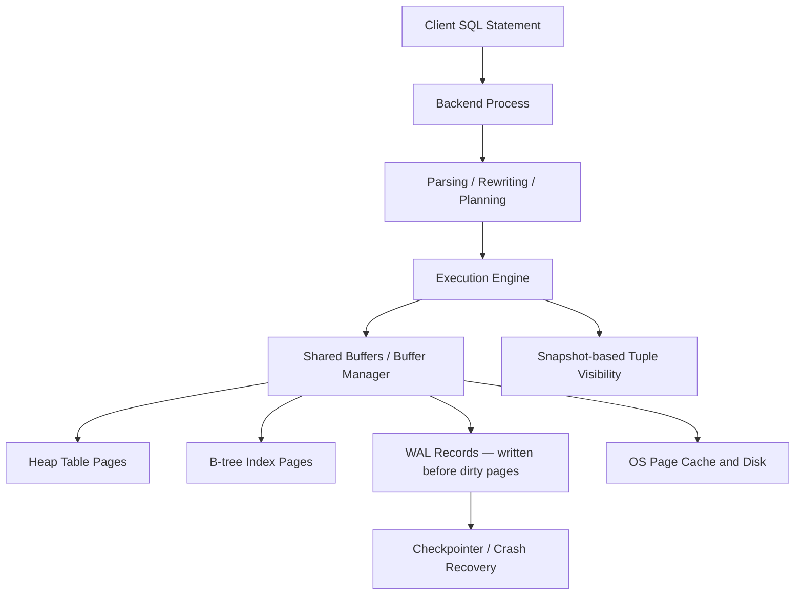

# Understanding PostgreSQL's Internal Architecture

## 1. What PostgreSQL Does

PostgreSQL is designed as a robust, general-purpose RDBMS capable of handling numerous simultaneous connections while preserving full SQL compliance, data durability, and a rich extension ecosystem. Rather than operating like a simple file store, it functions as a persistent server process — clients establish connections to dedicated backend processes, frequently accessed data resides in shared memory, durable writes go through a write-ahead log, and concurrent transactions are managed via multi-version concurrency control (MVCC) so that read and write operations do not have to wait on each other.

## 2. High-Level Architecture



How a typical update flows through the system:

1. The execution engine locates the target rows.
2. The buffer manager loads the required 8 KB pages into shared buffers (pinning them so they are not evicted).
3. MVCC visibility rules, based on the current transaction's snapshot, determine which tuple versions are relevant.
4. A new version of the heap tuple is written, and the previous version is flagged as superseded using transaction-level metadata.
5. The corresponding WAL record is flushed to disk before the data page modification is treated as committed.
6. At a later point, the checkpointer and background writer processes push modified pages to disk, and VACUUM reclaims storage from obsolete row versions.

## 3. Detailed Internal Design

### On-Disk Storage Layout

Tables and indexes in PostgreSQL are stored as sequences of fixed-size pages (8 KB by default). Each heap page is structured with a header, an array of line pointers, a free-space region, and the actual tuple data. Rows are addressed using CTIDs — a combination of page number and line-pointer offset. This layer of indirection allows tuple data to be physically reorganized within a page without breaking any external references.

Each heap tuple carries multi-version metadata:

- **xmin** — the ID of the transaction that created this particular version of the row
- **xmax** — the ID of the transaction that removed or replaced it
- **ctid** — a self-reference, or a forward pointer to the next version in an update chain

### The Buffer Manager

The buffer manager mediates all access between the execution engine and physical disk pages.

- Pages that are already resident in shared buffers are reused directly.
- If a needed page is not cached, it gets read from disk (or the OS page cache) into an available buffer frame.
- Active pages are pinned to prevent their eviction while they are being used.
- Dirty pages (those modified in memory) are not required to be written back immediately because WAL replay can reconstruct changes after a crash.
- Eviction follows a clock-sweep algorithm, which provides an LRU-like approximation without the overhead of updating access timestamps on every page touch.

### B-Tree Index Structure

PostgreSQL defaults to B-tree indexes, which are balanced search trees well-suited for both equality matches and ordered range scans.

- Interior nodes act as routing guides during key lookup.
- Leaf nodes hold sorted index entries, each pointing to a corresponding heap tuple.
- Leaf nodes are doubly linked, enabling efficient sequential range traversal.
- New entries are inserted at the appropriate leaf; when a leaf is full, it splits and propagates a separator key upward to the parent.

An important consequence of PostgreSQL's design: the primary key index is not a clustered index by default. Heap data is stored independently of any index ordering, meaning that an index lookup typically requires a secondary fetch from the heap — unless the visibility map permits an index-only scan.

### MVCC and the Role of VACUUM

MVCC provides each transaction (or statement) with a consistent snapshot of the database. A tuple is considered visible only when its `xmin` transaction is committed and within the snapshot's horizon, and its `xmax` is either absent, belongs to an aborted transaction, or refers to a transaction not yet visible.

This mechanism ensures that readers never need to block writers: a reader continues to see the prior tuple version while a concurrent writer creates an updated version. However, old versions persist in the heap until no running snapshot references them. This is why VACUUM is not optional housekeeping but an integral part of how the storage engine functions.

VACUUM serves four critical purposes:

- It frees up space consumed by dead tuple versions.
- It cleans out index entries that pointed to now-dead tuples.
- It refreshes planner statistics (either standalone or via VACUUM ANALYZE).
- It updates the visibility map, which is necessary for index-only scan eligibility.

### Write-Ahead Logging and Crash Recovery

The WAL protocol requires that a log record describing any modification must be persisted before the corresponding data page is written to permanent storage. This design decouples transaction commit speed from the cost of flushing random data pages:

- A transaction commit only waits for the WAL record to become durable.
- The actual dirty data and index pages can be written lazily by background processes.
- If the system crashes, the recovery process replays WAL entries to reconstruct any changes that were logged but not yet flushed to the data files.

### Query Planner and Statistics

PostgreSQL uses a cost-based optimizer. It derives estimates for row counts, filter selectivity, and join cardinalities from `pg_class` (relation-level metadata) and `pg_statistic` (per-column histograms and most-common-value lists, surfaced through the `pg_stats` view).

## 4. Experimental Observations

The following experiment demonstrates how planner statistics affect join strategy selection using `EXPLAIN (ANALYZE, BUFFERS)`.

```sql
CREATE TABLE customers (
    id serial PRIMARY KEY,
    city text NOT NULL
);

CREATE TABLE products (
    id serial PRIMARY KEY,
    category text NOT NULL
);

CREATE TABLE orders (
    id serial PRIMARY KEY,
    customer_id int REFERENCES customers(id),
    product_id int REFERENCES products(id),
    amount numeric NOT NULL
);

CREATE INDEX orders_customer_idx ON orders(customer_id);
CREATE INDEX orders_product_idx ON orders(product_id);

INSERT INTO customers (city) VALUES 
  ('New York'), ('London'), ('Tokyo'), ('Paris'), ('Berlin');

INSERT INTO products (category) VALUES 
  ('books'), ('electronics'), ('furniture'), ('clothing'), ('books'), ('books');

INSERT INTO orders (customer_id, product_id, amount) VALUES
  (1, 1, 29.99), (2, 1, 19.99), (1, 2, 99.99),
  (3, 3, 149.99), (4, 4, 59.99), (5, 1, 24.99),
  (1, 5, 34.99), (2, 2, 89.99), (3, 1, 19.99),
  (4, 5, 39.99), (5, 3, 129.99), (1, 4, 49.99);

ANALYZE;

EXPLAIN (ANALYZE, BUFFERS)
SELECT c.city, p.category, count(*), sum(o.amount)
FROM orders o
JOIN customers c ON c.id = o.customer_id
JOIN products p ON p.id = o.product_id
WHERE p.category = 'books'
GROUP BY c.city, p.category;
```

**What We Observed**


The key takeaway is that SQL syntax alone does not determine the join algorithm — the planner's cardinality estimates do. When `ANALYZE` has not been run recently, or when column values are heavily skewed, PostgreSQL can misjudge the number of matching rows (e.g., for `category = 'books'`) and select a suboptimal join strategy. Raising the statistics target on such columns helps:

```sql
ALTER TABLE products ALTER COLUMN category SET STATISTICS 1000;
ANALYZE products;
```


This demonstrates a chain of dependencies: the contents of `pg_statistic` shape the row-count estimates, those estimates drive join-order decisions, the chosen join order determines buffer access patterns, and buffer access patterns ultimately govern whether the query ends up being CPU-bound, memory-bound, or disk I/O-bound.

### Detailed Experiment Results

Before adjusting statistics, the `EXPLAIN` output reveals discrepancies between planned and actual row counts:

- **Planned rows**: What the optimizer predicted based on default or outdated histogram data
- **Actual rows**: The true number of rows processed at runtime
- **Buffers**: How many shared buffer hits vs. physical reads occurred

With default statistics, the planner might estimate 1 matching `books` row when there are actually 3, leading to:
- A less efficient join ordering
- Choosing nested loop joins where hash joins would perform better
- Excess buffer reads due to the misjudged data volume

After increasing the statistics target (`SET STATISTICS 1000`) and re-running `ANALYZE`, the same query shows:
- Row estimates closely matching actual row counts
- A more appropriate join strategy
- Lower buffer pressure overall

The critical metric to watch is **Buffers: shared hit=X read=Y**. A high hit rate suggests the active data fits comfortably in shared buffers; frequent reads signal either insufficient buffer allocation or poor planner choices forcing unnecessary I/O.

---

## 5. Architectural Trade-Offs

### MVCC vs. Traditional Locking

**PostgreSQL's Approach: MVCC**

- **Benefit**: Read operations never wait on write locks. Every transaction works against a stable snapshot, allowing long analytical queries to execute concurrently with updates.
- **Cost**: Dead tuple versions accumulate and require VACUUM to reclaim. In most OLTP scenarios, the concurrency gain far outweighs this maintenance burden.

### Fixed-Size Page Storage

**PostgreSQL's Approach: 8 KB pages with CTID indirection**

- **Benefit**:
  - Predictable I/O granularity — every read/write is exactly one 8 KB page
  - CTID-based addressing lets tuples be rearranged within a page without invalidating index pointers
  - The buffer manager operates on uniform page units, simplifying cache management
- **Cost**:
  - Lookups via a secondary index often incur an additional heap page read (since the heap is not ordered by any index)
  - Some internal fragmentation when individual tuples don't fill pages efficiently

### Write-Ahead Logging

**PostgreSQL's Approach: WAL-first durability**

- **Benefit**:
  - Commit latency depends only on sequential WAL writes, not on random data-page flushes
  - Crash recovery is straightforward: replay the WAL from the last checkpoint
  - Background writers can flush dirty data pages at their own pace
- **Cost**:
  - Each change involves a double write (once to WAL, later to the data file)
  - Checkpoint and recovery logic adds engineering complexity

### Index Organization: Non-Clustered by Default

**PostgreSQL's Approach: Separate heap and index storage**

- **Benefit**:
  - Heap layout is independent of any particular index's sort order
  - Multiple indexes can coexist on a table without physically reorganizing the underlying data
  - Adding or dropping indexes has no structural impact on the heap
- **Cost**:
  - Range scans that follow a non-primary index may require scattered heap fetches
  - Index-only scans are only feasible when the visibility map is current

---

## 6. Key Takeaways

### 1. Execution Plans Are Driven by Statistics, Not SQL

Identical SQL text can yield completely different query plans depending on the optimizer's cardinality estimates. Practically, this means:
- The data in `pg_statistic` is a direct performance lever
- Outdated or unrepresentative statistics lead to poor join strategies
- Running `ANALYZE` regularly is just as critical as designing a good schema

### 2. Buffer Behavior Is Often the Deciding Performance Factor

The gap between a fast and slow query frequently comes down to:
- Whether the working set of pages fits within shared buffers
- Whether the optimizer picks join strategies that stay within buffer capacity
- Whether the planner recognizes that the relevant dataset is small

This links low-level design choices (MVCC overhead per tuple, page format) directly to observable query performance.

### 3. MVCC Demands Continuous Maintenance

Although MVCC allows readers and writers to proceed without mutual blocking:
- Obsolete tuple versions pile up until VACUUM clears them
- The visibility map needs ongoing updates for index-only scans to work
- Long-lived transactions can prevent VACUUM from reclaiming space, causing table bloat

This behavior is by design — it is the deliberate price paid to eliminate reader-writer contention.

---