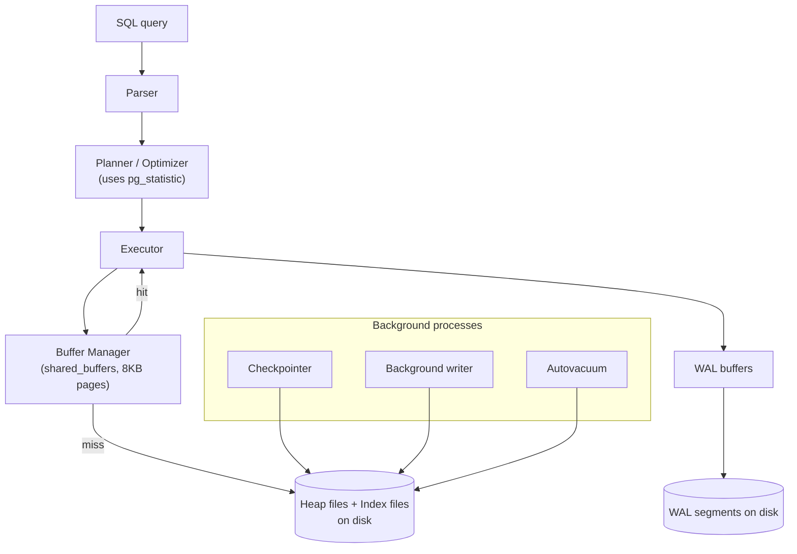

# PostgreSQL Internal Architecture

> Author: Gauri Shukla (24BCS10115)
> Built and measured on PostgreSQL 16.14 (Homebrew, Apple Silicon). The dataset is 50k customers / 200k orders / 200k order items. Every plan, statistic, page dump, and VACUUM trace below is real output from the SQL in `setup.sql`, `queries.sql`, and `mvcc_concurrency.txt`.

## 1. Problem Background

PostgreSQL is a multi-user relational database server. The hard part of building one is not running SQL, it is letting many transactions read and write the same data at the same time while still being correct, durable across crashes, and fast. The four subsystems this document focuses on (the buffer manager, the B-tree, MVCC, and the WAL) are exactly the four pieces that make that possible. They map directly to the four hard questions:

- How do we avoid hitting disk on every access? -> the **buffer manager**
- How do we find a row quickly? -> the **B-tree**
- How do many transactions see consistent data without blocking each other? -> **MVCC**
- How do we not lose committed data when the machine crashes? -> the **WAL**

I will take each in turn, with measurements.

## 2. Architecture Overview



A query is parsed, planned using collected statistics, and executed. The executor never touches disk directly. It asks the buffer manager for pages. Changes are recorded in the WAL before the dirty data pages are written back. Background processes (checkpointer, background writer, autovacuum) move data from memory to disk and clean up old row versions over time.

## 3. Internal Design

### 3.1 Buffer Manager (`src/backend/storage/buffer/`)

PostgreSQL keeps a pool of fixed-size 8 KB page slots in shared memory called `shared_buffers`. Every read and write goes through it. If the page is already there it is a hit, otherwise the page is read from disk into a free slot, possibly evicting another page first. Eviction uses a clock-sweep algorithm (a cheap approximation of least-recently-used): each buffer has a usage counter that the sweep decrements, and a buffer is reused when its count hits zero.

I looked at what was actually cached after running my join, using the `pg_buffercache` extension:

```
     relname     | buffers |  cached
-----------------+---------+----------
 orders          |    1278 | 10224 kB
 order_items     |    1086 |  8688 kB
 customers       |     362 |  2896 kB
 idx_orders_cust |       6 |    48 kB
```

So roughly 10 MB of the `orders` table was resident in `shared_buffers` after the query, because the executor pulled those pages in to do the scan. This is the buffer manager doing its job: the hot pages stay in memory and the next query that needs them pays no disk cost. In the `EXPLAIN (BUFFERS)` output below you can see `Buffers: shared hit=3153` with zero reads, which means the whole join was served from the buffer cache.

### 3.2 B-Tree (`nbtree`)

PostgreSQL's default index is a B-tree (a Lehman-Yao high-concurrency B+ tree, implemented under `src/backend/access/nbtree`). Leaf pages hold the indexed keys and a pointer (a `ctid`) to the heap tuple. I inspected the primary key index of `orders` with the `pageinspect` extension:

```
-- bt_metap('orders_pkey')
 magic  | version | root | level | fastroot | fastlevel
--------+---------+------+-------+----------+-----------
 340322 |       4 |  412 |     2 |      412 |         2

-- bt_page_stats('orders_pkey', 1)  : a leaf page
 type | live_items | dead_items | avg_item_size | page_size | free_size
------+------------+------------+---------------+-----------+-----------
 l    |        368 |          0 |            16 |      8192 |       788
```

That `level = 2` means the tree has a root, one intermediate level, and the leaves, so a height of 3. Any key lookup in 200,000 rows touches just three pages. A leaf page holds 368 entries of 16 bytes each, with a bit of free space left for future inserts so that a split is not needed on every insert. When a page does fill up, the B-tree splits it into two and pushes a separator key up to the parent, which is the standard B-tree growth mechanism.

### 3.3 MVCC: how versioning actually looks on disk

Every heap tuple carries hidden system columns, the most important being `xmin` (the transaction that created this version) and `xmax` (the transaction that deleted or superseded it). A transaction sees a tuple only if `xmin` is committed and visible to its snapshot and `xmax` is not. This is how Postgres gives each transaction a consistent view without locking readers.

I read the raw header columns and then updated a row to watch a new version appear:

```
-- before update, order id=1 lives at physical location (0,1)
 ctid  | xmin | xmax | total
-------+------+------+-------
 (0,1) |  748 |  749 | 11.00

-- after UPDATE orders SET total = total + 100 WHERE id=1
    ctid    | xmin | xmax | total
------------+------+------+--------
 (1273,140) |  839 |    0 | 111.00
```

This is the single most important thing to understand about PostgreSQL. An `UPDATE` does **not** modify the row in place. It writes a brand new version of the row at a new physical location (`ctid` moved from `(0,1)` to `(1273,140)`), stamps it with the new transaction id (`xmin = 839`), and leaves the old version behind marked as superseded. Concurrent transactions that still need the old version can still find it. (Side note: the `xmax = 749` on the original row came from a foreign-key share lock taken when child `order_items` rows were inserted, a nice reminder that `xmax` is also used for row locks, not only deletes.)

I also confirmed the reader-isolation behavior directly. A `REPEATABLE READ` transaction kept reading the old value (`20.00`) even after another session committed `99999`, and only saw the new value after it committed itself. That demo is in `mvcc_concurrency.txt`.

### 3.4 Why VACUUM is necessary

Because updates and deletes leave old versions behind, the table accumulates **dead tuples** that no transaction can see anymore but that still take up space. Something has to reclaim them. That something is VACUUM. After my update, `pgstattuple` physically found the dead version:

```
 table_len | tuple_count | dead_tuple_count | dead_tuple_len | free_percent
-----------+-------------+------------------+----------------+--------------
  10436608 |      200000 |                1 |             41 |         0.01
```

Then `VACUUM VERBOSE` reclaimed it and reported exactly what it did:

```
tuples: 200 removed, 200000 remain, 0 are dead but not yet removable
index "orders_pkey":    pages: 551 in total ...
index "idx_orders_cust": pages: 304 in total ...
WAL usage: 856 records, 0 full page images, 46673 bytes
```

VACUUM is the cleanup cost that PostgreSQL's no-overwrite MVCC design imposes. It also updates the visibility map and the statistics the planner relies on. If it never ran, dead tuples would pile up forever and the table would bloat. This is the well-known trade-off against in-place-update engines like InnoDB, which I cover in the MySQL topic.

### 3.5 WAL and crash recovery

PostgreSQL guarantees durability by writing changes to the Write-Ahead Log before the corresponding data pages reach disk. The rule is simple: the WAL record describing a change must be flushed before the dirty page is, so that after a crash the log can replay any change that did not make it into the data files. I watched the WAL position move as I ran an update:

```
 lsn_before
------------
 0/6A27F00
UPDATE 200
 lsn_after
-----------
 0/6A35BF8
```

The Log Sequence Number (LSN) advanced as the update was logged. A checkpoint periodically flushes all dirty buffers and records a safe restart point, so recovery only has to replay WAL written since the last checkpoint, not the entire history.

### 3.6 The planner and `pg_statistic`

The recommended exercise was to run `EXPLAIN ANALYZE` on a multi-table join and study how the planner used statistics. Here is the plan for my three-table join:

```
Finalize GroupAggregate  (cost=5159.47..8114.10 rows=1) (actual time=25.794..26.702 rows=1)
  -> Gather  Workers Launched: 1
       -> Parallel Hash Join  (cost=4159.47..6996.87 rows=23419) (actual rows=20000)
            Hash Cond: (i.order_id = o.id)
            -> Parallel Seq Scan on order_items i
            -> Parallel Hash
                 -> Hash Join  Hash Cond: (o.customer_id = c.id)
                      -> Parallel Seq Scan on orders o
                      -> Seq Scan on customers c
                           Filter: (city = 'Pune')
                           Rows Removed by Filter: 40000
 Planning Time: 0.606 ms
 Execution Time: 26.752 ms
```

The planner chose hash joins and parallel sequential scans, and it spun up a parallel worker. Why those estimates? Because of statistics collected by ANALYZE and stored in `pg_statistic` (exposed readably as `pg_stats`):

```
 attname | n_distinct |           most_common_vals            |              most_common_freqs
---------+------------+---------------------------------------+----------------------------------------------
 city    |          5 | {Bangalore,Mumbai,Pune,Delhi,Chennai} | {0.20183,0.20143,0.2004,0.1988,0.19753}
 id      |         -1 |                                       |
```

The planner knew `city` has only 5 distinct values each at roughly 20% frequency, so it estimated `city='Pune'` would return about 20% of 50,000 rows. Its estimate was 10,020 rows and the actual was 10,000, which is almost exactly right. That accurate estimate is precisely why it correctly chose a sequential scan over an index: when you will read a fifth of the table, scanning is cheaper than 10,000 random index probes. The `n_distinct = -1` on `id` means it is unique (one distinct value per row), which the planner uses for join cardinality.

## 4. Design Trade-Offs

| Decision | What you gain | What it costs |
|---|---|---|
| MVCC with no in-place update | Readers never block writers; consistent snapshots for free | Dead tuples accumulate, so you must run VACUUM |
| Heap storage (unordered rows) | Cheap inserts and updates | No clustering, so range scans on a non-PK can be scattered |
| WAL before data pages | Durability and fast crash recovery | Every change is written twice (once to WAL, once to the heap) |
| Process per connection | Strong isolation, robustness | Memory per connection, usually needs a pooler at scale |
| Cost-based planner driven by statistics | Picks scan vs index intelligently | Stale statistics lead to bad plans, so ANALYZE must keep up |

The deepest trade-off is MVCC-by-copying. It buys beautiful concurrency (the snapshot demo) at the cost of write amplification and the perpetual need to clean up. PostgreSQL decided that non-blocking reads were worth a background cleanup process, and the buffer-cache and planner numbers above show the design paying off in practice.

## 5. Experiments and Observations

All reproducible from the `.sql` files here against a local Postgres 16.

1. **Buffer cache really fills with hot pages.** After the join, ~10 MB of `orders` sat in `shared_buffers` and the plan reported `shared hit=3153, read=0`.
2. **The PK B-tree is height 3** for 200k rows (`bt_metap` level 2), so any lookup is three page touches.
3. **An UPDATE relocates the row.** `ctid` moved `(0,1) -> (1273,140)` with a fresh `xmin`, proving no-in-place-update MVCC.
4. **Dead tuples are real and VACUUM reclaims them.** `pgstattuple` found the dead version; `VACUUM VERBOSE` removed it and logged 856 WAL records doing so.
5. **The planner's estimate was within 0.2%** of actual (10,020 vs 10,000) thanks to `pg_stats` MCV data, and that accuracy is why it picked a seq scan over an index.
6. **WAL LSN advances on writes**, which is the durability path in action.

Files: `setup.sql`, `queries.sql` (all 11 experiments), `results.txt` (full captured output), `mvcc_concurrency.txt` (snapshot isolation demo).

## 6. Key Learnings

- The four subsystems are not independent. An UPDATE writes a new tuple (MVCC), logs it (WAL), dirties a buffer (buffer manager), updates the index (B-tree), and eventually triggers cleanup (VACUUM). Watching one statement ripple through all of them is what made the architecture make sense.
- MVCC is elegant but it is not free. Seeing a single update leave one dead tuple behind, and then watching VACUUM hunt it down with 856 WAL records, made the "why does Postgres need VACUUM" question concrete.
- Good plans come from good statistics. The planner is only as smart as `pg_statistic`, and the near-perfect row estimate I saw is the direct reason it chose the cheaper plan.
- The buffer manager is why a warm database is fast. The same query that reads disk once serves entirely from memory afterward, which the `shared hit` counter shows plainly.
- "No overwrite" is the one idea to remember. PostgreSQL never edits a row in place, and almost everything else (snapshots, VACUUM, the ctid pointers in indexes) follows from that.

### References
- PostgreSQL 16 source and docs: buffer manager `src/backend/storage/buffer/README`; B-tree `src/backend/access/nbtree/README`
- "Concurrency Control / MVCC": https://www.postgresql.org/docs/16/mvcc.html
- "Routine Vacuuming": https://www.postgresql.org/docs/16/routine-vacuuming.html
- "Write-Ahead Logging" and "Using EXPLAIN": https://www.postgresql.org/docs/16/wal-intro.html , https://www.postgresql.org/docs/16/using-explain.html
- "The Statistics Used by the Planner": https://www.postgresql.org/docs/16/planner-stats.html
