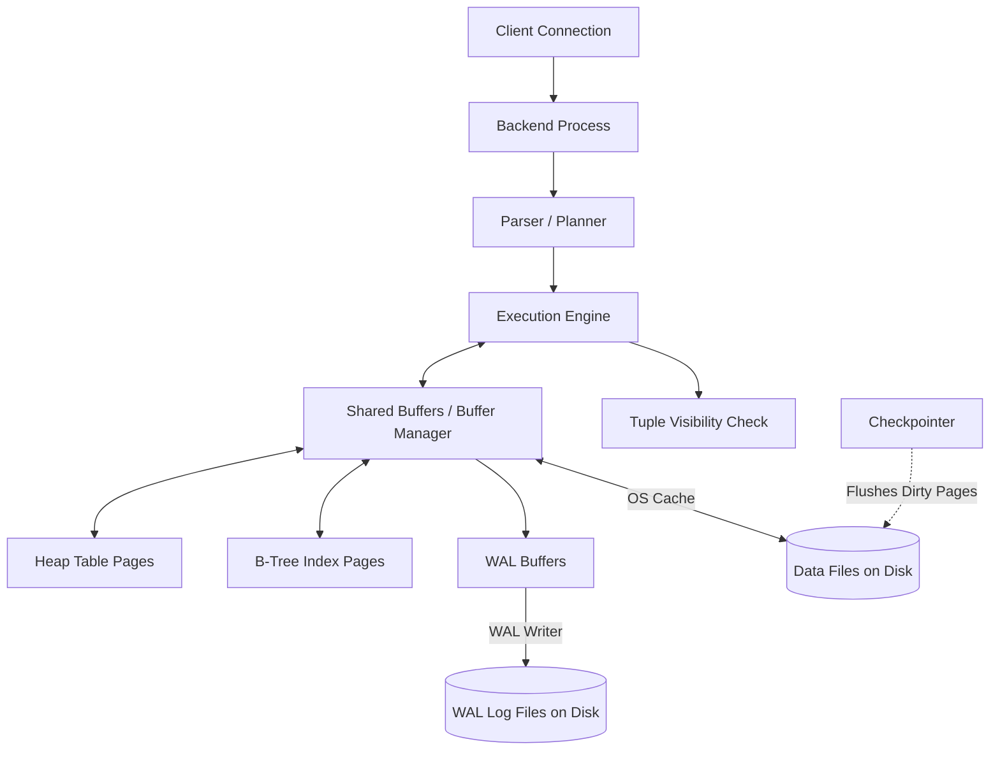

# PostgreSQL Internal Architecture

**Roll Number:** 24BCS10230  
**Name:** Parth Taneja  

---

## 1. Problem Background

PostgreSQL is a relational database management system designed to handle concurrent operations while guaranteeing strict ACID (Atomicity, Consistency, Isolation, Durability) compliance. 

In multi-user database environments, the main engineering challenge is orchestrating concurrent operations. Traditional databases often rely on strict locking mechanisms, which cause queries to queue up because readers block writers and writers block readers. PostgreSQL exists to solve this problem by managing shared data access efficiently, using a combination of a shared memory cache (Buffer Manager), multi-version data records (MVCC), and a log-first durability scheme (WAL).

---

## 2. High-Level Architecture

The diagram below represents how queries flow through PostgreSQL and interact with memory and disk components:



### Flow of a Write/Update Statement:
1.  **Parsing and Planning:** The client query is handled by a dedicated backend process, which parses the SQL and generates an execution plan.
2.  **Page Pinning:** The execution engine requests the required data pages (8 KB blocks) from the Buffer Manager, which loads them into Shared Buffers and pins them to prevent eviction.
3.  **MVCC Versioning:** To perform an update, the execution engine creates a new version of the row on the page and marks the old version as superseded.
4.  **Logging:** A write-ahead log (WAL) record describing the change is written to WAL buffers and flushed to disk before the modification is committed.
5.  **Flushing Data:** The page in memory is marked as "dirty." Later, the background checkpointer process flushes these dirty pages to disk, and the Autovacuum process cleans up obsolete row versions.

---

## 3. Detailed Internal Design

### 3.1. On-Disk Storage Layout
PostgreSQL organizes table and index data into fixed-size blocks called **pages** (8 KB by default).
*   **Page Structure:** Each page contains a page header, an array of line pointers pointing to the tuples, a free space region, and the actual tuple data at the bottom of the page.
*   **Tuple Addressing (CTID):** Rows are physically addressed using a `CTID` tuple identifier, which is a pair of numbers: `(page_number, tuple_offset)`. This level of indirection allows the database to move data around inside a page without breaking index pointers.
*   **Tuple Metadata:** Every row version carries hidden columns in its header:
    *   `xmin`: The ID of the transaction that inserted the row.
    *   `xmax`: The ID of the transaction that deleted or updated the row ($0$ if active).
    *   `ctid`: Points to itself or to a newer version of the row if it was updated.

### 3.2. The Buffer Manager
The Buffer Manager coordinates moving 8 KB pages between disk storage and memory.
*   **Page Caching:** When pages are read, they are placed in **Shared Buffers** in memory. Subsequent reads for the same page are served directly from cache (cache hit), bypassing slow disk I/O.
*   **Page Pinning:** Active pages are pinned in memory so the buffer sweep does not evict them while a query is using them.
*   **Dirty Pages:** When a backend process modifies a page, it marks it as "dirty." PostgreSQL does not write dirty pages to disk immediately; instead, they are held in memory and flushed asynchronously by background processes to improve write performance.
*   **Clock-Sweep Replacement Algorithm:**
    When the Shared Buffers cache is full and a new page needs to be loaded, PostgreSQL uses a clock-sweep algorithm to select a page for eviction:
    *   Each cached page has a `usage_count` (0 to 5).
    *   A clock hand continuously scans the pages.
    *   If a page has a pin count $>0$, the hand skips it.
    *   If a page is unpinned and its `usage_count` is $>0$, the hand decrements its count by 1 and advances.
    *   If a page is unpinned and its `usage_count` is $0$, it is selected for eviction. If it was dirty, it is flushed to disk before replacement.

### 3.3. B-Tree Index Structure
PostgreSQL defaults to B-Tree indexes, which are balanced trees optimized for equality and range searches.
*   **Node Layout:** Root and interior pages guide the key lookup, while leaf pages contain the sorted index keys and their corresponding heap TIDs.
*   **Concurrent Splits:** Leaf nodes are doubly linked, allowing sequential scans. When a leaf page fills up, it splits into two, and a separator key is propagated to the parent node. Concurrent readers can continue scanning the leaf pages during splits by following the right-link pointers without getting blocked.
*   **Non-Clustered Layout:** By default, indexes are non-clustered, meaning table data in the heap is stored independently of the index ordering. An index lookup requires first reading the index page, followed by reading the corresponding heap page (unless it qualifies for an index-only scan via the visibility map).

### 3.4. MVCC and the Role of VACUUM
Multi-Version Concurrency Control (MVCC) ensures that readers do not block writers and writers do not block readers.
*   **Visibility Rules:** Every transaction reads data using a **snapshot** representing the state of active and committed transactions at that point. A row version is visible if its `xmin` transaction has committed and is older than the snapshot, and its `xmax` is either unset or belongs to an uncommitted/future transaction.
*   **The Need for VACUUM:**
    Because updates create new row versions instead of overwriting data in-place, obsolete versions (dead tuples) accumulate in the heap. This causes table and index bloat. The `VACUUM` daemon runs in the background to:
    1.  Reclaim page space consumed by dead tuples.
    2.  Remove index pointers that refer to those dead tuples.
    3.  Update the **Visibility Map (VM)** to enable index-only scans.
    4.  Freeze old transaction IDs to prevent transaction ID wraparound issues.

### 3.5. Write-Ahead Logging (WAL) and Recovery
The Write-Ahead Log guarantees durability.
*   **Logging Protocol:** Any modification must be recorded sequentially in the WAL on disk before the dirty page itself is written to the main table file.
*   **Durability:** Transaction commit only waits for the sequential WAL record to be flushed to disk, which is faster than performing random writes to scattered heap blocks.
*   **Checkpoints:** The checkpointer process periodically flushes all dirty buffers to disk and writes a checkpoint marker. This limits the amount of WAL that needs to be replayed during a recovery.
*   **Recovery:** If the server crashes, PostgreSQL starts from the last checkpoint in `pg_control` and replays the WAL records forward to reconstruct modifications that were in memory but not yet written to disk.

### 3.6. Query Planner and Statistics
PostgreSQL uses a cost-based optimizer to select the most efficient execution plan (e.g., Sequential Scan vs. Index Scan).
*   **Statistics Collection:** The planner estimates costs based on statistics stored in system tables (`pg_statistic`, visible via the `pg_stats` view) and table sizes in `pg_class`.
*   **ANALYZE Command:** Running `ANALYZE` updates these statistics, ensuring the planner has accurate information about data distributions.

---

## 4. Design Trade-Offs

### 1. MVCC vs. Traditional Locking
*   **Advantage:** High concurrency. Long-running read queries do not block write updates, and writes do not block reads.
*   **Limitation:** Dead tuples accumulate in the heap, requiring continuous background `VACUUM` maintenance. If vacuuming falls behind under heavy write workloads, table bloat degrades query speeds.

### 2. Fixed-Size Page Storage (8 KB Blocks)
*   **Advantage:** Simple buffer cache management. Pages are uniform, and physical addresses (CTIDs) allow shifting tuples inside a page without rebuilding index pointers.
*   **Limitation:** A secondary index lookup requires an additional read from the heap table because indexes are non-clustered, causing scattered random disk reads.

### 3. Write-Ahead Logging
*   **Advantage:** Fast commits. Sequential disk append writes are orders of magnitude faster than random writes to data pages.
*   **Limitation:** Double-writing overhead (once to the WAL, and later to the data files) and write amplification due to logging full page writes after checkpoints to prevent torn pages.

---

## 5. Experiments & Observations

To see how statistics affect query planning, I created a test database with three tables: `customers`, `products`, and `orders`.
*   **Data Skew:** 
    *   `customers` (1,000 rows): 85% in `'New York'`, 15% in `'London'`.
    *   `products` (200 rows): 90% `'books'`, 10% `'electronics'`.
    *   `orders` (50,000 rows) distributed uniformly across product and customer IDs.

I ran the following join query to aggregate order amounts for electronics:
```sql
EXPLAIN (ANALYZE, BUFFERS)
SELECT c.city, p.category, COUNT(*), SUM(o.amount)
FROM orders o
JOIN customers c ON c.id = o.customer_id
JOIN products p ON p.id = o.product_id
WHERE p.category = 'electronics'
GROUP BY c.city, p.category;
```

### Observation 1: Plan BEFORE running `ANALYZE` (Freshly Loaded Data)
```sql
 GroupAggregate  (cost=845.67..849.92 rows=170 width=104) (actual time=9.831..10.601 rows=2 loops=1)
   Output: c.city, p.category, count(*), sum(o.amount)
   Group Key: c.city, p.category
   Buffers: shared hit=330
   ->  Sort  (cost=845.67..846.10 rows=170 width=96) (actual time=9.204..9.348 rows=6641 loops=1)
         Output: c.city, p.category, o.amount
         Sort Key: c.city
         Sort Method: quicksort  Memory: 711kB
         Buffers: shared hit=330
         ->  Hash Join  (cost=64.53..839.38 rows=170 width=96) (actual time=0.156..8.386 rows=6641 loops=1)
...
                     ->  Seq Scan on public.orders o  (cost=0.00..679.47 rows=36047 width=40)
...
                     ->  Seq Scan on public.products p  (cost=0.00..25.88 rows=6 width=36)
                           Filter: (p.category = 'electronics'::text)
 Planning Time: 2.179 ms, Execution Time: 10.654 ms
```
*   **Result:** In the absence of statistics, the planner defaulted to estimating **6 matching product rows** for electronics and **170 matching join rows**.
*   **suboptimal Choice:** Because the planner expected a small dataset, it chose a **GroupAggregate** strategy which required sorting the records in memory (`Sort Method: quicksort`). Since the actual row count was much larger (6,641 rows), the sort took **9.2 ms** (over 86% of the execution time).

### Observation 2: Plan AFTER running `ANALYZE` (Updated Statistics)
```sql
 HashAggregate  (cost=1071.67..1071.72 rows=4 width=54) (actual time=7.317..7.318 rows=2 loops=1)
   Output: c.city, p.category, count(*), sum(o.amount)
   Group Key: c.city, p.category
   Batches: 1  Memory Usage: 24kB
   Buffers: shared hit=327
   ->  Hash Join  (cost=33.34..1004.17 rows=6750 width=20) (actual time=0.186..6.221 rows=6641 loops=1)
...
               ->  Seq Scan on public.orders o  (cost=0.00..819.00 rows=50000 width=14)
...
               ->  Seq Scan on public.products p  (cost=0.00..4.50 rows=27 width=10)
                     Filter: (p.category = 'electronics'::text)
 Planning Time: 0.696 ms, Execution Time: 7.365 ms
```
*   **Result:** With updated stats, the planner accurately predicted **27 matching product rows** and **6,750 matching join rows** (actual was 6,641).
*   **Optimal Choice:** Knowing that the data volume was larger, the planner switched from a Sort-based GroupAggregate to a **HashAggregate** (using a 24 KB hash table in memory). This bypassed the sorting stage, reducing execution time from **10.65 ms** to **7.36 ms** (~30% performance improvement).
*   **Width Corrections:** Average column widths were refined (e.g. `orders` width from 40 to 14 bytes), allowing the planner to make accurate memory estimates.

### Explaining the Planner Statistics (`pg_stats`)
Querying the `pg_stats` catalog view for the products table:
```sql
SELECT tablename, attname, null_frac, avg_width, n_distinct, most_common_vals, most_common_freqs
FROM pg_stats
WHERE tablename = 'products' AND attname = 'category';
```
Output:
```
 tablename | attname  | null_frac | avg_width | n_distinct |  most_common_vals   | most_common_freqs 
-----------+----------+-----------+-----------+------------+---------------------+-------------------
 products  | category |         0 |         6 |          2 | {books,electronics} | {0.865,0.135}
```
*   **Planner Math:** 
    *   The frequency of `'electronics'` is recorded as **13.5%** (`0.135`).
    *   For the products scan: $200 \text{ total rows} \times 0.135 = \mathbf{27}$ estimated rows (matches scan plan).
    *   For the join: $50,000 \text{ total orders} \times 0.135 = \mathbf{6,750}$ estimated rows (matches hash join plan).

---

## 6. Key Learnings

1.  **Statistics Rule the Planner:** SQL query syntax only defines the output; the planner decides *how* to get it. Outdated statistics in `pg_statistic` lead to incorrect cardinality estimates, causing suboptimal join or aggregation strategies (like sorting instead of hashing).
2.  **Shared Buffers Cache Misses Cost I/O:** The difference between a fast and slow query is often how much data can be read from Shared Buffers. Ensuring the active dataset fits in buffers reduces random reads from physical disk.
3.  **VACUUM is Vital Maintenance:** MVCC provides non-blocking reads and writes, but the trade-off is table bloat. Tuning autovacuum ensures space is reclaimed and stats are kept fresh without causing performance spikes.
4.  **Sequential Write Priority:** The WAL protocol decouples transaction durability from data file updates. Appending sequentially to the log file is much faster than performing random writes to disk blocks, which can be done lazily in the background.
