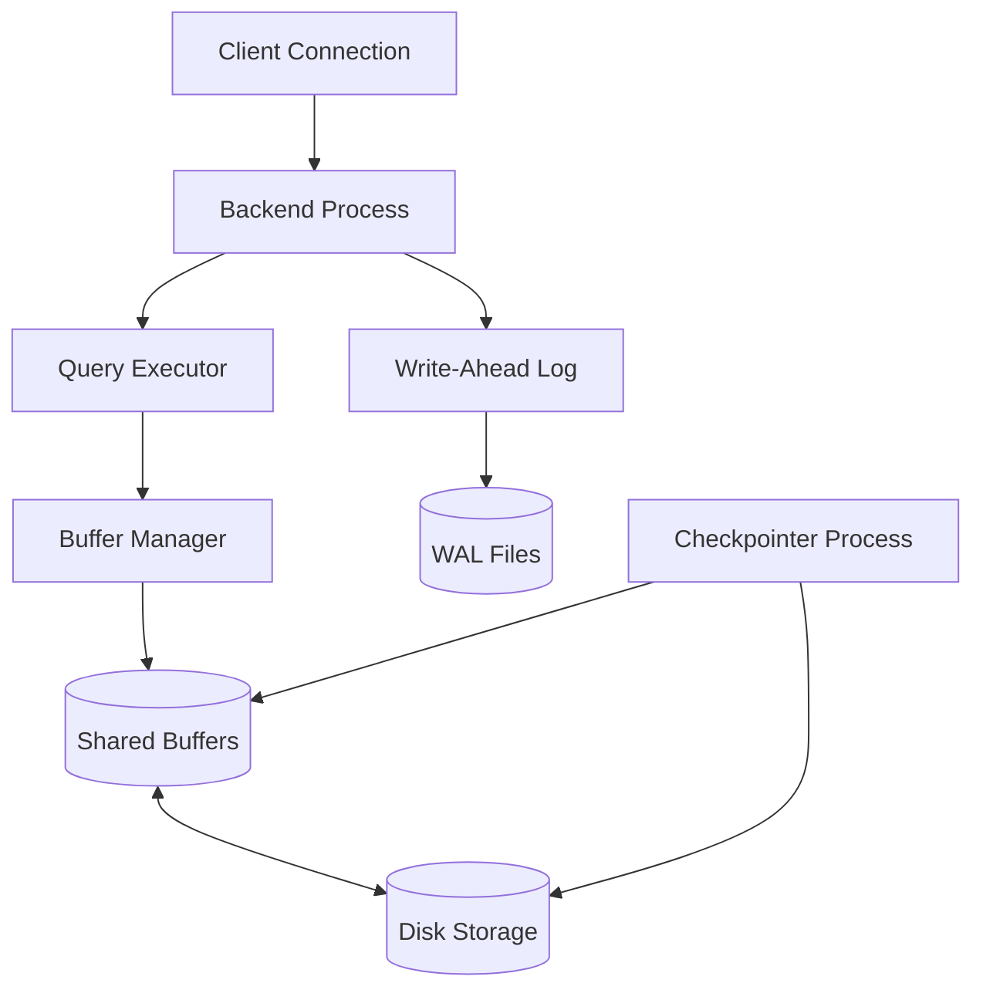

# PostgreSQL Internal Architecture

## 1. Problem Background
PostgreSQL was engineered to support heavily concurrent workloads, maintain rigorous data integrity, and provide extensibility. To achieve this, its internal architecture abstracts the physical disk through memory structures, utilizes optimistic concurrency control to maximize throughput, and implements comprehensive logging to ensure no data is lost during system failures.

## 2. Architecture Overview
The PostgreSQL backend operates on a multi-process architecture where shared memory is the central hub connecting individual worker processes to the disk storage. 



## 3. Internal Design

### Buffer Manager
The Buffer Manager is responsible for caching data pages in memory to avoid expensive disk I/O.
- **Shared Buffers:** A segment of shared memory (`shared_buffers`) where 8KB pages of tables and indexes are cached. All backend processes read from and write to this pool.
- **Buffer Replacement:** PostgreSQL uses a **Clock-Sweep** algorithm (a variation of Least Recently Used) to decide which pages to evict when the buffer pool is full. Pages are given a usage count that decreases over time; when a page's count hits zero, it becomes a candidate for eviction.
- **Page Reads and Writes:** When a query requests a row, the Buffer Manager first checks `shared_buffers`. If absent, it reads the 8KB page from disk into a buffer. If a transaction modifies the page, it is marked as **"dirty"** and must eventually be written back to disk.

### B-Tree Implementation (`nbtree`)
B-Trees are the default and most common index structure in PostgreSQL.
- **Index Structure & Page Layout:** Both internal and leaf pages are 8KB. Internal pages contain "downlinks" (pointers to child pages) and the minimum key for that child. Leaf pages contain the actual indexed values and a TID (Tuple ID: block number and offset) pointing to the physical row in the heap.
- **Search Path:** To find a value, the engine starts at the root page and traverses downlinks by comparing the search key against the keys in the internal pages until it reaches the correct leaf page.
- **Insert Operations & Page Splits:** When inserting a new key, if the target leaf page is full, a **Page Split** occurs. Half the data is moved to a newly allocated sibling page, and a new downlink is inserted into the parent page. Pages are linked via left and right pointers to allow efficient range scans.

### Multi-Version Concurrency Control (MVCC)
PostgreSQL handles concurrent access by maintaining multiple versions of a row rather than using in-place updates.
- **Heap Tuple Versioning:** When an `UPDATE` occurs, the old row is kept, and a new version of the row is inserted into the page.
- **xmin / xmax:** Every row has metadata tracking its lifespan:
  - `xmin`: The Transaction ID (XID) of the transaction that created/inserted the row.
  - `xmax`: The XID of the transaction that deleted or replaced the row (defaults to 0 for active rows).
- **Visibility Rules:** A transaction only sees a row if the row's `xmin` is less than the transaction's XID (i.e., committed in the past) and its `xmax` is either 0 or greater than the current transaction's XID (not yet deleted/updated from this transaction's perspective). This provides **Snapshot Isolation**.

### Write-Ahead Logging (WAL) & Checkpointing
WAL ensures durability without the performance penalty of synchronous data file writes.
- **WAL Records:** Any modification to a database page is first written as a WAL record to a WAL file. Because WAL files are written sequentially, this operation is fast.
- **Durability Guarantees:** When a transaction `COMMIT`s, PostgreSQL only guarantees that the WAL record has been synced to disk. The actual modified ("dirty") page remains in `shared_buffers`.
- **Crash Recovery:** If the system crashes, the data files might be missing recent committed changes. Upon restart, PostgreSQL replays the WAL files sequentially to reconstruct the missing changes in memory and write them to disk.
- **Checkpointing:** The Checkpointer is a background process that periodically flushes all "dirty" pages from `shared_buffers` to the actual data files on disk. Once a checkpoint is complete, the WAL files older than the checkpoint are no longer needed for crash recovery and are recycled.

## 4. Design Trade-Offs
- **Advantages:** 
  - Readers never block writers, and writers never block readers, making the database extremely suitable for highly concurrent applications.
  - WAL ensures that write operations are sequential, optimizing disk throughput.
- **Limitations & Trade-Offs:** 
  - **Table Bloat:** Because MVCC creates new row versions, heavy `UPDATE` workloads lead to dead tuples. These dead tuples consume space and slow down sequential scans until they are cleaned up by the `VACUUM` process. This is the primary trade-off of PostgreSQL's MVCC implementation.
  - **Double Buffering:** PostgreSQL relies on both its own `shared_buffers` and the OS page cache, leading to duplicated data in memory but providing a safety net for queries larger than the shared buffer pool.

## 5. Experiments / Observations
**Query Analysis via `EXPLAIN ANALYZE`**

To observe how PostgreSQL processes queries, I set up a local database with two tables (`users` with 10,000 rows and `orders` with 50,000 rows) and executed the following query after running `ANALYZE` on both tables:

```sql
EXPLAIN ANALYZE SELECT u.name, SUM(o.amount) 
FROM users u JOIN orders o ON u.id = o.user_id 
GROUP BY u.name ORDER BY SUM(o.amount) DESC LIMIT 10;
```

**Live Output:**
```text
                                                                QUERY PLAN                                                                
------------------------------------------------------------------------------------------------------------------------------------------
 Limit  (cost=1879.40..1879.43 rows=10 width=41) (actual time=11.794..11.794 rows=10 loops=1)
   ->  Sort  (cost=1879.40..1904.40 rows=10000 width=41) (actual time=11.793..11.794 rows=10 loops=1)
         Sort Key: (sum(o.amount)) DESC
         Sort Method: top-N heapsort  Memory: 26kB
         ->  HashAggregate  (cost=1538.31..1663.31 rows=10000 width=41) (actual time=9.712..11.237 rows=9920 loops=1)
               Group Key: u.name
               Batches: 5  Memory Usage: 4273kB  Disk Usage: 264kB
               ->  Hash Join  (cost=289.00..1288.31 rows=50000 width=21) (actual time=0.671..5.123 rows=50000 loops=1)
                     Hash Cond: (o.user_id = u.id)
                     ->  Seq Scan on orders o  (cost=0.00..868.00 rows=50000 width=16) (actual time=0.002..1.177 rows=50000 loops=1)
                     ->  Hash  (cost=164.00..164.00 rows=10000 width=13) (actual time=0.666..0.666 rows=10000 loops=1)
                           Buckets: 16384  Batches: 1  Memory Usage: 597kB
                           ->  Seq Scan on users u  (cost=0.00..164.00 rows=10000 width=13) (actual time=0.001..0.311 rows=10000 loops=1)
 Planning Time: 0.154 ms
 Execution Time: 11.990 ms
```

**Analysis of the Execution Plan:**
- **Planner Estimates vs Actuals:** The planner estimated `rows=50000` for the Hash Join, and the actual execution (`actual rows=50000`) perfectly matched this because `ANALYZE` was run right before the query, ensuring the `pg_statistic` catalog was up to date.
- **Join Strategy:** The query planner opted for a **Hash Join**. It built a hash table in memory from the `users` table (`Hash` step using 597kB of memory) and then performed a Sequential Scan on the larger `orders` table, probing the hash table to find matches. This is highly efficient for joining large, unordered datasets.
- **Aggregation & Sorting:** A **HashAggregate** was used to group the records and sum the amounts. Finally, a `top-N heapsort` was executed to fulfill the `ORDER BY ... LIMIT 10` clause, which only required 26kB of memory instead of sorting the entire dataset.

## 6. Key Learnings
- **Separation of Concerns:** PostgreSQL elegantly separates data persistence (WAL/Checkpointer) from query execution, allowing transactions to commit quickly without waiting for data pages to be flushed.
- **The Necessity of VACUUM:** Understanding MVCC is crucial to understanding why `VACUUM` is not just a maintenance task, but a fundamental requirement for the database's health. Without it, the database would eventually run out of space and transaction IDs (Transaction ID Wraparound).
- **Statistics are King:** The query planner is a cost-based optimizer. It is entirely dependent on the statistical metadata (`pg_statistic`) to make intelligent decisions regarding index usage and join strategies.
