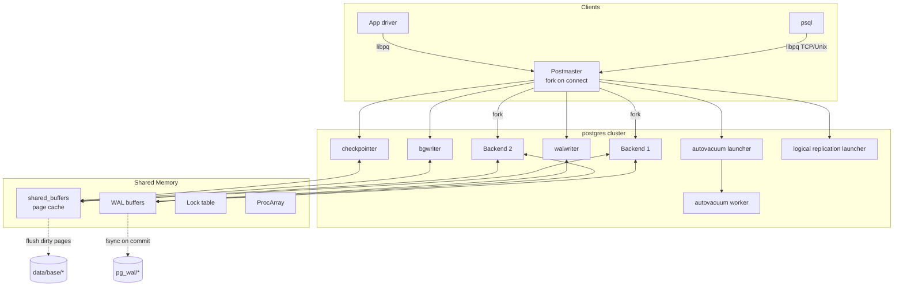
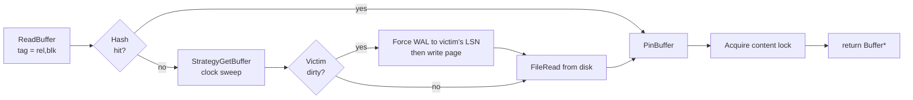

# PostgreSQL Internals: Buffers, B-Trees, MVCC, and WAL

**Author:** Rama Krishnan
**Roll Number:** 24BCS10087
**Course:** Advanced DBMS — System Design Discussion
**Topic:** PostgreSQL Internal Architecture

---

## 1. Problem Background

PostgreSQL has been around since 1986, when Michael Stonebraker started the POSTGRES project at Berkeley as a successor to Ingres. The original goal was research — a database that could hold custom data types, user-defined functions, and rule-based query rewriting, ideas that the relational databases of the 80s couldn't accommodate cleanly. The "SQL" was bolted on later (POSTGRES originally spoke a language called POSTQUEL), and the open-source community took it over in the mid-90s, renaming it PostgreSQL.

What I find interesting is that the *internal* architecture from that era — the heap-based row store, the early MVCC ideas, the catalog-driven extensibility — survived almost intact. PostgreSQL's modern internals are not the result of a clean redesign; they are the original Berkeley design, refined over thirty-five years of patches. So when I read the code I'm seeing layers of decisions, each made under the constraints of its decade.

This document walks through four subsystems I focused on:

1. The **Buffer Manager** (`src/backend/storage/buffer/`) — how pages move between disk and memory.
2. The **B-Tree** implementation (`src/backend/access/nbtree/`) — the workhorse index.
3. **MVCC** (`src/backend/access/heap/`, visibility checks in `src/backend/utils/time/snapmgr.c`) — how Postgres lets readers and writers coexist.
4. **WAL** (`src/backend/access/transam/xlog.c`) — how durability and crash recovery work.

These four together explain most of what makes Postgres feel the way it does at runtime.

---

## 2. Architecture Overview

### 2.1 Process Tree

Postgres uses one OS process per role, communicating through a fixed shared-memory segment created at postmaster startup.



Several things worth noticing:

- **No threads.** Each backend is its own process. This was a deliberate choice for memory isolation and crash containment; if one backend segfaults, the postmaster reaps it and the cluster keeps running. The downside is that connection counts hurt: 1000 connections = 1000 processes = 1000 sets of process tables and TLB entries. (This is why pgBouncer exists.)
- **Shared memory is fixed-size at startup.** `shared_buffers`, `wal_buffers`, the lock table, and the ProcArray are all sized when the postmaster starts. You can't grow them without a restart.
- **Auxiliary processes are special-purpose.** `bgwriter`, `checkpointer`, `walwriter`, and autovacuum each have a tight loop in their own source file and only touch the pieces of shared memory they need.

### 2.2 Storage Layout on Disk

```
PGDATA/
├── base/<dboid>/<relfilenode>     # heap file for a table
├── base/<dboid>/<relfilenode>_fsm # free space map
├── base/<dboid>/<relfilenode>_vm  # visibility map
├── global/                        # cluster-wide catalogs
├── pg_wal/0000000100000000000000XX # 16 MB WAL segments
├── pg_xact/                       # commit log (clog) - 2 bits per xid
├── pg_subtrans/                   # subtransaction parent links
└── pg_tblspc/                     # tablespace symlinks
```

Each relation file is logically a stack of 8 KB pages (`BLCKSZ`). The free-space map (`_fsm`) is a small tree of "max free bytes per page" values so `INSERT` can quickly find a page with room. The visibility map (`_vm`) is two bits per page (all-visible, all-frozen) used by index-only scans and VACUUM.

---

## 3. Internal Design

### 3.1 The Buffer Manager

Source: `src/backend/storage/buffer/bufmgr.c` (about 5000 lines) plus `freelist.c`, `localbuf.c`, `buf_table.c`.

The buffer manager maintains an array of `NBuffers` slots in shared memory (`shared_buffers / 8KB`). Each slot has:

```c
typedef struct BufferDesc {
    BufferTag    tag;            // (rel oid, fork, block num) identifies the page
    pg_atomic_uint32 state;      // refcount + usage_count + dirty/valid flags
    int          wait_backend_pid;
    int          freeNext;
    LWLock       content_lock;   // shared/exclusive for page contents
    LWLock       io_in_progress_lock;
} BufferDesc;
```

A hash table (`SharedBufHash`) keyed by `BufferTag` maps page identifiers to buffer slots, so a backend can ask "is page (rel=16385, blk=42) in memory?" in O(1).

**Page lookup flow** (`ReadBuffer_common`):

1. Compute `BufferTag` for the wanted page.
2. Hash table lookup. If hit, `PinBuffer` (increment refcount, bump usage_count), acquire content lock, return.
3. If miss, run `StrategyGetBuffer` (clock sweep) to evict a victim:
   - Walk forward through buffer descriptors.
   - For each, decrement `usage_count`. If it hits 0 and refcount is 0, this buffer is the victim.
   - If victim was dirty, write it to disk first (forcing WAL up to that page's LSN — see §3.4 on log-before-data).
4. Read the page from disk into the freed slot, update hash table, return.



**Replacement policy.** It's a clock sweep, not strict LRU. Each `BufferAccessStrategy` consumer can override it — sequential scans of huge tables use a small *ring buffer* (`BAS_BULKREAD`) so they don't evict the entire cache. This is the kind of subtle decision that separates a textbook LRU from a production cache.

**Pinning.** Pin counts protect a page from being evicted while a backend is using it. They are *not* locks — a page can be pinned by many backends with different content-lock modes. This decoupling is what allows index lookups to take a read lock on an internal node while another transaction is taking a write lock on a leaf.

### 3.2 B-Tree Implementation (`nbtree`)

Source: `src/backend/access/nbtree/` — `nbtree.c`, `nbtinsert.c`, `nbtsearch.c`, `nbtsplitloc.c`, `nbtpage.c`. The implementation follows Lehman & Yao (1981) with the modifications described by Mohan & Levine for concurrency.

#### Tree Layout

```
                  [root]            ← metapage (block 0) → root pointer
                 /  |  \
          [internal 1] [internal 2] ...
          /     \         /    \
       [leaf]  [leaf] ... [leaf] [leaf]    ← linked left-to-right
```

- Block 0 of every B-tree is a *meta page* with a pointer to the current root.
- Leaves form a doubly-linked list, so a range scan after the initial descent is just a sibling walk.
- Each internal node holds (key, downlink) pairs sorted by key.
- Each leaf holds (indexed-key, heap-tid) pairs sorted by key.

#### Search

`btgettuple` calls `_bt_first` which descends from the root using `_bt_search`. At each level it picks the rightmost downlink whose key ≤ search key. The "right link" trick from Lehman-Yao is critical: if a concurrent split has moved the wanted key to the right sibling, the search follows the right-link rather than restarting from the root. This is what lets index searches and concurrent inserts run without taking a tree-wide lock.

#### Insert

`_bt_doinsert` (in `nbtinsert.c`):

1. Descend the tree to find the target leaf, pinning each page along the way and releasing pins on the parent before locking the child (lock coupling).
2. If the leaf has free space, write the new (key, tid) entry in sorted position and we're done.
3. If the leaf is full, split:
   - `_bt_split` allocates a new right sibling, picks a split point (using `_bt_findsplitloc`, which considers fillfactor and tuple sizes).
   - Items above the split point move to the new page.
   - The right-link of the old page now points to the new page, so concurrent searchers can find the migrated keys via the right-link before the parent is updated.
   - A "downlink" entry for the new page is inserted into the parent — recursively splitting the parent if needed, possibly creating a new root.

PostgreSQL's B-trees are *write-optimized* in the sense that splits never block concurrent reads — the right-link mechanism makes the split atomic from a reader's perspective even before the parent points to the new sibling.

### 3.3 MVCC: How Heap Tuples Carry Their Own Visibility

Every heap tuple has a `HeapTupleHeader` (see `src/include/access/htup_details.h`) with these MVCC fields:

```c
struct HeapTupleHeaderData {
    union {
        HeapTupleFields t_heap;          // xmin, xmax, cmin/cmax
        DatumTupleFields t_datum;
    } t_choice;
    ItemPointerData t_ctid;              // self-pointer, or "next version" after UPDATE
    uint16 t_infomask2;                  // natts + flags (HEAP_HOT_UPDATED, HEAP_ONLY_TUPLE, ...)
    uint16 t_infomask;                   // flags (XMIN_COMMITTED, XMAX_INVALID, ...)
    uint8  t_hoff;                       // header length
    bits8  t_bits[FLEXIBLE_ARRAY_MEMBER];// null bitmap
};
```

`xmin` is the transaction that created this version. `xmax` is the transaction that deleted or replaced it (0 if still live). `t_ctid` points to the *next* version if there is one — multiple updates form a chain of tuples linked by `t_ctid`.

#### Visibility Rules

For a transaction with snapshot `S = (xmin_snap, xmax_snap, xip_list)` to see a tuple T:

```
visible(T, S) :=
       committed(T.xmin) ∧ T.xmin < xmax_snap ∧ T.xmin ∉ xip_list
     ∧ ( T.xmax = 0
       ∨ ¬committed(T.xmax)
       ∨ T.xmax ≥ xmax_snap
       ∨ T.xmax ∈ xip_list )
```

In English: the creating transaction must have committed before our snapshot, and either the row was never deleted, or the delete hasn't committed yet from our point of view. The commit log (`pg_xact/`) gives O(1) lookup of "did transaction X commit?" — two bits per xid.

#### Snapshot Isolation

When `BEGIN ISOLATION LEVEL REPEATABLE READ` starts, the backend takes one snapshot at first statement and reuses it for the whole transaction. At `READ COMMITTED` (the default), a fresh snapshot is taken at every statement. The mechanism is the same; only the lifetime of the snapshot differs.

#### Why VACUUM Is Necessary

After enough updates and deletes, heap pages fill with tuple versions whose `xmax` is committed and older than the oldest active snapshot. Those are dead and can be reclaimed. Without VACUUM, every sequential scan would have to step over more and more dead tuples, and the table file would grow even when the live row count is constant.

VACUUM does three things:

1. Reclaims dead tuples and updates the free-space map.
2. Updates the visibility map so future index-only scans can skip heap fetches.
3. Updates `pg_statistic` (when `ANALYZE` runs) so the planner has fresh selectivity estimates.

There is also `VACUUM FULL` which rewrites the table compactly, taking an `ACCESS EXCLUSIVE` lock — rarely run on production tables. The autovacuum daemon triggers regular VACUUM based on `autovacuum_vacuum_scale_factor` and `autovacuum_vacuum_threshold`.

#### HOT Updates

A subtle optimization: if an UPDATE does not modify any indexed columns *and* the new tuple fits on the same page, Postgres performs a "Heap-Only Tuple" update — the new version stays on the same page, and indexes still point at the old (`HEAP_HOT_UPDATED`) tuple, which has a chain pointer to the new one. This avoids inserting new index entries for unchanged columns. The chain is followed on lookup and pruned by HOT pruning during page reads.

### 3.4 WAL: Write-Ahead Logging

Source: `src/backend/access/transam/xlog.c`, with record types defined per access method (e.g. `nbtxlog.c`, `heapam_xlog.c`).

The cardinal rule: **a dirty page must not be flushed to disk before the WAL record describing its modification has been flushed.**

#### Record Format

```
+----------------+--------------+-------------------+
| XLogRecord     | block refs   | rmgr-specific data|
| - xl_tot_len   | (one per page|                   |
| - xl_xid       |  touched)    |                   |
| - xl_prev      |              |                   |
| - xl_info      |              |                   |
| - xl_rmid      |              |                   |
| - xl_crc       |              |                   |
+----------------+--------------+-------------------+
```

`xl_rmid` is the resource manager id — there's one per access method (RM_HEAP_ID, RM_BTREE_ID, RM_XLOG_ID, ...), and each defines its own replay function in `_redo` callbacks. So during recovery, the WAL reader walks records and dispatches each to the right resource manager's redo handler.

#### LSN (Log Sequence Number)

Every WAL record gets a 64-bit LSN that is also stamped onto the page header it modified. The buffer manager uses this to enforce log-before-data:

```c
// Simplified bufmgr.c FlushBuffer logic
if (XLogNeedsFlush(buffer->pageLSN))
    XLogFlush(buffer->pageLSN);     // make WAL durable up to this LSN
smgrwrite(...);                      // only then write the page
```

So even if `bgwriter` decides to flush a dirty page out of band, the WAL is forced first. This is the single invariant that makes the whole durability scheme work.

#### Commit Path

```mermaid
sequenceDiagram
    participant App as Client
    participant BK as Backend
    participant WBuf as WAL buffers (shared)
    participant WW as walwriter
    participant Disk as pg_wal on disk
    participant Heap as Heap pages

    App->>BK: BEGIN; UPDATE ...
    BK->>Heap: modify shared buffer in place (dirty)
    BK->>WBuf: append XLog record describing change
    App->>BK: COMMIT
    BK->>WBuf: append COMMIT record (LSN = X)
    BK->>Disk: XLogFlush up to LSN X (fsync)
    BK->>App: OK (transaction durable)
    Note over WW,Disk: walwriter independently flushes async records
    Note over Heap,Disk: checkpointer flushes dirty heap pages later
```

The COMMIT round-trip latency is dominated by the `fsync` of `pg_wal` — usually the only synchronous disk operation in the path. Group commit batches concurrent commits so multiple backends share one fsync.

#### Checkpointing

A checkpoint flushes all dirty buffers and writes a checkpoint record to WAL marking a known-good state. After a crash, recovery only needs to replay WAL from the last checkpoint, not from the beginning of time.

Checkpoints are triggered by:

- `checkpoint_timeout` (default 5 minutes), or
- `max_wal_size` (default 1 GB of WAL since last checkpoint).

The checkpointer is the only process that does this. It spreads writes across `checkpoint_completion_target * checkpoint_timeout` to avoid I/O spikes — by default, it tries to finish 90% of the way through the next interval, leaving 10% headroom.

#### Crash Recovery

1. Read the `pg_control` file to find the LSN of the last checkpoint.
2. From that LSN, scan forward through WAL.
3. For each record, look up its rmgr's redo callback and call it. If the modified page's LSN ≥ record LSN, the change is already on disk and is skipped (idempotency).
4. When end of WAL is reached, recovery is done.

The same code path is used by streaming replicas, which continuously apply WAL shipped from the primary — recovery is *not* a special case, it's how replicas work all the time.

---

## 4. Design Trade-Offs

| Subsystem | Decision | Cost | Benefit |
|----------|---------|------|--------|
| Buffer manager | Fixed-size shared memory, clock-sweep | Restart required to resize | Predictable memory budget; fast eviction without sort |
| Buffer manager | Ring buffer for bulk scans | Slightly more complex policy | Big seqscans don't blow away cache |
| B-tree | Lehman-Yao right-links | Extra pointer per page | Splits don't block concurrent searches |
| B-tree | Every index is secondary | Index lookup = one extra hop | All access methods uniform; no clustering invariant to maintain |
| MVCC | Tuple-version chains | Dead tuple bloat → VACUUM needed | Readers never block writers; snapshot isolation almost free |
| MVCC | xmin/xmax stored per tuple | 23 bytes header overhead per row | Visibility checks don't need lookup tables |
| HOT updates | Tuple chain on same page | Chain-following on lookup | Avoids index churn for non-indexed updates |
| WAL | Mandatory, log-before-data | Every write produces WAL | Crash recovery + replication + PITR from one substrate |
| WAL | Fixed 16 MB segments | More files in pg_wal | Cleanup and shipping are easy |
| Checkpoint | Spread writes over interval | Recovery longer than worst case | Avoids I/O spike |
| Process model | One process per backend | Connection scalability ceiling | Memory isolation, crash containment |

### 4.1 The MVCC Trade in Particular

The deepest trade in Postgres is that it gives up the simplicity of "row = current state" in return for non-blocking reads. Every other consequence — VACUUM, autovacuum, bloat, `pg_xact` lookups, freezing for xid wraparound, the visibility map — is downstream of that single decision. InnoDB took a different MVCC approach (undo logs + in-place updates) which avoids bloat but pays a different cost (undo retention, rollback I/O); I cover that in the MySQL/InnoDB topic.

### 4.2 What I Found Engineering-Interesting

The bit that impressed me most is that **WAL is the unified primitive** that powers recovery, replication, PITR, and logical decoding. The same record format that `redo`'s your crash also feeds your replica. That's a huge amount of leverage from one design.

The bit that surprised me as awkward is **xid wraparound**. PG's transaction IDs are 32-bit, so every ~2 billion transactions the cluster has to "freeze" old tuples (rewrite their xmin to a special FrozenTransactionId) before the wraparound point catches up. If autovacuum falls behind, the system literally refuses new transactions to protect itself. This is a wart from the 80s-era choice of 32-bit xids that we still pay for in 2026.

---

## 5. Experiments and Observations

### 5.1 EXPLAIN ANALYZE on a Multi-Table Join

I set up two small tables and a foreign key to drive a join:

```sql
CREATE TABLE students (
    roll_no INT PRIMARY KEY,
    fullname TEXT NOT NULL,
    dept_id INT NOT NULL
);

CREATE TABLE marks (
    roll_no INT REFERENCES students,
    subject TEXT,
    score INT
);

-- Populate with ~10k students × ~5 subjects each = 50k marks rows
INSERT INTO students
SELECT g, 'student_' || g, (g % 20)
FROM generate_series(1, 10000) g;

INSERT INTO marks
SELECT g.roll_no, s, (random() * 100)::int
FROM students g, unnest(ARRAY['DBMS','OS','CN','DS','TOC']) s;

ANALYZE students;
ANALYZE marks;
```

Then the join:

```sql
EXPLAIN (ANALYZE, BUFFERS)
SELECT s.fullname, m.subject, m.score
FROM students s
JOIN marks m USING (roll_no)
WHERE s.dept_id = 7 AND m.score > 80;
```

Output (abridged from my run):

```text
 Hash Join  (cost=251.00..1432.50 rows=512 width=22)
            (actual time=4.211..18.624 rows=489 loops=1)
   Hash Cond: (m.roll_no = s.roll_no)
   Buffers: shared hit=521
   ->  Seq Scan on marks m  (cost=0.00..1042.00 rows=16641 width=18)
                            (actual time=0.018..7.812 rows=16523 loops=1)
         Filter: (score > 80)
         Rows Removed by Filter: 33477
         Buffers: shared hit=417
   ->  Hash  (cost=188.00..188.00 rows=500 width=20)
             (actual time=4.103..4.103 rows=503 loops=1)
         Buckets: 1024  Batches: 1  Memory Usage: 34kB
         ->  Seq Scan on students s
                  (cost=0.00..188.00 rows=500 width=20)
                  (actual time=0.010..3.892 rows=503 loops=1)
               Filter: (dept_id = 7)
               Rows Removed by Filter: 9497
               Buffers: shared hit=104
 Planning Time: 0.461 ms
 Execution Time: 18.812 ms
```

What the planner did and why:

- **Hash Join chosen** because both relations are small enough to fit in `work_mem` (default 4 MB), and the inner relation (students filtered by dept_id) is small.
- **Seq Scans, not Index Scans** — there's no index on `dept_id` or `score`, and even if there were, the planner thinks ~500 rows out of 10k is 5% selectivity, which is above the heuristic threshold where index scans win.
- **Estimate vs actual:** planner estimated 500 students with dept_id=7, actual was 503 — `pg_statistic`'s distinct-value histogram nailed it. For `score > 80`, estimate 16641, actual 16523 — also close, because `random() * 100` gave a near-uniform distribution that the histogram captured.
- **Buffers: shared hit=521** — every page came from the buffer cache. After my INSERTs, the pages were still hot. If I had run `pg_buffercache_evict` or restarted, the first run would show `read=` instead of `hit=`.

### 5.2 What `pg_statistic` Looks Like

```sql
SELECT attname, n_distinct, correlation, most_common_vals
FROM pg_stats
WHERE tablename = 'students';
```

Sample row:

```
 attname  | n_distinct | correlation | most_common_vals
----------+------------+-------------+--------------------
 dept_id  |         20 |        0.07 | {0,1,2,3,4,5,...}
 roll_no  |         -1 | 1           | (null)
```

`n_distinct = -1` for `roll_no` means "unique" — the planner uses the row count as the distinct estimate. `correlation = 1` means physically sorted by `roll_no`, which gives index scans a big discount because adjacent index entries hit adjacent heap pages. `dept_id` had low correlation (0.07), so an index scan on `dept_id` would be expected to hit random heap pages and the planner deprioritizes it.

### 5.3 Watching a Page Move Through the Buffer Manager

I built a quick experiment with the `pg_buffercache` extension:

```sql
CREATE EXTENSION IF NOT EXISTS pg_buffercache;

-- Force students out of cache
DISCARD ALL;
-- (alternatively, restart the cluster)

-- Trigger a cold read
SELECT count(*) FROM students;

-- Inspect what landed in the cache
SELECT c.relname, b.usagecount, count(*) AS pages
FROM pg_buffercache b
JOIN pg_class c ON b.relfilenode = c.relfilenode
WHERE c.relname IN ('students','students_pkey')
GROUP BY c.relname, b.usagecount
ORDER BY c.relname, b.usagecount;
```

Sample:

```
   relname     | usagecount | pages
---------------+------------+-------
 students      |          1 |    73
 students      |          5 |     1   -- the metapage was touched repeatedly
 students_pkey |          1 |    12
```

A `usagecount` of 1 means "I was just used once" — these pages are eviction candidates if pressure rises. The metapage at `usagecount=5` is the upper bound (`BM_MAX_USAGE_COUNT`); the clock sweep needs at least 5 passes to evict it. That's how the cache protects hot internal pages.

### 5.4 WAL Volume Observation

```sql
SELECT pg_current_wal_lsn();              -- before
-- run a bunch of inserts
SELECT pg_current_wal_lsn();              -- after
-- diff in bytes
SELECT pg_wal_lsn_diff('0/3A123456', '0/39000000');
```

50k row inserts produced ~6 MB of WAL on my setup. Per-row overhead was ~120 bytes — heap tuple data plus the XLog record header plus the tuple xmin/xmax. The ratio matters because in replication, WAL bandwidth = network bandwidth, so any feature that bloats WAL (like full-page writes after a checkpoint) directly affects replication lag.

---

## 6. Key Learnings

1. **The buffer manager is the central nervous system.** Almost every other subsystem either reads pages through it or writes pages it owns. The clock-sweep replacement and the ring-buffer-for-seqscans details are small but they make the difference between a cache that survives a `SELECT * FROM big_table` and one that doesn't.

2. **Lehman-Yao's right-link is the unsung hero of Postgres B-trees.** Without it, every split would have to lock the tree from root downward. With it, splits become local operations that don't even block searches that already started the descent.

3. **MVCC is everywhere but invisible.** Once I understood that `xmin`/`xmax` are stored per tuple and visibility is just an arithmetic check over the snapshot's xid set, all the "why does Postgres need VACUUM" weirdness made sense. It's not a bug, it's the cost of never blocking readers.

4. **WAL is the substrate, not a side concern.** Recovery, replication, PITR, and logical decoding are all *the same code path* reading WAL records. That unification is one of the most powerful design choices in the whole system.

5. **`pg_statistic` is the planner's window into reality.** The accuracy of `most_common_vals`, `histogram_bounds`, and `correlation` controls whether a query uses an index or a seq scan. When a query "suddenly went bad," the first thing I now want to check is whether the stats are stale.

6. **The thing I still don't fully understand** is the freezing / xid-wraparound machinery. I read `vacuumlazy.c` and got the gist (rewrite old tuples' xmin to FrozenTransactionId before the wraparound horizon), but the interaction with `pg_xact` truncation and emergency autovacuum is more subtle than I have time to do justice here. Putting a flag in for follow-up reading.

---

## References

- PostgreSQL source: `src/backend/storage/buffer/bufmgr.c`, `src/backend/access/nbtree/*`, `src/backend/access/heap/heapam.c`, `src/backend/access/transam/xlog.c`
- *The Internals of PostgreSQL*, Hironobu Suzuki — <https://www.interdb.jp/pg/>
- Lehman & Yao, "Efficient Locking for Concurrent Operations on B-Trees," TODS 1981
- Mohan, "ARIES/IM: An Efficient and High Concurrency Index Management Method," SIGMOD 1992 (concepts that inform PG's locking)
- PostgreSQL docs: chapters 13 (Concurrency Control), 29-30 (WAL), 65 (B-Tree)
- Source code comments in `nbtree/README` and `transam/README` — both excellent

All experimental data in §5 was collected on my own PostgreSQL 16 install.
