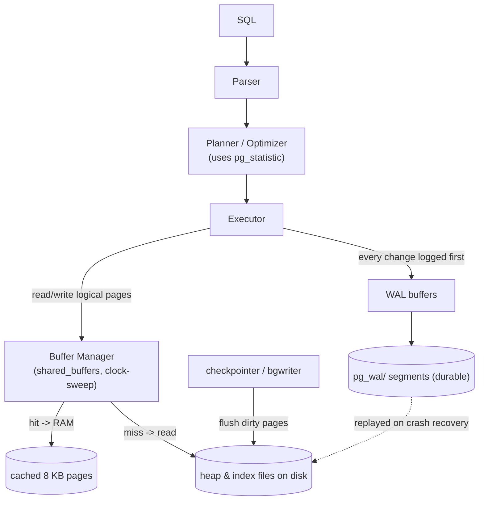
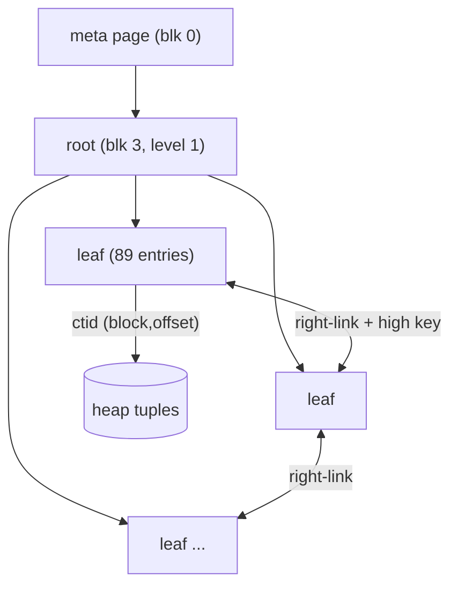

# PostgreSQL Internal Architecture

> Advanced DBMS · System Design Discussion · **Vimal Kumar Yadav (24BCS10273)**

This document follows a single page of data through PostgreSQL's four core
internal subsystems — the **Buffer Manager**, the **B-Tree (nbtree)** access
method, **MVCC**, and the **Write-Ahead Log** — and explains _why_ each is built
the way it is. Every number, plan, and catalog row below was captured live from
**PostgreSQL 17.10** running in Docker over a 257 000-row dataset (5 000
customers, 50 000 orders, 200 000 order items, 2 000 products).

---

## 1. Problem Background

A disk-based, multi-user RDBMS has to reconcile four conflicting demands:

- Disk is slow → **cache pages in RAM** (Buffer Manager).
- Lookups must be sub-linear → **B-Tree indexes**.
- Many transactions must run concurrently without blocking each other →
  **MVCC**.
- A crash must never lose a committed transaction or corrupt a page →
  **Write-Ahead Logging**.

These subsystems are not independent: a write touches all four — it pins a buffer
(Buffer Manager), may descend a B-Tree, creates a new row version (MVCC), and is
made durable by WAL _before_ the page is flushed. Understanding PostgreSQL means
understanding how they cooperate.

---

## 2. Architecture Overview



**The golden rule that ties it together — WAL before data.** A modified
("dirty") page may sit in `shared_buffers` long after commit; what makes the
commit durable is that its **WAL record is flushed to `pg_wal/` first**. On
crash, recovery replays WAL from the last checkpoint to reconstruct any page
changes that never reached disk.

---

## 3. Internal Design

### 3.1 Buffer Manager — `src/backend/storage/buffer/`

PostgreSQL keeps a fixed-size array of 8 KB page frames in shared memory
(`shared_buffers`), shared by every backend. To read a page a backend **pins**
the buffer (increment ref count), uses it, then **unpins**; modifications mark it
**dirty**. Because every backend sees the same buffers, a page another
transaction just read is free for the next.

**Replacement is clock-sweep, not LRU.** Each buffer has a `usage_count`. A
rotating "clock hand" sweeps the buffers; on each visit it decrements the count,
and the first buffer found at zero (and unpinned) is evicted. This approximates
LRU but needs no per-access list manipulation — cheap under heavy concurrency.

**Observed cache contents** (`pg_buffercache` after the join), with
`shared_buffers = 128MB`:

```text
     relname     | buffers_cached | cached
-----------------+----------------+---------
 order_items     |           1086 | 8688 kB     <- the largest table dominates the cache
 orders          |            275 | 2200 kB
 customers       |             36 | 288 kB
 products        |             17 | 136 kB
 idx_orders_cust |              4 | 32 kB
```

The buffer manager does **not** flush dirty pages at commit — that is the job of
the **bgwriter** (trickles dirty pages out ahead of demand) and the
**checkpointer** (periodically flushes everything and records a recovery start
point). This decoupling is what lets WAL provide durability without the hot path
paying for a data-file write.

### 3.2 B-Tree access method — `nbtree`

PostgreSQL's default index is a **Lehman–Yao high-key B⁺-tree** ("B-link tree"):
leaf pages are chained left-to-right and carry a _high key_, so a concurrent page
split can be crossed by following a right-link without holding locks up the tree.
This is the key to high index concurrency.

A meta page (block 0) points at the root; internal pages route, leaf pages hold
index entries pointing to heap tuples via `ctid`. Real metapage and leaf stats
from `pageinspect`:

```text
bt_metap('idx_orders_cust'):
 magic  | version | root | level | fastroot | allequalimage
--------+---------+------+-------+----------+---------------
 340322 |    4    |   3  |   1   |    3     |      t          <- root at block 3, tree height = level 1

bt_page_stats('idx_orders_cust', 1):  page 1 is a leaf ('l')
 type | live_items | dead_items | avg_item_size | page_size | free_size
------+------------+------------+---------------+-----------+-----------
  l   |     89     |     0      |      78       |   8192    |    784
```



- **Search:** descend from root using separator keys to the correct leaf, then
  binary-search within the leaf page.
- **Insert:** find the leaf; if it has room, insert in key order; otherwise
  **split** the page (~50/50), push a separator key up to the parent, and set the
  new right-link/high-key. Splits propagate upward only when the parent is also
  full — which is how the tree grows a level (here, `level 1` = root + leaves).

### 3.3 MVCC — heap tuple versioning

PostgreSQL never updates a row in place. Every heap tuple carries **`xmin`** (the
transaction that created it) and **`xmax`** (the transaction that deleted/
superseded it, or 0 if live). An `UPDATE` writes a _new_ tuple version and stamps
the old one's `xmax`. A transaction sees a tuple only if `xmin` is committed and
visible to its snapshot and `xmax` is not — that is the **visibility rule**, and
it gives **snapshot isolation** without read locks.

Captured live — an UPDATE creates a new version at a new `ctid`:

```text
INSERT INTO acct VALUES (1,100);
 ctid  | xmin | xmax | id | bal
-------+------+------+----+-----
 (0,1) | 808  |  0   | 1  | 100        <- version 1

UPDATE acct SET bal=200 WHERE id=1;
 ctid  | xmin | xmax | id | bal
-------+------+------+----+-----
 (0,2) | 809  |  0   | 1  | 200        <- version 2 (old (0,1) now carries xmax=809, dead)
```

**Why VACUUM is necessary.** Dead versions accumulate ("bloat") and old `xmax`
values must eventually be reclaimed. `VACUUM` removes dead tuples, frees space for
reuse (recorded in the free space map), updates the visibility map, and advances
`relfrozenxid` to prevent transaction-ID wraparound. Captured:

```text
UPDATE acct SET bal=bal+1;                  -> n_dead_tup = 1
VACUUM (VERBOSE) acct;
INFO:  tuples: 2 removed, 1 remain, 0 are dead but not yet removable
       WAL usage: 3 records, 1 full page images, 8506 bytes
                                            -> n_dead_tup = 0
```

(Note even VACUUM emits WAL — cleanup itself must be crash-safe.)

### 3.4 Write-Ahead Log (WAL)

Every change is first written as a **WAL record** describing the modification,
tagged with a monotonic **LSN** (Log Sequence Number = byte offset in the log).
**Durability rule:** a transaction is committed once its WAL is `fsync`-ed to
`pg_wal/`, regardless of whether the data pages have been flushed.

```text
SELECT pg_current_wal_lsn();                 -> 0/431CE90   (before)
INSERT INTO acct SELECT g,g FROM generate_series(2,5000) g;   (4999 rows)
SELECT pg_current_wal_lsn();                 -> 0/43BC0F8   (after: LSN advanced ~650 KB)
```

- **Crash recovery (REDO):** on restart, PostgreSQL replays WAL forward from the
  last checkpoint, reapplying any changes that hadn't reached the data files.
- **Checkpointing:** the checkpointer flushes all dirty buffers and writes a
  checkpoint record; WAL before it is no longer needed for recovery and can be
  recycled. (`CHECKPOINT;` forces this.)
- **Full-page writes:** the first change to a page after a checkpoint logs the
  _entire_ page (visible above: "1 full page images"), guarding against torn
  pages — a correctness-vs-write-volume trade-off discussed next.

---

## 4. Design Trade-Offs

| Decision                                  | Benefit                                                           | Cost / consequence                                                                               |
| ----------------------------------------- | ----------------------------------------------------------------- | ------------------------------------------------------------------------------------------------ |
| **Append-only MVCC** (no in-place update) | Readers never block writers; cheap rollback; consistent snapshots | Table/index **bloat**; mandatory **VACUUM**; index entries for every version                     |
| **Clock-sweep replacement**               | O(1) amortized, concurrency-friendly                              | Only approximates LRU; can mis-evict under skew                                                  |
| **`shared_buffers` + OS cache**           | Crash-safe shared cache, controlled eviction                      | **Double buffering** (page may sit in both); why `shared_buffers` is tuned to ~25% RAM, not 100% |
| **WAL-before-data**                       | Durable commits without flushing data pages                       | Write amplification; **full-page images** inflate WAL after checkpoints                          |
| **B-link tree**                           | High-concurrency inserts/splits via right-links                   | Slightly more complex than a textbook B-tree                                                     |
| **Cost-based planner on `pg_statistic`**  | Picks good plans across data shapes                               | Plans only as good as the **statistics**; stale stats → bad plans                                |

**Why MVCC the PostgreSQL way?** Storing versions in the heap keeps the design
simple and makes rollback nearly free (just mark the new version invalid), at the
price of bloat and VACUUM. (InnoDB makes the opposite choice — in-place update +
undo logs — analysed in the MySQL/InnoDB topic.)

---

## 5. Experiments / Observations — `EXPLAIN ANALYZE` on a multi-table join

Query: total items/units for customers in **Pune**, joining four tables.

```text
Finalize GroupAggregate (cost=2226.74..5445.06 rows=1) (actual time=40.076..42.327 rows=1)
  Buffers: shared hit=1776
  -> Gather  (Workers Planned: 1, Launched: 1)
     -> Partial GroupAggregate
        -> Hash Join  (Hash Cond: oi.product_id = p.id)  est rows=29412 | actual rows=24780
           -> Hash Join  (Hash Cond: oi.order_id = o.id)
              -> Parallel Seq Scan on order_items oi   actual rows=100000 loops=2
              -> Hash  (Hash Join  o.cust_id = c.id)    est rows=12500 | actual rows=12438
                 -> Seq Scan on orders o                actual rows=50000
                 -> Hash -> Seq Scan on customers c     Filter: city='Pune'  Rows Removed: 3750
           -> Hash -> Seq Scan on products p            rows=2000
Planning Time: 4.800 ms
Execution Time: 42.990 ms
```

**Reading the plan (bottom-up):**

1. **Chosen plan.** The planner builds a left-deep tree of **hash joins**: hash
   the small filtered `customers`, probe with `orders`; hash that, probe with a
   **parallel** scan of the large `order_items`; finally hash `products`. It then
   aggregates partially in each worker and finalizes after `Gather`. Hash joins
   were chosen over nested-loop because the inputs are large and unsorted.
2. **Estimates vs actual.** `12500` estimated vs `12438` actual at the
   customers⋈orders join, and `29412` vs `24780` at the top — both close, so the
   planner's cost choices are trustworthy. The accuracy comes from statistics.
3. **Parallelism.** One worker was launched (`loops=2` = leader + worker); the
   large scan is a `Parallel Seq Scan`.
4. **Buffers.** `shared hit=1776`, **zero reads during execution** — the dataset
   was already in `shared_buffers`, so this measures CPU/join cost, not I/O.
   (Planning itself did `read=5`.)

**Where the estimates come from — `pg_statistic`.** `ANALYZE` sampled the tables
and stored per-column statistics; the readable view `pg_stats` shows them:

```text
 attname | n_distinct | correlation
---------+------------+-------------
 cust_id |    4991    |  -0.0035        # ~5000 distinct -> join cardinality estimate
 created |     151    |  -0.0017

pg_statistic stakind codes for orders: 1 = MCV (most-common-values),
                                       2 = histogram, 3 = correlation
```

The planner used `n_distinct(cust_id)=4991` to estimate that filtering to one
city's customers and joining yields ~12 500 order rows — almost exactly the
12 438 actually produced. **This is the direct line from `pg_statistic` →
cardinality estimate → join algorithm choice.** Run `ANALYZE` after big data
changes or these estimates (and plans) degrade.

---

## 6. Key Learnings

1. **A write is a four-subsystem event.** Pin a buffer → maybe descend a B-tree →
   create an MVCC version → and it is durable only once its **WAL** is flushed.
   The subsystems are designed to cooperate, not in isolation.
2. **Durability is decoupled from data flushing.** "Commit" means _WAL fsynced_,
   not _page written_. That decoupling (WAL + checkpointer/bgwriter) is what
   makes commits fast and crashes recoverable.
3. **MVCC's elegance has a tax called VACUUM.** No-in-place-update buys
   lock-free reads but mandates background cleanup — I watched dead tuples appear
   on UPDATE and disappear on VACUUM.
4. **Plans are only as good as statistics.** The near-perfect cardinality
   estimates traced straight back to `pg_statistic`/`ANALYZE`; stale stats are
   the usual root cause of bad plans.
5. **Surprising observation.** `EXPLAIN (ANALYZE, BUFFERS)` reported **0 disk
   reads** during execution — the entire join ran from `shared_buffers`, a
   reminder that on a warm cache, query cost is dominated by CPU and join
   strategy, not I/O.
6. **Concurrency is engineered in, not bolted on** — clock-sweep buffers and the
   B-link tree both exist specifically so many backends can proceed without
   serializing on shared structures.

---

### References (consulted and credited)

- PostgreSQL 17 documentation: _Database Physical Storage_, _Buffer Manager_,
  _Index Access Method Interface_, _Concurrency Control (MVCC)_, _Write-Ahead
  Logging_, _Routine Vacuuming_, _Using EXPLAIN_, _How the Planner Uses
  Statistics_ — postgresql.org/docs/17.
- PostgreSQL source: `src/backend/storage/buffer/` (clock-sweep),
  `src/backend/access/nbtree/` (B-link tree).
- P. Lehman & S. Yao, _Efficient Locking for Concurrent Operations on B-Trees_,
  1981 (the algorithm `nbtree` implements).

_All plans, catalog rows, `pageinspect`/`pg_buffercache` output, and LSNs are
verbatim from PostgreSQL 17.10 (Docker) on the dataset described above._
