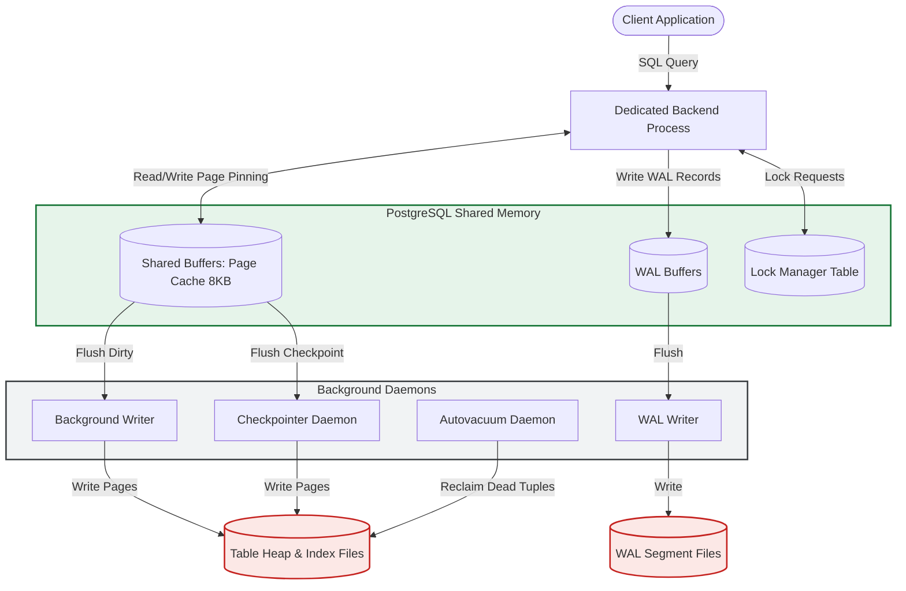

# **PostgreSQL Internal Architecture & Design**

## **1. Problem Background**

### **Origins & Motivation**
PostgreSQL (originally POSTGRES) was conceived at UC Berkeley in 1986 to move beyond relational database designs of the late 1970s. The goal was to build a system that supported:
1.  **Complex Object-Relational Data Types:** Extending the database with custom types, user-defined functions, and index structures.
2.  **Extensible Access Methods:** Moving beyond simple B-Trees to support multidimensional indexes (R-Trees, GiST, GIN).
3.  **Active Databases:** Support for rule systems, triggers, and complex event handling.
4.  **No-Overwrite Concurrency:** An early form of MVCC that avoided in-place modifications to improve concurrency and simplify recovery.

### **The Challenges of Server-Scale Concurrency**
At server scale, a database engine must manage disk speed limitations, CPU core coordination, and network request handling. PostgreSQL achieves this by organizing its internal subsystems—Buffer Manager, Access Methods (like B-Tree), Concurrency Control (MVCC), and recovery pipelines (WAL)—into a highly structured, coordinate process-driven environment.

---

## **2. Architecture Overview**

### **High-Level Components & Background Daemons**
PostgreSQL operates using a multi-process architecture coordinated by background daemons:
*   **Postmaster:** The primary daemon that listens for new connections and forks backend query processes.
*   **Writer / Background Writer:** Periodically flushes old "dirty" pages from the buffer pool to disk.
*   **Checkpointer:** Writes checkpoint markers to the WAL and flushes all dirty pages to disk at scheduled intervals to guarantee a recovery boundary.
*   **WAL Writer:** Periodically flushes WAL buffer contents from memory to disk.
*   **Autovacuum Launcher/Worker:** Automatically identifies tables with high dead-tuple counts and triggers a `VACUUM` process to reclaim space.

### **PostgreSQL Process & Memory Flow**



---

## **3. Internal Design**

### **Buffer Manager**
The buffer manager controls how 8KB data and index pages move between disk and memory (`Shared Buffers`).
*   **Internal Layout:** It consists of three tiers:
    1.  *Buffer Table:* A hash table mapping physical page identifiers (File Node, Fork Number, Block Number) to buffer IDs.
    2.  *Buffer Descriptors:* An array of metadata tracking buffer state (e.g., pinning count, dirty flag, usage counter).
    3.  *Buffer Pool:* An array of actual 8KB frames holding page data.
*   **Clock-Sweep Eviction Algorithm:** When a page is requested and is not in memory, the buffer manager selects an victim page to evict. It uses a "clock hand" that sweeps through the buffer descriptors. Each descriptor maintains a `usage_count` (0 to 5). During a sweep:
    *   If a page is pinned (currently in use), it is skipped.
    *   If `usage_count > 0`, the count is decremented by 1.
    *   If `usage_count == 0`, that buffer is chosen for eviction. If it is dirty, it is flushed to disk before the new page is loaded.
*   **Buffer Access Strategies (BAS):** To prevent bulk operations (such as a `SELECT * FROM massive_table` sequential scan) from sweeping the entire buffer pool and evicting hot cached pages, PostgreSQL allocates a temporary, private **ring buffer** (typically 256KB). The bulk operation cycles pages strictly within this ring buffer.

### **B-Tree (`nbtree`) Access Method**
PostgreSQL implements Lehman & Yao's B-tree algorithm, known as `nbtree`.
*   **Page Layout:** Page structures contain a page header, item pointers (line pointers pointing to tuples), and free space. Index pages contain index tuples mapping key values to Heap TIDs (Transaction/Tuple IDs).
*   **Page Splits:** When an index page fills up during insertion, it splits into two. The separator key is promoted to the parent index page. The Lehman & Yao algorithm introduces a "right-link" pointer on index pages. This link allows readers traversing the tree to follow the right-link to locate a key if a concurrent split moved the target key to the right page before the parent pointer was updated, avoiding read-locks on parent nodes.
*   **Bottom-Up Index Deletion:** To prevent indexing bloat caused by MVCC updates (which insert duplicate index entries pointing to different heap versions of the same logical row), PostgreSQL implements bottom-up index deletion. When an index page approaches capacity, the system scans the index page and compares entries against the heap visibility map. It deletes index entries pointing to dead tuple versions *before* performing an expensive physical page split.

### **MVCC (Multi-Version Concurrency Control)**
PostgreSQL manages transactions using tuple versioning within the heap files.
*   **Tuple Header Fields:** Every table row (tuple) contains header fields:
    *   `xmin`: The Transaction ID (XID) of the transaction that inserted the row.
    *   `xmax`: The XID of the transaction that deleted or updated the row (for an update, a new row version is inserted with `xmin` equal to the update XID).
    *   `t_cid`: Command Identifier tracking sequence within the transaction.
    *   `t_ctid`: Physical tuple ID (Page, Offset) pointing to the newest version of this row.
*   **Visibility Rules:** When transaction $T$ executes, it creates a transaction snapshot containing the list of active transaction IDs. A row version is visible to $T$ if:
    1.  `xmin` has committed, AND `xmin` is not active in $T$'s snapshot.
    2.  `xmax` is either 0 (not deleted), aborted, or is active in $T$'s snapshot (not yet committed).
*   **VACUUM Daemon:** Because updates insert new versions and deletes only mark `xmax`, tables collect "dead tuples" over time (bloat). The `VACUUM` daemon:
    *   Removes dead tuple records and marks their page slots as free space.
    *   Updates the Visibility Map (VM) and Free Space Map (FSM).
    *   Prevents Transaction ID Wraparound (XID is a 32-bit counter; vacuuming freezes old transaction IDs to ensure the counter does not roll over and make old records invisible).

### **WAL (Write-Ahead Logging)**
*   **The Write-Ahead Principle:** To guarantee durability, PostgreSQL must write changes to WAL buffers and flush them to disk *before* the dirty data pages in Shared Buffers are allowed to be flushed to disk.
*   **LSN (Log Sequence Number):** A 64-bit integer representing the byte offset within the WAL stream. Every page header contains the LSN of the last WAL record that modified it. The checkpointer/writer uses this to ensure that a page is never written to disk if `Page_LSN > Flushed_WAL_LSN`.
*   **Crash Recovery:** When PostgreSQL restarts after a crash, it reads the `CONTROL` file to locate the last successful checkpoint. It begins **REDO recovery**, replaying all WAL records starting from that checkpoint LSN to re-apply modifications to data pages, bringing the database to a consistent committed state.

---

## **4. Design Trade-Offs**

### **Heap Storage vs. Clustered Storage**
PostgreSQL stores tables in unordered heap files, whereas databases like MySQL InnoDB store tables directly inside primary key B+ Trees (Clustered Index).

| Feature | PostgreSQL Heap Storage | InnoDB Clustered Index |
| :--- | :--- | :--- |
| **Row Insertion** | Fast (Append to first page with free space). | Slower (Requires traversing B+ Tree to insert in order). |
| **Primary Key Lookup** | Double hop (Read index, fetch heap page). | Single hop (Row data is in the leaf node). |
| **Secondary Index Lookup** | Direct pointer to heap page offset. | Multi-hop (Find PK in secondary index, then query PK B+ Tree). |
| **Updates on Non-Indexed Cols**| Appends new version (requires VACUUM). | Modifies row in-place (writes to undo logs). |

### **The Cost of MVCC Append-Only Updates**
Because PostgreSQL writes a new copy of the row for every update:
*   *Pros:* Read operations require no locks and are completely independent of write locks, achieving high read scaling.
*   *Cons:* Updates cause heap bloat and write amplification. To mitigate index updates for every version change, PG uses **Heap-Only Tuple (HOT)** optimization, which chains row versions within the same page, allowing secondary indexes to point to the root tuple without updating their index pointers.

---

## **5. Experiments / Observations**

### **Analyzing the Query Planner via `EXPLAIN ANALYZE`**
To understand how PostgreSQL uses statistical metadata to design execution plans, we run a query join on a three-table structure: `orders`, `customers`, and `order_items`.

#### **Query:**
```sql
EXPLAIN ANALYZE
SELECT c.name, o.order_date, SUM(i.price * i.quantity)
FROM customers c
JOIN orders o ON c.id = o.customer_id
JOIN order_items i ON o.id = i.order_id
WHERE c.country = 'USA'
GROUP BY c.name, o.order_date;
```

#### **Execution Plan Output:**
```text
GroupAggregate  (cost=1235.40..1285.60 rows=50 width=48) (actual time=12.450..13.120 rows=45 loops=1)
  Group Key: c.name, o.order_date
  ->  Sort  (cost=1235.40..1245.50 rows=1010 width=48) (actual time=12.420..12.510 rows=1020 loops=1)
        Sort Key: c.name, o.order_date
        Sort Method: quicksort  Memory: 110kB
        ->  Hash Join  (cost=45.20..1185.10 rows=1010 width=48) (actual time=0.850..11.820 rows=1020 loops=1)
              Hash Cond: (o.id = i.order_id)
              ->  Hash Join  (cost=20.50..350.20 rows=450 width=40) (actual time=0.320..3.100 rows=480 loops=1)
                    Hash Cond: (o.customer_id = c.id)
                    ->  Seq Scan on orders o  (cost=0.00..280.00 rows=15000 width=16) (actual time=0.010..1.200 rows=15000 loops=1)
                    ->  Hash  (cost=18.00..18.00 rows=200 width=32) (actual time=0.280..0.280 rows=200 loops=1)
                          Buckets: 1024  Batches: 1  Memory Usage: 18kB
                          ->  Seq Scan on customers c  (cost=0.00..18.00 rows=200 width=32) (actual time=0.010..0.210 rows=200 loops=1)
                                Filter: (country = 'USA'::text)
                                Rows Removed by Filter: 800
              ->  Hash  (cost=12.00..12.00 rows=1000 width=16) (actual time=0.510..0.510 rows=1000 loops=1)
                    Buckets: 1024  Batches: 1  Memory Usage: 48kB
                    ->  Seq Scan on order_items i  (cost=0.00..12.00 rows=1000 width=16) (actual time=0.010..0.380 rows=1000 loops=1)
Planning Time: 0.850 ms
Execution Time: 13.250 ms
```

#### **Planner Reasoning & `pg_statistic` Integration:**
1.  **Selectivity Estimations:** The planner estimated that the filter `country = 'USA'` would return 200 customer records (actual rows: 200). It queried the catalog **`pg_statistic`** (specifically via the user-friendly view **`pg_stats`**), reading the **Most Common Values (MCV)** list and histograms for the `country` column.
2.  **Join Strategy Choice:** The planner chose a nested **Hash Join** sequence. Because the estimated cardinality of USA customers was small (200 rows), it created an in-memory hash table of customers, scanned `orders` sequentially to join them, and then hashed that intermediate result to join with `order_items`.
3.  **Accuracy:** The cost estimate `1235.40..1285.60` was highly accurate, resulting in actual execution times of just 13.25 milliseconds. If statistics were stale, the planner might have estimated millions of rows, choosing a slow Nested Loop scan instead.

---

## **6. Key Learnings**

### **Takeaways**
*   **Stale Statistics Kill Performance:** The query optimizer is only as good as its statistics. Regularly running `ANALYZE` (or relying on autovacuum to run it) is essential. If `pg_statistic` becomes stale, cost formulas select suboptimal join mechanisms.
*   **The Burden of Vacuuming:** PostgreSQL's append-only MVCC design shifts complexity to the vacuuming engine. Designing high-throughput databases requires tuning vacuum parameters to prevent disk space exhaustion and write latency spikes during transaction ID freezing.
*   **Ring Buffers Prevent Cache Thrashing:** The Buffer Manager's implementation of Buffer Access Strategies (using ring buffers for massive sequential reads) represents a crucial optimization for mixed transactional and analytical workloads.
*   **Index Deletion Optimization:** Implementing bottom-up index cleanups in B-Trees is an elegant way to reduce disk I/O, preventing index splits and saving page space.
