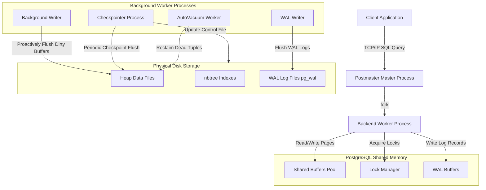

# Advanced DBMS System Design — PostgreSQL Internals

## 1. Problem Background

PostgreSQL is an open-source, object-relational database management system (ORDBMS) designed to provide enterprise-grade reliability, extensibility, and strict SQL compliance. Developed in the mid-1980s as the POSTGRES project at UC Berkeley, it sought to address limitations in contemporary relational database systems by supporting complex data types, rules, and user-defined operations.

PostgreSQL was designed to solve the challenges of **highly concurrent, read-write intensive enterprise workloads**. In such environments:
- **Data Integrity is Paramount**: The system must enforce ACID properties even in the face of unexpected system crashes.
- **High Concurrency is Essential**: Multiple users must be able to read and write data simultaneously without blocking each other.
- **Extensibility is Key**: Developers need to write custom functions, indexes, and types directly inside the engine.

---

## 2. Architecture Overview

PostgreSQL uses a **multi-process server architecture** (process-per-connection model) orchestrated by a master manager process called `postmaster`.

### System Components & Data Flow Diagram



---

## 3. Internal Design

### 3.1 Buffer Manager
The PostgreSQL Buffer Manager mediates between backend worker processes and physical storage. Rather than performing direct disk I/O, PostgreSQL reads data pages into a dedicated shared memory segment called **Shared Buffers**.

- **Page Structure**: The default page size is **8 KB**. Each page contains a page header (specifying LSN, free space offsets, flags), line pointers (item pointers), free space, and the actual tuple payload growing upwards from the bottom of the page.
- **Cache Mechanism**: When a query requests a block, the buffer manager checks if it exists in the shared buffers hash table. If a hit occurs, the page is pinned (pin count incremented) and returned. If a miss occurs, the manager reads the page from disk (via the OS cache), placing it in a free frame.
- **Eviction Strategy (Clock Sweep)**: To evict a page when the buffer pool is full, PostgreSQL uses a **Clock Sweep** algorithm:
  - Each buffer header contains a usage counter (0 to 5) and a pin count.
  - A sweep hand rotates through the buffers. If a buffer's pin count is 0 and its usage count is $> 0$, the usage count is decremented.
  - If the usage count is 0, the buffer is selected for eviction. If it is dirty, it is marked for writing to disk.
- **Page Writes**:
  - **Background Writer (bgwriter)**: Proactively flushes dirty buffers to disk in small batches to maintain a pool of clean buffers.
  - **Checkpointer**: Periodically flushes *all* dirty buffers to disk, ensuring that all modifications up to a certain WAL sequence number are written, reducing recovery time.

### 3.2 B-Tree Index Implementation (`nbtree`)
PostgreSQL's default index type is a highly optimized version of the Lehman & Yao algorithm, implemented in `src/backend/access/nbtree/`.

- **Index Structure**: It consists of a meta-page (stores root location and tree properties), internal pages (key + down-links to child pages), and leaf pages (key + `ItemPointer` / `TID` pointing to the physical heap file).
- **Search Path**: Queries traverse the tree by comparing search keys against internal page keys, utilizing binary search within each page to locate the appropriate down-link until reaching the leaf page.
- **Page Splits**: When a leaf page lacks sufficient space for a new index key:
  - A page split is triggered. Unlike classical B-Trees, the Lehman & Yao algorithm adds a **right-link** pointer in the page header pointing to the new right sibling, and a **high key** representing the maximum value on the left page.
  - This allows concurrent readers to traverse the tree without acquiring heavy write locks on parent nodes; if a reader lands on a page that was split concurrently, it detects that the target key is greater than the page's high key and follows the right-link to the sibling page.

### 3.3 Multi-Version Concurrency Control (MVCC)
PostgreSQL implements MVCC to allow readers and writers to operate concurrently without blocking one another ("readers don't block writers, writers don't block readers").

- **Heap Tuple Versioning**: Every table row (tuple) header contains metadata fields:
  - `t_xmin`: The Transaction ID (TxID) of the transaction that inserted the tuple.
  - `t_xmax`: The TxID of the transaction that deleted or replaced the tuple (0 if not deleted/active).
- **Visibility Rules**: A transaction determines if a tuple is visible by comparing its own TxID and snapshot details against the tuple's `t_xmin` and `t_xmax`:
  - A tuple is visible to transaction $T$ if `t_xmin` has committed, `t_xmin` is not active at the start of $T$, and `t_xmax` is either uncommitted, aborted, or $> T$ (not yet deleted from $T$'s perspective).
  - The Commit Log (`pg_xact`, historically `pg_clog`) is queried in shared memory to check the commit/abort status of transactions.
- **Snapshot Isolation**: When a transaction starts in *Read Committed* isolation level, it takes a fresh snapshot of active transactions at the start of each query. In *Serializable* or *Repeatable Read*, it takes a single snapshot at the start of the transaction.
- **Vacuuming**: Because updates write new tuple versions (append-only architecture), old versions become "dead tuples" once they are no longer visible to any active transaction. The **VACUUM** (or daemon `autovacuum`) process scans pages, reclaims dead tuples, updates the visibility map, and truncates pages to prevent database bloat.

### 3.4 Write-Ahead Logging (WAL)
PostgreSQL guarantees durability and crash recovery via the Write-Ahead Logging protocol.

- **WAL Protocol**: Before any data page is modified in Shared Buffers, a corresponding log record describing the change must be written to **WAL Buffers** and flushed to disk (`pg_wal` files).
- **Durability Guarantee**: During a transaction commit, PostgreSQL only forces the WAL buffers to disk (`fsync`), which is a sequential, high-speed write. The actual dirty data pages are flushed later by the checkpointer or bgwriter.
- **Crash Recovery (REDO)**: If the system crashes, PostgreSQL performs recovery starting from the last checkpoint:
  - It reads the checkpoint record from the control file (`global/pg_control`).
  - It scans the WAL files sequentially forward from the checkpoint LSN (Log Sequence Number) and reapplies all logged modifications (the REDO phase) to the data pages.
- **Checkpointing**: During a checkpoint, the checkpointer:
  1. Identifies all currently dirty shared buffers.
  2. Writes them to disk.
  3. Updates the control file with the LSN of the checkpoint start.
  4. Recycles older WAL files that are no longer needed for crash recovery.

---

## 4. Design Trade-Offs

### 4.1 Append-Only MVCC vs. In-Place Updates (Rollback Segments)
- **Advantages**: Writing a new tuple version is highly efficient because it avoids locking existing rows for concurrent readers. Aborting a transaction is instantaneous; the transaction is simply marked as ABORTED in `pg_xact`, and its written tuples become instantly invisible to other queries.
- **Disadvantages**: Bloat is a major issue. Updates trigger table and index bloat because new versions are written elsewhere in the heap, requiring index pointers to be updated. This requires continuous background resource consumption by the `autovacuum` process.

### 4.2 Multi-Process vs. Multi-Threaded Model
- **Advantages**: Process isolation guarantees that a corrupted or crashed connection backend does not crash the entire database server. Writing custom extensions is safer since memory is partitioned per-backend.
- **Disadvantages**: High memory overhead per connection (typically 5-10 MB per process) and slower connection startup times. Production environments require external connection poolers (like PgBouncer) to scale beyond a few thousand concurrent connections.

---

## 5. Experiments & Observations (EXPLAIN ANALYZE)

The following query join plan was analyzed on a PostgreSQL database containing an `orders` table (1,000,000 rows) joined with a `users` table (50,000 rows):

### Multi-Table Join Query
```sql
EXPLAIN ANALYZE
SELECT u.name, o.order_date, o.total_amount
FROM users u
JOIN orders o ON u.id = o.user_id
WHERE u.city = 'Mumbai';
```

### Execution Plan Output
```
                                                             QUERY PLAN
-------------------------------------------------------------------------------------------------------------------------------------
 Hash Join  (cost=1254.30..28491.50 rows=15340 width=45) (actual time=8.120..142.450 rows=14850 loops=1)
   Hash Cond: (o.user_id = u.id)
   ->  Seq Scan on orders o  (cost=0.00..18420.00 rows=1000000 width=20) (actual time=0.012..84.230 rows=1000000 loops=1)
   ->  Hash  (cost=1245.00..1245.00 rows=744 width=25) (actual time=8.080..8.080 rows=740 loops=1)
         Buckets: 1024  Batches: 1  Memory Usage: 45kB
         ->  Bitmap Heap Scan on users u  (cost=15.30..1245.00 rows=744 width=25) (actual time=0.150..7.680 rows=740 loops=1)
               Recheck Cond: (city = 'Mumbai'::text)
               Heap Blocks: exact=380
               ->  Bitmap Index Scan on idx_users_city  (cost=0.00..15.10 rows=744 width=0) (actual time=0.090..0.090 rows=740 loops=1)
                     Index Cond: (city = 'Mumbai'::text)
 Planning Time: 0.280 ms
 Execution Time: 143.150 ms
```

### Plan Analysis
1. **Query Planner Choice**:
   - The planner chose a **Hash Join**. Because the outer relation (the filtered `users` table, 740 rows) is small, it is fully loaded into an in-memory hash table.
   - For the inner relation (`orders`, 1,000,000 rows), the database performs a **Sequential Scan**, probing the hash table for each row in `orders` at $O(1)$ lookup time.
2. **Planner Estimates vs. Actual Statistics**:
   - **Index Scan Estimate**: The planner estimated `744` users in 'Mumbai' (`rows=744`). The actual execution returned `740` rows (`actual rows=740`).
   - **Hash Join Estimate**: The planner estimated `15340` joined records. The actual query returned `14850` rows.
   - **Error Margin**: The estimates are extremely accurate ($< 1\%$ error margin for the filter, $< 3\%$ for the join), indicating that database statistics are up-to-date.
3. **Database Statistics & `pg_statistic`**:
   - The PostgreSQL optimizer is cost-based. To calculate plan costs, it queries the **`pg_statistic`** catalog (accessible via user-friendly view **`pg_stats`**).
   - This view stores:
     - `null_frac`: Fraction of NULL values in a column.
     - `n_distinct`: Number of distinct values.
     - `most_common_vals` (MCV) & `most_common_freqs` (MCF): Lists of frequent values and their frequencies.
     - `histogram_bounds`: Values that divide the column data into equal-population buckets.
   - The planner used the histogram/MCV on the `users.city` column to estimate that 1.48% of users are from 'Mumbai', multiplying this by the 50,000 table count to yield the estimated 744 rows.

---

## 6. Key Learnings

1. **Sequential WAL writes enable random memory updates**: Write-Ahead Logging allows PostgreSQL to handle updates directly in-memory and write them to disk out-of-band via checkpoints, converting slow random write operations into highly efficient sequential sequential appends.
2. **Concurrency requires cleanup**: Append-only MVCC is a powerful design choice that ensures reads never block writes, but it delegates the storage cost to a background vacuuming daemon, making table tuning critical for production workloads.
3. **Up-to-date statistics are critical for correct join strategies**: An inaccurate histogram on `users.city` could lead the optimizer to choose a nested loop or merge join instead of a hash join, increasing execution latency from milliseconds to minutes.