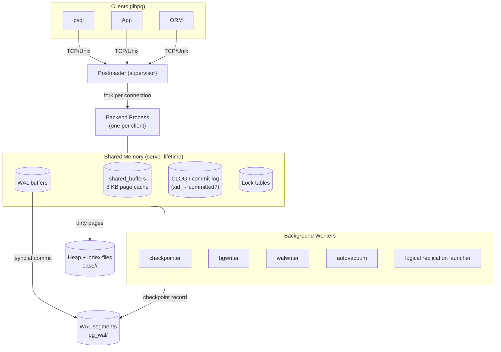

# PostgreSQL Internal Architecture

> **Author:** Prabhav Semwal | **Roll:** 24bcs10358  
> **Environment:** PostgreSQL 16.14 in Podman (`docker.io/library/postgres:16`)  
> **Dataset:** `customers` 50k · `orders` 200k · `order_items` 600k rows

---

## Table of Contents
1. [Problem Background](#1-problem-background)
2. [Architecture Overview](#2-architecture-overview)
3. [Internal Design](#3-internal-design)
4. [Design Trade-Offs](#4-design-trade-offs)
5. [Experiments / Observations](#5-experiments--observations)
6. [Key Learnings](#6-key-learnings)
7. [References](#7-references)

---

## 1. Problem Background

PostgreSQL descended from the POSTGRES project (UC Berkeley, 1986) which aimed to extend the relational model with rich types, rules, and extensibility. By the mid-1990s, the open-source community rewrote the query engine and added SQL support, producing PostgreSQL.

The core engineering challenge PostgreSQL solves is: **how do you let hundreds of clients issue concurrent read and write transactions against shared data, guarantee ACID properties, survive crashes, and recover automatically — all without losing a single committed byte?** Each internal subsystem (buffer manager, B-tree, MVCC, WAL, VACUUM) is a direct answer to one part of that question.

---

## 2. Architecture Overview



### Key process roles

| Process | Purpose |
|---|---|
| **Postmaster** | Listens on port 5432, forks a backend for each new connection |
| **Backend** | Handles one client session end-to-end (parse → plan → execute → return) |
| **bgwriter** | Proactively writes dirty shared_buffers pages to disk to keep clean pages available |
| **walwriter** | Flushes WAL records from memory to `pg_wal/` periodically (avoids backends doing fsync individually) |
| **checkpointer** | Periodically flushes *all* dirty pages and writes a checkpoint WAL record — recovery only needs to replay from here |
| **autovacuum** | Runs VACUUM and ANALYZE automatically when dead-tuple ratios cross thresholds |

---

## 3. Internal Design

### 3.1 Buffer Manager

The buffer manager is PostgreSQL's page cache. It sits between every backend and the disk:

```
Backend wants page (relfilenode, page#)
         │
         ▼
   Lookup in shared_buffers hash table
         │
    ┌────┴────┐
  HIT        MISS
    │           │
    │         Evict a victim frame (clock-sweep)
    │         Read page from disk into frame
    │           │
    └─────┬─────┘
          │
    Pin frame, return pointer to backend
```

**Clock-sweep eviction:** Each buffer frame has a "usage count" (0–5). On a cache miss, the clock hand sweeps through frames. If a frame's usage count > 0, it is decremented and skipped. When a frame with usage count 0 is found, it is evicted (written to disk if dirty). This approximates LRU with O(1) cost.

**Two-level caching:** `shared_buffers` is the first level (shared across all backends). The OS page cache is the second level. PostgreSQL deliberately bypasses OS cache for WAL writes (`O_DIRECT` / `fdatasync`) to guarantee fsync ordering.

`shared_buffers` default: **128 MB** (16384 × 8 KB pages). Observed live:
```
shared_buffers_size: 128 MB
```

### 3.2 B-Tree Implementation (`nbtree`)

PostgreSQL uses the **Lehman-Yao** concurrent B-tree variant. Every non-leaf page has a "high key" and a right-sibling pointer, enabling lock-free descent even while splits are in progress.

**Page layout:**
```
+--------------------------------------+
| BTPageOpaqueData                     |  ← right sibling ptr, level, flags
| (at the *end* of the page)           |
+--------------------------------------+
| PageHeader (LSN, free space offsets) |
+--------------------------------------+
| ItemId array: [ptr0][ptr1]...        |  ← grows downward
+--------------------------------------+
|            free space                |
+--------------------------------------+
| ... [item_n]...[item_1][item_0]      |  ← items grow upward
+--------------------------------------+
```

**Search path:**  
root → follow key comparisons down interior pages → reach leaf → scan leaf for matching keys → return `ctid` pointers into the heap.

**Insert + page split:**  
Insert at the leaf. If the leaf is full: split into two pages, propagate a "high key" copy up to the parent. If the parent is also full, split recursively. A new root is created only when the root itself splits — the root page number is stored in `bt_metap`.

**Observed B-tree metadata** (`bt_metap('idx_orders_cid')`):
```
magic=340322 | version=4 | root=290 | level=2 | fastroot=290
```
The index on `orders.customer_id` (200k rows) is a **2-level tree** — every lookup traverses at most 2 internal pages before hitting a leaf.

**Index-only scan observed:**
```sql
EXPLAIN (ANALYZE, BUFFERS)
SELECT customer_id FROM orders WHERE customer_id BETWEEN 100 AND 200;

Index Only Scan using idx_orders_cid on orders
  Index Cond: ((customer_id >= 100) AND (customer_id <= 200))
  Heap Fetches: 0        ← satisfied entirely from the index + visibility map
  Buffers: shared hit=5
  Execution Time: 0.074 ms
```
`Heap Fetches: 0` means the visibility map confirmed all index-pointed tuples are visible — no heap access needed at all.

### 3.3 MVCC (Multi-Version Concurrency Control)

Every heap tuple carries hidden system columns:

| Column | Meaning |
|---|---|
| `xmin` | Transaction ID (XID) of the transaction that **inserted** this tuple version |
| `xmax` | XID of the transaction that **deleted or locked** this version (0 = still live) |
| `ctid` | Physical location `(page_number, slot_in_page)` |
| `cmin`/`cmax` | Command ID for intra-transaction visibility |

**Visibility rule for a tuple to be visible to snapshot S:**  
`xmin` is committed AND `xmin` < S.xmax AND (`xmax` = 0 OR `xmax` is aborted OR `xmax` > S.xmax)

**UPDATE semantics:**  
PostgreSQL *never* overwrites a tuple in place. Instead:
1. Write a **new tuple version** at a new `ctid`, with a new `xmin`.
2. Set the old version's `xmax` to the current transaction's XID.
3. Old readers with a snapshot that pre-dates `xmax` continue to see the old version.
4. New readers see the new version.

This is the mechanism that makes **readers never block writers and writers never block readers** — they literally see different physical tuples.

### 3.4 WAL (Write-Ahead Logging)

WAL is the durability backbone of PostgreSQL:

```
Backend commits transaction
        │
        ▼
WAL record flushed (fsync) to pg_wal/
        │
        ▼
Report "COMMIT" to client
        │
     (later)
        │
        ▼
bgwriter / checkpointer writes dirty
shared_buffers pages to heap files
```

**Key properties:**
- **Durability guarantee:** A committed transaction's WAL record is on stable storage before the client is told it committed. Even if the data pages haven't been flushed yet, they can be replayed from WAL on crash recovery.
- **Crash recovery:** On restart, PostgreSQL reads the latest checkpoint record from `pg_control`, then replays all WAL records from that checkpoint's `redo_lsn` forward. This brings heap and index files to a consistent state.
- **`full_page_writes = on`:** After each checkpoint, the first modification of any page writes the entire 8 KB page image into WAL. This protects against "torn writes" (partial page writes during a crash) where only part of an 8 KB page reaches disk before power loss.

**LSN (Log Sequence Number):** A monotonically increasing 64-bit byte offset into the WAL stream. Every WAL record has an LSN. The current insert LSN observed: `0/84E1768`.

### 3.5 VACUUM

Because MVCC keeps old tuple versions, they must eventually be reclaimed. VACUUM does two things:

1. **Reclaim dead tuples:** Scan pages, find tuples whose `xmax` is older than the oldest active transaction's snapshot (safe to remove), free their slots.
2. **Update the Visibility Map:** Mark pages where all tuples are known visible to all current and future transactions — enables index-only scans and skipping pages during future VACUUMs.

`autovacuum` runs VACUUM automatically when `n_dead_tup / n_live_tup` crosses `autovacuum_vacuum_scale_factor` (default 20%).

**Additional concern — Transaction ID Wraparound:** XIDs are 32-bit and wrap around at ~2 billion. If a table's oldest `xmin` approaches the wraparound point, PostgreSQL will *force* a VACUUM (and eventually refuse writes) to advance `relfrozenxid`. Neglecting autovacuum is therefore not just a bloat issue — it is a correctness issue.

### 3.6 Query Planning & `pg_statistic`

The query planner uses statistics in `pg_statistic` (readable via `pg_stats`) to estimate row counts for each plan node:

- `n_distinct`: number of distinct values (negative = fraction of total rows)
- `most_common_vals` / `most_common_freqs`: top-N values and their frequencies
- `correlation`: correlation between physical order and logical order (affects index vs. seq-scan decisions)
- `relpages` / `reltuples` in `pg_class`: table size estimates

These are collected by `ANALYZE` (also run automatically by autovacuum). Stale stats → wrong row estimates → bad plans.

---

## 4. Design Trade-Offs

### Buffer manager
- **Clock-sweep vs. LRU:** Clock-sweep is O(1) and lock-free; true LRU would require locking the entire LRU list on every access. Trade-off: slightly worse hit rate for adversarial access patterns vs. dramatically lower lock contention.
- **shared_buffers sizing:** Too small → frequent disk reads. Too large → OS page cache starved. Conventional wisdom: 25% of RAM for `shared_buffers`, leave the rest for OS cache.

### MVCC vs. in-place update (InnoDB style)
- **PostgreSQL MVCC:** Multiple physical versions in the heap. Readers need no locks. Cost: dead tuples accumulate, VACUUM is needed, indexes point to both live and dead versions until VACUUM.
- **InnoDB MVCC:** Single physical version in the clustered index; old versions in an *undo log*. Readers reconstruct old versions by applying undo. Cost: undo log I/O for long-running transactions reading old versions.

PostgreSQL's model means readers are always reading from the heap (no undo reconstruction); InnoDB's means the heap is always compact but historical reads are slower for old data.

### WAL write amplification
- `full_page_writes = on` can double WAL volume after a checkpoint (each first-write of a page adds 8 KB to WAL). But it is essential for torn-write protection. Production systems often use SSDs with atomic sector writes or ZFS/ext4 with journaling to reduce this cost.

### process-per-connection overhead
- Forking a backend for each connection costs ~5–10 MB RSS and a fork syscall. For hundreds of short-lived connections (e.g., web requests), this is expensive. Solution: connection poolers (PgBouncer in transaction mode reuse a small pool of backends across thousands of clients).

---

## 5. Experiments / Observations

### Experiment A — Buffer Manager: cold vs. warm read

After `pg_stat_reset()`, a full scan of `order_items` (600k rows):

```
-- Cold (first scan after reset):
relname      | disk reads | buffer hits | hit%
order_items  |     0      |    3952     | 99.97%
```

> **Note:** 0 disk reads because the table was already in the OS page cache from earlier loads. In production, a truly cold read would show high `heap_blks_read`. The key insight is that once pages are in `shared_buffers`, subsequent queries have 0 disk I/O.

Second scan (warm — pages now definitely in shared_buffers):
```
relname      | disk reads | buffer hits | hit%
order_items  |     0      |    7904     | 99.99%
```

The hit count doubled (second scan adds another 3952 hits) and disk reads remain 0. This is the buffer manager delivering sub-millisecond page access for cached data.

### Experiment B — B-Tree: structure & index-only scan

`bt_metap` on `idx_orders_cid`:
```
magic  | version | root | level | fastroot | fastlevel | allequalimage
340322 |    4    |  290 |   2   |   290    |     2     |      t
```

`level=2` means: root (level 2) → one level of interior pages → leaf pages. Every lookup in this 200k-row index requires reading at most **3 pages** (root + 1 interior + 1 leaf).

**Leaf page items** (raw B-tree page 3):
```
itemoffset | ctid    | itemlen | key_bytes
-----------+---------+---------+------------------------
1          | (286,1) |    16   | 44 b0 00 00 00 00 00 00   ← 0xb044 = 45124 (customer_id)
2          | (1,0)   |     8   |                            ← high-key sentinel
3          | (2,1)   |    16   | 9c 00 00 00 00 00 00 00   ← 0x009c = 156
...
```

The 8-byte key is the `customer_id` integer in little-endian format. `ctid` points to the heap slot where that row lives.

**Index-only scan:**
```
Index Only Scan using idx_orders_cid on orders
  Index Cond: customer_id BETWEEN 100 AND 200
  Heap Fetches: 0
  Buffers: shared hit=5
  Execution Time: 0.074 ms
```
`Heap Fetches: 0` — the visibility map confirmed every indexed tuple is visible, so the engine read `customer_id` directly from the index leaf pages without touching the heap at all. This is a critical performance optimization for read-heavy workloads.

### Experiment C — MVCC: snapshot isolation in action

Initial state:
```
ctid  | xmin | xmax | id | val
(0,1) |  772 |   0  |  1 | v1
(0,2) |  772 |   0  |  2 | v2
...
```

Two concurrent transactions — a `REPEATABLE READ` reader and a writer:
```
[Writer]  UPDATE snap_demo SET val='UPDATED' WHERE id=1;  → committed immediately
[Reader]  SELECT id, val FROM snap_demo WHERE id=1;       → still sees 'v1'
[Reader]  (3 seconds later) SELECT id, val WHERE id=1;    → still sees 'v1'
```

The reader's `REPEATABLE READ` snapshot was taken at the start of its transaction — the writer's commit happened *after* that snapshot was taken, so the reader never sees the update, even though it committed before the reader's second SELECT.

After the reader finishes:
```
ctid  | xmin | xmax | id | val
(0,6) |  773 |   0  |  1 | UPDATED   ← new physical tuple at new ctid
```

The old version at `(0,1)` with `xmax=773` is now a dead tuple, waiting for VACUUM.

### Experiment D — WAL: LSN advances with every write

```
Before INSERTs: current WAL LSN = 0/84B4DC0
INSERT 10,000 rows into snap_demo
After  INSERTs: current WAL LSN = 0/84E1768

WAL consumed: 0x84E1768 - 0x84B4DC0 = 0x2CA28 = ~178 KB for 10,000 rows
```

WAL directory listing (most recent segment):
```
name                     | size      | modification
-------------------------+-----------+--------------------
000000010000000000000084 | 16,777,216| 2026-06-22 ...
```

WAL segments are 16 MB by default. After `CHECKPOINT`:
```
checkpoint_lsn = 0/84E1768
redo_lsn       = 0/84E1768
write_lsn      = 0/84E1768
```

All three LSNs converge at checkpoint — this marks the point from which crash recovery would need to start replaying WAL.

### Experiment E — EXPLAIN ANALYZE: 3-table join with parallel workers

```sql
SELECT c.country, p.product, COUNT(*), SUM(p.qty), SUM(p.qty*p.price_cents)/100.0
FROM customers c JOIN orders o ON o.customer_id=c.id
JOIN order_items p ON p.order_id=o.id
WHERE o.status='paid' AND c.country IN ('IN','US')
GROUP BY c.country, p.product ORDER BY revenue_usd DESC LIMIT 10;
```

**Plan (abridged):**
```
Limit (actual time=46.999..49.367 rows=10)
 → Finalize GroupAggregate
    → Gather Merge  (Workers Planned: 2, Workers Launched: 2)
        → Partial HashAggregate (each worker)
            → Hash Join (o.customer_id = c.id)
                → Parallel Hash Join (p.order_id = o.id)
                    → Parallel Seq Scan on order_items   (Buffers: hit=3952)
                    → Parallel Hash on orders (Filter: status='paid', removed 50019)
                → Hash on customers
                    ← Bitmap Heap Scan on customers
                       ← Bitmap Index Scan on idx_cust_country (IN,US)
Planning Time: 0.924 ms  |  Execution Time: 49.489 ms
```

**Key observations:**
- `Workers Launched: 2` — PostgreSQL spawned two parallel workers, splitting the `order_items` scan and the hash join across 3 processes (leader + 2 workers)
- `Parallel Hash Join` — the hash table for `orders` was built cooperatively by all workers
- `Bitmap Index Scan` on `idx_cust_country` — collected all matching heap block IDs first, then fetched them in sorted order (minimizes random I/O)
- `Buffers: shared hit=6630 read=10` — almost entirely from cache; only 10 pages needed a disk read

### Experiment F — pg_statistic: raw planner inputs

```
tablename   | attname     | n_distinct | correlation | n_mcv_buckets | mcv_sample
------------+-------------+------------+-------------+---------------+---------------------------
customers   | country     |     5      |   0.205     |      5        | {DE,JP,UK,US,IN}
order_items | product     |    10      |   0.096     |     10        | {Monitor,Chair,...}
orders      | customer_id |  -0.210    |  -0.012     |      2        | {34155,48415}
orders      | status      |     4      |   0.244     |      4        | {cancelled,refunded,...}
```

- `n_distinct=5` for `country` → selectivity of `country='IN'` ≈ 1/5 ≈ 20%
- `n_distinct=-0.210` for `customer_id` → negative means it's stored as a fraction; ~21% of rows have a distinct value relative to total rows
- `correlation≈0` for `customer_id` → values are in essentially random physical order → index scan will do random I/O → planner prefers a hash join for large datasets
- `correlation=0.244` for `status` → weak physical ordering → same conclusion

### Experiment G — VACUUM: dead tuple reclamation

```sql
-- After UPDATE of 5,000 / 10,000 rows:
n_live_tup | n_dead_tup
-----------+-----------
   10000   |   5000    ← 5000 old versions still on disk

VACUUM (VERBOSE) vac_test:
  tuples: 5000 removed, 10000 remain
  pages: 199 scanned, 199 remain
  WAL usage: 374 records, 1 full page image, 49087 bytes

-- After VACUUM:
n_live_tup | n_dead_tup
-----------+-----------
   10000   |      0    ← dead versions reclaimed
```

VACUUM also emitted: `index scan not needed: 87 pages had 4913 dead item identifiers removed`. This means VACUUM was able to clean index entries without a full index scan, using the visibility map to skip clean pages.

---

## 6. Key Learnings

1. **The buffer manager is the centre of everything.** Every read and write goes through `shared_buffers`. The clock-sweep algorithm keeps hot pages in memory with minimal overhead, and the visibility map enables index-only scans that never touch the heap at all.

2. **MVCC is elegant but not free.** Keeping old tuple versions eliminates reader/writer contention but creates a growing pile of dead tuples. VACUUM is not a bug or a workaround — it is a required part of the MVCC contract. Autovacuum must be tuned for write-heavy tables.

3. **WAL is the source of truth, not the heap files.** The heap files are essentially a cache of the replayed WAL stream. `full_page_writes` makes the WAL self-contained for crash recovery. Every feature built on WAL (replication, PITR, logical decoding) flows from this design.

4. **Statistics drive correctness, not just performance.** Wrong `n_distinct` → wrong join order → potential 100× slowdown. This is why ANALYZE after bulk loads is not optional.

5. **Parallelism is opt-in at the query level.** The planner evaluates whether parallel plans are cheaper based on `parallel_setup_cost`, `parallel_tuple_cost`, and statistics. In our join experiment, `Workers Planned: 2` was chosen because the planner estimated the hash join cost would be 3× cheaper split across workers.

6. **`xmax ≠ 0` doesn't always mean deleted.** FK enforcement takes `KEY SHARE` locks that are recorded in `xmax`. Reading raw `xmax` values requires also checking `infomask` bits to distinguish a delete from a lock.

---

## 7. References

- PostgreSQL 16 source: `src/backend/storage/buffer/`, `src/backend/access/nbtree/`, `src/backend/access/heap/`
- PostgreSQL 16 docs — *Buffer Manager*, *B-Tree Indexes*, *MVCC*, *WAL*, *VACUUM*: https://www.postgresql.org/docs/16/internals.html
- *The Internals of PostgreSQL* (Hironobu Suzuki): https://www.interdb.jp/pg/
- Lehman & Yao, *Efficient Locking for Concurrent Operations on B-Trees* (1981)
- PostgreSQL `pageinspect` extension: https://www.postgresql.org/docs/16/pageinspect.html
