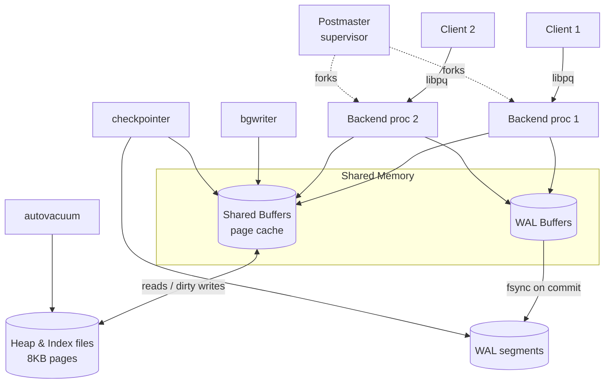
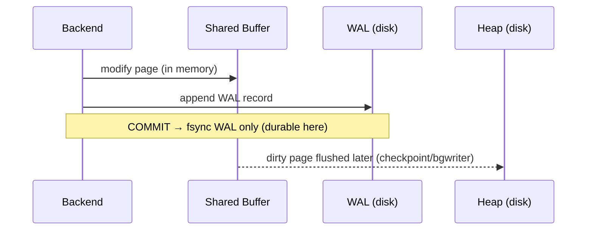

# PostgreSQL Internal Architecture

> A study of how PostgreSQL stores, caches, versions, and durably commits data: the buffer manager, the B-tree access method, MVCC, and the Write-Ahead Log. All experiments below were run live against **PostgreSQL 16.14** (Docker `postgres:16`) on a dataset of 50k customers, 200k orders, and 600k order items.

---

## 1. Problem Background

PostgreSQL descends from the POSTGRES project at UC Berkeley (Michael Stonebraker, mid-1980s), which set out to extend the relational model with richer types, rules, and extensibility. The modern system exists to provide a **correct, durable, highly-concurrent, standards-compliant SQL database** that many clients can hit simultaneously without corrupting each other's data or losing committed work on a crash.

Three hard problems sit at the centre of any such system, and PostgreSQL's internals are essentially the answers to them:

1. **Disk is slow, memory is small.** → a shared *buffer manager* that caches hot pages.
2. **Many users read and write the same rows at once.** → *MVCC* (Multi-Version Concurrency Control) so readers never block writers.
3. **A crash can happen mid-write.** → the *Write-Ahead Log* (WAL) so committed transactions survive and partial writes are recovered.

The rest of this document explains each mechanism and shows it operating on a real instance.

---

## 2. Architecture Overview

PostgreSQL uses a **process-per-connection** model. A supervisor (the postmaster) forks a dedicated backend process for every client. All backends share one block of memory (`shared_buffers`) and one WAL stream, coordinated by a set of background utility processes.



**Data flow of a write:** a backend modifies a page *in the shared buffer pool* (not on disk), records the change in the WAL buffer, and on `COMMIT` forces the WAL record to disk (`fsync`). The dirty data page itself is written back lazily later by the **bgwriter** or at a **checkpoint**. This "log first, data later" ordering is the whole basis of durability.

---

## 3. Internal Design

### 3.1 Storage layout: pages, heaps, and TIDs

Every table (a *heap*) and every index is a file divided into fixed **8 KB pages**. A page holds a header, an array of line pointers, and tuples that grow inward from the end. A row's physical address is a **TID** `(block, offset)`, exposed as the system column `ctid`. Indexes ultimately point at TIDs.

### 3.2 Buffer Manager (`src/backend/storage/buffer/`)

Pages are read from disk into `shared_buffers` and reused across all backends. PostgreSQL replaces buffers with a **clock-sweep** algorithm (an approximation of LRU using a per-buffer usage counter), favouring eviction of pages that haven't been touched recently. A page is only written to disk when it is *dirty* and gets evicted, flushed by the bgwriter, or captured by a checkpoint.

**Experiment: what is actually cached?** After the join workload, I inspected the live buffer pool:

```text
labdb=# SELECT c.relname, count(*) AS buffers, pg_size_pretty(count(*)*8192) AS cached
        FROM pg_buffercache b JOIN pg_class c
          ON b.relfilenode = pg_relation_filenode(c.oid)
        GROUP BY c.relname ORDER BY buffers DESC;

      relname      | buffers | cached
-------------------+---------+---------
 order_items       |    3826 | 30 MB
 orders            |    2578 | 20 MB
 orders_pkey       |    1099 | 8792 kB
 customers         |     371 | 2968 kB
 idx_orders_status |     194 | 1552 kB
```

```text
 shared_buffers = 128MB

 datname | blks_hit | blks_read | hit_ratio_pct
---------+----------+-----------+---------------
 labdb   |  9689977 |      1127 |         99.99
```

The hot tables are resident in memory and the cache hit ratio is **99.99%**, almost no query touches disk. This is why the buffer manager, not the disk, dominates read latency in a warm database.

### 3.3 B-Tree access method (`nbtree`)

PostgreSQL's default index is a **Lehman-Yao B+-tree**: keys live in leaf pages linked in a doubly-linked list; internal pages route searches. A lookup walks root → internal → leaf in `O(log n)`. Inserts place the key in the correct leaf; when a leaf is full it **splits** into two, propagating a separator key upward (which may cascade splits up to the root, the only way the tree grows in height). The Lehman-Yao design adds a "high key" and right-link per page so concurrent searches can proceed during a split without locking the whole tree.

In Experiment 1 below, the index `idx_orders_status` is used via a **Bitmap Index Scan** rather than a plain index scan, because the predicate matches ~50k rows: the planner builds a bitmap of matching pages first, then visits the heap in physical order to avoid random I/O.

### 3.4 MVCC: tuple versioning with xmin / xmax

PostgreSQL never updates a row in place. Each tuple carries two hidden transaction-id columns: **`xmin`** (the txid that created it) and **`xmax`** (the txid that deleted/superseded it). An `UPDATE` marks the old tuple's `xmax` and writes a brand-new tuple version. A transaction sees a tuple only if its `xmin` is committed-and-visible and its `xmax` is not, evaluated against the transaction's **snapshot**. Readers therefore never block writers and writers never block readers.

**Experiment: watch a version get created:**

```text
labdb=# SELECT ctid, xmin, xmax, bal FROM acct;       -- initial INSERT
 ctid  | xmin | xmax | bal
-------+------+------+-----
 (0,1) |  798 |    0 | 100

labdb=# UPDATE acct SET bal = 150 WHERE id = 1;
labdb=# SELECT ctid, xmin, xmax, bal FROM acct;       -- after UPDATE
 ctid  | xmin | xmax | bal
-------+------+------+-----
 (0,2) |  799 |    0 | 150
```

The row physically moved from `ctid (0,1)` to `(0,2)` and `xmin` advanced `798 → 799`: this is a *new* tuple. The old version still exists on the page (now invisible) until VACUUM removes it.

### 3.5 Why VACUUM is necessary

Because dead tuples accumulate, tables **bloat** and must be cleaned. I updated every `paid` order three times:

```text
table size before updates : 11 MB
 n_live_tup | n_dead_tup
------------+------------
     200000 |     149982      <-- 150k dead versions
table size after updates  : 20 MB      <-- nearly doubled

-- VACUUM orders (VERBOSE):
tuples: 50000 removed, 200000 remain
index "idx_orders_status": 115 pages newly deleted
WAL usage: 7225 records, 1453141 bytes
buffer usage: 10209 hits, 125 misses, 42 dirtied
```

Three full-table updates inflated `orders` from **11 MB to 20 MB** and left ~150k dead tuples. `VACUUM` removed them and freed the space *for reuse* (a plain VACUUM does not shrink the file; `VACUUM FULL` would). VACUUM also advances the **frozen XID** horizon, preventing transaction-id wraparound. Note the VERBOSE line `WAL usage: 7225 records`, even cleanup is logged.

### 3.6 WAL, checkpoints, and crash recovery

The WAL is an append-only log of every change, written **before** the corresponding data page reaches disk (the "write-ahead" rule). On `COMMIT`, only the WAL record must be `fsync`'d, a small sequential write, which is far cheaper than flushing scattered data pages. The data pages are flushed later at a **checkpoint**, which writes all dirty buffers and records a safe restart point in the WAL.



On crash recovery, PostgreSQL replays WAL from the last checkpoint: committed changes whose data pages never reached disk are reapplied (REDO); the result is exactly the committed state at the moment of the crash.

### 3.7 The planner and `pg_statistic`

PostgreSQL is a **cost-based** optimizer. `ANALYZE` samples each table and stores distribution data in `pg_statistic` (readable via the `pg_stats` view): number of distinct values, most-common values (MCVs) and their frequencies, and histograms. The planner uses these to estimate row counts and pick the cheapest plan.

```text
labdb=# SELECT attname, n_distinct, most_common_freqs FROM pg_stats
        WHERE tablename='orders' AND attname='status';
 attname | n_distinct |               most_common_freqs
---------+------------+-----------------------------------------------
 status  |          4 | {0.2512, 0.2505, 0.2492, 0.2491}
```

The four statuses each occur ~25% of the time. For `WHERE status='paid'` the planner therefore estimates `0.2492 × 200000 ≈ 49,847` rows, and the actual count was **50,000** (see Experiment 1). Accurate statistics are why it chose a bitmap scan instead of a sequential scan.

---

## 4. Design Trade-Offs

| Decision | Benefit | Cost / Limitation |
|---|---|---|
| **Process-per-connection** | Strong isolation; a crashing backend can't corrupt others | High per-connection memory; thousands of connections need a pooler (PgBouncer) |
| **MVCC via new tuple versions** | Readers never block writers; simple snapshot semantics | Bloat; mandatory VACUUM; index entries for every version |
| **Append/relocate updates** | No undo segment needed; old versions are cheap to keep | Updates are not in-place → more I/O and index churn than InnoDB |
| **WAL (log-first)** | Cheap sequential commit; point-in-time recovery; replication | Double writes (log + data); checkpoints cause I/O spikes |
| **Clock-sweep buffer cache** | Cheap approximation of LRU, low contention | Not a true LRU; can mis-evict under skewed access |
| **Cost-based planner** | Adapts plans to data distribution | Wholly dependent on fresh statistics; stale stats → bad plans |

The defining trade-off versus an in-place engine like InnoDB: PostgreSQL trades **update efficiency and steady-state space** for **simpler, lock-free reads and easy version retention**, paid back through VACUUM. (Compared directly in the MySQL/InnoDB document.)

---

## 5. Experiments / Observations

### Experiment 1: `EXPLAIN (ANALYZE, BUFFERS)` on a 3-table join

```sql
EXPLAIN (ANALYZE, BUFFERS)
SELECT c.country, count(*) AS orders, sum(oi.qty*oi.price_cents) AS revenue
FROM customers c
JOIN orders o       ON o.customer_id = c.id
JOIN order_items oi ON oi.order_id   = o.id
WHERE o.status = 'paid'
GROUP BY c.country ORDER BY revenue DESC;
```

```text
 Sort  (actual time=147.785..151.897 rows=5)
   ->  Finalize GroupAggregate
     ->  Gather Merge (Workers Launched: 2)
       ->  Partial HashAggregate
         ->  Hash Join (Hash Cond: o.customer_id = c.id)  rows=49888
           ->  Parallel Hash Join (Hash Cond: oi.order_id = o.id)
             ->  Parallel Seq Scan on order_items oi  rows=200000
             ->  Parallel Hash
               ->  Parallel Bitmap Heap Scan on orders o
                 Recheck Cond: (status = 'paid')
                 ->  Bitmap Index Scan on idx_orders_status  rows=50000
           ->  Hash -> Seq Scan on customers c  rows=50000
 Planning Time: 1.222 ms
 Execution Time: 152.050 ms
 Buffers: shared hit=6441 read=44
```

**Observations:**
- The planner chose **parallel hash joins** with 2 workers, appropriate for joining large unindexed result sets.
- `orders` is filtered through a **Bitmap Index Scan** on `idx_orders_status` (estimate 49,847, actual 50,000, statistics were accurate).
- `order_items` is read by a **parallel sequential scan**: no useful index predicate, so a full scan parallelised across workers is cheapest.
- `Buffers: shared hit=6441 read=44`, only 44 of ~6,485 page accesses missed the cache, consistent with the 99.99% hit ratio.

### Experiment 2: statistics drive estimates
Already shown in §3.7: `most_common_freqs` of 0.2492 for `status='paid'` produced an estimate within 0.3% of reality. Disabling `ANALYZE` (stale stats) would degrade these estimates and risk a sequential-scan plan.

### Experiment 3: MVCC version creation
§3.4: an `UPDATE` produced a new tuple at a new `ctid` with an incremented `xmin`, leaving the old version behind.

### Experiment 4: bloat and VACUUM
§3.5: 3× updates doubled the table size and created 150k dead tuples; `VACUUM` reclaimed them and logged its own WAL.

### Experiment 5: buffer pool contents
§3.2: `pg_buffercache` confirmed the working set lives in `shared_buffers` with a 99.99% hit ratio.

---

## 6. Key Learnings

- **Memory, not disk, is the steady-state bottleneck.** With a warm cache the database served reads at a 99.99% hit ratio; the buffer manager's job is to keep it that way.
- **MVCC is elegant but not free.** Lock-free reads are bought with dead tuples; the `xmin/xmax` + new-version mechanism *is* the reason VACUUM exists. Seeing a table double in size from three updates makes the cost tangible.
- **Durability is decoupled from data writes.** Commit only needs the WAL on disk; data pages follow lazily at checkpoints. This single ordering rule (log-first) gives both fast commits and crash safety.
- **The planner is only as good as its statistics.** The bitmap-scan choice and its near-perfect row estimate came directly from `pg_statistic`; stale stats are one of the most common causes of bad plans in production.
- **Surprising observation:** a *cleanup* operation (VACUUM) is itself a logged, WAL-generating transaction, durability discipline applies even to garbage collection.

---

### Reproducing these results
```bash
docker run -d --name pg -e POSTGRES_PASSWORD=postgres -e POSTGRES_DB=labdb -p 5439:5432 postgres:16
# load schema + data, then run the queries shown above (CREATE EXTENSION pg_buffercache; first)
```
*Engine: PostgreSQL 16.14 (Debian build) in Docker. Sources referenced: PostgreSQL 16 documentation (Chapters on Storage, MVCC, WAL, Indexes) and the `src/backend/storage/buffer/` and `src/backend/access/nbtree/` source trees.*
