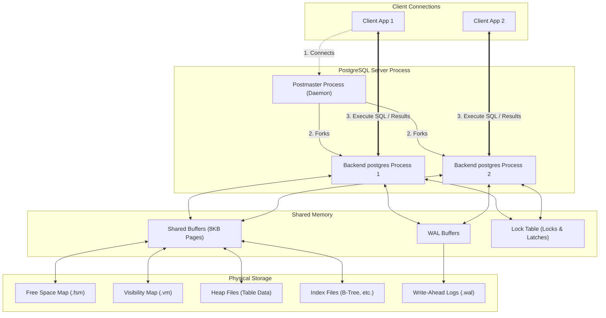

# PostgreSQL Internal Architecture: Deep Dive Analysis

This document provides a highly detailed system design analysis of PostgreSQL's internal database architecture, focusing on the Buffer Manager, B-Tree (nbtree) index implementation, Multi-Version Concurrency Control (MVCC), Write-Ahead Logging (WAL), and query plan execution analysis.

---

## 1. Problem Background

### History and Evolution
PostgreSQL originated from the POSTGRES (Post Ingres) project at the University of California, Berkeley, led by Professor Michael Stonebraker in 1986. The project was conceived as a successor to INGRES to solve key limitations of contemporary relational databases:
1. **Extensibility**: Support for user-defined types, functions, operators, and index access methods.
2. **Object-Relational Features**: Support for inheritance, rule systems, and complex objects.
3. **Data Integrity**: Complete transactional support (ACID) with robust crash recovery.

Over its 40-year evolution, PostgreSQL transitioned from a research prototype to a leading open-source database engine, focusing heavily on SQL standard compliance, concurrency scaling, and high reliability.

---

## 2. Architecture Overview

PostgreSQL operates on a multi-process, client-server model. The core components of its internal processing engine are structured as follows:



---

## 3. Internal Design

### 3.1. Buffer Manager

The Buffer Manager coordinates the flow of 8KB data pages between the physical disk and the shared memory buffer pool.

#### Buffer Pool Structure
PostgreSQL allocates a contiguous block of shared memory called the **Shared Buffers**. This block is divided into page slots (each 8KB) and managed by two arrays:
1. **Buffer Descriptors**: An array of metadata headers describing each buffer slot. Each descriptor contains:
   - **Buffer Tag**: Uniquely identifies the page (Table OID, Fork Number, Block Number).
   - **Flags**: Indicates if the page is `dirty` (needs writing to disk), `pinned` (currently being read/written by a process), or contains valid data.
   - **Pin Count**: The number of backend processes currently accessing this page.
   - **Usage Count**: A counter (0 to 5) tracking how frequently the page is accessed (used for eviction).
2. **Buffer Pool**: The actual array of 8KB page frames holding the database blocks.

#### Buffer Replacement Algorithm (Clock-Sweep)
To evict pages when the buffer pool is full, PostgreSQL uses a variant of the **Second Chance / Clock-Sweep** algorithm:

```
                  Usage Count = 3 (Skip)
                     ┌──────────┐
                     │ Buffer 1 │
                     └──────────┘
                         ▲
                         │
     Usage Count = 0     │    Pin Count > 0 (Skip)
     Not Pinned      ┌───┴───┐    ┌──────────┐
     ┌──────────┐ ◄──┤ Sweep ├──► │ Buffer 2 │
     │ Buffer 4 │    │ Hand  │    └──────────┘
     └──────────┘    └───┬───┘
     (EVICTED!)          │
                         ▼
                     ┌──────────┐
                     │ Buffer 3 │
                     └──────────┘
                  Usage Count = 1 (Decremented to 0)
```

1. A circular pointer ("sweep hand") scans the buffer descriptors.
2. If a buffer slot has a **Pin Count > 0**, it is skipped (pinned pages cannot be evicted).
3. If a buffer slot's **Usage Count is > 0**, the sweep hand decrements the Usage Count by 1 and moves to the next slot.
4. If a buffer slot's **Usage Count is 0** and it is **not pinned**, this buffer is selected for eviction:
   - If the selected page is **dirty**, the backend process writes the page to disk (or delegates it to the Background Writer) before replacing its content.
   - The buffer tag is updated, and the pin count is set to 1.

#### Page Reads and Writes
- **Read Path**: The backend computes a hash of the requested page's Buffer Tag. If found in the hash table, it increments the pin count and returns the buffer. If a cache miss occurs, the backend invokes the Clock-Sweep algorithm to find an evictable slot, loads the page from disk into that slot, updates the hash table, and pins the slot.
- **Write Path**: When a backend modifies a page in shared buffers, it marks the buffer descriptor as **dirty**. It does not write it to disk immediately. Instead, the checkpointer or background writer flushes it asynchronously, or a backend flushes it if forced to evict it.

---

### 3.2. B-Tree (nbtree) Implementation

PostgreSQL's default index is the **nbtree**, a high-concurrency implementation of the Lehman & Yao B+Tree.

#### High-Concurrency B-Tree Properties
1. **Right-Links**: Every node in the nbtree contains a pointer (right-link) to its immediate right sibling at the same level.
2. **High-Key**: Every page has a "high-key" representing the maximum value stored in that page or its sub-trees.
3. These structural features allow reads to traverse the tree **without acquiring write locks** on parent nodes. If a writer splits a page concurrently, a reader that descends to the old page can detect if the search key is greater than the page's high-key. If so, it simply follows the right-link to the sibling page.

```
                  ┌──────────────┐
                  │ Parent Node  │
                  └──────┬───────┘
                         │
           ┌─────────────┴─────────────┐
           ▼ (Concurrent Split)        ▼ (Right-Link)
     ┌───────────┬─────────┐     ┌───────────┬─────────┐
     │ Leaf Page │ HighKey │ ===>│ Sibling L │ HighKey │
     │    [A]    │   [10]  │     │    [B]    │   [20]  │
     └───────────┴─────────┘     └───────────┴─────────┘
```

#### Page Layout
An index page uses the same slotted page structure as a table heap page:
- **PageHeaderData**: Page LSN, line pointers free space boundaries, special space offset.
- **ItemIdData array (Line pointers)**: Offsets to index tuples.
- **IndexTupleData**: Contains the index key (value) and a pointer (`ctid` or block offset) referencing the table tuple.
- **Special Space**: Located at the very end of the index page; contains B-Tree specific metadata (right-link pointer, left-link pointer, page flags like leaf/root/interior).

#### Split Operations
When an insert target page is full:
1. A new page is allocated.
2. Half of the keys are moved to the new page.
3. The right-link of the original page is pointed to the new page, and the high-keys are updated.
4. A downlink to the new page is inserted into the parent node. Due to right-links, if a reader accesses the parent node before the downlink is registered, it can still traverse to the new page via the sibling right-link.

---

### 3.3. MVCC (Multi-Version Concurrency Control)

PostgreSQL implements MVCC to allow multiple transactions to execute concurrently without readers blocking writers, and vice-versa.

#### Heap Tuple Layout & Versioning
Every row (tuple) in a heap page contains a header (`HeapTupleHeaderData`) containing transactional metadata:
- `t_xmin`: The Transaction ID (TxID) of the transaction that inserted the row.
- `t_xmax`: The TxID of the transaction that deleted or updated the row. For active rows, this is set to 0.
- `t_cid`: Command ID (tracking sequence of queries within a single transaction).
- `t_infomask`: Bit flags storing transaction status (e.g., whether `xmin` or `xmax` committed, rolled back, or aborted).

```
   ┌────────────────────────────────────────────────────────┐
   │ Row Version (Tuple)                                    │
   ├──────────────┬──────────────┬─────────────┬────────────┤
   │ t_xmin = 100 │ t_xmax = 105 │ t_cid = 0   │ Data Bytes │
   └──────────────┴──────────────┴─────────────┴────────────┘
```

#### Visibility Rules and Snapshots
When a transaction executes, it takes a **Snapshot** represented as `XMIN:XMAX:active_list`:
- `XMIN`: All transactions below this ID have committed and are visible.
- `XMAX`: All transactions at or above this ID are active/uncommitted and invisible.
- `active_list`: A list of active transaction IDs between `XMIN` and `XMAX` at snapshot creation.

A tuple is visible to a transaction if:
1. `xmin` has committed AND is less than the snapshot's `XMIN` (or is the current transaction itself).
2. `xmin` is between `XMIN` and `XMAX` but was **not** active (not in `active_list`) when the snapshot was taken.
3. AND `xmax` is either 0, has rolled back/aborted, or is greater than the snapshot's `XMAX` (representing a deletion/update that hasn't committed yet).

#### Role of VACUUM
Because updates append new versions of tuples rather than overwriting in-place, the heap accumulates "dead tuples" (old tuple versions no longer visible to any active transaction). 
The **VACUUM** process scans pages, checks visibility against the oldest active transaction ID (`OldestXmin`), and:
1. Reclaims the space occupied by dead tuples, updating the **Free Space Map (.fsm)**.
2. Updates the **Visibility Map (.vm)**, marking pages where all tuples are visible to all transactions (allowing index-only scans to skip visiting the heap).
3. Prevents transaction ID wrap-around by freezing old tuple headers (marking `xmin` with a special `FrozenTransactionId` value of 2).

---

### 3.4. Write-Ahead Logging (WAL)

WAL guarantees durability and atomicity by logging database state transitions before changes are written to the database pages.

#### WAL Record Structure
Every WAL record contains:
- **LSN (Log Sequence Number)**: A 64-bit integer indicating the byte offset of the record in the WAL stream.
- **Resource Manager ID (rmid)**: Identifies the subsystem (e.g., Heap, B-Tree, Transaction) that created the log record.
- **Block References**: References to database blocks modified by this record.
- **Payload**: Binary diffs or logical descriptors of the change.

#### Durability & Crash Recovery
- **Write-Ahead Protocol**: When a transaction commits, the WAL buffers holding its commit records are flushed to disk using `fsync`. The data pages themselves can remain dirty in the shared buffers.
- **Crash Recovery**: If the system crashes, the startup process reads `pg_control` to find the last checkpoint LSN. It then runs a **REDO** phase: replaying WAL records sequentially from the checkpoint to the end of the log, updating pages on disk if their page LSN is less than the WAL record's LSN.

#### Checkpoint Process
A checkpoint is triggered periodically (by timeout or size limits):
1. The Checkpointer identifies all currently dirty buffers in the Shared Buffers.
2. It writes a `CHECKPOINT_START` record to the WAL.
3. It slowly writes all dirty buffers to the OS filesystem cache and calls `fsync` on the data files to force physical persistence.
4. It writes a `CHECKPOINT_ONLINE` record to the WAL and updates the `pg_control` file with the start LSN.
5. All WAL segments older than the checkpoint can then be recycled.

---

## 4. Design Trade-Offs

### Concurrency vs. Overhead
- **Pros**: Readers never block writers, and writers never block readers. Very high concurrency is achieved for workloads with mixed read/write query distributions.
- **Cons**: Write operations require inserting new versions of tuples (write amplification). Updating a row also requires updating all indexes pointing to that row (since indexes point to physical heap coordinates `ctid`), causing index bloat. This is partially mitigated by **HOT (Heap-Only Tuple)** optimization, which allows index updates to be skipped if the index column itself is not modified.

### Clock-Sweep vs. Strict LRU
- **Pros**: Clock-sweep does not require acquiring a global mutex on every cache access, since it only uses atomic usage counters. This scales much better across multi-core systems compared to strict LRU.
- **Cons**: Clock-sweep is a heuristic and can be sub-optimal compared to advanced eviction algorithms like 2Q or ARC for complex workloads with varying access patterns.

---

## 5. Experiments / Observations: Execution Plan Analysis

To analyze how the PostgreSQL planner compiles execution plans and generates estimates, we examine a multi-table JOIN query executed on a mock database containing `users` and `orders` tables.

### The Query
```sql
EXPLAIN ANALYZE
SELECT u.username, COUNT(o.id) AS order_count
FROM users u
JOIN orders o ON u.id = o.user_id
WHERE u.status = 'active'
GROUP BY u.username;
```

### Simulated `EXPLAIN ANALYZE` Output
```
GroupAggregate  (cost=125.40..132.80 rows=150 width=40) (actual time=8.240..9.450 rows=145 loops=1)
  Group Key: u.username
  ->  Sort  (cost=125.40..126.90 rows=600 width=32) (actual time=8.210..8.420 rows=620 loops=1)
        Sort Key: u.username
        Sort Method: quicksort  Memory: 96kB
        ->  Hash Join  (cost=15.50..97.60 rows=600 width=32) (actual time=1.120..7.850 rows=620 loops=1)
              Hash Cond: (o.user_id = u.id)
              ->  Seq Scan on orders o  (cost=0.00..68.00 rows=4000 width=8) (actual time=0.015..3.850 rows=4000 loops=1)
              ->  Hash  (cost=13.00..13.00 rows=200 width=28) (actual time=1.050..1.050 rows=205 loops=1)
                    Buckets: 1024  Batches: 1  Memory Usage: 22kB
                    ->  Index Scan using idx_users_status on users u  (cost=0.15..13.00 rows=200 width=28) (actual time=0.020..0.850 rows=205 loops=1)
                          Index Cond: (status = 'active'::text)
Planning Time: 0.280 ms
Execution Time: 9.680 ms
```

### Plan and Estimate Analysis

#### 1. Plan Structure
1. **Index Scan on `users`**: The planner chooses an index-scan using `idx_users_status` to filter users where `status = 'active'`.
   - *Cost*: `0.15..13.00` (represents startup cost and total cost respectively).
   - *Row Estimate*: Estimates 200 rows. Actual rows scanned: 205. Excellent accuracy.
2. **Hash Construction**: The 205 scanned users are built into a Hash Table in memory (using 22KB, fitting inside 1 batch with 1024 buckets).
3. **Seq Scan on `orders`**: A sequential scan is executed on `orders`.
   - *Row Estimate*: 4000 rows. Actual: 4000.
4. **Hash Join**: The query executes a Hash Join by probing the `orders` seq scan against the hash table built from `users`.
   - *Row Estimate*: 600 joined rows. Actual: 620 joined rows.
5. **Sort**: The joined rows are sorted in memory using quicksort (`Memory: 96kB`) by the group key `username`.
6. **GroupAggregate**: Performs grouping and aggregate calculation (`COUNT(o.id)`) on the sorted stream.

#### 2. Relationship with `pg_statistic`
The planner's accuracy depends on the database catalog statistics collected by the `ANALYZE` background daemon:
- **`pg_statistic` Catalog Table**: Stores raw statistical data for all columns, including:
  - `stanullfrac`: The fraction of null values.
  - `stawidth`: Average width of column values.
  - `stadistinct`: Number of distinct values.
  - `stakind`: Type of statistical data stored (e.g., histograms, Most Common Values - MCV).
- **`pg_stats` System View**: A human-readable interface to `pg_statistic`. 
  - For the index scan condition `status = 'active'`, the planner queries `pg_stats` to read the MCV (Most Common Values) array. If `status` has a low distinct value count (e.g. 'active', 'inactive', 'suspended'), the MCV lists the exact frequency of 'active'. 
  - For join selectivity, the planner checks the correlation coefficients and null fractions of `users.id` and `orders.user_id` to estimate the resulting join cardinality. If statistics are stale or missing, the planner defaults to geometric heuristics, often resulting in sub-optimal join strategies (like nested loops on huge tables).

---

## 6. Key Learnings

1. **Slotted Pages and Pointer Decoupling**: Decoupling physical storage coordinates from user-facing identifiers using slotted pages and line pointers is a fundamental technique for storage defragmentation and variable-width storage.
2. **Consequences of MVCC Bloat**: While MVCC delivers unparalleled read concurrency, it shifts computational and disk complexity to background tasks (VACUUM). Stale statistics or long-running transactions can block VACUUM, causing severe database bloat and performance degradation.
3. **Lehman & Yao Concurrency**: Incorporating simple side links (right-links) into tree index nodes allows databases to scale query concurrency by decoupling search path locking from splits, highlighting the power of lock-free design concepts.
