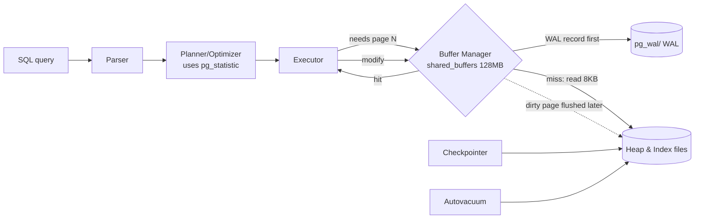

# PostgreSQL Internal Architecture

> A guided tour of how PostgreSQL actually stores, finds, versions, and protects a row — done by poking at a live **PostgreSQL 18.3** instance with `EXPLAIN (ANALYZE, BUFFERS)`, `pageinspect`, `pg_buffercache`, and the system catalogs. Every table, plan, and number below is real output captured from the dataset in `setup.sql` (20k students, 200k enrollments). The full transcript is in `results.txt`; re-run with `psql -d dbms_lab -f queries.sql`.

---

## 1. Problem Background

PostgreSQL is a shared, durable, multi-user database. That forces four hard internal problems, and this document is organized around the component that solves each one:

| Problem | Component |
|---|---|
| Disk is slow; don't read the same page twice | **Buffer Manager** (shared buffers) |
| Find one row among millions without scanning | **B-tree indexes** (nbtree) |
| Let many transactions read/write concurrently without locking each other | **MVCC** (multi-version rows) |
| Survive a crash with no committed data lost | **WAL** (write-ahead log) |

The recurring theme: PostgreSQL almost never overwrites or blocks when it can instead *append a new version* and *log the intent first*. That choice is what makes it concurrent and crash-safe — and it's also why `VACUUM` has to exist.

---

## 2. Architecture Overview



The golden rule visible in this diagram: **a change is written to WAL (and fsync'd) before the modified data page is allowed to reach the heap on disk.** That ordering is the entire basis of crash recovery.

---

## 3. Internal Design

### 3.1 Buffer Manager — the 8 KB page cache

PostgreSQL reads and writes the heap in fixed **8 KB pages**. `shared_buffers` (here **128 MB** = 16,384 buffer slots) is a shared-memory array of these pages that all backends use. Every plan node reports `shared hit=` (page already cached) vs `read=` (had to go to disk):

```
Bitmap Heap Scan on enrollments  (student_id = 12345)
  Buffers: shared hit=11 read=1        <- 11 pages from cache, 1 from disk
  Execution Time: 0.048 ms
```

After the workload, `pg_buffercache` shows exactly what's resident:

```
 relname          | buffers | cached
------------------+---------+--------
 enrollments      |   1406  | 11 MB     <- the whole hot table is in RAM
 idx_enr_student  |    255  | 2040 kB
 students         |    141  | 1128 kB
```

Replacement is a **clock-sweep** algorithm (an approximation of LRU): each buffer has a usage counter that the sweep decrements; a buffer is evictable when its count hits zero and it isn't pinned. Dirty pages aren't written by the query that dirtied them — the **bgwriter** and **checkpointer** flush them in the background, so foreground queries stay fast.

### 3.2 Heap tuple & page layout (via `pageinspect`)

A heap page is: header → an array of **line pointers** (`lp`) → free space → tuples growing from the end. Real page 0 of `students`:

```
 lp | lp_off | lp_len | t_xmin | t_xmax | t_ctid
----+--------+--------+--------+--------+--------
  1 |      0 |      0 |        |        |          <- dead line pointer (row moved away)
  2 |   8144 |     48 |    812 |    814 | (0,2)
  3 |   8096 |     48 |    812 |    814 | (0,3)
```
A row's physical address is its **`ctid` = (page, line-pointer)**. Indexes point at `ctid`, not at a byte offset, so a tuple can move within a page (or be vacuumed) without rewriting every index entry — only the line pointer is touched.

### 3.3 B-tree indexes (via `pageinspect`)

`bt_metap('students_pkey')` on the primary-key index:
```
 magic  | version | root | level | fastroot
 340322 |    4    |   3  |   1   |    3
```
A **Lehman-Yao B+-tree**: `level=1` means root + one leaf level for 20k keys. Leaf entries pair an indexed value with the heap `ctid`:
```
 itemoffset |   ctid   | data (key)
     2      | (0,1)    | 01 00 00 00 ...   (id=1, old version)
     3      | (137,32) | 01 00 00 00 ...   (id=1, new version after UPDATE)
```
Notice the index has **two entries for id=1** — one per row version (see MVCC below). Searching walks root → leaf comparing keys; the leaf's `ctid` is then used to fetch the heap tuple. Inserts that overflow a leaf trigger a **page split** (half the entries move to a new page, parent gets a new separator key).

### 3.4 MVCC — versioning instead of locking

This is the heart of PostgreSQL. Every row carries hidden columns **`xmin`** (transaction that created it) and **`xmax`** (transaction that deleted/superseded it). An `UPDATE` does **not** overwrite — it marks the old version dead and writes a **new** version:

```
-- before UPDATE
 id | ctid  | xmin | xmax
  1 | (0,1) | 812  | 814

BEGIN; UPDATE students SET dept='CS' WHERE id=1; 

-- after: brand new tuple, new location, new xmin
 id |   ctid   | xmin | xmax
  1 | (137,32) | 863  |  0
```

The old tuple at `(0,1)` physically remains; the new one lives at `(137,32)`. A transaction's **snapshot** decides which version it sees: a tuple is visible if its `xmin` committed before the snapshot and its `xmax` hasn't committed (or is null). This is why **readers never block writers and writers never block readers** — they're simply looking at different versions.

### 3.5 VACUUM — the price of MVCC

Dead tuples accumulate. I created ~20k of them with a bulk `UPDATE`, then ran `VACUUM`:

```
INFO: vacuuming "dbms_lab.public.enrollments"
tuples: 19990 removed, 200000 remain
index scan needed: 138 pages had 19990 dead item identifiers removed
WAL usage: 1851 records, 359014 bytes
```
`VACUUM` reclaims dead tuples for reuse and updates the **visibility map** (pages where all tuples are visible to everyone — these can be skipped by future vacuums and answered by index-only scans). Without it, tables bloat and transaction-ID wraparound eventually threatens correctness — hence **autovacuum** runs continuously.

### 3.6 WAL — durability & recovery

```
 current_lsn | walfile
 0/4A2ABD0   | 000000010000000000000004
 wal_level = replica | fsync = on | synchronous_commit = on
```
Every modification is first written as a **WAL record** to `pg_wal/`, identified by a monotonic **LSN** (log sequence number). On `COMMIT` with `synchronous_commit=on`, the WAL up to that LSN is `fsync`'d to disk *before* the commit returns. The data pages themselves are flushed lazily. After a crash, recovery replays WAL from the **last checkpoint** forward, reconstructing any committed change that hadn't yet reached the heap. The `VACUUM` above generated 1,851 WAL records — even cleanup is logged, so it too is crash-safe.

---

## 4. Design Trade-Offs

**MVCC's bargain.** Append-on-update buys lock-free concurrency, cheap snapshots, and instant rollback (just don't make the new version visible). The cost is **dead tuples** and the **VACUUM** machinery to clean them — table/index bloat if vacuum falls behind, and an extra read to chase `xmax` chains. PostgreSQL accepts ongoing background cleanup in exchange for never blocking readers. (InnoDB makes the opposite trade — update-in-place + undo logs — analyzed in the MySQL doc.)

**Heap + separate indexes.** Because the table is an unordered heap and every index (including the PK) points by `ctid`, *all* indexes are "secondary." Upside: cheap to add many indexes, no clustered-index rebuild cost. Downside: no clustered locality, and a non-HOT update must touch **every** index (the id=1 example created a second index entry). The **HOT** (heap-only-tuple) optimization avoids this *only* when no indexed column changed and the new version fits on the same page.

**WAL.** Sequential WAL writes turn many random page writes into one sequential append + deferred flush — faster commits *and* durability. The cost is **write amplification** (data is written twice: once to WAL, once to the heap) and checkpoint I/O spikes when dirty pages are finally flushed.

**Cost-based planning depends on statistics.** Great plans require accurate `pg_statistic`; stale stats → bad row estimates → bad plans. That's why `ANALYZE` (and autoanalyze) matters.

---

## 5. Experiments / Observations

**Recommended exercise — `EXPLAIN ANALYZE` on a 3-table join:**
```
EXPLAIN (ANALYZE, BUFFERS)
SELECT s.dept, count(*), avg(e.grade)
FROM students s JOIN enrollments e ON e.student_id=s.id
JOIN courses c ON c.id=e.course_id
WHERE s.dept='CS' AND c.credits=4 GROUP BY s.dept;
```
```
Finalize GroupAggregate (actual time=24.288..25.620 rows=1)
  Gather (Workers Launched: 1)
    Partial GroupAggregate
      Hash Join (e.course_id = c.id)              est 5882  / actual 5000
        Hash Join (e.student_id = s.id)           est 23529 / actual 20000
          Parallel Seq Scan on enrollments        100000 rows/worker
          Hash -> Bitmap Index Scan on idx_students_dept (dept='CS')
        Hash -> Seq Scan on courses (credits=4)   Rows Removed by Filter: 375
Planning Time: 1.771 ms   Execution Time: 25.783 ms
```
Reading the plan:
- **Two hash joins**, the larger input scanned in **parallel** (1 extra worker) — the planner's choice for big unsorted inputs.
- **`students` reached by a bitmap index scan** on `dept` (selective: 4,000/20,000), but **`courses` by a seq scan** (filter `credits=4` keeps 125/500 — an index wouldn't pay).
- **Estimates vs actuals are close** (5,882 vs 5,000; 23,529 vs 20,000) → the statistics are good.

**Where do those estimates come from? `pg_stats`:**
```
 attname    | n_distinct | most_common_vals
 student_id |   19923    | {12154}                      <- nearly unique
 grade      |     11     | {8,0,7,2,3,9,4,1,5,6,10}     <- only 11 values
```
This single row of statistics explains the planner's behavior elsewhere:

**Index vs sequential scan, decided by selectivity:**
```
WHERE student_id = 12345  -> Bitmap Index Scan, Buffers: 12,   0.048 ms
WHERE grade = 7           -> Seq Scan,           Buffers: 1274, 9.361 ms
                             Rows Removed by Filter: 181818
```
`grade` has only 11 distinct values, so `grade=7` matches ~18k rows (9% of the table). The planner correctly decides a full scan is cheaper than 18k random index fetches — and uses the index for the highly selective `student_id`. **This is the planner earning its keep from `pg_statistic`.**

**Buffers confirm caching:** the index lookup touched 12 pages; the seq scan touched all 1,274 pages of the table — and after running, `pg_buffercache` showed all 1,406 of `enrollments`' buffers resident.

---

## 6. Key Learnings

1. **`ctid` is the spine.** Indexes point to it, MVCC moves it, VACUUM reclaims it. Seeing `(0,1)` become `(137,32)` after an `UPDATE` made the whole append-on-update model concrete.
2. **MVCC and VACUUM are one mechanism, not two.** You can't get lock-free reads without leaving dead tuples behind, and you can't leave dead tuples behind without something to sweep them — that's the deal Postgres signs.
3. **The planner is only as good as its statistics.** The same table chose an index for one column and a seq scan for another, purely from `n_distinct`/MCV in `pg_statistic`. Estimates within ~15% of actuals produced a sensible parallel hash-join plan.
4. **WAL is "log the intent, then do the work."** Commit fsyncs the log, not the data; recovery replays the log. It's the reason a crash mid-write doesn't lose committed rows.
5. **The buffer manager makes the difference between 0.05 ms and 9 ms.** Cache hits (`shared hit`) are essentially free; the optimizer's job is largely to minimize how many distinct 8 KB pages a query must touch.
