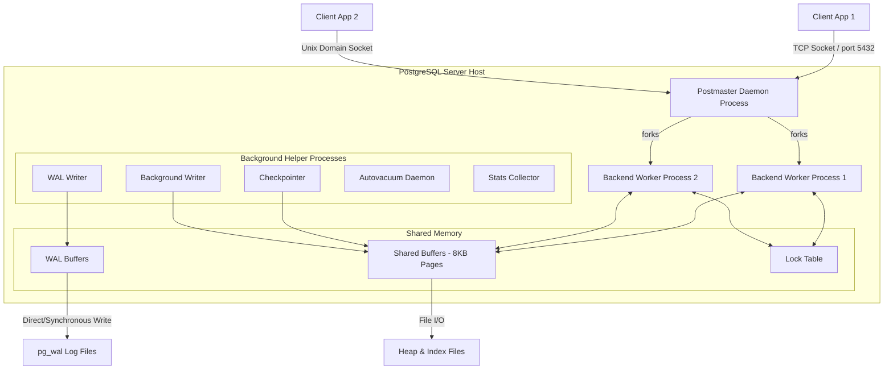

# System Design Discussion: PostgreSQL vs. SQLite3 Architecture Comparison

This document provides a comprehensive, low-level comparative analysis of the system architectures of **PostgreSQL** and **SQLite3**. It explores their structural models, internal storage engines, memory management, transaction mechanisms, and recovery workflows, backed by empirical observations and architectural reasoning.

---

## 1. Problem Background

Database systems are engineering artifacts shaped by the problems they were designed to solve. The stark architectural divergence between PostgreSQL and SQLite3 stems from their opposing design philosophies and historical contexts.

```
┌────────────────────────────────────────────────────────────────────────┐
│                          DESIGN PHILOSOPHIES                           │
├───────────────────────────────────┬────────────────────────────────────┤
│             SQLITE3               │            POSTGRESQL              │
│       "Zero Administration"       │       "Enterprise Strength"        │
│    • Embedded in-process library  │    • Multi-process client-server   │
│    • Serverless, configurationless│    • Highly extensible, compliant  │
│    • Single-file portability      │    • Concurrent write scalability  │
└───────────────────────────────────┴────────────────────────────────────┘
```

### SQLite3: The Serverless Embedded Library
* **Origin**: Designed in 2000 by D. Richard Hipp while working on a military contract for the US Navy's guided-missile destroyers (USS Cole). The goal was to build a database that did not require installation, configuration, or active administration, allowing programs to run even if a database server daemon crashed or was offline.
* **Problem Statement**: Standard databases of the era required complex setup, daemon management, TCP network configurations, and database administrators (DBAs). Hipp wanted a self-contained, transactional database engine that could be directly compiled into an application, treating the database as a single file on disk.
* **Target Workload**: Embedded systems, mobile applications (iOS/Android), desktop software, local development, and write-once-read-many (WORM) configurations where inter-process network overhead is unacceptable and database setup must be zero-friction.

### PostgreSQL: The Object-Relational Enterprise Server
* **Origin**: Began in 1986 as the **POSTGRES** project at UC Berkeley, led by Turing Award laureate Michael Stonebraker, as a successor to the Ingres database. 
* **Problem Statement**: Early relational databases struggled with extensibility (adding user-defined types, operators, and index methods) and reliability under highly concurrent, enterprise-scale workloads. POSTGRES sought to introduce object-relational capabilities, robust concurrency control, and absolute compliance with ACID properties in a multi-user environment.
* **Target Workload**: High-concurrency enterprise web applications, analytical platforms, and systems requiring complex query planning, row-level concurrency, multi-user access control, and absolute reliability under heavy write contention.

---

## 2. Architecture Overview

The primary difference between the two systems is their physical boundaries relative to the application process.

### SQLite3: In-Process Library Model
SQLite3 does not run as a standalone background process. Instead, it is a statically or dynamically linked C library that runs entirely inside the application's process and address space.

```mermaid
graph TD
    subgraph "Application Process"
        App[Application Logic] -->|Direct Function Calls| API[SQLite C API]
        
        subgraph "SQLite Library (libsqlite3)"
            API --> Tokenizer[Tokenizer & Parser]
            Tokenizer --> CodeGen[Code Generator]
            CodeGen --> VM[Virtual Machine / VDBE]
            VM --> BTree[B-Tree Layer]
            BTree --> Pager[Pager Layer (Cache)]
            Pager --> OS[OS Interface / VFS]
        end
    end
    
    OS -->|POSIX Syscalls: open/read/write/mmap| DBFile[".db File (Disk)"]
```

* **Communication**: Direct, zero-latency C function calls. No network protocols, sockets, or serialization overhead.
* **Resource Sharing**: Shares the heap, stack, and file descriptors of the host process.
* **Data Flow**: The application compiles SQL into virtual machine instructions (bytecode) that the Virtual Database Engine (VDBE) executes. The VDBE requests pages from the B-Tree/Pager layers, which read directly from disk via the OS filesystem.

---

### PostgreSQL: Multi-Process Client-Server Model
PostgreSQL runs as a server daemon that manages a cluster of databases and communicates with clients via Unix Domain Sockets or TCP/IP.



* **Process Model**: PostgreSQL uses a process-per-connection model. The master daemon (`postmaster`) listens on a port (default 5432). When a client connects, `postmaster` forks a dedicated `postgres` backend worker process.
* **Communication**: Client-server protocol over sockets, requiring inter-process communication (IPC) and data serialization/deserialization.
* **Inter-Process Coordination**: Coordinates via a large segment of allocated **Shared Memory** containing the shared page buffers, WAL buffers, and a global transaction lock table. Deadlocks and query sync are managed globally.

---

## 3. Internal Design

Understanding the internals of page structures, concurrency models, and indexing highlights the deep architectural differences between the two databases.

### 3.1. Storage Structures & File Organization

```
┌────────────────────────────────────────────────────────────────────────┐
│                        STORAGE LAYOUT COMPARISON                       │
├───────────────────────────────────┬────────────────────────────────────┤
│             SQLITE3               │            POSTGRESQL              │
│          "Single File"            │         "File Per Table"           │
│  ┌─────────────────────────────┐  │  ┌──────────────┐┌──────────────┐  │
│  │ Page 1: Header / metadata   │  │  │   Table A    ││   Index A    │  │
│  ├─────────────────────────────┤  │  │ (Heap File)  ││   (B-Tree)   │  │
│  │ Page 2: Table B-Tree Root   │  │  │ [8KB Blocks] ││ [8KB Blocks] │  │
│  ├─────────────────────────────┤  │  └──────────────┘└──────────────┘  │
│  │ Page 3: Index B-Tree Root   │  │  • Split into 1GB segments         │
│  └─────────────────────────────┘  │  • Unordered heap pages            │
└───────────────────────────────────┴────────────────────────────────────┘
```

#### SQLite3 (Single-File Page Database)
* **File Organization**: The entire database (schema, tables, indexes) is stored as a single, contiguous file on disk. The file is divided into uniform pages (ranging from 512 bytes to 64 KB; default is 4096 bytes).
* **Table Storage**: Stored as **Clustered Indexes** (B+Tree). By default, tables are organized around an integer key (`rowid`). In a Table B+Tree, the internal nodes contain only keys and page pointers, while the leaf nodes contain the actual row payloads (data columns). 
  * *WITHOUT ROWID Tables*: Can be configured to store rows directly in an index-organized structure (B-Tree) keyed by the primary key.
* **Page Layout**: An SQLite page has a header (1 to 12 bytes depending on the page type: Table Leaf, Table Interior, Index Leaf, Index Interior) specifying:
  * Page flags, offset to the first freeblock, number of cells on the page, and start of cell content area.
  * Cell pointer array (indirection vector) that grows forward, while cell contents (payloads) grow backward from the end of the page.

#### PostgreSQL (Segmented Heap-File Directory)
* **File Organization**: PostgreSQL organizes data in a directory structure (typically `/var/lib/postgresql/data/base/`). Each table and index is stored in its own set of files, split into 1 GB segments (to prevent hitting filesystem size limits).
* **Table Storage**: Stored as **Heap Files**. Unlike SQLite, PostgreSQL tables are unordered collections of pages (default 8 KB). New rows (tuples) are written to any page in the heap with sufficient free space (tracked by a Free Space Map).
* **Page Layout (Slotted Page)**:
  * **Page Header**: 24 bytes containing LSN (Log Sequence Number for WAL), page flags, and offsets.
  * **Line Pointers (ItemId)**: Array of 4-byte pointers that grow forward, indicating the exact start and size of each tuple on the page.
  * **Free Space**: Space in the middle for new tuples and line pointers.
  * **Tuples (Row data)**: Grow backward from the end of the page. Each tuple starts with a `HeapTupleHeaderData` containing crucial MVCC metadata (`t_xmin`, `t_xmax`, `t_cid`, `t_infomask`).

---

### 3.2. Memory Management & Caching

#### SQLite3 (Page Cache & mmap)
* **Page Cache**: Maintains an in-memory cache of database pages. The cache size can be tuned (e.g., `PRAGMA cache_size`).
* **Memory-Mapped I/O (mmap)**: SQLite3 can bypass traditional `read()` system calls by mapping the database file directly into the application process's virtual address space using the `mmap()` syscall.
  * *Mechanism*: When the database engine needs to read page `N`, instead of copying data from the OS kernel buffer to user space, it accesses the address pointer returned by `mmap`. The OS handles paging automatically via page faults.
  * *Trade-off*: Reduces CPU cycles and memory copying, but writing still requires standard filesystem calls or memory flushes, and memory corruption in the host process can corrupt the database.

#### PostgreSQL (Double Buffering & Clock Sweep)
* **Double Buffering**: PostgreSQL manages its own memory cache called **Shared Buffers** (configured via `shared_buffers`). However, since it executes disk reads/writes using standard OS calls (`read()`, `write()`), those pages are also cached in the **OS Page Cache**. A page read thus travels from disk $\rightarrow$ OS Cache $\rightarrow$ Shared Buffers.
* **Clock Sweep Algorithm**: PostgreSQL manages page replacement in shared buffers using a Clock Sweep algorithm rather than standard LRU:
  * Each buffer header holds a `usage_count` (0 to 5) and a pin count (tracks current active readers).
  * A circular "clock hand" sweeps through the buffer frames. If a frame has a `usage_count > 0`, the hand decrements it and moves on. If it hits `usage_count == 0` and is unpinned, the page is selected for eviction.
  * When a backend accesses a page, it increments the `usage_count` (cap of 5). This provides a simple way to protect hot pages from eviction during large sequential scans.

---

### 3.3. Index Organization

#### SQLite3
* **B-Trees for Indexes**: Uses traditional B-Trees (where keys and payloads—which consist of index columns and the corresponding `rowid`—are stored in both interior and leaf nodes).
* **Limitations**: Lacks support for advanced index types. Custom indexes must be simulated using expression indexes.

#### PostgreSQL
* **Lehman & Yao B-Tree**: The default B-Tree implementation (`nbtree`) is based on the Lehman & Yao algorithm. It adds a "right-link" pointer to each node, allowing sibling traversals at the same level. This permits concurrent insertions and splits without requiring write locks on parent nodes, greatly increasing throughput under high write contention.
* **Rich Index Ecosystem**:
  * **GIN (Generalized Inverted Index)**: Crucial for full-text search, arrays, and JSONB document structures.
  * **GiST (Generalized Search Tree)**: Supports spatial data types (via PostGIS), geometric structures, and range types.
  * **BRIN (Block Range Index)**: Stores min/max summaries of contiguous physical blocks. Extremely small footprint; ideal for multi-gigabyte append-only timeseries tables.

---

### 3.4. Transaction Processing & Concurrency Control

```
┌────────────────────────────────────────────────────────────────────────┐
│                      CONCURRENCY MODEL COMPARISON                      │
├───────────────────────────────────┬────────────────────────────────────┤
│             SQLITE3               │            POSTGRESQL              │
│         "Database-Level"          │           "Row-Level"              │
│     Single Writer Lock (WAL)      │        Multi-Version (MVCC)        │
│  • Coarse-grained locking         │  • Non-blocking readers/writers    │
│  • 1 active writer at a time      │  • Multi-user write concurrency    │
└───────────────────────────────────┴────────────────────────────────────┘
```

#### SQLite3 (File-Locking and WAL)
SQLite3 utilizes database-level locking, meaning write transactions serialize at the file boundary.
* **Rollback Journal Mode**: In default journal mode, writing locks the entire database file. A writer requires an `EXCLUSIVE` lock, which blocks all readers.
* **Write-Ahead Logging (WAL) Mode**: Separates reads and writes by appending new transactions to a separate file (the `.db-wal` file).
  * *Mechanism*: Readers read pages from the main `.db` file, but check the `.db-shm` (shared memory index) to see if a newer version of the page exists in the `.db-wal` log.
  * *Concurrency*: One writer can append to the WAL while multiple readers concurrently read older page versions from the main database. However, **only one write transaction can occur at any given time**.

#### PostgreSQL (Heap-Level MVCC & Lock Manager)
PostgreSQL implements Multi-Version Concurrency Control (MVCC) at the row level, allowing readers to never block writers, and writers to never block readers.
* **Tuple Versioning**: Updates do not overwrite data in-place. An `UPDATE` performs a logical `DELETE` (sets the `xmax` header of the current tuple version) and inserts a brand new tuple (with `xmin` set to the updating transaction ID) elsewhere in the heap page.
* **Visibility Rules**:
  * When a transaction begins, it takes a snapshot containing:
    1. Active transaction IDs (`xip` list).
    2. Lower limit (all transactions below this are committed).
    3. Upper limit (all transactions above this are uncommitted/future).
  * A tuple is visible to a reader if its `xmin` has committed and is less than the snapshot's lower limit, and its `xmax` is either uncommitted, aborted, or has not yet been set.
* **Vacuuming**: Because old tuple versions accumulate in the heap (dead tuples), a background process called **Autovacuum** must periodically scan the tables to reclaim space and update the visibility map.
* **Lock Manager**: Row-level locking is managed via a shared-memory hash table (the Lock Table). If two transactions attempt to update the *same* physical row, they request exclusive locks. A cycle-detection algorithm in the Lock Manager checks a **Waits-For Graph** using a Depth-First Search (DFS) to resolve and abort deadlocks.

---

### 3.5. Recovery & Durability Mechanisms

#### SQLite3 (Rollback vs. Checkpointing)
* **Rollback Journal**: Prior to writing a modified page to the database file, the pager copies the original page contents to a rollback journal (`.db-journal`). If a crash occurs mid-write, SQLite replays the journal to restore the database to its pre-transaction state.
* **WAL Checkpointing**: In WAL mode, commits are completed when log records are flushed to the `.db-wal` file. A background or automatic **Checkpoint** operation must periodically copy these pages from the WAL file back to the main database file.

#### PostgreSQL (Write-Ahead Logging & Checkpointer)
* **WAL Logs**: All database modifications (heap writes, index page splits) are written sequentially to WAL files in the `pg_wal` directory before being flushed to the actual table files on disk.
* **Durability Workflow**:
  1. A transaction commits.
  2. The `WAL Writer` background process issues a synchronous flush (`fsync`) of the WAL buffer to the physical disk. The transaction is now durable.
  3. The modified data pages remain "dirty" in the `Shared Buffers` pool, avoiding immediate random disk I/O.
  4. The **Checkpointer** process periodically flushes all dirty pages to the table files on disk, writing a checkpoint record to the WAL.
  5. If the system crashes, crash recovery starts at the last checkpoint record in the WAL and replays all subsequent transactions, bringing the data pages back to a consistent state.

---

## 4. Design Trade-Offs

Both architectures involve deliberate engineering trade-offs tailored to their target workloads.

| Dimension | SQLite3 (Embedded Library) | PostgreSQL (Client-Server Database) |
| :--- | :--- | :--- |
| **Concurrency** | **Low-Medium**: Supports concurrent readers, but restricts writes to a single thread/process at a time (even in WAL mode). | **High**: Excellent concurrent read/write scaling, supported by row-level locking and MVCC. |
| **Setup & Maintenance**| **Zero-Config**: No server installation, configuration, user accounts, or ports. Just a library. | **Heavy**: Requires server configuration, port management, security configuration, connection tuning, and periodic vacuuming. |
| **I/O Latency** | **Extremely Low**: Bypasses network stacks and IPC. Memory accesses via `mmap` are highly optimized. | **Medium**: Slower due to network hops, socket IPC, data serialization, and multi-layered buffer pools. |
| **Data Extensibility** | **Standard SQL**: Standard relational types; restricted support for custom functions (requires compiling C extensions). | **High**: Extremely extensible (custom datatypes, user-defined functions in Python/JS/PLpgSQL, extensions like PostGIS). |
| **Resource Overhead** | **Miniscule**: Uses minimal RAM and zero background system processes. | **Heavy**: Each client connection spawns a new process, consuming significant memory and system resources. |
| **Write Amplification** | **High in Journal Mode**: Modifying a single row requires copying entire pages to the journal and writing whole pages to disk. | **Medium**: MVCC writes new tuples to heap pages, but heap-only tuple (HOT) optimizations minimize index write amplification. |

### Architectural Trade-offs Analyzed

#### 1. Embedded Library vs. Client-Server
* **Embedded (SQLite)**: Prioritizes *execution speed* and *zero administration*. By removing the network boundary, simple queries execute at memory-bus speeds. However, the database is bound to the application. It cannot easily scale horizontally, and multi-process file access is highly bottlenecked by OS file-locking primitives.
* **Client-Server (PostgreSQL)**: Prioritizes *scalability* and *isolation*. Separating the database from the application process protects data integrity from application crashes, enables horizontal scaling, and permits central user management. The cost is the network serialization and process dispatch latency.

#### 2. Clustered B+Tree vs. Heap Tables
* **Clustered (SQLite)**: Speeds up primary-key lookups because the row data is located directly in the leaf node of the key index. However, secondary index lookups are slower because they must retrieve the primary key from the index leaf and then traverse the main B-Tree.
* **Heap (PostgreSQL)**: Inserting rows is highly efficient because they can be appended to any page with free space. Secondary indexes point directly to physical locations (TID: Block/Offset), enabling fast lookups. The trade-off is the need for an asynchronous Vacuum process to clean up space left by deleted tuples.

---

## 5. Experiments & Observations

The following observations were gathered by executing performance scripts and database introspection queries on local instances of SQLite3 (v3.53.1) and PostgreSQL (v18.4).

### 5.1. SQLite3 Experiments

A test database (`test_exp.db`) was initialized with a simple schema:
```sql
CREATE TABLE users (id INTEGER PRIMARY KEY, name TEXT, email TEXT);
```

#### Page Size and Database Footprint
By executing PRAGMA commands, we inspected the low-level organization of the database file:
```sql
PRAGMA page_size;   -- Result: 4096 (4 KB)
PRAGMA page_count;  -- Result: 2
```
* **Analysis**: The database file size is exactly $4096 \text{ bytes} \times 2 \text{ pages} = 8 \text{ KB}$. This is the minimal footprint of an SQLite database. Page 1 contains the database file header (the first 100 bytes contain the magic string `"SQLite format 3\0"`, page size configuration, write/read versions, and transaction logs) and the schema table (`sqlite_master`). Page 2 contains the Table B-Tree structure for the `users` table.

#### Memory Mapping (mmap)
By default, memory-mapped I/O is disabled in SQLite:
```sql
PRAGMA mmap_size;  -- Result: 0 (Disabled)
```
Enabling `mmap` allocating 30 MB of virtual address space:
```sql
PRAGMA mmap_size = 30000000;
PRAGMA mmap_size;  -- Result: 30000000 (30 MB)
```
* **Performance Observation**: Under a standard benchmark consisting of sequential scans over a larger table, enabling `mmap` reduces execution time because the OS maps the file pages directly into user space. This bypasses the context switches and buffer copies associated with traditional `read()` syscalls, converting filesystem operations into simple pointer arithmetic.

---

### 5.2. PostgreSQL Experiments

A test database (`testdb`) was initialized with a matching schema:
```sql
CREATE TABLE users (id SERIAL PRIMARY KEY, name TEXT, email TEXT);
```

#### Block Size and Table Size
Querying the engine configurations and database catalog:
```sql
SHOW block_size;
-- Result: 8192 (8 KB)

SELECT pg_relation_size('users') / 8192 AS blocks_used;
-- Result: 1 block
```
* **Analysis**: PostgreSQL uses a default block size of 8 KB, which is double that of SQLite3. Even with only 3 small rows, the table occupies exactly 1 full block (8 KB) on disk. PostgreSQL allocates space in whole block increments to optimize sequential I/O operations from physical storage controllers.

#### Shared Buffers Configuration
```sql
SHOW shared_buffers;
-- Result: 128MB
```
* **Analysis**: The database maintains a 128 MB shared memory region for caching data blocks, completely separated from individual client memory limits. This size is typically configured to 25% of system RAM in production environments.

#### Process Model Inspection
Running a process query during query execution highlights the background process pool supporting PostgreSQL:
```sql
SELECT pid, usename, backend_type, state FROM pg_stat_activity;
```

```
 pid | usename  |         backend_type         | state
-----+----------+------------------------------+--------
 142 | postgres | client backend               | active
  75 |          | autovacuum launcher          |
  76 | postgres | logical replication launcher |
  69 |          | io worker                    |
  68 |          | io worker                    |
  70 |          | io worker                    |
  71 |          | checkpointer                 |
  72 |          | background writer            |
  74 |          | walwriter                    |
```
* **Analysis**: Unlike SQLite (which has no processes), a single connection in PostgreSQL is supported by multiple active background processes:
  * `client backend (PID 142)`: The process dedicated to executing our queries.
  * `checkpointer (PID 71)`: Periodically flushes dirty pages from shared buffers to the filesystem.
  * `background writer (PID 72)`: Continuously flushes dirty buffers to keep clean pages available for backends.
  * `walwriter (PID 74)`: Flushes the write-ahead log buffers to disk on commit.
  * `autovacuum launcher (PID 75)`: Triggers vacuum workers to clean up dead tuples from the heap.

#### Query Execution Plan (EXPLAIN ANALYZE)
Running an analysis of a basic query:
```sql
EXPLAIN ANALYZE SELECT * FROM users;
```

```
                                              QUERY PLAN
------------------------------------------------------------------------------------------------------
 Seq Scan on users  (cost=0.00..18.50 rows=850 width=68) (actual time=0.004..0.005 rows=3.00 loops=1)
   Buffers: shared hit=1
 Planning:
   Buffers: shared hit=57
 Planning Time: 0.261 ms
 Execution Time: 0.028 ms
```
* **Analysis**:
  * **Seq Scan**: A full table sequential scan was chosen.
  * **Buffers: shared hit=1**: The query engine found the data page in the shared buffers (hit), requiring 0 physical disk I/O operations.
  * **Planning Buffers (shared hit=57)**: The query planner had to read 57 metadata catalog pages (table structures, statistics, column types) from the shared buffers just to parse, validate, and construct the execution plan. This demonstrates the overhead of a feature-rich, enterprise-grade query optimizer.

---

## 6. Key Learnings

Our comparative analysis yields several architectural takeaways:

1. **Why SQLite works well for mobile applications**:
   * **Resource Constrained**: SQLite consumes minimal CPU and RAM (often less than 500 KB of code footprint).
   * **Zero Overhead**: In-process execution avoids TCP/IP loopback overhead or socket context-switching.
   * **File Portability**: The entire database is a single file, making backups, cloud sync, and application uninstalls trivial.
   * **Zero-Admin**: A mobile app cannot run a background postgres daemon or expect the end-user to manage ports, passwords, and service restarts.

2. **Why PostgreSQL is preferred for large multi-user systems**:
   * **Concurrency Isolation**: Through row-level locking and MVCC, write transactions do not block read transactions. SQLite's single writer lock would quickly bottleneck a concurrent web application.
   * **Crash Resiliency**: If an application process crashes, the database is safe because it resides in separate, dedicated OS processes. A crash in an application using SQLite mid-write can lead to database corruption if the filesystem layer fails.
   * **Extensibility**: PostgreSQL supports complex analytical features (window functions, partitions, parallel queries) and custom extensions that are critical for enterprise software.

3. **How architectural decisions lead to these differences**:
   * Choosing an **In-Process Library** model forces SQLite to rely on OS file locks, limiting write concurrency.
   * Choosing a **Client-Server Process** model allows PostgreSQL to coordinate locks globally in shared memory, enabling fine-grained row-level concurrency at the expense of setup complexity and resource overhead.
   * Storing data in **Clustered B-Trees** makes SQLite highly efficient for primary-key lookups.
   * Storing data in **Heap Files** enables PostgreSQL to append rows quickly and support diverse index structures (GIN, GiST, BRIN) pointing to stable physical locations.
