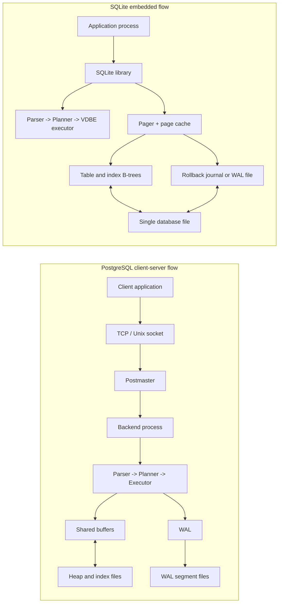

# PostgreSQL vs SQLite

**Name:** Lekhana Dinesh  
**Roll Number:** 24BCS10108

In this comparison, I look at PostgreSQL and SQLite from a system design point of view. Both support SQL, transactions, indexes, and crash recovery, but they are built for very different environments. PostgreSQL is a full client-server database for shared multi-user systems, while SQLite is an embedded library for local storage inside an application. Because their architecture is different from the beginning, their behavior under concurrency, deployment, durability, and operations is also different.

## Problem Background

PostgreSQL exists to serve as a general-purpose relational database for applications that need shared access, rich SQL features, strong concurrency control, extensibility, and centralized administration. It is meant for situations where many clients connect to the same database service and where the database is treated as an important system component of the application stack.

SQLite exists to solve a different problem. It is designed as an in-process, serverless, zero-configuration SQL database engine that stores data directly in ordinary files. It is ideal when an application needs reliable local persistence without running a separate database server. SQLite is often described as competing with file formats and direct file I/O more than with enterprise database servers.

So the main comparison is not "which one is better?" The better question is "what problem is each one trying to solve?" PostgreSQL optimizes for shared multi-user data management. SQLite optimizes for simplicity, portability, and embedding. Once this difference is clear, most of their internal choices start making sense.

## Architecture Overview

The biggest architectural difference is that PostgreSQL is a networked database server while SQLite is a library linked into the application process.



In PostgreSQL, the database is a long-running server process with its own memory, background workers, and storage lifecycle. Clients connect to it over a protocol. In SQLite, there is no separate server. The application calls SQLite functions directly, and SQLite reads and writes the database file itself.

This one design difference changes many practical outcomes:

1. PostgreSQL supports many concurrent users more naturally.
2. SQLite is easier to ship, copy, and embed.
3. PostgreSQL has more operational components such as background processes and server configuration.
4. SQLite has much lower deployment overhead because the database is just a library plus files.

## Internal Design

### 1. Why PostgreSQL exists and why SQLite exists

PostgreSQL grew as a feature-rich open source relational system with strong focus on correctness, extensibility, and shared database workloads. It supports advanced SQL, multiple index types, MVCC, WAL-based recovery, and sophisticated planning. This makes it a good fit when the database is a central service for an application or organization.

SQLite was designed to make local persistent storage simple and dependable. It keeps the SQL interface, B-tree storage, transactions, and crash recovery, but removes the separate server layer. That makes it much easier to embed into mobile apps, desktop tools, edge devices, and small services.

### 2. Client-server vs embedded architecture

PostgreSQL uses a process-per-user client/server model. A supervisor process called the postmaster accepts connections and starts backend processes. The backend parses the query, plans it, executes it, accesses shared memory, and returns results to the client.

SQLite runs inside the same process as the application. The application and the database engine share the same address space. There is no network hop, no connection pool requirement, and no separate database daemon.

The PostgreSQL model gives stronger central control and better multi-user coordination. The SQLite model gives simpler deployment and lower overhead for local access.

### 3. Process model and deployment model

PostgreSQL usually runs as a dedicated service. Data files live in a cluster directory, WAL files are managed by the server, and administrators can tune parameters such as `shared_buffers`, autovacuum settings, checkpoints, and background writer behavior.

SQLite usually ships as part of the application. The database is commonly a single file, though journaling and WAL mode can create companion files. Deployment is often just "copy the binary and open the file."

This is why PostgreSQL feels like infrastructure, while SQLite feels like a component.

### 4. Database file organization, pages, and table storage

PostgreSQL stores tables and indexes in separate files made of fixed-size pages, usually 8 KB. Table rows live in heap pages. Indexes are separate structures that point to heap tuples. This separation is flexible, but an index lookup may still need to visit the heap to fetch the full row unless an index-only scan is possible.

SQLite stores data using B-trees inside the database file itself. Rowid tables are organized around the rowid key, and each index also has its own B-tree. The database header records metadata such as page size. SQLite page sizes can vary, and the entire file format is designed to be portable across platforms.

A useful mental model is:

- PostgreSQL: heap table plus separate indexes
- SQLite: database file full of B-tree pages coordinated by the pager

### 5. B-tree indexes and lookup behavior

Both systems use B-tree indexes for common equality, range, and ordering operations. But the storage context is different.

In PostgreSQL, a B-tree index entry points to tuple locations in the heap. The index helps narrow down which heap tuples to visit. Because data and indexes are separate, index access often means "find candidate tuple locations first, then visit heap pages."

In SQLite, rowid tables are themselves organized in rowid order, so rowid lookup is naturally efficient. Secondary indexes are separate B-trees whose entries lead back to table rows. SQLite also supports covering index behavior in many common cases.

### 6. Query execution model

PostgreSQL parses the query, rewrites it if needed, generates candidate paths, estimates their cost using planner statistics, picks a plan, and executes that plan in the backend process. Its planner is sophisticated because it must make good choices for joins, scans, ordering, aggregates, and large shared workloads.

SQLite also has a query planner, but the engine is much more compact. It compiles SQL into bytecode for its virtual database engine (VDBE). The planner still matters, especially for index usage, but the environment is simpler because the engine is embedded and often serves one application at a time.

### 7. Transaction management and concurrency control

PostgreSQL uses MVCC. Readers work from snapshots, writers create newer tuple versions, and old versions are cleaned later by VACUUM. This gives good read/write concurrency in multi-user systems because reads usually do not block writes and writes usually do not block reads.

SQLite guarantees serializable behavior by serializing writes. There can be many readers, but only one writer at a time. In rollback-journal mode, writes eventually require exclusive file access. In WAL mode, readers and a writer can overlap more smoothly because the writer appends to the WAL while readers keep seeing a stable snapshot.

This difference is one of the most important practical distinctions:

- PostgreSQL is built for many concurrent sessions updating shared data.
- SQLite is built for simpler coordination, especially when writes are not highly concurrent.

### 8. Durability: PostgreSQL WAL vs SQLite rollback journal / WAL mode

PostgreSQL uses write-ahead logging as its central durability mechanism. Before changed data pages are relied on, the corresponding WAL records must be flushed. This supports crash recovery, replication, and point-in-time recovery.

SQLite traditionally uses a rollback journal. It writes information needed to restore the old state if a transaction fails or the process crashes. In WAL mode, SQLite appends new changes to a WAL file and checkpoints them back into the main file later.

PostgreSQL WAL is designed as part of a continuously running server. SQLite journaling is designed around safe file-based transactions for an embedded engine. Both aim for atomicity and durability, but their surrounding architecture is very different.

### 9. Scalability and operational differences

PostgreSQL scales better for shared workloads because it was designed for a server environment with many sessions, background processes, richer tuning, and administrative control.

SQLite scales better in the direction of simplicity. It is excellent when each application instance mostly manages its own local data and when the cost of running a full server would be unnecessary overhead.

PostgreSQL also offers richer operational features such as centralized user management, replication, server-level monitoring, and more advanced extensibility. SQLite wins on packaging, portability, and low setup cost.

### 10. Best-fit use cases

PostgreSQL is usually a better fit for:

- backend web applications with many concurrent users
- systems needing complex queries and joins
- workloads needing strong central control and administration
- applications that benefit from extensions and advanced indexing

SQLite is usually a better fit for:

- mobile and desktop applications
- edge devices and embedded systems
- local application state and offline-first storage
- tools where "just use one file" is a major advantage

### Comparison Table

| Area | PostgreSQL | SQLite | Practical impact |
| --- | --- | --- | --- |
| Main goal | Shared relational database service | Embedded local SQL engine | They solve different core problems |
| Architecture | Client-server | Serverless, in-process library | PostgreSQL needs a service; SQLite does not |
| Process model | Postmaster plus backend processes | Runs inside the application process | PostgreSQL handles shared concurrency more naturally |
| Deployment | Database cluster with server setup | Library plus database file | SQLite is much easier to ship and copy |
| Storage layout | Heap tables plus separate index files | B-trees inside a portable database file | PostgreSQL is more modular; SQLite is more compact |
| Default page concept | Fixed-size pages, usually 8 KB | File pages with page size recorded in the file header | Both are page-based, but file organization differs |
| Query planning | Rich cost-based planner with statistics | Smaller planner tuned for embedded use | PostgreSQL handles more complex workloads better |
| Index lookups | B-tree index usually points to heap tuples | Rowid tables plus separate index B-trees | Both benefit from indexing, but lookup paths differ |
| Concurrency control | MVCC with many readers and writers | Serializable behavior with one writer at a time | PostgreSQL is stronger for write concurrency |
| Durability | WAL and crash recovery in a server setting | Rollback journal or WAL mode in a file setting | Both are durable, but PostgreSQL supports richer recovery workflows |
| Background maintenance | VACUUM, autovacuum, checkpoints | Much lighter maintenance model | PostgreSQL needs more tuning but handles bigger shared workloads |
| Operations | Users, roles, replication, tuning, monitoring | Minimal administration | SQLite reduces operational burden |

## Design Trade-Offs

The comparison becomes clearer when we look at the trade-offs directly.

| Design choice | Benefit | Cost | Best suited for |
| --- | --- | --- | --- |
| PostgreSQL client-server model | Strong multi-user coordination and centralized control | Requires service setup, monitoring, and tuning | Shared application backends |
| SQLite embedded model | Very simple deployment and low overhead | Less suitable for many concurrent writers | Mobile, desktop, edge, local tools |
| PostgreSQL MVCC | High read/write concurrency | Dead tuples must be cleaned later by VACUUM | Busy transactional systems |
| SQLite serialized writer model | Simpler correctness model | One writer at a time limits write concurrency | Mostly read-heavy or low-contention local data |
| PostgreSQL WAL | Strong durability, recovery, replication options | More storage and operational complexity | Serious server workloads |
| SQLite rollback journal | Simple and reliable transaction safety | Readers and writers can interfere more in rollback mode | Small local databases |
| SQLite WAL mode | Better reader/writer overlap than rollback mode | Extra WAL/checkpoint behavior to manage | Applications with many reads and occasional writes |
| PostgreSQL rich planner statistics | Better plan selection on large workloads | Requires `ANALYZE` and statistics maintenance | Complex relational queries |
| SQLite single-file design | Easy portability and backup by file copy | Limited central coordination and enterprise tooling | App-local persistence |
| PostgreSQL separate heap and index storage | Flexible storage and mature indexing model | Index lookups may still need heap access | General-purpose relational workloads |

PostgreSQL and SQLite are not opposite ends of the same product line. They are different architectural answers to different deployment realities. That is why both remain important.

## Experiments / Observations

These experiments are written to be run locally. I have marked this output as sample/expected because I did not run this experiment locally.

### Experiment 1: PostgreSQL `EXPLAIN` on an indexed lookup

**Purpose.**  
To observe how PostgreSQL uses a B-tree index for a selective lookup.

**SQL.**

```sql
CREATE TABLE students_pg (
    student_id INT PRIMARY KEY,
    dept TEXT NOT NULL,
    student_name TEXT NOT NULL,
    cgpa NUMERIC(3,2) NOT NULL,
    city TEXT NOT NULL
);

CREATE INDEX idx_students_pg_dept_name
    ON students_pg (dept, student_name);

INSERT INTO students_pg VALUES
    (101, 'CSE', 'Aarav', 8.70, 'Bengaluru'),
    (102, 'ECE', 'Diya', 8.10, 'Hyderabad'),
    (103, 'CSE', 'Meera', 9.00, 'Chennai'),
    (104, 'ME',  'Rohit', 7.90, 'Pune'),
    (105, 'CSE', 'Anika', 8.40, 'Mysuru');

EXPLAIN
SELECT *
FROM students_pg
WHERE dept = 'CSE' AND student_name = 'Aarav';
```

**Sample output.**

```text
Index Scan using idx_students_pg_dept_name on students_pg
  Index Cond: ((dept = 'CSE'::text) AND (student_name = 'Aarav'::text))
```

**Observation.**  
The expected plan is an index scan because the predicate matches the indexed columns. Since the query selects `*`, PostgreSQL still needs the table row itself after using the index. This shows the usual PostgreSQL pattern of "use index to find tuple locations, then fetch row data from heap storage."

**What it proves.**  
PostgreSQL indexes are powerful, but the table row remains a separate storage object. That is a major design difference from engines where table layout is clustered around a primary key.

### Experiment 2: SQLite `EXPLAIN QUERY PLAN` on an indexed lookup

**Purpose.**  
To observe SQLite's planner choosing a secondary index.

**SQL.**

```sql
CREATE TABLE students_sqlite (
    student_id INTEGER PRIMARY KEY,
    dept TEXT NOT NULL,
    student_name TEXT NOT NULL,
    cgpa REAL NOT NULL,
    city TEXT NOT NULL
);

CREATE INDEX idx_students_sqlite_dept_name
    ON students_sqlite (dept, student_name);

INSERT INTO students_sqlite VALUES
    (101, 'CSE', 'Aarav', 8.70, 'Bengaluru'),
    (102, 'ECE', 'Diya', 8.10, 'Hyderabad'),
    (103, 'CSE', 'Meera', 9.00, 'Chennai'),
    (104, 'ME',  'Rohit', 7.90, 'Pune'),
    (105, 'CSE', 'Anika', 8.40, 'Mysuru');

EXPLAIN QUERY PLAN
SELECT *
FROM students_sqlite
WHERE dept = 'CSE' AND student_name = 'Aarav';
```

**Sample output.**

```text
SEARCH students_sqlite USING INDEX idx_students_sqlite_dept_name (dept=? AND student_name=?)
```

**Observation.**  
The expected output shows that SQLite uses the composite index to avoid a full table scan. This is the practical evidence that even a compact embedded engine still depends heavily on good indexing for performance.

**What it proves.**  
SQLite may be lightweight, but it is still a real query engine with a planner and access-path choices.

### Experiment 3: Small transaction and concurrency observation

**Purpose.**  
To observe how PostgreSQL and SQLite differ when two sessions try to use the same data concurrently.

**PostgreSQL sketch.**

Session 1:

```sql
BEGIN;
UPDATE students_pg
SET cgpa = 9.10
WHERE student_id = 103;
-- do not commit yet
```

Session 2:

```sql
SELECT cgpa FROM students_pg WHERE student_id = 103;
UPDATE students_pg
SET cgpa = 9.20
WHERE student_id = 103;
```

**Expected PostgreSQL behavior.**  
The `SELECT` in Session 2 can still read a committed snapshot. The second `UPDATE` waits for Session 1 because both want to modify the same row version.

**SQLite sketch.**

Connection 1:

```sql
BEGIN IMMEDIATE;
UPDATE students_sqlite
SET cgpa = 9.10
WHERE student_id = 103;
-- do not commit yet
```

Connection 2:

```sql
BEGIN IMMEDIATE;
UPDATE students_sqlite
SET cgpa = 9.20
WHERE student_id = 103;
```

**Expected SQLite behavior.**  
The second write attempt waits or returns `SQLITE_BUSY`, because SQLite allows only one writer at a time. In WAL mode, readers can continue more smoothly, but write serialization still remains.

**What it proves.**  
This small experiment captures the architecture difference directly: PostgreSQL is built for richer concurrent multi-user write behavior, while SQLite keeps concurrency simpler and safer by serializing writes.

## Key Learnings

This comparison made one thing very clear to me: database behavior is strongly shaped by architecture long before individual query optimizations matter.

- PostgreSQL and SQLite both support SQL and transactions, but they are not trying to win the same problem.
- PostgreSQL behaves like shared infrastructure, while SQLite behaves like a reliable storage library.
- Concurrency control is one of the biggest practical differences between them.
- PostgreSQL's MVCC model makes sense for shared server workloads.
- SQLite's single-writer design makes sense for local embedded workloads.
- Durability mechanisms in both systems are strong, but they are built around different operational assumptions.
- Choosing the right database engine is often more about deployment shape than about SQL syntax.

My final takeaway is that architecture is not a small implementation detail. It strongly shapes what the database is comfortable doing every day.

## References

1. [PostgreSQL: About](https://www.postgresql.org/about/)
2. [PostgreSQL Documentation - How Connections Are Established](https://www.postgresql.org/docs/current/connect-estab.html)
3. [PostgreSQL Documentation - The Path of a Query](https://www.postgresql.org/docs/current/query-path.html)
4. [PostgreSQL Documentation - Introduction to MVCC](https://www.postgresql.org/docs/current/mvcc-intro.html)
5. [PostgreSQL Documentation - Write-Ahead Logging (WAL)](https://www.postgresql.org/docs/current/wal-intro.html)
6. [PostgreSQL Documentation - Index Types](https://www.postgresql.org/docs/current/indexes-types.html)
7. [About SQLite](https://www.sqlite.org/about.html)
8. [Appropriate Uses For SQLite](https://www.sqlite.org/whentouse.html)
9. [SQLite Query Planning](https://www.sqlite.org/queryplanner.html)
10. [Isolation In SQLite](https://www.sqlite.org/isolation.html)
11. [Write-Ahead Logging in SQLite](https://www.sqlite.org/wal.html)
12. [SQLite Database File Format](https://www.sqlite.org/fileformat2.html)
13. [SQLite EXPLAIN](https://www.sqlite.org/lang_explain.html)
