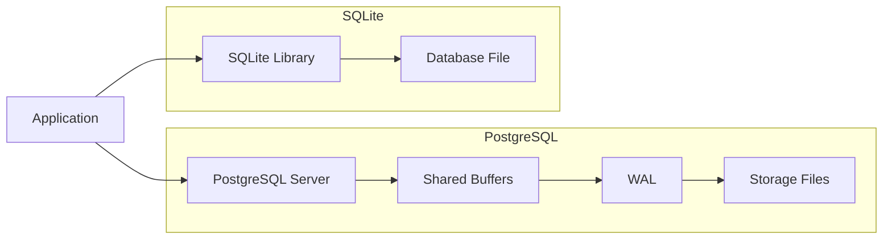

# PostgreSQL vs SQLite Architecture Comparison

## Problem Background
Before studying these databases, I assumed that most relational databases were designed in a similar way. While reading about PostgreSQL and SQLite, I realized that both solve the same problem—storing and querying relational data—but their architecture is completely different because they target different use cases.

PostgreSQL is designed for applications where many users access the database simultaneously. It focuses on reliability, scalability, and advanced database features. On the other hand, SQLite is designed to be lightweight and simple. Instead of running as a separate database server, it is embedded directly into the application, making deployment extremely easy.

This comparison helped me understand that database architecture is not about finding one "best" design. Instead, every design decision involves trade-offs between simplicity, performance, concurrency, and scalability.

## Architecture Overview
## Architecture Overview

The biggest architectural difference between PostgreSQL and SQLite is how they interact with applications.

PostgreSQL follows a client-server architecture. Applications communicate with a dedicated database server over network sockets or local IPC. The server is responsible for handling queries, managing transactions, maintaining caches, enforcing concurrency control, and ensuring durability.

SQLite follows an embedded architecture. Instead of communicating with a separate server, the application links directly with the SQLite library. SQL queries are executed inside the application's own process, and data is stored in a single database file.

Although PostgreSQL has more overhead because every request passes through a database server, it scales much better when multiple users access the system simultaneously. SQLite removes this communication overhead entirely, making it extremely efficient for single-user or low-concurrency applications.

## Internal Design

The internal design of both systems reflects their core philosophy: PostgreSQL focuses on robustness and concurrency, while SQLite focuses on simplicity and minimal overhead.

### PostgreSQL Architecture

PostgreSQL internally works as a multi-process system. Each client connection is typically handled by a separate backend process. These processes communicate with shared memory structures, especially the shared buffer pool, which acts as a cache between disk and memory.

A key component is the buffer manager, which decides which pages are kept in memory and which are written back to disk. PostgreSQL also uses a Write-Ahead Logging (WAL) system to ensure that changes are safely recorded before being committed to disk.

### SQLite Architecture

SQLite, in contrast, does not use separate server processes or shared memory. It runs entirely inside the application process. The database is stored as a single file, and the SQLite library directly reads and writes pages from this file.

Because there is no separate buffer manager process, SQLite relies on the operating system’s file system caching. This makes it extremely lightweight but also limits its concurrency capabilities.

## Storage Engine Comparison
PostgreSQL and SQLite both store data in pages, but the way they manage storage is different.

PostgreSQL uses a heap-based storage model. Tables are stored as collections of pages, and rows are not stored in any strict order. Updates often create new row versions instead of modifying existing ones, which is part of its MVCC design.

SQLite stores everything in a single file using B-tree structures. Tables and indexes are organized inside this file, and each page in the file can be accessed directly. This design makes the database portable and easy to move between systems.

While PostgreSQL is more flexible and scalable, SQLite's single-file design makes backup and deployment extremely simple.

## Transaction Management

PostgreSQL and SQLite both support ACID transactions, but their internal implementation differs.

PostgreSQL uses Multi-Version Concurrency Control (MVCC). Every update creates a new version of a row, and older versions remain visible to ongoing transactions depending on snapshot rules. This ensures high concurrency without locking readers.

SQLite supports transactions using rollback journals or Write-Ahead Logging (WAL) mode. In WAL mode, changes are first written to a separate log file before being merged into the main database file.

PostgreSQL's approach is more complex but scales better in multi-user environments. SQLite's approach is simpler but can become limiting under heavy concurrent writes.

## Concurrency Control

Concurrency is one of the biggest differences between PostgreSQL and SQLite.

PostgreSQL allows multiple readers and writers simultaneously using MVCC. Readers never block writers, and writers generally do not block readers. This makes PostgreSQL suitable for high-traffic systems.

SQLite, however, uses database-level locking. While multiple readers are allowed, writes lock the entire database file. This means only one write operation can happen at a time, which limits scalability but keeps the system simple and reliable.

This trade-off shows that PostgreSQL prioritizes performance under concurrency, while SQLite prioritizes simplicity and correctness.

## Durability

PostgreSQL ensures durability using Write-Ahead Logging (WAL). Every change is first written to the WAL log before being applied to the actual data files. In case of a crash, PostgreSQL can replay the WAL to recover the database state.

SQLite also supports durability using rollback journals or WAL mode. In rollback journal mode, the original state is saved before changes are applied. In WAL mode, changes are appended to a log file similar to PostgreSQL.

Both systems guarantee durability, but PostgreSQL is optimized for high-performance recovery in large systems, while SQLite focuses on simplicity and reliability for embedded use cases.

## Design Trade-offs

PostgreSQL’s design is built for scalability and multi-user access, but this comes with complexity in its architecture. It requires a separate server process, shared memory management, and more system resources.

SQLite sacrifices concurrency and scalability in favor of simplicity. It has zero configuration, no server process, and minimal setup overhead.

In short:
- PostgreSQL = complex but scalable
- SQLite = simple but limited under concurrency
## Real World Use Cases

PostgreSQL is commonly used in systems where multiple users interact with the database at the same time, such as banking systems, SaaS platforms, and large-scale web applications.

SQLite is widely used in mobile applications, embedded systems, browsers, and small desktop applications where simplicity and local storage are more important than concurrency.

## Experiments / Observations

While experimenting with PostgreSQL, I observed that query performance changes significantly after adding indexes. Sequential scans are used when no index is present, but indexed queries switch to index scans, reducing execution time.

In SQLite, I noticed that the performance is very stable for small datasets, but it does not scale well when multiple write operations are performed simultaneously.

These observations helped reinforce the idea that PostgreSQL is optimized for performance at scale, while SQLite is optimized for simplicity and predictable behavior.

## Key Learnings
## Key Learnings

This comparison helped me understand that database design is heavily influenced by use case requirements. There is no universally better database; instead, each system is optimized for a specific environment.

PostgreSQL taught me how complex systems handle concurrency and scalability, while SQLite showed how simplicity can be powerful in constrained environments.

## References

While preparing this comparison, I referred to the following resources to understand the internal architecture and design decisions:

- PostgreSQL Official Documentation: https://www.postgresql.org/docs/
- SQLite Architecture Overview: https://www.sqlite.org/arch.html
- Write-Ahead Logging (WAL) in PostgreSQL: https://www.postgresql.org/docs/current/wal.html
- General DBMS concepts from Advanced Database Systems course material
- Lecture notes and discussions from Advanced DBMS course