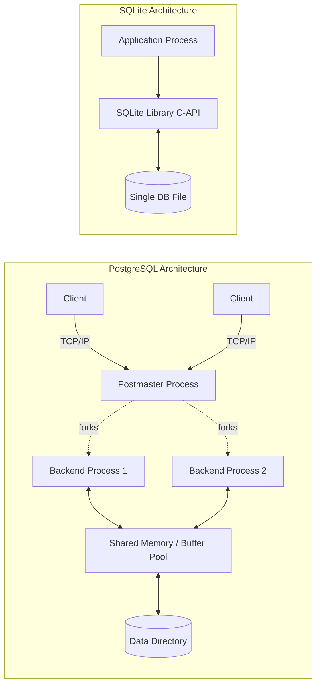

# PostgreSQL vs SQLite Architecture Comparison

## 1. Problem Background

### Historical Context & Motivation
Database systems are not one-size-fits-all. **PostgreSQL** was born out of the POSTGRES project at UC Berkeley to serve as a highly extensible, standards-compliant, enterprise-grade relational database. It was designed to solve the problem of managing massive, complex datasets for thousands of concurrent users across a network. 

Conversely, **SQLite** was created by D. Richard Hipp to address the need for a self-contained, serverless, zero-configuration SQL database engine. It was designed to solve the problem of storing structured data locally within applications (like mobile apps, web browsers, or IoT devices) without the administrative overhead of setting up a separate database server.

## 2. Architecture Overview

### PostgreSQL: Client-Server Process Model
PostgreSQL relies on a heavy **client-server architecture**. 
1. The **Postmaster (Main Process)** listens for incoming network connections.
2. For every client connection, the Postmaster forks a dedicated **Backend Process**.
3. These processes communicate through heavy **Shared Memory** (for the Buffer Pool, Locks, and WAL buffers).

### SQLite: Embedded Database Design
SQLite is an **embedded database** implemented as a C-language library.
1. There is **no separate database process**. The database engine runs directly within the application's process space.
2. Network latency is completely eliminated since SQL statements are executed as direct function calls.
3. The entire database (tables, indexes, schema) is typically stored in a **single cross-platform file** on disk.

## 3. Internal Design

### Database File Organization & Storage Engine
*   **PostgreSQL:** Uses a **Directory of Files** (`PGDATA`). Each database is a subdirectory, and each table/index is an individual file (or multiple 1GB segment files). It uses a sophisticated Buffer Manager to cache pages in shared memory. Pages are typically 8KB.
*   **SQLite:** Uses a **Single File** layout. The file is divided into uniform pages (default 4KB). The first 100 bytes of page 1 contain the database header. It relies heavily on the operating system's filesystem cache (Page Cache) rather than managing a complex internal buffer pool.

### Transaction Management & Concurrency Control
*   **PostgreSQL (MVCC):** Implements **Multi-Version Concurrency Control (MVCC)**. When a row is updated, a new version of the row is appended, and the old version is marked obsolete (to be cleaned up by VACUUM). Readers do not block writers, and writers do not block readers, enabling high concurrency.
*   **SQLite (Database-Level Locking & WAL):** By default, SQLite locks the *entire database file* during a write, allowing only one writer at a time. However, in **WAL (Write-Ahead Logging) mode**, it supports concurrent readers and a single writer. Still, it does not support multiple concurrent writers.

### Index Implementation
Both systems use **B-Trees**. PostgreSQL uses highly optimized B-Trees with advanced locking (Lehman-Yao algorithm) for concurrent access. SQLite uses B-Trees for indexes and B+Trees for tables (storing data in leaf nodes).

## 4. Design Trade-Offs

### PostgreSQL Trade-Offs
*   **Advantages:** Extremely high concurrency, scalable to terabytes of data, advanced data types (JSONB, PostGIS), robust replication.
*   **Limitations:** High administrative overhead. Requires continuous tuning (Autovacuum, memory settings). A dedicated process per connection can exhaust RAM quickly (often requiring connection poolers like PgBouncer).

### SQLite Trade-Offs
*   **Advantages:** Zero configuration. The single-file format is easily transportable. Microsecond latency for queries (no network).
*   **Limitations:** Poor concurrency (single writer). Limited ALTER TABLE capabilities. No built-in user management or network access.

### Real-World Use Cases
*   **PostgreSQL:** Preferred for web backends, financial systems, data warehouses, and any multi-user environment requiring strict ACID compliance under heavy concurrent load.
*   **SQLite:** Preferred for mobile applications (iOS/Android local storage), desktop software configurations, IoT edge devices, and testing environments.

## 5. Experiments / Observations

A simple benchmarking script testing concurrent `INSERT` operations reveals the architectural differences vividly:
*   **Workload:** 10 concurrent threads inserting 10,000 rows each.
*   **PostgreSQL Observation:** Handled effortlessly. The OS spawns 10 backend processes, and MVCC allows all 10 threads to insert concurrently with very high throughput.
*   **SQLite Observation (Default Journal Mode):** Severe contention. 9 threads will frequently encounter `SQLITE_BUSY` (database is locked) errors while one thread writes. 
*   **SQLite Observation (WAL Mode):** Contention is reduced for readers, but the 10 writing threads still serialize internally since only one connection can append to the WAL at a time.

## 6. Key Learnings

1.  **Architecture Dictates Scalability:** PostgreSQL's complex multi-process MVCC architecture is the exact reason it can scale, but it introduces overhead that makes it unsuitable for a smartphone app. 
2.  **The OS is Your Friend:** SQLite's decision to rely on the OS Page Cache rather than building a custom Buffer Manager keeps its codebase incredibly small (around 150K lines of code) and fast.
3.  **Concurrency is Expensive:** Building a system that allows multiple users to write simultaneously requires massive engineering effort (Locks, Shared Memory, VACUUM). If your application doesn't strictly need concurrent writers, SQLite is an unbeatable choice.
