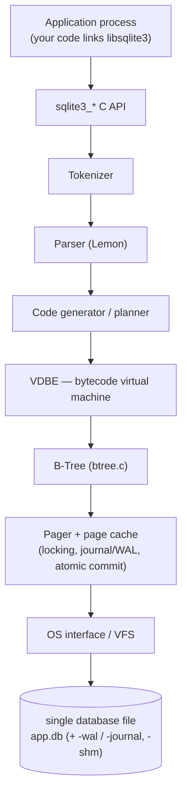
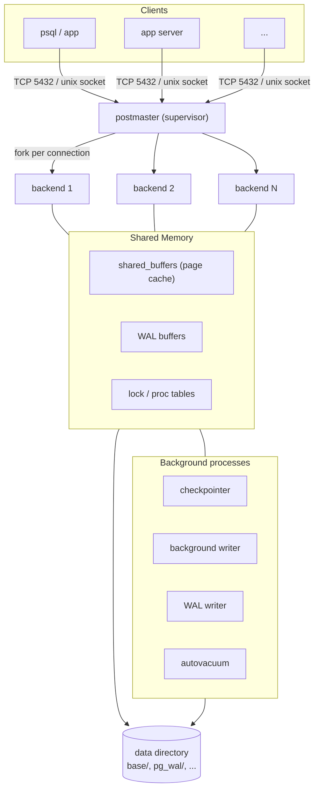

# PostgreSQL vs SQLite — An Architecture Comparison

> Two excellent SQL databases that sit at opposite ends of the design space. SQLite is an **embedded, in-process library** optimized for zero-configuration local storage; PostgreSQL is a **client–server RDBMS** optimized for concurrent, multi-user, large-scale workloads. Almost every difference below follows from that one architectural decision.

**TL;DR**

| Dimension | SQLite | PostgreSQL |
|---|---|---|
| Deployment model | Embedded library, in-process | Client–server, separate daemon |
| Process model | No server; runs inside the app's process | `postmaster` supervisor + one backend **process** per connection |
| Database = | A single file (`*.db`) on disk | A *cluster*: a directory tree managed by a running server |
| Concurrency (writes) | **One writer** at a time (whole-file lock) | Many concurrent writers via **MVCC** |
| Storage layout | One B-tree per table/index, all in one file; tables clustered by `rowid` | Unordered **heap** files + separate B-tree indexes |
| Recovery | Rollback journal or WAL | WAL + checkpoints (+ PITR, replication) |
| Typing | Dynamic (type *affinity*) | Static, strict, rich/extensible type system |
| Sweet spot | Mobile, IoT, edge, app file format, small sites | Multi-user OLTP/analytics, large datasets, high concurrency |

---

## 1. Problem Background

**Different problems, different databases.** Neither system is "better"; they were designed to solve different things.

**SQLite (2000, D. Richard Hipp).** SQLite was created to give an application a full SQL database *without* a server to install, configure, or administer — originally for a system that had to run unattended (on a battleship, where calling a DBA at sea was not an option). The design goal is **zero-configuration, serverless, self-contained, transactional SQL** embedded directly into the program. There is no separate process to start, no network port, no user accounts. The "database" is just an ordinary file that any process with filesystem permission can open. This makes SQLite the most widely deployed database engine in the world — it ships inside every Android and iOS device, every major browser, and countless desktop apps.

**PostgreSQL (1986 → present).** PostgreSQL descends from the POSTGRES project led by Michael Stonebraker at UC Berkeley, whose goal was an *extensible*, object-relational system that could support complex types, rules, and many concurrent users with strong correctness guarantees. The SQL frontend (Postgres95) and open-source community turned it into a production RDBMS. The design goal is a **robust, standards-compliant, highly concurrent, extensible** database that many clients connect to over a network and that protects data integrity under heavy multi-user load.

> The headline contrast: SQLite asks *"how do I give one program reliable local SQL with no moving parts?"* PostgreSQL asks *"how do I let hundreds of clients safely read and write shared data at once, durably, forever?"*

---

## 2. Architecture Overview

### 2.1 SQLite — an embedded library

SQLite is a C library that is *compiled or linked into the application*. SQL flows through a compiler front-end into bytecode, which a virtual machine executes against a B-tree/pager storage layer that talks to the OS through a portable VFS shim. ([SQLite architecture](https://www.sqlite.org/arch.html))



Key point: **there is no server**. There is no inter-process communication, no connection handshake, no scheduler. A query is just a function call inside the application; reading a row is, ultimately, a `read()` on a file the process already has open.

### 2.2 PostgreSQL — a client–server cluster

PostgreSQL runs as a set of cooperating OS processes that share a region of memory. A supervisor (`postmaster`) listens on a socket/port; for each client connection it **forks a dedicated backend process**. Backends, plus background helper processes, coordinate through **shared memory** (notably the shared buffer pool and WAL buffers) and persist to a data directory. ([PostgreSQL architecture overview](https://www.postgresql.org/docs/current/tutorial-arch.html))



Key point: **the server is the gatekeeper of all shared state**. No client touches the files directly; everything goes through backends that coordinate via shared memory and locks. That indirection is exactly what enables many writers, network access, and authentication — and exactly what SQLite deliberately omits.

### 2.3 Data flow contrast

- **SQLite:** `function call → bytecode → page cache → file read/write` — all within one process address space.
- **PostgreSQL:** `network message → backend parses/plans/executes → reads pages from shared_buffers (or disk) → writes go to WAL first, then to shared buffers, flushed later by checkpointer`.

---

## 3. Internal Design

### 3.1 Database file organization

**SQLite: one file is the whole database.** Every table and every index is stored as its own B-tree, and *all* of those B-trees live inside a single file. The file is a sequence of fixed-size **pages** (default **4096 bytes**, configurable 512–65536). Page 1 holds the file header and the `sqlite_master`/`sqlite_schema` table that catalogs every other object. In WAL mode two sidecar files appear: `-wal` (the log) and `-shm` (the shared-memory index). ([file format](https://www.sqlite.org/fileformat2.html))

**PostgreSQL: a cluster is a directory tree.** A running server manages a *data directory* (`PGDATA`). Each table or index is stored under `base/<database-oid>/<relfilenode>`, split into **1 GB segment files**. Pages are **8 KB**. Alongside the heap live `pg_wal/` (the write-ahead log), `pg_xact/` (commit status), the visibility map, the free space map, and TOAST tables for oversized values. A single logical table can therefore be many files; the database is the *server's* private property, not a portable artifact.

### 3.2 Table storage and page layout

**PostgreSQL heap page (8 KB).** A heap page is unordered. Its layout grows from both ends toward the middle ([page layout](https://www.postgresql.org/docs/current/storage-page-layout.html)):

```
 0  +-----------------------------------+
    | PageHeaderData (24 B): pd_lsn,     |
    | pd_lower, pd_upper, pd_special...  |
    +-----------------------------------+
    | ItemId line pointers  →→→ (grow    |   <- pd_lower
    | forward; each 4 B = (offset,len))  |
    +-----------------------------------+
    |            free space             |
    +-----------------------------------+   <- pd_upper
    | ←←← tuples (grow backward;          |
    |     each prefixed by tuple header) |
8KB +-----------------------------------+   <- pd_special (special space, used by indexes)
```

A row is addressed by its **TID / `ctid` = (page number, line-pointer index)**. The line pointer is a stable indirection: the tuple body can move during in-page compaction, but the line-pointer index does not change, so indexes and version chains keep working.

**SQLite table storage.** An ordinary SQLite table is a **B-tree keyed by `rowid`** (a 64-bit integer). Because the table *is* the B-tree, rows are physically **clustered by `rowid`** — there is no separate "heap." Row data lives in the B-tree leaf cells. A `WITHOUT ROWID` table instead clusters by the declared primary key. This is the opposite of PostgreSQL, whose heap is deliberately *not* clustered by any key.

### 3.3 Index implementation

Both use **B-trees** (B+-tree style: data/keys in leaves, internal nodes route).

- **SQLite:** an index is a separate B-tree whose keys are the indexed columns followed by the `rowid`; a lookup walks the index B-tree to get a `rowid`, then walks the table B-tree to fetch the row (unless the index is *covering*). Because the table itself is a B-tree, a primary-key lookup on a rowid table is a single B-tree descent.
- **PostgreSQL:** the heap is **separate** from every index. A B-tree index leaf stores the key plus the **TID** of the heap tuple; the executor then visits the heap to check visibility and fetch the row. PostgreSQL has **no clustered index** — even the primary key is a secondary index pointing into the heap. (It offers extra index types: GiST, GIN, BRIN, Hash, SP-GiST — an extensibility SQLite does not match.)

> Consequence: in SQLite the primary-key order *is* the physical order (free range scans on PK); in PostgreSQL physical order is insertion/update order, so even PK range scans hit a separate index then jump into the heap. PostgreSQL trades locality for flexibility (cheap secondary indexes, no "everything reorganizes when the PK changes").

### 3.4 Memory management

- **SQLite:** each database connection has its own **page cache** in the application's heap (`PRAGMA cache_size`). There is no shared pool across processes; coordination is via the file and (in WAL mode) the `-shm` wal-index. Memory is small and local by design.
- **PostgreSQL:** a single **shared buffer pool** (`shared_buffers`, default 128 MB) lives in shared memory and is used by *all* backends, with a clock-sweep replacement policy. Per-backend memory (`work_mem`, `maintenance_work_mem`) handles sorts/hashes. PostgreSQL relies on the OS page cache as a second tier, so effective cache is often much larger than `shared_buffers`.

### 3.5 Transaction processing & concurrency control — the central difference

**SQLite: coarse, file-level locking; one writer.**
SQLite serializes writers using locks on the database file. In the classic rollback-journal mode a writer escalates through `SHARED → RESERVED → PENDING → EXCLUSIVE`; while it holds the exclusive lock no one else may write, and during the final commit no one may read. **WAL mode** improves this markedly: writers append to the `-wal` file while readers continue reading a consistent snapshot from the main file + WAL, so *"writers and readers can run at the same time."* But the rule that matters never changes:

> *"Since there is only one WAL file, there can only be one writer at a time."* — [SQLite WAL docs](https://www.sqlite.org/wal.html)

So SQLite gives **unlimited concurrent readers but exactly one writer**, and a second writer gets `SQLITE_BUSY` ("database is locked") unless it waits its turn.

**PostgreSQL: MVCC; many concurrent writers.**
PostgreSQL implements **Multi-Version Concurrency Control**. Every row version (tuple) carries `t_xmin` (the inserting transaction id) and `t_xmax` (the deleting/updating transaction id). ([MVCC docs](https://www.postgresql.org/docs/current/mvcc.html))

- An **UPDATE does not overwrite**: it marks the old version's `t_xmax` and inserts a *new* tuple version (append-style). The old version remains for transactions whose snapshot should still see it.
- A transaction takes a **snapshot**; visibility rules using `t_xmin`/`t_xmax` plus commit status decide which version each transaction sees.
- Therefore **readers never block writers and writers never block readers** — they see different versions. Writers only conflict with other writers of the *same row*.
- Isolation levels: **Read Committed** (default), **Repeatable Read** (a stable snapshot), and **Serializable** (Serializable Snapshot Isolation, SSI).

The cost of "never overwrite" is **dead tuples**: superseded versions accumulate and must be reclaimed by **VACUUM** (autovacuum runs it automatically), which also prevents transaction-id wraparound. SQLite has no such garbage because it updates in place under an exclusive lock.

### 3.6 Recovery / durability

| | SQLite | PostgreSQL |
|---|---|---|
| Mechanism | Rollback journal *or* WAL | Write-Ahead Log (always) |
| Commit point | Journal deleted / WAL commit record `fsync`'d | WAL record `fsync`'d to `pg_wal/` |
| Crash recovery | Replay/rollback the journal, or replay `-wal` | Redo WAL from the last **checkpoint** |
| Extra payoffs | — | Point-in-time recovery, streaming/logical **replication**, archiving |

Both follow **write-ahead logging discipline**: the log record describing a change is durable *before* the change is considered committed, so a crash can always be recovered to a consistent state. PostgreSQL's WAL additionally powers replication and PITR — features that only make sense for a long-lived server.

---

## 4. Design Trade-Offs

### 4.1 Why SQLite is embedded (and why that's the right call for its niche)

- **Zero administration / zero configuration:** no daemon, no port, no users to manage. This is *the* feature for devices "that must operate without expert human support" — phones, set-top boxes, cars, medical devices. ([when to use](https://www.sqlite.org/whentouse.html))
- **No IPC/network overhead:** a query is a function call; data access is a local file read. For single-user/local workloads this is faster and simpler than marshalling requests to a server.
- **Self-contained & portable:** the whole database is one file you can copy, email, or use as an application file format (the "File/Save" of CAD tools, browsers, etc.).
- **Cost:** only one writer; no built-in network access, users, or fine-grained concurrency. These are *acceptable* because its target workloads are local and rarely write-contended.

### 4.2 Why PostgreSQL is client–server (and why that's the right call for *its* niche)

- **Many concurrent writers** need a central arbiter holding shared state and running MVCC — impossible to do safely if every client just `mmap`'d the same file.
- **Network access & security:** multiple machines/clients connect over the network with authentication and per-object privileges — only meaningful with a server.
- **Rich correctness & features:** strict types, constraints, stored procedures, extensions, replication, parallel query, sophisticated planner — a long-running server can afford the machinery.
- **Cost:** you must install, configure, tune (`shared_buffers`, autovacuum), and operate a daemon; a connection is a whole OS process, so high connection counts often need a pooler (PgBouncer). Overkill for embedding in a phone app.

### 4.3 Performance implications

- **Single-user local reads/writes:** SQLite is often *faster* — no IPC, no per-connection process, minimal overhead.
- **High write concurrency:** PostgreSQL wins decisively — MVCC lets thousands of transactions proceed where SQLite would serialize them to one writer with `SQLITE_BUSY` backoff.
- **Large datasets / complex joins:** PostgreSQL's cost-based planner, parallel execution, and varied index types scale far past SQLite's simpler planner.
- **Write amplification of MVCC:** PostgreSQL pays with dead-tuple bloat + VACUUM and "every index must be updated on UPDATE"; SQLite's in-place updates avoid this but only because it forbids concurrent writers.

### 4.4 Answering the guiding questions

**Why does SQLite work well for mobile applications?** A phone app is a *single process* with *local* data and essentially *one writer* (the app itself). SQLite's embedded model fits perfectly: no server to bundle or keep alive, no configuration, the database is one file in the app sandbox, crash-safe via WAL, and access is a fast in-process call. The OS vendors literally ship it in the platform.

**Why is PostgreSQL preferred for large multi-user systems?** Such systems have many clients writing shared data simultaneously, over the network, needing strong isolation, security, and durability at scale. That *requires* a central server doing MVCC, authentication, and WAL-based durability/replication — exactly PostgreSQL's architecture.

**What architectural decisions lead to these differences?** The single root decision — **embedded library vs. client–server** — cascades: in-process vs. networked; one file vs. a server-owned cluster; whole-file locking/one-writer vs. MVCC/many-writers; small per-connection page cache vs. shared buffer pool; clustered `rowid` B-tree tables vs. separate heap + indexes; dynamic typing for convenience vs. strict typing for multi-user correctness.

---

## 5. Experiments / Observations

> The recipes below are **reproducible**: each lists the exact commands and the **expected/documented behavior**. Output shown is *representative* (illustrative of what the command produces), grounded in the cited documentation rather than a particular benchmark run.

### 5.1 Process model — server vs. no server

```bash
# PostgreSQL: a live cluster shows a supervisor + helper processes
$ ps -ef | grep postgres
postgres  ...  postgres                      # postmaster (supervisor)
postgres  ...  postgres: checkpointer
postgres  ...  postgres: background writer
postgres  ...  postgres: walwriter
postgres  ...  postgres: autovacuum launcher
postgres  ...  postgres: <user> <db> [local] idle   # one BACKEND per connection

# SQLite: nothing is running. It only exists while your program calls it.
$ ps -ef | grep sqlite      # (no server process)
```

**Observation:** every PostgreSQL connection is a separate OS process you can see; SQLite has *no* process of its own — it lives inside whatever program opened the file. This is the client–server vs. embedded split made visible.

### 5.2 Concurrency — one writer vs. many writers

```sql
-- SQLite: open the same db from two shells, begin a write txn in each
-- shell A:
sqlite> BEGIN IMMEDIATE; UPDATE t SET v=v+1 WHERE id=1;
-- shell B (while A is open):
sqlite> BEGIN IMMEDIATE; UPDATE t SET v=v+1 WHERE id=2;
Error: database is locked        -- SQLITE_BUSY: only ONE writer allowed
```

```sql
-- PostgreSQL: two psql sessions updating DIFFERENT rows both succeed concurrently
-- session 1:  BEGIN; UPDATE t SET v=v+1 WHERE id=1;   -- ok, holds row lock on id=1
-- session 2:  BEGIN; UPDATE t SET v=v+1 WHERE id=2;   -- ok, proceeds in parallel
-- (Only updates to the SAME row serialize, via row locks; readers never block.)
```

**Observation:** SQLite serializes *all* writers on the whole file; PostgreSQL serializes only writers of the *same row*, thanks to MVCC + row-level locking. ([SQLite WAL: one writer](https://www.sqlite.org/wal.html), [PostgreSQL MVCC](https://www.postgresql.org/docs/current/mvcc.html))

### 5.3 Storage layout — page sizes and clustering

```sql
-- SQLite default page size = 4096 bytes; the table IS a rowid B-tree
sqlite> PRAGMA page_size;            -- 4096
sqlite> PRAGMA journal_mode;         -- delete (rollback journal) | wal
```

```sql
-- PostgreSQL: 8 KB pages; heap is separate from indexes; find files on disk
postgres=# SHOW block_size;          -- 8192
postgres=# SELECT pg_relation_filepath('mytable');  -- base/<dboid>/<relfilenode>
```

**Observation:** SQLite stores one B-tree-per-object inside a single 4 KB-paged file and clusters table rows by `rowid`; PostgreSQL stores unordered heaps in 8 KB pages across many files in a server-owned directory, with indexes kept separate. ([file format](https://www.sqlite.org/fileformat2.html), [page layout](https://www.postgresql.org/docs/current/storage-page-layout.html))

### 5.4 MVCC made visible (PostgreSQL only)

```sql
-- PostgreSQL exposes the per-tuple version columns directly:
postgres=# CREATE TABLE demo(id int, v int); INSERT INTO demo VALUES (1,10);
postgres=# SELECT xmin, xmax, ctid, * FROM demo;
 xmin | xmax | ctid  | id | v
------+------+-------+----+----
  742 |    0 | (0,1) |  1 | 10     -- inserted by txn 742, not yet deleted (xmax=0), at page 0/line 1

postgres=# UPDATE demo SET v=20 WHERE id=1;
postgres=# SELECT xmin, xmax, ctid, * FROM demo;
 xmin | xmax | ctid  | id | v
------+------+-------+----+----
  743 |    0 | (0,2) |  1 | 20     -- a NEW version at (0,2); the old (0,1) is now dead, awaiting VACUUM
```

**Observation:** the UPDATE created a *new* tuple version rather than overwriting — the mechanism behind non-blocking concurrent reads, and the reason VACUUM exists. SQLite has no analogue: it overwrites in place under an exclusive lock. ([page layout / tuple header](https://www.postgresql.org/docs/current/storage-page-layout.html))

---

## 6. Key Learnings

1. **One decision explains almost everything.** "Embedded library" vs. "client–server" is the seed from which the process model, concurrency model, storage layout, and feature set all grow. When comparing databases, find that root decision first.
2. **Concurrency is the sharpest divide.** SQLite = unlimited readers + **one** writer (whole-file). PostgreSQL = **MVCC** with many concurrent writers (row-level conflicts only). This single property dictates which workloads each can serve.
3. **MVCC isn't free.** Non-blocking reads cost dead-tuple bloat and the need for VACUUM/autovacuum, plus updating every index on UPDATE. SQLite avoids all of that — but only by forbidding concurrent writers. *Every guarantee is paid for somewhere.*
4. **Storage clustering is a real trade.** SQLite tables are B-trees clustered by `rowid` (great PK locality, table reorganizes around the key); PostgreSQL keeps an unordered heap + separate indexes (cheap secondary indexes, no clustered locality). Same B-tree primitive, opposite table organization.
5. **"Simpler" is a feature, not a weakness.** SQLite deliberately omits a server, users, and the network. That omission is *exactly* what makes it the world's most deployed database. Don't pay for client–server machinery you won't use; don't try to scale an embedded file to a multi-writer fleet.
6. **Both honor write-ahead logging.** Despite opposite architectures, both make durability rest on logging the change before committing it — a near-universal database idea that recurs in PostgreSQL, InnoDB, and RocksDB alike.

---

## References

- SQLite — *Architecture of SQLite*: https://www.sqlite.org/arch.html
- SQLite — *Appropriate Uses For SQLite*: https://www.sqlite.org/whentouse.html
- SQLite — *Write-Ahead Logging*: https://www.sqlite.org/wal.html
- SQLite — *Database File Format*: https://www.sqlite.org/fileformat2.html
- SQLite — *File Locking And Concurrency*: https://www.sqlite.org/lockingv3.html
- PostgreSQL — *Architectural Fundamentals*: https://www.postgresql.org/docs/current/tutorial-arch.html
- PostgreSQL — *Database Page Layout*: https://www.postgresql.org/docs/current/storage-page-layout.html
- PostgreSQL — *Concurrency Control / MVCC*: https://www.postgresql.org/docs/current/mvcc.html
- PostgreSQL — *Write-Ahead Logging (WAL)*: https://www.postgresql.org/docs/current/wal-intro.html
- PostgreSQL — *Routine Vacuuming*: https://www.postgresql.org/docs/current/routine-vacuuming.html

*All analysis above is written in my own words from the cited primary documentation; quoted phrases are explicitly marked and attributed.*
