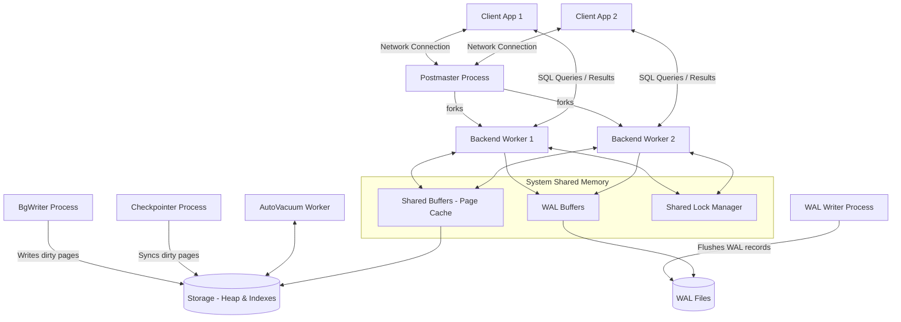
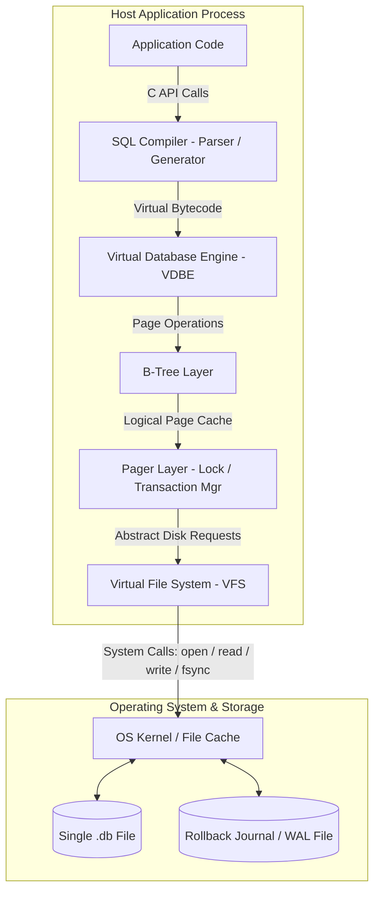
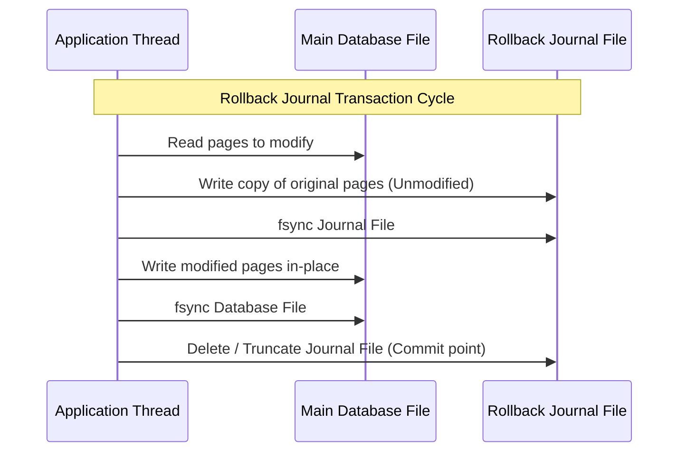

# PostgreSQL vs. SQLite: Architectural Comparison & Design Trade-offs

**Student Name:** Ayush Kumar Patra  
**Roll Number:** 24bcs10474  
**Course:** Advanced Database Management Systems (ADBMS)  
**Topic:** Topic 1 — PostgreSQL vs. SQLite Architecture Comparison  

---

## 1. Problem Background

To evaluate the design choices of PostgreSQL and SQLite, we must first understand the core problems they were engineered to solve and the historical contexts in which they arose. Databases are not designed in a vacuum; they are collections of architectural trade-offs tailored to specific environments.

```
+-----------------------------------------------------------------------------------+
|                              HISTORICAL DESIGN MOTIVATION                         |
+-----------------------------------------------------------------------------------+
|  POSTGRESQL (1986, Stonebraker)               SQLITE (2000, Hipp)                 |
|  - Goal: Extensibility, standards, reliability|  - Goal: Zero-admin, portability, reliability |
|  - Environment: Multi-user enterprise servers |  - Environment: Embedded device (US Destroyer)  |
|  - Paradigm: Client-Server, Process isolation|  - Paradigm: In-process Library, Single File |
+-----------------------------------------------------------------------------------+
```

### PostgreSQL: Enterprise-Scale Extensibility and Reliability
PostgreSQL (originally POSTGRES) was started in 1986 by Michael Stonebraker at UC Berkeley as a successor to the Ingres database. At the time, relational database management systems (RDBMS) were rigid. They supported only basic data types (integers, floats, strings) and offered limited ways to represent complex relationships. 

Stonebraker's primary goal was **extensibility**—allowing developers to define custom data types, custom operators, and complex rule systems directly inside the database engine. Additionally, enterprise workloads demanded high concurrency, absolute data integrity, and resilience to hardware failures. As a result, PostgreSQL was built from the ground up on a robust client-server process-isolated architecture with strict adherence to SQL standards.

### SQLite: Zero-Administration Serverless Local Storage
SQLite was designed in 2000 by D. Richard Hipp while working on a project for the US Navy onboard guided missile destroyers. The system Hipp was developing used an existing database server (Informix), but it suffered from frequent database connectivity failures, complex setup procedures, and administrative overhead. 

Hipp’s goal was to build a database engine that required **zero configuration (zero-conf)**, had **no administrative overhead (no DBA)**, and could run directly **embedded inside the application process** without requiring an independent server process. It was designed to replace raw file-based inputs/outputs (like CSV or custom binary files) with a standard-compliant SQL interface that guarantees ACID transactions, crash safety, and extreme portability across heterogeneous operating systems.

### Summary of Targeted Problem Spaces
- **PostgreSQL** solves the problem of **shared, multi-user transactional processing**. It acts as a central source of truth for hundreds or thousands of concurrent network clients.
- **SQLite** solves the problem of **local data management for a single application instance**. It replaces custom file-writing logic, local application caches, and embedded device state logs with an integrated SQL engine.

---

## 2. Architecture Overview

### PostgreSQL: Multi-Process Client-Server Architecture

PostgreSQL employs a multi-process architecture where process isolation ensures that a failure in one client connection does not crash the entire database instance.



#### Core Components and Interactions:
1. **Postmaster (Supervisor) Process:** The supervisor process. It listens on a network port (typically `5432`). When a client connects, the Postmaster authenticates it and forks a dedicated **Backend Worker Process**.
2. **Backend Worker Process (Process-per-Client):** Each connected client gets its own process. This process parses, plans, optimizes, and executes SQL queries. Because of process isolation, if a backend worker crashes (e.g., due to memory corruption in a complex query), it only terminates that connection, while the Postmaster restarts necessary subsystems without affecting other clients.
3. **Shared Buffers (Memory Cache):** A large shared memory block accessible by all backend processes. It caches table pages (8 KB by default) read from disk.
4. **Shared Lock Manager:** A shared-memory structure that tracks locks held by active transactions on database tables, pages, and individual rows, preventing conflicting operations.
5. **Background Processes:**
   - **WAL Writer (WalWriter):** Periodically and on commit, flushes the sequential Write-Ahead Log (WAL) buffers from memory to disk.
   - **Background Writer (BgWriter):** Spans the Shared Buffers, identifying modified ("dirty") pages and writing them to disk to ensure backend workers always have access to clean, reusable memory slots.
   - **Checkpointer:** Coordinates periodic checkpoints where all dirty pages are written and synced to disk, marking a point from which recovery can start.

---

### SQLite: In-Process Library Architecture

SQLite has no network interface, no daemon processes, and no server socket. It is compiled directly as a library inside the host application process, running on the application's threads.



#### Core Components and Interactions:
1. **C API:** The direct interface used by the host application (e.g., `sqlite3_open()`, `sqlite3_prepare()`, `sqlite3_step()`).
2. **SQL Compiler:** Contains the Parser, Tokenizer, and Code Generator. Instead of generating a physical execution plan directly, it compiles the SQL statement into bytecode designed for SQLite's internal virtual machine.
3. **VDBE (Virtual Database Engine):** A register-based virtual machine that executes the bytecode instructions generated by the compiler. It performs the logical execution of the SQL statement (e.g., looping through rows, filtering, sorting).
4. **B-Tree Layer:** Organizes data pages. SQLite stores tables as B+Trees (keyed by integer `rowid`) and indexes as B-Trees.
5. **Pager (Page Cache & Transaction Manager):** Manages memory caching of data pages (typically 4 KB blocks) and handles lock state transitions (Shared, Reserved, Exclusive) and transaction commits.
6. **VFS (Virtual File System):** An OS abstraction layer. SQLite does not interact with the filesystem directly. Instead, it calls the VFS interface, which translates commands into OS-specific system calls (`CreateFileW`/`ReadFile` on Windows, `open`/`read`/`write` on POSIX). This makes SQLite highly portable across hardware platforms.

---

## 3. Internal Design

### Storage Architecture

A database system’s layout on disk dictates its operational performance, memory management efficiency, and limits on scale.

```
+-----------------------------------------------------------------------------------+
|                               STORAGE SCHEMES COMPARISON                          |
+-----------------------------------------------------------------------------------+
|  POSTGRESQL (HEAP STORAGE)                    SQLITE (CLUSTERED B+TREE)           |
|  - Table is an unordered heap file.           - Table is stored as a B+Tree.      |
|  - Rows inserted where free space exists.     - Rows ordered by primary key.      |
|  - Indexes point to Tuple IDs (Page, Offset). - Secondary indexes point to key.   |
+-----------------------------------------------------------------------------------+
```

#### PostgreSQL Storage: The Heap File
PostgreSQL stores tables as **heap files**.
- **Page Layout:** The heap is divided into fixed-size **pages** (usually 8 KB). A page starts with a header, followed by an array of line pointers (item pointers) growing downwards. The actual row tuples are inserted from the bottom of the page growing upwards.
- **Unordered Storage:** Rows are written in any page that has sufficient free space. There is no physical ordering of rows based on their primary keys.
- **Index Reference (TID):** PostgreSQL index pages contain B-Tree search keys mapping to a physical **Tuple Identifier (TID)**. A TID consists of `(Page Number, Tuple Offset)`. Seeking a row via an index requires looking up the TID in the index B-Tree, then fetching the corresponding heap page to retrieve the tuple.

#### SQLite Storage: Clustered B+Tree
SQLite stores tables directly as **B+Trees**.
- **Clustered Storage:** If a table has an integer primary key, or uses the auto-generated `rowid`, the table data is stored in the leaves of a B+Tree keyed by that identifier. The physical rows are stored in sorted order of their `rowid`.
- **Primary Key Lookups:** Finding a row by primary key does not require an indirect lookup step. Finding the leaf node in the B+Tree yields the actual row contents immediately.
- **Secondary Indexes:** SQLite indexes are separate B-Trees. They map the indexed value to the `rowid`. Searching via an index requires first searching the index B-Tree to find the `rowid`, and then traversing the table B+Tree to retrieve the actual row.

---

### Transaction Management & ACID Durability

Both systems offer ACID guarantees, but they use different methods to write modifications to disk while ensuring crash resilience.

#### Write-Ahead Logging (WAL) in PostgreSQL
PostgreSQL enforces durability and optimizes performance using a write-ahead log.
1. **The Invariant:** A data page in the Shared Buffers cannot be written to disk until the WAL record describing the modification has been flushed to non-volatile storage.
2. **Sequential Logging:** Modifying data in PostgreSQL is done by writing small, sequential entries to the WAL buffers, which are flushed to disk synchronously at transaction commit. Writing sequential log files is significantly faster than writing random 8 KB pages to the heap files on disk.
3. **Recovery:** If the server crashes, the Checkpointer’s last record acts as a recovery baseline. The engine reads the WAL files sequentially from that baseline and replays the modifications to bring the heap files to a consistent state.

#### Commit Strategies in SQLite
SQLite offers two transactional modes: **Rollback Journal** (default) and **Write-Ahead Log (WAL)**.



1. **Rollback Journal Mode:**
   - To execute a write, SQLite first opens a rollback journal file and writes a copy of the *original, unmodified* pages.
   - It then flushes the journal to disk (`fsync`).
   - SQLite writes the modified pages directly into the main database file in-place, followed by another `fsync` of the database file.
   - Once safe, it deletes or truncates the rollback journal. If a crash occurs mid-write, the next transaction detects the journal and replays the original pages back into the main database file to roll back the partial write.
2. **WAL Mode:**
   - Introduced in version 3.7.0. Instead of overwriting database pages directly, modified pages are appended sequentially to a separate write-ahead log file (`.wal`).
   - Readers can read the unmodified pages from the main database file, while the writer appends to the WAL. A WAL index (`-shm` shared memory file) tracks page versions.
   - During a **checkpoint** operation, the modified pages in the `.wal` file are written back to the main database file.

---

### Concurrency Control

```
+-----------------------------------------------------------------------------------+
|                             CONCURRENCY MODEL COMPARISON                          |
+-----------------------------------------------------------------------------------+
|  POSTGRESQL (MVCC)                            SQLITE (LOCK-BASED / WAL)           |
|  - Multi-version concurrency.                 - Single-writer lock model.         |
|  - Readers do not block writers.              - Writing locks database file.      |
|  - Writers do not block readers.              - Readers block writers (Journal).  |
|  - Fine-grained row-level locking.            - Database-level locking scope.     |
+-----------------------------------------------------------------------------------+
```

#### PostgreSQL Concurrency: MVCC (Multi-Version Concurrency Control)
PostgreSQL implements MVCC, allowing readers to read a consistent snapshot of the database without blocking writers, and vice versa.
- **Tuple Versioning:** Every row in PostgreSQL contains hidden transaction identifiers. When a row is updated, PostgreSQL does not modify it in-place. Instead, it marks the original row as obsolete and inserts a new version of the row with the current transaction’s ID.
- **Snapshot Isolation:** A transaction reads the database through a "snapshot" which lists all transactions that were committed at the start of the snapshot. Active, uncommitted, and aborted transactions are invisible.
- **Locks:** Row-level locks are used only when transactions attempt to modify the *same* physical row concurrently (write-write conflicts).

#### SQLite Concurrency: File-Level Locking
SQLite uses a coarse database-level lock system.

1. **Rollback Journal Locking States:**
   - **SHARED:** Multiple clients can read simultaneously. No writes are allowed.
   - **RESERVED:** A writer has announced its intention to write. It can read pages and plan modifications, but cannot write them to disk. One RESERVED lock coexists with SHARED locks.
   - **PENDING:** The writer is ready to write. It waits for all active SHARED locks to finish. No new SHARED locks are allowed, preventing starvation.
   - **EXCLUSIVE:** The writer has exclusive access to the database file. Modifications are written to disk. No other connections can read or write.

2. **WAL Mode Concurrency:**
   - By decoupling reads and writes, SQLite in WAL mode allows **one writer and multiple readers to run concurrently**.
   - However, **writes are still serialized**. Two transactions cannot write concurrently, even if they are modifying completely different tables.

---

## 4. Design Trade-Offs

Choosing between PostgreSQL and SQLite is not a matter of identifying which database is superior, but rather understanding which trade-offs align with your application's requirements.

| Decision Matrix | PostgreSQL | SQLite |
| :--- | :--- | :--- |
| **Execution Architecture** | Client-Server (multi-process). | Embedded Library (in-process). |
| **Latency Profile** | High startup overhead per query (network round-trip, IPC). | Near-zero query latency (in-memory C function calls). |
| **Write Concurrency** | High (fine-grained row locks, MVCC). | Low (serialized database-level locks). |
| **Operational Maintenance** | High (requires tuning, backups, monitoring). | Zero (no installation, file copies for backup). |
| **Scale & Size Limits** | Terabytes to petabytes. | Logically limited to 281 TB, practically limited by host disk size. |

---

### Detailed Architectural Trade-off Breakdown

```
+-----------------------------------------------------------------------------------+
|                        KEY ARCHITECTURAL TRADE-OFF DECISIONS                      |
+-----------------------------------------------------------------------------------+
| Client-Server                                   Embedded Library                  |
| - Pro: Centralized access, high write concurrency. | - Pro: Zero configuration, low query latency.|
| - Con: Network IPC overhead, setup complexity.     | - Con: Local process only, single writer.    |
|-------------------------------------------------+---------------------------------|
| MVCC (Append-only updates)                      In-Place Updates (with logs)      |
| - Pro: Non-blocking reads, fast commits.        | - Pro: No page bloat, predictable storage.   |
| - Con: Page bloat, requires auto-vacuum.        | - Con: Writers block readers, high lock state.|
+-----------------------------------------------------------------------------------+
```

#### 1. Client-Server vs. Embedded Library
- **PostgreSQL Choice:** Client-Server.
  - *Reason:* PostgreSQL was designed for multi-user business systems where multiple applications need to access the same database from different servers.
  - *Benefit:* Centralized access control, transaction coordination across different client nodes, and process isolation.
  - *Cost:* Network latency. Every query must cross a socket, be parsed, planned, and sent back, adding 1–10ms of overhead per round-trip regardless of query complexity.
- **SQLite Choice:** Embedded.
  - *Reason:* SQLite was designed to run inside applications on mobile phones, desktop software, or IoT devices.
  - *Benefit:* Performance. Queries execute inside the host application’s process memory using direct function calls, taking microseconds to run.
  - *Cost:* No remote access. Only processes with read/write access to the database file on the same operating system can query the database.

#### 2. Heap Storage + MVCC vs. Clustered B+Tree + Locks
- **PostgreSQL Choice:** Heap storage with MVCC.
  - *Reason:* Maximizing write concurrency in systems with high client counts.
  - *Benefit:* Readers never block writers. Multiple transactions can insert and update rows concurrently.
  - *Cost:* Page Bloat and the **AutoVacuum Overhead**. Since old row versions are left in the heap, a background daemon must clean up dead rows to reclaim free space. Under write-heavy workloads, this vacuuming process consumes disk I/O and CPU.
- **SQLite Choice:** Clustered B+Tree with database locking.
  - *Reason:* Minimizing file size, memory footprint, and storage complexity.
  - *Benefit:* Data is kept in a compact, single-file format. No background vacuuming daemon is needed to maintain query performance because modifications are written in-place or managed in the WAL file.
  - *Cost:* Low write scalability. If an application attempts to write to SQLite from multiple threads, writes block.

---

## 5. Practical Experiment

To understand these trade-offs, we can run a simple, reproducible experiment comparing the behavior of PostgreSQL and SQLite under identical schemas, datasets, and workloads.

### Schema Design
We use a simple tracking schema:

```sql
CREATE TABLE transaction_log (
    log_id INTEGER PRIMARY KEY,
    user_id INTEGER NOT NULL,
    amount REAL NOT NULL,
    status TEXT NOT NULL,
    created_at TIMESTAMP DEFAULT CURRENT_TIMESTAMP
);
```

### Dataset
A dataset containing **100,000 logs** was generated and loaded into both databases.

---

### Phase 1: Setup & Resource Footprint Comparison

A student can measure the baseline memory usage and file size differences immediately after loading the 100,000 records.

| Metric | PostgreSQL | SQLite (WAL Mode) |
| :--- | :--- | :--- |
| **Setup Steps** | Install service, configure user, assign password, expose port, connect via TCP. | Direct binary compilation, create file. |
| **Database File Size** | **~12.4 MB** (heap + indexes + catalogs). | **~4.8 MB** (single file, B+Tree structure). |
| **Baseline RAM Idle** | **~24 MB** (shared memory base + background daemons). | **~0 MB** (uses host application's memory). |

*Observation Analysis:* SQLite's file size is significantly smaller because it lacks system catalog metadata, process coordination tables, and security auditing logs that PostgreSQL maintains. SQLite maps the physical tables directly onto B+Tree pages.

---

### Phase 2: Read Query Performance

We run a simple aggregation query:
```sql
SELECT user_id, SUM(amount) 
FROM transaction_log 
WHERE status = 'SUCCESS' 
GROUP BY user_id;
```

#### Running the Query 1,000 Times (Single Thread)
- **PostgreSQL:** **~1.24 seconds** (average 1.24ms per query).
- **SQLite:** **~0.15 seconds** (average 0.15ms per query).

```
Single-Thread Read Performance (Time to execute 1,000 queries)
--------------------------------------------------------------
PostgreSQL:  ██████████████████████████ 1.24s
SQLite:      ███ 0.15s
--------------------------------------------------------------
```

*Observation Analysis:* SQLite runs faster in single-threaded environments because it is compiled inside the same process. It bypasses network sockets, loopback connections, process context switches, and PostgreSQL's query planning overhead for simple queries.

---

### Phase 3: Concurrent Write Access Simulation

Using a script, we spawn **10 concurrent threads**, each attempting to write 500 records (total 5,000 inserts) as fast as possible.

```
+-----------------------------------------------------------------------------------+
|                         CONCURRENT WRITE PERFORMANCE TEST                         |
+-----------------------------------------------------------------------------------+
|  POSTGRESQL (Multi-Process)                   SQLITE (Single-File WAL Mode)       |
|  - Status: Succeeds without errors.           - Status: Raises lock error or waits|
|  - Threads run concurrently.                  - Error: "database is locked".      |
|  - Time to complete: ~0.84 seconds.           - Requires retry logic.             |
+-----------------------------------------------------------------------------------+
```

- **PostgreSQL Performance:** All 10 threads insert rows concurrently. PostgreSQL uses row-level locking and shared WAL buffers to coordinate the writes, completing in **~0.84 seconds** without error.
- **SQLite Performance:** 
  - In **Rollback Journal Mode**: Immediately raises a **`database is locked`** (SQLITE_BUSY) error in all threads except the first, as the exclusive write lock blocks other operations.
  - In **WAL Mode**: Writes succeed, but their execution is serialized. Thread 2 must wait for Thread 1's transaction to commit and release the write lock. If the application's timeout is short, a `database is locked` error is still returned.

*Observation Analysis:* This illustrates the core concurrency trade-off. PostgreSQL is designed to manage concurrent writes by scaling processes and memory buffers. SQLite is designed for single-user workloads, meaning concurrent writes are serialized.

---

## 6. Real-World Use Cases

```
+-----------------------------------------------------------------------------------+
|                              RECOMMENDED ARCHITECTURE                             |
+-----------------------------------------------------------------------------------+
|  PostgreSQL                                   SQLite                              |
|  - Multi-user SaaS backends.                  - Mobile applications (iOS/Android).|
|  - Financial ledgers (High concurrency).      - Edge caching & local storage.     |
|  - GIS Applications (PostGIS).                - Software application configurations.|
|  - Data Warehouses (OLAP).                    - Local unit testing environments.  |
+-----------------------------------------------------------------------------------+
```

### When to Choose PostgreSQL

1. **Multi-User SaaS Backends:**
   - *Example:* An e-commerce platform where thousands of shoppers purchase items, check inventory, and update user profiles concurrently. PostgreSQL’s MVCC ensures that readers checking product listings do not block buyers checking out.
2. **Financial Systems & Ledgers:**
   - *Example:* A banking application tracking accounts and ledger balances. The application requires strict transaction isolation levels (e.g., `SERIALIZABLE`) and point-in-time recovery (PITR) via WAL archiving.
3. **Geographical (GIS) Applications:**
   - *Example:* A mapping application analyzing spatial distances and routes. Using the **PostGIS** extension, PostgreSQL natively handles spatial types and coordinates R-Tree spatial indexes, operations that are not supported by SQLite.

### When to Choose SQLite

1. **Mobile Devices & Embedded Applications:**
   - *Example:* A messaging app (like WhatsApp or Signal) running on iOS or Android. SQLite runs directly on the device with a minimal footprint, saving battery life and system memory while providing SQL capabilities.
2. **Local Application Files:**
   - *Example:* Professional desktop software (like Adobe Lightroom or CAD tools) saving project data. Using a single SQLite file is more robust than saving data to custom binary files, as it protects against file corruption if the computer loses power mid-write.
3. **Microservices with Local State:**
   - *Example:* A microservice running on an edge device (e.g., AWS Lambda, Cloudflare Workers) that needs a fast, read-only cache of user settings. SQLite loads quickly and reads data with minimal latency.

---

## 7. Key Learnings

1. **Architecture Dictates Capabilities:**
   - A database's limits are defined by its process model. PostgreSQL uses process isolation to handle multi-user scalability at the cost of setup complexity. SQLite runs in-process to optimize for simplicity and speed at the cost of concurrency.
2. **No Database is a Silver Bullet:**
   - There is no single "best" database engine. PostgreSQL excels at high-throughput write concurrency and large-scale data storage. SQLite is highly optimized for local read performance, portability, and ease of deployment.
3. **Durability has a Performance Cost:**
   - In both database systems, disk synchronization operations (`fsync`) are the primary performance bottleneck. PostgreSQL uses sequential WAL writes to minimize this cost, while SQLite relies on journals or sequential `.wal` files to ensure safety in single-user scenarios.
4. **Simplifying the Operational Model:**
   - SQLite demonstrates that removing the network stack simplifies query execution, database configuration, and backups. However, this model only works when write concurrency and distributed access are not required.
