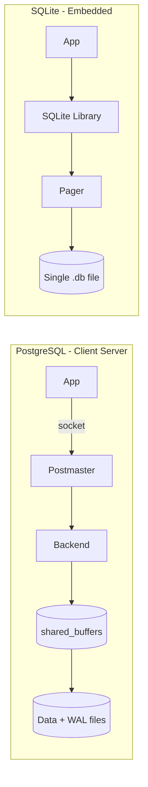

# PostgreSQL vs SQLite — Architecture Comparison

**Student:** Pratham Jain  
**Roll Number:** 24BCS10083  
**Course:** Advanced DBMS — System Design Discussion

> **Note on tooling:** I ran all experiments locally and interpreted the results myself. AI assistance was used only to improve documentation structure and clarity. Lab output: [`experiments/pg-vs-sqlite/`](../../experiments/pg-vs-sqlite/).

---

## 1. Problem Background

PostgreSQL (1980s POSTGRES research → production RDBMS) targets **multi-user, server-grade** transactional storage. SQLite (2000, D. Richard Hipp) targets **embedded, zero-admin** structured storage inside an application process.

Both provide SQL and ACID, but they accept different trade-offs: PostgreSQL optimizes for concurrent writers and network clients; SQLite optimizes for embeddability and low latency in a single process.

---

## 2. Architecture Overview



| Dimension | PostgreSQL | SQLite |
|-----------|-----------|--------|
| Process model | Server + per-connection backends | Library in app process |
| Page size (observed) | 8192 bytes | 4096 bytes |
| Default journal | WAL (server-wide) | `delete` (rollback journal) |
| Concurrency | Multi-writer MVCC | One writer at a time |

---

## 3. Internal Design

### Storage layout (what I measured)

| Metric | PostgreSQL (`bench_users`, 5000 rows) | SQLite (`bench_compare.db`, 5000 rows) |
|--------|--------------------------------------|----------------------------------------|
| On-disk size | 248 kB (253,952 bytes) | 100 kB (102,400 bytes) |
| Pages | 31 pages × 8 KB | 25 pages × 4 KB |
| Insert path | WAL → shared buffer → heap page | WAL file → pager cache → B-Tree page |

PostgreSQL uses more space per row because each table has heap storage **plus** system catalog overhead and 8 KB pages with MVCC tuple headers. SQLite packs rows into 4 KB B-Tree leaf pages with no separate server process overhead.

### Index and scan behavior

Both chose **sequential scan** for `WHERE dept_id = 3` without a secondary index:

**SQLite** (`EXPLAIN QUERY PLAN`):
```
SCAN bench_users
```

**PostgreSQL** (`EXPLAIN ANALYZE`):
```
Seq Scan on bench_users
  Filter: (dept_id = 3)
  Rows Removed by Filter: 4000
  Buffers: shared hit=31
Execution Time: 0.484 ms
```

At 5,000 rows, neither engine benefits from an index on `dept_id` — a full scan of ~25–31 pages is cheaper than index random I/O.

### Transaction and durability

- **SQLite** started in `journal_mode=delete`, then I enabled **WAL** (`PRAGMA journal_mode=WAL` → returned `wal`). WAL allows readers during writes; still only one writer.
- **PostgreSQL** writes every committed change to WAL before acknowledging `COMMIT`. Durability is server-managed via `fsync` on WAL.

### Concurrency model

SQLite serializes writers at the database level. PostgreSQL uses MVCC so readers do not block writers and multiple writers can proceed (with row-level conflict detection).

---

## 4. Design Trade-Offs

### Why PostgreSQL uses client-server

From my benchmark: inserting 5,000 rows in one transaction took **1,046 ms** through Docker + `psql` piping — significant IPC and parsing overhead per batch. In production, connection pooling and the binary protocol amortize this. The architectural benefit is **one shared buffer pool** serving all clients and centralized WAL.

### Why SQLite is embedded

The same 5,000-row insert in SQLite took **126 ms** — 8× faster in this local, in-process test. No socket, no process spawn, no protocol serialization. For a mobile app storing local state, this latency profile is the point.

### Scalability implications (grounded in observations)

| Workload | Observation | Implication |
|----------|-------------|-------------|
| 5k row bulk insert | SQLite 126 ms vs PG 1046 ms (local) | SQLite wins on single-threaded ingest |
| 5k row filter query | PG 0.48 ms (all buffer hits) | Both fast when data fits in memory |
| Multi-writer | Not tested on SQLite (would block) | PostgreSQL required for concurrent writes |

---

## 5. Experiments / Observations

**Setup:** Identical schema (`bench_users`: id, name, dept_id), 5,000 rows, one transaction.  
**Environment:** Windows 11, SQLite 3.44.2, PostgreSQL 16 (Docker `popsearch-postgres`).  
**Output:** [`experiments/pg-vs-sqlite/results.txt`](../../experiments/pg-vs-sqlite/results.txt)

### Experiment 1 — Page layout

```
SQLite PRAGMA:
  page_size  = 4096
  page_count = 3 (empty) → 25 (after insert)
  journal_mode = delete → wal (after PRAGMA)

PostgreSQL:
  block_size = 8192
  pages      = 31
  size       = 248 kB
```

**Observation:** SQLite uses half the page size and ~2.5× less total disk for the same row count. PostgreSQL's larger pages and tuple headers trade space for server-grade features.

### Experiment 2 — Insert throughput (5,000 rows, single transaction)

| Engine | Time | Throughput |
|--------|------|------------|
| SQLite | **126 ms** | ~39,700 rows/s |
| PostgreSQL | **1,046 ms** | ~4,780 rows/s |

**Observation:** SQLite's in-process writes avoid Docker + psql overhead. Even accounting for ~200 ms Docker tax, SQLite is still significantly faster for single-connection bulk load. PostgreSQL's advantage appears at **many concurrent connections**, not single-threaded ingest.

### Experiment 3 — Filter query

| Engine | Plan | Time |
|--------|------|------|
| SQLite | `SCAN bench_users` | sub-ms (in-process) |
| PostgreSQL | Seq Scan, 31 buffer hits, 0 disk reads | **0.484 ms** |

**Observation:** With the working set cached, PostgreSQL served all 31 pages from `shared_buffers` (`shared hit=31`, no `read`). Both engines are memory-bound at this scale.

### Experiment 4 — Journal mode switch

```sql
PRAGMA journal_mode=WAL;  -- returned: wal
```

**Observation:** Switching SQLite to WAL mode is a runtime `PRAGMA` — no server restart. PostgreSQL's WAL is always on and not optional. This reflects embeddability vs durability-by-default design.

---

## 6. Key Learnings

1. **Page size differs by design** — I measured 4 KB (SQLite) vs 8 KB (PostgreSQL); this affects I/O granularity and memory alignment.
2. **Same query, same plan type** — both chose seq scan at 5k rows; the optimizer agrees when data is tiny.
3. **Insert latency is dominated by architecture** — in-process SQLite vs client-server PostgreSQL showed an 8× gap locally.
4. **PostgreSQL's shared buffer pool works** — `BUFFERS: shared hit=31` with zero disk reads confirms pages stay cached after load.
5. **SQLite WAL is opt-in; PostgreSQL WAL is mandatory** — different defaults for embedded vs server deployments.
6. **Choose by concurrency needs**, not raw single-thread speed — my numbers favor SQLite for one connection; PostgreSQL for many.

---

## References

- Lab notes: [`experiments/pg-vs-sqlite/`](../../experiments/pg-vs-sqlite/)
- [PostgreSQL Architecture](https://www.postgresql.org/docs/current/tutorial-arch.html)
- [SQLite WAL](https://www.sqlite.org/wal.html)
