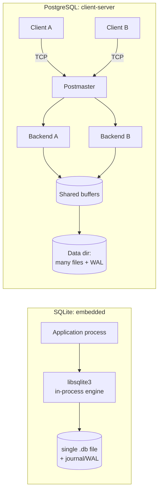

# PostgreSQL vs SQLite: Architecture Comparison

> Two excellent relational databases built for opposite worlds. PostgreSQL is a **client-server** engine for many concurrent users; SQLite is an **embedded** library that runs inside your application process. This document compares their architecture, storage, and concurrency, with live experiments on **PostgreSQL 16.14** (Docker) and **SQLite 3.44**.

---

## 1. Problem Background

The two systems answer different questions.

**SQLite** (D. Richard Hipp, 2000) was created to be a database with *no separate server*, a self-contained library you link into a program, storing the whole database in a single ordinary file. Its goal: replace `fopen()`, not Oracle. It needed to be zero-administration, transactional, and tiny enough to ship on phones and embedded devices.

**PostgreSQL** (Berkeley POSTGRES, 1986 →) was built to be a *shared* database server: a long-running process that many remote clients connect to over a network, with strong concurrency, rich types, and enterprise durability/replication.

So the central architectural fork is **who owns the database process**: in SQLite the application *is* the database engine; in PostgreSQL the engine is a separate server the application talks to.

---

## 2. Architecture Overview



| Aspect | SQLite | PostgreSQL |
|---|---|---|
| Deployment | Library linked into app; no server | Separate server process(es) |
| Connection | Function calls (same address space) | Network protocol (libpq / TCP) |
| Concurrency unit | The whole database file | Individual rows |
| Storage | **One file** | A **directory** of many files |
| Page size (default) | **4096 B** (measured) | **8192 B** (measured) |
| Best at | Single-app, embedded, read-mostly | Many concurrent users, mixed R/W |

---

## 3. Internal Design

### 3.1 Process & connection model

**SQLite** has no process of its own. SQL executes on the calling thread inside `libsqlite3`; "connecting" is opening a file. There is no IPC, no network, no background workers. This is why it has *zero configuration* and near-zero connection latency, but also why it cannot serve remote clients or scale writes across cores.

**PostgreSQL** runs a supervisor (postmaster) that forks one **backend process per connection**, all sharing a common buffer pool and WAL. This costs memory per connection (hence connection poolers like PgBouncer) but gives true multi-user concurrency and process-level isolation.

### 3.2 Storage layout: one file vs a directory

**Experiment: SQLite is literally one file:**
```text
$ ls -la demo.db
-rw-------  8134656  demo.db        # entire DB: tables + indexes + catalog, ~8 MB
page_size  = 4096
page_count = 1986
```
Everything, every table, index, and the schema catalog (`sqlite_master`), lives in that single file as a tree of 4 KB pages. Each table is a **B-tree keyed by `rowid`** (SQLite is fundamentally a B-tree store); indexes are separate B-trees. This makes a SQLite database trivially copyable and backupable: `cp demo.db backup.db`.

**Experiment: PostgreSQL is a directory tree:**
```text
$ ls $PGDATA
base/  global/  pg_wal/  pg_xact/  pg_stat/  postgresql.conf  ...
$ ls $PGDATA/base          # one subdir per database (OID-named)
1  4  5  16384
$ ls -la $PGDATA/pg_wal    # WAL segments, 16 MB each
16777216  000000010000000000000001
16777216  000000010000000000000002
block_size = 8192
```
Each table/index is its own file (or set of 1 GB segments) under `base/<dboid>/`, pages are 8 KB, and durability flows through a dedicated `pg_wal/` directory of 16 MB segments. Backups need tooling (`pg_dump`, base backup + WAL), the price of a multi-file, multi-user layout.

### 3.3 Table & index storage

- **SQLite:** rows are stored *in* the rowid B-tree leaves (a clustered/index-organized layout). A `PRIMARY KEY INTEGER` *is* the rowid, so primary-key lookups are direct B-tree descents.
- **PostgreSQL:** rows live in an unordered **heap**; all indexes (including the primary key) are separate B-trees that point at heap TIDs. No clustering by default. (PostgreSQL's MVCC and `xmin/xmax` tuple model is covered in depth in the *PostgreSQL Internals* document.)

### 3.4 Concurrency control: the defining difference

This is where the two architectures diverge most sharply.

**SQLite uses database-level locking: one writer at a time, for the whole file.** In the default *rollback-journal* mode a writer takes an EXCLUSIVE lock; in *WAL mode* readers no longer block the writer, but **there is still only one writer**. A second writer gets `SQLITE_BUSY` ("database is locked").

**Experiment: second writer is rejected in both journal modes:**
```text
=== rollback journal ===          === WAL ===
journal_mode = delete             journal_mode = wal
writer A: holding write lock      writer A: holding write lock
writer B: BLOCKED -> database is locked   writer B: BLOCKED -> database is locked
reader : SUCCEEDED, sees v=0      reader : SUCCEEDED, sees v=0 (snapshot)
```
Even in WAL mode, writer B is blocked while A holds the write lock, SQLite serializes *all* writers globally. (WAL mode's win is that the *reader* never blocks.)

**PostgreSQL uses row-level locking + MVCC: many concurrent writers, conflicting only on the same row.**

**Experiment: concurrent writers in PostgreSQL:**
```text
Writer A: BEGIN; UPDATE row 1; (holds txn ~2s)
Writer B: UPDATE row 2  (different row)  -> finished in 0.147 s   (no wait)
Writer C: UPDATE row 1  (same row)       -> finished in 1.485 s   (waited for A)
final: row1.v = 2 (A+C),  row2.v = 1 (B)   -- all three writers succeeded
```
Writer B touched a *different* row and proceeded immediately; Writer C touched the *same* row as A and waited ~1.5 s for A's commit. PostgreSQL only serializes writers that actually conflict, everyone else runs in parallel.

### 3.5 Durability

Both are ACID and both use write-ahead logging, but at different scales:
- **SQLite:** durability via a **rollback journal** (default: copy original pages out, restore on crash) or **WAL** (append changes, checkpoint later). A single small file alongside the database.
- **PostgreSQL:** a full **WAL subsystem** with 16 MB segments, checkpoints, archiving, point-in-time recovery, and streaming replication to standby servers, built for continuous operation and HA.

---

## 4. Design Trade-Offs

| | SQLite | PostgreSQL |
|---|---|---|
| **Strength** | Zero-config, in-process, one-file, blazing for single-user/read-mostly | Massive concurrency, rich SQL/types, replication, extensibility |
| **Concurrency** | One writer at a time (whole DB) | Many concurrent writers (row-level + MVCC) |
| **Scalability** | Bounded by one machine/one writer | Scales to thousands of connections, multi-core, read replicas |
| **Operational cost** | None (it's a library) | Needs a server, tuning, pooling, backups |
| **Network** | None (can't serve remote clients) | Native client-server over TCP |
| **Footprint** | ~1 MB library, runs on a phone | Multi-process server, MBs of RAM minimum |
| **Failure isolation** | Shares the app's process | Backend crash is isolated by the postmaster |

**The core trade-off:** SQLite optimizes for *simplicity and locality* by collapsing the database into the application and a single file, at the cost of write concurrency and remote access. PostgreSQL optimizes for *concurrency and scale* by running a shared server, at the cost of setup, memory, and operational complexity.

---

## 5. Experiments / Observations

All four experiments are reproduced above; summarised:

| # | What it shows | Result |
|---|---|---|
| 1 | SQLite storage footprint | Whole DB = **one 8 MB file**, 4096-B pages, 1986 pages |
| 2 | PostgreSQL storage footprint | A **directory tree**: per-DB dirs in `base/`, 16 MB WAL segments, 8192-B pages |
| 3 | SQLite write concurrency | Second writer **BLOCKED** ("database is locked") in *both* rollback & WAL modes |
| 4 | PostgreSQL write concurrency | Different-row writer: **0.147 s** (no wait); same-row writer: **1.485 s** (waited for lock), all succeeded |

**Query-plan note:** SQLite's `EXPLAIN QUERY PLAN` for the same join produced `SCAN o`, `SEARCH c USING INTEGER PRIMARY KEY`, `USE TEMP B-TREE FOR GROUP BY`, a simple nested-loop strategy. PostgreSQL's planner chose **parallel hash joins** with 2 worker processes (see the *PostgreSQL Internals* document). SQLite has no parallel execution; PostgreSQL parallelises across backends, a direct consequence of the embedded-vs-server split.

---

## 6. Key Learnings

- **The architecture follows the deployment goal.** "Embedded library" forces a single file and in-process execution; "shared server" forces a directory layout, a process model, and network protocol. Almost every other difference cascades from this one choice.
- **Concurrency is the headline difference, and it's measurable.** SQLite serializes *all* writers (database lock); PostgreSQL serializes only *conflicting* writers (row lock + MVCC). The 0.147 s vs 1.485 s split made this concrete.
- **WAL mode in SQLite helps readers, not writers.** A common misconception is that WAL gives SQLite multi-writer concurrency, the experiment shows the second writer is still blocked.
- **"Best database" is the wrong question.** SQLite wins on phones, browsers, edge devices, and read-heavy single-app workloads precisely *because* it has no server. PostgreSQL wins for multi-user backends precisely *because* it does.
- **Surprising observation:** SQLite copies its entire database with `cp` and stores tables *inside* their primary-key B-tree (index-organized), while PostgreSQL keeps rows in an unordered heap with separate index B-trees, opposite storage philosophies that explain SQLite's fast PK lookups and PostgreSQL's flexible indexing.

### Why SQLite suits mobile apps
No server to run, the whole DB is one file the OS can sandbox per-app, the library is ~1 MB, and a phone app has essentially **one writer** (itself), exactly the workload SQLite's single-writer model is optimal for.

### Why PostgreSQL suits large multi-user systems
Hundreds of clients write concurrently; row-level MVCC lets them proceed in parallel, the client-server model serves them over the network, and WAL-based replication provides high availability, none of which an in-process single-writer library can offer.

---

### Reproducing
```bash
# PostgreSQL
docker run -d --name pg -e POSTGRES_PASSWORD=postgres -p 5439:5432 postgres:16
# SQLite (already on macOS)
sqlite3 demo.db   # then PRAGMA page_size; PRAGMA journal_mode; etc.
```
*Engines: PostgreSQL 16.14 (Docker), SQLite 3.44.4. The concurrency tests used the Python `sqlite3` module and `psql` with overlapping transactions. Sources: SQLite documentation ("How SQLite Is Tested", "Write-Ahead Logging", file-format spec) and PostgreSQL 16 documentation.*
