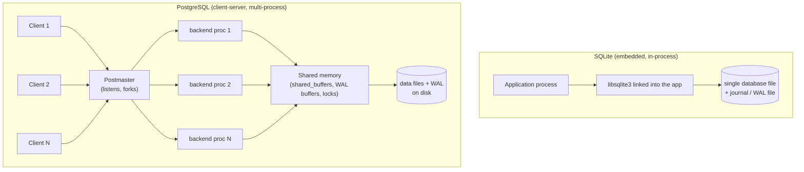

# PostgreSQL vs SQLite: An Architecture Comparison

> Author: Gauri Shukla (24BCS10115)
> Every number, query plan, and lock trace in this document was produced on my own machine (PostgreSQL 16.14 and SQLite 3.51.0 on macOS, Apple Silicon). The SQL and the raw captured output are in this folder if you want to reproduce them.

## 1. Problem Background

Both PostgreSQL and SQLite are relational databases that speak SQL, but they were built to solve very different problems, and almost every architectural difference between them comes back to that.

SQLite started in 2000 as a library that needed to run on a guided missile destroyer, where there was no database server to talk to and the program had to manage its own data on local disk. The whole point was "a database that is just a file, with no server, no setup, and no separate process." That design goal is why SQLite is today the most widely deployed database engine in the world: it ships inside every Android and iOS phone, every browser, and countless desktop apps.

PostgreSQL comes from the POSTGRES project at Berkeley in the 1980s. Its goal was the opposite end of the spectrum: a full multi-user database server that many clients connect to over a network at the same time, with strong concurrency, rich data types, and the durability guarantees a serious application needs. It is the database you reach for when many users hit the same data concurrently.

So the honest one-line summary is: **SQLite is a library you embed, PostgreSQL is a server you connect to.** The rest of this document is really just the consequences of that one decision.

## 2. Architecture Overview



The key contrast is the process model. In SQLite there is no database process at all. Your application calls a function, that function reads and writes a file, and it returns. In PostgreSQL there is a permanent server. A supervisor process (the postmaster) listens for connections and forks a dedicated backend process for each client. All those backends coordinate through a big shared memory region.

| Aspect | SQLite | PostgreSQL |
|---|---|---|
| Deployment | Library linked into the app | Separate server process(es) |
| Process model | Runs in the application's process | One postmaster + one backend process per connection + shared memory |
| Client access | Direct function calls | Network/socket protocol |
| The database | One file on disk | A directory tree of files managed by the server |
| Configuration | None to speak of | Server config, users, roles, tuning |
| Concurrency unit | The whole file | Row versions, fine-grained locks |

## 3. Internal Design

### Storage layout

SQLite stores the entire database (all tables, all indexes, the schema) in **one file**, organized as a single set of fixed-size pages. I confirmed the page size and the file header directly:

```
$ hexdump -C shop.db | head -1
00000000  53 51 4c 69 74 65 20 66  6f 72 6d 61 74 20 33 00  |SQLite format 3.|

PRAGMA page_size  -> 4096
PRAGMA page_count -> 2510      (my 50k-customer / 200k-order test DB was ~9.8 MB)
```

Every table in SQLite is a B-tree keyed by `rowid`, and indexes are separate B-trees. The first 16 bytes of any SQLite file are literally the ASCII string `SQLite format 3`, which is how the format stays stable and portable across machines.

PostgreSQL stores each table and each index as its **own file** (actually a set of 1 GB segments) inside a per-database directory. The unit is an 8 KB page. A table is a "heap": rows are not kept in any particular order, they are just appended into pages. Indexes are separate structures (a B-tree by default) that point back into the heap by physical location.

This is the first deep difference. In SQLite the table *is* a B-tree ordered by rowid. In PostgreSQL the table is an unordered heap and the index is a side structure.

### Indexing, and a query plan that surprised me

Both use B-trees. I built the same dataset in both and watched the plans.

In SQLite, before I added an index on `orders.customer_id`, the join scanned orders fully. After `CREATE INDEX`, the plan flipped to a covering index search:

```
-- before index
QUERY PLAN
|--SCAN o
|--SEARCH c USING INTEGER PRIMARY KEY (rowid=?)
`--USE TEMP B-TREE FOR GROUP BY

-- after CREATE INDEX idx_orders_cust
QUERY PLAN
|--SCAN c
`--SEARCH o USING COVERING INDEX idx_orders_cust (customer_id=?)
```

In PostgreSQL I ran the recommended `EXPLAIN ANALYZE` on a three-table join. The interesting part: **adding indexes did not change the plan.** Postgres stuck with parallel sequential scans feeding a hash join:

```
Finalize GroupAggregate (actual time=25.794..26.702 rows=1)
  -> Gather  Workers Launched: 1
       -> Parallel Hash Join  (actual time=13.996..23.162 rows=20000)
            -> Parallel Seq Scan on order_items
            -> Parallel Hash
                 -> Hash Join
                      -> Parallel Seq Scan on orders
                      -> Seq Scan on customers  Filter: (city = 'Pune')
                         Rows Removed by Filter: 40000
Execution Time: 26.752 ms
```

That looked wrong at first, but it is correct. The filter `city='Pune'` matches one city out of five, so about 20% of customers, and the join touches a large fraction of orders. When you are going to read 20% of a table anyway, a sequential scan plus a hash join is genuinely cheaper than millions of random index lookups. The optimizer knew this because of statistics (more on that in the internals topic). The takeaway: an index is not free and is not always used, and a good planner refuses to use one when a scan wins.

### Concurrency: the single biggest difference

This is where the two systems are most different, and I demonstrated it directly.

**SQLite uses one lock for the whole database file.** Only one writer can be active at a time. In the default rollback-journal mode I opened a write transaction in connection A and tried to write from connection B:

```
conn A: acquired write lock, transaction open (not yet committed)
conn B: write BLOCKED -> database is locked
conn C (reader): (10.0,)   # a reader could still read the old committed value
```

Switching to WAL mode (`PRAGMA journal_mode=WAL`) lets readers run while a writer is active, but it still allows only one writer:

```
journal_mode set to: wal
conn A: write transaction open (WAL)
conn C (reader) during open write txn: (10.0,)  -> reader NOT blocked in WAL
conn B (second writer): still BLOCKED -> database is locked  (WAL still allows only ONE writer)
```

**PostgreSQL uses MVCC (Multi-Version Concurrency Control)** so that readers and writers almost never block each other, and many writers can work concurrently as long as they touch different rows. I proved the reader-isolation half with two sessions. Session A opened a `REPEATABLE READ` transaction and read a value, session B changed that value and committed, and A kept seeing its original snapshot until A itself committed:

```
[A] BEGIN REPEATABLE READ; first read -> total = 20.00
[B] update order 10 to 99999 and COMMIT
[A] second read AFTER B committed         -> total = 20.00   (snapshot held)
[A] COMMIT, then read again               -> total = 99999.00 (now sees B's change)
```

B's write never blocked A's read, and A saw a stable, consistent view of the database for the life of its transaction. SQLite cannot do this for concurrent writers because the file lock serializes them.

### Durability

SQLite's default is a **rollback journal**: before modifying a page it copies the original page into a `-journal` file, so a crash mid-write can be rolled back. Its WAL mode flips this around and writes changes to a `-wal` file first. Either way the guarantee is that a committed transaction survives a crash.

PostgreSQL uses **Write-Ahead Logging (WAL)**: the change is written to the WAL and flushed to disk before the data pages are. On restart after a crash it replays the WAL to recover. During my Postgres run the WAL position advanced and the server reported tens of MB of WAL generated by a bulk update, which is the durability machinery doing its job.

## 4. Design Trade-Offs

| Dimension | SQLite | PostgreSQL |
|---|---|---|
| Setup cost | Zero, it is a file | Install, configure, run a server |
| Concurrent writers | One at a time (file lock) | Many, via MVCC + row locks |
| Concurrent readers | Many (especially WAL) | Many, never blocked by writers |
| Footprint | ~1 MB library, no daemon | Server process, shared memory, background workers |
| Network access | No, in-process only | Yes, the whole point |
| Crash recovery | Journal / WAL on the one file | WAL replay across all files |
| Best fit | Embedded, single-app, edge, on-device | Multi-user, server-side, concurrent workloads |

The way I think about it: SQLite trades concurrency for simplicity, and PostgreSQL trades simplicity for concurrency. Neither is "better." They optimize for different points.

A few honest limitations on each side. SQLite's whole-file write lock means that a workload with many concurrent writers will serialize and stall, which is exactly why you would not put it behind a busy web server. PostgreSQL's per-connection process model means each connection costs real memory, which is why production deployments almost always sit behind a connection pooler. And PostgreSQL's MVCC leaves dead row versions behind that have to be cleaned up by VACUUM, a cost SQLite simply does not have.

## 5. Experiments and Observations

All of these are reproducible from the files in this folder.

1. **Same schema, both engines.** 50,000 customers, 200,000 orders, 200,000 order items. SQLite loaded it in 0.18 s into a 9.8 MB file. Postgres loaded it and reported `orders` at 14 MB and `order_items` at 13 MB as separate relations.
2. **Query planning differs in character.** SQLite picks index-vs-scan per table with a compact plan. Postgres produced a parallel hash join and, importantly, declined to use a newly added index because a scan was cheaper for a non-selective predicate (`Rows Removed by Filter: 40000`).
3. **SQLite concurrency is file-level.** A second writer got `database is locked`. WAL mode let readers run during a write but still allowed only one writer. (`sqlite_concurrency.txt`)
4. **PostgreSQL concurrency is MVCC.** A committed write by one transaction was invisible to a concurrent `REPEATABLE READ` transaction until the latter ended, and the two never blocked each other. (`postgres_concurrency.txt`)
5. **Storage shape.** SQLite is one file with a `SQLite format 3` header and 4 KB pages. Postgres is a directory of 8 KB-page files, one per table and index.

Files:
- `sqlite_setup.sql`, `postgres_setup.sql`: the shared dataset
- `sqlite_results.txt`: header, page geometry, plans, VDBE bytecode
- `sqlite_concurrency.txt`: locking and WAL behavior
- `postgres_concurrency.txt`: snapshot isolation demo

## 6. Key Learnings

- Almost every difference between these two databases is downstream of one decision: embedded library vs client-server. Once you know which one a system is, you can predict most of its behavior.
- "Single writer" is not a bug in SQLite, it is the price of having no server and no inter-process coordination. For the on-device, single-app workloads SQLite targets, there usually is only one writer anyway.
- MVCC is what lets PostgreSQL give every transaction a stable snapshot without blocking. I found it genuinely surprising to watch session A keep reading the old value while B had already committed the new one.
- A query optimizer that refuses to use an index can be smarter than one that always does. Watching Postgres reject my index because a scan was cheaper for 20% selectivity made the cost model click for me.
- The right question is never "which database is better" but "which set of trade-offs matches my workload." A phone app and a multi-tenant web backend want opposite things, and these two engines are each almost perfectly shaped for one of them.

### References
- SQLite, "Database File Format" and "Write-Ahead Logging": https://www.sqlite.org/fileformat2.html , https://www.sqlite.org/wal.html
- SQLite, "Appropriate Uses For SQLite": https://www.sqlite.org/whentouse.html
- PostgreSQL 16 Documentation, "Concurrency Control" (MVCC) and "Reliability and the Write-Ahead Log": https://www.postgresql.org/docs/16/mvcc.html , https://www.postgresql.org/docs/16/wal-intro.html
